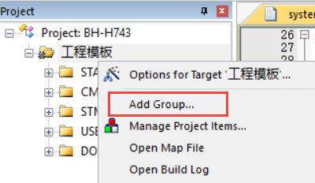

新建工程—库函数版
-----------------

了解STM32的HAL库文件之后，我们就可以使用它来建立工程了，因为用库新建工程的步骤较多，我们一般是使用库建立一个空的工程，作为工程模板。以后直接复制一份工程模板，在它之上进行开发。

新建工程
~~~~~~~~

版本说明：MDK5.15 (MDK即KEIL软件)

版本号可从MDK软件的“Help-->About uVision”选项中查询到。

新建本地工程文件夹
^^^^^^^^^^^^^^^^^^

为了工程目录更加清晰，我们在本地电脑上新建一个“工程模板”文件夹，在它之下再新建6个文件夹，具体如下：

表 11‑1 工程目录文件夹清单

+-----------+-----------------------------------------------------+
| 名称      | 作用                                                |
+===========+=====================================================+
| Doc       | 用来存放程序说明的文件，由写程序的人添加            |
+-----------+-----------------------------------------------------+
| Libraries | 存放的是库文件                                      |
+-----------+-----------------------------------------------------+
| Listing   | 存放编译器编译时候产生的C/汇编/链接的列表清单       |
+-----------+-----------------------------------------------------+
| Output    | 存放编译产生的调试信息、hex文件、预览信息、封装库等 |
+-----------+-----------------------------------------------------+
| Project   | 用来存放工程                                        |
+-----------+-----------------------------------------------------+
| User      | 用户编写的驱动文件                                  |
+-----------+-----------------------------------------------------+

.. image:: media/image1.png
   :align: center
   :alt: 图 11‑1 工程文件夹目录
   :name: 图11_1

图 11‑1 工程文件夹目录

在本地新建好文件夹后，把准备好的库文件添加到相应的文件夹下：

表 11‑2 工程目录文件夹内容清单

+-----------+----------------------------------------------------------+
| 名称      | 作用                                                     |
+===========+==========================================================+
| Doc       | 工程说明.txt                                             |
+-----------+----------------------------------------------------------+
| Libraries | CMSIS：里面放着跟CM7内核有关的库文件                     |
+-----------+----------------------------------------------------------+
|           | STM32h7xx_HAL_Driver：STM32 外设库文件                   |
+-----------+----------------------------------------------------------+
| Listing   | 暂时为空                                                 |
+-----------+----------------------------------------------------------+
| Output    | 暂时为空                                                 |
+-----------+----------------------------------------------------------+
| Project   | 暂时为空                                                 |
+-----------+----------------------------------------------------------+
| User      | stm32h7xx_hal_conf.h：用来配置库的头文件                 |
+-----------+----------------------------------------------------------+
|           | stm32h7xx_it.h                                           |
|           | stm32h7xx_it.c：中断相关的函数都在这个文件编写，暂时为空 |
+-----------+----------------------------------------------------------+
|           | main.c：main函数文件                                     |
+-----------+----------------------------------------------------------+

新建工程
^^^^^^^^

打开KEIL5，新建一个工程，工程名根据喜好命名，我这里取LED-LIB，保存在Project\RVMDK（uv5）文件夹下。

图 11‑2 在KEIL5中新建工程

选择CPU型号
'''''''''''

这个根据你开发板使用的CPU具体的型号来选择， M7挑战者选STM32H743IIT6型号。
如果这里没有出现你想要的CPU型号，或者一个型号都没有，那么肯定是你的KEIL5没有添加device库，
KEIL5不像KEIL4那样自带了很多MCU的型号，KEIL5需要自己添加，
关于如何添加请参考《如何安装KEIL5》这一章。

图 11‑3 选择具体的CPU型号

在线添加库文件
''''''''''''''

等下我们手动添加库文件，这里我们点击关掉。

.. image:: media/image4.png
   :align: center
   :alt: 图 11‑4 库文件管理
   :name: 图11_4

图 11‑4 库文件管理

添加组文件夹
''''''''''''

在新建的工程中添加5个组文件夹，用来存放各种不同的文件，文件从本地建好的工程文件夹下获取，双击组文件夹就会出现添加文件的路径，然后选择文件即可。

表 11‑3 工程内组文件夹内容清单

+----------------------+------------------------------------------------------------+
|         名称         |                            作用                            |
+======================+============================================================+
| STARTUP              | 存放汇编的启动文件：startup_STM32H743xx.s                  |
+----------------------+------------------------------------------------------------+
| STM32h7xx_HAL_Driver | 与STM32外设相关的库文件                                    |
|                      |                                                            |
|                      | stm32h7xx_hal.c                                            |
|                      |                                                            |
|                      | stm32h7xx_hal_ppp.c（ppp代表外设名称）                     |
+----------------------+------------------------------------------------------------+
| USER                 | 用户编写的文件：                                           |
|                      |                                                            |
|                      | main.c：main函数文件，暂时为空                             |
|                      |                                                            |
|                      | stm32h7xx_it.c：跟中断有关的函数都放这个文件，暂时为       |
|                      | 空                                                         |
+----------------------+------------------------------------------------------------+
| DOC                  | 工程说明.txt：程序说明文件，用于说明程序的功能和注意事项等 |
+----------------------+------------------------------------------------------------+

图 11‑5 如何在工程中添加文件夹

添加文件
''''''''

先把上面提到的文件从STHAL库中复制到工程模版对应文件夹的目录下，然后在新建的工程中添加这些文件，双击组文件夹就会出现添加文件的路径，然后选择文件即可。

图 11‑6 如何在工程中添加文件

设置文件是否加入编译
''''''''''''''''''''

STM32H743外设比较丰富，它的库文件比较庞大，在添加外设文件时，为了减少编译时间。我们把外设库的所有文件都添加进工程，使用下面的方法把暂时没有用到的库文件，设置为不加入编译，这样就不会对特定文件进行编译。这种设置在开发时也很常用，暂时不把文件加进编译，方便调试，加快开发进度。

图 11‑7 设置文件是否加入编译

配置魔术棒选项卡
''''''''''''''''

这一步的配置工作很重要，很多人串口用不了printf函数，编译有问题，下载有问题，都是这个步骤的配置出了错。

(1) Target中选中微库“ Use
    MicroLib”，为的是在日后编写串口驱动的时候可以使用printf函数。而且有些应用中如果用了STM32的浮点运算单元FPU，一定要同时开微库，不然有时会出现各种奇怪的现象。FPU的开关选项在微库配置选项下方的“Use
    double Precision”中，默认是开的。

图 11‑8 添加微库

(2) 在Output选项卡中把输出文件夹定位到我们工程目录下的“output”文件夹，如果想在编译的过程中生成hex文件，那么那Create
    HEX File选项勾上。

图 11‑9配置 Output 选项卡

(3) 在Listing选项卡中把输出文件夹定位到我们工程目录下的“Listing”文件夹。

图 11‑10配置 Listing 选项卡

(4) 在C/C++选项卡中添加处理宏及编译器编译的时候查找的头文件路径。

图 11‑11配置 C/C++ 选项卡

在这个选项中添加宏，就相当于我们在文件中使用“#define”语句定义宏一样。在编译器中添加宏的好处就是，只要用了这个模版，就不用源文件中修改代码。

-  STM32H743xx宏：为了告诉STM32
   HAL库，我们使用的芯片是STM32H743型号，使STM32
   HAL库根据我们选定的芯片型号来配置。

-  USE_HAL_DRIVER宏：为了让STM32H743xx.h包含stm32h7xx_hal_conf.h这个头文件。

“Include Paths
”这里添加的是头文件的路径，如果编译的时候提示说找不到头文件，一般就是这里配置出了问题。你把头文件放到了哪个文件夹，就把该文件夹添加到这里即可。(请使用图中的方法用文件浏览器去添加路径，不要直接手打路径，容易出错)

下载器配置
''''''''''

本书使用的仿真器是Fire-Debugger，可下载和仿真程序。Fire-Debugger支持XP/WIN7/WIN8/WIN10这几个操作系统，无需安装驱动，免驱，使用非常方便，具体配置见如下图。

.. image:: media/image12.png
   :align: center
   :alt: 图 11‑12 Debug中选择 CMSIS-DAP Debugger
   :name: 图11_12

图 11‑12 Debug中选择 CMSIS-DAP Debugger

.. image:: media/image13.png
   :align: center
   :alt: 图 11‑13 Utilities选择 Use Debug Driver
   :name: 图11_13

图 11‑13 Utilities选择 Use Debug Driver

.. image:: media/image14.jpeg
   :align: center
   :alt: 图 11‑14 Settings 选项配置
   :name: 图11_14

图 11‑14 Settings 选项配置

选择CPU型号
'''''''''''

这一步的配置也不是配置一次之后完事，常常会因为各种原因需要重新选择，当你下载的时候，提示说找不到Device的时候，请确保该配置是否正确。有时候下载程序之后，不会自动运行，要手动复位的时候，也回来看看这里的“Reset
and
Run”配置是否失效。M7挑战者用的STM32的FLASH大小是2M，所以这里选择2M的容量，如果使用的是其他型号的，要根据实际情况选择。

图 11‑15 选择芯片型号

一个新的工程模版新建完毕。
