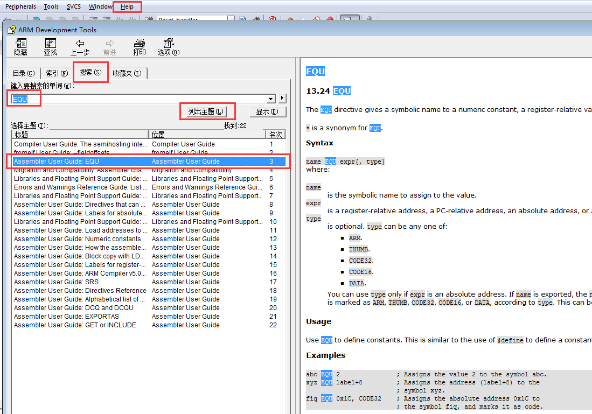
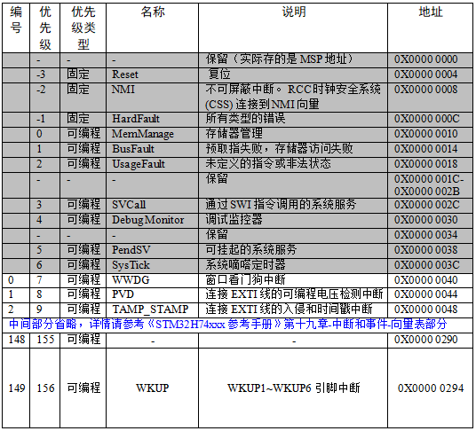
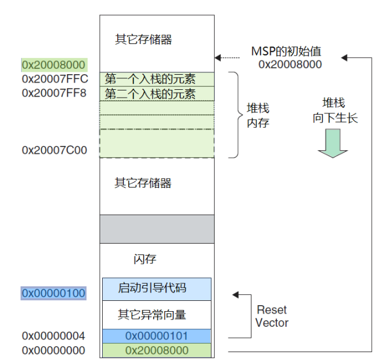

.. vim: syntax=rst

启动文件详解
------------

本章参考资料《STM32H743用户手册》第十九章-中断和事件：表 130. STM32H74xxx的向量表；
MDK中的帮助手册—ARM Development Tools：用来查询ARM的汇编指令和编译器相关的指令。

启动文件简介
~~~~~~~~~~~~

启动文件由汇编编写，是系统上电复位后第一个执行的程序。主要做了以下工作：

1. 初始化堆栈指针SP=_initial_sp

2. 初始化PC指针=Reset_Handler

3. 初始化中断向量表

4. 配置系统时钟

5. 调用C库函数_main初始化用户堆栈，从而最终调用main函数去到C的世界

查找ARM汇编指令
~~~~~~~~~~~~~~~

在讲解启动代码的时候，会涉及到ARM的汇编指令和Cortex内核的指令，有关Cortex内核的指令我们可以参考《CM3权威指南CnR2》第四章：指令集。剩下的ARM的汇编指令我们可以在MDK->Help->Uvision
Help中搜索到，以EQU为例，检索如下：

检索出来的结果会有很多，我们只需要看Assembler User Guide
这部分即可。下面列出了启动文件中使用到的ARM汇编指令，该列表的指令全部从ARM
Development
Tools这个帮助文档里面检索而来。其中编译器相关的指令WEAK和ALIGN为了方便也放在同一个表格了。

表格 14‑1 启动文件使用的ARM汇编指令汇总

+---------------+--------------------------------------------------------------------+
|   指令名称    |                                作用                                |
+===============+====================================================================+
| EQU           | 给数字常量取一个符号名，相当于C语言中的define                      |
+---------------+--------------------------------------------------------------------+
| AREA          | 汇编一个新的代码段或者数据段                                       |
+---------------+--------------------------------------------------------------------+
| SPACE         | 分配内存空间                                                       |
+---------------+--------------------------------------------------------------------+
| PRESERVE8     | 当前文件堆栈需按照8字节对齐                                        |
+---------------+--------------------------------------------------------------------+
| EXPORT        | 声明一个标号具有全局属性，可被外部的文件使用                       |
+---------------+--------------------------------------------------------------------+
| DCD           | 以字为单位分配内存，要求4字节对齐，并要求初始化这些内存            |
+---------------+--------------------------------------------------------------------+
| PROC          | 定义子程序，与ENDP成对使用，表示子程序结束                         |
+---------------+--------------------------------------------------------------------+
| WEAK          | 弱定义，如果外部文件声明了一个标号，则优先使用外部文件定义的标号， |
|               | 如果外部文件没有定义也不出错。要注意的是：这个不是ARM的指令，是    |
|               | 编译器的，这里放在一起只是为了方便。                               |
+---------------+--------------------------------------------------------------------+
| IMPORT        | 声明标号来自外部文件，跟C语言中的EXTERN关键字类似                  |
+---------------+--------------------------------------------------------------------+
| B             | 跳转到一个标号                                                     |
+---------------+--------------------------------------------------------------------+
| ALIGN         | 编译器对指令或者数据的存放地址进行对齐，一般需要跟一个立即数，缺省 |
|               | 表示4字节对齐。要注意的是：这个不是ARM的指令，是编译器的，这里     |
|               | 放在一起只是为了方便。                                             |
+---------------+--------------------------------------------------------------------+
| END           | 到达文件的末尾，文件结束                                           |
+---------------+--------------------------------------------------------------------+
| IF,ELSE,ENDIF | 汇编条件分支语句，跟C语言的if                                      |
|               | else类似                                                           |
+---------------+--------------------------------------------------------------------+

启动文件代码讲解
~~~~~~~~~~~~~~~~

Stack—栈
''''''''

.. code-block:: c

    Stack_Size     EQU    0x00000400

                AREA STACK, NOINIT, READWRITE, ALIGN=3

    Stack_Mem      SPACE Stack_Size

    __initial_sp

开辟栈的大小为0X00000400（1KB），名字为STACK，NOINIT即不初始化，可读可写，8（2^3）字节对齐。

栈的作用是用于局部变量，函数调用，函数形参等的开销，栈的大小不能超过内部SRAM的大小。如果编写的程序比较大，定义的局部变量很多，那么就需要修改栈的大小。如果某一天，你写的程序出现了莫名奇怪的错误，并进入了硬fault的时候，这时你就要考虑下是不是栈不够大，溢出了。

**EQU**\ ：宏定义的伪指令，相当于等于，类似与C中的define。

**AREA**\ ：告诉汇编器汇编一个新的代码段或者数据段。STACK表示段名，
这个可以任意命名；NOINIT表示不初始化；READWRITE表示可读可写，ALIGN=3，表示按照2^3对齐，即8字节对齐。

**SPACE**\ ：用于分配一定大小的内存空间，单位为字节。这里指定大小等于Stack_Size。

标号\ **\__initial_sp**\ 紧挨着SPACE语句放置，表示栈的结束地址，即栈顶地址，栈是由高向低生长的。

Heap堆
''''''

.. code-block:: c

    Heap_Size     EQU 0x00000200

                AREA HEAP, NOINIT, READWRITE, ALIGN=3

    __heap_base

                Heap_Mem SPACE Heap_Size

    __heap_limit

开辟堆的大小为0X00000200（512字节），名字为HEAP，NOINIT即不初始化，可读可写，8（2^3）字节对齐。__heap_base表示对的起始地址，__heap_limit表示堆的结束地址。堆是由低向高生长的，跟栈的生长方向相反。

堆主要用来动态内存的分配，像malloc()函数申请的内存就在堆上面。这个在STM32里面用的比较少。

.. code-block:: c

    PRESERVE8
    THUMB

**PRESERVE8：**\ 指定当前文件的堆栈按照8字节对齐。

**THUMB：**\ 表示后面指令兼容THUMB指令。THUBM是ARM以前的指令集，16bit，
现在Cortex-M系列的都使用THUMB-2指令集，THUMB-2是32位的，兼容16位和32位的指令，是THUMB的超集。

向量表
'''''''

.. code-block:: c

    AREA RESET, DATA, READONLY

    EXPORT __Vectors

    EXPORT __Vectors_End

    EXPORT __Vectors_Size

定义一个数据段，名字为RESET，可读。并声明
\__Vectors、__Vectors_End和__Vectors_Size这三个标号具有全局属性，可供外部的文件调用。

**EXPORT：**\ 声明一个标号可被外部的文件使用，使标号具有全局属性。如果是IAR编译器，则使用的是GLOBAL这个指令。

当内核响应了一个发生的异常后，对应的异常服务例程(ESR)就会执行。为了决定
ESR 的入口地址，
内核使用了“向量表查表机制”。这里使用一张向量表。向量表其实是一个 WORD（
32 位整数）数组，每个下标对应一种异常，该下标元素的值则是该 ESR
的入口地址。向量表在地址空间中的位置是可以设置的，通过 NVIC
中的一个重定位寄存器来指出向量表的地址。在复位后，该寄存器的值为
0。因此，在地址 0 （即FLASH
地址0）处必须包含一张向量表，用于初始时的异常分配。要注意的是这里有个另类：
0 号类型并不是什么入口地址，而是给出了复位后 MSP 的初值。

代码 14‑1 向量表

.. code-block::
   :name: 代码清单14_1

    __Vectors  DCD   __initial_sp        ;栈顶地址 
            DCD   Reset_Handler       ;复位程序地址
            DCD   NMI_Handler
            DCD   HardFault_Handler
            DCD   MemManage_Handler
            DCD   BusFault_Handler
            DCD   UsageFault_Handler
            DCD   0                    ; 0 表示保留
            DCD   0
            DCD   0
            DCD   0
            DCD   SVC_Handler
            DCD   DebugMon_Handler
            DCD   0
            DCD   PendSV_Handler
            DCD   SysTick_Handler

    ;外部中断开始
            DCD   WWDG_IRQHandler
            DCD   PVD_IRQHandler
            DCD   TAMP_STAMP_IRQHandler

    ;限于篇幅，中间代码省略
            DCD   CAN3_SCE_IRQHandler
            DCD   JPEG_IRQHandler
            DCD   MDIOS_IRQHandler
    __Vectors_End
    __Vectors_Size EQU __Vectors_End - __Vectors

__Vectors为向量表起始地址，__Vectors_End
为向量表结束地址，两个相减即可算出向量表大小。

向量表从FLASH的0地址开始放置，以4个字节为一个单位，地址0存放的是栈顶地址，0X04存放的是复位程序的地址，以此类推。从代码上看，向量表中存放的都是中断服务函数的函数名，可我们知道C语言中的函数名就是一个地址。

**DCD**\ ：分配一个或者多个以字为单位的内存，以四字节对齐，并要求初始化这些内存。在向量表中，DCD分配了一堆内存，并且以ESR的入口地址初始化它们。

复位程序
''''''''
.. code-block:: c

    1 AREA |.text|, CODE, READONLY

定义一个名称为.text的代码段，可读。

.. code-block:: c

     Reset_Handler PROC

                   EXPORT Reset_Handler [WEAK]

                   IMPORT SystemInit

                   IMPORT __main

                   LDR R0, =SystemInit

                   BLX R0

                   LDR R0, =__main

                   BX R0

                  ENDP

复位子程序是系统上电后第一个执行的程序，调用SystemInit函数初始化系统时钟，然后调用C库函数_mian，最终调用main函数去到C的世界。

**WEAK**\ ：表示弱定义，如果外部文件优先定义了该标号则首先引用该标号，如果外部文件没有声明也不会出错。
这里表示复位子程序可以由用户在其他文件重新实现，这里并不是唯一的。

**IMPORT**\ ：表示该标号来自外部文件，跟C语言中的EXTERN关键字类似。这里表示SystemInit和__main这两个函数均来自外部的文件。

SystemInit()是一个标准的库函数，在system_stm32f7xx.c这个库文件中定义。主要作用是配置系统时钟，这里调用这个函数之后，单片机的系统时钟配被配置为216M。

__main是一个标准的C库函数，主要作用是初始化用户堆栈，最终调用main函数去到C的世界。这就是为什么我们写的程序都有一个main函数的原因。
如果我们在这里不调用__main，那么程序最终就不会调用我们C文件里面的main，如果是调皮的用户就可以修改主函数的名称，
然后在这里面IMPORT你写的主函数名称即可。

.. code-block:: c

    Reset_Handler PROC
                  EXPORT  Reset_Handler    [WEAK]
                  IMPORT  SystemInit
                  IMPORT  user_main

                  LDR     R0, =SystemInit
                  BLX     R0
                  LDR     R0, =user_main
                  BX      R0
                  ENDP

这个时候你在C文件里面写的主函数名称就不是main了，而是user_main了。

LDR、BLX、BX是CM7内核的指令，可在《CM3权威指南CnR2》第四章-指令集里面查询到，具体作用见下表：

======== ===============================================================================================
指令名称  作用
LDR      从存储器中加载字到一个寄存器中
BL       跳转到由寄存器/标号给出的地址，并把跳转前的下条指令地址保存到LR
BLX      跳转到由寄存器给出的地址，并根据寄存器的LSE确定处理器的状态，还要把跳转前的下条指令地址保存到LR
BX       跳转到由寄存器/标号给出的地址，不用返回
======== ===============================================================================================

中断服务程序
''''''''''''

在启动文件里面已经帮我们写好所有中断的中断服务函数，跟我们平时写的中断服务函数不一样的就是这些函数都是空的，真正的中断复服务程序需要我们在外部的C文件里面重新实现，这里只是提前占了一个位置而已。

如果我们在使用某个外设的时候，开启了某个中断，但是又忘记编写配套的中断服务程序或者函数名写错，那当中断来临的时，程序就会跳转到启动文件预先写好的空的中断服务程序中，并且在这个空函数中无线循环，即程序就死在这里。

.. code-block::

    NMI_Handler     PROC    ;系统异常
                    EXPORT  NMI_Handler           [WEAK]
                    B       .
                    ENDP

    ;限于篇幅，中间代码省略
    SysTick_Handler PROC
                    EXPORT  SysTick_Handler       [WEAK]
                    B       .
                    ENDP

    Default_Handler PROC    ;外部中断
                    EXPORT  WWDG_IRQHandler       [WEAK]
                    EXPORT  PVD_IRQHandler        [WEAK]
                    EXPORT  TAMP_STAMP_IRQHandler [WEAK]

    ;限于篇幅，中间代码省略
    CAN3_SCE _IRQHandler
    JPEG _IRQHandler
    MDIOS_ IRQHandler
                    B       .
                    ENDP

**B**\ ：跳转到一个标号。这里跳转到一个‘.’，即表示无线循环。

用户堆栈初始化
''''''''''''''

ALIGN：对指令或者数据存放的地址进行对齐，后面会跟一个立即数。缺省表示4字节对齐。

.. code-block::

    ;用户栈和堆初始化
    IF      :DEF:__MICROLIB

    EXPORT  __initial_sp
    EXPORT  __heap_base
    EXPORT  __heap_limit

    ELSE

    IMPORT  __use_two_region_memory
    EXPORT  __user_initial_stackheap

    __user_initial_stackheap

    LDR     R0, =  Heap_Mem
    LDR     R1, =(Stack_Mem + Stack_Size)
    LDR     R2, = (Heap_Mem +  Heap_Size)
    LDR     R3, = Stack_Mem
    BX      LR

    ALIGN

    ENDIF
    END

判断是否定义了__MICROLIB
，如果定义了则赋予标号__initial_sp（栈顶地址）、__heap_base（堆起始地址）、__heap_limit（堆结束地址）全局属性，可供外部文件调用。如果没有定义（实际的情况就是我们没定义__MICROLIB）则使用默认的C库，然后初始化用户堆栈大小，这部分有C库函数__main来完成，当初始化完堆栈之后，就调用main函数去到C的世界。

**IF,ELSE,ENDIF**\ ：汇编的条件分支语句，跟C语言的if ,else类似

**END**\ ：文件结束

系统启动流程
~~~~~~~~~~~~

*下面这段话引用自《CM3权威指南CnR2》3.8—复位序列，CM7的复位序列跟CM3一样。—野火注。*

在离开复位状态后， CM3 做的第一件事就是读取下列两个 32 位整数的值：

1、从地址 0x0000,0000 处取出 MSP 的初始值。

2、从地址 0x0000,0004 处取出 PC 的初始值——这个值是复位向量， LSB 必须是 1。 然后从这个值所对应的地址处取指。

.. image:: media/image2.png
   :align: center

图 14‑2 复位序列

请注意，这与传统的 ARM
架构不同——其实也和绝大多数的其它单片机不同。传统的 ARM 架构总是从 0
地址开始执行第一条指令。它们的 0 地址处总是一条跳转指令。 在 CM3 中，在
0 地址处提供 MSP 的初始值，然后紧跟着就是向量表。 向量表中的数值是 32
位的地址，而不是跳转指令。向量表的第一个条目指向复位后应执行的第一条指令，就是我们刚刚分析的Reset_Handler这个函数。

图 14‑3 初始化MSP和PC的一个范例

因为 CM3 使用的是向下生长的满栈，所以 MSP
的初始值必须是堆栈内存的末地址加 1。举例 来说，如果我们的堆栈区域在
0x20007C00-0x20007FFF 之间，那么 MSP 的初始值就必须是 0x20008000。

向量表跟随在 MSP 的初始值之后——也就是第 2 个表目。要注意因为 CM3 是在
Thumb 态下执行，所以向量表中的每个数值都必须把 LSB 置
1（也就是奇数）。正是因为这个原因，图 14‑3中使用0x101 来表达地址
0x100。当 0x100
处的指令得到执行后，就正式开始了程序的执行（即去到C的世界）。在此之前初始化
MSP 是必需的，因为可能第 1 条指令还没来得及执行，就发生了 NMI 或是其它
fault。 MSP 初始化好后就已经为它们的服务例程准备好了堆栈。

现在，程序就进入了我们熟悉的C世界，现在我们也应该明白main并不是系统执行的第一个程序了。
