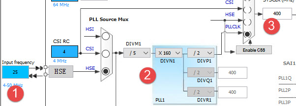
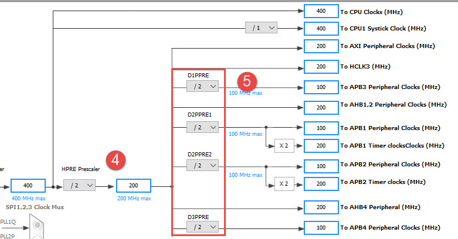
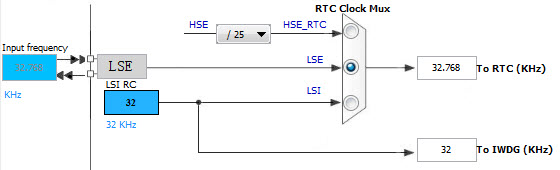
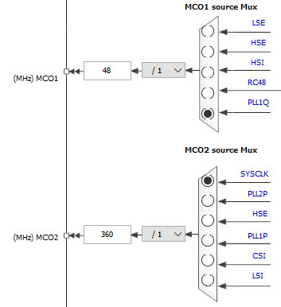

RCC—使用HSE/HSI配置时钟
-----------------------

本章参考资料：《STM32H743用户手册》RCC章节。

学习本章时，配合《STM32H743用户手册》RCC章节一起阅读，效果会更佳，特别是涉及到寄存器说明的部分。

RCC ：reset clock control  复位和时钟控制器。本章我们主要讲解时钟部分，
特别是要着重理解时钟树，理解了时钟树，H743的一切时钟的来龙去脉都会了如指掌。

RCC主要作用—时钟部分
~~~~~~~~~~~~~~~~~~~~

设置系统时钟SYSCLK、设置AHB分频因子（决定HCLK等于多少）、设置APB2分频因子（决定PCLK2等于多少）、设置APB1分频因子（决定PCLK1等于多少）、
设置各个外设的分频因子；控制AHB、APB2和APB1这三条总线时钟的开启、控制每个外设的时钟的开启。
对于SYSCLK、HCLK、PCLK2、PCLK1这四个时钟的配置一般是：
SYSCLK=PLLCLK = 400 MHz，HCLKx=SYSCLK/2 = 200 MHz，
PCLKx=HCLKx/4 = 100 MHz。这个时钟配置也是库函数的标准配置，我们用的最多的就是这个。

RCC框图剖析—时钟树
~~~~~~~~~~~~~~~~~~

时钟树单纯讲理论的话会比较枯燥，如果选取一条主线，并辅以代码，先主后次讲解的话会很容易，而且记忆还更深刻。
这里以配置系统时钟函数SystemClock_Config () 的编写流程来讲解时钟树。该函数的功能是利用外部晶振HSE=25 MHz把时钟倍频设置为：
SYSCLK=PLLCLK = 400 MHz，HCLKx= SYSCLK /2 =200 MHz，
PCLKx= HCLKx /4 = 100 MHz下面我们就以这个代码的流程为主线，
来分析时钟树，代码流程在时钟树中以数字的大小顺序标识。

图 15‑1 STM32H743时钟树1

图 15‑2 STM32H743时钟树2

系统时钟
^^^^^^^^

①HSE高速外部时钟信号
''''''''''''''''''''

HSE是高速的外部时钟信号，可以由有源晶振或者无源晶振提供，频率从4-48MHz不等。当使用有源晶振时，时钟从OSC_IN引脚进入，OSC_OUT引脚悬空为高阻态，
当选用无源晶振时，时钟从OSC_IN进入，OSC_OUT输出，并且要配谐振电容。HSE我们使用25 MHz的无源晶振。
如果我们使用HSE或者HSE经过PLL倍频之后的时钟作为系统时钟SYSCLK，
当HSE故障时候，不仅HSE会被关闭，PLL也会被关闭，此时高速的内部时钟时钟信号HSI会作为备用的系统时钟，
直到HSE恢复正常，HSI可选择8，16，32或者64MHz，取决于 HSIDIV分频因子。

②锁相环PLL
''''''''''

PLL的主要作用是对时钟进行倍频，然后把时钟输出到各个功能部件。PLL有三个，分别是主PLL、 PLL1、PLL2，他们均由HSE或者HSI提供时钟输入信号。

主PLL有两路的时钟输出，第一个输出时钟PLLCLK用于系统时钟，H743里面最高是400 MHz，
第二个输出用于提供其他一些外设的时钟。PLL2和PLL3主要用于提供外设的内核时钟。

HSE或者HSI经过PLL时钟输入分频因子M（1~63）分频后，成为VCO的时钟输入，VCO的时钟必须在1~16 MHz之间，
我们选择HSE=25 MHz作为PLL的时钟输入，M设置为5，那么VCO输入时钟就等于5 MHz。

VCO输入时钟经过VCO倍频因子N倍频之后，成为VCO时钟输出，VCO时钟必须在192~836 MHz之间。
我们配置N为160，则VCO的输出时钟等于800 MHz。

VCO输出时钟之后有三个分频因子：PLLCLK分频因子p，USB OTG FS/RNG/SDMMC时钟分频因子Q，分频因子R产生I2C时钟。
p可以取值2、4、…、128,我们配置为2，则得到PLLCLK=400 MHz。Q可以取值2、4、…、128，
有关PLL的配置有一个专门的RCC PLL配置寄存器RCC_PLLCFGR，具体描述看手册即可。

PLL的时钟配置经过，稍微整理下可由如下公式表达：

VCOCLK_IN = PLLCLK_IN / M  = HSE / 5 = 5 MHz

VCOCLK_OUT = VCOCLK_IN * N = 5M * 160 = 800 MHz

PLLCLK_OUT=VCOCLK_OUT/P=800/2=400 MHz

但是USB OTG FS必须使用48M，因此，在使用的时候，PLLCLK不能使用400M，必须降低到360M，则Q=VCO输出时钟720M/48M=15。

USBCLK = VCOCLK_OUT/Q=720/15=48。

③系统时钟SYSCLK
'''''''''''''''

系统时钟来源可以是：HSI、PLLCLK、HSE，具体的由时钟配置寄存器RCC_CFGR的SW位配置。
我们这里设置系统时钟：SYSCLK = PLLCLK = 400 MHz。如果系统时钟是由HSE经过PLL倍频之后的PLLCLK得到，
当HSE出现故障的时候，系统时钟会切换为HIS（HIS的频率取决于HSIDIV），直到HSE恢复正常为止。

④AHBx总线时钟HCLKx
'''''''''''''''''''''

系统时钟SYSCLK经过AHB预分频器分频之后得到时钟叫AHB总线时钟，即HCLK，分频因子可以是:[2，4，8，16，64，128，256，512]，
具体的由时钟配置寄存器RCC_CFGR的HPRE位设置。片上大部分外设的时钟都是经过HCLK分频得到，至于AHB总线上的外设的时钟设置为多少，
得等到我们使用该外设的时候才设置，我们这里只需粗线条的设置好AHBx的时钟即可。我们这里设置为2分频，即HCLKx=SYSCLK/2=200 MHz。

⑤APBx总线时钟PCLKx
''''''''''''''''''

APBx总线时钟PCLKx由HCLKx经过低速APB预分频器得到，分频因子可以是:[1，2，4，8，16]，具体由时钟配置寄存器RCC_DxCFGR的DxPPRE[2:0]位设置。
APBx总线最高能达到100MHz。至于APB1总线上的外设的时钟设置为多少，得等到我们使用该外设的时候才设置，我们这里只需粗线条的设置好APBx的时钟即可。
我们这里设置为2分频，即PCLKx= HCLKx/2 = 100 MHz。

设置系统时钟库函数
''''''''''''''''''

上面的步骤对应的设置系统时钟库函数如下，为了方便阅读，已经把跟743不相关的代码删掉，把英文注释翻译成了中文。
该函数是直接填写相应的结构体，最后调用HAL_RCC_OscConfig函数和HAL_RCC_ClockConfig函数就可以初始化时钟，
这里需要注意的是，由于在 PLL 使能后主 PLL 配置参数便不可更改，所以建议先对 PLL 进行配置，
然后再使能（选择 HSI 或 HSE 振荡器作为 PLL 时钟源，并配置分频系数 M、 N、 P 和 Q）。

代码 15‑1代码 2 设置系统时钟库函数

.. code-block:: c
   :name: 15‑1

    /**
    * @brief  System Clock 配置
    *         system Clock 配置如下:
    *            System Clock source  = PLL (HSE)
    *            SYSCLK(Hz)           = 400000000 (CPU Clock)
    *            HCLK(Hz)             = 200000000 (AXI and AHBs Clock)
    *            AHB Prescaler        = 2
    *            D1 APB3 Prescaler    = 2 (APB3 Clock  100MHz)
    *            D2 APB1 Prescaler    = 2 (APB1 Clock  100MHz)
    *            D2 APB2 Prescaler    = 2 (APB2 Clock  100MHz)
    *            D3 APB4 Prescaler    = 2 (APB4 Clock  100MHz)
    *            HSE Frequency(Hz)    = 25000000
    *            PLL_M                = 5
    *            PLL_N                = 160
    *            PLL_P                = 2
    *            PLL_Q                = 4
    *            PLL_R                = 2
    *            VDD(V)               = 3.3
    *            Flash Latency(WS)    = 4
    * @param  无
    * @retval 无
    */
    void SystemClock_Config(void)
    {
        RCC_ClkInitTypeDef RCC_ClkInitStruct;
        RCC_OscInitTypeDef RCC_OscInitStruct;
        HAL_StatusTypeDef ret = HAL_OK;

        /*使能供电配置更新 */
        MODIFY_REG(PWR->CR3, PWR_CR3_SCUEN, 0);

        /*
        当器件的时钟频率低于最大系统频率时，电压调节可以优化功耗，
            关于系统频率的电压调节值的更新可以参考产品数据手册。  */
        __HAL_PWR_VOLTAGESCALING_CONFIG(PWR_REGULATOR_VOLTAGE_SCALE1);

        while (!__HAL_PWR_GET_FLAG(PWR_FLAG_VOSRDY)) {}

        /* 启用HSE振荡器并使用HSE作为源激活PLL */
        RCC_OscInitStruct.OscillatorType = RCC_OSCILLATORTYPE_HSE;
        RCC_OscInitStruct.HSEState = RCC_HSE_ON;
        RCC_OscInitStruct.HSIState = RCC_HSI_OFF;
        RCC_OscInitStruct.CSIState = RCC_CSI_OFF;
        RCC_OscInitStruct.PLL.PLLState = RCC_PLL_ON;
        RCC_OscInitStruct.PLL.PLLSource = RCC_PLLSOURCE_HSE;

        RCC_OscInitStruct.PLL.PLLM = 5;
        RCC_OscInitStruct.PLL.PLLN = 160;
        RCC_OscInitStruct.PLL.PLLP = 2;
        RCC_OscInitStruct.PLL.PLLR = 2;
        RCC_OscInitStruct.PLL.PLLQ = 4;

        RCC_OscInitStruct.PLL.PLLVCOSEL = RCC_PLL1VCOWIDE;
        RCC_OscInitStruct.PLL.PLLRGE = RCC_PLL1VCIRANGE_2;
        ret = HAL_RCC_OscConfig(&RCC_OscInitStruct);
        if (ret != HAL_OK) {
            while (1) {
                ;
            }
        }

        /* 选择PLL作为系统时钟源并配置总线时钟分频器 */
        RCC_ClkInitStruct.ClockType = (RCC_CLOCKTYPE_SYSCLK  | \
                                        RCC_CLOCKTYPE_HCLK    | \
                                        RCC_CLOCKTYPE_D1PCLK1 | \
                                        RCC_CLOCKTYPE_PCLK1   | \
                                        RCC_CLOCKTYPE_PCLK2   | \
                                        RCC_CLOCKTYPE_D3PCLK1);
        RCC_ClkInitStruct.SYSCLKSource = RCC_SYSCLKSOURCE_PLLCLK;
        RCC_ClkInitStruct.SYSCLKDivider = RCC_SYSCLK_DIV1;
        RCC_ClkInitStruct.AHBCLKDivider = RCC_HCLK_DIV2;
        RCC_ClkInitStruct.APB3CLKDivider = RCC_APB3_DIV2;
        RCC_ClkInitStruct.APB1CLKDivider = RCC_APB1_DIV2;
        RCC_ClkInitStruct.APB2CLKDivider = RCC_APB2_DIV2;
        RCC_ClkInitStruct.APB4CLKDivider = RCC_APB4_DIV2;
        ret = HAL_RCC_ClockConfig(&RCC_ClkInitStruct, FLASH_LATENCY_4);
        if (ret != HAL_OK) {
            while (1) {
                ;
            }
        }
    }

其他时钟
^^^^^^^^

通过对系统时钟设置的讲解，整个时钟树我们已经把握的有六七成，剩下的时钟部分我们讲解几个重要的。

RTC时钟
'''''''

STM32H743 RTC和IWDG时钟

RTCCLK 时钟源可以是 HSE 1 MHz（ HSE 由一个可编程的预分频器分频）、 LSE
或者 LSI时钟。选择方式是编程 RCC 备份域控制寄存器 (RCC_BDCR) 中的
RTCSEL[1:0] 位和 RCC时钟配置寄存器 (RCC_CFGR) 中的 RTCPRE[4:0]
位。所做的选择只能通过复位备份域的方式修改。我们通常的做法是由LSE给RTC提供时钟，大小为32.768KHZ。LSE由外接的晶体谐振器产生，所配的谐振电容精度要求高，不然很容易不起振。

独立看门狗时钟
''''''''''''''

独立看门狗时钟由内部的低速时钟LSI提供，大小为32KHZ。

I2S时钟
'''''''

I2S时钟可由外部的时钟引脚I2S_CKIN输入，也可由专用的PLLI2SCLK提供，具体的由RCC
时钟配置寄存器
(RCC_CFGR)的I2SSCR位配置。我们在使用I2S外设驱动W8978的时候，使用的时钟是PLLI2SCLK，这样就可以省掉一个有源晶振。

PHY以太网时钟
'''''''''''''

H743要想实现以太网功能，除了有本身内置的MAC之外，还需要外接一个PHY芯片，常见的PHY芯片有DP83848和LAN8720，其中DP83848支持MII和RMII接口，LAN8720只支持RMII接口。野火H743开发板用的是RMII接口，选择的PHY芯片是LAN8720。使用RMII接口的好处是使用的IO减少了一半，速度还是跟MII接口一样。当使用RMII接口时，PHY芯片只需输出一路时钟给MCU即可，如果是MII接口，PHY芯片则需要提供两路时钟给MCU。

USB PHY 时钟
''''''''''''

H743的USB没有集成PHY，要想实现USB高速传输的话，必须外置USB
PHY芯片，常用的芯片是USB3300。当外接USB
PHY芯片时，PHY芯片需要给MCU提供一个时钟。

外扩USB3300会占用非常多的IO，跟SDRAM和RGB888的IO会复用的很厉害，鉴于USB高速传输用的比较少，野火743就没有外扩这个芯片。

MCO时钟输出
'''''''''''

STM32H743 MCO时钟

MCO是microcontroller clock
output的缩写，是微控制器时钟输出引脚，主要作用是可以对外提供时钟，相当于一个有源晶振。H743中有两个MCO，由PA8/PC9复用所得。MCO1所需的时钟源通过
RCC 时钟配置寄存器 (RCC_CFGR) 中的 MCO1PRE[2:0] 和
MCO1[1:0]位选择。MCO2所需的时钟源通过 RCC 时钟配置寄存器 (RCC_CFGR) 中的
MCO2PRE[2:0] 和
MCO2位选择。有关MCO的IO、时钟选择和输出速率的具体信息如下表所示：

+----------+-----+--------------------------------+--------------+
| 时钟输出 | IO  | 时钟来源                       | 最大输出速率 |
+==========+=====+================================+==============+
| MCO1     | PA8 | HSI、LSE、HSE、PLLCLK          | 108MHz       |
+----------+-----+--------------------------------+--------------+
| MCO2     | PC9 | HSE、PLLCLK、SYSCLK、PLLI2SCLK | 108MHz       |
+----------+-----+--------------------------------+--------------+

配置系统时钟实验
~~~~~~~~~~~~~~~~

使用HSE
^^^^^^^

一般情况下，我们都是使用HSE，然后HSE经过PLL倍频之后作为系统时钟。H743系统时钟最高为400 MHz，这个是官方推荐的最高的稳定时钟。

如果我们使用库函数编程，当程序来到main函数首先调用SystemClock_Config ()函数把系统时钟初始化成400 MHz，
SystemClock_Config ()在文件：main.c中定义。
如果我们想把系统时钟设置低一点或者超频的话，可以修改底层的库文件。

使用HSI
^^^^^^^

当HSE直接或者间接（HSE经过PLL倍频）的作为系统时钟的时候，如果HSE发生故障，不仅HSE会被关闭，连PLL也会被关闭，这个时候系统会自动切换HSI作为系统时钟，此时SYSCLK=HSI=16M，如果没有开启CSS和CSS中断的话，那么整个系统就只能在低速率运行，这是系统跟瘫痪没什么两样。

如果开启了CSS功能的话，那么可以当HSE故障时，在CSS中断里面采取补救措施，使用HSI，重新设置系统频率为400 MHz，
让系统恢复正常使用。但这只是权宜之计，并非万全之策，最好的方法还是要采取相应的补救措施并报警，然后修复HSE。
临时使用HSI只是为了把损失降低到最小，毕竟HSI较于HSE精度还是要低点。

F103系列中，使用HSI最大只能把系统设置为64M，并不能跟使用HSE一样把系统时钟设置为72M，究其原因是HSI在进入PLL倍频的时候必须2分频，导致PLL倍频因子调到最大也只能到64M，而HSE进入PLL倍频的时候则不用2分频。

在H743中，无论是使用HSI还是HSE都可以把系统时钟设置为400 MHz，
因为HSE或者HSI在进入PLL倍频的时候都会被分频再倍频。

还有一种情况是，有些用户不想用HSE，想用HSI，但是又不知道怎么用HSI来设置系统时钟，因为调用库函数都是使用HSE，下面我们给出个使用HSI配置系统时钟例子，起个抛砖引玉的作用。

硬件设计
^^^^^^^^

1. RCC

2. LED一个

RCC是单片机内部资源，不需要外部电路。通过LED闪烁的频率来直观的判断不同系统时钟频率对软件延时的效果。

软件设计
^^^^^^^^

我们编写两个RCC驱动文件，bsp_clkconfig.h和bsp_clkconfig.c，用来存放RCC系统时钟配置函数。

编程要点
''''''''

1、开启HSE/HSI ，并等待 HSE/HSI 稳定

2、设置 AHBx、APBx的预分频因子

3、设置PLL的时钟来源，设置VCO输入时钟 分频因子PLL_M，设置VCO输出时钟

倍频因子PLL_N，设置PLLCLK时钟分频因子PLL_P，设置OTG FS,SDIO,RNG

时钟分频因子 PLL_Q

4、开启PLL，并等待PLL稳定

5、把PLLCK切换为系统时钟SYSCLK

6、读取时钟切换状态位，确保PLLCLK被选为系统时钟

代码分析
''''''''

这里只讲解核心的部分代码，有些变量的设置，头文件的包含等并没有涉及到，完整的代码请参考本章配套的工程。

使用HSE配置系统时钟
====================

代码 15‑3代码 4 HSE作为系统时钟来源

.. code-block:: c
   :name: 代码 15‑3

    /**
    * @brief  将PLL源从CSI切换到HSE，并选择PLL作为SYSCLK源
    *         system Clock 配置如下:
    *            System Clock source            = PLL (HSE)
    *            SYSCLK(Hz)                     = 400000000 (CPU Clock)
    *            HCLK(Hz)                       = 200000000 (AXI and AHBs Clock)
    *            AHB Prescaler                  = 2
    *            D1 APB3 Prescaler              = 2 (APB3 Clock  100MHz)
    *            D2 APB1 Prescaler              = 2 (APB1 Clock  100MHz)
    *            D2 APB2 Prescaler              = 2 (APB2 Clock  100MHz)
    *            D3 APB4 Prescaler              = 2 (APB4 Clock  100MHz)
    *            HSE Frequency(Hz)              = 25000000
    *            PLL_M                          = 5
    *            PLL_N                          = 160
    *            PLL_P                          = 2
    *            PLL_Q                          = 4
    *            PLL_R                          = 2
    *            VDD(V)                         = 3.3
    *            Flash Latency(WS)              = 4
    * @param  无
    * @retval 无
    */
    void SystemClockHSE_Config(void)
    {
        RCC_ClkInitTypeDef RCC_ClkInitStruct = {0};
        RCC_OscInitTypeDef RCC_OscInitStruct = {0};

        /* -1- 选择CSI作为系统时钟源以允许修改PLL配置 */
        RCC_ClkInitStruct.ClockType = RCC_CLOCKTYPE_SYSCLK;
        RCC_ClkInitStruct.SYSCLKSource = RCC_SYSCLKSOURCE_CSI;
        if (HAL_RCC_ClockConfig(&RCC_ClkInitStruct, FLASH_LATENCY_1) != HAL_OK) {
            while (1) {
                ;
            }
        }

        /* -2- 启用HSE振荡器，选择它作为PLL源，最后激活PLL */

        RCC_OscInitStruct.OscillatorType = RCC_OSCILLATORTYPE_HSE;
        RCC_OscInitStruct.HSEState = RCC_HSE_ON;

        RCC_OscInitStruct.PLL.PLLState = RCC_PLL_ON;
        RCC_OscInitStruct.PLL.PLLSource = RCC_PLLSOURCE_HSE;
        RCC_OscInitStruct.PLL.PLLM = 5;
        RCC_OscInitStruct.PLL.PLLN = 160;
        RCC_OscInitStruct.PLL.PLLP = 2;
        RCC_OscInitStruct.PLL.PLLR = 2;
        RCC_OscInitStruct.PLL.PLLQ = 4;

        RCC_OscInitStruct.PLL.PLLVCOSEL = RCC_PLL1VCOWIDE;
        RCC_OscInitStruct.PLL.PLLRGE = RCC_PLL1VCIRANGE_2;

        if (HAL_RCC_OscConfig(&RCC_OscInitStruct) != HAL_OK) {
            while (1) {
                ;
            }
        }
        /* -2-选择PLL作为系统时钟源并配置总线时钟分频器 */
        RCC_ClkInitStruct.ClockType = (RCC_CLOCKTYPE_SYSCLK  | \
                                        RCC_CLOCKTYPE_HCLK    | \
                                        RCC_CLOCKTYPE_D1PCLK1 | \
                                        RCC_CLOCKTYPE_PCLK1   | \
                                        RCC_CLOCKTYPE_PCLK2   | \
                                        RCC_CLOCKTYPE_D3PCLK1);
        RCC_ClkInitStruct.SYSCLKSource = RCC_SYSCLKSOURCE_PLLCLK;
        RCC_ClkInitStruct.SYSCLKDivider = RCC_SYSCLK_DIV1;
        RCC_ClkInitStruct.AHBCLKDivider = RCC_HCLK_DIV2;
        RCC_ClkInitStruct.APB3CLKDivider = RCC_APB3_DIV2;
        RCC_ClkInitStruct.APB1CLKDivider = RCC_APB1_DIV2;
        RCC_ClkInitStruct.APB2CLKDivider = RCC_APB2_DIV2;
        RCC_ClkInitStruct.APB4CLKDivider = RCC_APB4_DIV2;
        if (HAL_RCC_ClockConfig(&RCC_ClkInitStruct, FLASH_LATENCY_4) != HAL_OK) {
            while (1) {
                ;
            }
        }

        /* -4- 可选：禁用CSI振荡器（如果应用程序不再需要HSI）*/
        RCC_OscInitStruct.OscillatorType  = RCC_OSCILLATORTYPE_CSI;
        RCC_OscInitStruct.CSIState        = RCC_CSI_OFF;
        RCC_OscInitStruct.PLL.PLLState    = RCC_PLL_NONE;
        if (HAL_RCC_OscConfig(&RCC_OscInitStruct) != HAL_OK) {
            while (1) {
                ;
            }
        }
    }

这个函数采用库函数编写，
代码理解参考注释即可。函数有4个形参m、n、p、q，具体说明如下：

+------+-----------------------------+----------------+
| 形参 |          形参说明           |    取值范围    |
+======+=============================+================+
| m    | VCO输入时钟 分频因子        | 1~63           |
+------+-----------------------------+----------------+
| n    | VCO输出时钟 倍频因子        | 4~432          |
+------+-----------------------------+----------------+
| p    | PLLCLK时钟分频因子          | 2/4/6/8.../128 |
+------+-----------------------------+----------------+
| q    | OTG FS,SDIO,RNG时钟分频因子 | 4~15           |
+------+-----------------------------+----------------+

HSE我们使用25M，参数m我们一般也设置为25，所以我们需要修改系统时钟的时候只需要修改参数n和p即可，SYSCLK=PLLCLK=HSE/m*n/p。

函数调用举例：HSE_SetSysClock(25, 400, 2, 7) 把系统时钟设置为200 MHz。
HSE_SetSysClock(25, 432, 2, 9)把系统时钟设置为216M。

使用HSI配置系统时钟
========================

.. code-block:: c

    /**
    * @brief  将PLL源从HSE切换到HSI，并选择PLL作为SYSCLK源
    *         system Clock 配置如下:
    *            System Clock source            = PLL (HSI)
    *            SYSCLK(Hz)                     = 400000000 (CPU Clock)
    *            HCLK(Hz)                       = 200000000 (AXI and AHBs Clock)
    *            AHB Prescaler                  = 2
    *            D1 APB3 Prescaler              = 2 (APB3 Clock  100MHz)
    *            D2 APB1 Prescaler              = 2 (APB1 Clock  100MHz)
    *            D2 APB2 Prescaler              = 2 (APB2 Clock  100MHz)
    *            D3 APB4 Prescaler              = 2 (APB4 Clock  100MHz)
    *            HSI Frequency(Hz)              = 64000000
    *            PLL_M                          = 16
    *            PLL_N                          = 200
    *            PLL_P                          = 2
    *            PLL_Q                          = 4
    *            PLL_R                          = 2
    *            VDD(V)                         = 3.3
    *            Flash Latency(WS)              = 4
    * @param  无
    * @retval 无
    */
    void SystemClockHSI_Config(void)
    {
        RCC_ClkInitTypeDef RCC_ClkInitStruct = {0};
        RCC_OscInitTypeDef RCC_OscInitStruct = {0};

        /* -1- 选择HSE作为系统时钟源以允许修改PLL配置 */
        RCC_ClkInitStruct.ClockType       = RCC_CLOCKTYPE_SYSCLK;
        RCC_ClkInitStruct.SYSCLKSource    = RCC_SYSCLKSOURCE_HSE;
        if (HAL_RCC_ClockConfig(&RCC_ClkInitStruct, FLASH_LATENCY_1) != HAL_OK) {
            while (1) {
                ;
            }
        }

        /* -2- 启用HSI振荡器，选择它作为PLL源，最后激活PLL */
        RCC_OscInitStruct.OscillatorType = RCC_OSCILLATORTYPE_HSI;
        RCC_OscInitStruct.HSIState = RCC_HSI_ON;
        RCC_OscInitStruct.HSICalibrationValue  = RCC_HSICALIBRATION_DEFAULT;

        RCC_OscInitStruct.PLL.PLLState = RCC_PLL_ON;
        RCC_OscInitStruct.PLL.PLLSource = RCC_PLLSOURCE_HSI;
        RCC_OscInitStruct.PLL.PLLM = 16;
        RCC_OscInitStruct.PLL.PLLN = 200;
        RCC_OscInitStruct.PLL.PLLP = 2;
        RCC_OscInitStruct.PLL.PLLR = 2;
        RCC_OscInitStruct.PLL.PLLQ = 4;

        RCC_OscInitStruct.PLL.PLLVCOSEL = RCC_PLL1VCOWIDE;
        RCC_OscInitStruct.PLL.PLLRGE = RCC_PLL1VCIRANGE_2;
        if (HAL_RCC_OscConfig(&RCC_OscInitStruct) != HAL_OK) {
            while (1) {
                ;
            }
        }

        /* -3-选择PLL作为系统时钟源并配置总线时钟分频器 */
        RCC_ClkInitStruct.ClockType = (RCC_CLOCKTYPE_SYSCLK  | \
                                        RCC_CLOCKTYPE_HCLK    | \
                                        RCC_CLOCKTYPE_D1PCLK1 | \
                                        RCC_CLOCKTYPE_PCLK1   | \
                                        RCC_CLOCKTYPE_PCLK2   | \
                                        RCC_CLOCKTYPE_D3PCLK1);
        RCC_ClkInitStruct.SYSCLKSource = RCC_SYSCLKSOURCE_PLLCLK;
        RCC_ClkInitStruct.SYSCLKDivider = RCC_SYSCLK_DIV1;
        RCC_ClkInitStruct.AHBCLKDivider = RCC_HCLK_DIV2;
        RCC_ClkInitStruct.APB3CLKDivider = RCC_APB3_DIV2;
        RCC_ClkInitStruct.APB1CLKDivider = RCC_APB1_DIV2;
        RCC_ClkInitStruct.APB2CLKDivider = RCC_APB2_DIV2;
        RCC_ClkInitStruct.APB4CLKDivider = RCC_APB4_DIV2;
        if (HAL_RCC_ClockConfig(&RCC_ClkInitStruct, FLASH_LATENCY_4) != HAL_OK) {
            while (1) {
                ;
            }
        }

        /* -4- 可选：禁用HSE振荡器（如果应用程序不再需要HSE） */
        RCC_OscInitStruct.OscillatorType  = RCC_OSCILLATORTYPE_HSE;
        RCC_OscInitStruct.HSEState        = RCC_HSE_OFF;
        RCC_OscInitStruct.PLL.PLLState    = RCC_PLL_NONE;
        if (HAL_RCC_OscConfig(&RCC_OscInitStruct) != HAL_OK) {
            while (1) {
                ;
            }
        }
    }

这个函数采用库函数编写，
代码理解参考注释即可。函数有4个形参m、n、p、q，具体说明如下：

+------+-----------------------------+----------------+
| 形参 |          形参说明           |    取值范围    |
+======+=============================+================+
| m    | VCO输入时钟 分频因子        | 1~63           |
+------+-----------------------------+----------------+
| n    | VCO输出时钟 倍频因子        | 4~432          |
+------+-----------------------------+----------------+
| p    | PLLCLK时钟分频因子          | 2/4/6/8.../128 |
+------+-----------------------------+----------------+
| q    | OTG FS,SDIO,RNG时钟分频因子 | 4~15           |
+------+-----------------------------+----------------+

HSI为64M，参数m我们一般也设置为16，所以我们需要修改系统时钟的时候只需要修改参数n和p即可，SYSCLK=PLLCLK=HSI/m*n/p。

软件延时
=============

.. code-block:: c

    void Delay(__IO uint32_t nCount)
    {
        for (; nCount != 0; nCount--);
    }

软件延时函数，使用不同的系统时钟，延时时间不一样，可以通过LED闪烁的频率来判断。

MCO输出
=========

在H743中，PA8/PC9可以复用为MCO1/2引脚，对外提供时钟输出，我们也可以用示波器监控该引脚的输出来判断我们的系统时钟是否设置正确。HAL库有现成的库函数HAL_RCC_MCOConfig，配置MCO，只需确定输出引脚，输出时钟源，以及分频系数就可以输出时钟使用非常方便。

主函数
==========

在主函数中，通过检查KEY2按钮是否被按下，如果按下，则调用ystemClockHSI_Config ()
或者SystemClockHSE_Config ()这两个函数把系统时钟设置成各种常用的时钟，
然后通过MCO引脚监控，或者通过LED闪烁的快慢体验不同的系统时钟对同一个软件延时函数的影响。

.. code-block:: c

    /**
    * @brief  主函数
    * @param  无
    * @retval 无
    */
    int main(void)
    {
        /* 系统时钟初始化成400MHz */
        SystemClock_Config();
        // LED 端口初始化
        LED_GPIO_Config();
        /*初始化按键*/
        Key_GPIO_Config();
        /* 在MCO2引脚（PC.09）上输出SYSCLK / 4 */
        HAL_RCC_MCOConfig(RCC_MCO2, RCC_MCO2SOURCE_SYSCLK, RCC_MCODIV_4);

        while (1) {
            /* 检查是否按下了KEY2按钮来切换时钟配置 */
            if ( Key_Scan(KEY2_GPIO_PORT,KEY2_PIN) == KEY_ON  ) {
                SwitchSystemClock();
                LED4_TOGGLE;
            }
            /* LED闪烁 */
            LED3_TOGGLE;
            HAL_Delay(100);
        }
    }

下载验证
^^^^^^^^

把编译好的程序下载到开发板，可以看到设置不同的系统时钟时，LED闪烁的快慢不一样。更精确的数据我们可以用示波器监控MCO引脚看到。
