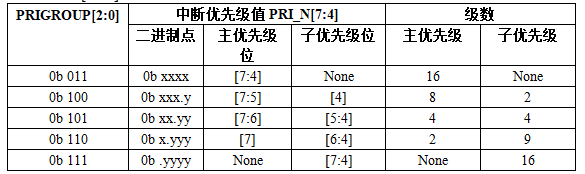

STM32中断应用概览
-----------------

本章参考资料《STM32H743用户手册》第十九章-中断和事件、《Cortex®-M7内核编程手册》-4.2章节：NVIC和4.4章节：SCB—4.3.5的AIRCR。

STM32中断非常强大，每个外设都可以产生中断，所以中断的讲解放在哪一个外设里面去讲都不合适，
这里单独抽出一章来做一个总结性的介绍，这样在其他章节涉及到中断部分的知识我们就不用费很大的篇幅去讲解，只要示意性带过即可。

本章如无特别说明，异常就是中断，中断就是异常，请不要刻意钻牛角尖较劲。

异常类型
~~~~~~~~

H743在内核水平上搭载了一个异常响应系统， 支持为数众多的系统异常和外部中断。
其中系统异常有10个，外部中断有150个。除了个别异常的优先级被定死外，其它异常的优先级都是可编程的。
有关具体的系统异常和外部中断可在标准库文件STM32H743xx.h这个头文件查询到，
在IRQn_Type这个结构体里面包含了H7系列全部的异常声明。

表格 16‑1 H743系统异常清单

+------+--------+------------+----------+------------------+--------+
| 编号 | 优先级 | 优先级类型 |   名称   |       说明       |  地址  |
+======+========+============+==========+==================+========+
|      | -      | -          | -        | 保留（实际存的是 | 0X0000 |
|      |        |            |          | MSP地址）        | 0000   |
+------+--------+------------+----------+------------------+--------+
|      | -3     | 固定       | Reset    | 复位             | 0X0000 |
|      |        |            |          |                  | 0004   |
+------+--------+------------+----------+------------------+--------+
|      | -2     | 固定       | NMI      | 不可屏蔽中断。   | 0X0000 |
|      |        |            |          |                  | 0008   |
|      |        |            |          | RCC              |        |
|      |        |            |          | 时钟安全系统     |        |
|      |        |            |          |                  |        |
|      |        |            |          | (CSS)            |        |
|      |        |            |          | 连接到           |        |
|      |        |            |          | NMI 向量         |        |
+------+--------+------------+----------+------------------+--------+
|      | -1     | 固定       | HardFaul | 所有类型的错误   | 0X0000 |
|      |        |            | t        |                  | 000C   |
+------+--------+------------+----------+------------------+--------+
|      | 0      | 可编程     | MemManag | 存储器管理       | 0X0000 |
|      |        |            | e        |                  | 0010   |
+------+--------+------------+----------+------------------+--------+
|      | 1      | 可编程     | BusFault | 预取指失败，存储 | 0X0000 |
|      |        |            |          | 器访问失败       | 0014   |
+------+--------+------------+----------+------------------+--------+
|      | 2      | 可编程     | UsageFau | 未定义的指令或非 | 0X0000 |
|      |        |            | lt       | 法状态           | 0018   |
+------+--------+------------+----------+------------------+--------+
|      | -      | -          | -        | 保留             | 0X0000 |
|      |        |            |          |                  | 001C-  |
|      |        |            |          |                  |        |
|      |        |            |          |                  | 0X0000 |
|      |        |            |          |                  | 002B   |
+------+--------+------------+----------+------------------+--------+
|      | 3      | 可编程     | SVCall   | 通过 SWI         | 0X0000 |
|      |        |            |          | 指令调用的系统服 | 002C   |
|      |        |            |          | 务               |        |
+------+--------+------------+----------+------------------+--------+
|      | 4      | 可编程     | Debug    | 调试监控器       | 0X0000 |
|      |        |            | Monitor  |                  | 0030   |
+------+--------+------------+----------+------------------+--------+
|      | -      | -          | -        | 保留             | 0X0000 |
|      |        |            |          |                  | 0034   |
+------+--------+------------+----------+------------------+--------+
|      | 5      | 可编程     | PendSV   | 可挂起的系统服务 | 0X0000 |
|      |        |            |          |                  | 0038   |
+------+--------+------------+----------+------------------+--------+
|      | 6      | 可编程     | SysTick  | 系统嘀嗒定时器   | 0X0000 |
|      |        |            |          |                  | 003C   |
+------+--------+------------+----------+------------------+--------+

表格 16‑2 H743外部中断清单

+------------------+--------+------------+----------+------------------+--------+
|       编号       | 优先级 | 优先级类型 |   名称   |       说明       |  地址  |
+==================+========+============+==========+==================+========+
| 0                | 7      | 可编程     | -        | 窗口看门狗中断   | 0X0000 |
|                  |        |            |          |                  | 0040   |
+------------------+--------+------------+----------+------------------+--------+
| 1                | 8      | 可编程     | PVD      | 连接EXTI         | 0X0000 |
|                  |        |            |          | 线的可编程电压检 | 0044   |
|                  |        |            |          | 测中断           |        |
+------------------+--------+------------+----------+------------------+--------+
| 2                | 9      | 可编程     | TAMP_STA | 连接EXTI         | 0X0000 |
|                  |        |            | MP       | 线的入侵和时间戳 | 0048   |
|                  |        |            |          | 中断             |        |
+------------------+--------+------------+----------+------------------+--------+
| 中间部分省略，详                                                              |
| 情请参考STM3                                                                  |
| 2H7xxx参考                                                                    |
| 手册》第十九章-                                                               |
| 中断和事件-向量                                                               |
| 表部分                                                                        |
+------------------+--------+------------+----------+------------------+--------+
| 148              | 155    | 可编程     | -        | -                | 0X0000 |
|                  |        |            |          |                  | 0290   |
+------------------+--------+------------+----------+------------------+--------+
| 149              | 156    | 可编程     | WKUP     | WKUP1~WK         | 0X0000 |
|                  |        |            |          | UP6引脚中断      | 0294   |
+------------------+--------+------------+----------+------------------+--------+

NVIC简介
~~~~~~~~

在讲如何配置中断优先级之前，我们需要先了解下NVIC。NVIC是嵌套向量中断控制器，控制着整个芯片中断相关的功能，它跟内核紧密耦合，是内核里面的一个外设。但是各个芯片厂商在设计芯片的时候会对Cortex-M7内核里面的NVIC进行裁剪，把不需要的部分去掉，所以说STM32的NVIC是Cortex-M7的NVIC的一个子集。

NVIC寄存器简介
^^^^^^^^^^^^^^

在固件库中，NVIC的结构体定义可谓是颇有远虑，给每个寄存器都预留了很多位，恐怕为的是日后扩展功能。不过STM32H743可用不了这么多，只是用了部分而已，具体使用了多少可参考《Cortex®-M7内核编程手册》-4.2:NVIC寄存器映射。

代码 16‑1代码 2 NVIC结构体定义，来自固件库头文件：core_cM7.h

.. code-block:: c

    typedef struct {
        __IO uint32_t ISER[8U];       // 中断使能寄存器
        uint32_t RESERVED0[24U];
        __IO uint32_t ICER[8U];       // 中断清除寄存器
        uint32_t RSERVED1[24U];
        __IO uint32_t ISPR[8U];       // 中断使能悬起寄存器
        uint32_t RESERVED2[24U];
        __IO uint32_t ICPR[8U];       // 中断清除悬起寄存器
        uint32_t RESERVED3[24U];
        __IO uint32_t IABR[8U];       // 中断有效位寄存器
        uint32_t RESERVED4[56U];
        __IO uint8_t  IP[240U];       // 中断优先级寄存器(8Bit wide)
        uint32_t RESERVED5[644U];
        __O  uint32_t STIR;          // 软件触发中断寄存器
    }  NVIC_Type;

在配置中断的时候我们一般只用ISER、ICER和IP这三个寄存器，ISER用来使能中断，ICER用来失能中断，IP用来设置中断优先级。

NVIC 中断配置固件库
^^^^^^^^^^^^^^^^^^^

固件库文件core_cM7.h的最后，还提供了NVIC的一些函数，这些函数遵循CMSIS规则，只要是Cortex-M7
的处理器都可以使用，具体如下：

表格 16‑3 符合CMSIS标准的NVIC库函数

+----------------------------------------------------------+------------------+
| NVIC库函数                                               | 描述             |
+==========================================================+==================+
| void NVIC_EnableIRQ(IRQn_Type IRQn)                      | 使能中断         |
+----------------------------------------------------------+------------------+
| void NVIC_DisableIRQ(IRQn_Type IRQn)                     | 失能中断         |
+----------------------------------------------------------+------------------+
| void NVIC_SetPendingIRQ(IRQn_Type IRQn)                  | 设置中断悬起位   |
+----------------------------------------------------------+------------------+
| void NVIC_ClearPendingIRQ(IRQn_Type IRQn)                | 清除中断悬起位   |
+----------------------------------------------------------+------------------+
| uint32_t NVIC_GetPendingIRQ(IRQn_Type IRQn)              | 获取悬起中断编号 |
+----------------------------------------------------------+------------------+
| void NVIC_SetPriority(IRQn_Type IRQn, uint32_t priority) | 设置中断优先级   |
+----------------------------------------------------------+------------------+
| uint32_t NVIC_GetPriority(IRQn_Type IRQn)                | 获取中断优先级   |
+----------------------------------------------------------+------------------+
| void NVIC_SystemReset(void)                              | 系统复位         |
+----------------------------------------------------------+------------------+

这些库函数我们在编程的时候用的都比较少，甚至基本都不用。在配置中断的时候我们还有更简洁的方法，请看中断编程小节。

优先级的定义
~~~~~~~~~~~~

优先级定义
^^^^^^^^^^

在NVIC
有一个专门的寄存器：中断优先级寄存器NVIC_IPRx（在H743中，x=0...109）用来配置外部中断的优先级，IPR宽度为8bit，原则上每个外部中断可配置的优先级为0~255，数值越小，优先级越高。但是绝大多数CM7芯片都会精简设计，以致实际上支持的优先级数减少，在H743中，只使用了高4bit，如下所示：

表格 16‑4 H743 使用4bit表达优先级

+----------------+------+------+------+-----------------+------+------+------+
|      bit7      | bit6 | bit5 | bit4 |      bit3       | bit2 | bit1 | bit0 |
+================+======+======+======+=================+======+======+======+
| 用于表达优先级                      | 未使用，读回为0                      |
+----------------+------+------+------+-----------------+------+------+------+

用于表达优先级的这4bit，又被分组成抢占优先级和子优先级。如果有多个中断同时响应，抢占优先级高的就会
抢占
抢占优先级低的优先得到执行，如果抢占优先级相同，就比较子优先级。如果抢占优先级和子优先级都相同的话，就比较他们的硬件中断编号，编号越小，优先级越高。

优先级分组
^^^^^^^^^^

优先级的分组由内核外设SCB的应用程序中断及复位控制寄存器AIRCR的PRIGROUP[10:8]位决定，H743分为了5组，具体如下：主优先级=抢占优先级

设置优先级分组可调用库函数HAL_NVIC_SetPriorityGrouping 实现，有关NVIC中断相关的库函数都在库文件stm32h7xx_hal_cortex.c和stm32h7xx_hal_cortex.h中。

代码 16‑3代码 4 中断优先级分组库函数

.. code-block:: c

    /**
    * 配置中断优先级分组：抢占优先级和子优先级
    * 形参如下：
    * @arg NVIC_PriorityGroup_0: 0bit for抢占优先级
    *                            4 bits for 子优先级
    * @arg NVIC_PriorityGroup_1: 1 bit for抢占优先级
    *                            3 bits for 子优先级
    * @arg NVIC_PriorityGroup_2: 2 bit for抢占优先级
    *                            2 bits for 子优先级
    * @arg NVIC_PriorityGroup_3: 3 bit for抢占优先级
    *                            1 bits for 子优先级
    * @arg NVIC_PriorityGroup_4: 4 bit for抢占优先级
    *                            0 bits for 子优先级
    * @注意 如果优先级分组为0，则抢占优先级就不存在，优先级就全部由子优先级控制
    */
    void NVIC_PriorityGroupConfig(uint32_t PriorityGroup)
    {
        // 检查参数
        assert_param(IS_NVIC_PRIORITY_GROUP(PriorityGroup));
        // 设置优先级分组
        NVIC_SetPriorityGrouping(PriorityGroup);
    }

.. _优先级分组真值表:

表格 16‑5 优先级分组真值表

+----------------------+----------+----------+------------------+
| 优先级分组           | 主优先级 | 子优先级 | 描述             |
+======================+==========+==========+==================+
| NVIC_PriorityGroup_0 | 0        | 0-15     | 主-0bit，子-4bit |
+----------------------+----------+----------+------------------+
| NVIC_PriorityGroup_1 | 0-1      | 0-7      | 主-1bit，子-3bit |
+----------------------+----------+----------+------------------+
| NVIC_PriorityGroup_2 | 0-3      | 0-3      | 主-2bit，子-2bit |
+----------------------+----------+----------+------------------+
| NVIC_PriorityGroup_3 | 0-7      | 0-1      | 主-3bit，子-1bit |
+----------------------+----------+----------+------------------+
| NVIC_PriorityGroup_4 | 0-15     | 0        | 主-4bit，子-0bit |
+----------------------+----------+----------+------------------+

中断编程
~~~~~~~~

在配置每个中断的时候一般有3个编程要点：

1. 使用HAL_NVIC_SetPriorityGrouping(uint32_t
   PriorityGroup)函数配置中断优先级分组。一般默认是NVIC_PRIORITYGROUP_4分组4。

2. 使用HAL_NVIC_SetPriority(IRQn_Type IRQn, uint32_t PreemptPriority,
   uint32_t SubPriority)函数配置具体外设中断通道的抢占优先级和子优先级。

3. 使用HAL_NVIC_EnableIRQ函数使能中断请求。

代码 16‑5代码 6 IRQn_Type中断源结构体

.. code-block:: c

    typedef enum IRQn {
    //Cortex-M7 处理器异常编号
        NonMaskableInt_IRQn      = -14,
        MemoryManagement_IRQn    = -12,
        BusFault_IRQn            = -11,
        UsageFault_IRQn          = -10,
        SVCall_IRQn              = -5,
        DebugMonitor_IRQn        = -4,
        PendSV_IRQn              = -2,
        SysTick_IRQn             = -1,
        //STM32 外部中断编号
        WWDG_IRQn                = 0,
        PVD_IRQn                 = 1,
        TAMP_STAMP_IRQn          = 2,

    // 限于篇幅，中间部分代码省略，具体的可查看库文件stm32h767xx.h
        COMP_IRQn                   = 137 ,   /*!< COMP global Interrupt             */
        LPTIM2_IRQn                 = 138,    /*!< LP TIM2 global interrupt          */
        LPTIM3_IRQn                 = 139,    /*!< LP TIM3 global interrupt          */
        LPTIM4_IRQn                 = 140,    /*!< LP TIM4 global interrupt          */
        LPTIM5_IRQn                 = 141,    /*!< LP TIM5 global interrupt          */
        LPUART1_IRQn                = 142,    /*!< LP UART1 interrupt                */
        CRS_IRQn                    = 144,    /*!< Clock Recovery Global Interrupt   */
        SAI4_IRQn                   = 146,    /*!< SAI4 global interrupt             */
        WAKEUP_PIN_IRQn             = 149,
    } IRQn_Type;

PreemptPriority：抢占优先级，具体的值要根据优先级分组来确定，具体参考表格 优先级分组真值表_。

SubPriority：子优先级，具体的值要根据优先级分组来确定，具体参考表格 优先级分组真值表_ 。

4. 编写中断服务函数

在启动文件startup_STM32H743xx.s中我们预先为每个中断都写了一个中断服务函数，只是这些中断函数都是为空，为的只是初始化中断向量表。实际的中断服务函数都需要我们重新编写，中断服务函数我们统一写在stm32h7xx_it.c这个库文件中。

关于中断服务函数的函数名必须跟启动文件里面预先设置的一样，如果写错，系统就在中断向量表中找不到中断服务函数的入口，直接跳转到启动文件里面预先写好的空函数，并且在里面无限循环，实现不了中断。
