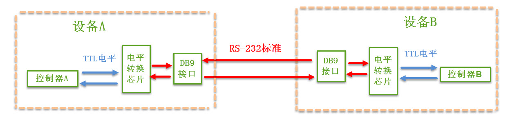
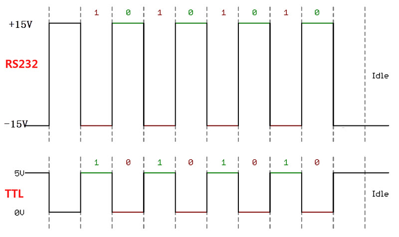
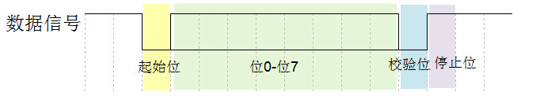
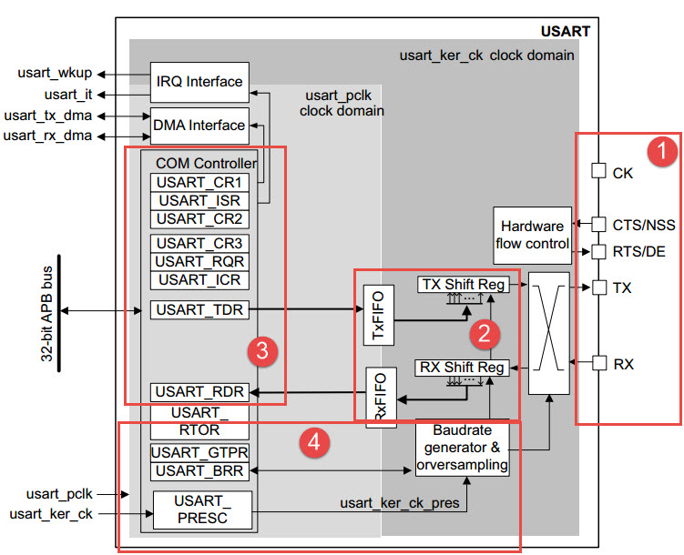
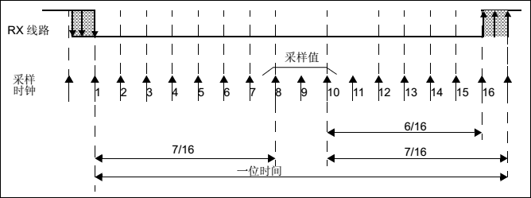
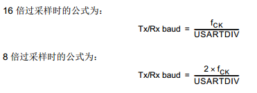
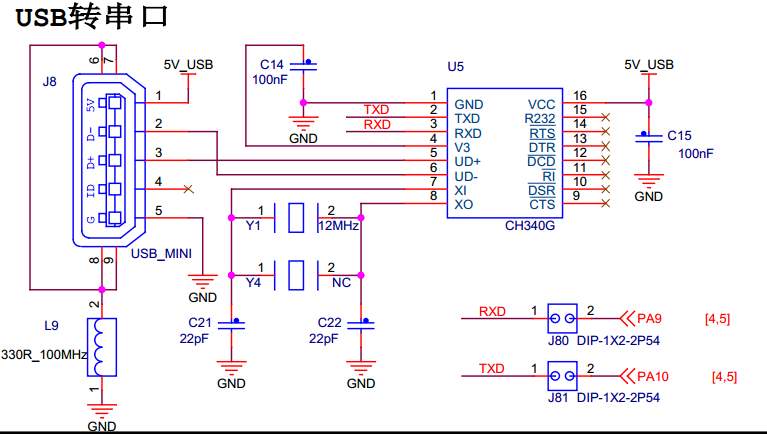
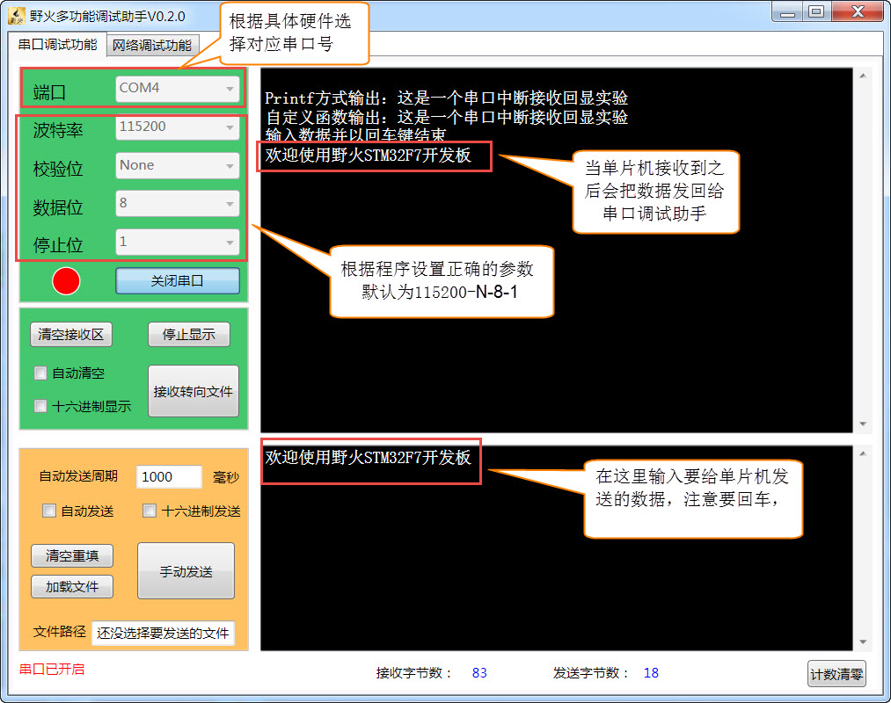

USART—串口通讯
--------------

本章参考资料：《STM32H743用户手册》USART章节。

学习本章时，配合《STM32H743用户手册》USART章节一起阅读，效果会更佳，特别是涉及到寄存器说明的部分。

特别说明，本书内容是以STM32H7xxx系列控制器资源讲解。

串口通讯协议简介
~~~~~~~~~~~~~~~~

串口通讯(Serial
Communication)是一种设备间非常常用的串行通讯方式，因为它简单便捷，因此大部分电子设备都支持该通讯方式，电子工程师在调试设备时也经常使用该通讯方式输出调试信息。

在计算机科学里，大部分复杂的问题都可以通过分层来简化。如芯片被分为内核层和片上外设；STM32HAL库则是在寄存器与用户代码之间的软件层。对于通讯协议，我们也以分层的方式来理解，最基本的是把它分为物理层和协议层。物理层规定通讯系统中具有机械、电子功能部分的特性，确保原始数据在物理媒体的传输。协议层主要规定通讯逻辑，统一收发双方的数据打包、解包标准。简单来说物理层规定我们用嘴巴还是用肢体来交流，协议层则规定我们用中文还是英文来交流。

下面我们分别对串口通讯协议的物理层及协议层进行讲解。

物理层
^^^^^^

串口通讯的物理层有很多标准及变种，我们主要讲解RS-232标准
，RS-232标准主要规定了信号的用途、通讯接口以及信号的电平标准。

使用RS-232标准的串口设备间常见的通讯结构见 图20_1_。

图 20‑1 串口通讯结构图

在上面的通讯方式中，两个通讯设备的“DB9接口”之间通过串口信号线建立起连接，串口信号线中使用“RS-232标准”传输数据信号。由于RS-232电平标准的信号不能直接被控制器直接识别，所以这些信号会经过一个“电平转换芯片”转换成控制器能识别的“TTL标准”的电平信号，才能实现通讯。

电平标准
'''''''''

根据通讯使用的电平标准不同，串口通讯可分为TTL标准及RS-232标准，见表20‑1。

表 20‑1 TTL电平标准与RS232电平标准

+----------+------------------+
| 通讯标准 | 电平标准(发送端) |
+==========+==================+
| 5V TTL   | 逻辑1：2.4V-5V   |
|          |                  |
|          | 逻辑0：0~0.5V    |
+----------+------------------+
| RS-232   | 逻辑1：-15V~-3V  |
|          |                  |
|          | 逻辑0：+3V~+15V  |
+----------+------------------+

我们知道常见的电子电路中常使用TTL的电平标准，理想状态下，使用5V表示二进制逻辑1，使用0V表示逻辑0；而为了增加串口通讯的远距离传输及抗干扰能力，
它使用-15V表示逻辑1，+15V表示逻辑0。使用RS232与TTL电平校准表示同一个信号时的对比见 图20_2_。

图 20‑2 RS-232与TTL电平标准下表示同一个信号

因为控制器一般使用TTL电平标准，所以常常会使用MA3232芯片对TTL及RS-232电平的信号进行互相转换。

RS-232信号线
''''''''''''

在最初的应用中，RS-232串口标准常用于计算机、路由与调制调解器(MODEN，俗称“猫”)之间的通讯
，在这种通讯系统中，设备被分为数据终端设备DTE(计算机、路由)和数据通讯设备DCE(调制调解器)。我们以这种通讯模型讲解它们的信号线连接方式及各个信号线的作用。

在旧式的台式计算机中一般会有RS-232标准的COM口(也称DB9接口)，见 图20_3_。

.. image:: media/image3.jpg
   :align: center
   :alt: 图 20‑3 电脑主板上的COM口及串口线
   :name: 图20_3

图 20‑3 电脑主板上的COM口及串口线

其中接线口以针式引出信号线的称为公头，以孔式引出信号线的称为母头。在计算机中一般引出公头接口，而在调制调解器设备中引出的一般为母头，使用上图中的串口线即可把它与计算机连接起来。通讯时，串口线中传输的信号就是使用前面讲解的RS-232标准调制的。

在这种应用场合下，DB9接口中的公头及母头的各个引脚的标准信号线接法见 图20_4_ 及 表20_2_。

.. image:: media/image4.jpeg
   :align: center
   :alt: 图 20‑4 DB9标准的公头及母头接法
   :name: 图20_4

图 20‑4 DB9标准的公头及母头接法

.. _表20_2:

表 20‑2
DB9信号线说明(公头，为方便理解，可把DTE理解为计算机，DCE理解为调制调解器)

+------+-------------------+------+----------+------------------------+
| 序号 |       名称        | 符号 | 数据方向 |          说明          |
+======+===================+======+==========+========================+
| 1    | 载波检测          | DCD  | DTE→DCE  | Data                   |
|      |                   |      |          | Carrier                |
|      |                   |      |          | Detect，数据载波       |
|      |                   |      |          | 检测，用于DTE告知对    |
|      |                   |      |          | 方，本机是否收到对方的 |
|      |                   |      |          | 载波信号               |
+------+-------------------+------+----------+------------------------+
| 2    | 接收数据          | RXD  | DTE←DCE  | Receive                |
|      |                   |      |          | Data，数据接收信号     |
|      |                   |      |          | ，即输入               |
|      |                   |      |          | 。                     |
+------+-------------------+------+----------+------------------------+
| 3    | 发送数据          | TXD  | DTE→DCE  | Transmit               |
|      |                   |      |          | Data，数据发送信号     |
|      |                   |      |          | ，即输出。两个设备之间 |
|      |                   |      |          | 的TXD与RXD应交叉       |
|      |                   |      |          | 相连                   |
+------+-------------------+------+----------+------------------------+
| 4    | 数据终端          | DTR  | DTE→DCE  | Data                   |
|      | (DTE) 就绪        |      |          | Terminal               |
|      |                   |      |          | Ready，数据终端就      |
|      |                   |      |          | 绪，用于DTE向对方告    |
|      |                   |      |          | 知本机是否已准备好     |
+------+-------------------+------+----------+------------------------+
| 5    | 信号地            | GND  | -        | 地线，两个通讯设备之间 |
|      |                   |      |          | 的地电位可能不一样，这 |
|      |                   |      |          | 会影响收发双方的电平信 |
|      |                   |      |          | 号，所以两个串口设备之 |
|      |                   |      |          | 间必须要使用地线连接， |
|      |                   |      |          | 即共地。               |
+------+-------------------+------+----------+------------------------+
| 6    | 数据设备(DCE)就绪 | DSR  | DTE←DCE  | Data Set               |
|      |                   |      |          | Ready，数据发送就      |
|      |                   |      |          | 绪，用于DCE告知对方    |
|      |                   |      |          | 本机是否处于待命状态   |
+------+-------------------+------+----------+------------------------+
| 7    | 请求发送          | RTS  | DTE→DCE  | Request To             |
|      |                   |      |          | Send，请求发送，       |
|      |                   |      |          |                        |
|      |                   |      |          | DTE 请求               |
|      |                   |      |          | DCE                    |
|      |                   |      |          | 本设备向DCE端发送数    |
|      |                   |      |          | 据                     |
+------+-------------------+------+----------+------------------------+
| 8    | 允许发送          | CTS  | DTE←DCE  | Clear To               |
|      |                   |      |          | Send，允许发送，D      |
|      |                   |      |          | CE回应对方的RTS发      |
|      |                   |      |          | 送请求，告知对方是否可 |
|      |                   |      |          | 以发送数据             |
+------+-------------------+------+----------+------------------------+
| 9    | 响铃指示          | RI   | DTE←DCE  | Ring                   |
|      |                   |      |          | Indicator，响          |
|      |                   |      |          | 铃指示，表示DCE端与    |
|      |                   |      |          | 线路已接通             |
+------+-------------------+------+----------+------------------------+

上表中的是计算机端的DB9公头标准接法，由于两个通讯设备之间的收发信号(RXD与TXD)应交叉相连，
所以调制调解器端的DB9母头的收发信号接法一般与公头的相反，两个设备之间连接时，
只要使用“直通型”的串口线连接起来即可，见 图20_5_。

.. image:: media/image5.jpg
   :align: center
   :alt: 图 20‑5 计算机与调制调解器的信号线连接
   :name: 图20_5

图 20‑5 计算机与调制调解器的信号线连接

串口线中的RTS、CTS、DSR、DTR及DCD信号，使用逻辑
1表示信号有效，逻辑0表示信号无效。例如，当计算机端控制DTR信号线表示为逻辑1时，它是为了告知远端的调制调解器，本机已准备好接收数据，0则表示还没准备就绪。

在目前的其它工业控制使用的串口通讯中，一般只使用RXD、TXD以及GND三条信号线，直接传输数据信号，而RTS、CTS、DSR、DTR及DCD信号都被裁剪掉了。

协议层
^^^^^^

串口通讯的数据包由发送设备通过自身的TXD接口传输到接收设备的RXD接口。在串口通讯的协议层中，规定了数据包的内容，
它由启始位、主体数据、校验位以及停止位组成，通讯双方的数据包格式要约定一致才能正常收发数据，其组成见 图20_6_。

图 20‑6 串口数据包的基本组成

波特率
''''''

本章中主要讲解的是串口异步通讯，异步通讯中由于没有时钟信号(如前面讲解的DB9接口中是没有时钟信号的)，
所以两个通讯设备之间需要约定好波特率，即每个码元的长度，以便对信号进行解码，
图20_6_ 中用虚线分开的每一格就是代表一个码元。常见的波特率为4800、9600、115200等。

通讯的起始和停止信号
''''''''''''''''''''

串口通讯的一个数据包从起始信号开始，直到停止信号结束。数据包的起始信号由一个逻辑0的数据位表示，而数据包的停止信号可由0.5、1、1.5或2个逻辑1的数据位表示，只要双方约定一致即可。

有效数据
''''''''

在数据包的起始位之后紧接着的就是要传输的主体数据内容，也称为有效数据，有效数据的长度常被约定为5、6、7或8位长。

数据校验
''''''''

在有效数据之后，有一个可选的数据校验位。由于数据通信相对更容易受到外部干扰导致传输数据出现偏差，可以在传输过程加上校验位来解决这个问题。校验方法有奇校验(odd)、偶校验(even)、0校验(space)、1校验(mark)以及无校验(noparity)，它们介绍如下：

-  奇校验要求有效数据和校验位中“1”的个数为奇数，比如一个8位长的有效数据为：01101001，此时总共有4个“1”，为达到奇校验效果，
   校验位为“1”，最后传输的数据将是8位的有效数据加上1位的校验位总共9位。

-  偶校验与奇校验要求刚好相反，要求帧数据和校验位中“1”的个数为偶数，比如数据帧：11001010，此时数据帧“1”的个数为4个，所以偶校验位为“0”。

-  0校验是不管有效数据中的内容是什么，校验位总为“0”，1校验是校验位总为“1”。

-  在无校验的情况下，数据包中不包含校验位。

STM32的USART简介
~~~~~~~~~~~~~~~~

STM32芯片具有多个USART外设用于串口通讯，它是 Universal Synchronous
Asynchronous Receiver and Transmitter的缩写，
即通用同步异步收发器可以灵活地与外部设备进行全双工数据交换。有别于USART，它还有具有UART外设(
Universal Asynchronous Receiver and Transmitter)，它是在USART基础上裁剪掉了同步通信功能，
只有异步通信。简单区分同步和异步就是看通信时需不需要对外提供时钟输出，我们平时用的串口通信基本都是UART。

USART满足外部设备对工业标准NRZ异步串行数据格式的要求，并且使用了小数波特率发生器，可以提供多种波特率，
使得它的应用更加广泛。USART支持同步单向通信和半双工单线通信；还支持局域互连网络LIN、
智能卡(SmartCard)协议与lrDA(红外线数据协会) SIR ENDEC规范。

USART支持使用DMA，可实现高速数据通信，有关DMA具体应用将在DMA章节作具体讲解。

USART在STM32应用最多莫过于“打印”程序信息，一般在硬件设计时都会预留一个USART通信接口连接电脑，用于在调试程序是可以把一些调试信息“打印”在电脑端的串口调试助手工具上，从而了解程序运行是否正确、指出运行出错位置等等。

STM32的USART输出的是TTL电平信号，若需要RS-232标准的信号可使用MAX3232芯片进行转换。

USART功能框图
~~~~~~~~~~~~~

STM32的USART的功能框图包含了USART最核心内容，掌握了功能框图，对USART就有一个整体的把握，
在编程时就思路就非常清晰。USART功能框图见 图20_7_。

图 20‑7 USART功能框图

①功能引脚
^^^^^^^^^^^

TX：发送数据输出引脚。

RX：接收数据输入引脚。

nRTS：请求以发送(Request To Send)，n表示低电平有效。如果使能RTS流控制，当USART接收器准备好接收新数据时就会将nRTS变成低电平；
当接收寄存器已满时，nRTS将被设置为高电平。该引脚只适用于硬件流控制。

nDE：“驱动器使能”用于激活外部收发器的发送模式，在 RS485 硬件控制模式下需要这个引脚，DE 和 nRTS 共用同一个引脚。

nCTS：清除以发送(Clear To Send)，n表示低电平有效。如果使能CTS流控制，发送器在发送下一帧数据之前会检测nCTS引脚，
如果为低电平，表示可以发送数据，如果为高电平则在发送完当前数据帧之后停止发送。
该引脚只适用于硬件流控制。

SCLK：发送器时钟输出引脚。这个引脚仅适用于同步模式。

USART引脚在STM32H743IIT6芯片具体分布见 表20_3_。

.. _表20_3:

.. image:: media/table1.png
   :align: center

STM32H7xxx系统控制器有四个USART和四个UART，其中USART1和USART6的时钟来源于APB2/PLL2_Q/PLL3_Q/HIS/CSI/LSE时钟，其最大频率为100MHz，其他六个的时钟来源于APB1/PLL2_Q/PLL3_Q/HIS/CSI/LSE时钟，其最大频率为100MHz。

UART只是异步传输功能，所以没有SCLK。

观察 表20_3_ 可发现很多USART的功能引脚有多个引脚可选，这非常方便硬件设计，只要在程序编程时软件绑定引脚即可。

②数据寄存器
^^^^^^^^^^^^^^

USART数据寄存器(USART_DR)只有低9位有效，并且第9位数据是否有效要取决于USART控制寄存器1(USART_CR1)的M位设置，当M位为0时表示8位数据字长，当M位为1表示9位数据字长，我们一般使用8位数据字长。

USART_DR包含了已发送的数据或者接收到的数据。USART_DR实际是包含了两个寄存器，一个专门用于发送的可写TDR，一个专门用于接收的可读RDR。当进行发送操作时，往USART_DR写入数据会自动存储在TDR内；当进行读取操作时，向USART_DR读取数据会自动提取RDR数据。

TDR和RDR都是介于系统总线和移位寄存器之间。串行通信是一个位一个位传输的，发送时把TDR内容转移到发送移位寄存器，然后把移位寄存器数据每一位发送出去，接收时把接收到的每一位顺序保存在接收移位寄存器内然后才转移到RDR。

USART支持DMA传输，可以实现高速数据传输，具体DMA使用将在DMA章节讲解。

③控制器
^^^^^^^^^^^^^^

USART有专门控制发送的发送器、控制接收的接收器，还有唤醒单元、中断控制等等。使用USART之前需要向USART_CR1寄存器的UE位置1使能USART，UE位用来开启供给给串口的时钟。发送或者接收数据字长可选8位或9位，由USART_CR1的M位控制。

**发送器**

当USART_CR1寄存器的发送使能位TE置1时，启动数据发送，发送移位寄存器的数据会在TX引脚输出，低位在前，高位在后。如果是同步模式SCLK也输出时钟信号。

一个字符帧发送需要三个部分：起始位+数据帧+停止位。起始位是一个位周期的低电平，位周期就是每一位占用的时间；数据帧就是我们要发送的8位或9位数据，数据是从最低位开始传输的；停止位是一定时间周期的高电平。

停止位时间长短是可以通过USART控制寄存器2(USART_CR2)的STOP[1:0]位控制，可选0.5个、1个、1.5个和2个停止位。默认使用1个停止位。2个停止位适用于正常USART模式、单线模式和调制解调器模式。0.5个和1.5个停止位用于智能卡模式。

当选择8位字长，使用1个停止位时，具体发送字符时序图见 图20_8_。

.. image:: media/image8.png
   :align: center
   :alt: 图 20‑8 字符发送时序图
   :name: 图20_8

图 20‑8 字符发送时序图

当发送使能位TE置1之后，发送器开始会先发送一个空闲帧(一个数据帧长度的高电平)，接下来就可以往USART_DR寄存器写入要发送的数据。在写入最后一个数据后，需要等待USART状态寄存器(USART_SR)的TC位为1，表示数据传输完成，如果USART_CR1寄存器的TCIE位置1，将产生中断。

在发送数据时，编程的时候有几个比较重要的标志位我们来总结下。

==== ======================================
名称 描述
TE   发送使能
TXE  发送寄存器为空，发送单个字节的时候使用
TC   发送完成，发送多个字节数据的时候使用
TXIE 发送完成中断使能
==== ======================================

**接收器**

如果将USART_CR1寄存器的RE位置1，使能USART接收，使得接收器在RX线开始搜索起始位。在确定到起始位后就根据RX线电平状态把数据存放在接收移位寄存器内。接收完成后就把接收移位寄存器数据移到RDR内，并把USART_SR寄存器的RXNE位置1，同时如果USART_CR2寄存器的RXNEIE置1的话可以产生中断。

在接收数据时，编程的时候有几个比较重要的标志位我们来总结下。

====== ================
名称   描述
RE     接收使能
RXNE   读数据寄存器非空
RXNEIE 发送完成中断使能
====== ================

为得到一个信号真实情况，需要用一个比这个信号频率高的采样信号去检测，称为过采样，这个采样信号的频率大小决定最后得到源信号准确度，一般频率越高得到的准确度越高，但为了得到越高频率采样信号越也困难，运算和功耗等等也会增加，所以一般选择合适就好。

接收器可配置为不同过采样技术，以实现从噪声中提取有效的数据。USART_CR1寄存器的OVER8位用来选择不同的采样采样方法，如果OVER8位设置为1采用8倍过采样，即用8个采样信号采样一位数据；如果OVER8位设置为0采用16倍过采样，即用16个采样信号采样一位数据。

USART的起始位检测需要用到特定序列。如果在RX线识别到该特定序列就认为是检测到了起始位。起始位检测对使用16倍或8倍过采样的序列都是一样的。该特定序列为：1110X0X0X0000，其中X表示电平任意，1或0皆可。

8倍过采样速度更快，最高速度可达fPCLK/8，fPCLK为USART时钟，采样过程见 图20_9_。使用第4、5、6次脉冲的值决定该位的电平状态。

.. image:: media/image9.png
   :align: center
   :alt: 公式 20‑9 8倍过采样过程
   :name: 图20_9

16倍过采样速度虽然没有8倍过采样那么快，但得到的数据更加精准，其最大速度为fPCLK/16，
采样过程见 图20_10_。使用第8、9、10次脉冲的值决定该位的电平状态。

④波特率生成
^^^^^^^^^^^^^^^^

波特率指数据信号对载波的调制速率，它用单位时间内载波调制状态改变次数来表示，单位为波特。比特率指单位时间内传输的比特数，单位bit/s(bps)。对于USART波特率与比特率相等，以后不区分这两个概念。波特率越大，传输速率越快。

USART的发送器和接收器使用相同的波特率。计算公式如下：

公式 20‑11 波特率计算

其中，fPLCK为USART时钟，参考 表20_3_；OVER8为USART_CR1寄存器的OVER8位对应的值，
USARTDIV是一个存放在波特率寄存器(USART_BRR)的一个无符号定点数。
16 倍或 8 倍过采样时， USARTDIV 必须大于或等于 16d。

当 OVER8 = 0 时， BRR = USARTDIV，当 OVER8 = 1 时BRR[2:0] = USARTDIV[3:0]，
右移 1 位，BRR[3] 必须保持清零，BRR[15:4] = USARTDIV[15:4]。

例如，要通过 fCK =100 MHz 获得 9600 波特率。

如果OVER8=1情况类似，只是把计算用到的权值由16改为8。

波特率的常用值有2400、9600、19200、115200。下面以实例讲解如何设定寄存器值得到波特率的值。

由 表20_3_ 可知USART1和USART6使用APB2/PLL2_Q/PLL3_Q/HIS/CSI/LSE时钟，
最高可达100MHz，其他USART为APB1/PLL2_Q/PLL3_Q/HIS/CSI/LSE时钟。
我们选取APB2时钟作为USART1的时钟源实例讲解，即fCK=100MHz。
CPU 时钟越低，特定波特率的精度就越低。可达到的波特率的上限可使用这些数据进行确定。

当我们使用16倍过采样时即OVER8=0，为得到115200bps的波特率，此时：

.. _公式20_1:

.. math:: 115200 = \frac{100000000}{\text{USARTDIV}}

可算得BRR = USARTDIV  ==868d= 0x364h，即应该设置USART_BRR的值为0x364。

当我们使用16倍过采样时即OVER8=0，为得到256000bps的波特率，此时：

.. math:: 256000 = \frac{100000000}{\text{USARTDIV}}

可算得BRR = USARTDIV =390d= 0x186h，即应该设置USART_BRR的值为0x186。

在计算DIV_Fraction时经常出现小数情况，经过我们取舍得到整数，这样会导致最终输出的波特率较目标值略有偏差。下面我们从USART_BRR的值为0x186开始计算得出实际输出的波特率大小。

由USART_BRR的值为0x186，所以实际波特率为256410；这个值跟我们的目标波特率误差为0.16%，这么小的误差在正常通信的允许范围内。

8倍过采样时计算情况原理是一样的。

校验控制
^^^^^^^^^^^^^^^^

STM32H7xx系列控制器USART支持奇偶校验。当使用校验位时，串口传输的长度将是8位的数据帧加上1位的校验位总共9位，此时USART_CR1寄存器的M位需要设置为1，即9数据位。将USART_CR1寄存器的PCE位置1就可以启动奇偶校验控制，奇偶校验由硬件自动完成。启动了奇偶校验控制之后，在发送数据帧时会自动添加校验位，接收数据时自动验证校验位。接收数据时如果出现奇偶校验位验证失败，会见USART_SR寄存器的PE位置1，并可以产生奇偶校验中断。

使能了奇偶校验控制后，每个字符帧的格式将变成：起始位+数据帧+校验位+停止位。

中断控制
^^^^^^^^^^^^^^^^

USART有多个中断请求事件，具体见表 20‑4。

表 20‑4 USART中断请求

========================================  ============  ==============
**中断事件**                              **事件标志**  **使能控制位**
发送数据寄存器为空                        TXE           TXEIE
CTS标志                                   CTS           CTSIE
发送完成                                  TC            TCIE
准备好读取接收到的数据                    RXNE          RXNEIE
检测到上溢错误                            ORE           RXNEIE
检测到空闲线路                            IDLE          IDLEIE
奇偶校验错误                              PE            PEIE
断路标志                                  LBD           LBDIE
多缓冲通信中的噪声标志、上溢错误和帧错误  NF/ORE/FE     EIE
========================================  ============  ==============

USART初始化结构体详解
~~~~~~~~~~~~~~~~~~~~~

HAL库函数对每个外设都建立了一个初始化结构体，比如USART_InitTypeDef，结构体成员用于设置外设工作参数，并由外设初始化配置函数，比如USART_Init()调用，这些设定参数将会设置外设相应的寄存器，达到配置外设工作环境的目的。

初始化结构体和初始化库函数配合使用是标准库精髓所在，理解了初始化结构体每个成员意义基本上就可以对该外设运用自如了。初始化结构体定义在stm32h7xx_hal_usart.h文件中，初始化库函数定义在stm32h7xx_hal_usart.c文件中，编程时我们可以结合这两个文件内注释使用。主函数中调用DEBUG_USART_Config函数来对串口进行初始化，而在这个函数中定义了一个结构体变量UartHandle，下面我们来看一下UART_HandleTypeDef这个结构体：

UART_HandleTypeDef结构体（stm32h7xx_hal_uart.h文件）

.. code-block:: c

    /**
    * @brief  UART handle Structure definition
    */
    typedef struct {
        USART_TypeDef            *Instance;        /*!< 串口外设基地址   */
        UART_InitTypeDef         Init;             /*!< 串口初始化结构体 */
        UART_AdvFeatureInitTypeDef AdvancedInit;   /*!< 串口高级功能配置结构体 */
        uint8_t                  *pTxBuffPtr;      /*!< 发送数据存放的地址 */
        uint16_t                 TxXferSize;       /*!< 发送数据的大小 */
        __IO uint16_t            TxXferCount;      /*!< 发送数据的个数 */
        uint8_t                  *pRxBuffPtr;      /*!< 存放数据的地址 */
        uint16_t                 RxXferSize;       /*!< 接受数据的大小 */
        __IO uint16_t            RxXferCount;      /*!< 接受数据的个数 */
        uint16_t                 Mask;             /*!< 串口接受寄存器掩码          */
        DMA_HandleTypeDef        *hdmatx;          /*!< 串口发送使能DMA的参数配置结构体 */
        DMA_HandleTypeDef        *hdmarx;          /*!< 串口接受使能DMA的参数配置结构体 */
        HAL_LockTypeDef           Lock;            /*!< 锁资源 */
        __IO HAL_UART_StateTypeDef    gState;      /*!< 串口发送状态结构体以及 */
        __IO HAL_UART_StateTypeDef    RxState;     /*!< 串口接受状态结构体 */
        __IO uint32_t             ErrorCode;       /*!< 串口操作错误信息*/
    } UART_HandleTypeDef;

1）	Instance指针：用于指向用户使用的串口寄存器基地址；

2）	Init串口初始化结构体：用于配置串口的通讯参数，如波特率、串口数据位数、停止位等等。详细参数说明，请看下面初始化结构体的分析；

3）	AdvancedInit串口高级功能配置结构：用于配置串口的高级功能，如自动波特率，MSB先行等等功能。本章节暂时用不到，所以不详细进行讲解；

4）	pTxBuffPtr，TxXferSize，TxXferCount：分别是需要发送数据的地址指针，发送数据的大小以及需要发送的数据个数；

5）	pRxBuffPtr，RxXferSize，RxXferCount：分别是指向存放数据的地址指针，接受数据的大小，接受数据的个数；

6）	Mask：串口接受寄存器的掩码，用于存放数据的校验位，与初始化结构体中的Parity参数有关；

7）	hdmatx，hdmarx结构体：配置串口发送接受数据的DMA具体参数；

8）	HAL库锁资源结构Lock：该结构体主要负责分配锁资源，可选择HAL_UNLOCKED或者是HAL_LOCKED两个参数。如果gState的值等于HAL_UART_STATE_RESET，则认为串口未被初始化，此时，分配锁资源，并且调用HAL_UART_MspInit函数来对串口的GPIO和时钟进行初始化，代码见“stm32h7xx_hal_uart.c文件”。这部分的代码需要用户自己编写，用于实现串口底层配置的功能。在HAL库中，函数调用了一个UNUSED函数，该函数其实是宏定义，主要是为了防止编译提示警告。

.. code-block:: c

    /**
    * @brief Initialize the UART MSP.
    * @param huart: UART handle.
    * @retval None
    */
    __weak void HAL_UART_MspInit(UART_HandleTypeDef *huart)
    {
        /* Prevent unused argument(s) compilation warning */
        UNUSED(huart);
    }

9）	gState，RxState：分别是串口的发送状态、工作状态的结构体和串口接受状态的结构体。HAL_UART_StateTypeDef是一个枚举类型，列出串口在工作过程中的状态值，有些值只适用于gState，如HAL_UART_STATE_BUSY；

10）	ErrorCode：串口错误操作信息。主要用于存放串口操作的错误信息。
接下来，我们看一下UART_InitTypeDef这个结构体类型，该结构体用于配置串口的通讯方式，内嵌于UART_HandleTypeDef结构体中，具体说明如下：

UART_InitTypeDef初始化结构体（stm32h7xx_hal_uart.h文件）

.. code-block:: c

    /**
    * @brief UART Init Structure definition
    */
    typedef struct {
        uint32_t BaudRate;         //波特率
        uint32_t WordLength;       //字长
        uint32_t StopBits;         //停止位
        uint32_t Parity;           //校验位
        uint32_t Mode;             //UART模式
        uint32_t HwFlowCtl;        //硬件流控制
        uint32_t OverSampling;     // 过采样设置，8倍或者16倍
        uint32_t OneBitSampling;   //采样值的位数
        uint32_t Prescaler;        //时钟分频因子
        uint32_t FIFOMode;         //FIFO模式
        uint32_t TXFIFOThreshold;  //发送FIFO的阈值
        uint32_t RXFIFOThreshold;  //接受FIFO的阈值
    } UART_InitTypeDef;

1）	BaudRate：波特率设置。一般设置为2400、9600、19200、115200。
标准库函数会根据设定值计算得到USARTDIV值，见 公式20_1_，并设置USART_BRR寄存器值。

2）	WordLength：数据帧字长，可选8位或9位。它设定USART_CR1寄存器的M位的值。如果没有使能奇偶校验控制，一般使用8数据位；如果使能了奇偶校验则一般设置为9数据位。

3）	StopBits：停止位设置，可选0.5个、1个、1.5个和2个停止位，它设定USART_CR2寄存器的STOP[1:0]位的值，一般我们选择1个停止位。

4）	Parity：奇偶校验控制选择，可选USART_Parity_No(无校验)、USART_Parity_Even(偶校验)以及USART_Parity_Odd(奇校验)，它设定USART_CR1寄存器的PCE位和PS位的值。

5）	Mode：USART模式选择，有USART_Mode_Rx和USART_Mode_Tx，允许使用逻辑或运算选择两个，它设定USART_CR1寄存器的RE位和TE位。

6）	HwFlowCtl：硬件流控制选择，只有在硬件流控制模式下才有效，可选有：使能RTS、使能CTS、同时使能RTS和CTS、不使能硬件流。

7）	OverSampling ：过采样选择，选择8倍过采样或者16过采样。

8）	OneBitSampling：一个采样位方法使能。可选择三个采样位方法或者一个采样位方法。

9）	Prescaler：串口时钟分频因子。默认选择不分频。

10） FIFOMode：FIFO模式。是否使用FIFO模式。

11） TXFIFOThreshold：发送FIFO的阈值。当达到设定的阈值时，
将数据发送给TX移位寄存器。阈值的值可以为容量1/8，1/4，1/2，3/4，7/8，满。

12） RXFIFOThreshold：接受FIFO的阈值。当达到设定的阈值时，将数据给接受寄存器。
阈值的值可以为容量1/8，1/4，1/2，3/4，7/8，满。

USART1接发通信实验
~~~~~~~~~~~~~~~~~~~~~

USART只需两根信号线即可完成双向通信，对硬件要求低，使得很多模块都预留USART接口来实现与其他模块或者控制器进行数据传输，比如GSM模块，WIFI模块、蓝牙模块等等。在硬件设计时，注意还需要一根“共地线”。

我们经常使用USART来实现控制器与电脑之间的数据传输。这使得我们调试程序非常方便，比如我们可以把一些变量的值、函数的返回值、寄存器标志位等等通过USART发送到串口调试助手，这样我们可以非常清楚程序的运行状态，当我们正式发布程序时再把这些调试信息去除即可。

我们不仅仅可以将数据发送到串口调试助手，我们还可以在串口调试助手发送数据给控制器，控制器程序根据接收到的数据进行下一步工作。

首先，我们来编写一个程序实现开发板与电脑通信，在开发板上电时通过USART发送一串字符串给电脑，然后开发板进入中断接收等待状态，如果电脑有发送数据过来，开发板就会产生中断，我们在中断服务函数接收数据，并马上把数据返回发送给电脑。

硬件设计
^^^^^^^^

为利用USART实现开发板与电脑通信，需要用到一个USB转USART的IC，我们选择CH340G芯片来实现这个功能，
CH340G是一个USB总线的转接芯片，实现USB转USART、USB转IrDA红外或者USB转打印机接口，
我们使用其USB转USART功能。具体电路设计见 图20_12_。

我们将CH340G的TXD引脚通过跳帽J11与USART1的RX引脚连接，CH340G的RXD引脚通过跳帽J12与USART1的TX引脚连接。CH340G芯片集成在开发板上，其地线(GND)已与控制器的GND连通。如果我们想使用串口2，那么就可以把开发板中的默认连接的跳帽拔掉，然后用杜邦线连接USART2与CH340G的通信接口就可实现通信，这个就是用了跳帽的好处，不会把CH340G的通信引脚固定死。

图 20‑12 USB转串口硬件设计

软件设计
^^^^^^^^

这里只讲解核心的部分代码，有些变量的设置，头文件的包含等并没有涉及到，完整的代码请参考本章配套的工程。
我们创建了两个文件：bsp_debug_usart.c和bsp_debug_usart.h文件用来存放USART驱动程序及相关宏定义。

编程要点
''''''''

1) 使能RX和TX引脚GPIO时钟和USART时钟；

2) 初始化GPIO，并将GPIO复用到USART上；

3) 配置USART参数；

4) 配置中断控制器并使能USART接收中断；

5) 使能USART；

6) 在USART接收中断服务函数实现数据接收和发送。

代码分析
''''''''

GPIO和USART宏定义
===================

代码清单 20‑1 GPIO和USART宏定义

.. code-block:: c
   :name: 代码清单20_1

    //串口波特率
    #define DEBUG_USART_BAUDRATE                    115200

    //引脚定义
    /*******************************************************/
    #define DEBUG_USART                             USART1
    #define DEBUG_USART_CLK_ENABLE()                __USART1_CLK_ENABLE();

    #define RCC_PERIPHCLK_UARTx                     RCC_PERIPHCLK_USART1
    #define RCC_UARTxCLKSOURCE_SYSCLK               RCC_USART1CLKSOURCE_SYSCLK

    #define DEBUG_USART_RX_GPIO_PORT                GPIOA
    #define DEBUG_USART_RX_GPIO_CLK_ENABLE()        __GPIOA_CLK_ENABLE()
    #define DEBUG_USART_RX_PIN                      GPIO_PIN_10
    #define DEBUG_USART_RX_AF                       GPIO_AF7_USART1

    #define DEBUG_USART_TX_GPIO_PORT                GPIOA
    #define DEBUG_USART_TX_GPIO_CLK_ENABLE()        __GPIOA_CLK_ENABLE()
    #define DEBUG_USART_TX_PIN                      GPIO_PIN_9
    #define DEBUG_USART_TX_AF                       GPIO_AF7_USART1

    #define DEBUG_USART_IRQHandler                  USART1_IRQHandler
    #define DEBUG_USART_IRQ                         USART1_IRQn
    /************************************************************/

使用宏定义方便程序移植和升级，根据 图20_12_ 电路，我们选择使用USART1，设定波特率为115200，一般我们会默认使用“8-N-1”参数，
即8个数据位、不用校验、一位停止位。查阅 表20_3_ 可知USART1的TX线可对于PA9和PB6引脚，RX线可对于PA10和PB7引脚，
这里我们选择PA9以及PA10引脚。最后定义中断相关参数。

USART初始化配置
===================

代码清单 20‑2 USART初始化配置

.. code-block:: c
   :name: 代码清单20_2

    void DEBUG_USART_Config(void)
    {
        GPIO_InitTypeDef GPIO_InitStruct;
        RCC_PeriphCLKInitTypeDef RCC_PeriphClkInit;

        /* 配置串口1时钟源*/
        RCC_PeriphClkInit.PeriphClockSelection = RCC_PERIPHCLK_UARTx;
        RCC_PeriphClkInit.Usart1ClockSelection = RCC_UARTxCLKSOURCE_SYSCLK;
        HAL_RCCEx_PeriphCLKConfig(&RCC_PeriphClkInit);
        /* 使能 USART 时钟 */
        DEBUG_USART_CLK_ENABLE();

        DEBUG_USART_RX_GPIO_CLK_ENABLE();
        DEBUG_USART_TX_GPIO_CLK_ENABLE();

        /**USART1 GPIO Configuration
        PA9     ------> USART1_TX
        PA10    ------> USART1_RX
        */
        /* 配置Tx引脚为复用功能  */
        GPIO_InitStruct.Pin = DEBUG_USART_TX_PIN;
        GPIO_InitStruct.Mode = GPIO_MODE_AF_PP;
        GPIO_InitStruct.Pull = GPIO_PULLUP;
        GPIO_InitStruct.Speed = GPIO_SPEED_FREQ_VERY_HIGH;
        GPIO_InitStruct.Alternate = DEBUG_USART_TX_AF;
        HAL_GPIO_Init(DEBUG_USART_TX_GPIO_PORT, &GPIO_InitStruct);

        /* 配置Rx引脚为复用功能 */
        GPIO_InitStruct.Pin = DEBUG_USART_RX_PIN;
        GPIO_InitStruct.Alternate = DEBUG_USART_RX_AF;
        HAL_GPIO_Init(DEBUG_USART_RX_GPIO_PORT, &GPIO_InitStruct);

        /* 配置串DEBUG_USART 模式 */
        UartHandle.Instance = DEBUG_USART;
        UartHandle.Init.BaudRate = 115200;
        UartHandle.Init.WordLength = UART_WORDLENGTH_8B;
        UartHandle.Init.StopBits = UART_STOPBITS_1;
        UartHandle.Init.Parity = UART_PARITY_NONE;
        UartHandle.Init.Mode = UART_MODE_TX_RX;
        UartHandle.Init.HwFlowCtl = UART_HWCONTROL_NONE;
        UartHandle.Init.OverSampling = UART_OVERSAMPLING_16;
        UartHandle.Init.OneBitSampling = UART_ONEBIT_SAMPLING_DISABLED;
        UartHandle.AdvancedInit.AdvFeatureInit = UART_ADVFEATURE_NO_INIT;
        HAL_UART_Init(&UartHandle);

        /*串口1中断初始化 */
        HAL_NVIC_SetPriority(DEBUG_USART_IRQ, 0, 0);
        HAL_NVIC_EnableIRQ(DEBUG_USART_IRQ);
        /*配置串口接收中断 */
        __HAL_UART_ENABLE_IT(&UartHandle,UART_IT_RXNE);
    }

使用GPIO_InitTypeDef和USART_InitTypeDef结构体定义一个GPIO初始化变量以及一个USART初始化变量，这两个结构体内容我们之前已经有详细讲解。

调用RCC_AHB1PeriphClockCmd函数开启GPIO端口时钟，使用GPIO之前必须开启对应端口的时钟。使用RCC_APB2PeriphClockCmd函数开启USART时钟。

使用GPIO之前都需要初始化配置它，并且还要添加特殊设置，因为我们使用它作为外设的引脚，一般都有特殊功能。我们在初始化时需要把它的模式设置为复用功能。

每个GPIO都可以作为多个外设的特殊功能引脚，比如PA10这个引脚不仅仅可以作为普通的输入\输出引脚，还可以作为USART1的RX线引脚(USART1_RX)、定时器1通道3引脚(TIM1_CH3)、全速OTG的ID引脚(OTG_FS_ID)以及DCMI的数据1引脚(DCMI_D1)这四个外设的功能引脚，我们只能从中选择一个使用，这时就通过GPIO引脚复用功能配置(Alternate)结构体实现复用功能引脚的连接。

这时我们可能会想如果程序把PA10用于TIM1_CH3，此时USART1_RX就没办法使用了，那岂不是不能使用USART1了，
实际上情况没有这么糟糕的，查阅表 20 3我们可以看到USART1_RX不仅仅只有PA10，还可以是PB7。所以此时

我们可以PB7这个引脚来实现USART1通信。那要是PB7也是被其他外设占用了呢？那就没办法了，只能使用其他USART。

接下来，我们配置USART1通信参数并调用USART初始化函数完成配置。

程序用到USART接收中断，初始化串口1的中断，这里调用HAL_NVIC_SetPriority函数完成中断的优先级配置。调用__HAL_UART_ENABLE_IT函数使能USART接收中断。

字符发送
===================

代码清单 20‑5 字符发送函数

.. code-block:: c
   :name: 代码清单20_5

    /*************** 发送字符串 *\*********************/

    void Usart_SendString(uint8_t *str)

    {

        unsigned int k=0;

        do {

            HAL_UART_Transmit( &UartHandle,(uint8_t *)(str + k) ,1,1000);

            k++;

        } while (*(str + k)!='\0');

    }

Usart_SendString函数用来发送一个字符串，它实际是调用HAL_UART_Transmit函数（这是一个阻塞的发送函数，无需重复判断串口是否发送完成）发送每个字符，直到遇到空字符才停止发送。最后使用循环检测发送完成的事件标志来实现保证数据发送完成后才退出函数。

USART中断服务函数
===================

代码清单 20‑6 USART中断服务函数

.. code-block:: c
   :name: 代码清单20_6

    void DEBUG_USART_IRQHandler(void)

    {

        uint8_t ch=a;

        if (__HAL_UART_GET_FLAG( &UartHandle, UART_FLAG_RXNE ) != RESET) {

        ch=( uint16_t)READ_REG(UartHandle.Instance->DR);

        WRITE_REG ( UartHandle.Instance->DR,ch);

    }

    }

这段代码是存放在stm32f7xx_it.c文件中的，该文件用来集中存放外设中断服务函数。当我们使能了中断并且中断发生时就会执行中断服务函数。

我们在 代码清单20_2_ 使能了USART接收中断，当USART有接收到数据就会执行DEBUG_USART_IRQHandler函数。
__HAL_UART_GET_IT函数与__HAL_UART_GET_FLAG函数类似用来获取标志位状态，但__HAL_UART_GET_IT函数是专门用来获取中断事件标志的，
并返回该标志位状态。使用if语句来判断是否是真的产生USART数据接收这个中断事件，如果是真的就使用USART数据读取函数HAL_UART_Receive读取数据到指定存储区。
然后再调用USART数据发送函数HAL_UART_Transmit把数据又发送给源设备。

主函数
===================

代码清单 20‑7 主函数

.. code-block:: c
   :name: 代码清单20_7

    int main(void)
    {
        uint8_t ucaRxBuf[256];
        uint16_t usRxCount=0;

        /* 配置系统时钟为216 MHz */
        SystemClock_Config();

        /*初始化USART 配置模式为 115200 8-N-1，中断接收*/
        DEBUG_USART_Config();

        /*调用printf函数，因为重定向了fputc，printf的内容会输出到串口*/
        printf("\r\nPrintf方式输出：这是一个串口中断接收回显实验 \r\n");

        /*自定义函数方式*/
        Usart_SendString((uint8_t *)"自定义函数输出：这是一个串口中断接收回显实验\n" );
        Usart_SendString((uint8_t *)"输入数据并以回车键结束\n" );

        /*STM32串口接收到字符后会进入stm32f4xx_it.c文件的中断服务函数，
        *接收该数据，并标记Rxflag标志位。*/

        while (1) {
            /*
            接收DEBUG_USART口的数据，分析并处理
            可以将此段代码封装为一个函数，在主程序其它流程调用
            */
            if (Rxflag) {
                if (usRxCount < sizeof(ucaRxBuf)) {
                    ucaRxBuf[usRxCount++] = ucTemp;
                } else {
                    usRxCount = 0;
                }

                /*
                简单的通信协议，遇到回车换行符认为1个命令帧，可自行加其它判断实现自定义命
                令 */
                /* 遇到换行字符，认为接收到一个命令 */
                if (ucTemp == 0x0A) { /* 换行字符 */
                    /*检测到有回车字符就把数据返回给上位机*/
                    HAL_UART_Transmit( &UartHandle, (uint8_t *)ucaRxBuf,usRxCount,1000 );
                    usRxCount = 0;
                }
                Rxflag=0;
            }
        }
    }

首先我们需要调用SystemClock_Config函数配置系统时钟，调用Debug_USART_Config函数完成USART初始化配置，包括GPIO配置，USART配置，接收中断使用等等信息。

使用两种方式进行发送字符串，可以对比串口调试助手接收实际效果是一样的。

最后大循环判断接收到数据的标志位，等待USART接收中断的标志位置位，并将接收到的数据回传到串口调试助手。

下载验证
^^^^^^^^

保证开发板相关硬件连接正确，用USB线连接开发板“USB转串口”接口跟电脑，在电脑端打开串口调试助手，把编译好的程序下载到开发板，此时串口调试助手即可收到开发板发过来的数据。我们在串口调试助手发送区域输入任意字符，点击发送按钮，马上在串口调试助手接收区即可看到相同的字符。

图 20‑13 实验现象

USART1指令控制RGB彩灯实验
~~~~~~~~~~~~~~~~~~~~~~~~~

在学习C语言时我们经常使用C语言标准函数库输入输出函数，比如printf、scanf、getchar等等。为让开发板也支持这些函数需要把USART发送和接收函数添加到这些函数的内部函数内。

正如之前所讲，可以在串口调试助手输入指令，让开发板根据这些指令执行一些任务，现在我们编写程序让开发板接收USART数据，然后根据数据内容控制RGB彩灯的颜色。

硬件设计
^^^^^^^^

硬件设计同第一个实验。

软件设计
^^^^^^^^

这里只讲解核心的部分代码，有些变量的设置，头文件的包含等并没有涉及到，完整的代码请参考本章配套的工程。我们创建了两个文件：bsp
_usart.c和bsp _usart.h文件用来存放USART驱动程序及相关宏定义。

编程要点
''''''''

1) 初始化配置RGB彩色灯GPIO；

2) 使能RX和TX引脚GPIO时钟和USART时钟；

3) 配置USART时钟源；

4) 初始化GPIO，并将GPIO复用到USART上；

5) 配置USART参数；

6) 使能USART；

7) 获取指令输入，根据指令控制RGB彩色灯。

代码分析
''''''''

GPIO和USART宏定义
===================

代码清单 20‑8 GPIO和USART宏定义

.. code-block:: c
   :name: 代码清单20_8

    //串口波特率
    #define DEBUG_USART_BAUDRATE                    115200

    //引脚定义
    /*******************************************************/
    #define DEBUG_USART                             USART1
    #define DEBUG_USART_CLK_ENABLE()                __USART1_CLK_ENABLE();

    #define RCC_PERIPHCLK_UARTx                     RCC_PERIPHCLK_USART1
    #define RCC_UARTxCLKSOURCE_SYSCLK               RCC_USART1CLKSOURCE_SYSCLK

    #define DEBUG_USART_RX_GPIO_PORT                GPIOA
    #define DEBUG_USART_RX_GPIO_CLK_ENABLE()        __GPIOA_CLK_ENABLE()
    #define DEBUG_USART_RX_PIN                      GPIO_PIN_10
    #define DEBUG_USART_RX_AF                       GPIO_AF7_USART1

    #define DEBUG_USART_TX_GPIO_PORT                GPIOA
    #define DEBUG_USART_TX_GPIO_CLK_ENABLE()        __GPIOA_CLK_ENABLE()
    #define DEBUG_USART_TX_PIN                      GPIO_PIN_9
    #define DEBUG_USART_TX_AF                       GPIO_AF7_USART1

    #define DEBUG_USART_IRQHandler                  USART1_IRQHandler
    #define DEBUG_USART_IRQ                         USART1_IRQn
    /************************************************************/

使用宏定义方便程序移植和升级，这里我们可以USART1，设定波特率为115200。

USART初始化配置
=================

代码清单 20‑9 USART初始化配置

.. code-block:: c
   :name: 代码清单20_9

    void UARTx_Config(void)
    {
        GPIO_InitTypeDef GPIO_InitStruct;

        RCC_PeriphCLKInitTypeDef RCC_PeriphClkInit;

        UARTx_RX_GPIO_CLK_ENABLE();
        UARTx_TX_GPIO_CLK_ENABLE();

        /* 配置串口1时钟源*/
        RCC_PeriphClkInit.PeriphClockSelection = RCC_PERIPHCLK_UARTx;
        RCC_PeriphClkInit.Usart1ClockSelection = RCC_UARTxCLKSOURCE_SYSCLK;
        HAL_RCCEx_PeriphCLKConfig(&RCC_PeriphClkInit);
        /* 使能 UART 时钟 */
        UARTx_CLK_ENABLE();

        /**USART1 GPIO Configuration
        PA9     ------> USART1_TX
        PA10    ------> USART1_RX
        */
        /* 配置Tx引脚为复用功能  */
        GPIO_InitStruct.Pin = UARTx_TX_PIN;
        GPIO_InitStruct.Mode = GPIO_MODE_AF_PP;
        GPIO_InitStruct.Pull = GPIO_PULLUP;
        GPIO_InitStruct.Speed = GPIO_SPEED_HIGH;
        GPIO_InitStruct.Alternate = UARTx_TX_AF;
        HAL_GPIO_Init(UARTx_TX_GPIO_PORT, &GPIO_InitStruct);

        /* 配置Rx引脚为复用功能 */
        GPIO_InitStruct.Pin = UARTx_RX_PIN;
        GPIO_InitStruct.Alternate = UARTx_RX_AF;
        HAL_GPIO_Init(UARTx_RX_GPIO_PORT, &GPIO_InitStruct);

        /* 配置串USARTx 模式 */
        UartHandle.Instance = UARTx;
        UartHandle.Init.BaudRate = UARTx_BAUDRATE;
        UartHandle.Init.WordLength = UART_WORDLENGTH_8B;
        UartHandle.Init.StopBits = UART_STOPBITS_1;
        UartHandle.Init.Parity = UART_PARITY_NONE;
        UartHandle.Init.Mode = UART_MODE_TX_RX;
        HAL_UART_Init(&UartHandle);
    }

在这个函数中我们并没有使用HAL_UART_MspInit函数，为了直观与简洁，而恶是直接在UARTx_Config函数中进行引脚、时钟等配置，在以后的部分例程我们也会大量使用这种方式。

使用GPIO_InitTypeDef和USART_InitTypeDef结构体定义一个GPIO初始化变量以及一个USART初始化变量，这两个结构体内容我们之前已经有详细讲解。

调用UARTx_RX_GPIO_CLK_ENABLE和UARTx_TX_GPIO_CLK_ENABLE函数开启GPIO端口时钟，使用GPIO之前必须开启对应端口的时钟。

初始化配置RX线和TX线引脚为复用功能，并将指定的GPIO连接至USART1，然后配置串口的工作参数为115200-8-N-1。最后调用HAL_UART_Init函数初始化USART。

重定向prinft和scanf函数
==========================

代码清单 20‑10 重定向输入输出函数

.. code-block:: c
   :name: 代码清单20_10

    //重定向c库函数printf到串口USARTx，重定向后可使用printf函数
    int fputc(int ch, FILE *f)
    {
        /* 发送一个字节数据到串口USARTx */
        HAL_UART_Transmit(&UartHandle, (uint8_t *)&ch, 1, 0xFFFF);
        return (ch);
    }

    //重定向c库函数scanf到串口USARTx，重写向后可使用scanf、getchar等函数
    int fgetc(FILE *f)
    {
        int ch;
        /* 等待串口输入数据 */
        while (__HAL_UART_GET_FLAG(&UartHandle, UART_FLAG_RXNE) == RESET);
        HAL_UART_Receive(&UartHandle, (uint8_t *)&ch, 1, 0xFFFF);
        return (ch);
    }

在C语言HAL库中，fputc函数是printf函数内部的一个函数，功能是将字符ch写入到文件指针f所指向文件的当前写指针位置，简单理解就是把字符写入到特定文件中。我们使用USART函数重新修改fputc函数内容，达到类似“写入”的功能。

fgetc函数与fputc函数非常相似，实现字符读取功能。在使用scanf函数时需要注意字符输入格式。

还有一点需要注意的，使用fput和fgetc函数达到重定向C语言HAL库输入输出函数必须在MDK的工程选项把“Use
MicroLIB”勾选上，MicoroLIB是缺省C库的备选库，它对标准C库进行了高度优化使代码更少，占用更少资源。

为使用printf、scanf函数需要在文件中包含stdio.h头文件。

输出提示信息
===============

代码清单 20‑11 输出提示信息

.. code-block:: c
   :name: 代码清单20_11

    static void Show_Message(void)
    {
        printf("\r\n   这是一个通过串口通信指令控制RGB彩灯实验 \n");
        printf("使用  USART1  参数为：%d 8-N-1 \n",USARTx_BAUDRATE);
        printf("开发板接到指令后控制RGB彩灯颜色，指令对应如下：\n");
        printf("   指令   ------ 彩灯颜色 \n");
        printf("     1    ------    红 \n");
        printf("     2    ------    绿 \n");
        printf("     3    ------    蓝 \n");
        printf("     4    ------    黄 \n");
        printf("     5    ------    紫 \n");
        printf("     6    ------    青 \n");
        printf("     7    ------    白 \n");
        printf("     8    ------    灭 \n");
    }

Show_Message函数全部是调用printf函数，“打印”实验操作信息到串口调试助手。

主函数
===========

代码清单 20‑12 主函数

.. code-block:: c
   :name: 代码清单20_12

    int main(void)
    {
        char ch;
        /* 配置系统时钟为216 MHz */
        SystemClock_Config();

        /* 初始化RGB彩灯 */
        LED_GPIO_Config();

        /* 初始化USART1 配置模式为 115200 8-N-1 */
        UARTx_Config();

        /* 打印指令输入提示信息 */
        Show_Message();
        while (1) {
            /* 获取字符指令 */
            ch=getchar();
            printf("接收到字符：%c\n",ch);

            /* 根据字符指令控制RGB彩灯颜色 */
            switch (ch) {
            case '1':
                LED_RED;
                break;
            case '2':
                LED_GREEN;
                break;
            case '3':
                LED_BLUE;
                break;
            case '4':
                LED_YELLOW;
                break;
            case '5':
                LED_PURPLE;
                break;
            case '6':
                LED_CYAN;
                break;
            case '7':
                LED_WHITE;
                break;
            case '8':
                LED_RGBOFF;
                break;
            default:
                /* 如果不是指定指令字符，打印提示信息 */
                Show_Message();
                break;
            }
        }
    }

首先我们定义一个字符变量来存放接收到的字符。

接下来调用SystemClock_Config
函数初始化系统时钟，调用LED_GPIO_Config函数完成RGB彩色GPIO初始化配置，该函数定义在bsp_led.c文件内。

调用USARTx_Config函完成USART初始化配置。

Show_Message函数使用printf函数打印实验指令说明信息。

getchar函数用于等待获取一个字符，并返回字符。我们使用ch变量保持返回的字符，接下来判断ch内容执行对应的程序了。

我们使用switch语句判断ch变量内容，并执行对应的功能程序。

下载验证
^^^^^^^^

保证开发板相关硬件连接正确，用USB线连接开发板“USB转串口”接口跟电脑，在电脑端打开串口调试助手，
把编译好的程序下载到开发板，此时串口调试助手即可收到开发板发过来的数据。我们在串口调试助手发送区域输入一个特定字符，
点击发送按钮，RGB彩色灯状态随之改变。
