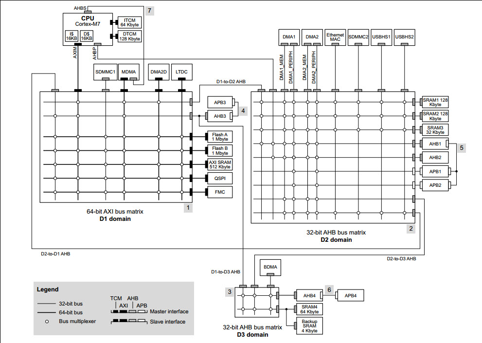
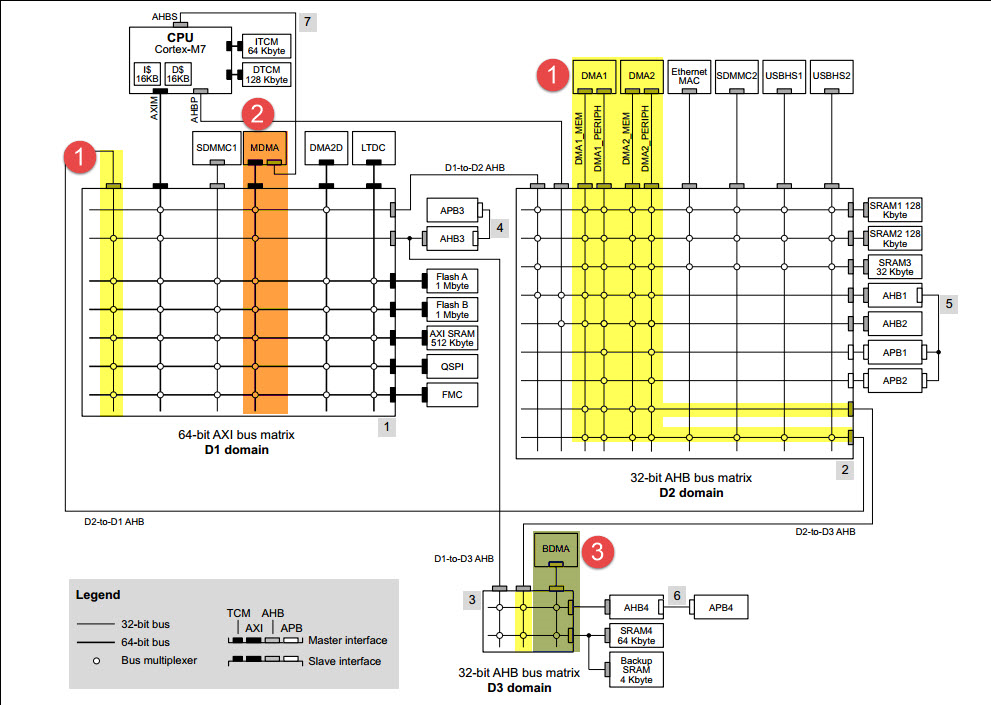
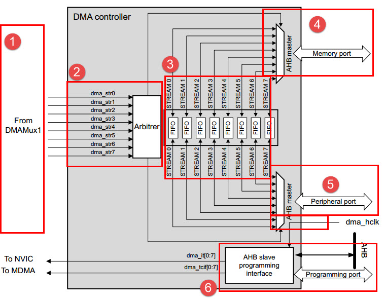
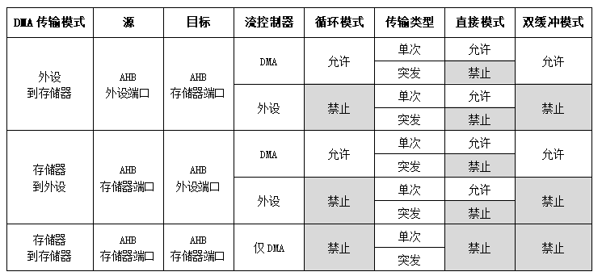
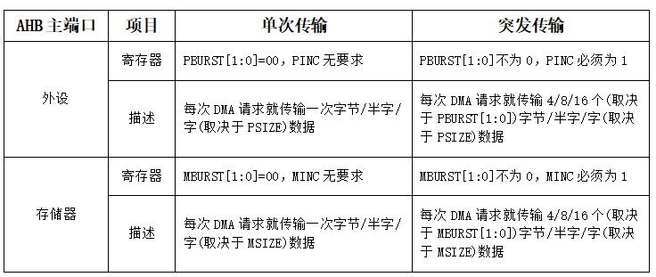
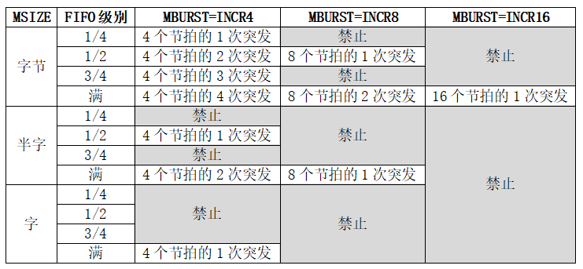

DMA—直接存储区访问
------------------

本章参考资料：《STM32H743用户手册》DMA控制器章节。

学习本章时，配合《STM32H743用户手册》DMA控制器章节一起阅读，效果会更佳，特别是涉及到寄存器说明的部分。本章内容专业名称较多，内容丰富也较难理解，但非常有必要细读研究。
特别说明，本章内容是以STM32H7xx系列资源讲解。

在学DMA之前，让我们先看一下STM32H7的内部架构。STM32H7采用电源域分块架构，分为三个独立电源域（D1，D2和D3），
见图 STM32H7的内部架构_ 。提升了性能而不牺牲能效。D1域，为高性能域，包含了高数据带宽的外设、连接在AXI总线矩阵上DMA控制器和存储器；D2域，
为通信接口域，主要是一些通信外设，如SPI、ETH等，还有DMA控制器和存储器；D3域，为数据批处理域， ADC，GPIO等外设就包含在该域中，
还包含了DMA控制器和存储器。 每个域都拥有各自的DMA控制器，D1域的DMA控制器，
称为MDMA， D2域的DMA控制器属于通用DMA， D3的DMA控制器，称为BDMA。

STM32H7的内部架构

DMA控制器

图 DMA控制器_ 的1处是通用DMA（DMA1和DMA2），线与线之间的空心圆，表示DMA能够访问该外设或者是该存储器，
可以看出通用除了不能访问ITCM-RAM和DTCM-RAM，D1和D3域的外设和存储器都可以访问；
2处是MDMA，MDMA可以访问ITCM-RAM和DTCM-RAM，还可以访问D2域和D3域的部分外设和存储器；
3处是BDMA，BDMA只能访问挂载在AHB4和APB4总线的外设、SRAM4以及BackupSRAM。
关于这些存储器的地址，可以参考。由于每一个DMA的访问地址都是有限制，所以我们需要注意变量的存储位置，
如果用户使能了Cache，还应该考虑数据的一致性，否则很容易造成DMA传输发送错误或者数据内容不对。

表格 STM32H7各DMA的内存访问权限

+----------+------------+----------+------+-----+------+--------+
| 存储空间 |  起始地址  | 空间大小 | MDMA | DMA | BDMA | 电源域 |
+==========+============+==========+======+=====+======+========+
| DTCM-RAM | 0x20000000 | 128K     | ✔    | ×   | ×    | D1     |
+----------+------------+----------+------+-----+------+--------+
| ITCM-RAM | 0x00000000 | 64K      | ✔    | ×   | ×    |        |
+----------+------------+----------+------+-----+------+--------+
| AXI SRAM | 0x24000000 | 512K     | ✔    | ✔   | ×    |        |
+----------+------------+----------+------+-----+------+--------+
| SRAM1    | 0x20000000 | 128K     | ✔    | ✔   | ×    | D2     |
+----------+------------+----------+------+-----+------+--------+
| SRAM2    | 0x30020000 | 128K     | ✔    | ✔   | ×    |        |
+----------+------------+----------+------+-----+------+--------+
| SRAM3    | 0x30040000 | 32K      | ✔    | ✔   | ×    |        |
+----------+------------+----------+------+-----+------+--------+
| SRAM4    | 0x38000000 | 64K      | ✔    | ✔   | ✔    | D3     |
+----------+------------+----------+------+-----+------+--------+

DMA简介
~~~~~~~

DMA(Direct Memory
Access,直接存储区访问)为实现数据高速在外设寄存器与存储器之间或者存储器与存储器之间传输提供了高效的方法。之所以称之为高效，是因为DMA传输实现高速数据移动过程无需任何CPU操作控制。从硬件层次上来说，DMA控制器是独立于Cortex-M7内核的，有点类似GPIO、USART外设一般，只是DMA的功能是可以快速移动内存数据。

STM32H7xx系列的DMA功能齐全，工作模式众多，适合不同编程环境要求。STM32H7xx系列的DMA支持外设到存储器传输、存储器到外设传输和存储器到存储器传输三种传输模式。这里的外设一般指外设的数据寄存器，比如ADC、SPI、I2C、DCMI等等外设的数据寄存器，存储器一般是指片内SRAM、外部存储器、片内Flash等等。

外设到存储器传输就是把外设数据寄存器内容转移到指定的内存空间。比如进行ADC采集时我们可以利用DMA传输把AD转换数据转移到我们定义的存储区中，这样对于多通道采集、采样频率高、连续输出数据的AD采集是非常高效的处理方法。

存储区到外设传输就是把特定存储区内容转移至外设的数据寄存器中，这种多用于外设的发送通信。

存储器到存储器传输就是把一个指定的存储区内容拷贝到另一个存储区空间。功能类似于C语言内存拷贝函数memcpy，利用DMA传输可以达到更高的传输效率，特别是DMA传输是不占用CPU的，可以节省很多CPU资源。

DMA功能框图
~~~~~~~~~~~

STM32H743的DMA可以实现外设寄存器与存储器之间或者存储器与存储器之间传输三种模式，这要得益于DMA控制器是采用AHB主总线的，可以控制AHB总线矩阵来启动AHB事务。
见 图21_1_：DMA控制器的框图。

①外设通道选择
''''''''''''''''

STM32H743系列资源丰富，具有两个DMA控制器，同时外设繁多，为实现正常传输，DMA需要通道选择控制。
DMA控制器具有8个数据流，每个数据流可以提供多达115个外设请求,映射情况参考下面表格。
外设通道选择要解决的主要问题是决定哪一个外设作为该数据流的源地址或者目标地址。

.. _表21_1:

+----------+------------------+----------+-----------+----------+-------------+
| DMA      | 请求来源         | DMA      | 请求来源  | DMA      | 请求来源    |
|          |                  |          |           |          |             |
| 请求编号 |                  | 请求编号 |           | 请求编号 |             |
+==========+==================+==========+===========+==========+=============+
| 1        | dmamux1_req_gen0 | 40       | SPI2_TX   | 79       | UART7_RX    |
+----------+------------------+----------+-----------+----------+-------------+
| 2        | dmamux1_req_gen1 | 41       | USART1_RX | 80       | UART7_TX    |
+----------+------------------+----------+-----------+----------+-------------+
| 3        | dmamux1_req_gen2 | 42       | USART1_TX | 81       | UART8_RX    |
+----------+------------------+----------+-----------+----------+-------------+
| 4        | dmamux1_req_gen3 | 43       | USART2_RX | 82       | UART8_TX    |
+----------+------------------+----------+-----------+----------+-------------+
| 5        | dmamux1_req_gen4 | 44       | USART2_TX | 83       | SPI4_RX     |
+----------+------------------+----------+-----------+----------+-------------+
| 6        | dmamux1_req_gen5 | 45       | USART3_RX | 84       | SPI4_TX     |
+----------+------------------+----------+-----------+----------+-------------+
| 7        | dmamux1_req_gen6 | 46       | USART3_TX | 85       | SPI5_RX     |
+----------+------------------+----------+-----------+----------+-------------+
| 8        | dmamux1_req_gen7 | 47       | TIM8_CH1  | 86       | SPI5_TX     |
+----------+------------------+----------+-----------+----------+-------------+
| 9        | ADC1             | 48       | TIM8_CH2  | 87       | SAI1_A      |
+----------+------------------+----------+-----------+----------+-------------+
| 10       | ADC2             | 49       | TIM8_CH3  | 88       | SAI1_B      |
+----------+------------------+----------+-----------+----------+-------------+
| 11       | TIM1_CH1         | 50       | TIM8_CH4  | 89       | SAI2_A      |
+----------+------------------+----------+-----------+----------+-------------+
| 12       | TIM1_CH2         | 51       | TIM8_UP   | 90       | SAI2_B      |
+----------+------------------+----------+-----------+----------+-------------+
| 13       | TIM1_CH3         | 52       | TIM8_TRIG | 91       | SWPMI_RX    |
+----------+------------------+----------+-----------+----------+-------------+
| 14       | TIM1_CH4         | 53       | TIM8_COM  | 92       | SWPMI_TX    |
+----------+------------------+----------+-----------+----------+-------------+
| 15       | TIM1_UP          | 54       | Reserved  | 93       | SPDIFRX_DT  |
+----------+------------------+----------+-----------+----------+-------------+
| 16       | TIM1_TRIG        | 55       | TIM5_CH1  | 94       | SPDIFRX_CS  |
+----------+------------------+----------+-----------+----------+-------------+
| 17       | TIM1_COM         | 56       | TIM5_CH2  | 95       | HR_REQ(1)   |
+----------+------------------+----------+-----------+----------+-------------+
| 18       | TIM2_CH1         | 57       | TIM5_CH3  | 96       | HR_REQ(2)   |
+----------+------------------+----------+-----------+----------+-------------+
| 19       | TIM2_CH2         | 58       | TIM5_CH4  | 97       | HR_REQ(3)   |
+----------+------------------+----------+-----------+----------+-------------+
| 20       | TIM2_CH3         | 59       | TIM5_UP   | 98       | HR_REQ(4)   |
+----------+------------------+----------+-----------+----------+-------------+
| 21       | TIM2_CH4         | 60       | TIM5_TRIG | 99       | HR_REQ(5)   |
+----------+------------------+----------+-----------+----------+-------------+
| 22       | TIM2_UP          | 61       | SPI3_RX   | 100      | HR_REQ(6)   |
+----------+------------------+----------+-----------+----------+-------------+
| 23       | TIM3_CH1         | 62       | SPI3_TX   | 101      | dfsdm1_dma0 |
+----------+------------------+----------+-----------+----------+-------------+
| 24       | TIM3_CH2         | 63       | UART4_RX  | 102      | dfsdm1_dma1 |
+----------+------------------+----------+-----------+----------+-------------+
| 25       | TIM3_CH3         | 64       | UART4_TX  | 103      | dfsdm1_dma2 |
+----------+------------------+----------+-----------+----------+-------------+
| 26       | TIM3_CH4         | 65       | USART5_RX | 104      | dfsdm1_dma3 |
+----------+------------------+----------+-----------+----------+-------------+
| 27       | TIM3_UP          | 66       | UART5_TX  | 105      | TIM15_CH1   |
+----------+------------------+----------+-----------+----------+-------------+
| 28       | TIM3_TRIG        | 67       | DAC1      | 106      | TIM15_UP    |
+----------+------------------+----------+-----------+----------+-------------+
| 29       | TIM4_CH1         | 68       | DAC2      | 107      | TIM15_TRIG  |
+----------+------------------+----------+-----------+----------+-------------+
| 30       | TIM4_CH2         | 69       | TIM6_UP   | 108      | TIM15_COM   |
+----------+------------------+----------+-----------+----------+-------------+
| 31       | TIM4_CH3         | 70       | TIM7_UP   | 109      | TIM16_CH1   |
+----------+------------------+----------+-----------+----------+-------------+
| 32       | TIM4_UP          | 71       | USART6_RX | 110      | TIM16_UP    |
+----------+------------------+----------+-----------+----------+-------------+
| 33       | I2C1_RX          | 72       | USART6_TX | 111      | TIM17_CH1   |
+----------+------------------+----------+-----------+----------+-------------+
| 34       | I2C1_TX          | 73       | I2C3_RX   | 112      | TIM17_UP    |
+----------+------------------+----------+-----------+----------+-------------+
| 35       | I2C2_RX          | 74       | I2C3_TX   | 113      | SAI3_A      |
+----------+------------------+----------+-----------+----------+-------------+
| 36       | I2C2_TX          | 75       | DCMI      | 114      | SAI3_B      |
+----------+------------------+----------+-----------+----------+-------------+
| 37       | SPI1_RX          | 76       | CRYP_IN   | 115      | ADC3        |
+----------+------------------+----------+-----------+----------+-------------+
| 38       | SPI1_TX          | 77       | CRYP_OUT  | -        | -           |
+----------+------------------+----------+-----------+----------+-------------+
| 39       | SPI2_RX          | 78       | HASH_IN   | -        | -           |
+----------+------------------+----------+-----------+----------+-------------+

每一个数据流都支持上述的115中DMA请求，比如SPI3_RX请求，即SPI3数据发送请求，
可以选择使用DMA1的数据流0，数据流1，数据流2等等。

②仲裁器
''''''''''

一个DMA控制器对应8个数据流，数据流包含要传输数据的源地址、目标地址、数据等等信息。如果我们需要同时使用同一个DMA控制器(DMA1或DMA2)多个外设请求时，那必然需要同时使用多个数据流，那究竟哪一个数据流具有优先传输的权利呢？这就需要仲裁器来管理判断了。

仲裁器管理数据流方法分为两个阶段。第一阶段属于软件阶段，我们在配置数据流时可以通过寄存器设定它的优先级别，具体配置DMA_SxCR寄存器PL[1:0]位，可以设置为非常高、高、中和低四个级别。第二阶段属于硬件阶段，如果两个或以上数据流软件设置优先级一样，则他们优先级取决于数据流编号，编号越低越具有优先权，比如数据流2优先级高于数据流3。

③FIFO
''''''''''''''

每个数据流都独立拥有四级32位FIFO(先进先出存储器缓冲区)。DMA传输具有FIFO模式和直接模式。

直接模式在每个外设请求都立即启动对存储器传输。在直接模式下，如果DMA配置为存储器到外设传输那DMA会见一个数据存放在FIFO内，如果外设启动DMA传输请求就可以马上将数据传输过去。

FIFO用于在源数据传输到目标地址之前临时存放这些数据。可以通过DMA数据流xFIFO控制寄存器DMA_SxFCR的FTH[1:0]位来控制FIFO的阈值，分别为1/4、1/2、3/4和满。如果数据存储量达到阈值级别时，FIFO内容将传输到目标中。

FIFO对于要求源地址和目标地址数据宽度不同时非常有用，比如源数据是源源不断的字节数据，而目标地址要求输出字宽度的数据，即在实现数据传输时同时把原来4个8位字节的数据拼凑成一个32位字数据。此时使用FIFO功能先把数据缓存起来，分别根据需要输出数据。

FIFO另外一个作用使用于突发(burst)传输。

④存储器端口、⑤外设端口
''''''''''''''''''''''''''''
DMA控制器实现双AHB主接口，更好利用总线矩阵和并行传输。DMA控制器通过存储器端口和外设端口与存储器和外设进行数据传输。

DMA控制器的功能是快速转移内存数据，需要一个连接至源数据地址的端口和一个连接至目标地址的端口。

DMA2(DMA控制器2)的存储器端口和外设端口都是连接到AHB总线矩阵，可以使用AHB总线矩阵功能。DMA2存储器和外设端口可以访问相关的内存地址，包括有内部Flash、内部SRAM、AHB1外设、AHB2外设、APB2外设和外部存储器空间。

⑥编程端口
'''''''''

AHB从器件编程端口是连接至AHB2外设的。AHB2外设在使用DMA传输时需要相关控制信号。

DMA数据配置
~~~~~~~~~~~

DMA工作模式多样，具有多种可能工作模式，具体可能配置见 图21_5_。

DMA传输模式
''''''''''''''''

DMA2支持全部三种传输模式，而DMA1只有外设到存储器和存储器到外设两种模式。模式选择可以通过DMA_SxCR寄存器的DIR[1:0]位控制，进而将DMA_SxCR寄存器的EN位置1就可以使能DMA传输。

在DMA_SxCR寄存器的PSIZE[1:0]和MSIZE[1:0]位分别指定外设和存储器数据宽度大小，可以指定为字节(8位)、半字(16位)和字(32位)，我们可以根据实际情况设置。直接模式要求外设和存储器数据宽度大小一样，实际上在这种模式下DMA数据流直接使用PSIZE，MSIZE不被使用。

源地址和目标地址
''''''''''''''''

DMA数据流x外设地址DMA_SxPAR(x为0~7)寄存器用来指定外设地址，它是一个32位数据有效寄存器。
DMA数据流x存储器0地址DMA_SxM0AR(x为0~7) 寄存器和DMA数据流x存储器1地址DMA_SxM1AR(x为0~7)
寄存器用来存放存储器地址，其中DMA_SxM1AR只用于双缓冲模式，DMA_SxM0AR和DMA_SxM1AR都是32位数据有效的。

当选择外设到存储器模式时，即设置DMA_SxCR寄存器的DIR[1:0] 位为“00”，DMA_SxPAR寄存器为外设地址，
也是传输的源地址，DMA_SxM0AR寄存器为存储器地址，也是传输的目标地址。对于存储器到存储器传输模式，
即设置DIR[1:0] 位为“10”时，采用与外设到存储器模式相同配置。而对于存储器到外设，即设置DIR[1:0]位为“01”时，
DMA_SxM0AR寄存器作为为源地址，DMA_SxPAR寄存器作为目标地址。

流控制器
''''''''''''''''
流控制器主要涉及到一个控制DMA传输停止问题。DMA传输在DMA_SxCR寄存器的EN位被置1后就进入准备传输状态，
如果有外设请求DMA传输就可以进行数据传输。很多情况下，我们明确知道传输数据的数目，比如要传1000个或者2000个数据，
这样我们就可以在传输之前设置DMA_SxNDTR寄存器为要传输数目值，DMA控制器在传输完这么多数目数据后就可以控制DMA停止传输。

DMA数据流x数据项数DMA_SxNDTR(x为0~7)寄存器用来记录当前仍需要传输数目，它是一个16位数据有效寄存器，即最大值为65535，
这个值在程序设计是非常有用也是需要注意的地方。我们在编程时一般都会明确指定一个传输数量，
在完成一次数目传输后DMA_SxNDTR计数值就会自减，当达到零时就说明传输完成。

如果某些情况下在传输之前我们无法确定数据的数目，那DMA就无法自动控制传输停止了，
此时需要外设通过硬件通信向DMA控制器发送停止传输信号。这里有一个大前提就是外设必须是可以发出这个停止传输信号，
只有SDIO才有这个功能，其他外设不具备此功能。

循环模式
''''''''''''''''

循环模式相对应于一次模式。一次模式就是传输一次就停止传输，下一次传输需要手动控制，而循环模式在传输一次后会自动按照相同配置重新传输，周而复始直至被控制停止或传输发生错误。

通过DMA_SxCR寄存器的CIRC位可以使能循环模式。

传输类型
''''''''''''''''
DMA传输类型有单次(Single)传输和突发(Burst)传输。突发传输就是用非常短时间结合非常高数据信号率传输数据，相对正常传输速度，突发传输就是在传输阶段把速度瞬间提高，实现高速传输，在数据传输完成后恢复正常速度，有点类似达到数据块“秒传”效果。为达到这个效果突发传输过程要占用AHB总线，保证要求每个数据项在传输过程不被分割，这样一次性把数据全部传输完才释放AHB总线；而单次传输时必须通过AHB的总线仲裁多次控制才传输完成。

单次和突发传输数据使用具体情况参考表 21-4。其中PBURST[1:0]和MBURST[1:0]位是位于DMA_SxCR寄存器中的，
用于分别设置外设和存储器不同节拍数的突发传输，对应为单次传输、4个节拍增量传输、8个节拍增量传输和16个节拍增量传输。
PINC位和MINC位是寄存器DMA_SxCR寄存器的第9和第10位，如果位被置1则在每次数据传输后数据地址指针自动递增，
其增量由PSIZE和MSIZE值决定，比如，设置PSIZE为半字大小，那么下一次传输地址将是前一次地址递增2。

表 21-4

突发传输与FIFO密切相关，突发传输需要结合FIFO使用，具体要求FIFO阈值一定要是内存突发传输数据量的整数倍。
FIFO阈值选择和存储器突发大小必须配合使用，具体参考下表。

直接模式
''''''''''''''''
默认情况下，DMA工作在直接模式，不使能FIFO阈值级别。

直接模式在每个外设请求都立即启动对存储器传输的单次传输。直接模式要求源地址和目标地址的数据宽度必须一致，所以只有PSIZE控制，而MSIZE值被忽略。突发传输是基于FIFO的所以直接模式不被支持。另外直接模式不能用于存储器到存储器传输。

在直接模式下，如果DMA配置为存储器到外设传输那DMA会见一个数据存放在FIFO内，如果外设启动DMA传输请求就可以马上将数据传输过去。

双缓冲模式
''''''''''''''''
设置DMA_SxCR寄存器的DBM位为1可启动双缓冲传输模式，并自动激活循环模式。双缓冲不应用与存储器到存储器的传输。双缓冲模式下，两个存储器地址指针都有效，即DMA_SxM1AR寄存器将被激活使用。开始传输使用DMA_SxM0AR寄存器的地址指针所对应的存储区，当这个存储区数据传输完DMA控制器会自动切换至DMA_SxM1AR寄存器的地址指针所对应的另一块存储区，如果这一块也传输完成就再切换至DMA_SxM0AR寄存器的地址指针所对应的存储区，这样循环调用。

当其中一个存储区传输完成时都会把传输完成中断标志TCIF位置1，如果我们使能了DMA_SxCR寄存器的传输完成中断，则可以产生中断信号，这个对我们编程非常有用。另外一个非常有用的信息是DMA_SxCR寄存器的CT位，当DMA控制器是在访问使用DMA_SxM0AR时CT=0，此时CPU不能访问DMA_SxM0AR，但可以向DMA_SxM1AR填充或者读取数据；当DMA控制器是在访问使用DMA_SxM1AR时CT=1，此时CPU不能访问DMA_SxM1AR，但可以向DMA_SxM0AR填充或者读取数据。另外在未使能DMA数据流传输时，可以直接写CT位，改变开始传输的目标存储区。

双缓冲模式应用在需要解码程序的地方是非常有效的。比如MP3格式音频解码播放，MP3是被压缩的文件格式，我们需要特定的解码库程序来解码文件才能得到可以播放的PCM信号，解码需要一定的实际，按照常规方法是读取一段原始数据到缓冲区，然后对缓冲区内容进行解码，解码后才输出到音频播放电路，这种流程对CPU运算速度要求高，很容易出现播放不流畅现象。如果我们使用DMA双缓冲模式传输数据就可以非常好的解决这个问题，达到解码和输出音频数据到音频电路同步进行的效果。

DMA中断
''''''''''''''''
每个DMA数据流可以在发送以下事件时产生中断：

1)达到半传输：DMA数据传输达到一半时HTIF标志位被置1，如果使能HTIE中断控制位将产生达到半传输中断；

2)传输完成：DMA数据传输完成时TCIF标志位被置1，如果使能TCIE中断控制位将产生传输完成中断；

3)传输错误：DMA访问总线发生错误或者在双缓冲模式下试图访问“受限”存储器地址寄存器时TEIF标志位被置1，如果使能TEIE中断控制位将产生传输错误中断；

4)FIFO错误：发生FIFO下溢或者上溢时FEIF标志位被置1，如果使能FEIE中断控制位将产生FIFO错误中断；

5)直接模式错误：在外设到存储器的直接模式下，因为存储器总线没得到授权，使得先前数据没有完成被传输到存储器空间上，此时DMEIF标志位被置1，如果使能DMEIE中断控制位将产生直接模式错误中断。

DMA初始化结构体详解
~~~~~~~~~~~~~~~~~~~

HAL函数对每个外设都建立了一个初始化结构体xxx_InitTypeDef(xxx为外设名称)，结构体成员用于设置外设工作参数，并由HAL库函数xxx_Init()调用这些设定参数进入设置外设相应的寄存器，达到配置外设工作环境的目的。

结构体xxx_InitTypeDef和库函数xxx_Init配合使用是标准库精髓所在，理解了结构体xxx_InitTypeDef每个成员意义基本上就可以对该外设运用自如了。
结构体xxx_InitTypeDef定义在stm32H7xx_xxx.h(后面xxx为外设名称)文件中，库函数xxx_Init定义在stm32H7xx_xxx.c文件中，编程时我们可以结合这两个文件内注释使用。

DMA_HandleTypeDef外设管理结构体（stm32h7xx_hal_dma.h文件）
''''''''''''''''''''''''''''''''''''''''''''''''''''''''''''''''

.. code-block:: c

    typedef struct __DMA_HandleTypeDef {
        void                            *Instance; /*!< 外设寄存器基地址*/
        DMA_InitTypeDef                 Init;   /*!< DMA初始化结构体*/
        HAL_LockTypeDef                 Lock;   /*!< DMA锁资源*/
        __IO HAL_DMA_StateTypeDef       State;  /*!< DMA工作状态*/
        void *Parent;/*!<父对象*/
        void (* XferCpltCallback)( struct __DMA_HandleTypeDef * hdma);      /*!< DMA传输完成回调函数*/
        void (* XferHalfCpltCallback)( struct __DMA_HandleTypeDef * hdma);  /*!< DMA半传输回调函数*/
        void (* XferM1CpltCallback)( struct __DMA_HandleTypeDef * hdma);    /*!< DMA缓冲区1完成传输完成回调函数*/
        void (* XferM1HalfCpltCallback)( struct __DMA_HandleTypeDef * hdma);/*!< DMA缓冲区1半传输回调函数*/
        void (* XferErrorCallback)( struct __DMA_HandleTypeDef * hdma);     /*!< DMA传输错误回调函数*/
        void (* XferAbortCallback)( struct __DMA_HandleTypeDef * hdma);     /*!< DMA传输终止回调函数*/
        __IO uint32_t               ErrorCode;/*!< DMA错误执行操作返回值*/
        uint32_t                         StreamBaseAddress;/*!< DMA数据流基地址*/
        uint32_t                         StreamIndex;      /*!< DMA数据流的下标*/
        DMAMUX_Channel_TypeDef           *DMAmuxChannel;   /*!< DMAMUX通道基地址*/
        DMAMUX_ChannelStatus_TypeDef     *DMAmuxChannelStatus;/*!< DMAMUX通道状态寄存器地址*/
        uint32_t                         DMAmuxChannelStatusMask;/*!< DMAMUX通道状态值掩码*/
        DMAMUX_RequestGen_TypeDef        *DMAmuxRequestGen; /*!< DMAMUX请求生成器外设基地址 */
        DMAMUX_RequestGenStatus_TypeDef  *DMAmuxRequestGenStatus;/*!< DMAMUX请求生成器状态寄存器基地址*/
        uint32_t                         DMAmuxRequestGenStatusMask; /*!< DMAMUX请求生成器状态值掩码*/
    } DMA_HandleTypeDef;

1)	Instance：指向DMA数据流基地址的指针，即指定使用哪个DMA数据流。可选数据流0至数据流7。

2)	Init：DMA初始化结构体，用来配置DMA的请求，以及传输数据的个数等，具体请看下面的介绍。

3)	Lock：DMA的锁资源。DMA进程锁，通常都在DMA传输设置开始前锁上进程锁，设置完毕后释放进程锁。

4)	State：DMA传输状态。它包含六种状态，1、复位状态，尚未初始化或者禁能。2、就绪状态，已经完成初始化，随时可以传输数据。3、传输忙，DMA传输进程正在进行。4、传输超时状态。5、传输错误状态。6、传输中止状态。

5)	Parent：父类指针。只要将该指针指向一些ADC、UART等外设的handle类，就等于完成了继承。

6)	XferCpltCallback、XferHalfCpltCallback、XferM1CpltCallback、XferM1HalfCpltCallback、XferErrorCallback、XferAbortCallback：分别对应着DMA传输完成的回调函数，DMA半传输回调函数，DMA缓冲区1完成传输完成回调函数，DMA缓冲区1半传输回调函数，DMA传输错误回调函数和DMA传输终止回调函数。用户可以在该函数编写相关的操作代码。

7)	ErrorCode：DMA错误码，包含无错误：HAL_DMA_ERROR_NONE，传输错误HAL_DMA_ERROR_TE，FIFO错误HAL_DMA_ERROR_FE，直接模式错误：HAL_DMA_ERROR_DME，超时错误：HAL_DMA_ERROR_TIMEOUT，参数错误：HAL_DMA_ERROR_PARAM，没有回调函数正在执行退出请求错误：HAL_DMA_ERROR_NO_XFER，不支持模式错误：HAL_DMA_ERROR_NOT_SUPPORTED。

8)	StreamBaseAddress：DMA数据流基地址，用来根据定义句柄计算数据流的基地址。

9)	StreamIndex：DMA数据流索引，根据数据流的序号来确定数据流的偏移地址。

10)	DMAmuxChannel：DMAMUX的外设基地址，DMAMUX主要是用来配置DMA的外设请求。

11)	DMAmuxChannelStatus： DMAMUX的状态寄存器基地址。

12)	DMAmuxChannelStatusMask：DMAMUX的状态值掩码，用来屏蔽某些无关的数据位。

13)	DMAmuxRequestGen：DMAMUX的请求产生寄存器基地址。

14)	DMAmuxRequestGenStatus：DMAMUX的请求产生状态寄存器基地址

15)	DMAmuxRequestGenStatusMask：DMAMUX的请求产生的状态值掩码，用来屏蔽某些无关的数据位。

一般情况下，我们使用DMA只需要配置1，2两个参数就可以了，至于其他的参数，则是由HAL库调用函数进行配置。

DMA_InitTypeDef初始化结构体（stm32h7xx_hal_dma.h文件）
''''''''''''''''''''''''''''''''''''''''''''''''''''''''''''''''

.. code-block:: c

    typedef struct {
        uint32_t Request;               /*!< DMA请求*/
        uint32_t Direction;            /*!< 传输方向*/
        uint32_t PeriphInc;            /*!< 外设地址递增*/
        uint32_t MemInc;               /*!< 存储器地址递增*/
        uint32_t PeriphDataAlignment;  /*!< 外设数据宽度*/
        uint32_t MemDataAlignment;     /*!< 内存数据宽度*/
        uint32_t Mode;                 /*!< DMA模式选择*/
        uint32_t Priority;             /*!< 优先级*/
        uint32_t FIFOMode;             /*!< FIFO模式*/
        uint32_t FIFOThreshold;        /*!< FIFO阈值*/
        uint32_t MemBurst;             /*!< 存储器突发传输*/
        uint32_t PeriphBurst;          /*!< 外设突发传输*/
    } DMA_InitTypeDef;

1)  Request：DMA请求选择，每个外设对应固定的值，具体设置值需要查 表21_1_；
    它设定DMAmuxChannel的寄存器CCR的SPOL[3:0]位的值。
    例如，我们使用模拟数字转换器ADC3规则采集4个输入通道的电压数据，查 表21_1_ 可知编号为115。

2)	Direction：传输方向选择，可选外设到存储器、存储器到外设以及存储器到存储器。它设定DMA_SxCR寄存器的DIR[1:0]位的值。ADC采集显然使用外设到存储器模式。

3)	PeriphInc：如果配置为PeriphInc_Enable，使能外设地址自动递增功能，它设定DMA_SxCR寄存器的PINC位的值；一般外设都是只有一个数据寄存器，所以一般不会使能该位。ADC3的数据寄存器地址是固定并且只有一个所以不使能外设地址递增。

4)	MemInc：如果配置为MemInc_Enable，使能存储器地址自动递增功能，它设定DMA_SxCR寄存器的MINC位的值；我们自定义的存储区一般都是存放多个数据的，所以使能存储器地址自动递增功能。我们之前已经定义了一个包含4个元素的数字用来存放数据，使能存储区地址递增功能，自动把每个通道数据存放到对应数组元素内。

5)	PeriphDataAlignment：外设数据宽度，可选字节(8位)、半字(16位)和字(32位)，它设定DMA_SxCR寄存器的PSIZE[1:0]位的值。ADC数据寄存器只有低16位数据有效，使用半字数据宽度。

6)	MemDataAlignment：存储器数据宽度，可选字节(8位)、半字(16位)和字(32位)，它设定DMA_SxCR寄存器的MSIZE[1:0]位的值。保存ADC转换数据也要使用半字数据宽度，这跟我们定义的数组是相对应的。

7)	Mode：DMA传输模式选择，可选一次传输或者循环传输，它设定DMA_SxCR寄存器的CIRC位的值。我们希望ADC采集是持续循环进行的，所以使用循环传输模式。

8)	Priority：软件设置数据流的优先级，有4个可选优先级分别为非常高、高、中和低，它设定DMA_SxCR寄存器的PL[1:0]位的值。DMA优先级只有在多个DMA数据流同时使用时才有意义，这里我们设置为非常高优先级就可以了。

9)	FIFOMode：FIFO模式使能，如果设置为DMA_FIFOMode_Enable表示使能FIFO模式功能；它设定DMA_SxFCR寄存器的DMDIS位。ADC采集传输使用直接传输模式即可，不需要使用FIFO模式。

10) FIFOThreshold：FIFO阈值选择，可选4种状态分别为FIFO容量的1/4、1/2、3/4和满；它设定DMA_SxFCR寄存器的FTH[1:0]位；
    DMA_FIFOMode设置为DMA_FIFOMode_Disable，那DMA_FIFOThreshold值无效。ADC采集传输不使用FIFO模式，设置改值无效。

11)	MemBurst：存储器突发模式选择，可选单次模式、4节拍的增量突发模式、8节拍的增量突发模式或16节拍的增量突发模式，它设定DMA_SxCR寄存器的MBURST[1:0]位的值。ADC采集传输是直接模式，要求使用单次模式。

12)	PeriphBurst：外设突发模式选择，可选单次模式、4节拍的增量突发模式、8节拍的增量突发模式或16节拍的增量突发模式，它设定DMA_SxCR寄存器的PBURST[1:0]位的值。ADC采集传输是直接模式，要求使用单次模式。

DMA存储器到存储器模式实验
~~~~~~~~~~~~~~~~~~~~~~~~~~~~

DMA工作模式多样，具体如何使用需要配合实际传输条件具体分析。接下来我们通过两个实验详细讲解DMA不同模式下的使用配置，加深我们对DMA功能的理解。

DMA运行高效，使用方便，在很多测试实验都会用到，这里先详解存储器到存储器和存储器到外设这两种模式，其他功能模式在其他章节会有很多使用到的情况，也会有相关的分析。

存储器到存储器模式可以实现数据在两个内存的快速拷贝。我们先定义一个静态的源数据，然后使用DMA传输把源数据拷贝到目标地址上，最后对比源数据和目标地址的数据，看看是否传输准确。

硬件设计
''''''''''''''''''''''''''''''''

DMA存储器到存储器实验不需要其他硬件要求，只用到RGB彩色灯用于指示程序状态，关于RGB彩色灯电路可以参考GPIO章节。

软件设计
''''''''''''''''''''''''''''''''

这里只讲解核心的部分代码，有些变量的设置，头文件的包含等并没有涉及到，完整的代码请参考本章配套的工程。这个实验代码比较简单，主要程序代码都在main.c文件中。

编程要点
=============

1) 使能DMA数据流时钟并复位初始化DMA数据流；

2) 配置DMA数据参数；

3) 使能DMA数据流，进行传输；

4) 等待传输完成，并对源数据和目标地址数据进行比较。

代码分析
========================

DMA宏定义及相关变量定义
+++++++++++++++++++++++++++++

代码清单 21‑1 DMA数据流和相关变量定义

.. code-block:: c
   :name: 代码清单21_1

    /* 相关宏定义，使用存储器到存储器传输必须使用DMA2 */
    DMA_HandleTypeDef DMA_Handle;

    #define DMA_STREAM               DMA2_Stream0
    #define DMA_CHANNEL              DMA_CHANNEL_0
    #define DMA_STREAM_CLOCK()       __DMA2_CLK_ENABLE()

    #define BUFFER_SIZE              32

    /* 定义aSRC_Const_Buffer数组作为DMA传输数据源
    const关键字将aSRC_Const_Buffer数组变量定义为常量类型 */
    const uint32_t aSRC_Const_Buffer[BUFFER_SIZE]= {
        0x01020304,0x05060708,0x090A0B0C,0x0D0E0F10,
        0x11121314,0x15161718,0x191A1B1C,0x1D1E1F20,
        0x21222324,0x25262728,0x292A2B2C,0x2D2E2F30,
        0x31323334,0x35363738,0x393A3B3C,0x3D3E3F40,
        0x41424344,0x44564748,0x494A4B4C,0x4D4E4F50,
        0x51525345,0x55565758,0x595A5B5C,0x5D5E5F60,
        0x61626364,0x65666768,0x696A6B6C,0x6D6E6H70,
        0x71727374,0x75743778,0x797A7B7C,0x7D7E7F80
    };
    /* 定义DMA传输目标存储器 */
    __attribute__((at(0X24000000))) uint32_t aDST_Buffer[BUFFER_SIZE];

使用宏定义设置外设配置方便程序修改和升级。

例程使用的是DMA2，但对数据流编号以及通道选择就没有硬性要求，可以自由选择。

aSRC_Const_Buffer[BUFFER_SIZE]是定义用来存放源数据的，并且使用了const关键字修饰，即常量类型，使得变量是存储在内部flash空间上。

aDST_Buffer[BUFFER_SIZE]是定义用来存放数据的目的地，指定其存放位置位于起始地址为0x24000000的内存空间。使用__attribute__指令，防止该数组被分配在DTCM段的地址范围之内。

DMA数据配置
+++++++++++++++++++++++++++++

代码清单 21‑2 DMA传输参数配置

.. code-block:: c
   :name: 代码清单21_2

    static void DMA_Config(void)
    {
        HAL_StatusTypeDef DMA_status = HAL_ERROR;
        /* 使能DMA时钟 */
        DMA_STREAM_CLOCK();

        DMA_Handle.Instance = DMA_STREAM;
        /* DMA数据流通道选择 */
        DMA_Handle.Init .Channel = DMA_CHANNEL;
        /* 存储器到存储器模式 */
        DMA_Handle.Init.Direction = DMA_MEMORY_TO_MEMORY;
        /* 使能自动递增功能 */
        DMA_Handle.Init.PeriphInc = DMA_PINC_ENABLE;
        /* 使能自动递增功能 */
        DMA_Handle.Init.MemInc = DMA_MINC_ENABLE;
        /* 源数据是字大小(32位) */
        DMA_Handle.Init.PeriphDataAlignment = DMA_PDATAALIGN_WORD;
        /* 目标数据也是字大小(32位) */
        DMA_Handle.Init.MemDataAlignment = DMA_MDATAALIGN_WORD;
        /* 一次传输模式，存储器到存储器模式不能使用循环传输 */
        DMA_Handle.Init.Mode = DMA_NORMAL;
        /* DMA数据流优先级为高 */
        DMA_Handle.Init.Priority = DMA_PRIORITY_HIGH;
        /* 禁用FIFO模式 */
        DMA_Handle.Init.FIFOMode = DMA_FIFOMODE_DISABLE;
        DMA_Handle.Init.FIFOThreshold = DMA_FIFO_THRESHOLD_FULL;
        /* 单次模式 */
        DMA_Handle.Init.MemBurst = DMA_MBURST_SINGLE;
        /* 单次模式 */
        DMA_Handle.Init.PeriphBurst = DMA_PBURST_SINGLE;
        /* 完成DMA数据流参数配置 */
        HAL_DMA_Init(&DMA_Handle);

        DMA_status = HAL_DMA_Start(&DMA_Handle,(uint32_t)aSRC_Const_Buffer,
                (uint32_t)aDST_Buffer,BUFFER_SIZE);
        /* 判断DMA状态 */
        if (DMA_status != HAL_OK) {
            /* DMA出错就让程序运行下面循环：RGB彩色灯闪烁 */
            while (1) {
                LED_RED;
                Delay(0xFFFFFF);
                LED_RGBOFF;
                Delay(0xFFFFFF);
            }
        }
    }

使用DMA_DMA_HandleTypeDef结构体定义一个DMA数据流初始化变量，这个结构体内容我们之前已经有详细讲解。

调用DMA_STREAM_CLOCK函数开启DMA数据流时钟，使用DMA控制器之前必须开启对应的时钟。

存储器到存储器模式通道选择没有具体规定，只能使用一次传输模式不能循环传输，最后我调用HAL_DMA_Init函数完成DMA数据流的初始化配置。

HAL_DMA_Start函数用于启动DMA数据流传输，源地址和目标地址使用之前定义的数组首地址，返回DMA传输状态。

如果DMA传输没有就绪就会闪烁RGB彩灯提示。

存储器数据对比
+++++++++++++++++++++++++++++

代码清单 21‑3 源数据与目标地址数据对比

.. code-block:: c
   :name: 代码清单21_3

    uint8_t Buffercmp(const uint32_t* pBuffer,
                    uint32_t* pBuffer1, uint16_t BufferLength)
    {
        /* 数据长度递减 */
        while (BufferLength--) {
            /* 判断两个数据源是否对应相等 */
            if (*pBuffer != *pBuffer1) {
                /* 对应数据源不相等马上退出函数，并返回0 */
                return 0;
            }
            /* 递增两个数据源的地址指针 */
            pBuffer++;
            pBuffer1++;
        }
        /* 完成判断并且对应数据相对 */
        return 1;
    }

判断指定长度的两个数据源是否完全相等，如果完全相等返回1；只要其中一对数据不相等返回0。它需要三个形参，前两个是两个数据源的地址，第三个是要比较数据长度。

主函数
+++++++++++++++++++++++++++++

代码清单 21‑4 存储器到存储器模式主函数

.. code-block:: c
   :name: 代码清单21_4

    int main(void)
    {
        /* 定义存放比较结果变量 */
        uint8_t TransferStatus;
        /* 系统时钟初始化成400 MHz */
        SystemClock_Config();
        /* LED 端口初始化 */
        LED_GPIO_Config();
        /* 设置RGB彩色灯为紫色 */
        LED_PURPLE;

        /* 简单延时函数 */
        Delay(0xFFFFFF);

        /* DMA传输配置 */
        DMA_Config();

        /* 等待DMA传输完成 */
        while (__HAL_DMA_GET_FLAG(&DMA_Handle,DMA_FLAG_TCIF0_4)==DISABLE) {

        }

        /* 比较源数据与传输后数据 */
        TransferStatus=Buffercmp(aSRC_Const_Buffer, aDST_Buffer, BUFFER_SIZE);

        /* 判断源数据与传输后数据比较结果*/
        if (TransferStatus==0) {
            /* 源数据与传输后数据不相等时RGB彩色灯显示红色 */
            LED_RED;
        } else {
            /* 源数据与传输后数据相等时RGB彩色灯显示蓝色 */
            LED_BLUE;
        }

        while (1) {
        }
    }

首先定义一个变量用来保存存储器数据比较结果。

SystemClock_Config函数初始化系统时钟。

RGB彩色灯用来指示程序进程，使用之前需要初始化它，LED_GPIO_Config定义在bsp_led.c文件中。开始设置RGB彩色灯为紫色，LED_PURPLE是定义在bsp_led.h文件的一个宏定义。

Delay函数只是一个简单的延时函数。

调用DMA_Config函数完成DMA数据流配置并启动DMA数据传输。

__HAL_DMA_GET_FLAG函数获取DMA数据流事件标志位的当前状态，这里获取DMA数据传输完成这个标志位，使用循环持续等待直到该标志位被置位，即DMA传输完成这个事件发生，然后退出循环，运行之后程序。

确定DMA传输完成之后就可以调用Buffercmp函数比较源数据与DMA传输后目标地址的数据是否一一对应。TransferStatus保存比较结果，如果为1表示两个数据源一一对应相等说明DMA传输成功；相反，如果为0表示两个数据源数据存在不等情况，说明DMA传输出错。

如果DMA传输成功设置RGB彩色灯为蓝色，如果DMA传输出错设置RGB彩色灯为红色。

下载验证
============

确保开发板供电正常，编译程序并下载。观察RGB彩色灯变化情况。正常情况下RGB彩色灯先为紫色，然后变成蓝色。如果DMA传输出错才会为红色。

DMA存储器到外设模式实验
~~~~~~~~~~~~~~~~~~~~~~~

DMA存储器到外设传输模式非常方便把存储器数据传输外设数据寄存器中，这在STM32芯片向其他目标主机，比如电脑、另外一块开发板或者功能芯片，发送数据是非常有用的。RS-232串口通信是我们常用开发板与PC端通信的方法。我们可以使用DMA传输把指定的存储器数据转移到USART数据寄存器内，并发送至PC端，在串口调试助手显示。

硬件设计
''''''''''''''

存储器到外设模式使用到USART1功能，具体电路设置参考USART章节，无需其他硬件设计。

软件设计
'''''''''''''

这里只讲解核心的部分代码，有些变量的设置，头文件的包含等并没有涉及到，完整的代码请参考本章配套的工程。我们编写两个串口驱动文件bsp_usart_dma.c和bsp_usart_dma.h，有关串口和DMA的宏定义以及驱动函数都在里边。

编程要点
===============

1) 配置USART通信功能；

2) 设置DMA为存储器到外设模式，设置数据流通道，指定USART数据寄存器为目标地址，循环发送模式；

3) 使能DMA数据流；

4) 使能USART的DMA发送请求。

5) DMA传输同时CPU可以运行其他任务。

代码分析
===============

USART和DMA宏定义
+++++++++++++++++++++

代码清单 21‑5 USART和DMA相关宏定义

.. code-block:: c
   :name: 代码清单21_5

    //引脚定义
    /*******************************************************/
    #define DEBUG_USART                             USART1
    #define DEBUG_USART_CLK_ENABLE()                __USART1_CLK_ENABLE();

    #define DEBUG_USART_RX_GPIO_PORT                GPIOA
    #define DEBUG_USART_RX_GPIO_CLK_ENABLE()        __HAL_RCC_GPIOA_CLK_ENABLE()
    #define DEBUG_USART_RX_PIN                      GPIO_PIN_10
    #define DEBUG_USART_RX_AF                       GPIO_AF7_USART1

    #define DEBUG_USART_TX_GPIO_PORT                GPIOA
    #define DEBUG_USART_TX_GPIO_CLK_ENABLE()        __HAL_RCC_GPIOA_CLK_ENABLE()
    #define DEBUG_USART_TX_PIN                      GPIO_PIN_9
    #define DEBUG_USART_TX_AF                       GPIO_AF7_USART1

    #define DEBUG_USART_IRQHandler                  USART1_IRQHandler
    #define DEBUG_USART_IRQ                         USART1_IRQn
    /************************************************************/
    //DMA
    #define SENDBUFF_SIZE                           5000  //发送的数据量
    #define DEBUG_USART_DMA_CLK_ENABLE()            __DMA2_CLK_ENABLE()
    #define DEBUG_USART_DMA_REQUEST                 DMA_REQUEST_USART1_TX
    #define DEBUG_USART_DMA_STREAM                  DMA2_Stream7

    //串口波特率
    #define DEBUG_USART_BAUDRATE                    115200

使用宏定义设置外设配置方便程序修改和升级。

USART部分设置与USART章节内容相同，可以参考USART章节内容理解。

例程中USART1使用的DMA数据了选择DMA2的数据流7。

串口DMA传输配置
+++++++++++++++++++++

代码清单 21‑6 USART1 发送请求DMA设置

.. code-block:: c
   :name: 代码清单21_6

   void USART_DMA_Config(void)
   {
     /*开启DMA时钟*/
     DEBUG_USART_DMA_CLK_ENABLE();

     DMA_Handle.Instance = DEBUG_USART_DMA_STREAM;
     /*usart1 tx对应dma2，通道4，数据流7*/
     DMA_Handle.Init.Channel = DEBUG_USART_DMA_CHANNEL;
     /*方向：从内存到外设*/
     DMA_Handle.Init.Direction= DMA_MEMORY_TO_PERIPH;
     /*外设地址不增*/
     DMA_Handle.Init.PeriphInc = DMA_PINC_DISABLE;
     /*内存地址自增*/
     DMA_Handle.Init.MemInc = DMA_MINC_ENABLE;
     /*外设数据单位*/
     DMA_Handle.Init.PeriphDataAlignment = DMA_PDATAALIGN_BYTE;
     /*内存数据单位 8bit*/
     DMA_Handle.Init.MemDataAlignment = DMA_MDATAALIGN_BYTE;
     /*DMA模式：不断循环*/
     DMA_Handle.Init.Mode = DMA_CIRCULAR;
     /*优先级：中*/
     DMA_Handle.Init.Priority = DMA_PRIORITY_MEDIUM;
     /*禁用FIFO*/
     DMA_Handle.Init.FIFOMode = DMA_FIFOMODE_DISABLE;
     DMA_Handle.Init.FIFOThreshold = DMA_FIFO_THRESHOLD_FULL;
     /*存储器突发传输 16个节拍*/
     DMA_Handle.Init.MemBurst = DMA_MBURST_SINGLE;
     /*外设突发传输 1个节拍*/
     DMA_Handle.Init.PeriphBurst = DMA_PBURST_SINGLE;
     /*配置DMA2的数据流7*/
     /* Deinitialize the stream for new transfer */
     HAL_DMA_DeInit(&DMA_Handle);
     /* Configure the DMA stream */
     HAL_DMA_Init(&DMA_Handle);

     /* Associate the DMA handle */
     __HAL_LINKDMA(&UartHandle, hdmatx, DMA_Handle);
    }

使用DMA_HandleTypeDef结构体定义一个DMA数据流初始化变量，这个结构体内容我们之前已经有详细讲解。

调用DEBUG_USART_DMA_CLK_ENABLE宏开启DMA数据流时钟，使用DMA控制器之前必须开启对应的时钟。

USART有固定的DMA通道，USART数据寄存器地址也是固定的，外设地址不可以使用自动递增，源数据使用我们自定义的数组空间，
存储器地址使用自动递增，采用循环发送模式，最后我调用HAL_DMA_DeInit函数复位到缺省配置状态，DMA_Init函数完成DMA数据流的初始化配置。

__HAL_LINKDMA函数用于链接DMA数据流及通道到串口外设通道上。

主函数
+++++++++++++++++++++

代码清单 21‑7 存储器到外设模式主函数

.. code-block:: c
   :name: 代码清单21_7

    int main(void)
    {
        uint16_t i;

        /* 系统时钟初始化成400MHz */
        SystemClock_Config();
        /* 初始化USART */
        DEBUG_USART_Config();

        /* 配置使用DMA模式 */
        USART_DMA_Config();

        /* 配置RGB彩色灯 */
        LED_GPIO_Config();

        printf("\r\n USART1 DMA TX 测试 \r\n");

        /*填充将要发送的数据*/
        for (i=0; i<SENDBUFF_SIZE; i++) {
            SendBuff[i]  = 'A';
        }

        /*为演示DMA持续运行而CPU还能处理其它事情，持续使用DMA发送数据，量非常大，
        *长时间运行可能会导致电脑端串口调试助手会卡死，鼠标乱飞的情况，
        *或把DMA配置中的循环模式改为单次模式*/

        HAL_UART_Transmit_DMA (&UartHandle,(uint8_t *)SendBuff,SENDBUFF_SIZE);
        /* 此时CPU是空闲的，可以干其他的事情 */
        //例如同时控制LED
        while (1) {
            LED1_TOGGLE
            HAL_Delay(1000);
        }
    }

SystemClock_Config函数初始化系统时钟。

Debug_USART_Config函数定义在bsp_usart_dma.c中，它完成USART初始化配置，包括GPIO初始化，USART通信参数设置等等，具体可参考USART章节讲解。

USART_DMA_Config函数也是定义在bsp_usart_dma.c中，之前我们已经详细分析了。

LED_GPIO_Config函数定义在bsp_led.c中，它完成RGB彩色灯初始化配置，具体可参考GPIO章节讲解。

使用for循环填充源数据，SendBuff[SENDBUFF_SIZE]是一个全局无符号8位整数数组，是DMA传输的源数据。

HAL_UART_Transmit_DMA函数用于启动USART的DMA传输。只需要指定源数据地址及长度，运行该函数后USART的DMA发送传输就开始了，根据配置它会通过USART循环发送数据。

DMA传输过程是不占用CPU资源的，可以一边传输一次运行其他任务。

下载验证
===========

保证开发板相关硬件连接正确，用USB线连接开发板“USB TO UART”接口跟电脑，在电脑端打开串口调试助手，
把编译好的程序下载到开发板。程序运行后在串口调试助手可接收到大量的数据，同时开发板上RGB彩色灯不断闪烁。

这里要注意为演示DMA持续运行并且CPU还能处理其它事情，持续使用DMA发送数据，量非常大，长时间运行可能会导致电脑端串口调试助手会卡死，鼠标乱飞的情况，所以在测试时最好把串口调试助手的自动清除接收区数据功能勾选上或把DMA配置中的循环模式改为单次模式。
