I2C—读写EEPROM
--------------

本章参考资料：《STM32H743用户手册》、《STM32H743xI规格书》、库帮助文档《STM32H753xx_User_Manual.chm》及《I2C总线协议》。

若对I2C通讯协议不了解，可先阅读《I2C总线协议》文档的内容学习。若想了解SMBUS，可阅读《smbus20》文档。

关于EEPROM存储器，请参考“常用存储器介绍”章节，实验中的EEPROM，请参考其规格书《AT24C02》来了解。

I2C协议简介
~~~~~~~~~~~

I2C 通讯协议(Inter－Integrated Circuit)是由Phiilps公司开发的，由于它引脚少，硬件实现简单，
可扩展性强，不需要USART、CAN等通讯协议的外部收发设备，现在被广泛地使用在系统内多个集成电路(IC)间的通讯。

下面我们分别对I2C协议的物理层及协议层进行讲解。

I2C物理层
^^^^^^^^^

I2C通讯设备之间的常用连接方式见 图23_1_。

.. image:: media/image2.png
   :align: center
   :alt: 图 23‑1 常见的I2C通讯系统
   :name: 图23_1

图 23‑1 常见的I2C通讯系统

它的物理层有如下特点：

(1) 它是一个支持设备的总线。“总线”指多个设备共用的信号线。在一个I2C通讯总线中，可连接多个I2C通讯设备，支持多个通讯主机及多个通讯从机。

(2) 一个I2C总线只使用两条总线线路，一条双向串行数据线(SDA)，一条串行时钟线
    (SCL)。数据线即用来表示数据，时钟线用于数据收发同步。

(3) 每个连接到总线的设备都有一个独立的地址 ，主机可以利用这个地址进行不同设备之间的访问。

(4) 总线通过上拉电阻接到电源。当I2C设备空闲时，会输出高阻态，而当所有设备都空闲，都输出高阻态时，由上拉电阻把总线拉成高电平。

(5) 多个主机同时使用总线时，为了防止数据冲突，会利用仲裁方式决定由哪个设备占用总线。

(6) 具有三种传输模式：标准模式传输速率为100kbit/s ，快速模式为400kbit/s
    ，高速模式下可达
    3.4Mbit/s，但目前大多I\ :sup:`2`\ C设备尚不支持高速模式。

(7) 连接到相同总线的 IC 数量受到总线的最大电容 400pF 限制 。

协议层
^^^^^^

I2C的协议定义了通讯的起始和停止信号、数据有效性、响应、仲裁、时钟同步和地址广播等环节。

I2C基本读写过程
'''''''''''''''

先看看I2C通讯过程的基本结构，它的通讯过程见 图23_2_、图23_3_ 及 图23_4_。

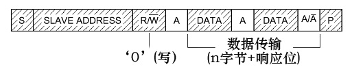

图 23‑2 主机写数据到从机

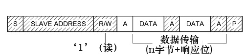

图 23‑3 主机由从机中读数据

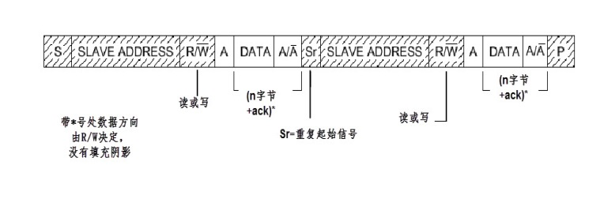

图 23‑4 I2C通讯复合格式

图例：

    |图例1| 数据由主机传输至从机

        S ： 传输开始信号

        SLAVE_ADDRESS: 从机地址

    |图例2| 数据由从机传输至主机

        R/W- ： 传输方向选择位，1为读，0为写

        A/A- ： 应答(ACK)或非应答(NACK)信号

        P ： 停止传输信号

这些图表示的是主机和从机通讯时，SDA线的数据包序列。

其中S表示由主机的I2C接口产生的传输起始信号(S)，这时连接到I2C总线上的所有从机都会接收到这个信号。

起始信号产生后，所有从机就开始等待主机紧接下来广播的从机地址信号
(SLAVE_ADDRESS) 。在I2C总线上，每个设备的地址都是唯一的，当主机广播的地址与某个设备地址相同时，
这个设备就被选中了，没被选中的设备将会忽略之后的数据信号。根据I2C协议，这个从机地址可以是7位 或10位 。

在地址位之后，是传输方向的选择位，该位为0时，表示后面的数据传输方向是由主机传输至从机，即主机向从机写数据。该位为1时，则相反，即主机由从机读数据。

从机接收到匹配的地址后，主机或从机会返回一个应答(ACK)或非应答(NACK)信号，只有接收到应答信号后，主机才能继续发送或接收数据。

**写数据**

若配置的方向传输位为“写数据”方向，即第一幅图的情况，广播完地址，接收到应答信号后，主机开始正式向从机传输数据(DATA)，数据包的大小为8位，主机每发送完一个字节数据，都要等待从机的应答信号(ACK)，重复这个过程，可以向从机传输N个数据，这个N没有大小限制。当数据传输结束时，主机向从机发送一个停止传输信号(P)，表示不再传输数据。

**读数据**

若配置的方向传输位为“读数据”方向，即第二幅图的情况，广播完地址，接收到应答信号后，从机开始向主机返回数据(DATA)，数据包大小也为8位，从机每发送完一个数据，都会等待主机的应答信号(ACK)，重复这个过程，可以返回N个数据，这个N也没有大小限制。当主机希望停止接收数据时，就向从机返回一个非应答信号(NACK)，则从机自动停止数据传输。

除了基本的读写，I2C通讯更常用的是复合格式，即第三幅图的情况，该传输过程有两次起始信号(S)。一般在第一次传输中，主机通过
SLAVE_ADDRESS寻找到从设备后，发送一段“数据”，这段数据通常用于表示从设备内部的寄存器或存储器地址(注意区分它与SLAVE_ADDRESS的区别)；在第二次的传输中，对该地址的内容进行读或写。也就是说，第一次通讯是告诉从机读写地址，第二次则是读写的实际内容。

以上通讯流程中包含的各个信号分解如下：

通讯的起始和停止信号
''''''''''''''''''''

前文中提到的起始(S)和停止(P)信号是两种特殊的状态，见图 23‑5。当 SCL
线是高电平时 SDA 线从高电平向低电平切换，这个情况表示通讯的起始。当 SCL
是高电平时 SDA
线由低电平向高电平切换，表示通讯的停止。起始和停止信号一般由主机产生。

.. image:: media/image8.jpeg
   :align: center
   :alt: 图 23‑5 起始和停止信号
   :name: 图23_5

图 23‑5 起始和停止信号

数据有效性
''''''''''

I2C使用SDA信号线来传输数据，使用SCL信号线进行数据同步。见 图23_6_。
SDA数据线在SCL的每个时钟周期传输一位数据。传输时，SCL为高电平的时候SDA表示的数据有效，即此时的SDA为高电平时表示数据“1”，为低电平时表示数据“0”。当SCL为低电平时，SDA的数据无效，一般在这个时候SDA进行电平切换，为下一次表示数据做好准备。

.. image:: media/image9.jpeg
   :align: center
   :alt: 图 23‑6 数据有效性
   :name: 图23_6

图 23‑6 数据有效性

每次数据传输都以字节为单位，每次传输的字节数不受限制。

地址及数据方向
''''''''''''''

I2C总线上的每个设备都有自己的独立地址，主机发起通讯时，通过SDA信号线发送设备地址(SLAVE_ADDRESS)来查找从机。
I2C协议规定设备地址可以是7位或10位，实际中7位的地址应用比较广泛。
紧跟设备地址的一个数据位用来表示数据传输方向，它是数据方向位(R/)，第8位或第11位。数据方向位为“1”时表示主机由从机读数据，
该位为“0”时表示主机向从机写数据。见 图23_7_。

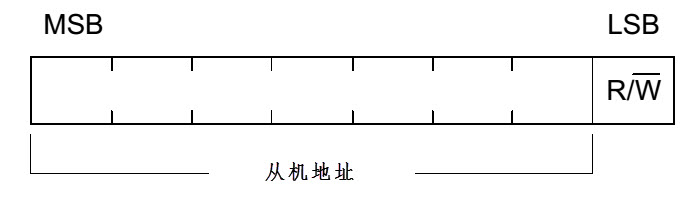

图 23‑7 设备地址(7位)及数据传输方向

读数据方向时，主机会释放对SDA信号线的控制，由从机控制SDA信号线，主机接收信号，写数据方向时，SDA由主机控制，从机接收信号。

响应
''''

I2C的数据和地址传输都带响应。响应包括“应答(ACK)”和“非应答(NACK)”两种信号。作为数据接收端时，
当设备(无论主从机)接收到I2C传输的一个字节数据或地址后，若希望对方继续发送数据，
则需要向对方发送“应答(ACK)”信号，发送方会继续发送下一个数据；若接收端希望结束数据传输，
则向对方发送“非应答(NACK)”信号，发送方接收到该信号后会产生一个停止信号，结束信号传输。见 图23_8_。

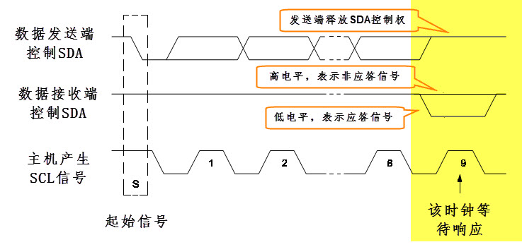

图 23‑8 响应与非响应信号

传输时主机产生时钟，在第9个时钟时，数据发送端会释放SDA的控制权，由数据接收端控制SDA，若SDA为高电平，表示非应答信号(NACK)，低电平表示应答信号(ACK)。

STM32的I2C特性及架构
~~~~~~~~~~~~~~~~~~~~

如果我们直接控制STM32的两个GPIO引脚，分别用作SCL及SDA，按照上述信号的时序要求，直接像控制LED灯那样控制引脚的输出(若是接收数据时则读取SDA电平)，就可以实现I2C通讯。同样，假如我们按照USART的要求去控制引脚，也能实现USART通讯。所以只要遵守协议，就是标准的通讯，不管您如何实现它，不管是ST生产的控制器还是ATMEL生产的存储器，
都能按通讯标准交互。

由于直接控制GPIO引脚电平产生通讯时序时，需要由CPU控制每个时刻的引脚状态，所以称之为“软件模拟协议”方式。

相对地，还有“硬件协议”方式，STM32的I2C片上外设专门负责实现I2C通讯协议，只要配置好该外设，它就会自动根据协议要求产生通讯信号，收发数据并缓存起来，CPU只要检测该外设的状态和访问数据寄存器，就能完成数据收发。这种由硬件外设处理I2C协议的方式减轻了CPU的工作，且使软件设计更加简单。

STM32的I\ :sup:`2`\ C外设简介
^^^^^^^^^^^^^^^^^^^^^^^^^^^^^

STM32的I2C外设可用作通讯的主机及从机，支持100Kbit/s和400Kbit/s的速率，支持7位、10位设备地址，支持DMA数据传输，并具有数据校验功能。它的I2C外设还支持SMBus2.0协议，SMBus协议与I2C类似，主要应用于笔记本电脑的电池管理中，本教程不展开，感兴趣的读者可参考《SMBus20》文档了解。

STM32的I\ :sup:`2`\ C架构剖析
^^^^^^^^^^^^^^^^^^^^^^^^^^^^^

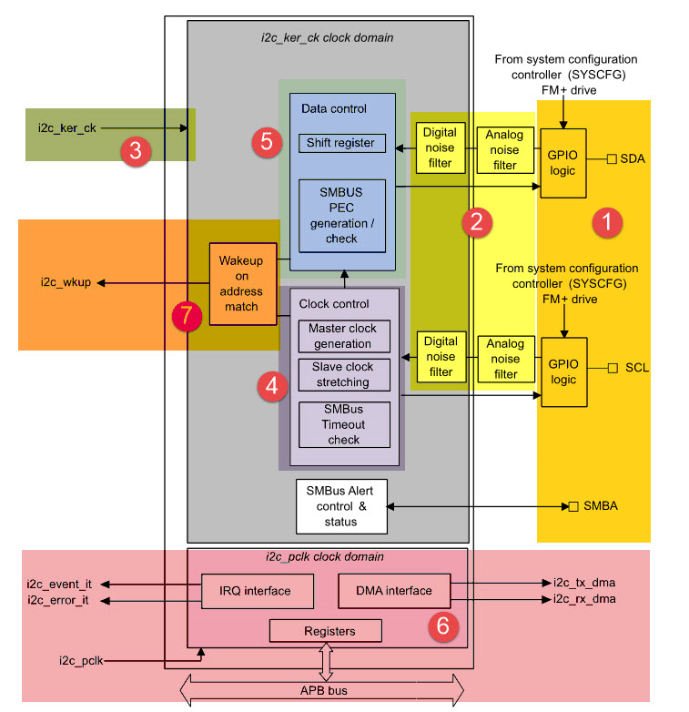

图 23‑9 I2C架构图

通讯引脚
''''''''

I\ :sup:`2`\ C的所有硬件架构都是根据图中左侧SCL线和SDA线展开的(其中的SMBA线用于SMBUS的警告信号，I2C通讯没有使用)。
STM32芯片有多个I2C外设，它们的I2C通讯信号引出到不同的GPIO引脚上，使用时必须配置到这些指定的引脚，见
表 23‑1。关于GPIO引脚的复用功能，可查阅《STM32H7xx规格书》，以它为准。

表 23‑1 STM32F4xx的I2C引脚(整理自《STM32H7xx规格书》)

+------+---------+--------------+---------+------------------------+
| 引脚 | I2C编号 |              |         |                        |
+======+=========+==============+=========+========================+
|      | I2C1    | I2C2         | I2C3    | I2C4                   |
+------+---------+--------------+---------+------------------------+
| SCL  | PB6/PB8 | PH4/PF1/PB10 | PH7/PA8 | PD12/PF14/PH11/PB6/PB8 |
+------+---------+--------------+---------+------------------------+
| SDA  | PB7/PB9 | PH5/PF0/PB11 | PH8/PC9 | PD13/PF15/PH12/PB7/PB9 |
+------+---------+--------------+---------+------------------------+

噪声滤波器
''''''''''''

模拟噪声滤波器，集成于SDA和SCL的输入上，默认情况下是打开的，该模拟滤波器符合I2C规范，此规范要求在快速模式和超快速模式下对脉宽50ns以下的脉冲都要抑制。可以空过将寄存器I2C_CR1的ANFOFF位置1，注意该位只能在I2C禁止时（PE=0）时编程。

数字噪声滤波器，从框图可以看出它是SDA和SCL经过模拟噪声滤波器再进来的，通过配置
I2C_CR1 寄存器中的 DNF[3:0]
位来使能数字滤波器使能数字滤波器，数字滤波器可滤除脉宽 DNF[3:0]
\*\ :math:`t_{I2CCLK}`\ 以下的尖峰，可滤除的噪声尖峰脉宽从 1 到 15 个
I2CCLK 周期可编程。如果模拟滤波器已使能，数字滤波将叠加在模拟滤波之上。

时钟源及要求
''''''''''''

I2C 的时钟由独立时钟源提供，这使得 I2C 能够独立于 PCLK
频率工作。该独立时钟源可从以下三种时钟源中任选其一：

-  PCLK1：APB1时钟（默认值）

-  HIS：高速内部振荡器

-  SYSCLK：系统时钟。

-  PLL3R：PLL时钟通过分频因子R得到的时钟

I2C 内核的时钟由 I2CCLK 提供。I2CCLK 周期
:math:`t_{I2CCLK}`\ 必须遵循以下条件：

:math:`t_{I2CCLK} < (t_{\text{LOW}} - t_{\text{filters}})/4`
且\ :math:`t_{I2CCLK} < t_{\text{HIGH}}`

其中\ :math:`t_{\text{LOW}}`\ 为SCL低电平时间，\ :math:`t_{\text{HIGH}}`\ 为SCL高电平时间，
\ :math:`t_{\text{filters}}`\ 为模拟和数字滤波器都使能时，引入延时的总和。模拟滤波器延时最大值为
260 ns。数字滤波器延时为 :math:`{DNF*t}_{I2CCLK}`\ 。

PCLK时钟周期\ :math:`t_{\text{PCLK}} < 4/3t_{\text{SCL}}`\ ，
其中，\ :math:`t_{\text{SCL}}`\ 为SCL周期。

当 I2C 内核的时钟由 PCLK 提供时， PCLK
必须遵循\ :math:`t_{I2CCLK}`\ 的条件。

I2C时钟控制
'''''''''''

使用I2C必须配置时序，以便保证主模式和从模式下使用正确的数据保持和建立时间。
通过设置 I2C_TIMINGR 寄存器中的 SCLH 和 SCLL 位来配置 I2C 主时钟。
具体是指 I2C_TIMINGR 寄存器中的 PRESC[3:0]、 SCLDEL[3:0] 和 SDADEL[3:0] 位。
STM32CubeMX工具在I2C配置窗口中可以计算I2C_TIMINGR寄存器的值。
例如我们要产生标准的100KHz的I2C主设备时序，如图 配置I2C时钟来源_，选择I2C的时钟来源，见序号2的方框。

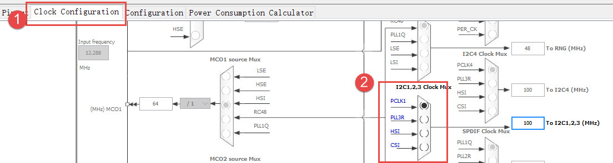

配置I2C时钟来源

然后切换至方框1的界面，选择方框2所要配置的I2C，这里我们使用的是I2C1，在序号3的框中依次填入以下配置：
I2C Speed Mode：Standard Mode，
I2C Speed Frequency(KHz)：100，
Analog Filter Delay：ON，
Rise Time(ns)：100，
Fall Time(ns)：10，
Coefficient of Digital Filt：0，
最后会在序号4的框中即可生成TIMINGR 寄存器的值：0x40604E73，这样非常方便，避免头痛的计算。

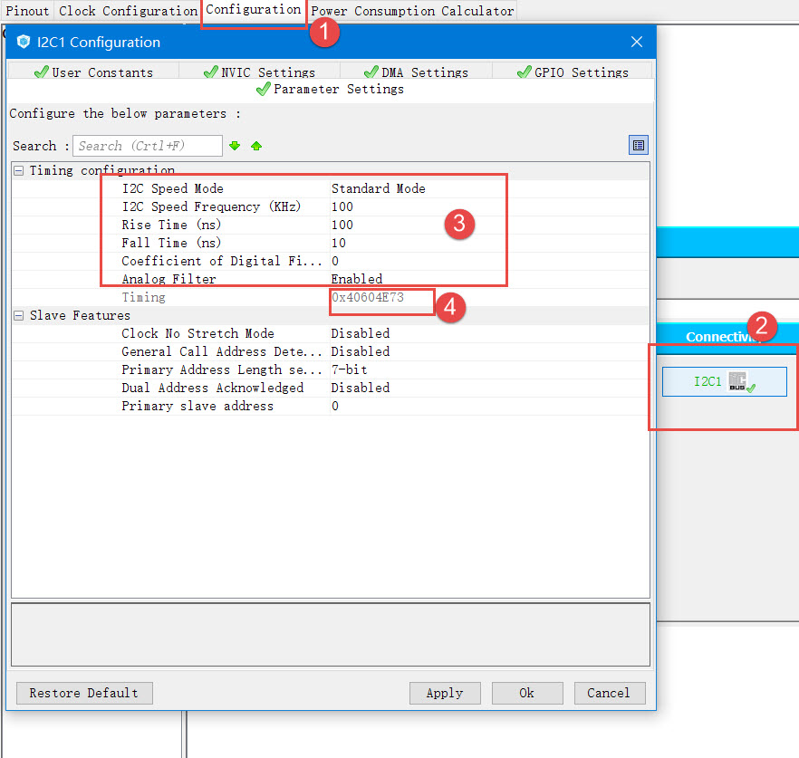

I2C时序计算工具

下面我们来讲解初始化I2C时钟的计算方法，为了支持多主环境和从时钟延长，
I2C 实现了时钟同步机制。为了实现时钟同步，需执行以下操作：

-  使用 SCLL 计数器从 SCL 低电平内部检测开始对时钟的低电平进行计数。

-  使用 SCLH 计数器从 SCL 高电平内部检测开始对时钟的高电平进行计数。

I2C 经过 :math:`t_{SYNC1}`\ 延时后检测其自身的 SCL 低电平，该延时取决于
SCL 下降沿、 SCL 输入噪声滤波器（模拟 + 数字）以及 SCL 与 I2CxCLK
时钟的同步。一旦 SCLL 计数器达到I2C_TIMINGR 寄存器的 SCLL[7:0]
位中编程的值， I2C 便会将 SCL 释放为高电平。

I2C 经过 :math:`t_{SYNC2}` 延时后检测其自身的 SCL 高电平，该延时取决于
SCL 上升沿、 SCL 输入噪声滤 波器（模 拟 + 数 字）以及 SCL 与 I2CxCLK 时
钟的同 步。一旦 SCLH 计数 器达 到I2C_TIMINGR 寄存器的 SCLH[7:0]
位中编程的值， I2C 便会使 SCL 变为低电平。

因此，主时钟周期为：

.. math:: t_{\text{SCL}} = t_{SYNC1} + t_{SYNC2} + \left\{ \left\lbrack \left( SCLH + 1 \right) + \left( SCLL + 1 \right) \right\rbrack \times \left( PRESC + 1 \right) \times t_{I2CCLK} \right\}

:math:`t_{SYNC1}`\ 的持续时间取决于以下参数：

#. SCL 下降斜率

#. 模拟滤波器（使能时）引入的输入延时

#. 数字滤波器（使能时）引入的输入延时： :math:`{DNF \times t}_{I2CCLK}`

#. SCL 与 I2CCLK 时钟建立同步而产生的延时（ 2 到 3 个 I2CCLK 周期）

:math:`t_{SYNC2}`\ 的持续时间取决于以下参数：

#. SCL 上升斜率

#. 模拟滤波器（使能时）引入的输入延时

#. 数字滤波器（使能时）引入的输入延时： :math:`{DNF \times t}_{I2CCLK}`

#. SCL 与 I2CCLK 时钟建立同步而产生的延时（ 2 到 3 个 I2CCLK 周期）

数据控制逻辑
''''''''''''

I2C的SDA信号主要连接到数据移位寄存器上，数据移位寄存器的数据来源及目标是数据寄存器(DR)、地址寄存器(OAR)、PEC寄存器以及SDA数据线。当向外发送数据的时候，数据移位寄存器以“数据寄存器”为数据源，把数据一位一位地通过SDA信号线发送出去；当从外部接收数据的时候，数据移位寄存器把SDA信号线采样到的数据一位一位地存储到“数据寄存器”中。若使能了数据校验，接收到的数据会经过PCE计算器运算，运算结果存储在“PEC寄存器”中。当STM32的I2C工作在从机模式的时候，接收到设备地址信号时，数据移位寄存器会把接收到的地址与STM32的自身的“I2C地址寄存器”的值作比较，以便响应主机的寻址。STM32的自身I2C地址可通过修改“自身地址寄存器”修改，支持同时使用两个I2C设备地址，两个地址分别存储在OAR1和OAR2中。

整体控制逻辑
''''''''''''

整体控制逻辑负责协调整个I2C外设，控制逻辑的工作模式根据我们配置的“控制寄存器(CR1/CR2)”的参数而改变。在外设工作时，控制逻辑会根据外设的工作状态修改“状态寄存器(SR1和SR2)”，我们只要读取这些寄存器相关的寄存器位，就可以了解I2C的工作状态。除此之外，控制逻辑还根据要求，负责控制产生I2C中断信号、DMA请求及各种I2C的通讯信号(起始、停止、响应信号等)。

低功耗唤醒功能控制
''''''''''''''''''''''''

STM32H7的4个I2C外设均支持从Stop模式（APB时钟被关闭的状态）下唤醒，以及所有的寻址模式。通过将I2C_CR1寄存器中的WUPEN位置1，可以使能从Stop模式唤醒的功能。
i2c_ker_ck的时钟源必须选择HSI或CSI振荡器，内部振荡器用于地址接收，以允许从低功耗模式唤醒。
当地址匹配的时候，在CPU被唤醒的这个过程中，I2C的SCL为低电平，直到ADDR标志位被软件清0。之后，便可以正常通讯了。
由于本章节不涉及这部分功能，详细内容可参考《STM32H743用户手册》
章节47.4.14 Wake form Stop mode on address match。

通讯过程
^^^^^^^^

使用I2C外设通讯时，在通讯的不同阶段它会对“状态寄存器(SR1及SR2)”的不同数据位写入参数，我们通过读取这些寄存器标志来了解通讯状态。

主发送器
''''''''

见 图23_10_ 。图中的是“主发送器”流程，即作为I2C通讯的主机端时，向外发送数据时的过程。

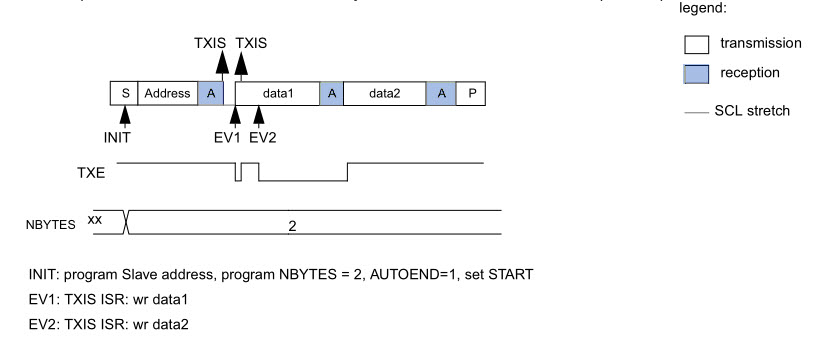

图 23‑10 主发送器通讯过程

主发送器发送流程及事件说明如下：

(1) 控制产生起始信号(S)，当发生起始信号后，它产生事件“EV5”，并会对SR1寄存器的“SB”位置1，表示起始信号已经发送；

(2) 紧接着发送设备地址并等待应答信号，若有从机应答，则产生事件“EV6”及“EV8”，这时SR1寄存器的“ADDR”位及“TXE”位被置1，ADDR
    为1表示地址已经发送，TXE为1表示数据寄存器为空；

(3) 以上步骤正常执行并对ADDR位清零后，我们往I2C的“数据寄存器DR”写入要发送的数据，
    这时TXE位会被重置0，表示数据寄存器非空，I2C外设通过SDA信号线一位位把数据发送出去后，
    又会产生“EV8”事件，即TXE位被置1，重复这个过程，就可以发送多个字节数据了；

(4) 当我们发送数据完成后，控制I2C设备产生一个停止信号(P)，这个时候会产生EV8_2事件，SR1的TXE位及BTF位都被置1，表示通讯结束。

假如我们使能了I2C中断，以上所有事件产生时，都会产生I2C中断信号，进入同一个中断服务函数，到I2C中断服务程序后，再通过检查寄存器位来判断是哪一个事件。

主接收器
''''''''

再来分析主接收器过程，即作为I2C通讯的主机端时，从外部接收数据的过程，见 图23_11_。

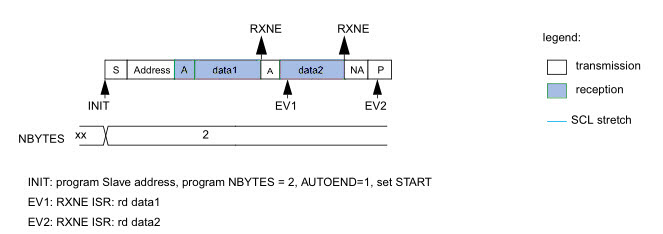

图 23‑11 主接收器过程

主接收器接收流程及事件说明如下：

(1) 同主发送流程，起始信号(S)是由主机端产生的，控制发生起始信号后，它产生事件“EV5”，并会对SR1寄存器的“SB”位置1，表示起始信号已经发送；

(2) 紧接着发送设备地址并等待应答信号，若有从机应答，则产生事件“EV6”这时SR1寄存器的“ADDR”位被置1，表示地址已经发送。

(3) 从机端接收到地址后，开始向主机端发送数据。当主机接收到这些数据后，会产生“EV7”事件，SR1寄存器的RXNE被置1，
    表示接收数据寄存器非空，我们读取该寄存器后，
    可对数据寄存器清空，以便接收下一次数据。此时我们可以控制I2C发送应答信号(ACK)或非应
    答信号(NACK)，若应答，则重复以上步骤接收数据，若非应答，则停止传输；

(4) 发送非应答信号后，产生停止信号(P)，结束传输。

在发送和接收过程中，有的事件不只是标志了我们上面提到的状态位，还可能同时标志主机状态之类的状态位，而且读了之后还需要清除标志位，比较复杂。我们可使用STM32HAL库函数来直接检测这些事件的复合标志，降低编程难度。

I2C初始化结构体详解
~~~~~~~~~~~~~~~~~~~

跟其它外设一样，STM32 HAL库提供了I2C初始化结构体及初始化函数来配置I2C外设。
初始化结构体及函数定义在库文件“stm32h7xx_hal_i2c.h”及“stm32h7xx_hal_i2c.c”中，
编程时我们可以结合这两个文件内的注释使用或参考库帮助文档。
了解与I2C初始化有关的结构体之后，我们就能对I2C外设运用自如了，见
代码清单23_1_。

代码清单 23‑1 I2C_Handle结构体（stm32h7xx_hal_i2c.h文件）

.. code-block:: c
   :name: 代码清单23_1

    typedef struct __I2C_HandleTypeDef {
        I2C_TypeDef                *Instance;      /*!< I2C外设基地址*/
        I2C_InitTypeDef            Init;           /*!< I2C初始化参数配置*/
        uint8_t                    *pBuffPtr;      /*!< 数据地址*/
        uint16_t                   XferSize;       /*!< 需要写入的页数*/
        __IO uint16_t              XferCount;      /*!< 不足一页需要写入的个数*/
        __IO uint32_t              XferOptions;    /*!< I2C多字节传输配置 */
        __IO uint32_t              PreviousState;  /*!< I2C前一个工作状态*/
        HAL_StatusTypeDef (*XferISR)(struct __I2C_HandleTypeDef *hi2c, uint32_t ITFlags,uint32_t ITSources);  /*!< I2C中断函数指针*/
        DMA_HandleTypeDef          *hdmatx;        /*!< I2C发送的DMA相关配置结构体 */
        DMA_HandleTypeDef          *hdmarx;        /*!< I2C接受的DMA相关配置结构体*/
        HAL_LockTypeDef            Lock;           /*!< 锁资源*/
        __IO HAL_I2C_StateTypeDef  State;          /*!< I2C的工作状态*/
        __IO HAL_I2C_ModeTypeDef   Mode;           /*!< I2C通讯的模式*/
        __IO uint32_t              ErrorCode;      /*!< I2C的错误参数*/
        __IO uint32_t              AddrEventCount; /*!< 地址事件计数值*/
    } I2C_HandleTypeDef;

这些结构体成员说明如下，其中括号内的文字是对应参数在STM32
HAL库中定义的宏：

(1)	Instance
本成员用于指向用户使用的I2C寄存器基地址，方便对I2C寄存器进行配置。

(2)	Init
本成员是I2C的初始化结构体，主要用来配置I2C的时钟，从机设备地址等等，详细的讲解，请看下面的I2C初始化结构体的介绍。

(3)	pBuffPtr
本成员是指向数据的地址的指针，用于接收数据以及发送数据的缓冲区

(4)	XferSize
本成员存放的是需要写的数据的页数，I2C_CR2的位NBYTES[7:0]只有8位，所以一次最多只能写入255个数据。因此，如果数据的个数超过了255个，需要分页进行写入。

(5)	XferCount
本成员存放的是需要单独写的数据个数，该值应该小于等于255。与XferSize不同之处在于，这个值存放的是数据不足一页的个数，可以单独进行写入。

(6)	XferOptions
本成员用于配置I2C的多字节传输模式。可以选择自动发送停止信号，多字节自动发送模式。

(7)	PreviousState
本成员用于存放I2C的前一个工作状态。

(8)	(\*XferISR)(struct __I2C_HandleTypeDef \*hi2c, uint32_t ITFlags, uint32_t ITSources)
本成员其实是一个函数指针。主要用于执行相应的中断函数。

(9)	\*hdmatx、\*hdmarx
这两个结构体用于配置与 I2C发送、接受相关的DMA功能。

(10)	Lock
本成员是HAL库自带的一个锁资源。初始化I2C时，可通过调用HAL_I2C_MspInit函数来初始化I2C的GPIO、时钟等等。这个函数的内容需要用户自己编写。

(11)	State
本成员主要存放着I2C的工作状态。例如HAL_I2C_STATE_BUSY，表明I2C总线被占用。

(12)	Mode
本成员用于配置I2C的工作模式，可选择主机模式（HAL_I2C_MODE_MASTER），从机模式（HAL_I2C_MODE_SLAVE）等等。

(13)	ErrorCode
本成员主要是存放着I2C错误的参数。例如HAL_I2C_ERROR_TIMEOUT，表示超出等待时间。

(14)	AddrEventCount
本成员是一个计数值。主要用于地址事件计数，只能用于从机模式。

I2C初始化结构体（stm32h7xx_hal_i2c.h文件）

.. code-block:: c

    typedef struct {
        uint32_t Timing; 
        /*指定I2C_TIMINGR寄存器的值，可以通过I2C_TIMING_CONFIGURARION工具计算*/

        uint32_t OwnAddress1;  /*指定自身的I2C设备地址1，可以是 7-bit或者10-bit*/

        uint32_t AddressingMode; /*指定地址的长度模式，可以是7bit模式或者10bit模式 */

        uint32_t DualAddressMode;  /*设置双地址模式 */

        uint32_t OwnAddress2; /*指定自身的I2C设备地址2，只能是 7-bit */

        uint32_t OwnAddress2Masks;    /*指定当双地址模式时的掩码 */

        uint32_t GeneralCallMode;     /*指定广播呼叫模式 */

        uint32_t NoStretchMode;       /*指定禁止时钟延长模式*/

    } I2C_InitTypeDef;

这些结构体成员说明如下，其中括号内的文字是对应参数在STM32 HAL库中定义的宏：

(1)	Timing
本成员设置的是I2C的传输速率，在调用初始化函数时，函数会根据我们输入的数值写入到I2C的时钟控制寄存器I2C_TIMINGR。这个数值的计算上一节已经说明。

(2)	OwnAddress1
本成员配置的是STM32的I2C设备自身地址1，每个连接到I2C总线上的设备都要有一个自己的地址，作为主机也不例外。地址可设置为7位或10位(受下面(3) AddressingMode成员决定)，只要该地址是I2C总线上唯一的即可。
STM32的I2C外设可同时使用两个地址，即同时对两个地址作出响应，这个结构成员I2C_OwnAddress1配置的是默认的、OAR1寄存器存储的地址，若需要设置第二个地址寄存器OAR2，可使用DualAddressMode成员使能，然后设置OwnAddress2成员即可，OAR2不支持10位地址。

(3)	AddressingMode
本成员选择I2C的寻址模式是7位还是10位地址。这需要根据实际连接到I2C总线上设备的地址进行选择，这个成员的配置也影响到OwnAddress1成员，只有这里设置成10位模式时， OwnAddress1才支持10位地址。

(4)	DualAddressMode
本成员配置的是STM32的I2C设备自己的地址，每个连接到I2C总线上的设备都要有一个自己的地址，作为主机也不例外。地址可设置为7位或10位(受下面I2C_AcknowledgeAddress成员决定)，只要该地址是I2C总线上唯一的即可。
STM32的I2C外设可同时使用两个地址，即同时对两个地址作出响应，这个结构成员I2C_OwnAddress1配置的是默认的、OAR1寄存器存储的地址，若需要设置第二个地址寄存器OAR2，可使用I2C_OwnAddress2Config函数来配置，OAR2不支持10位地址。

(5)	OwnAddress2
本成员配置的是STM32的I2C设备自身地址2，每个连接到I2C总线上的设备都要有一个自己的地址，作为主机也不例外。地址可设置为7位，只要该地址是I2C总线上唯一的即可。

(6)	OwnAddress2Masks
本成员指定I2C的双地址模式时的掩码。

(7)	GeneralCallMode
本成员是关于I2C从模式时的广播呼叫模式设置。

(8)	NoStretchMode
本成员是关于I2C禁止时钟延长模式设置，用于在从模式下禁止时钟延长。它在主模式下必须保持关闭。

配置完这些结构体成员值，调用库函数HAL_I2C_Init即可把结构体的配置写入到寄存器中。

I2C—读写EEPROM实验
~~~~~~~~~~~~~~~~~~

EEPROM是一种掉电后数据不丢失的存储器，常用来存储一些配置信息，以便系统重新上电的时候加载之。
EEPOM芯片最常用的通讯方式就是I\ :sup:`2`\ C协议，本小节以EEPROM的读写实验为大家讲解STM32的I\ :sup:`2`\ C使用方法。
实验中STM32的I2C外设采用主模式，分别用作主发送器和主接收器，通过查询事件的方式来确保正常通讯。

硬件设计
^^^^^^^^

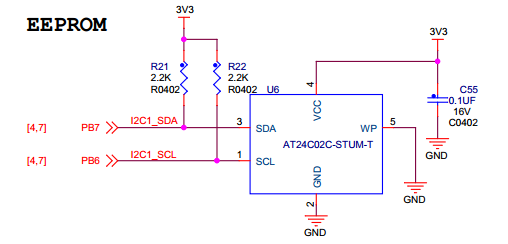

图 23‑12 EEPROM硬件连接图

本实验板中的EEPROM芯片(型号：AT24C02)的SCL及SDA引脚连接到了STM32对应的I2C引脚中，结合上拉电阻，构成了I2C通讯总线，它们通过I2C总线交互。EEPROM芯片的设备地址一共有7位，其中高4位固定为：1010
b，低3位则由A0/A1/A2信号线的电平决定，见 图23_13_，图中的R/W是读写方向位，与地址无关。

.. image:: media/image16.jpeg
   :align: center
   :alt: 图 23‑13 EEPROM设备地址(摘自《AT24C02》规格书)
   :name: 图23_13

图 23‑13 EEPROM设备地址(摘自《AT24C02》规格书)

按照我们此处的连接，A0/A1/A2均为0，所以EEPROM的7位设备地址是：101 0000b
，即0x50。由于I2C通讯时常常是地址跟读写方向连在一起构成一个8位数，且当R/W位为0时，表示写方向，所以加上7位地址，其值为“0xA0”，常称该值为I2C设备的“写地址”；当R/W位为1时，表示读方向，加上7位地址，其值为“0xA1”，常称该值为“读地址”。

EEPROM芯片中还有一个WP引脚，具有写保护功能，当该引脚电平为高时，禁止写入数据，当引脚为低电平时，可写入数据，我们直接接地，不使用写保护功能。

关于EEPROM的更多信息，可参考其数据手册《AT24C02》来了解。若您使用的实验板EEPROM的型号、设备地址或控制引脚不一样，只需根据我们的工程修改即可，程序的控制原理相同。

软件设计
^^^^^^^^

为了使工程更加有条理，我们把读写EEPROM相关的代码独立分开存储，方便以后移植。在“工程模板”之上新建“bsp_i2c_ee.c”及“bsp_i2c_ee.h”文件，这些文件也可根据您的喜好命名，它们不属于STM32HAL库的内容，是由我们自己根据应用需要编写的。

编程要点
''''''''

(1) 配置通讯使用的目标引脚为开漏模式；

(2) 使能I2C外设的时钟；

(3) 配置I2C外设的模式、地址、速率等参数并使能I2C外设；

(4) 编写基本I2C按字节收发的函数；

(5) 编写读写EEPROM存储内容的函数；

(6) 编写测试程序，对读写数据进行校验。

代码分析
''''''''

I2C硬件相关宏定义
===================

我们把I2C硬件相关的配置都以宏的形式定义到
“bsp_i2c_ee.h”文件中，见 代码清单23_2_。

代码清单 23‑2 I2C硬件配置相关的宏

.. code-block:: c
   :name: 代码清单23_2

    /* 这个地址只要与STM32外挂的I2C器件地址不一样即可 */
    #define I2C_OWN_ADDRESS7      0X0A

    /*I2C接口*/
    #define EEPROM_I2C                          I2C1
    #define EEPROM_I2C_CLK_ENABLE()             __HAL_RCC_I2C1_CLK_ENABLE()
    #define RCC_PERIPHCLK_I2Cx                  RCC_PERIPHCLK_I2C1

    #define EEPROM_I2C_SCL_PIN                  GPIO_PIN_6
    #define EEPROM_I2C_SCL_GPIO_PORT            GPIOB
    #define EEPROM_I2C_SCL_GPIO_CLK_ENABLE()    __GPIOB_CLK_ENABLE()
    #define EEPROM_I2C_SCL_AF                   GPIO_AF4_I2C1

    #define EEPROM_I2C_SDA_PIN                  GPIO_PIN_7
    #define EEPROM_I2C_SDA_GPIO_PORT            GPIOB
    #define EEPROM_I2C_SDA_GPIO_CLK_ENABLE()    __GPIOB_CLK_ENABLE()
    #define EEPROM_I2C_SDA_AF                   GPIO_AF4_I2C1

以上代码根据硬件连接，把与EEPROM通讯使用的I2C号
、引脚号都以宏封装起来，并且定义了自身的I2C地址及通讯速率，以便配置模式的时候使用。

初始化I2C的 GPIO
====================

利用上面的宏，编写I2C GPIO引脚的初始化函数，见 代码清单23_3_。

代码清单 23‑3 I2C GPIO初始化函数

.. code-block:: c
   :name: 代码清单23_3

    /**
    * @brief  I2C1 I/O配置
    * @param  无
    * @retval 无
    */
    static void I2C_GPIO_Config(void)
    {

        GPIO_InitTypeDef  GPIO_InitStructure;
        RCC_PeriphCLKInitTypeDef RCC_PeriphClkInit;

        /*使能I2C时钟*/
        EEPROM_I2C_CLK_ENABLE();

        /*使能I2C的IO口时钟*/
        EEPROM_I2C_SCL_GPIO_CLK_ENABLE();
        EEPROM_I2C_SDA_GPIO_CLK_ENABLE();

        /*配置I2C的SCL口*/
        GPIO_InitStructure.Pin = EEPROM_I2C_SCL_PIN;
        GPIO_InitStructure.Mode = GPIO_MODE_AF_OD;
        GPIO_InitStructure.Speed = GPIO_SPEED_HIGH;
        GPIO_InitStructure.Pull  = GPIO_NOPULL;
        GPIO_InitStructure.Alternate = EEPROM_I2C_SCL_AF;
        HAL_GPIO_Init(EEPROM_I2C_SCL_GPIO_PORT, &GPIO_InitStructure);

        /*配置I2C的SDA口*/
        GPIO_InitStructure.Pin = EEPROM_I2C_SDA_PIN;
        HAL_GPIO_Init(EEPROM_I2C_SDA_GPIO_PORT, &GPIO_InitStructure);

        /* Force the I2C peripheral clock reset */
        EEPROM_I2C_FORCE_RESET();

        /* Release the I2C peripheral clock reset */
        EEPROM_I2C_RELEASE_RESET();

    }

同为外设使用的GPIO引脚初始化，初始化的流程与“串口初始化函数”章节中的类似，主要区别是引脚的模式。函数执行流程如下：

(1) 使用GPIO_InitTypeDef定义GPIO初始化结构体变量，以便下面用于存储GPIO配置；

(2)	调用宏EEPROM_I2C_CLK_ENABLE()使能I2C外设时钟，调用宏定义EEPROM_I2C_SCL_GPIO_CLK_ENABLE()和EEPROM_I2C_SDA_GPIO_CLK_ENABLE()来使能I2C引脚使用的GPIO端口时钟。

(3) 向GPIO初始化结构体赋值，把引脚初始化成复用开漏模式，要注意I2C的引脚必须使用这种模式。

(4) 使用以上初始化结构体的配置，调用HAL_GPIO_Init函数向寄存器写入参数，完成GPIO的初始化。

配置I2C的模式
==================

以上只是配置了I2C使用的引脚，还不算对I2C模式的配置，见 代码清单23_4_。

代码清单 23‑4 配置I2C模式

.. code-block:: c
   :name: 代码清单23_4

    /**
    * @brief  I2C 工作模式配置
    * @param  无
    * @retval 无
    */
    static void I2C_Mode_Config(void)
    {
        /* I2C 配置 */
        I2C_Handle.Instance = EEPROM_I2C;
        I2C_Handle.Init.Timing           = 0x60201E2B;//100KHz
        I2C_Handle.Init.OwnAddress1      = 0;
        I2C_Handle.Init.AddressingMode   = I2C_ADDRESSINGMODE_7BIT;
        I2C_Handle.Init.DualAddressMode  = I2C_DUALADDRESS_DISABLE;
        I2C_Handle.Init.OwnAddress2      = 0;
        I2C_Handle.Init.OwnAddress2Masks = I2C_OA2_NOMASK;
        I2C_Handle.Init.GeneralCallMode  = I2C_GENERALCALL_DISABLE;
        I2C_Handle.Init.NoStretchMode    = I2C_NOSTRETCH_DISABLE;

        /* Init the I2C */
        HAL_I2C_Init(&I2C_Handle);

        HAL_I2CEx_AnalogFilter_Config(&I2C_Handle, I2C_ANALOGFILTER_ENABLE);
    }

    /**
    * @brief  I2C 外设(EEPROM)初始化
    * @param  无
    * @retval 无
    */
    void I2C_EE_Init(void)
    {

        I2C_GPIO_Config();
        I2C_Mode_Config();

    }

熟悉STM32
I2C结构的话，这段初始化程序就十分好理解了，指定连接EEPROM的I2C为EEPROM_I2C这里是I2C4，时序配置为上面用工具计算出来的值，自身地址为0，地址设置为7bit模式，关闭双地址模式，自身地址2也为0，禁止通用广播模式，禁止时钟延长模式。最后调用库函数HAL_I2C_Init把这些配置写入寄存器。

为方便调用，我们把I2C的GPIO及模式配置都用I2C_EE_Init函数封装起来。

向EEPROM写入一个字节的数据
===========================

初始化好I2C外设后，就可以使用I2C通讯了，我们看看如何向EEPROM写入一个字节的数据，见 代码清单23_5_。

代码清单 23‑5 向EEPROM写入一个字节的数据

.. code-block:: c
   :name: 代码清单23_5

    /**
    * @brief   写一个字节到I2C EEPROM中
    * @param
    *   @arg pBuffer:缓冲区指针
    *   @arg WriteAddr:写地址
    * @retval  无
    */
    uint32_t I2C_EE_ByteWrite(uint8_t* pBuffer, uint8_t WriteAddr)
    {
        HAL_StatusTypeDef status = HAL_OK;

        status = HAL_I2C_Mem_Write(&I2C_Handle, EEPROM_ADDRESS, (uint16_t)WriteAddr,
                I2C_MEMADD_SIZE_8BIT, pBuffer, 1, 100);
        /* Check the communication status */
        if (status != HAL_OK) {
            /* Execute user timeout callback */
            //I2Cx_Error(Addr);
        }
        while (HAL_I2C_GetState(&I2C_Handle) != HAL_I2C_STATE_READY) {

        }

        /* Check if the EEPROM is ready for a new operation */
        while (HAL_I2C_IsDeviceReady(&I2C_Handle, EEPROM_ADDRESS,
            EEPROM_MAX_TRIALS, I2Cx_TIMEOUT_MAX) == HAL_TIMEOUT);
        /* Wait for the end of the transfer */
        while (HAL_I2C_GetState(&I2C_Handle) != HAL_I2C_STATE_READY) {

        }
        return status;
    }

这里我们只是简单调用库函数HAL_I2C_Mem_Write就可以实现，通过封装一次使用更方。

在这个通讯过程中，STM32实际上通过I2C向EEPROM发送了两个数据，
但为何第一个数据被解释为EEPROM的内存地址？
这是由EEPROM的自己定义的单字节写入时序，见 图23_14_.

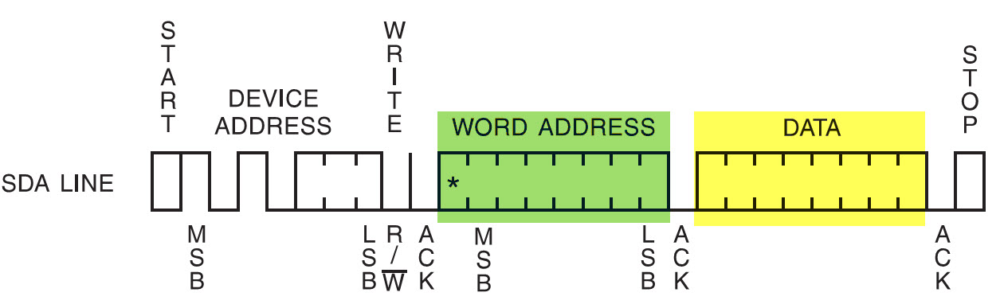

图 23‑14 EEPROM单字节写入时序(摘自《AT24C02》规格书)

EEPROM的单字节时序规定，向它写入数据的时候，第一个字节为内存地址，第二个字节是要写入的数据内容。所以我们需要理解：命令、地址的本质都是数据，对数据的解释不同，它就有了不同的功能。

EEPROM的页写入
=================

在以上的数据通讯中，每写入一个数据都需要向EEPROM发送写入的地址，我们希望向连续地址写入多个数据的时候，只要告诉EEPROM第一个内存地址address1，后面的数据按次序写入到address2、address3…
这样可以节省通讯的内容，加快速度。为应对这种需求，EEPROM定义了一种页写入时序，见 图23_15_。

.. image:: media/image18.jpeg
   :align: center
   :alt: 图 23‑15 EEPROM页写入时序(摘自《AT24C02》规格书)
   :name: 图23_15

图 23‑15 EEPROM页写入时序(摘自《AT24C02》规格书)

根据页写入时序，第一个数据被解释为要写入的内存地址address1，后续可连续发送n个数据，
这些数据会依次写入到内存中。其中AT24C02型号的芯片页写入时序最多可以一次发送8个数据(即n
= 8
)，该值也称为页大小，某些型号的芯片每个页写入时序最多可传输16个数据。EEPROM的页写入代码实现
见 代码清单23_6_。

代码清单 23‑6 EEPROM的页写入

.. code-block:: c
   :name: 代码清单23_6

    /**
    * @brief
    在EEPROM的一个写循环中可以写多个字节，但一次写入
    的字节数
    *
    不能超过EEPROM页的大小，AT24C02每页有8个字节
    * @param
    *   @arg pBuffer:缓冲区指针
    *   @arg WriteAddr:写地址
    *     @arg NumByteToWrite:写的字节数
    * @retval  无
    */
    uint32_t I2C_EE_PageWrite(uint8_t* pBuffer, uint8_t WriteAddr, uint8_t
                            NumByteToWrite)
    {
        HAL_StatusTypeDef status = HAL_OK;
        /* Write EEPROM_PAGESIZE */
        status=HAL_I2C_Mem_Write(&I2C_Handle, EEPROM_ADDRESS,WriteAddr,
            I2C_MEMADD_SIZE_8BIT, (uint8_t*)(pBuffer),NumByteToWrite,
            100);

        while (HAL_I2C_GetState(&I2C_Handle) != HAL_I2C_STATE_READY) {

        }

        /* Check if the EEPROM is ready for a new operation */
        while (HAL_I2C_IsDeviceReady(&I2C_Handle, EEPROM_ADDRESS,
            EEPROM_MAX_TRIALS, I2Cx_TIMEOUT_MAX) == HAL_TIMEOUT);

        /* Wait for the end of the transfer */
        while (HAL_I2C_GetState(&I2C_Handle) != HAL_I2C_STATE_READY) {

        }
        return status;
    }

这段页写入函数主体跟单字节写入函数是一样的，只是它在发送数据的时候，使用while循环控制发送多个数据，发送完多个数据后才产生I2C停止信号，只要每次传输的数据小于等于EEPROM时序规定的页大小，就能正常传输。

多字节写入
============

多次写入数据时，利用EEPROM的页写入方式，避免单字节读写时候的等待。多个数据写入过程
见 代码清单23_7_。

代码清单 23‑7 多字节写入

.. code-block:: c
   :name: 代码清单23_7

    /**
    * @brief   将缓冲区中的数据写到I2C EEPROM中
    * @param
    *   @arg pBuffer:缓冲区指针
    *   @arg WriteAddr:写地址
    *     @arg NumByteToWrite:写的字节数
    * @retval  无
    */
    void I2C_EE_BufferWrite(uint8_t* pBuffer, uint8_t WriteAddr, uint16_t NumByteToWrite)
    {
        uint8_t NumOfPage = 0, NumOfSingle = 0, Addr = 0, count = 0;

        Addr = WriteAddr % EEPROM_PAGESIZE;
        count = EEPROM_PAGESIZE - Addr;
        NumOfPage =  NumByteToWrite / EEPROM_PAGESIZE;
        NumOfSingle = NumByteToWrite % EEPROM_PAGESIZE;

        /* If WriteAddr is I2C_PageSize aligned  */
        if (Addr == 0) {
            /* If NumByteToWrite < I2C_PageSize */
            if (NumOfPage == 0) {
                I2C_EE_PageWrite(pBuffer, WriteAddr, NumOfSingle);
            }
            /* If NumByteToWrite > I2C_PageSize */
            else {
                while (NumOfPage--) {
                    I2C_EE_PageWrite(pBuffer, WriteAddr, EEPROM_PAGESIZE);
                    WriteAddr +=  EEPROM_PAGESIZE;
                    pBuffer += EEPROM_PAGESIZE;
                }

                if (NumOfSingle!=0) {
                    I2C_EE_PageWrite(pBuffer, WriteAddr, NumOfSingle);
                }
            }
        }
        /* If WriteAddr is not I2C_PageSize aligned  */
        else {
            /* If NumByteToWrite < I2C_PageSize */
            if (NumOfPage== 0) {
                I2C_EE_PageWrite(pBuffer, WriteAddr, NumOfSingle);
            }
            /* If NumByteToWrite > I2C_PageSize */
            else {
                NumByteToWrite -= count;
                NumOfPage =  NumByteToWrite / EEPROM_PAGESIZE;
                NumOfSingle = NumByteToWrite % EEPROM_PAGESIZE;

                if (count != 0) {
                    I2C_EE_PageWrite(pBuffer, WriteAddr, count);
                    WriteAddr += count;
                    pBuffer += count;
                }

                while (NumOfPage--) {
                    I2C_EE_PageWrite(pBuffer, WriteAddr, EEPROM_PAGESIZE);
                    WriteAddr +=  EEPROM_PAGESIZE;
                    pBuffer += EEPROM_PAGESIZE;
                }
                if (NumOfSingle != 0) {
                    I2C_EE_PageWrite(pBuffer, WriteAddr, NumOfSingle);
                }
            }
        }
    }

很多读者觉得这段代码的运算很复杂，看不懂，其实它的主旨就是对输入的数据进行分页(本型号芯片每页8个字节)，见表
23‑2。通过“整除”计算要写入的数据NumByteToWrite能写满多少“完整的页”，计算得的值存储在NumOfPage中，但有时数据不是刚好能写满完整页的，会多一点出来，通过“求余”计算得出“不满一页的数据个数”就存储在NumOfSingle中。计算后通过按页传输NumOfPage次整页数据及最后的NumOfSing个数据，使用页传输，比之前的单个字节数据传输要快很多。

除了基本的分页传输，还要考虑首地址的问题，见表
23‑3。若首地址不是刚好对齐到页的首地址，会需要一个count值，用于存储从该首地址开始写满该地址所在的页，还能写多少个数据。实际传输时，先把这部分count个数据先写入，填满该页，然后把剩余的数据(NumByteToWrite-count)，再重复上述求出NumOPage及NumOfSingle的过程，按页传输到EEPROM。

若writeAddress=16，计算得Addr=16%8= 0 ，count=8-0= 8；

同时，若NumOfPage=22，计算得NumOfPage=22/8= 2，NumOfSingle=22%8= 6。

数据传输情况如表 23‑2

表 23‑2 首地址对齐到页时的情况

============= == == == == == == == ==
不影响        0  1  2  3  4  5  6  7
不影响        8  9  10 11 12 13 14 15
第1页         16 17 18 19 20 21 22 23
第2页         24 25 26 27 28 29 30 31
NumOfSingle=6 32 33 34 35 36 37 38 39
============= == == == == == == == ==

若writeAddress=17，计算得Addr=17%8= 1，count=8-1= 7；

同时，若NumOfPage=22，

先把count去掉，特殊处理，计算得新的NumOfPage=22-7= 15

计算得NumOfPage=15/8= 1，NumOfSingle=15%8= 7。

数据传输情况如表 23‑3

表 23‑3 首地址未对齐到页时的情况

============= == == == == == == == ==
不影响        0  1  2  3  4  5  6  7
不影响        8  9  10 11 12 13 14 15
count=7       16 17 18 19 20 21 22 23
第1页         24 25 26 27 28 29 30 31
NumOfSingle=7 32 33 34 35 36 37 38 39
============= == == == == == == == ==

最后，强调一下，EEPROM支持的页写入只是一种加速的I2C的传输时序，实际上并不要求每次都以页为单位进行读写，EEPROM是支持随机访问的(直接读写任意一个地址)，如前面的单个字节写入。在某些存储器，如NAND
FLASH，它是必须按照Block写入的，例如每个Block为512或4096字节，数据写入的最小单位是Block，写入前都需要擦除整个Block；NOR
FLASH则是写入前必须以Sector/Block为单位擦除，然后才可以按字节写入。而我们的EEPROM数据写入和擦除的最小单位是“字节”而不是“页”，数据写入前不需要擦除整页。

从EEPROM读取数据
===================

从EEPROM读取数据是一个复合的I2C时序，它实际上包含一个写过程和一个读过程，
见 图23_16_。

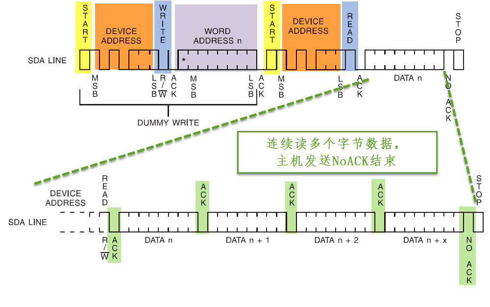

图 23‑16 EEPROM数据读取时序

读时序的第一个通讯过程中，使用I2C发送设备地址寻址(写方向)，接着发送要读取的“内存地址”；
第二个通讯过程中，再次使用I2C发送设备地址寻址，但这个时候的数据方向是读方向；在这个过程之后，
EEPROM会向主机返回从“内存地址”开始的数据，
一个字节一个字节地传输，只要主机的响应为“应答信号”，它就会一直传输下去，主机想结束传输时，就发送“非应答信号”，
并以“停止信号”结束通讯，作为从机的EEPROM也会停止传输。HAL库已经帮我们实现了这一个过程，
我们只是简单封装一下就可以直接使用，实现代码见 代码清单23_8_。

代码清单 23‑8 从EEPROM读取数据

.. code-block:: c
   :name: 代码清单23_8

    /**
    * @brief   从EEPROM里面读取一块数据
    * @param
    *   @arg pBuffer:存放从EEPROM读取的数据的缓冲区指针
    *   @arg WriteAddr:接收数据的EEPROM的地址
    *     @arg NumByteToWrite:要从EEPROM读取的字节数
    * @retval  无
    */
    uint32_t I2C_EE_BufferRead(uint8_t* pBuffer, uint8_t ReadAddr, uint16_t NumByteToRead)
    {
        HAL_StatusTypeDef status = HAL_OK;

        status=HAL_I2C_Mem_Read(&I2C_Handle,EEPROM_ADDRESS,ReadAddr,
        I2C_MEMADD_SIZE_8BIT, (uint8_t *)pBuffer, NumByteToRead, 1000);

        return status;
    }

这里代码非常简单，我们只需要确定I2C的地址，数据格式，数据存储指针，数据大小，超时设置就可以把想要的数据读回来。

main文件
''''''''

EEPROM读写测试函数
========================

完成基本的读写函数后，接下来我们编写一个读写测试函数来检验驱动程序，见
代码清单23_9_。

代码清单 23‑9 EEPROM读写测试函数

.. code-block:: c
   :name: 代码清单23_9

    /**
    * @brief  I2C(AT24C02)读写测试
    * @param  无
    * @retval 正常返回1 ，不正常返回0
    */
    uint8_t I2C_Test(void)
    {
        uint16_t i;

        EEPROM_INFO("写入的数据");

        for ( i=0; i<DATA_Size; i++ ) { //填充缓冲
            I2c_Buf_Write[i] =i;
            printf("0x%02X ", I2c_Buf_Write[i]);
            if (i%16 == 15)
                printf("\n\r");
        }

        //将I2c_Buf_Write中顺序递增的数据写入EERPOM中
        I2C_EE_BufferWrite( I2c_Buf_Write, EEP_Firstpage, DATA_Size);

        EEPROM_INFO("读出的数据");
        //将EEPROM读出数据顺序保持到I2c_Buf_Read中
        I2C_EE_BufferRead(I2c_Buf_Read, EEP_Firstpage, DATA_Size);
        //将I2c_Buf_Read中的数据通过串口打印
        for (i=0; i<DATA_Size; i++) {
            if (I2c_Buf_Read[i] != I2c_Buf_Write[i]) {
                printf("0x%02X ", I2c_Buf_Read[i]);
                EEPROM_ERROR("错误:I2C EEPROM写入与读出的数据不一致");
                return 0;
            }
            printf("0x%02X ", I2c_Buf_Read[i]);
            if (i%16 == 15)
                printf("\n\r");

        }
        EEPROM_INFO("I2C(AT24C02)读写测试成功");
        return 1;
    }

代码中先填充一个数组，数组的内容为1,2,3至N，接着把这个数组的内容写入到EEPROM中，写入时采用页写入的方式。写入完毕后再从EEPROM的地址中读取数据，把读取得到的与写入的数据进行校验，若一致说明读写正常，否则读写过程有问题或者EEPROM芯片不正常。其中代码用到的EEPROM_INFO跟EEPROM_ERROR宏类似，都是对printf函数的封装，使用和阅读代码时把它直接当成printf函数就好。具体的宏定义在“bsp_i2c_ee.h文件中”，在以后的代码我们常常会用类似的宏来输出调试信息。

main函数
==========

最后编写main函数，函数中初始化了系统时钟、LED、串口、I2C外设，然后调用上面的I2C_Test函数进行读写测试，见
代码清单23_10_。

代码清单 23‑10 main函数

.. code-block:: c
   :name: 代码清单23_10

    /**
    * @brief  主函数
    * @param  无
    * @retval 无
    */
    int main(void)
    {
        /* 配置系统时钟为400 MHz */
        SystemClock_Config();

        /* 初始化RGB彩灯 */
        LED_GPIO_Config();

        LED_BLUE;
        /*初始化USART1*/
        UARTx_Config();

        printf("\r\n 欢迎使用野火  STM32 F429 开发板。\r\n");

        printf("\r\n 这是一个I2C外设(AT24C02)读写测试例程 \r\n");

        /* I2C 外设初(AT24C02)始化 */
        I2C_EE_Init();

        if (I2C_Test() ==1) {
            LED_GREEN;
        } else {
            LED_RED;
        }

        while (1) {

        }
    }

下载验证
^^^^^^^^

用USB线连接开发板“USB TO
UART”接口跟电脑，在电脑端打开串口调试助手，把编译好的程序下载到开发板。在串口调试助手可看到EEPROM测试的调试信息。

