QSPI—读写串行FLASH
------------------

本章参考资料：《STM32H743用户手册》、《STM32H743xI规格书》、库帮助文档《STM32H753xx_User_Manual.chm》及《SPI总线协议介绍》。

若对SPI通讯协议不了解，可先阅读《SPI总线协议介绍》文档的内容学习。

关于FLASH存储器，请参考“常用存储器介绍”章节，实验中FLASH芯片的具体参数，请参考其规格书《W25Q256》来了解。

QSPI协议简介
~~~~~~~~~~~~

QSPI是Queued
SPI的简写，是Motorola公司推出的SPI接口的扩展，比SPI应用更加广泛。在SPI协议的基础上，Motorola公司对其功能进行了增强，增加了队列传输机制，推出了队列串行外围接口协议（即QSPI协议）。QSPI
是一种专用的通信接口，连接单、双或四（条数据线） SPI Flash 存储介质。

该接口可以在以下三种模式下工作：

#. 间接模式：使用 QSPI 寄存器执行全部操作

#. 状态轮询模式：周期性读取外部 Flash 状态寄存器，而且标志位置 1
   时会产生中断（如擦除或烧写完成，会产生中断）

#. 内存映射模式：外部 Flash
   映射到微控制器地址空间，从而系统将其视作内部存储器

采用双闪存模式时，将同时访问两个 Quad-SPI
Flash，吞吐量和容量均可提高二倍。

QSPI功能框图
^^^^^^^^^^^^

QSPI功能框图，双闪存模式禁止见 图24_1_。

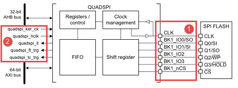

图 24‑1 QUADSPI 功能框图（双闪存模式禁止）

通讯引脚
''''''''''

我们的开发板采用的是双闪存禁止的模式连接单片QSPI Flash。QSPI 使用 6
个信号连接Flash，分别是四个数据线BK1_IO0~BK1_IO3，一个时钟输出CLK，一个片选输出（低电平有效）BK1_nCS，它们的作用介绍如下：

(1) BK1_nCS：片选输出（低电平有效），适用于 FLASH 1。如果 QSPI
    始终在双闪存模式下工作，则其也可用于 FLASH
    2从设备选择信号线。QSPI通讯以BK1_nCS线置低电平为开始信号，以BK1_nCS线被拉高作为结束信号。

(2) CLK：时钟输出，适用于两个存储器，用于通讯数据同步。它由通讯主机产生，决定了通讯的速率，
    不同的设备支持的最高时钟频率不一样，如STM32的QSPI时钟频率最大为f\ :sub:`pclk`/2，两个设备之间通讯时，通讯速率受限于低速设备。

(3) BK1_IO0：在双线 / 四线模式中为双向
    IO，单线模式中为串行输出，适用于FLASH 1。

(4) BK1_IO1：在双线 / 四线模式中为双向
    IO，单线模式中为串行输入，适用于FLASH 1。

(5) BK1_IO2：在四线模式中为双向 IO，适用于 FLASH 1。

(6) BK1_IO3：在四线模式中为双向 IO，适用于 FLASH 1。

内部信号线
''''''''''''''

QSPI的内部信号有五根，分别是内核时钟quadspi_ker_clk，外设时钟线quadspi_hclk，中断quadspi_it，FIFO阈值触发MDAM信号quadsqp_ft_trg以及操作完成触发MDMA信号quadspi_tc_trg。

1）	quadspi_ker_clk：QUADSPI的内核时钟，主要用于产生通讯过程中的时钟。时钟的来源可以选择：AHP3，PLL1Q，PLL2R和QUADSPI的外设时钟；

2）	quadspi_hclk：QUADSPI的外设时钟，来自于HCLK3，时钟频率最高为200MHz；

3）	quadspi_it：中断请求信号线。在达到 FIFO阈值、超时、操作完成以及发送访问错误时产生中断

4）	quadsqp_ft_trg，quadspi_tc_trg：达到FIFO阈值时或者操作完成时触发MDMA请求。

QSPI命令序列
^^^^^^^^^^^^

QUADSPI 通过命令与 Flash 通信
每条命令包括指令、地址、交替字节、空指令和数据这五个阶段
任一阶段均可跳过，但至少要包含指令、地址、交替字节或数据阶段之一。nCS
在每条指令开始前下降，在每条指令完成后再次上升。先看看QSPI四线模式下的读命令时序，见 图24_2_。

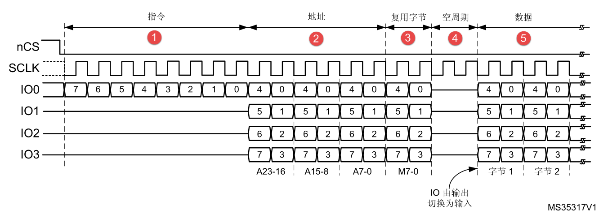

图 24‑2 四线模式下的读命令时序

指令阶段
''''''''
指令阶段，将一条 8 位指令发送到 外部SPI设备，该指令值可以在 QUADSPI_CCR[7:0]
寄存器的 INSTRUCTION 字段中进行配置，指定待执行操作的类型。

尽管大多数 Flash 从 IO0/SO 信号（单线 SPI 模式）只能以一次 1 位的方式接收指令，
但指令阶段可选择一次发送 2 位（在双线 SPI 模式中通过 IO0/IO1）或一次发送 4 位（在四线SPI 模式中通过 IO0/IO1/IO2/IO3）。
这可通过 QUADSPI_CCR[9:8] 寄存器中的 IMODE[1:0]字段进行配置。

若寄存器QUADSPI_CCR的字段IMODE = 00，则跳过指令阶段，命令序列从地址阶段（如果存在）开始。

地址阶段
''''''''

在地址阶段，将1-4字节发送到Flash，表明要操作的地址。待发送的地址字节数通过QUADSPI_CCR[13:12]寄存器的ADSIZE[1:0]字段中进行配置。
在间接模式和自动轮询模式下，待发送的地址字节通过在QUADSPI_AR寄存器的ADDRESS[31:0]进行配置。
而在内存映射模式下，则通过 AXI直接给出地址。

地址阶段可一次发送1 位（在单线SPI模式中通过SO），一次发送2位（在双线SPI模式中通过IO0/IO1）
或一次发送4位（在四线 SPI 模式中通过 IO0/IO1/IO2/IO3）。
这可通过QUADSPI_CCR[11:10]寄存器中的ADMODE[1:0]字段进行配置。

若寄存器QUADSPI_CCR的字段ADMODE = 00，则跳过地址阶段，命令序列直接进入下一阶段（如果存在）。

交替字节阶段
''''''''''''

在交替字节阶段，将 1-4 字节发送到 Flash，一般用于控制操作模式。
待发送的交替字节数在 QUADSPI_CCR[17:16] 寄存器的 ABSIZE[1:0] 字段中进行配置。
待发送的字节在QUADSPI_ABR 寄存器中指定。

交替字节阶段可一次发送 1 位（在单线 SPI 模式中通过 SO）、2 位（在双线 SPI 模式中通过 IO0/IO1）
或 4 位（在四线 SPI 模式中通过 IO0/IO1/IO2/IO3）。
这可通过QUADSPI_CCR[15:14] 寄存器中的 ABMODE[1:0] 字段进行配置。

若 ABMODE = 00，则跳过交替字节阶段，命令序列直接进入下一阶段（如果存在）。
在交替字节阶段存在仅需发送单个半字节而不是一个全字节的情况下，
比如采用双线模式并且仅使用两个周期发送交替字节时。
在这种情况下，采用四线模式 (ABMODE = 11) 并通过 IO0/IO1发送一个半字节2（0010），
方法是 ALTERNATE 的位 7 和 3 置“1”（IO3 保持高电平）
且位 6 和 2 置“0”（IO2 线保持低电平）。此时，半字节的高 2 位存放在 ALTERNATE 的位 4:3，
低 2位存放在位 1 和 0 中。则 ALTERNATE 应设置为 0x8A (1000_1010)。

空指令周期阶段
''''''''''''''

在空指令周期阶段，给定的 1-31
个周期内不发送或接收任何数据，目的是当采用更高的时钟频率时，给 Flash
留出准备数据阶段的时间。这一阶段中给定的周期数在QUADSPI_CCR[22:18]
寄存器的 DCYC[4:0] 字段中指定。在 SDR 和 DDR
模式下，持续时间被指定为一定个数的全时钟周期。若 DCYC
为零，则跳过空指令周期阶段，命令序列直接进入数据阶段（如果存在）。空指令周期阶段的操作模式由
DMODE
确定。为确保数据信号从输出模式转变为输入模式有足够的“周转”时间，使用双线和四线模式从Flash
接收数据时，至少需要指定一个空指令周期。

数据阶段
''''''''

在数据阶段，可从 Flash 接收或向其发送任意数量的字节。

在间接模式和自动轮询模式下，待发送/接收的字节数在 QUADSPI_DLR 寄存器中指定。

在间接模式下，写入的话，发送到 Flash 的数据写入到 QUADSPI_DR寄存器。
进行读取的话，通过读取 QUADSPI_DR 寄存器获得从 Flash 发送过来的数据。

在内存映射模式下，读取的数据通过 AXI 直接发送回 Cortex 或 DMA。

数据阶段可一次发送/接收 1 位（在单线 SPI 模式中通过 SO）、2 位（在双线 SPI 模式中通过 IO0/IO1）
或 4 位（在四线 SPI 模式中通过 IO0/IO1/IO2/IO3）。
这可通过QUADSPI_CCR[15:14] 寄存器中的 ABMODE[1:0] 字段进行配置。
若 DMODE = 00，则跳过数据阶段，命令序列在拉高 nCS 时立即完成。这一配置仅可用于仅间接写入模式。

QUADSPI 信号接口协议模式
~~~~~~~~~~~~~~~~~~~~~~~~

单线 SPI 模式
^^^^^^^^^^^^^

传统 SPI 模式允许串行发送/接收单独的 1 位。在此模式下，数据通过 SO
信号（其 I/O 与IO0 共享）发送到 Flash。从 Flash 接收到的数据通过 SI（其
I/O 与 IO1 共享）送达。通过将（QUADSPI_CCR
中的）IMODE/ADMODE/ABMODE/DMODE 字段设置为
01，可对不同的命令阶段分别进行配置，以使用此单个位模式。在每个已配置为单线模式的阶段中：

-  IO0 (SO) 处于输出模式

-  IO1 (SI) 处于输入模式（高阻抗）

-  IO2 处于输出模式并强制置“0”（以禁止“写保护”功能）

-  IO3 处于输出模式并强制置“1”（以禁止“保持”功能）

若 DMODE = 01，这对于空指令阶段也同样如此。

双线 SPI 模式
^^^^^^^^^^^^^

在双线模式下，通过 IO0/IO1 信号同时发送/接收两位。通过将 QUADSPI_CCR
寄存器的 IMODE/ADMODE/ABMODE/DMODE 字段设置为
10，可对不同的命令阶段分别进行配置，以使用双线 SPI
模式。在每个已配置为单线模式的阶段中：

-  IO0/IO1
   在数据阶段进行读取操作时处于高阻态（输入），在其他情况下为输出

-  IO2 处于输出模式并强制置“0”

-  IO3 处于输出模式并强制置“1”

在空指令阶段，若 DMODE = 01，则 IO0/IO1 始终保持高阻态。

四线 SPI 模式
^^^^^^^^^^^^^

在四线模式下，通过 IO0/IO1/IO2/IO3 信号同时发送/接收四位。通过将
QUADSPI_CCR 寄存器的 IMODE/ADMODE/ABMODE/DMODE 字段设置为
11，可对不同的命令阶段分别进行配置，以使用四线 SPI
模式。在每个已配置为四线模式的阶段中，IO0/IO1/IO2/IO3
在数据阶段进行读取操作时均处于高阻态（输入），在其他情况下为输出。在空指令阶段中，若
DMODE = 11，则 IO0/IO1/IO2/IO3 均为高阻态。IO2 和 IO3 仅用于 Quad SPI
模式 如果未配置任何阶段使用四线 SPI 模式，即使 UADSPI激活，对应 IO2 和
IO3 的引脚也可用于其他功能。

SDR 模式
^^^^^^^^

默认情况下，DDRM 位 (QUADSPI_CCR[31]) 为 0，QUADSPI 在单倍数据速率 (SDR)
模式下工作。在 SDR 模式下，当 QUADSPI 驱动 IO0/SO、IO1、IO2、IO3
信号时，这些信号仅在 CLK的下降沿发生转变。在 SDR
模式下接收数据时，QUADSPI 假定 Flash 也通过 CLK
的下降沿发送数据。默认情况下 (SSHIFT = 0 时)，将使用 CLK
后续的边沿（上升沿）对信号进行采样。

DDR 模式
^^^^^^^^

若 DDRM 位 (QUADSPI_CCR[31]) 置 1，则 QUADSPI 在双倍数据速率 (DDR)
模式下工作。在 DDR 模式下，当 QUADSPI 在地址/交替字节/数据阶段驱动
IO0/SO、IO1、IO2、IO3 信号时，将在 CLK 的每个上升沿和下降沿发送 1
位。指令阶段不受 DDRM 的影响。始终通过 CLK 的下降沿发送指令。在 DDR
模式下接收数据时，QUADSPI 假定 Flash 通过 CLK
的上升沿和下降沿均发送数据。若 DDRM = 1，固件必须清零 SSHIFT 位
(QUADSPI_CR[4])。因此，在半个 CLK
周期后（下一个反向边沿）对信号采样。四线模式下DDR命令时序见 图24_3_。

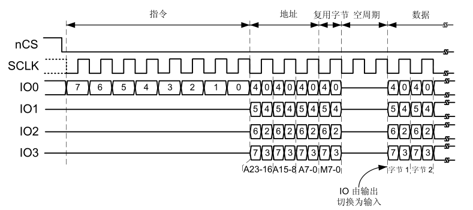

图 24‑3 四线模式下DDR命令时序

双闪存模式
^^^^^^^^^^

若 DFM 位 (QUADSPI_CR[6]) 为 1，QUADSPI 处于双闪存模式。QUADSPI
使用两个外部四线 SPI Flash（FLASH 1 和 FLASH 2），在每个周期中发送/接收
8 位（在 DDR 模式下为16 位），能够有效地将吞吐量和容量扩大一倍。每个
Flash 使用同一个 CLK 并可选择使用同一个 nCS 信号，但其 IO0、IO1、IO2 和
IO3
信号是各自独立的。双闪存模式可与单比特模式、双比特模式以及四比特模式结合使用，也可与
SDR 或 DDR 模式相结合。Flash 的大小在 FSIZE[4:0] (QUADSPI_DCR[20:16])
中指定，指定的值应能够反映 Flash 的总容量，即单个组件容量的 2
倍。如果地址 X 为偶数，QUADSPI 赋给地址 X 的字节是存放于 FLASH 1 的地址
X/2 中的字节，QUADSPI 赋给地址 X+1 的字节是存放于 FLASH 2 的地址 X/2
中的字节。也就是说，偶地址中的字节存储于 FLASH 1，奇地址中的字节存储于
FLASH 2。

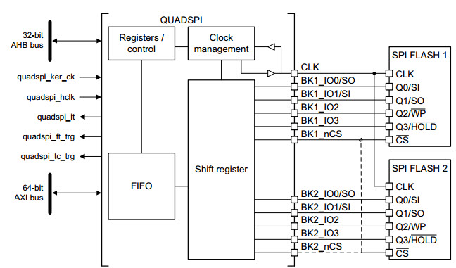

QUADSPI功能框图（使能双闪存模式）

在双闪存模式下读取 Flash 状态寄存器时，需要读取的字节数是单闪存模式下的
2 倍。这意味着在状态寄存器获取指令到达后，如果每个 Flash 给出 8
个有效位，则 QUADSPI 必须配置为 2 个字节（16 位）的数据长度，它将从每个
Flash 接收 1 个字节。如果每个 Flash 给出一个 16 位的状态，则 QUADSPI
必须配置为读取 4 字节，以在双闪存模式下可获取两个Flash
的所有状态位。结果（在数据寄存器中）的最低有效字节是 FLASH 1
状态寄存器的最低有效字节，而下一个字节是 FLASH 2
状态寄存器的最低有效字节。数据寄存器的第三个字节是 FLASH 1
的第二个字节，第四个字节是 FLASH 2 的第二个字节（Flash 具有 16
位状态寄存器时）。

偶数个字节必须始终在双闪存模式下访问。因此，若 DRM =
1，则数据长度字段(QUADSPI_DLR[0]) 的位 0 始终保持为 1。

在双闪存模式下，FLASH 1
接口信号的行为基本上与正常模式下相同。在指令、地址、交替字节以及空指令周期阶段，FLASH
2 接口信号具有与 FLASH 1 接口信号完全相同的波形。也就是说，每个 Flash
总是接收相同的指令与地址。然后，在数据阶段，BK1_IOx 和BK2_IOx
总线并行传输数据，但发送到 FLASH 1（或从其接收）的数据与 FLASH 2
中的不同。

QUADSPI 间接模式
~~~~~~~~~~~~~~~~

在间接模式下，通过写入 QUADSPI
寄存器来触发命令；并通过读写数据寄存器来传输数据，就如同对待其他通信外设那样。

若 FMODE = 00 (QUADSPI_CCR[27:26])，则 QUADSPI
处于间接写入模式，字节在数据阶段中发送到 Flash。通过写入数据寄存器
(QUADSPI_DR) 的方式提供数据。

若 FMODE = 01，则 QUADSPI 处于间接读取模式，在数据阶段中从 Flash
接收字节。通过读取 QUADSPI_DR 来获取数据。

读取/写入的字节数在数据长度寄存器 QUADSPI_DLR) 中指定。

如果 QUADSPI_DLR =0xFFFF_FFFF（全为“1”），则数据长度视为未定义，QUADSPI
将继续传输数据，直到到达（由 FSIZE 定义的）Flash
的结尾。如果不传输任何字节，DMODE (QUADSPI_CCR[25:24])应设置为 00。如果
QUADSPI_DLR = 0xFFFF_FFFF 并且 FSIZE = 0x1F（最大值指示一个 4GB
的Flash），在此特殊情况下，传输将无限继续下去，仅在出现终止请求或
QUADSPI 被禁止后停止。在读取最后一个存储器地址后（地址为
0xFFFF_FFFF），将从地址 = 0x0000_0000开始继续读取。

当发送或接收的字节数达到编程设定值时，如果 TCIE = 1，则 TCF 置 1
并产生中断。在数据数量不确定的情况下，将根据 QUADSPI_CR 中定义的 Flash
大小，在达到外部 SPI 的限制时，TCF 置 1。

触发命令启动
^^^^^^^^^^^^

从本质上讲，在固件给出命令所需的最后一点信息时，命令即会启动。根据
QUADSPI
的配置，在间接模式下有三种触发命令启动的方式。在出现以下情形时，命令立即启动：

1. 对 INSTRUCTION[7:0] (QUADSPI_CCR)
   执行写入操作，如果没有地址是必需的（当ADMODE =
   00）并且不需要固件提供数据（当 FMODE = 01 或 DMODE = 00）；

2. 对 ADDRESS[31:0] (QUADSPI_AR) 执行写入操作，如果地址是必需的（当
   ADMODE =00）并且不需要固件提供数据 （当 FMODE = 01 或 DMODE = 00）；

3. 对 DATA[31:0] (QUADSPI_DR) 执行写入操作，如果地址是必需的（当 ADMODE
   != 00）并且需要固件提供数据（当 FMODE = 00 并且 DMODE != 00）。

写入交替字节寄存器 (QUADSPI_ABR)
始终不会触发命令启动。如果需要交替字节，必须预先进行编程。如果命令启动，BUSY
位（QUADSPI_SR 的位 5）将自动置 1。

FIFO 和数据管理
^^^^^^^^^^^^^^^

在间接模式中，数据将通过 QUADSPI 内部的一个 32 字节
FIFO。FLEVEL[5:0](QUADSPI_SR[13:8]) 指示 FIFO 目前保存了多少字节。

在间接写入模式下 (FMODE = 00)，固件写入 QUADSPI_DR 时，将在 FIFO
中加入数据。字写入将在 FIFO 中增加 4 个字节，半字写入增加 2
个字节，而字节写入仅增加 1 个字节。如果固件在 FIFO
中加入的数据过多（超过 DL[31:0] 指示的值），将在写入操作结束（TCF置
1）时从 FIFO 中清除超出的字节。

对 QUADSPI_DR 的字节/半字访问必须仅针对该 32
位寄存器的最低有效字节/半字。FTHRES[3:0] 用于定义 FIFO 的阈值
如果达到阈值，FTF（FIFO 阈值标志）置 1 在间接读取模式下，从 FIFO
中读取的有效字节数超过阈值时，FTF 置 1。从 Flash
中读取最后一个字节后，如果 FIFO 中依然有数据，则无论 FTHRES
的设置为何，FTF 也都会置 1。在间接写入模式下，当 FIFO
中的空字节数超过阈值时，FTF 置 1。

如果 FTIE = 1，则 FTF 置 1 时产生中断。如果 DMAEN = 1，则 FTF 置 1
时启动数据传送。如果阈值条件不再为“真”（CPU 或 DMA
传输了足够的数据后），则 FTF 由 HW 清零。在间接模式下，当 FIFO
已满，QUADSPI 将暂时停止从 Flash 读取字节以避免上溢。请注意，只有在 FIFO
中的 4 个字节为空 (FLEVEL ≤ 11) 时才会重新开始读取 Flash。因此，若FTHRES
≥ 13，应用程序必须读取足够的字节以确保 QUADSPI 再次从 Flash
检索数据。否则，只要 11 < FLEVEL < FTHRES，FTF 标志将保持为“0”。

QUADSPI Flash 配置
~~~~~~~~~~~~~~~~~~

外部 SPI Flash的参数可以通过配置寄存器
(QUADSPI_DCR)实现。这里配置Flash的容量是设置FSIZE[4:0]
字段，使用下面的公式定义外部存储器的大小：

.. math:: Fcap = 2^{\left\lbrack FSIZE + 1 \right\rbrack}

FSIZE+1 是对 Flash 寻址所需的地址位数。在间接模式下，Flash 容量最高可达
4GB（使用32 位进行寻址），但在内存映射模式下的可寻址空间限制为
256MB。如果 DFM = 1，FSIZE 表示两个 Flash 容量的总和。QUADSPI
连续执行两条命令时，它在两条命令之间将片选信号 (nCS)
置为高电平默认仅一个 CLK 周期时长。如果 Flash
需要命令之间的时间更长，可使用片选高电平时间 (CSHT) 字段指定 nCS
必须保持高电平的最少 CLK 周期数（最大为 8）。时钟模式 (CKMODE)
位指示命令之间的 CLK 信号逻辑电平（nCS = 1 时）。

QSPI初始化结构体详解
~~~~~~~~~~~~~~~~~~~~

跟其它外设一样，STM32 HAL库提供了QSPI初始化结构体及初始化函数来配置SPI外设。
初始化结构体及函数定义在库文件“stm32h7xx_hal_qspi.h”及“stm32h7xx_hal _qspi.c”中，
编程时我们可以结合这两个文件内的注释使用或参考库帮助文档。
了解初始化结构体后我们就能对SPI外设运用自如了，见 代码清单24_1_ 和 代码清单24_2_
QSPI_InitTypeDef初始化结构体。

代码清单 24‑1 QSPI_HandleTypeDef结构体（stm32h7xx_hal_qspi.h文件）

.. code-block:: c
   :name: 代码清单24_1

    /**
    * @brief  QSPI Handle Structure definition
    */
    typedef struct {
        QUADSPI_TypeDef            *Instance;        /* QSPI外设寄存器基地址*/
        QSPI_InitTypeDef           Init;             /* QSPI外设参数配置结构体*/
        uint8_t                    *pTxBuffPtr;      /* QSPI发送数据的地址*/
        __IO uint32_t              TxXferSize;       /* QSPI发送数据的大小*/
        __IO uint32_t              TxXferCount;      /* QSPI发送数据的个数*/
        uint8_t                    *pRxBuffPtr;      /* QSPI接收数据的地址*/
        __IO uint32_t              RxXferSize;       /* QSPI接受数据的大小*/
        __IO uint32_t              RxXferCount;      /* QSPI接受数据的个数*/
        MDMA_HandleTypeDef         *hmdma;           /* QSPI发送接受使能DMA配置结构体*/
        __IO HAL_LockTypeDef       Lock;             /* 锁资源*/
        __IO HAL_QSPI_StateTypeDef State;            /* QSPI工作状态*/
        __IO uint32_t              ErrorCode;        /* QSPI错误参数值*/
        uint32_t                   Timeout;          /* 等待时间*/
    } QSPI_HandleTypeDef;

这些结构体成员说明如下:

(1)	Instance
Instance是QUADSPI_TypeDef类型的结构体变量，存放着QSPI寄存器基地址。

(2)	Init
Init是QSPI的初始化结构体，主要用来配置QSPI的双闪存模式，时钟预分频因子，FIFO的阈值。

(3)	pTxBuffPtr，TxXferSize，TxXferCount
这三个参数分别为发送数据的存放地址，大小以及个数。pTxBuffPtr用一个指针指向我们需要发送的数据数组。

(4)	pRxBuffPtr，RxXferSize，RxXferCount
这三个参数分别为接受数据的存放地址，大小以及个数。pRxBuffPtr用一个指针变量指向我们定义存放数据内容的数组。

(5)	hmdma
MDMA_HandleTypeDef结构体变量，用于配置相关的DMA参数。

(6)	Lock
该参数主要负责分配锁资源，可选择HAL_UNLOCKED或者是HAL_LOCKED两个参数。

(7)	State
HAL_QSPI_StateTypeDef结构体变量，用于存放通讯过程中的工作状态。

(8)	ErrorCode
QSPI的错误参数，通过该参数，用户可以了解到QSPI通讯过程中造成失败的原因。

(9)	Timeout
允许等待的最大时长。一旦超出Timeout的变量值，则ErrorCode 为HAL_QSPI_ERROR_TIMEOUT，表示超出规定的时间。

代码清单 24‑2 QSPI_CommandTypeDe通信配置命令结构体

QSPI_InitTypeDef初始化结构体（stm32h7xx_hal_qspi.h文件）

.. code-block:: c
   :name: 代码清单24_2

    typedef struct {
        uint32_t ClockPrescaler;     //预分频因子
        uint32_t FifoThreshold;      //FIFO中的阈值
        uint32_t SampleShifting;     //采样移位
        uint32_t FlashSize;          //Flash大小
        uint32_t ChipSelectHighTime; //片选高电平时间
        uint32_t ClockMode;          //时钟模式
        uint32_t FlashID;            //Flash ID
        uint32_t DualFlash;          //双闪存模式
    } QSPI_InitTypeDef;

这些结构体成员说明如下，其中括号内的文字是对应参数在STM32
HAL库中定义的宏：

(1) ClockPrescaler
    本成员设置预分频因子，对应寄存器QUADSPI_CR [31:24]即PRESCALER[7:0]，
    取值范围是0—255，可以实现1—256级别的分频。仅可在 BUSY = 0 时修改该字段。

(2) FIFOThreshold
    本成员设置FIFO 阈值级别，对应寄存器QUADSPI_CR [12:8]即FTHRES[4:0]，
    定义在间接模式下 FIFO 中将导致 FIFO 阈值标志（FTF，QUADSPI_SR[2]）置 1 的字节数阈值。

(3) SampleShifting
    本成员设置采样，对应寄存器QUADSPI_CR [4]，默认情况下，QUADSPI 在 Flash 驱动数据后过半个 CLK 周期开始采集数据。
    使用该位，可考虑外部信号延迟，推迟数据采集。可以取值0：不发生移位；1：移位半个周期。
    在 DDR 模式下 (DDRM = 1)，固件必须确保 SSHIFT = 0。

(4) FlashSize
    本成员设置FLASH大小，对应寄存器QUADSPI_CCR [20:16]的FSIZE[4:0]位。定义外部存储器的大小，
    简介模式Flash容量最高可达4GB（32位寻址），但是在内存映射模式下限制为256MB，如果是双闪存则可以达到512MB。

(5) ChipSelectHighTime
    本成员设置片选高电平时间，对应寄存器QUADSPI_CR [10:8]的CSHT[2:0]位，
    定义片选 (nCS) 在发送至 Flash 的命令之间必须保持高电平的最少 CLK 周期数。可以取值1~8个周期。

(6) ClockMode
    本成员设置时钟模式，对应寄存器QUADSPI_CR [0]位，指示CLK在命令之间的电平，
    可以选模式0，1： nCS 为高电平（片选释放）时，CLK 必须保持低电平；
    或者模式3 ，1：nCS 为高电平（片选释放）时，CLK 必须保持高电平。

(7) FlashID
    本成员用于选择Flash1或者Flash2，单闪存模式下选择需要访问的flash。

(8) DualFlash
    本成员用于激活双闪存模式，0：禁止双闪存模式；1：使能双闪存模式。双闪存模式可以使系统吞吐量和容量扩大一倍。

.. code-block:: c
   :name: 代码清单24_3

    typedef struct {
        uint32_t Instruction;        //指令
        uint32_t Address;            //地址
        uint32_t AlternateBytes;     //交替字节
        uint32_t AddressSize;        //地址长度
        uint32_t AlternateBytesSize; //交替字节长度
        uint32_t DummyCycles;        //空指令周期
        uint32_t InstructionMode;    //指令模式
        uint32_t AddressMode;        //地址模式
        uint32_t AlternateByteMode;  //交替字节模式
        uint32_t DataMode;           //数据模式
        uint32_t NbData;             //数据长度
        uint32_t DdrMode;            //双倍数据速率模式
        uint32_t DdrHoldHalfCycle;   //DDR保持周期
        uint32_t SIOOMode;           //仅发送指令一次模式
    } QSPI_CommandTypeDef;

这些结构体成员说明如下，其中括号内的文字是对应参数在STM32
HAL库中定义的宏：

(1) Instruction

本成员设置通信指令，指定要发送到外部 SPI 设备的指令。仅可在 BUSY = 0
时修改该字段。

(2) Address

本成员指定要发送到外部 Flash 的地址，BUSY = 0 或 FMODE =
11（内存映射模式）时，将忽略写入该字段。在双闪存模式下，由于地址始终为偶地址，ADDRESS[0]
自动保持为“0”。

(3) AlternateBytes

本成员指定要在地址后立即发送到外部 SPI 设备的可选数据，仅可在 BUSY = 0
时修改该字段。

(4) AddressSize

本成员定义地址长度，可以是8位，16位，24位或者32位。

(5) AlternateBytesSize

本成员定义交替字节长度，可以是8位，16位，24位或者32位。

(6) DummyCycles

本成员定义空指令阶段的持续时间，在 SDR 和 DDR 模式下，它指定 CLK 周期数
(0-31)。

(7) InstructionMode

本成员定义指令阶段的操作模式，00：无指令；01：单线传输指令；10：双线传输指令；11：四线传输指令。

(8) AddressMode

本成员定义地址阶段的操作模式，00：无地址；01：单线传输地址；10：双线传输地址；11：四线传输地址。

(9) AlternateByteMode

本成员定义交替字节阶段的操作模式00：无交替字节；01：单线传输交替字节；10：双线传输交替字节；11：四线传输交替字节。

(10) DataMode

本成员定义数据阶段的操作模式，00：无数据；01：单线传输数据；10：双线传输数据；11：四线传输数据。该字段还定义空指令阶段的操作模式。

(11) NbData

本成员设置数据长度，在间接模式和状态轮询模式下待检索的数据数量（值 +
1）。对状态轮询模式应使用不大于 3 的值（表示 4 字节）。

(12) DdrMode

本成员为地址、交替字节和数据阶段设置 DDR 模式，0：禁止 DDR 模式；1：使能
DDR 模式。

(13) DdrHoldHalfCycle

本成员设置DDR 模式下数据输出延迟 1/4 个 QUADSPI
输出时钟周期，0：使用模拟延迟来延迟数据输出；1：数据输出延迟 1/4 个
QUADSPI 输出时钟周期。仅在 DDR 模式下激活。

(14) SIOOMode

本成员设置仅发送指令一次模式，。IMODE = 00
时，该位不起作用。0：在每个事务中发送指令；1：仅为第一条命令发送指令。

QSPI—读写串行FLASH实验
~~~~~~~~~~~~~~~~~~~~~~

FLSAH存储器又称闪存，它与EEPROM都是掉电后数据不丢失的存储器，但FLASH存储器容量普遍大于EEPROM，现在基本取代了它的地位。我们生活中常用的U盘、SD卡、SSD固态硬盘以及我们STM32芯片内部用于存储程序的设备，都是FLASH类型的存储器。在存储控制上，最主要的区别是FLASH芯片只能一大片一大片地擦写，而在“I2C章节”中我们了解到EEPROM可以单个字节擦写。

本小节以一种使用QSPI通讯的串行FLASH存储芯片的读写实验为大家讲解STM32的QSPI使用方法。实验中STM32的QSPI外设采用主模式，通过查询事件的方式来确保正常通讯。

硬件设计
^^^^^^^^

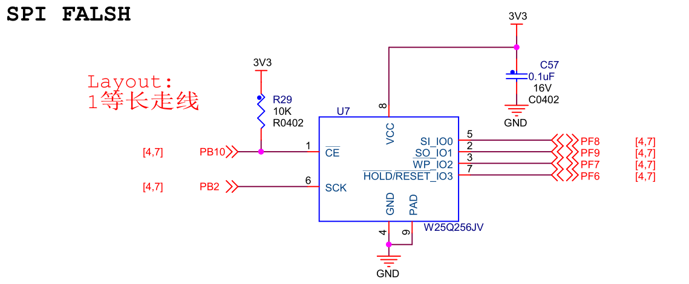

图 24‑4 SPI串行FLASH硬件连接图

本实验板中的FLASH芯片(型号：W25Q256)是一种使用QSPI/SPI通讯协议的NOR
FLASH存储器，它的CS/CLK/D0/D1/D2/D3引脚分别连接到了STM32对应的QSPI引脚QUADSPI_BK1_NCS/
QUADSPI_CLK / QUADSPI_BK1_IO0/ QUADSPI_BK1_IO1/ QUADSPI_BK1_IO2/
QUADSPI_BK1_IO3上，这些引脚都是STM32的复用引脚。

关于FLASH芯片的更多信息，可参考其数据手册《W25Q256》来了解。若您使用的实验板FLASH的型号或控制引脚不一样，只需根据我们的工程修改即可，程序的控制原理相同。

软件设计
^^^^^^^^

为了使工程更加有条理，我们把读写FLASH相关的代码独立分开存储，方便以后移植。在“工程模板”之上新建“bsp_qspi_flash.c”及“bsp_qspi\_
flash.h”文件，这些文件也可根据您的喜好命名，它们不属于STM32
HAL库的内容，是由我们自己根据应用需要编写的。

编程要点
''''''''

(1) 初始化通讯使用的目标引脚及端口时钟；

(2) 使能SPI外设的时钟；

(3) 配置SPI外设的模式、地址、速率等参数并使能SPI外设；

(4) 编写基本SPI按字节收发的函数；

(5) 编写对FLASH擦除及读写操作的的函数；

(6) 编写测试程序，对读写数据进行校验。

代码分析
''''''''

控制FLASH的指令
=================

FLASH芯片自定义了很多指令，我们通过控制STM32利用QSPI总线向FLASH芯片发送指令，FLASH芯片收到后就会执行相应的操作。

而这些指令，对主机端(STM32)来说，只是它遵守最基本的QSPI通讯协议发送出的数据，但在设备端(FLASH芯片)把这些数据解释成不同的意义，所以才成为指令。查看FLASH芯片的数据手册《W25Q256》，可了解各种它定义的各种指令的功能及指令格式，见表
24‑1。

表 24‑1 FLASH常用芯片指令表(摘自规格书《W25Q256》)

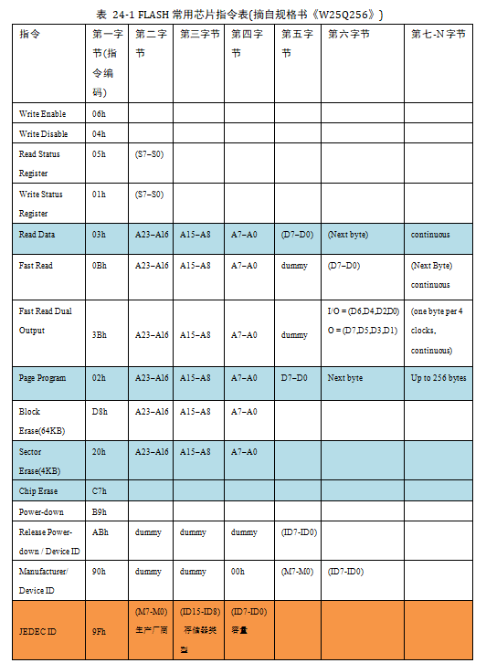

该表中的第一列为指令名，第二列为指令编码，第三至第N列的具体内容根据指令的不同而有不同的含义。其中带括号的字节参数，方向为FLASH向主机传输，即命令响应，不带括号的则为主机向FLASH传输。表中“A0~A23”指FLASH芯片内部存储器组织的地址；“M0~M7”为厂商号（MANUFACTURER
ID）；“ID0-ID15”为FLASH芯片的ID；“dummy”指该处可为任意数据；“D0~D7”为FLASH内部存储矩阵的内容。

在FLSAH芯片内部，存储有固定的厂商编号(M7-M0)和不同类型FLASH芯片独有的编号(ID15-ID0)，见表
24‑2。

表 24‑2 FLASH数据手册的设备ID说明

+-----------+---------------+---------------------+
| FLASH型号 | 厂商号(M7-M0) | FLASH型号(ID15-ID0) |
+===========+===============+=====================+
| W25Q64    | EF h          | 4017 h              |
+-----------+---------------+---------------------+
| W25Q128   | EF h          | 4018 h              |
+-----------+---------------+---------------------+
| W25Q256   | EF h          | 4019 h              |
+-----------+---------------+---------------------+

通过指令表中的读ID指令“JEDEC ID”可以获取这两个编号，该指令编码为“9F
h”，其中“9F h”是指16进制数“9F”
(相当于C语言中的0x9F)。紧跟指令编码的三个字节分别为FLASH芯片输出的“(M7-M0)”、“(ID15-ID8)”及“(ID7-ID0)”
。

此处我们以该指令为例，配合其指令时序图进行讲解，见图 24‑5。

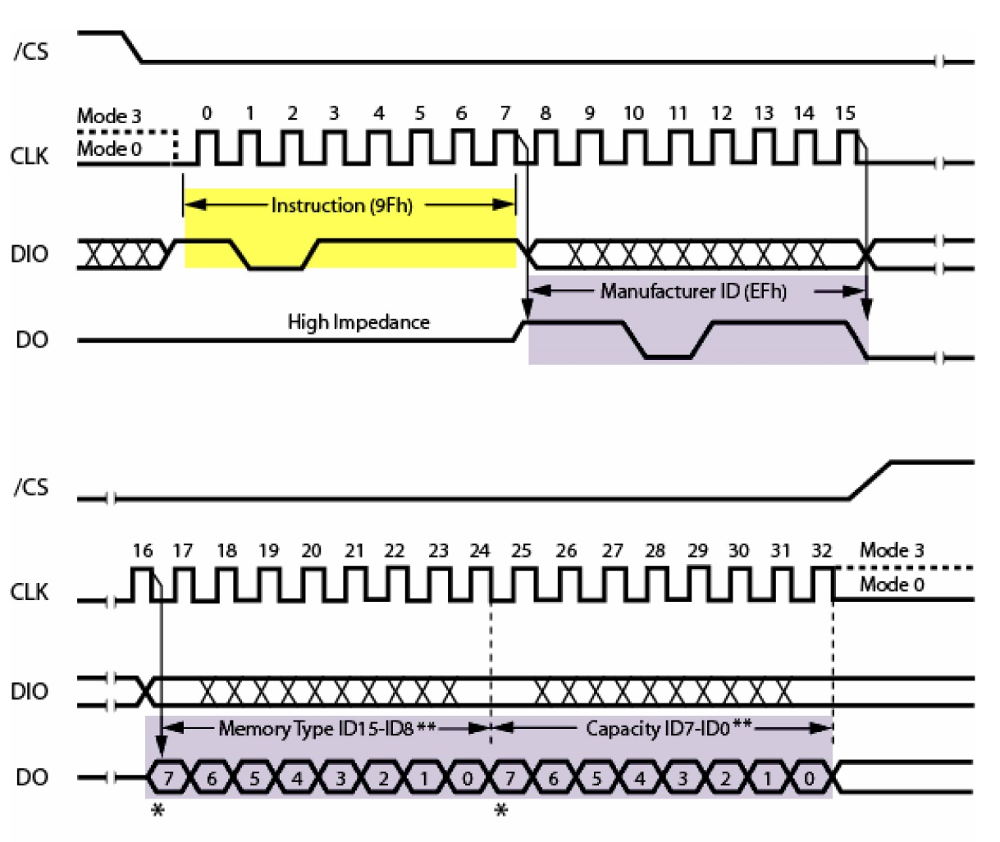

图 24‑5 FLASH读ID指令“JEDEC ID”的时序(摘自规格书《W25Q256》)

主机首先通过DIO(对应STM32的QUADSPI_BK1_IO0)线向FLASH芯片发送第一个字节数据为“9F
h”，当FLASH芯片收到该数据后，它会解读成主机向它发送了“JEDEC指令”，然后它就作出该命令的响应：通过DO(对应STM32的QUADSPI_BK1_IO1)线把它的厂商ID(M7-M0)及芯片类型(ID15-0)发送给主机，主机接收到指令响应后可进行校验。常见的应用是主机端通过读取设备ID来测试硬件是否连接正常，或用于识别设备。

对于FLASH芯片的其它指令，都是类似的，只是有的指令包含多个字节，或者响应包含更多的数据。

实际上，编写设备驱动都是有一定的规律可循的。首先我们要确定设备使用的是什么通讯协议。
如上一章的EEPROM使用的是I\ :sup:`2`\ C，本章的FLASH使用的是QSPI。
那么我们就先根据它的通讯协议，选择好STM32的硬件模块，并进行相应的I\ :sup:`2`\ C或SPI模块初始化。
接着，我们要了解目标设备的相关指令，因为不同的设备，都会有相应的不同的指令。
如EEPROM中会把第一个数据解释为内部存储矩阵的地址(实质就是指令)。
而FLASH则定义了更多的指令，有写指令，读指令，读ID指令等等。
最后，我们根据这些指令的格式要求，使用通讯协议向设备发送指令，达到控制设备的目标。

定义FLASH指令编码表
=======================

为了方便使用，我们把FLASH芯片的常用指令编码使用宏来封装起来，后面需要发送指令编码的时候我们直接使用这些宏即可，见 FLASH指令编码表_。

代码清单 24‑3 FLASH指令编码表

.. code-block:: c
   :name: FLASH指令编码表

    /**
    * @brief  W25Q256JV 指令
    */
    /* 复位操作 */
    #define RESET_ENABLE_CMD                     0x66
    #define RESET_MEMORY_CMD                     0x99

    #define ENTER_QPI_MODE_CMD                   0x38
    #define EXIT_QPI_MODE_CMD                    0xFF

    /* 识别操作 */
    #define READ_ID_CMD                          0x90
    #define DUAL_READ_ID_CMD                     0x92
    #define QUAD_READ_ID_CMD                     0x94
    #define READ_JEDEC_ID_CMD                    0x9F

    /* 读操作 */
    #define READ_CMD                             0x03
    #define FAST_READ_CMD                        0x0B
    #define DUAL_OUT_FAST_READ_CMD               0x3B
    #define DUAL_INOUT_FAST_READ_CMD             0xBB
    #define QUAD_OUT_FAST_READ_CMD               0x6B
    #define QUAD_INOUT_FAST_READ_CMD             0xEB

    /* 写操作 */
    #define WRITE_ENABLE_CMD                     0x06
    #define WRITE_DISABLE_CMD                    0x04

    /* 寄存器操作 */
    #define READ_STATUS_REG1_CMD                  0x05
    #define READ_STATUS_REG2_CMD                  0x35
    #define READ_STATUS_REG3_CMD                  0x15

    #define WRITE_STATUS_REG1_CMD                 0x01
    #define WRITE_STATUS_REG2_CMD                 0x31
    #define WRITE_STATUS_REG3_CMD                 0x11

    /* 编程操作 */
    #define PAGE_PROG_CMD                        0x02
    #define QUAD_INPUT_PAGE_PROG_CMD             0x32
    #define EXT_QUAD_IN_FAST_PROG_CMD            0x12

    /* 擦除操作 */
    #define SECTOR_ERASE_CMD                     0x20
    #define CHIP_ERASE_CMD                       0xC7

    #define PROG_ERASE_RESUME_CMD                0x7A
    #define PROG_ERASE_SUSPEND_CMD               0x75

SPI硬件相关宏定义
====================

我们把SPI硬件相关的配置都以宏的形式定义到 “bsp_qspi_flash.h”文件中，
见 代码清单24_4_。

代码清单 24‑4 SPI硬件配置相关的宏

.. code-block:: c
   :name: 代码清单24_4

    #define QSPI_FLASH                         QUADSPI
    #define QSPI_FLASH_CLK_ENABLE()            __QSPI_CLK_ENABLE()

    #define QSPI_FLASH_CLK_PIN                 GPIO_PIN_2
    #define QSPI_FLASH_CLK_GPIO_PORT           GPIOB
    #define QSPI_FLASH_CLK_GPIO_ENABLE()       __GPIOB_CLK_ENABLE()
    #define QSPI_FLASH_CLK_GPIO_AF             GPIO_AF9_QUADSPI

    #define QSPI_FLASH_BK1_IO0_PIN             GPIO_PIN_8
    #define QSPI_FLASH_BK1_IO0_PORT            GPIOF
    #define QSPI_FLASH_BK1_IO0_CLK_ENABLE()    __GPIOF_CLK_ENABLE()
    #define QSPI_FLASH_BK1_IO0_AF              GPIO_AF10_QUADSPI

    #define QSPI_FLASH_BK1_IO1_PIN             GPIO_PIN_9
    #define QSPI_FLASH_BK1_IO1_PORT            GPIOF
    #define QSPI_FLASH_BK1_IO1_CLK_ENABLE()    __GPIOF_CLK_ENABLE()
    #define QSPI_FLASH_BK1_IO1_AF              GPIO_AF10_QUADSPI

    #define QSPI_FLASH_BK1_IO2_PIN             GPIO_PIN_7
    #define QSPI_FLASH_BK1_IO2_PORT            GPIOF
    #define QSPI_FLASH_BK1_IO2_CLK_ENABLE()    __GPIOF_CLK_ENABLE()
    #define QSPI_FLASH_BK1_IO2_AF              GPIO_AF9_QUADSPI

    #define QSPI_FLASH_BK1_IO3_PIN             GPIO_PIN_6
    #define QSPI_FLASH_BK1_IO3_PORT            GPIOF
    #define QSPI_FLASH_BK1_IO3_CLK_ENABLE()    __GPIOF_CLK_ENABLE()
    #define QSPI_FLASH_BK1_IO3_AF              GPIO_AF9_QUADSPI

    #define QSPI_FLASH_CS_PIN                 GPIO_PIN_10
    #define QSPI_FLASH_CS_GPIO_PORT           GPIOB
    #define QSPI_FLASH_CS_GPIO_CLK_ENABLE()   __GPIOB_CLK_ENABLE()
    #define QSPI_FLASH_CS_GPIO_AF             GPIO_AF9_QUADSPI

以上代码根据硬件连接，把与FLASH通讯使用的QSPI
、引脚号、引脚源以及复用功能映射都以宏封装起来。

初始化QSPI的 GPIO
===================

利用上面的宏，编写QSPI的初始化函数，见代码清单 24‑5。

代码清单 24‑5 QSPI的初始化函数

.. code-block:: c
   :name: 代码清单24_5

    void QSPI_FLASH_Init(void)
    {

        GPIO_InitTypeDef GPIO_InitStruct;

        /* 使能 QSPI 及 GPIO 时钟 */
        QSPI_FLASH_CLK_ENABLE();
        QSPI_FLASH_CLK_GPIO_ENABLE();
        QSPI_FLASH_BK1_IO0_CLK_ENABLE();
        QSPI_FLASH_BK1_IO1_CLK_ENABLE();
        QSPI_FLASH_BK1_IO2_CLK_ENABLE();
        QSPI_FLASH_BK1_IO3_CLK_ENABLE();
        QSPI_FLASH_CS_GPIO_CLK_ENABLE();

        //设置引脚
        /*!< 配置 QSPI_FLASH 引脚: CLK */
        GPIO_InitStruct.Pin = QSPI_FLASH_CLK_PIN;
        GPIO_InitStruct.Mode = GPIO_MODE_AF_PP;
        GPIO_InitStruct.Pull = GPIO_NOPULL;
        GPIO_InitStruct.Speed = GPIO_SPEED_FREQ_HIGH;
        GPIO_InitStruct.Alternate = QSPI_FLASH_CLK_GPIO_AF;

        HAL_GPIO_Init(QSPI_FLASH_CLK_GPIO_PORT, &GPIO_InitStruct);

        /*!< 配置 QSPI_FLASH 引脚: IO0 */
        GPIO_InitStruct.Pin = QSPI_FLASH_BK1_IO0_PIN;
        GPIO_InitStruct.Alternate = QSPI_FLASH_BK1_IO0_AF;
        HAL_GPIO_Init(QSPI_FLASH_BK1_IO0_PORT, &GPIO_InitStruct);

        /*!< 配置 QSPI_FLASH 引脚: IO1 */
        GPIO_InitStruct.Pin = QSPI_FLASH_BK1_IO1_PIN;
        GPIO_InitStruct.Alternate = QSPI_FLASH_BK1_IO1_AF;
        HAL_GPIO_Init(QSPI_FLASH_BK1_IO1_PORT, &GPIO_InitStruct);

        /*!< 配置 QSPI_FLASH 引脚: IO2 */
        GPIO_InitStruct.Pin = QSPI_FLASH_BK1_IO2_PIN;
        GPIO_InitStruct.Alternate = QSPI_FLASH_BK1_IO2_AF;
        HAL_GPIO_Init(QSPI_FLASH_BK1_IO2_PORT, &GPIO_InitStruct);

        /*!< 配置 QSPI_FLASH 引脚: IO3 */
        GPIO_InitStruct.Pin = QSPI_FLASH_BK1_IO3_PIN;
        GPIO_InitStruct.Alternate = QSPI_FLASH_BK1_IO3_AF;
        HAL_GPIO_Init(QSPI_FLASH_BK1_IO3_PORT, &GPIO_InitStruct);

        /*!< 配置 SPI_FLASH_SPI 引脚: NCS */
        GPIO_InitStruct.Pin = QSPI_FLASH_CS_PIN;
        GPIO_InitStruct.Alternate = QSPI_FLASH_CS_GPIO_AF;
        HAL_GPIO_Init(QSPI_FLASH_CS_GPIO_PORT, &GPIO_InitStruct);

        /* QSPI_FLASH 模式配置 */
        QSPIHandle.Instance = QUADSPI;
        /*二分频，时钟为400/(1+1)=200MHz */
        QSPIHandle.Init.ClockPrescaler = 1;
        /*FIFO 阈值为 4 个字节*/
        QSPIHandle.Init.FifoThreshold = 4;
        /*采样移位半个周期*/
        QSPIHandle.Init.SampleShifting = QSPI_SAMPLE_SHIFTING_HALFCYCLE;
        /*Flash大小为32M字节，2^25，所以取权值25-1=24*/
        QSPIHandle.Init.FlashSize = 24;
        /*片选高电平保持时间，至少50ns，对应周期数6*9.2ns =55.2ns*/
        QSPIHandle.Init.ChipSelectHighTime = QSPI_CS_HIGH_TIME_6_CYCLE;
        /*时钟模式选择模式0，nCS为高电平（片选释放）时，CLK必须保持低电平*/
        QSPIHandle.Init.ClockMode = QSPI_CLOCK_MODE_0;
        /*根据硬件连接选择第一片Flash*/
        QSPIHandle.Init.FlashID = QSPI_FLASH_ID_1;
        HAL_QSPI_Init(&QSPIHandle);
        /*初始化QSPI接口*/
        BSP_QSPI_Init();
    }

与所有使用到GPIO的外设一样，都要先把使用到的GPIO引脚模式初始化，配置好复用功能。GPIO初始化流程如下：

(1) 使用GPIO_InitTypeDef定义GPIO初始化结构体变量，以便下面用于存储GPIO配置；

(2) 调用宏定义使能QSPI引脚使用的GPIO端口时钟和QSPI外设时钟。

(3) 向GPIO初始化结构体赋值，把CLK/IO0/IO1/IO2/IO3/NCS引脚初始化成复用推挽模式。

(4) 使用以上初始化结构体的配置，调用HAL_GPIO_Init函数向寄存器写入参数，完成GPIO的初始化。

(5) 以上只是配置了QSPI使用的引脚，对QSPI外设模式的配置。在配置STM32的QSPI模式前，我们要先了解从机端的QSPI模式。
    本例子中可通过查阅FLASH数据手册《W25Q256》获取。根据FLASH芯片的说明，它支持SPI模式0及模式3，支持四线模式，
    支持最高通讯时钟为104MHz，数据帧长度为8位。我们要把STM32的QSPI外设中的这些参数配置一致。见 代码清单24_5_。

(6) 配置QSPI接口模式；首先，先看一下QSPI的内核时钟来源，见 QSPI的内核时钟来源_。
    默认选择RCC_HCLK3作为内核时钟。用户可以通过调用HAL_RCCEx_PeriphCLKConfig来选择内核时钟的来源。
    AHB3的时钟频率为200MHz，AHB3时钟二分频后，得到通讯时钟为100MHz（Flash最高支持104MHz）；
    FIFO 阈值为 4 个字节；采样移位半个周期；SPI FLASH 大小；
    W25Q256 大小为16M 字节，即2^24这里地址位数为23+1=24，所以取值23；
    片选高电平时间为 1个时钟(10*6=60ns),即手册里面的 T_SHSL2；时钟模式选择为0；
    根据硬件连接选择第一片Flash；最后调用HAL_QSPI_Init函数初始化QSPI模式。

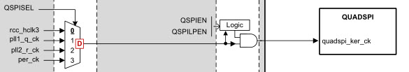

初始化QSPI存储器
======================

初始化好QSPI外设后，还要初始化QSPI存储器，需要先复位存储器，设置4字节地址模式，使能写操作，配置状态寄存器才可进行数据读写操作，见代码清单
24‑6。

代码清单 24‑6初始化QSPI存储器

.. code-block:: c
   :name: 代码清单24_6

    /**
    * @brief  初始化QSPI存储器
    * @retval QSPI存储器状态
    */
    uint8_t BSP_QSPI_Init(void)
    {
        QSPI_CommandTypeDef s_command;
        uint8_t value = W25Q256JV_FSR_QE;

        /* QSPI存储器复位 */
        if (QSPI_ResetMemory() != QSPI_OK) {
            return QSPI_NOT_SUPPORTED;
        }

        /* 设置QSPI存储器为4字节地址模式 */
        if (BSP_QSPI_4BYTE_ADDR_MOD() != QSPI_OK) {
            return QSPI_ERROR;
        }

        /* 使能写操作 */
        if (QSPI_WriteEnable() != QSPI_OK) {
            return QSPI_ERROR;
        }
        /*设置四路使能的状态寄存器，使能四通道IO2和IO3引脚 */
        s_command.InstructionMode   = QSPI_INSTRUCTION_1_LINE;
        s_command.Instruction       = WRITE_STATUS_REG2_CMD;
        s_command.AddressMode       = QSPI_ADDRESS_NONE;
        s_command.AlternateByteMode = QSPI_ALTERNATE_BYTES_NONE;
        s_command.DataMode          = QSPI_DATA_1_LINE;
        s_command.DummyCycles       = 0;
        s_command.NbData            = 1;
        s_command.DdrMode           = QSPI_DDR_MODE_DISABLE;
        s_command.DdrHoldHalfCycle  = QSPI_DDR_HHC_ANALOG_DELAY;
        s_command.SIOOMode          = QSPI_SIOO_INST_EVERY_CMD;
        /* 配置命令 */
        if (HAL_QSPI_Command(&QSPIHandle, &s_command,
            HAL_QPSI_TIMEOUT_DEFAULT_VALUE) != HAL_OK) {
            return QSPI_ERROR;
        }
        /* 传输数据 */
        if (HAL_QSPI_Transmit(&QSPIHandle, &value,
            HAL_QPSI_TIMEOUT_DEFAULT_VALUE) != HAL_OK) {
            return QSPI_ERROR;
        }
        /* 自动轮询模式等待存储器就绪 */
        if (QSPI_AutoPollingMemReady(W25Q256JV_SUBSECTOR_ERASE_MAX_TIME)
            != QSPI_OK) {
            return QSPI_ERROR;
        }
        /* 配置地址模式为 4 字节 */
        if (QSPI_Addr_Mode_Init() != QSPI_OK) {
            return QSPI_ERROR;
        }
        return QSPI_OK;
    }

设置QSPI储存器为4字节地址模式
====================================

W25Q256中默认的地址访问模式是3字节模式，由计算可知3字节的地址可以访问的最大内存是16M，而我们想要访问W25Q256的全部32M内存需要4个字节的地址，所以我们在使用前把存储器设置为4字节地址模式，见
代码清单24_7_。

代码清单 24‑7

.. code-block:: c
   :name: 代码清单24_7

    /**
    * @brief  检查地址模式不是4字节地址，配置为4字节
    * @retval QSPI存储器状态
    */
    static uint8_t QSPI_Addr_Mode_Init(void)
    {
        QSPI_CommandTypeDef s_command;
        uint8_t reg;
        /* 初始化读取状态寄存器命令 */
        s_command.InstructionMode   = QSPI_INSTRUCTION_1_LINE;
        s_command.Instruction       = READ_STATUS_REG3_CMD;
        s_command.AddressMode       = QSPI_ADDRESS_NONE;
        s_command.AlternateByteMode = QSPI_ALTERNATE_BYTES_NONE;
        s_command.DataMode          = QSPI_DATA_1_LINE;
        s_command.DummyCycles       = 0;
        s_command.NbData            = 1;
        s_command.DdrMode           = QSPI_DDR_MODE_DISABLE;
        s_command.DdrHoldHalfCycle  = QSPI_DDR_HHC_ANALOG_DELAY;
        s_command.SIOOMode          = QSPI_SIOO_INST_EVERY_CMD;

        /* 配置命令 */
        if (HAL_QSPI_Command(&QSPIHandle, &s_command,
            HAL_QPSI_TIMEOUT_DEFAULT_VALUE) != HAL_OK) {
            return QSPI_ERROR;
        }
        /* 接收数据 */
        if (HAL_QSPI_Receive(&QSPIHandle, &reg,
            HAL_QPSI_TIMEOUT_DEFAULT_VALUE) != HAL_OK) {
            return QSPI_ERROR;
        }

        /* 检查寄存器的值 */
        if ((reg & W25Q256FV_FSR_4ByteAddrMode) == 1) { // 4字节模式
            return QSPI_OK;
        } else { // 3字节模式
            /* 配置进入 4 字节地址模式命令 */
            s_command.Instruction = Enter_4Byte_Addr_Mode_CMD;
            s_command.DataMode    = QSPI_DATA_NONE;

            /* 配置并发送命令 */
            if (HAL_QSPI_Command(&QSPIHandle, &s_command,
                HAL_QPSI_TIMEOUT_DEFAULT_VALUE) != HAL_OK) {
                return QSPI_ERROR;
            }

            /* 自动轮询模式等待存储器就绪 */
            if (QSPI_AutoPollingMemReady(
                W25Q128FV_SUBSECTOR_ERASE_MAX_TIME) != QSPI_OK) {
                return QSPI_ERROR;
            }

            return QSPI_OK;
        }
    }

复位QSPI
========================

初始化好QSPI外设后，还要初始化QSPI存储器，需要先复位存储器，使能写操作，配置状态寄存器才可进行数据读写操作，见代码。

.. code-block:: c

    /**
    * @brief  复位QSPI存储器。
    * @param  QSPIHandle: QSPI句柄
    * @retval 无
    */
    static uint8_t QSPI_ResetMemory()
    {
        QSPI_CommandTypeDef s_command;
        /* 初始化复位使能命令 */
        s_command.InstructionMode   = QSPI_INSTRUCTION_1_LINE;
        s_command.Instruction       = RESET_ENABLE_CMD;
        s_command.AddressMode       = QSPI_ADDRESS_NONE;
        s_command.AlternateByteMode = QSPI_ALTERNATE_BYTES_NONE;
        s_command.DataMode          = QSPI_DATA_NONE;
        s_command.DummyCycles       = 0;
        s_command.DdrMode           = QSPI_DDR_MODE_DISABLE;
        s_command.DdrHoldHalfCycle  = QSPI_DDR_HHC_ANALOG_DELAY;
        s_command.SIOOMode          = QSPI_SIOO_INST_EVERY_CMD;

        /* 发送命令 */
        if (HAL_QSPI_Command(&QSPIHandle, &s_command,
            HAL_QPSI_TIMEOUT_DEFAULT_VALUE) != HAL_OK) {
            return QSPI_ERROR;
        }

        /* 发送复位存储器命令 */
        s_command.Instruction = RESET_MEMORY_CMD;
        if (HAL_QSPI_Command(&QSPIHandle, &s_command,
            HAL_QPSI_TIMEOUT_DEFAULT_VALUE) != HAL_OK) {
            return QSPI_ERROR;
        }

        /* 配置自动轮询模式等待存储器就绪 */
        if (QSPI_AutoPollingMemReady(HAL_QPSI_TIMEOUT_DEFAULT_VALUE) !=
            QSPI_OK) {
            return QSPI_ERROR;
        }
        return QSPI_OK;
    }

(1)	QSPI_CommandTypeDef定义一个s_command结构体变量，用于配置命令。

(2)	s_command命令配置：发送使能复位功能的指令，其具体参数值见上面的Flash指令编码表。跳过地址阶段，交替字节阶段，空指令阶段和数据阶段。不使能DDR模式。

(3)	调用HAL_QSPI_Command函数，来实现QSPI发送复位使能指令。

(4)	一旦使能复位FLASH功能了，我们便可以发送复位设备的FLASH指令，具体参数值见Flash指令表。

(5)	调用HAL_QSPI_AutoPolling库函数，来获取Flash的工作状态。具体内容见下面讲解。

使用QSPI读取大量数据
========================

我们要从存取器中读取大量数据，首先要用一个指针指向读回来数据，并确定数据的首地址，数据大小，
通过库函数HAL_QSPI_Command发送配置命令，然后调用库函数HAL_QSPI_Receive接收数据，
最后等待操作完成，我们看看它的代码实现，见 代码清单24_8_。

代码清单 24‑8 使用QSPI读取大量数据

.. code-block:: c
   :name: 代码清单24_8

    /**
    * @brief  从QSPI存储器中读取大量数据.
    * @param  pData: 指向要读取的数据的指针
    * @param  ReadAddr: 读取起始地址
    * @param  Size: 要读取的数据大小
    * @retval QSPI存储器状态
    */
    uint8_t BSP_QSPI_FastRead(uint8_t* pData, uint32_t ReadAddr, uint32_t
                            Size)
    {
        QSPI_CommandTypeDef s_command;

    //  if(Size == 0)
    //  {
    //    BURN_DEBUG("BSP_QSPI_FastRead Size = 0");
    //    return QSPI_OK;
    //  }
        /* 初始化读命令 */
        s_command.InstructionMode   = QSPI_INSTRUCTION_1_LINE;
        s_command.Instruction       = QUAD_INOUT_FAST_READ_CMD;
        s_command.AddressMode       = QSPI_ADDRESS_4_LINES;
        s_command.AddressSize       = QSPI_ADDRESS_32_BITS;
        s_command.Address           = ReadAddr;
        s_command.AlternateByteMode = QSPI_ALTERNATE_BYTES_NONE;
        s_command.DataMode          = QSPI_DATA_4_LINES;
        s_command.DummyCycles       = 6;
        s_command.NbData            = Size;
        s_command.DdrMode           = QSPI_DDR_MODE_DISABLE;
        s_command.DdrHoldHalfCycle  = QSPI_DDR_HHC_ANALOG_DELAY;
        s_command.SIOOMode          = QSPI_SIOO_INST_EVERY_CMD;

        /* 配置命令 */
        if (HAL_QSPI_Command(&QSPIHandle, &s_command,
            HAL_QPSI_TIMEOUT_DEFAULT_VALUE) != HAL_OK) {
            return QSPI_ERROR;
        }

        /* 接收数据 */
        if (HAL_QSPI_Receive(&QSPIHandle, pData,
            HAL_QPSI_TIMEOUT_DEFAULT_VALUE) != HAL_OK) {
            return QSPI_ERROR;
        }
        return QSPI_OK;
    }

使用QSPI写入大量数据
=======================

我们要从存取器中写入大量数据，首先要用一个指针指写入数据，并确定数据的首地址，数据大小，根据写入地址及大小判断存储器的页面，然后通过库函数HAL_QSPI_Command发送配置命令，然后调用库函数HAL_QSPI_Transmit逐页写入数据，最后等待操作完成，我们看看它的代码实现，见代码清单
24‑9。

代码清单 24‑9 使用QSPI读取大量数据

.. code-block:: c
   :name: 代码清单24_9

    /**
    * @brief  将大量数据写入QSPI存储器
    * @param  pData: 指向要写入数据的指针
    * @param  WriteAddr: 写起始地址
    * @param  Size: 要写入的数据大小
    * @retval QSPI存储器状态
    */
    uint8_t BSP_QSPI_Write(uint8_t* pData, uint32_t WriteAddr, uint32_t
                        Size)
    {
        QSPI_CommandTypeDef s_command;
        uint32_t end_addr, current_size, current_addr;
        /* 计算写入地址和页面末尾之间的大小 */
        current_addr = 0;

        while (current_addr <= WriteAddr) {
            current_addr += W25Q256JV_PAGE_SIZE;
        }
        current_size = current_addr - WriteAddr;

        /* 检查数据的大小是否小于页面中的剩余位置 */
        if (current_size > Size) {
            current_size = Size;
        }

        /* 初始化地址变量 */
        current_addr = WriteAddr;
        end_addr = WriteAddr + Size;

        /* 初始化程序命令 */
        s_command.InstructionMode   = QSPI_INSTRUCTION_1_LINE;
        s_command.Instruction       = QUAD_INPUT_PAGE_PROG_CMD;
        s_command.AddressMode       = QSPI_ADDRESS_1_LINE;
        s_command.AddressSize       = QSPI_ADDRESS_32_BITS;
        s_command.AlternateByteMode = QSPI_ALTERNATE_BYTES_NONE;
        s_command.DataMode          = QSPI_DATA_4_LINES;
        s_command.DummyCycles       = 0;
        s_command.DdrMode           = QSPI_DDR_MODE_DISABLE;
        s_command.DdrHoldHalfCycle  = QSPI_DDR_HHC_ANALOG_DELAY;
        s_command.SIOOMode          = QSPI_SIOO_INST_EVERY_CMD;

        /* 逐页执行写入 */
        do {
            s_command.Address = current_addr;
            s_command.NbData  = current_size;

            /* 启用写操作 */
            if (QSPI_WriteEnable() != QSPI_OK) {
                return QSPI_ERROR;
            }

            /* 配置命令 */
            if (HAL_QSPI_Command(&QSPIHandle, &s_command,
                HAL_QPSI_TIMEOUT_DEFAULT_VALUE) != HAL_OK) {
                return QSPI_ERROR;
            }

            /* 传输数据 */
            if (HAL_QSPI_Transmit(&QSPIHandle, pData,
                HAL_QPSI_TIMEOUT_DEFAULT_VALUE) != HAL_OK) {
                return QSPI_ERROR;
            }

            /* 配置自动轮询模式等待程序结束 */
            if (QSPI_AutoPollingMemReady(HAL_QPSI_TIMEOUT_DEFAULT_VALUE)
                != QSPI_OK) {
                return QSPI_ERROR;
            }

            /* 更新下一页编程的地址和大小变量 */
            current_addr += current_size;
            pData += current_size;
            current_size = ((current_addr + W25Q256JV_PAGE_SIZE) >
                        end_addr) ? (end_addr - current_addr) :
                        W25Q256JV_PAGE_SIZE;
        } while (current_addr < end_addr);
        return QSPI_OK;
    }

读取FLASH芯片ID
===================

根据“JEDEC”指令的时序，我们把读取FLASH
ID的过程编写成一个函数，见 代码清单24_10_。

代码清单 24‑10 读取FLASH芯片ID

.. code-block:: c
   :name: 代码清单24_10

    /**
    * @brief  读取FLASH ID
    * @param   无
    * @retval FLASH ID
    */
    uint32_t QSPI_FLASH_ReadID(void)
    {
        QSPI_CommandTypeDef s_command;
        uint32_t Temp = 0;
        uint8_t pData[3];
        /* 读取JEDEC ID */
        s_command.InstructionMode   = QSPI_INSTRUCTION_1_LINE;
        s_command.Instruction       = READ_JEDEC_ID_CMD;
        s_command.AddressMode       = QSPI_ADDRESS_1_LINE;
        s_command.AddressSize       = QSPI_ADDRESS_24_BITS;
        s_command.DataMode          = QSPI_DATA_1_LINE;
        s_command.AddressMode       = QSPI_ADDRESS_NONE;
        s_command.AlternateByteMode = QSPI_ALTERNATE_BYTES_NONE;
        s_command.DummyCycles       = 0;
        s_command.NbData            = 3;
        s_command.DdrMode           = QSPI_DDR_MODE_DISABLE;
        s_command.DdrHoldHalfCycle  = QSPI_DDR_HHC_ANALOG_DELAY;
        s_command.SIOOMode          = QSPI_SIOO_INST_EVERY_CMD;

    if(HAL_QSPI_Command(&QSPIHandle, &s_command, HAL_QPSI_TIMEOUT_DEFAULT_VALUE) != HAL_OK) {
            printf("something wrong ....\r\n");
            /* 用户可以在这里添加一些代码来处理这个错误 */
            while (1) {

            }
        }
        if(HAL_QSPI_Receive(&QSPIHandle, pData, HAL_QPSI_TIMEOUT_DEFAULT_VALUE)!= HAL_OK) {
            printf("something wrong ....\r\n");
            /* 用户可以在这里添加一些代码来处理这个错误 */
            while (1) {

            }
        }

        Temp = ( pData[2] | pData[1]<<8 )| ( pData[0]<<16 );

        return Temp;
    }

这段代码利用库函数HAL_QSPI_Command发送读取FLASH
ID指令，再调用库函数HAL_QSPI_Receive读取3个字节，获取FLASH芯片对该指令的响应，最后把读取到的这3个数据合并到一个变量Temp中。然后然后作为函数返回值，把该返回值与我们定义的宏“sFLASH_ID”对比，即可知道FLASH芯片是否正常。

FLASH写使能以及读取当前状态
===============================

在向FLASH芯片存储矩阵写入数据前，首先要使能写操作，通过“Write
Enable”命令即可写使能，见 代码清单24_11_。

代码清单 24‑11 写使能命令

.. code-block:: c
   :name: 代码清单24_11

    /**
    * @brief  发送写入使能，等待它有效.
    * @param  QSPIHandle: QSPI句柄
    * @retval 无
    */
    static uint8_t QSPI_WriteEnable()
    {
        QSPI_CommandTypeDef     s_command;
        QSPI_AutoPollingTypeDef s_config;
        /* 启用写操作 */
        s_command.InstructionMode   = QSPI_INSTRUCTION_1_LINE;
        s_command.Instruction       = WRITE_ENABLE_CMD;
        s_command.AddressMode       = QSPI_ADDRESS_NONE;
        s_command.AlternateByteMode = QSPI_ALTERNATE_BYTES_NONE;
        s_command.DataMode          = QSPI_DATA_NONE;
        s_command.DummyCycles       = 0;
        s_command.DdrMode           = QSPI_DDR_MODE_DISABLE;
        s_command.DdrHoldHalfCycle  = QSPI_DDR_HHC_ANALOG_DELAY;
        s_command.SIOOMode          = QSPI_SIOO_INST_EVERY_CMD;
    if(HAL_QSPI_Command(&QSPIHandle, &s_command, HAL_QPSI_TIMEOUT_DEFAULT_VALUE) != HAL_OK){
            return QSPI_ERROR;
        }

        /* 配置自动轮询模式等待写启用 */
        s_config.Match           = W25Q256FV_FSR_WREN;
        s_config.Mask            = W25Q256FV_FSR_WREN;
        s_config.MatchMode       = QSPI_MATCH_MODE_AND;
        s_config.StatusBytesSize = 1;
        s_config.Interval        = 0x10;
        s_config.AutomaticStop   = QSPI_AUTOMATIC_STOP_ENABLE;

        s_command.Instruction    = READ_STATUS_REG1_CMD;
        s_command.DataMode       = QSPI_DATA_1_LINE;
        s_command.NbData         = 1;

    if(HAL_QSPI_AutoPolling(&QSPIHandle, &s_command, &s_config, HAL_QPSI_TIMEOUT_DEFAULT_VALUE) != HAL_OK){
            return QSPI_ERROR;
        }
        return QSPI_OK;
    }

与EEPROM一样，由于FLASH芯片向内部存储矩阵写入数据需要消耗一定的时间，并不是在总线通讯结束的一瞬间完成的，所以在写操作后需要确认FLASH芯片“空闲”时才能进行再次写入。为了表示自己的工作状态，FLASH芯片定义了一个状态寄存器，见图
24‑6。

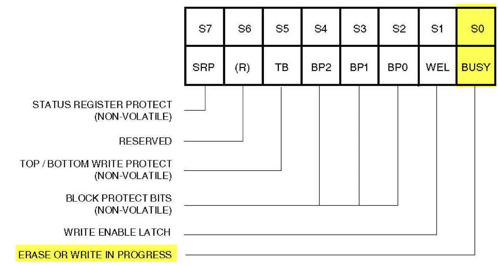

图 24‑6 FLASH芯片的状态寄存器

我们只关注这个状态寄存器的第0位“BUSY”，当这个位为“1”时，表明FLASH芯片处于忙碌状态，它可能正在对内部的存储矩阵进行“擦除”或“数据写入”的操作。

利用指令表中的“Read Status
Register”指令可以获取FLASH芯片状态寄存器的内容，其时序见图 24‑7。

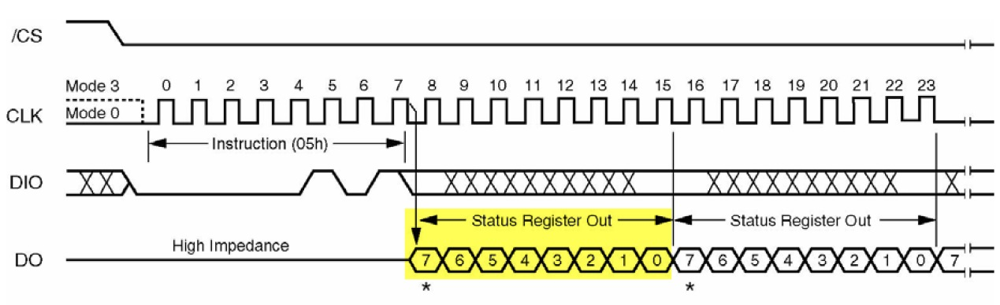

图 24‑7 读取状态寄存器的时序

只要向FLASH芯片发送了读状态寄存器的指令，FLASH芯片就会持续向主机返回最新的状态寄存器内容，直到收到SPI通讯的停止信号。
HAL库提供了具有等待FLASH芯片写入结束功能的函数，见 代码清单24_12_。

代码清单 24‑12 通过读状态寄存器等待FLASH芯片空闲

.. code-block:: c
   :name: 代码清单24_12

    /**
    * @brief  读取存储器的SR并等待EOP
    * @param  QSPIHandle: QSPI句柄
    * @param  Timeout 超时
    * @retval 无
    */
    static uint8_t QSPI_AutoPollingMemReady(uint32_t Timeout)
    {
        QSPI_CommandTypeDef     s_command;
        QSPI_AutoPollingTypeDef s_config;
        /* 配置自动轮询模式等待存储器准备就绪 */
        s_command.InstructionMode   = QSPI_INSTRUCTION_1_LINE;
        s_command.Instruction       = READ_STATUS_REG1_CMD;
        s_command.AddressMode       = QSPI_ADDRESS_NONE;
        s_command.AlternateByteMode = QSPI_ALTERNATE_BYTES_NONE;
        s_command.DataMode          = QSPI_DATA_1_LINE;
        s_command.DummyCycles       = 0;
        s_command.DdrMode           = QSPI_DDR_MODE_DISABLE;
        s_command.DdrHoldHalfCycle  = QSPI_DDR_HHC_ANALOG_DELAY;
        s_command.SIOOMode          = QSPI_SIOO_INST_EVERY_CMD;

        s_config.Match           = 0x00;
        s_config.Mask            = W25Q256FV_FSR_BUSY;
        s_config.MatchMode       = QSPI_MATCH_MODE_AND;
        s_config.StatusBytesSize = 1;
        s_config.Interval        = 0x10;
        s_config.AutomaticStop   = QSPI_AUTOMATIC_STOP_ENABLE;

        if (HAL_QSPI_AutoPolling(&QSPIHandle, &s_command, &s_config, Timeout) != HAL_OK) {
            return QSPI_ERROR;
        }
        return QSPI_OK;
    }

这段代码直接调用HAL_QSPI_AutoPolling库函数，设定命令参数及自动轮询参数，最后设定超时返回，如果在超时等待时间内确定FLASH就绪则返回存储器就绪状态，否则返回存储器错误。其实主要操作就是检查它的“W25Q256FV_FSR_BUSY”(即BUSY位)，一直等待到该标志表示写入结束时才退出本函数，以便继续后面与FLASH芯片的数据通讯。

FLASH扇区擦除
=======================

由于FLASH存储器的特性决定了它只能把原来为“1”的数据位改写成“0”，而原来为“0”的数据位不能直接改写为“1”。所以这里涉及到数据“擦除”的概念，在写入前，必须要对目标存储矩阵进行擦除操作，把矩阵中的数据位擦除为“1”，在数据写入的时候，如果要存储数据“1”，那就不修改存储矩阵
，在要存储数据“0”时，才更改该位。

通常，对存储矩阵擦除的基本操作单位都是多个字节进行，如本例子中的FLASH芯片支持“扇区擦除”、“块擦除”以及“整片擦除”，见表
24‑3。

表 24‑3 本实验FLASH芯片的擦除单位

+----------------------+------------------+
| 擦除单位             | 大小             |
+======================+==================+
| 扇区擦除Sector Erase | 4KB              |
+----------------------+------------------+
| 块擦除Block Erase    | 64KB             |
+----------------------+------------------+
| 整片擦除Chip Erase   | 整个芯片完全擦除 |
+----------------------+------------------+

FLASH芯片的最小擦除单位为扇区(Sector)，而一个块(Block)包含16个扇区，其内部存储矩阵分布见图
24‑8。。

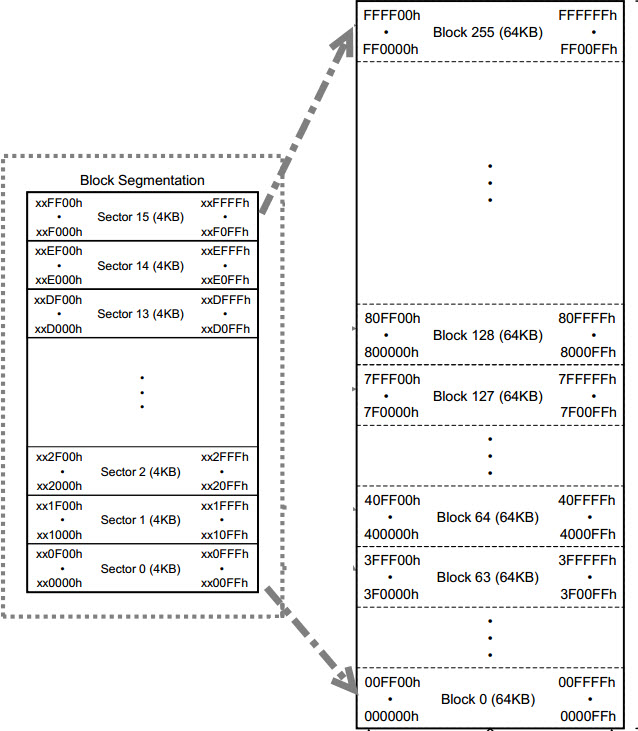

图 24‑8 FLASH芯片的存储矩阵

使用扇区擦除指令“SectorErase”可控制FLASH芯片开始擦写，其指令时序见下 。

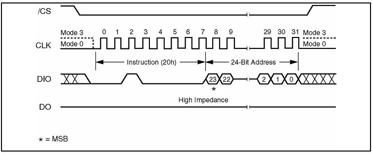

图 24‑9 扇区擦除时序

扇区擦除指令的第一个字节为指令编码，紧接着发送的3个字节用于表示要擦除的存储矩阵地址。
要注意的是在扇区擦除指令前，还需要先发送“写使能”指令，发送扇区擦除指令后，
通过读取寄存器状态等待扇区擦除操作完毕，代码实现见 代码清单24_13_。

代码清单 24‑13 擦除扇区

.. code-block:: c
   :name: 代码清单24_13

    /**
    * @brief  擦除QSPI存储器的指定块
    * @param  BlockAddress: 需要擦除的块地址
    * @retval QSPI存储器状态
    */
    uint8_t BSP_QSPI_Erase_Block(uint32_t BlockAddress)
    {
        QSPI_CommandTypeDef s_command;
        /* 初始化擦除命令 */
        s_command.InstructionMode   = QSPI_INSTRUCTION_1_LINE;
        s_command.Instruction       = SECTOR_ERASE_CMD;
        s_command.AddressMode       = QSPI_ADDRESS_1_LINE;
        s_command.AddressSize       = QSPI_ADDRESS_32_BITS;
        s_command.Address           = BlockAddress;
        s_command.AlternateByteMode = QSPI_ALTERNATE_BYTES_NONE;
        s_command.DataMode          = QSPI_DATA_NONE;
        s_command.DummyCycles       = 0;
        s_command.DdrMode           = QSPI_DDR_MODE_DISABLE;
        s_command.DdrHoldHalfCycle  = QSPI_DDR_HHC_ANALOG_DELAY;
        s_command.SIOOMode          = QSPI_SIOO_INST_EVERY_CMD;

        /* 启用写操作 */
        if (QSPI_WriteEnable() != QSPI_OK) {
            return QSPI_ERROR;
        }

        /* 发送命令 */
    f(HAL_QSPI_Command(&QSPIHandle, &s_command, HAL_QPSI_TIMEOUT_DEFAULT_VALUE) != HAL_OK) {
            return QSPI_ERROR;
        }

        /* 配置自动轮询模式等待擦除结束 */
        if (QSPI_AutoPollingMemReady(W25Q256FV_SUBSECTOR_ERASE_MAX_TIME) != QSPI_OK) {
            return QSPI_ERROR;
        }
        return QSPI_OK;
    }

main函数
''''''''

最后我们来编写main函数，进行FLASH芯片读写校验，见 代码清单24_14_。

代码清单 24‑14 main函数

.. code-block:: c
   :name: 代码清单24_14

    int main(void)
    {
        /* 使能指令缓存 */
        SCB_EnableICache();

        /* 使能数据缓存 */
        SCB_EnableDCache();

        /* 设定系统时钟为400MHz */
        SystemClock_Config();

        LED_GPIO_Config();
        LED_BLUE;

        /* 配置串口1为：115200 8-N-1 */
        DEBUG_USART_Config();

        printf("\r\n这是一个32M串行flash(W25Q256)实验(QSPI驱动) \r\n");

        /* 16M串行flash W25Q256初始化 */
        QSPI_FLASH_Init();

        /* 获取 Flash Device ID */
        DeviceID = QSPI_FLASH_ReadDeviceID();

        Delay( 200 );

        /* 获取 SPI Flash ID */
        FlashID = QSPI_FLASH_ReadID();

        printf("\r\nFlashID is 0x%X,  Manufacturer Device ID is 0x%X\r\n", FlashID, DeviceID);

        /* 检验 SPI Flash ID */
        if (FlashID == sFLASH_ID) {
            printf("\r\n检测到QSPI FLASH W25Q256 !\r\n");

            /* 擦除将要写入的 QSPI FLASH 扇区，FLASH写入前要先擦除 */
            BSP_QSPI_Erase_Block(FLASH_SectorToErase);

            /* 将发送缓冲区的数据写到flash中 */
            BSP_QSPI_Write(Tx_Buffer, FLASH_WriteAddress, BufferSize);
            printf("\r\n写入的数据为：\r\n%s", Tx_Buffer);

            /* 将刚刚写入的数据读出来放到接收缓冲区中 */
            BSP_QSPI_Read(Rx_Buffer, FLASH_ReadAddress, BufferSize);
            printf("\r\n读出的数据为：\r\n%s", Rx_Buffer);

            /* 检查写入的数据与读出的数据是否相等 */
            TransferStatus1 = Buffercmp(Tx_Buffer, Rx_Buffer, BufferSize);

            if ( PASSED == TransferStatus1 ) {
                LED_GREEN;
                printf("\r\n32M串行flash(W25Q256)测试成功!\n\r");
            } else {
                LED_RED;
                printf("\r\n32M串行flash(W25Q256)测试失败!\n\r");
            }
        }// if (FlashID == sFLASH_ID)
        else {
            LED_RED;
            printf("\r\n获取不到 W25Q256 ID!\n\r");
        }

        while (1);
    }

函数中初始化了系统时钟、LED、串口SPI外设，然后读取FLASH芯片的ID进行校验，若ID校验通过则向FLASH的特定地址写入测试数据，然后再从该地址读取数据，测试读写是否正常。

.. attention::

    由于实验板上的FLASH芯片默认已经存储了特定用途的数据，如擦除了这些数据会影响到某些程序的运行。所以我们预留了FLASH芯片的“第0扇区(0-4096地址)”专用于本实验，如非必要，请勿擦除其它地址的内容。如已擦除，可在配套资料里找到“刷外部FLASH内容”程序，根据其说明给FLASH重新写入出厂内容。

下载验证
^^^^^^^^

用USB线连接开发板“USB TO
UART”接口跟电脑，在电脑端打开串口调试助手，把编译好的程序下载到开发板。在串口调试助手可看到FLASH测试的调试信息。
