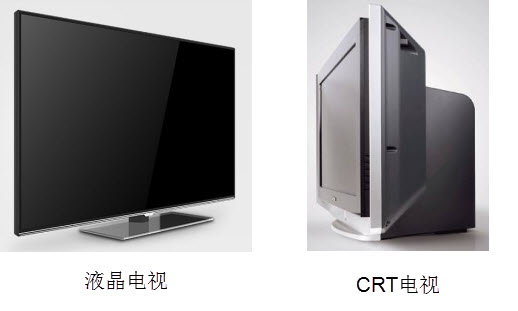
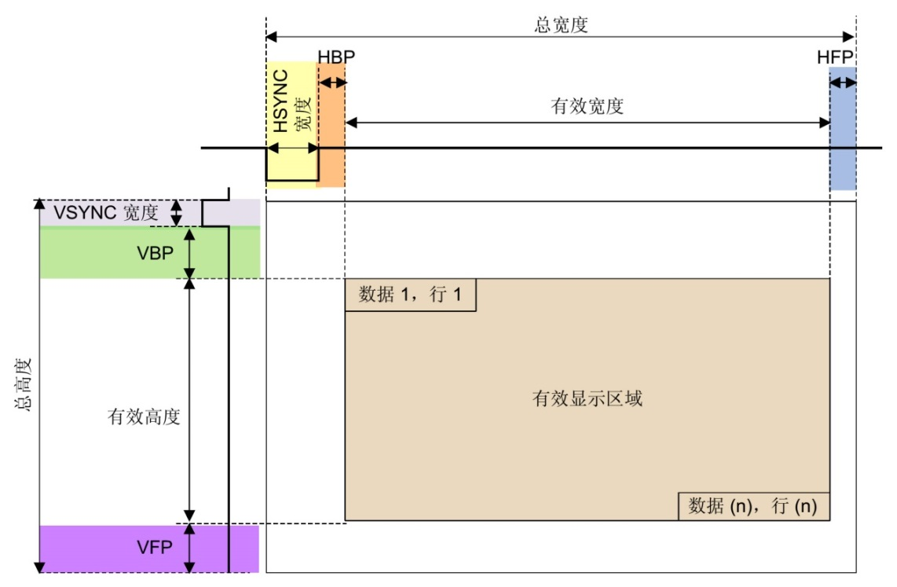
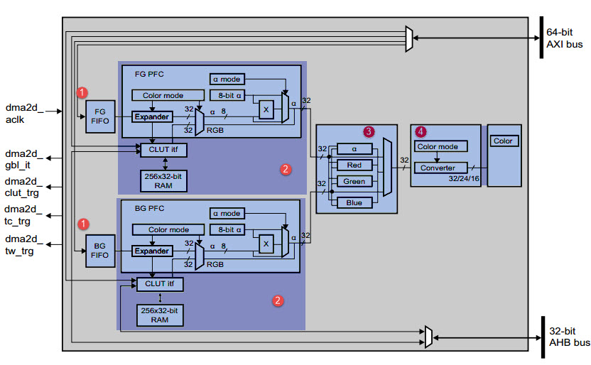
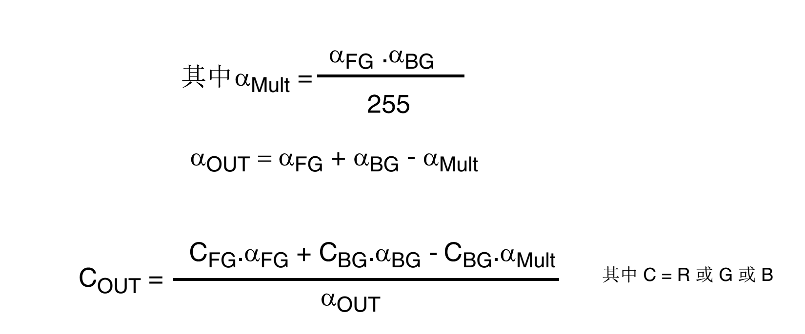
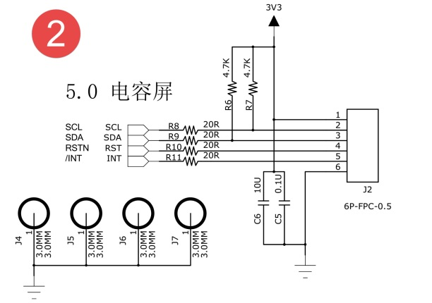
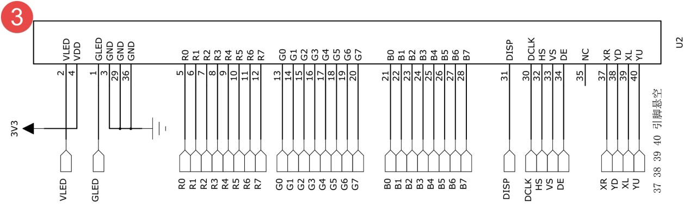
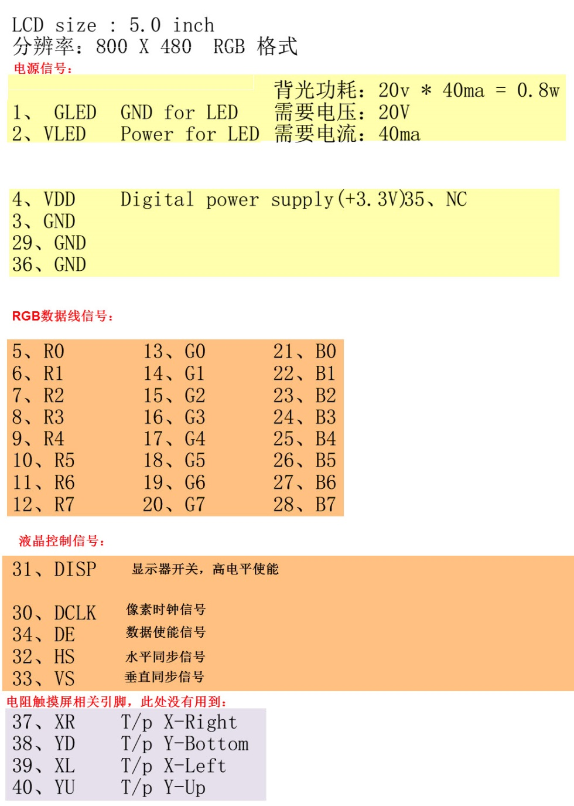

LTDC/DMA2D—液晶显示
-------------------

本章参考资料：《STM32H743用户手册》、《STM32H743xI规格书》、库帮助文档《STM32H753xx_User_Manual.chm》。

关于开发板配套的液晶屏参数可查阅《5.0寸液晶屏数据手册》配套资料获知。

显示器简介
~~~~~~~~~~

显示器属于计算机的I/O设备，即输入输出设备。它是一种将特定电子信息输出到屏幕上再反射到人眼的显示工具。常见的有CRT显示器、液晶显示器、LED点阵显示器及OLED显示器。

液晶显示器
^^^^^^^^^^

    液晶显示器，简称LCD(Liquid Crystal
    Display)，相对于上一代CRT显示器(阴极射线管显示器)，LCD显示器具有功耗低、体积小、承载的信息量大及不伤眼的优点，因而它成为了现在的主流电子显示设备，其中包括电视、电脑显示器、手机屏幕及各种嵌入式设备的显示器。下图是液晶电视与CRT电视的外观对比，很明显液晶电视更薄，“时尚”是液晶电视给人的第一印象，而CRT
    电视则感觉很“笨重”。

液晶电视及CRT电视

液晶是一种介于固体和液体之间的特殊物质，它是一种有机化合物，常态下呈液态，但是它的分子排列却和固体晶体一样非常规则，因此取名液晶。
如果给液晶施加电场，会改变它的分子排列，从而改变光线的传播方向，配合偏振光片，它就具有控制光线透过率的作用，再配合彩色滤光片，改变加给液晶电压大小，
就能改变某一颜色透光量的多少，液晶屏的显示结构_ 中的就是绿色显示结构。利用这种原理，做出可控红、绿、蓝光输出强度的显示结构，
把三种显示结构组成一个显示单位，通过控制红绿蓝的强度，可以使该单位混合输出不同的色彩，这样的一个显示单位被称为像素。

.. image:: media/image2.jpg
   :align: center
   :alt: 液晶屏的显示结构
   :name: 液晶屏的显示结构

液晶屏的绿色显示结构

注意液晶本身是不发光的，所以需要有一个背光灯提供光源，光线经过一系列处理过程才到输出，所以输出的光线强度是要比光源的强度低很多的，比较浪费能源(当然，比CRT显示器还是节能多了)。而且这些处理过程会导致显示方向比较窄，也就是它的视角较小，从侧面看屏幕会看不清它的显示内容。另外，输出的色彩变换时，液晶分子转动也需要消耗一定的时间，导致屏幕的响应速度低。

LED和OLED显示器
^^^^^^^^^^^^^^^

LED点阵显示器不存在以上液晶显示器的问题，LED点阵彩色显示器的单个像素点内包含红绿蓝三色LED灯，显示原理类似我们实验板上的LED彩灯，
通过控制红绿蓝颜色的强度进行混色，实现全彩颜色输出，多个像素点构成一个屏幕。由于每个像素点都是LED灯自发光的，
所以在户外白天也显示得非常清晰，但由于LED灯体积较大，导致屏幕的像素密度低，所以它一般只适合用于广场上的巨型显示器。
相对来说，单色的LED点阵显示器应用得更广泛，如公交车上的信息展示牌、店招等，见 LED点阵彩屏有LED单色显示屏_。

.. image:: media/image3.jpg
   :align: center
   :alt: LED点阵彩屏有LED单色显示屏
   :name: LED点阵彩屏有LED单色显示屏

LED点阵彩屏有LED单色显示屏

新一代的OLED显示器与LED点阵彩色显示器的原理类似，但由于它采用的像素单元是“有机发光二极管”(Organic
Light Emitting Diode)，所以像素密度比普通LED点阵显示器高得多，见 OLED像素结构_。

.. image:: media/image4.jpg
   :align: center
   :alt: OLED像素结构
   :name: OLED像素结构

OLED像素结构

OLED显示器不需要背光源、对比度高、轻薄、视角广及响应速度快等优点。待到生产工艺更加成熟时，必将取代现在液晶显示器的地位，见图。

.. image:: media/image5.jpg
   :align: center
   :alt: 采用OLED屏幕的电视及智能手表
   :name: 采用OLED屏幕的电视及智能手表

采用OLED屏幕的电视及智能手表

显示器的基本参数
^^^^^^^^^^^^^^^^

不管是哪一种显示器，都有一定的参数用于描述它们的特性，各个参数介绍如下：

(1) 像素

    像素是组成图像的最基本单元要素，显示器的像素指它成像最小的点，即前面讲解液晶原理中提到的一个显示单元。

(2) 分辨率

    一些嵌入式设备的显示器常常以“行像素值x列像素值”表示屏幕的分辨率。如分辨率800x480表示该显示器的每一行有800个像素点，每一列有480个像素点，也可理解为有800列，480行。

(3) 色彩深度

    色彩深度指显示器的每个像素点能表示多少种颜色，一般用“位”(bit)来表示。如单色屏的每个像素点能表示亮或灭两种状态(即实际上能显示2种颜色)，用1个数据位就可以表示像素点的所有状态，所以它的色彩深度为1bit，其它常见的显示屏色深为16bit、24bit。

(4) 显示器尺寸

    显示器的大小一般以英寸表示，如5英寸、21英寸、24英寸等，这个长度是指屏幕对角线的长度，
    通过显示器的对角线长度及长宽比可确定显示器的实际长宽尺寸。

(5) 点距

    点距指两个相邻像素点之间的距离，它会影响画质的细腻度及观看距离，相同尺寸的屏幕，若分辨率越高，则点距越小，画质越细腻。如现在有些手机的屏幕分辨率比电脑显示器的还大，这是手机屏幕点距小的原因；LED点阵显示屏的点距一般都比较大，所以适合远距离观看。

液晶控制原理
~~~~~~~~~~~~

下图是两种适合于STM32芯片使用的显示屏，我们以它为例讲解控制液晶屏的原理。

.. image:: media/image6.jpeg
   :align: center
   :alt: 适合STM32控制的显示屏实物图
   :name: 适合STM32控制的显示屏实物图

适合STM32控制的显示屏实物图

这个完整的显示屏由液晶显示面板、电容触摸面板以及PCB底板构成。图中的触摸面板带有触摸控制芯片，该芯片处理触摸信号并通过引出的信号线与外部器件通讯面板中间是透明的，它贴在液晶面板上面，一起构成屏幕的主体，触摸面板与液晶面板引出的排线连接到PCB底板上，根据实际需要，PCB底板上可能会带有“液晶控制器芯片”。因为控制液晶面板需要比较多的资源，所以大部分低级微控制器都不能直接控制液晶面板，需要额外配套一个专用液晶控制器来处理显示过程，外部微控制器只要把它希望显示的数据直接交给液晶控制器即可。而不带液晶控制器的PCB底板
，只有小部分的电源管理电路，液晶面板的信号线与外部微控制器相连，直接控制。STM32H743系列的芯片不需要额外的液晶控制器，也就是说它把专用液晶控制器的功能集成到STM32H743芯片内部了，节约了额外的控制器成本。

液晶面板的控制信号
^^^^^^^^^^^^^^^^^^

本章我们主要讲解控制液晶面板（不带控制器），液晶面板的控制信号线见表
27‑1。

    表 27‑1 液晶面板的信号线

+----------+------------------+
| 信号名称 | 说明             |
+==========+==================+
| R[7:0]   | 红色数据         |
+----------+------------------+
| G[7:0]   | 绿色数据         |
+----------+------------------+
| B[7:0]   | 蓝色数据         |
+----------+------------------+
| CLK      | 像素同步时钟信号 |
+----------+------------------+
| HSYNC    | 水平同步信号     |
+----------+------------------+
| VSYNC    | 垂直同步信号     |
+----------+------------------+
| DE       | 数据使能信号     |
+----------+------------------+

(1) RGB信号线

    RGB信号线各有8根，分别用于表示液晶屏一个像素点的红、绿、蓝颜色分量。使用红绿蓝颜色分量来表示颜色是一种通用的做法，打开Windows系统自带的画板调色工具，
    可看到颜色的红绿蓝分量值，见图 颜色表示法_。常见的颜色表示会在“RGB”后面附带各个颜色分量值的数据位数，
    如RGB565表示红绿蓝的数据线数分别为5、6、5根，一共为16个数据位，可表示2\ :sup:`16`\ 种颜色；
    而这个液晶屏的种颜色分量的数据线都有8根，所以它支持RGB888格式，一共24位数据线，可表示的颜色为2\ :sup:`24`\ 种。

.. image:: media/image7.png
   :align: center
   :alt: 颜色表示法
   :name: 颜色表示法

颜色表示法

(2) 同步时钟信号CLK

    液晶屏与外部使用同步通讯方式，以CLK信号作为同步时钟，在同步时钟的驱动下，每个时钟传输一个像素点数据。

(3) 水平同步信号HSYNC

    水平同步信号HSYNC(Horizontal
    Sync)用于表示液晶屏一行像素数据的传输结束，每传输完成液晶屏的一行像素数据时，HSYNC会发生电平跳变，如分辨率为800x480的显示屏(800列，480行)，传输一帧的图像HSYNC的电平会跳变480次。

(4) 垂直同步信号VSYNC

    垂直同步信号VSYNC(Vertical
    Sync)用于表示液晶屏一帧像素数据的传输结束，每传输完成一帧像素数据时，VSYNC会发生电平跳变。其中“帧”是图像的单位，一幅图像称为一帧，在液晶屏中，一帧指一个完整屏液晶像素点。人们常常用“帧/秒”来表示液晶屏的刷新特性，即液晶屏每秒可以显示多少帧图像，如液晶屏以60帧/秒的速率运行时，VSYNC每秒钟电平会跳变60次。

(5) 数据使能信号DE

    数据使能信号DE(Data
    Enable)用于表示数据的有效性，当DE信号线为高电平时，RGB信号线表示的数据有效。

液晶数据传输时序
^^^^^^^^^^^^^^^^

通过上述信号线向液晶屏传输像素数据时，各信号线的时序见图 液晶时序图_。
图中表示的是向液晶屏传输一帧图像数据的时序，中间省略了多行及多个像素点。

.. image:: media/image8.jpg
   :align: center
   :alt: 液晶时序图
   :name: 液晶时序图

液晶时序图

液晶屏显示的图像可看作一个矩形，结合图 液晶数据传输图解_ 来理解。液晶屏有一个显示指针，它指向将要显示的像素。
显示指针的扫描方向方向从左到右、从上到下，一个像素点一个像素点地描绘图形。这些像素点的数据通过RGB数据线传输至液晶屏，
它们在同步时钟CLK的驱动下一个一个地传输到液晶屏中，交给显示指针，传输完成一行时，
水平同步信号HSYNC电平跳变一次，而传输完一帧时VSYNC电平跳变一次。

液晶数据传输图解

但是，液晶显示指针在行与行之间，帧与帧之间切换时需要延时，而且HSYNC及VSYNC信号本身也有宽度，这些时间参数说明见表
27‑2。

    表 27‑2 液晶通讯中的时间参数

+------------------------------+---------------------------------------------------------------+
|           时间参数           |                           参数说明                            |
+==============================+===============================================================+
| VBP (vertical back porch)    | 表示在一帧图像开始时，垂直同步信号以后的无效的行数            |
+------------------------------+---------------------------------------------------------------+
| VFP (vertical front porch)   | 表示在一帧图像结束后，垂直同步信号以前的无效的行数            |
+------------------------------+---------------------------------------------------------------+
| HBP (horizontal back porch)  | 表示从水平同步信号开始到一行的有效数据开始之间的CLK的个数     |
+------------------------------+---------------------------------------------------------------+
| HFP (horizontal front porth) | 表示一行的有效数据结束到下一个水平同步信号开始之间的CLK的个数 |
+------------------------------+---------------------------------------------------------------+
| VSW (vertical sync width)    | 表示垂直同步信号的宽度，单位为行                              |
+------------------------------+---------------------------------------------------------------+
| HSW (horizontal sync width)  | 表示水平同步信号的宽度，单位为同步时钟CLK的个数               |
+------------------------------+---------------------------------------------------------------+

在这些时间参数控制的区域，数据使能信号线“DE”都为低电平，RGB数据线的信号无效，当“DE”为高电平时，表示的数据有效，传输的数据会直接影响液晶屏的显示区域。

显存
^^^^

液晶屏中的每个像素点都是数据，在实际应用中需要把每个像素点的数据缓存起来，再传输给液晶屏，这种存储显示数据的存储器被称为显存。显存一般至少要能存储液晶屏的一帧显示数据，如分辨率为800x480的液晶屏，使用RGB888格式显示，它的一帧显示数据大小为：3x800x480=1152000字节；若使用RGB565格式显示，一帧显示数据大小为：2x800x480=768000字节。

LTDC液晶控制器简介
~~~~~~~~~~~~~~~~~~

STM32H743系列芯片内部自带一个LTDC液晶控制器，使用SDRAM的部分空间作为显存，可直接控制液晶面板，无需额外增加液晶控制器芯片。STM32的LTDC液晶控制器最高支持800x600分辨率的屏幕；可支持多种颜色格式，包括RGB888、RGB565、ARGB8888和ARGB1555等(其中的“A”是指透明像素)；支持2层显示数据混合，利用这个特性，可高效地做出背景和前景分离的显示效果，如以视频为背景，在前景显示弹幕。

图像数据混合
^^^^^^^^^^^^

LTDC外设支持2层数据混合，混合前使用2层数据源，分别为前景层和背景层，见图 图像的分层与混合_。
在输出时，实际上液晶屏只能显示一层图像，所以LTDC在输出数据到液晶屏前需要把2层图像混合成一层，
跟Photoshop软件的分层合成图片过程类似。混合时，直接用前景层中的不透明像素替换相同位置的背景像素；
而前景层中透明像素的位置，则使用背景的像素数据，即显示背景层的像素。

图像的分层与混合

如果想使用图像混合功能，前景层必须使用包含透明的像素格式，如ARGB1555或ARGB8888。其中ARGB1555使用1个数据位表示透明元素，它只能表示像素是透明或不透明，当最高位(即“A”位)为1时，表示这是一个不透明的像素，具体颜色值为RGB位表示的颜色，而当最高位为0时，表示这是一个完全透明的像素，RGB位的数据无效；而ARGB8888的像素格式使用8个数据位表示透明元素，它使用高8位表示“透明度”(即代表“A”的8个数据位)，若A的值为“0xFF”，则表示这个像素完全不透明，若A的值为“0x00”则表示这个像素完全透明，介于它们之间的值表示其RGB颜色不同程度的透明度，即混合后背景像素根据这个值按比例来表示。

注意液晶屏本身是没有透明度概念的，如24位液晶屏的像素数据格式是RGB888，RGB颜色各有对应的8根数据线，不存在用于表示透明度的数据线，所以实际上ARGB只是针对内部分层数据处理的格式，最终经过混合运算得出直接颜色数据RGB888才能交给液晶屏显示。

LTDC结构框图剖析
^^^^^^^^^^^^^^^^

下图是LTDC控制器的结构框图，它主要包含信号线、图像处理单元、寄存器及时钟信号。

LTDC控制器框图

LTDC信号线
''''''''''

LTDC的控制信号线与液晶显示面板的数据线一一对应，包含有RGB各8根数据线、HSYNC、VSYNC、DE及CLK。设计硬件时把液晶面板与STM32对应的这些引脚连接起来即可，查阅《STM32H743xI规格书》可知LTDC信号线对应的引脚，见表
27‑3。

    表 27‑3 LTDC引脚表

+--------+-----------+--------+----------+--------+-----------+--------+----------+
| 引脚号 | LTDC信号  | 引脚号 | LTDC信号 | 引脚号 | LTDC信号  | 引脚号 | LTDC信号 |
+========+===========+========+==========+========+===========+========+==========+
| PA3    | LCD_B5    | PE11   | LCD_G3   | PH14   | LCD_G3    | PJ4    | LCD_R5   |
+--------+-----------+--------+----------+--------+-----------+--------+----------+
| PA4    | LCD_VSYNC | PE12   | LCD_B4   | PH15   | LCD_G4    | PJ5    | LCD_R6   |
+--------+-----------+--------+----------+--------+-----------+--------+----------+
| PA6    | LCD_G2    | PE13   | LCD_DE   | PI0    | LCD_G5    | PJ6    | LCD_R7   |
+--------+-----------+--------+----------+--------+-----------+--------+----------+
| PA8    | LCD_R6    | PE14   | LCD_CLK  | PI1    | LCD_G6    | PJ7    | LCD_G0   |
+--------+-----------+--------+----------+--------+-----------+--------+----------+
| PA11   | LCD_R4    | PE15   | LCD_R7   | PI2    | LCD_G7    | PJ8    | LCD_G1   |
+--------+-----------+--------+----------+--------+-----------+--------+----------+
| PA12   | LCD_R5    | PF10   | LCD_DE   | PI4    | LCD_B4    | PJ9    | LCD_G2   |
+--------+-----------+--------+----------+--------+-----------+--------+----------+
| PB8    | LCD_B6    | PG6    | LCD_R7   | PI5    | LCD_B5    | PJ10   | LCD_G3   |
+--------+-----------+--------+----------+--------+-----------+--------+----------+
| PB9    | LCD_B7    | PG7    | LCD_CLK  | PI6    | LCD_B6    | PJ11   | LCD_G4   |
+--------+-----------+--------+----------+--------+-----------+--------+----------+
| PB10   | LCD_G4    | PG10   | LCD_B2   | PI7    | LCD_B7    | PJ12   | LCD_B0   |
+--------+-----------+--------+----------+--------+-----------+--------+----------+
| PB11   | LCDG5     | PG11   | LCD_B3   | PI9    | LCD_VSYNC | PJ13   | LCD_B1   |
+--------+-----------+--------+----------+--------+-----------+--------+----------+
| PC6    | LCD_HSYNC | PG12   | LCD_B1   | PI10   | LCD_HSYNC | PJ14   | LCD_B2   |
+--------+-----------+--------+----------+--------+-----------+--------+----------+
| PC7    | LCD_G6    | PH2    | LCD_R0   | PI12   | LCD_HSYNC | PJ15   | LCD_B3   |
+--------+-----------+--------+----------+--------+-----------+--------+----------+
| PC10   | LCD_R2    | PH3    | LCD_R1   | PI13   | LCD_VSYNC | PK0    | LCD_G5   |
+--------+-----------+--------+----------+--------+-----------+--------+----------+
| PD3    | LCD_G7    | PH8    | LCD_R2   | PI14   | LCD_CLK   | PK1    | LCD_G6   |
+--------+-----------+--------+----------+--------+-----------+--------+----------+
| PD6    | LCD_B2    | PH9    | LCD_R3   | PI15   | LCD_R0    | PK2    | LCD_G7   |
+--------+-----------+--------+----------+--------+-----------+--------+----------+
| PD10   | LCD_B3    | PH10   | LCD_R4   | PJ0    | LCD_R1    | PK3    | LCD_B4   |
+--------+-----------+--------+----------+--------+-----------+--------+----------+
| PE4    | LCD_B0    | PH11   | LCD_R5   | PJ1    | LCD_R2    | PK4    | LCD_B5   |
+--------+-----------+--------+----------+--------+-----------+--------+----------+
| PE5    | LCD_G0    | PH12   | LCD_R6   | PJ2    | LCD_R3    | PK5    | LCD_B6   |
+--------+-----------+--------+----------+--------+-----------+--------+----------+
| PE6    | LCD_G1    | PH13   | LCD_G2   | PJ3    | LCD_R4    | PK6    | LCD_B7   |
+--------+-----------+--------+----------+--------+-----------+--------+----------+

图像处理单元
''''''''''''

LTDC框图标号2表示的是图像处理单元，它通过“AHB接口”获取显存中的数据，然后按分层把数据分别发送到两个“层FIFO”缓存，每个FIFO可缓存64x32位的数据，接着从缓存中获取数据交给“PFC”(像素格式转换器)，它把数据从像素格式转换成字(ARGB8888)的格式，再经过“混合单元”把两层数据合并起来，最终混合得到的是单层要显示的数据，通过信号线输出到液晶面板。这部分结构与DMA2D的很类似，我们在下一小节详细讲解。

在输出前混合单元的数据还经过一个“抖动单元”，它的作用是当像素数据格式的色深大于液晶面板实际色深时，对像素数据颜色进行舍入操作，如向18位显示器上显示24位数据时，抖动单元把像素数据的低6位与阈值比较，若大于阈值，则向数据的第7位进1，否则直接舍掉低6位。

配置和状态寄存器
''''''''''''''''

框图中标号4表示的是LTDC的控制逻辑，它包含了LTDC的各种配置和状态寄存器。如配置与液晶面板通讯时信号线的有效电平、各种时间参数、有效数据宽度、像素格式及显存址等等，LTDC外设根据这些配置控制数据输出，使用AHB接口从显存地址中搬运数据到液晶面板。还有一系列用于指示当前显示状态和位置的状态寄存器，通过读取这些寄存器可以了解LTDC的工作状态。

时钟信号
''''''''

LTDC外设使用3种时钟信号，包括ltdc_aclk时钟、ltdc_pclk3时钟及像素时钟ltdc_ker_clk。
Ltdc_aclk时钟用于驱动数据从存储器存储到FIFO，ltdc_pclk3时钟用于驱动LTDC的寄存器。
而ltdc_ker_clk用于生成与液晶面板通讯的同步时钟，见 LCD_CLK时钟来源_，
它的来源是HSE(高速外部晶振)，经过“/M”分频因子分频输出到PLL3中，信号由“PLL3”中的倍频因子N倍频得到VCO时钟、
然后由“/R”因子分频得到“PLL3_R_CLK”时钟，“PLL3_R_CLK”作为通讯中的同步时钟ltdc_ker_clk，
它使用LCD_CLK引脚输出。

LCD_CLK时钟来源

DMA2D图形加速器简介
~~~~~~~~~~~~~~~~~~~

在实际使用LTDC控制器控制液晶屏时，使LTDC正常工作后，往配置好的显存地址写入要显示的像素数据，LTDC就会把这些数据从显存搬运到液晶面板进行显示，而显示数据的容量非常大，所以我们希望能用DMA来操作，针对这个需求，STM32专门定制了DMA2D外设，它可用于快速绘制矩形、直线、分层数据混合、数据复制以及进行图像数据格式转换，可以把它理解为图形专用的DMA。

DMA2D结构框图剖析
^^^^^^^^^^^^^^^^^

下图是DMA2D的结构框图，它与前面LTDC结构里的图像处理单元很类似，主要为分层FIFO、PFC及彩色混合器。

DMA2D结构框图

FG FIFO与BG FIFO
''''''''''''''''

FG FIFO(Foreground FIFO)与BG FIFO(Backgroun FIFO)是两个64x32位大小的缓冲区，
它们用于缓存从AXI总线获取的像素数据，分别专用于缓冲前景层和背景层的数据源。

AXI总线的数据源一般是SDRAM，也就是说在LTDC外设中配置的前景层及背景层数据源地址一般指向SDRAM的存储空间，使用SDRAM的部分空间作为显存。

FG PFC与BG PFC
''''''''''''''

FG PFC(FG Pixel Format Convertor)与BG PFC(BG Pixel Format
Convertor)是两个像素格式转换器，分别用于前景层和背景层的像素格式转换，不管从FIFO的数据源格式如何，都把它转化成字的格式(即32位)，ARGB8888。

图中的“ɑ”表示Alpha，即透明度，经过PFC，透明度会被扩展成8位的格式。

图中的“CLUT”表示颜色查找表(Color Lookup
Table)，颜色查找表是一种间接的颜色表示方式，它使用一个256x32位的空间缓存256种颜色，颜色的格式是ARGB8888或RGB888。见图
使用颜色查找表显示图像的过程_，利用颜色查找表，实际的图像只使用这256种颜色，而图像的每个像素使用8位的数据来表示，该数据并不是直接的RGB颜色数据，而是指向颜色查找表的地址偏移，即表示这个像素点应该显示颜色查找表中的哪一种颜色。在图像大小不变的情况下，利用颜色查找表可以扩展颜色显示的能力，其特点是用8位的数据表示了一个24或32位的颜色，但整个图像颜色的种类局限于颜色表中的256种。DMA2D的颜色查找表可以由CPU自动加载或编程手动加载。

.. image:: media/image14.jpg
   :align: center
   :alt: 使用颜色查找表显示图像的过程
   :name: 使用颜色查找表显示图像的过程

使用颜色查找表显示图像的过程

混合器
''''''

FIFO中的数据源经过PFC像素格式转换器后，前景层和背景层的图像都输入到混合器中运算，运算公式见图 混合公式_。

混合公式

从公式可以了解到混合器的运算主要是使用前景和背景的透明度作为因子，对像素RGB颜色值进行加权运算。经过混合器后，两层数据合成为一层ARGB8888格式的图像。

OUT PFC
'''''''

OUT
PFC是输出像素格式转换器，它把混合器转换得到的图像转换成目标格式，如ARGB8888、RGB888、RGB565、ARGB1555或ARGB4444，具体的格式可根据需要在输出PFC控制寄存器DMA2D_OPFCCR中选择。

STM32H743芯片使用LTDC、DMA2D及RAM存储器，构成了一个完整的液晶控制器。LTDC负责不断刷新液晶屏，DMA2D用于图像数据搬运、混合及格式转换，RAM存储器作为显存。其中显存可以使用STM32芯片内部的SRAM或外扩SDRAM/SRAM，只要容量足够大即可(至少要能存储一帧图像数据)。

LTDC初始化结构体
~~~~~~~~~~~~~~~~

控制LTDC涉及到非常多的寄存器，利用LTDC初始化结构体可以减轻开发和维护的工作量，LTDC初始化结构体见代码清单。

代码清单 LTDC_HandleTypeDef结构体（stm32h7xx_hal_ltdc.h文件）。

.. code-block:: c

   /**
      * @brief  LTDC handle Structure definition
      */
   typedef struct {
      LTDC_TypeDef                *Instance;   /*!< LTDC寄存器基地址*/
      LTDC_InitTypeDef            Init;     /*!< LTDC初始化结构体*/
      LTDC_LayerCfgTypeDef LayerCfg[MAX_LAYER]; /*!< LTDC层级初始化结构体*/
      HAL_LockTypeDef             Lock;     /*!< LTDC的锁资源 */
      __IO HAL_LTDC_StateTypeDef  State;    /*!< LTDC的工作状态*/
      __IO uint32_t               ErrorCode; /*!< LTDC操作失败的原因*/
   } LTDC_HandleTypeDef;

(1)	Instance本成员用于指向用户使用的I2C寄存器基地址，方便对I2C寄存器进行配置。

(2)	Init是一个LTDC_InitTypeDef类型的结构体，主要用来配置LTDC通讯的基本时序，具体的结构体参数，后面会进行详细讲解。

(3)	LayerCfg是一个LTDC_LayerCfgTypeDef的结构体，主要用于配置LTDC的像素格式，显存地址等其他参数。

(4)	Lock主要负责分配锁资源，可选择HAL_UNLOCKED或者是HAL_LOCKED两个参数。

(5)	State主要用来记录LDTC的工作状态。

(6)	ErrorCode主要保存了LTDC通讯时发生的错误类型，提供给用户进行排查错误。

.. code-block:: c

   /**
      * @brief  LTDC Init structure definition
      */
   typedef struct
   {
      uint32_t HSPolarity;             /*配置行同步信号HSYNC的极性 */
      uint32_t VSPolarity;             /*配置垂直同步信号VSYNC的极性 */
      uint32_t DEPolarity;             /*配置数据使能信号DE的极性*/
      uint32_t PCPolarity;             /*配置像素时钟信号CLK的极性 */
      uint32_t HorizontalSync;         /*配置行同步信号HSYNC的宽度(HSW-1) */
      uint32_t VerticalSync;          /*配置垂直同步信号VSYNC的宽度(VSW-1) */
      uint32_t AccumulatedHBP;         /*配置(HSW+HBP-1)的值*/
      uint32_t AccumulatedVBP;         /*配置(VSW+VBP-1)的值*/
      uint32_t AccumulatedActiveW;     /*配置(HSW+HBP+有效宽度-1)的值*/
      uint32_t AccumulatedActiveH;     /*配置(VSW+VBP+有效高度-1)的值*/
      uint32_t TotalWidth;             /*配置(HSW+HBP+有效宽度+HFP-1)的值*/
      uint32_t TotalHeigh;             /*配置(VSW+VBP+有效高度+VFP-1)的值*/
      uint32_t Backcolor;     		/*配置背景颜色值*/
   } LTDC_InitTypeDef;

这个结构体大部分成员都是用于定义LTDC的时序参数的，包括信号有效电平及各种时间参数的宽度，
配合“液晶数据传输时序”中的说明更易理解。
各个成员介绍如下，括号中的是STM32
HAL库定义的宏：

(1) HSPolarity

    本成员用于设置行同步信号HSYNC的极性，即HSYNC有效时的电平，该成员的值可设置为高电平(HSPolarity_AH)或低电平(LTDC_HSPolarity_AL)。

(2) VSPolarity

    本成员用于设置垂直同步信号VSYNC的极性，可设置为高电平(VSPolarity_AH)或低电平(VSPolarity_AL)。

(3) DEPolarity

    本成员用于设置数据使能信号DE的极性，可设置为高电平(DEPolarity_AH)或低电平(DEPolarity_AL)。

(4) PCPolarity

    本成员用于设置像素时钟信号CLK的极性，可设置为上升沿(DEPolarity_AH)或下降沿(DEPolarity_AL)，表示RGB数据信号在CLK的哪个时刻被采集。

(5) HorizontalSync

    本成员设置行同步信号HSYNC的宽度HSW，它以像素时钟CLK的周期为单位，实际写入该参数时应写入(HSW-1)，参数范围为0x000-
    0xFFF。

(6) VerticalSync

    本成员设置垂直同步信号VSYNC的宽度VSW，它以“行”为位，实际写入该参数时应写入(VSW-1)
    ，参数范围为0x000- 0x7FF。

(7) AccumulatedHBP

    本成员用于配置“水平同步像素HSW”加“水平后沿像素HBP”的累加值，实际写入该参数时应写入(HSW+HBP-1)
    ，参数范围为0x000- 0xFFF。

(8) AccumulatedVBP

    本成员用于配置“垂直同步行VSW”加“垂直后沿行VBP”的累加值，实际写入该参数时应写入(VSW+VBP-1)
    ，参数范围为0x000- 0x7FF。

(9) AccumulatedActiveW

    本成员用于配置“水平同步像素HSW”加“水平后沿像素HBP”加“有效像素”的累加值，实际写入该参数时应写入(HSW+HBP+有效宽度-1)
    ，参数范围为0x000- 0xFFF。

(10) AccumulatedActiveH

    本成员用于配置“垂直同步行VSW”加“垂直后沿行VBP”加“有效行”的累加值，实际写入该参数时应写入(VSW+VBP+有效高度-1)
    ，参数范围为0x000- 0x7FF。

(11) TotalWidth

    本成员用于配置“水平同步像素HSW”加“水平后沿像素HBP”加“有效像素”加“水平前沿像素HFP”的累加值，即总宽度，实际写入该参数时应写入(HSW+HBP+有效宽度+HFP-1)
    ，参数范围为0x000- 0xFFF。

(12) TotalHeigh

    | 本成员用于配置“垂直同步行VSW”加“垂直后沿行VBP”加“有效行”加“垂
    | 直前沿行VFP”的累加值，即总高度，实际写入该参数时应写入(HSW+HBP+有效高度+VFP-1)
      ，参数范围为0x000- 0x7FF。

(13) BackgroundRedValue/ GreenValue/ BlueValue

    这三个结构体成员用于配置背景的颜色值，见图 两层与背景混合_，
    这里说的背景层与前面提到的“前景层/背景层”概念有点区别，它们对应下图中的“第2层/第1层”，
    而在这两层之外，还有一个最终的背景层，当第1第2层都透明时，这个背景层就会被显示，而这个背景层是一个纯色的矩形，
    它的颜色值就是由这三个结构体成员配置的，各成员的参数范围为0x00-0xFF。

两层与背景混合

对这些LTDC初始化结构体成员赋值后，调用库函数HAL_LTDC_Init可把这些参数写入到LTDC的各个配置寄存器，LTDC外设根据这些配置控制时序。

LTDC层级初始化结构体
~~~~~~~~~~~~~~~~~~~~

LTDC初始化结构体只是配置好了与液晶屏通讯的基本时序，还有像素格式、显存地址等诸多参数需要使用LTDC层级初始化结构体完成，见代码清单。

代码清单 LTDC层级初始化结构体LTDC_Layer_InitTypeDef

.. code-block:: c

   /**
   * @brief  LTDC Layer structure definition
   */
   typedef struct
   {
      uint32_t WindowX0;            /*配置窗口的行起始位置 */
      uint32_t WindowX1;            /*配置窗口的行结束位置 */
      uint32_t WindowY0;            /*配置窗口的垂直起始位置 */
      uint32_t WindowY1;            /*配置窗口的垂直束位置 */
      uint32_t PixelFormat;         /*配置当前层的像素格式*/
      uint32_t Alpha;               /*配置当前层的透明度Alpha常量值*/
      uint32_t Alpha0;              /*配置当前层的默认透明值*/
      uint32_t BlendingFactor_1;    /*配置混合因子BlendingFactor1 */
      uint32_t BlendingFactor_2;    /*配置混合因子BlendingFactor2 */
      uint32_t FBStartAdress;       /*配置当前层的显存起始位置*/
      uint32_t ImageWidth;          /*配置当前层的图像宽度 */
      uint32_t ImageHeight;         /*配置当前层的图像高度*/
      LTDC_ColorTypeDef   Backcolor;/* 配置当前层的背景颜色*/
   } LTDC_LayerCfgTypeDef;

LTDC_LayerCfgTypeDef各个结构体成员的功能介绍如下：

(1) WindowX0 / WindowX1/ WindowY0/
    WindowY1这些成员用于确定该层显示窗口的边界，分别表示行起始、行结束、垂直起始及垂直结束的位置，见图
    27‑17。注意这些参数包含同步HSW/VSW、后沿大小HBP/VBP和有效数据区域的内部时序发生器的配置，表
    27‑4的是各个窗口配置成员应写入的数值。

配置可层的显示窗口

    表 27‑4 各个窗口成员值

+----------------------+----------------------+----------------------+
| LTDC层级窗口配置成员 | 等效于LTDC时序参数配置成员的值 | 实际值     |
+======================+======================+======================+
| WindowX0             | (LTDC_AccumulatedHBP | HBP + HSW            |
|                      | +1)                  |                      |
+----------------------+----------------------+----------------------+
| WindowX1             | LTDC_AccumulatedActi | HSW+HBP+LCD_PIXEL_WI |
|                      | veW                  | DTH-1                |
+----------------------+----------------------+----------------------+
| WindowY0             | (LTDC_AccumulatedVBP | VBP + VSW            |
|                      | +1)                  |                      |
+----------------------+----------------------+----------------------+
| WindowY1             | LTDC_AccumulatedActi | VSW+VBP+LCD_PIXEL_HE |
|                      | veH                  | IGHT-1               |
+----------------------+----------------------+----------------------+

(2) PixelFormat

    本成员用于设置该层数据的像素格式，可以设置为LTDC_PIXEL_FORMAT_ARGB8888/
    RGB888/ RGB565/ ARGB1555/ ARGB4444/ L8/ AL44/ AL88格式。

(3) Alpha

    本成员用于设置该层恒定的透明度常量Alpha，称为恒定Alpha，参数范围为0x00-0xFF，在图层混合时，可根据后面的BlendingFactor成员的配置，选择是只使用这个恒定Alpha进行混合运算还是把像素本身的Alpha值也加入到运算中。

(4) Alpha0

    这些成员用于配置该层的默认透明分量，该颜色在定义的层窗口外或在层禁止时使用。

(5) LTDC_BlendingFactor_1/2

    本成员用于设置混合系数 BF1 和
    BF2。每一层实际显示的颜色都需要使用透明度参与运算，计算出不包含透明度的直接RGB颜色值，然后才传输给液晶屏(因为液晶屏本身没有透明的概念)。混合的计算公式为：

    BC = BF1 x C + BF2 x Cs，

    公式中的参数见表 27‑5：

    表 27‑5 混合公式参数说明表

+------+------------------------+-------------------+------------------+
| 参数 |          说明          |        CA         |      PAxCA       |
+======+========================+===================+==================+
| BC   | 混合后的颜色(混合结果) | -                 | -                |
+------+------------------------+-------------------+------------------+
| C    | 当前层颜色             | -                 | -                |
+------+------------------------+-------------------+------------------+
| Cs   | 底层混合后的颜色       | -                 | -                |
+------+------------------------+-------------------+------------------+
| BF1  | 混合系数1              | 等于(恒定Alpha值) | 等于(恒定Alpha   |
|      |                        |                   | x 像素Alpha值)   |
+------+------------------------+-------------------+------------------+
| BF2  | 混合系数2              | 等于(1-恒定Alpha) | 等于(1-恒定Alpha |
|      |                        |                   |                  |
|      |                        |                   | x 像素Alpha值)   |
+------+------------------------+-------------------+------------------+

    本结构体成员可以设置BF1/BF2参数使用CA配置(LTDC_BlendingFactor1/2_CA)还是PAxCA配置(LTDC_BlendingFactor1/2_PAxCA)。配置成CA表示混合系数中只包含恒定的Alpha值，即像素本身的Alpha不会影响混合效果，若配置成PAxCA，则混合系数中包含有像素本身的Alpha值，即把像素本身的Alpha加入到混合运算中。其中的恒定Alpha值即前面“LTDC_ConstantAlpha”结构体配置参数的透明度百分比：(配置的Alpha值/0xFF)。

两层与背景混合

    见图 两层与背景混合1_，数据源混合时，由下至上，
    如果使用了2层，则先将第1层与LTDC背景混合，随后再使用该混合颜色与第2层混合得到最终结果。
    例如，当只使用第1层数据源时，且BF1及BF2都配置为使用恒定Alpha，该Alpha值在LTDC_ConstantAlpha结构体成员值中被配置为240(0xF0)。
    因此，恒定Alpha值为240/255=0.94。若当前层颜色C=128，背景色Cs=48，那么第1层与背景色的混合结果为：

    BC=恒定Alpha x C + (1- 恒定Alpha) x Cs=0.94 x Cs +(1-0.94)x 48=123

(6) FBStartAdress

    本成员用于设置该层的显存首地址，该层的像素数据保存在从这个地址开始的存储空间内。

(7) ImageWidth

    本成员用于设置当前层的行数据长度，即每行的有效像素点个数x每个像素的字节数，实际配置该参数时应写入值(行有效像素个数x每个像素的字节数+3)，每个像素的字节数跟像素格式有关，如RGB565为2字节，RGB888为3字节，ARGB8888为4字节。

(8) ImageHeight

    本成员用于设置从某行的有效像素起始位置到下一行起始位置处的数据增量，无特殊情况的话，它一般就直接等于行的有效像素个数x每个像素的字节数。

(9) Backcolor

    本成员用于设置当前层的背景颜色。

配置完LTDC_LayerCfgTypeDef层级初始化结构体后，调用库函数LTDC_LayerInit可把这些配置写入到LTDC的层级控制寄存器中，完成初始化。初始化完成后LTDC会不断把显存空间的数据传输到液晶屏进行显示，我们可以直接修改或使用DMA2D修改显存中的数据，从而改变显示的内容。

DMA2D初始化结构体
~~~~~~~~~~~~~~~~~

在实际显示时，我们常常采用DMA2D描绘直线和矩形，这个时候会用到DMA2D结构体，见代码清单。

代码清单 DMA2D初始化结构体

.. code-block:: c

   /**
      * @brief  DMA2D Init structure definition
      */
   typedef struct
   {
      uint32_t Mode;             /*配置DMA2D的传输模式*/
      uint32_t ColorMode;        /*配置DMA2D的颜色模式 */
      uint32_t OutputOffset;     /*配置输出图像的偏移量*/
      uint32_t AlphaInverted;    /*为输出像素格式转换器选择常规或反转 alpha 值*/
      uint32_t RedBlueSwap;      /*选择常规模式 (RGB 或 ARGB) 或交换模式 (BGR 或 ABGR)*/
   } DMA2D_InitTypeDef;

DMA2D初始化结构体中的各个成员介绍如下：

(1) DMA2D_Mode

本成员用于配置DMA2D的工作模式，它可以被设置为表 27‑6中的值。

    表 27‑6 DMA2D的工作模式

+-----------------+--------------------------------------+
|       宏        |                 说明                 |
+=================+======================================+
| DMA2D_M2M       | 从存储器到存储器（仅限FG获取数据源） |
+-----------------+--------------------------------------+
| DMA2D_M2M_PFC   | 存储器到存储器并执行 PFC（仅限 FG    |
|                 | PFC 激活时的 FG 获取）               |
+-----------------+--------------------------------------+
| DMA2D_M2M_BLEND | 存储器到存储器并执行混合（执行       |
|                 | PFC 和混合时的 FG 和 BG 获取）       |
+-----------------+--------------------------------------+
| DMA2D_R2M       | 寄存器到存储器（无 FG 和             |
|                 | BG，仅输出阶段激活）                 |
+-----------------+--------------------------------------+

    这几种工作模式主要区分数据的来源、是否使能PFC以及是否使能混合器。使用DMA2D时，可把数据从某个位置搬运到显存，该位置可以是DMA2D本身的寄存器，也可以是设置好的DMA2D前景地址、背景地址(即从存储器到存储器)。若使能了PFC，则存储器中的数据源会经过转换再传输到显存。若使能了混合器，DMA2D会把两个数据源中的数据混合后再输出到显存。

    若使用存储器到存储器模式，需要调用库函数DMA2D_FGConfig，使用初始化结构体DMA2D_FG_InitTypeDef配置数据源的格式、地址等参数。(背景层使用函数DMA2D_BGConfig和结构体DMA2D_BG_InitTypeDef)

(2) Mode

    本成员用于配置DMA2D的传输模式。

(3) ColorMode

    这几个成员用于配置DMA2D的输出颜色模式，若DMA2D工作在“寄存器到存储器”(DMA2D_R2M)模式时，这个颜色值作为数据源，被DMA2D复制到显存空间，即目标空间都会被填入这一种色彩。

(4) AlphaInverted

    为输出像素格式转换器选择常规或反转 alpha 值。

(5) OutputOffset

    本成员用于配置行偏移(以像素为单位)，行偏移会被添加到各行的结尾，用于确定下一行的起始地址。如表
    27‑7中的黄色格子表示行偏移，绿色格子表示要显示的数据。左表中显示的是一条垂直的线，且线的宽度为1像素，所以行偏移的值=7-1=6，即“行偏移的值=行宽度-线的宽度”，右表中的线宽度为2像素，行偏移的值=7-2=5。

    表 27‑7 数据传输示例(绿色的为要显示的数据，黄色的为行偏移)

(1) RedBlueSwap

    本成员用于配置颜色序列转换，常规模式是 (RGB 或 ARGB)可以交换为 (BGR
    或 ABGR)模式。

配置完这些结构体成员，调用库函数DMA2D_Init即可把这些参数写入到DMA2D的控制寄存器中，然后再调用HAL_DMA2D_Start函数开启数据传输及转换。

LTDC/DMA2D—液晶显示实验
~~~~~~~~~~~~~~~~~~~~~~~

本小节讲解如何使用LTDC及DMA2D外设控制型号为“STD800480”的5寸液晶屏，见图
27‑19，该液晶屏的分辨率为800x480，支持RGB888格式。

学习本小节内容时，请打开配套的“LTDC/DMA2D—液晶显示英文”工程配合阅读。

硬件设计
^^^^^^^^

.. image:: media/image18.jpg
   :align: center
   :alt: 液晶屏实物图
   :name: 液晶屏实物图

液晶屏实物图

液晶屏实物图_ 液晶屏背面的PCB电路对应 升压电路原理图_、电容屏接口_、液晶屏接口_、液晶排线接口_ 。
升压电路把输入的5V电源升压为20V，输出到液晶8屏的背光灯中；触摸屏及液晶屏接口通过FPC插座把两个屏的排线连接到PCB电路板上，
这些FPC插座与信号引出到屏幕右侧的排针处，方便整个屏幕与外部器件相连。

升压电路原理图

升压电路中的BK引脚可外接PWM信号，控制液晶屏的背光强度，BK为高电平时输出电压。

电容屏接口

电容触摸屏使用I2C通讯，它的排线接口包含了I2C的通讯引脚SCL、SDA，还包含控制触摸屏芯片复位的RSTN信号以及触摸中断信号INT。

液晶屏接口

关于这部分液晶屏的排线接口说明见下图。

液晶排线接口

排针接口

以上是我们STM32H743实验板使用的5寸屏原理图，它通过屏幕上的排针接入到实验板的液晶排母接口，
与STM32芯片的引脚相连，连接见图 屏幕与实验板的引脚连接_。

.. image:: media/image24.png
   :align: center
   :alt: 屏幕与实验板的引脚连接
   :name: 屏幕与实验板的引脚连接

屏幕与实验板的引脚连接

由于液晶屏的部分引脚与实验板的CAN芯片信号引脚相同，所以使用液晶屏的时候不能使用CAN通讯。

以上原理图可查阅《LCD5.0-黑白原理图》及《野火H743开发板黑白原理图》文档获知，若您使用的液晶屏或实验板不一样，请根据实际连接的引脚修改程序。

软件设计
^^^^^^^^

为了使工程更加有条理，我们把LCD控制相关的代码独立分开存储，方便以后移植。在“FMC—读写SDRAM”工程的基础上新建“bsp_lcd.c”及“bsp_lcd.h”文件，这些文件也可根据您的喜好命名，它们不属于STM32
HAL库的内容，是由我们自己根据应用需要编写的。

编程要点
''''''''

(1) 初始化LTDC时钟、DMA2D时钟、GPIO时钟；

(2) 初始化SDRAM，以便用作显存；

(3) 根据液晶屏的参数配置LTDC外设的通讯时序；

(4) 配置LTDC层级控制参数，配置显存地址；

(5) 初始化DMA2D，使用DMA2D辅助显示；

(6) 编写测试程序，控制液晶输出。

代码分析
''''''''

LTDC硬件相关宏定义
====================

我们把LTDC控制液晶屏硬件相关的配置都以宏的形式定义到
“bsp_lcd.h”文件中，见代码清单。

代码清单 LTDC硬件配置相关的宏(省略了部分数据线)

.. code-block:: c

   //红色数据线
   #define LTDC_R0_GPIO_PORT         GPIOH
   #define LTDC_R0_GPIO_CLK_ENABLE()   __GPIOH_CLK_ENABLE()
   #define LTDC_R0_GPIO_PIN          GPIO_PIN_2
   #define LTDC_R0_AF              GPIO_AF14_LTDC  //使用LTDC复用编号AF14

   #define LTDC_R1_GPIO_PORT         GPIOH
   #define LTDC_R1_GPIO_CLK_ENABLE()   __GPIOH_CLK_ENABLE()
   #define LTDC_R1_GPIO_PIN          GPIO_PIN_3
   #define LTDC_R1_AF              GPIO_AF14_LTDC

   #define LTDC_R2_GPIO_PORT         GPIOH
   #define LTDC_R2_GPIO_CLK_ENABLE() __GPIOH_CLK_ENABLE()
   #define LTDC_R2_GPIO_PIN          GPIO_PIN_8
   #define LTDC_R2_AF              GPIO_AF14_LTDC

   #define LTDC_R3_GPIO_PORT         GPIOB
   #define LTDC_R3_GPIO_CLK_ENABLE() __GPIOB_CLK_ENABLE()
   #define LTDC_R3_GPIO_PIN          GPIO_PIN_0
   #define LTDC_R3_AF              GPIO_AF9_LTDC //使用LTDC复用编号AF9

   //控制信号线
   /*像素时钟CLK*/
   #define LTDC_CLK_GPIO_PORT              GPIOG
   #define LTDC_CLK_GPIO_CLK_ENABLE()      __GPIOG_CLK_ENABLE()
   #define LTDC_CLK_GPIO_PIN               GPIO_PIN_7
   #define LTDC_CLK_AF                 GPIO_AF14_LTDC
   /*水平同步信号HSYNC*/
   #define LTDC_HSYNC_GPIO_PORT            GPIOI
   #define LTDC_HSYNC_GPIO_CLK_ENABLE()    __GPIOI_CLK_ENABLE()
   #define LTDC_HSYNC_GPIO_PIN             GPIO_PIN_10
   #define LTDC_HSYNC_AF             GPIO_AF14_LTDC
   /*垂直同步信号VSYNC*/
   #define LTDC_VSYNC_GPIO_PORT            GPIOI
   #define LTDC_VSYNC_GPIO_CLK_ENABLE()    __GPIOI_CLK_ENABLE()
   #define LTDC_VSYNC_GPIO_PIN             GPIO_PIN_9
   #define LTDC_VSYNC_AF             GPIO_AF14_LTDC

   /*数据使能信号DE*/
   #define LTDC_DE_GPIO_PORT               GPIOF
   #define LTDC_DE_GPIO_CLK_ENABLE()       __GPIOF_CLK_ENABLE()
   #define LTDC_DE_GPIO_PIN                GPIO_PIN_10
   #define LTDC_DE_AF                  GPIO_AF14_LTDC
   /*液晶屏使能信号DISP，高电平使能*/
   #define LTDC_DISP_GPIO_PORT             GPIOD
   #define LTDC_DISP_GPIO_CLK_ENABLE()     __GPIOD_CLK_ENABLE()
   #define LTDC_DISP_GPIO_PIN              GPIO_PIN_4
   /*液晶屏背光信号，高电平使能*/
   #define LTDC_BL_GPIO_PORT               GPIOD
   #define LTDC_BL_GPIO_CLK_ENABLE()       __GPIOD_CLK_ENABLE()
   #define LTDC_BL_GPIO_PIN                GPIO_PIN_7

以上代码根据硬件的连接，把与LTDC与液晶屏通讯使用的引脚号、引脚源以及复用功能映射都以宏封装起来。
其中部分LTDC信号的复用功能映射比较特殊，如用作R3信号线的PB0，它的复用功能映射值为AF9，而大部分LTDC的信号线都是AF14，
见图 LTDC的复用功能映射_，在编写宏的时候要注意区分。

LTDC的复用功能映射

初始化LTDC的 GPIO
======================

利用上面的宏，编写LTDC的GPIO引脚初始化函数，见代码清单。

代码清单 LTDC的GPIO初始化函数(省略了部分数据线)

.. code-block:: c

   static void LCD_GPIO_Config(void)
   {
      GPIO_InitTypeDef GPIO_InitStruct;

      /* 使能LCD使用到的引脚时钟 */
      //红色数据线，此处省略了部分代码
      LTDC_R0_GPIO_CLK_ENABLE();
      LTDC_R1_GPIO_CLK_ENABLE();
      LTDC_R2_GPIO_CLK_ENABLE();
      \
      LTDC_CLK_GPIO_CLK_ENABLE();
      LTDC_HSYNC_GPIO_CLK_ENABLE();
      LTDC_VSYNC_GPIO_CLK_ENABLE();
      \
      LTDC_DE_GPIO_CLK_ENABLE();
      LTDC_DISP_GPIO_CLK_ENABLE();
      LTDC_BL_GPIO_CLK_ENABLE();
      /* GPIO配置 */

      /* 红色数据线 */
      GPIO_InitStruct.Speed = GPIO_SPEED_FREQ_HIGH;
      GPIO_InitStruct.Mode  = GPIO_MODE_AF_PP;
      GPIO_InitStruct.Pull  = GPIO_PULLUP;

      GPIO_InitStruct.Pin =   LTDC_R0_GPIO_PIN;
      GPIO_InitStruct.Alternate = LTDC_R0_AF;
      HAL_GPIO_Init(LTDC_R0_GPIO_PORT, &GPIO_InitStruct);

      GPIO_InitStruct.Pin =   LTDC_R1_GPIO_PIN;
      GPIO_InitStruct.Alternate = LTDC_R1_AF;
      HAL_GPIO_Init(LTDC_R1_GPIO_PORT, &GPIO_InitStruct);

      GPIO_InitStruct.Pin =   LTDC_B7_GPIO_PIN;
      GPIO_InitStruct.Alternate = LTDC_B7_AF;
      HAL_GPIO_Init(LTDC_B7_GPIO_PORT, &GPIO_InitStruct);

      //控制信号线
      GPIO_InitStruct.Pin = LTDC_CLK_GPIO_PIN;
      GPIO_InitStruct.Alternate = LTDC_CLK_AF;
      HAL_GPIO_Init(LTDC_CLK_GPIO_PORT, &GPIO_InitStruct);

      GPIO_InitStruct.Pin = LTDC_HSYNC_GPIO_PIN;
      GPIO_InitStruct.Alternate = LTDC_HSYNC_AF;
      HAL_GPIO_Init(LTDC_HSYNC_GPIO_PORT, &GPIO_InitStruct);

      GPIO_InitStruct.Pin = LTDC_VSYNC_GPIO_PIN;
      GPIO_InitStruct.Alternate = LTDC_VSYNC_AF;
      HAL_GPIO_Init(LTDC_VSYNC_GPIO_PORT, &GPIO_InitStruct);

      GPIO_InitStruct.Pin = LTDC_DE_GPIO_PIN;
      GPIO_InitStruct.Alternate = LTDC_DE_AF;
      HAL_GPIO_Init(LTDC_DE_GPIO_PORT, &GPIO_InitStruct);

      //背光BL 及液晶使能信号DISP
      GPIO_InitStruct.Pin = LTDC_DISP_GPIO_PIN;
      GPIO_InitStruct.Speed = GPIO_SPEED_FREQ_HIGH;
      GPIO_InitStruct.Mode = GPIO_MODE_OUTPUT_PP;
      GPIO_InitStruct.Pull = GPIO_PULLUP;

      HAL_GPIO_Init(LTDC_DISP_GPIO_PORT, &GPIO_InitStruct);

      GPIO_InitStruct.Pin = LTDC_BL_GPIO_PIN;
      HAL_GPIO_Init(LTDC_BL_GPIO_PORT, &GPIO_InitStruct);
   }

与所有使用到GPIO的外设一样，都要先把使用到的GPIO引脚模式初始化，以上代码把LTDC的信号线全都初始化为LCD复用功能，而背光BL及液晶使能DISP信号则被初始化成普通的推挽输出模式，并且在初始化完毕后直接控制它们开启背光及使能液晶屏。

配置LTDC的模式
=====================

接下来需要配置LTDC的工作模式，这个函数的主体是根据液晶屏的硬件特性，设置LTDC与液晶屏通讯的时序参数及信号有效极性。见代码清单。

代码清单 配置LTDC的模式

.. code-block:: c

   void LCD_Init(void)
   {
      RCC_PeriphCLKInitTypeDef  periph_clk_init_struct;
      /* 使能LTDC时钟 */
      __HAL_RCC_LTDC_CLK_ENABLE();
      /* 使能DMA2D时钟 */
      __HAL_RCC_DMA2D_CLK_ENABLE();
      /* 初始化LCD引脚 */
      LCD_GPIO_Config();
      /* 初始化SDRAM 用作LCD 显存*/
      SDRAM_Init();
      /* 配置LTDC参数 */
      Ltdc_Handler.Instance = LTDC;
      /* 配置行同步信号宽度(HSW-1) */
      Ltdc_Handler.Init.HorizontalSync =HSW-1;
      /* 配置垂直同步信号宽度(VSW-1) */
      Ltdc_Handler.Init.VerticalSync = VSW-1;
      /* 配置(HSW+HBP-1) */
      Ltdc_Handler.Init.AccumulatedHBP = HSW+HBP-1;
      /* 配置(VSW+VBP-1) */
      Ltdc_Handler.Init.AccumulatedVBP = VSW+VBP-1;
      /* 配置(HSW+HBP+有效像素宽度-1) */
      Ltdc_Handler.Init.AccumulatedActiveW = HSW+HBP+LCD_PIXEL_WIDTH-1;
      /* 配置(VSW+VBP+有效像素高度-1) */
      Ltdc_Handler.Init.AccumulatedActiveH = VSW+VBP+LCD_PIXEL_HEIGHT-1;
      /* 配置总宽度(HSW+HBP+有效像素宽度+HFP-1) */
      Ltdc_Handler.Init.TotalWidth =HSW+ HBP+LCD_PIXEL_WIDTH + HFP-1;
      /* 配置总高度(VSW+VBP+有效像素高度+VFP-1) */
      Ltdc_Handler.Init.TotalHeigh =VSW+ VBP+LCD_PIXEL_HEIGHT + VFP-1;
      /* 液晶屏时钟配置 */
      /* PLLSAI_VCO Input = HSE_VALUE/PLL_M = 1 Mhz */
      /* PLLSAI_VCO Output = PLLSAI_VCO Input * PLLSAIN = 192 Mhz */
      /* PLLLCDCLK = PLLSAI_VCO Output/PLLSAIR = 192/5 = 38.4 Mhz */
      /* LTDC clock frequency=PLLLCDCLK/LTDC_PLLSAI_DIVR_4=8.4/4 =9.6Mhz */
      periph_clk_init_struct.PeriphClockSelection = RCC_PERIPHCLK_LTDC;
      periph_clk_init_struct.PLLSAI.PLLSAIN = 192;
      periph_clk_init_struct.PLLSAI.PLLSAIR = 5;
      periph_clk_init_struct.PLLSAIDivR = RCC_PLLSAIDIVR_4;
      HAL_RCCEx_PeriphCLKConfig(&periph_clk_init_struct);
      /* 初始化LCD的像素宽度和高度 */
      Ltdc_Handler.LayerCfg->ImageWidth  = LCD_PIXEL_WIDTH;
      Ltdc_Handler.LayerCfg->ImageHeight = LCD_PIXEL_HEIGHT;
      /* 设置LCD背景层的颜色，默认黑色 */
      Ltdc_Handler.Init.Backcolor.Red = 0;
      Ltdc_Handler.Init.Backcolor.Green = 0;
      Ltdc_Handler.Init.Backcolor.Blue = 0;
      /* 极性配置 */
      /* 初始化行同步极性，低电平有效 */
      Ltdc_Handler.Init.HSPolarity = LTDC_HSPOLARITY_AL;
      /* 初始化场同步极性，低电平有效 */
      Ltdc_Handler.Init.VSPolarity = LTDC_VSPOLARITY_AL;
      /* 初始化数据有效极性，低电平有效 */
      Ltdc_Handler.Init.DEPolarity = LTDC_DEPOLARITY_AL;
      /* 初始化行像素时钟极性，同输入时钟 */
      Ltdc_Handler.Init.PCPolarity = LTDC_PCPOLARITY_IPC;
      HAL_LTDC_Init(&Ltdc_Handler);
      /* 初始化字体 */
      LCD_SetFont(&LCD_DEFAULT_FONT);
   }

该函数的执行流程如下：

(1) 初始化LTDC、DMA2D时钟

    使用库函数__HAL_RCC_LTDC_CLK_ENABLE及__HAL_RCC_DMA2D_CLK_ENABLE使能LTDC和DMA2D外设的时钟。

(2) 设置像素同步时钟

    在“\ `LTDC结构框图的时钟信号 <#时钟信号>`__\ ”小节讲解到，LTDC与液晶屏通讯的像素同步时钟CLK是由PLL3R控制输出的，
    它的时钟源为外部高速晶振HSE经过分频因子M分频后的时钟，按照默认设置，一般分频因子M会把HSE分频得到1MHz的时钟，
    如HSE晶振频率为25MHz时，把M设置为25，HSE晶振频率为8MHz时，把M设置为8，然后调用SystemInit函数初始化系统时钟。
    经过M分频得到的1MHz时钟输入到PLL3分频器后，使用倍频因子“N”倍频，
    然后再经过“R”因子分频，得到PLLCDCLK时钟，得到LTDC通讯的同步时钟LCD_CLK。

    即：f\ :sub:`LCD_CLK`\ =f\ :sub:`HSE`/M x N/R/DIV

    由于M把HSE时钟分频为1MHz的时钟，所以上式等价于：

    f\ :sub:`LCD_CLK`\ =1xN/R/DIV

    利用库函数HAL_RCCEx_PeriphCLKConfig函数可以配置PLLSAI分频器的这些参数。
    在上面的代码中调用函数设置N=270，R=3，见图 LTDC时钟来源配置_。计算得LCD_CLK的时钟频率为27MHz，这个时钟频率是我们根据实测效果选定的，
    若使用的是16位数据格式，可把时钟频率设置为24MHz，若只使用单层液晶屏数据源，则可配置为34MHz。
    然而根据液晶屏的数据手册查询可知它支持最大的同步时钟为50MHz，典型速率为33.3Mhz，见图 液晶屏数据手册标注的时间参数_，
    由此说明传输速率主要受限于STM32一方。LTDC外设需要从SDRAM显存读取数据，这会消耗一定的时间，
    所以使用32位像素格式的数据要比使用16位像素格式的慢，如若只使用单层数据源，
    还可以进一步减少一半的数据量，所以更快。

(3)	初始化GPIO引脚。调用了前面定义的LCD_GPIO_Config函数对液晶屏用到的GPIO进行初始化。

(4)   初始化SDRAM
      接下来调用前面章节讲解的SDRAM_Init函数初始化FMC外设控制SDRAM，以便使用SDRAM的存储空间作为显存。

(5) 配置信号极性

    接下来根据液晶屏的时序要求，配置LTDC与液晶屏通讯时的信号极性，见图 液晶屏时序中的有效电平_。
    在程序中配置的HSYNC、VSYNC、DE有效信号极性均为低电平，同步时钟信号极性配置为上升沿。
    其中DE信号的极性跟液晶屏时序图的要求不一样，文档中DE的有效电平为高电平，而实际测试中把设置为DE低电平有效时屏幕才能正常工作，我们以实际测试为准。

液晶屏时序中的有效电平

(6) 配置时间参数

    液晶屏通讯中还有时间参数的要求，接下来的程序我们根据液晶屏手册给出的时间参数，配置HSW、VSW、HBP、HFP、VBP、VFP、有效像素宽度及有效行数。这些参数都根据宏定义来修改。

液晶屏数据手册标注的时间参数

(7) 写入参数到寄存器并使能外设

    经过上面步骤，赋值完了初始化结构体，接下来调用库函数HAL_LTDC_Init把各种参数写入到LTDC的控制寄存器中。

(8) 给液晶屏设定一个默认字体，包括字体颜色，字体的背景颜色。

配置LTDC的层级初始化
=========================

在上面配置完成STM32的LTDC外设基本工作模式后，还需要针对液晶屏的各个数据源层进行初始化，才能正常工作，代码清单。

代码清单 LTDC的层级初始化

.. code-block:: c

   /**
   * @brief  初始化LCD层
   * @param  LayerIndex:  前景层(层1)或者背景层(层0)
   * @param  FB_Address:  每一层显存的首地址
   * @param  PixelFormat: 层的像素格式
   * @retval 无
   */
   void LCD_LayerInit(uint16_t LayerIndex, uint32_t FB_Address,uint32_t PixelFormat)
   {
      LTDC_LayerCfgTypeDef  layer_cfg;

      /* 层初始化 */
      layer_cfg.WindowX0 = 0;       //窗口起始位置X坐标
      layer_cfg.WindowX1 = LCD_GetXSize();  //窗口结束位置X坐标
      layer_cfg.WindowY0 = 0;       //窗口起始位置Y坐标
      layer_cfg.WindowY1 = LCD_GetYSize();  //窗口结束位置Y坐标
      layer_cfg.PixelFormat = PixelFormat;  //像素格式
      layer_cfg.FBStartAdress = FB_Address; //层显存首地址
      layer_cfg.Alpha = 255;        //用于混合的透明度常量，范围（0—255）0为完全透明
      layer_cfg.Alpha0 = 0;         //默认透明度常量，范围（0—255）0为完全透明
      layer_cfg.Backcolor.Blue = 0;     //层背景颜色蓝色分量
      layer_cfg.Backcolor.Green = 0;    //层背景颜色绿色分量
      layer_cfg.Backcolor.Red = 0;      //层背景颜色红色分量
      layer_cfg.BlendingFactor1 = LTDC_BLENDING_FACTOR1_PAxCA;//层混合系数1
      layer_cfg.BlendingFactor2 = LTDC_BLENDING_FACTOR2_PAxCA;//层混合系数2
      layer_cfg.ImageWidth = LCD_GetXSize();//设置图像宽度
      layer_cfg.ImageHeight = LCD_GetYSize();//设置图像高度

      HAL_LTDC_ConfigLayer(&Ltdc_Handler, &layer_cfg, LayerIndex); //设置选中的层参数

      DrawProp[LayerIndex].BackColor = LCD_COLOR_WHITE;//设置层的字体颜色
      DrawProp[LayerIndex].pFont     = &LCD_DEFAULT_FONT;//设置层的字体类型
      DrawProp[LayerIndex].TextColor = LCD_COLOR_BLACK; //设置层的字体背景颜色

      __HAL_LTDC_RELOAD_CONFIG(&Ltdc_Handler);//重载LTDC的配置参数
   }

LTDC的层级初始化函数执行流程如下：

(1) 配置窗口边界

    每层窗口都需要配置有效显示窗口，使用WindowX0 / WindowX1/ WindowY0/
    WindowY1成员来确定这个窗口的左右上下边界，各个成员应写入的值与前面LTDC初始化结构体中某些参数类似。通过函数LCD_GetXSize和LCD_GetYSize来获取屏幕的长宽。

(2) 配置像素的格式

    PixelFormat成员用于配置本层像素的格式，在这个实验中我们把这层设置为ARGB8888格式，两层数据源的像素可以配置成不同的格式，层与层之间是独立的。

(3) 配置默认背景颜色

    在定义的层窗口外或在层禁止时，该层会使用默认颜色作为数据源，默认颜色使用Backcolor.Blue
    / Backcolor.Green/
    Backcolor.Red/Alpha0成员来配置，本实验中我们把默认颜色配置成透明了。

(4) 配置第1层的恒定Alpha与混合因子

    前面提到两层数据源混合时可根据混合因子设置只使用恒定Alpha运算，还是把像素的Alpha也加入到运算中。对于第1层数据源，我们不希望LTDC的默认背景层参与到混合运算中，而希望第1层直接作为背景(因为第1层的数据每个像素点都是可控的，而背景层所有像素点都是同一个颜色)。因此我们把恒定Alpha值(LTDC_ConstantAlpha)设置为255，即完全不透明，混合因子BF1/BF2参数(LTDC_BlendingFactor_1/2)都配置成LTDC_BlendingFactor1/2_CA，即只使用恒定Alpha值运算，这样配置的结果是第1层的数据颜色直接等于它像素本身的RGB值，不受像素中的Alpha值及背景影响。

(5) 配置显存首地址

    每一层都有独立的显存空间，向FBStartAdress参数赋值可设置该层的显存首地址，我们把第1层的显存首地址直接设置成宏LCD_FB_START_ADDRESS，该宏表示的地址为0xD0000000，即SDRAM的首地址，从该地址开始，如果是ARGB8888格式则大小应该为
    800x480x4:行有效像素宽度x行数x每个字节的数据量)，向这些空间写入的数据会被解释成像素数据，LTDC会把这些数据传输到液晶屏上，所以我们要控制液晶屏的输出，只要修改这些空间的数据即可，包括变量操作、指针操作、DMA操作以及DMA2D操作等一切可修改SDRAM内容的操作都支持。

    实际设置中不需要刻意设置成SDRAM首地址，只要能保证该地址后面的数据空间足够存储该层的一帧数据即可。

(6) 向寄存器写入配置参数

    赋值完后，调用库函数HAL_LTDC_ConfigLayer可把这些参数写入到LTDC的层控制寄存器，根据函数的第一个参数LayerIndex来决定配置的是第1层还是第2层。

(7) 配置第2层控制参数

    要想有混合效果，还需要使用第2层数据源，它与第1层的配置大致是一样的，主要区别是显存首地址和混合因子。在程序中我们把第2层的显存首地址设置成紧挨着第1层显存空间的结尾。而混合因子都配置成PAxCA以便它的透明像素能参与运算，实现透明效果。

(8) 重载LTDC配置并使能数据层

    把两层的参数都写入到寄存器后，使用库函数__HAL_LTDC_RELOAD_CONFIG让LTDC外设立即重新加载这些配置。至此，LTDC配置就完成，可以向显存空间写入数据进行显示了。

辅助显示的全局变量及函数

为方便显示操作，我们定义了一些全局变量及函数来辅助修改显存内容，这些函数都是我们自己定义的，不是STM32
HAL库提供的内容。见代码清单。

代码清单 辅助显示的全局变量及函数

.. code-block:: c

   /* LCD 物理像素大小 (宽度和高度) */
   #define  LCD_PIXEL_WIDTH    ((uint16_t)800)
   #define  LCD_PIXEL_HEIGHT   ((uint16_t)480)

   /* LCD 层像素格式*/
   #define ARGB8888  LTDC_PIXEL_FORMAT_ARGB8888  /*!< ARGB8888 LTDC像素格式 */
   #define RGB888    LTDC_PIXEL_FORMAT_RGB888    /*!< RGB888 LTDC像素格式   */
   #define RGB565    LTDC_PIXEL_FORMAT_RGB565    /*!< RGB565 LTDC像素格式   */
   #define ARGB1555  LTDC_PIXEL_FORMAT_ARGB1555  /*!< ARGB1555 LTDC像素格式 */
   #define ARGB4444  LTDC_PIXEL_FORMAT_ARGB4444  /*!< ARGB4444 LTDC像素格式 */

   typedef struct {
      uint32_t TextColor;
      uint32_t BackColor;
      sFONT    *pFont;
   } LCD_DrawPropTypeDef;

   typedef struct {
      int16_t X;
      int16_t Y;
   } Point, * pPoint;

   /**
   * @brief  字体对齐模式
   */
   typedef enum {
      CENTER_MODE             = 0x01,    /* 居中对齐 */
      RIGHT_MODE              = 0x02,    /* 右对齐   */
      LEFT_MODE               = 0x03     /* 左对齐   */
   } Text_AlignModeTypdef;

   #define MAX_LAYER_NUMBER       ((uint32_t)2)

   #define LTDC_ACTIVE_LAYER      ((uint32_t)1) /* Layer 1 */
   /**
   * @brief  LCD status structure definition
   */
   #define LCD_OK                 ((uint8_t)0x00)
   #define LCD_ERROR              ((uint8_t)0x01)
   #define LCD_TIMEOUT            ((uint8_t)0x02)

   /**
   * @brief  LCD FB_StartAddress
   */
   #define LCD_FB_START_ADDRESS       ((uint32_t)0xD0000000)
   /**
   * @brief  设置LCD当前层文字颜色
   * @param  Color: 文字颜色
   * @retval 无
   */
   void LCD_SetTextColor(uint32_t Color)
   {
      DrawProp[ActiveLayer].TextColor = Color;
   }
   /**
   * @brief  获取LCD当前层文字颜色
   * @retval 文字颜色
   */
   uint32_t LCD_GetTextColor(void)
   {
      return DrawProp[ActiveLayer].TextColor;
   }
   /**
   * @brief  设置LCD当前层的文字背景颜色
   * @param  Color: 文字背景颜色
   * @retval 无
   */
   void LCD_SetBackColor(uint32_t Color)
   {
      DrawProp[ActiveLayer].BackColor = Color;
   }
   /**
   * @brief  获取LCD当前层的文字背景颜色
   * @retval 文字背景颜色
   */
   uint32_t LCD_GetBackColor(void)
   {
      return DrawProp[ActiveLayer].BackColor;
   }
   /**
   * @brief  设置LCD文字的颜色和背景的颜色
   * @param  TextColor: 指定文字颜色
   * @param  BackColor: 指定背景颜色
   * @retval 无
   */
   void LCD_SetColors(uint32_t TextColor, uint32_t BackColor)
   {
      LCD_SetTextColor (TextColor);
      LCD_SetBackColor (BackColor);
   }
   /**
   * @brief  设置LCD当前层显示的字体
   * @param  fonts: 字体类型
   * @retval None
   */
   void LCD_SetFont(sFONT *fonts)
   {
      DrawProp[ActiveLayer].pFont = fonts;
   }
   /**
      * @brief  获取LCD当前层显示的字体
      * @retval 字体类型
      */
   sFONT *LCD_GetFont(void)
   {
      return DrawProp[ActiveLayer].pFont;
   }
   /**
      * @brief  选择LCD层
      * @retval LayerIndex: 前景层(层1)或者背景层(层0)
      */
   void LCD_SelectLayer (uint32_t LayerIndex)
   {
      ActiveLayer = LayerIndex;
   }

(1) 切换字体大小格式

    液晶显示中，文字内容占据了很大部分，显示文字需要有“字模数据”配合。关于字模的知识我们在下一章节讲解，在这里只简单介绍一下基本概念。字模是一个个像素点阵方块
    ，如上述代码中的sFont结构体，包含了指向字模数据的指针以及每个字模的像素宽度、高度，即字体的大小。本实验的工程中提供了像素格式为17x24、14x20、7x12、5x8的英文字模。为了方便选择字模，定义了全局指针变量DrawProp[ActiveLayer].pFont用来存储当前选择的字模格式，实际显示时根据该指针指向的字模格式来显示文字，可以使用下面的LCD_SetFont函数切换指针指向的字模格式，该函数的可输入参数为:
    Font24/ Font20/ Font12/ Font8。

(2) 切换字体颜色和字体背景颜色

    很多时候我们还希望文字能以不同的色彩显示，为此定义了全局变量DrawProp[ActiveLayer].TextColor和DrawProp[ActiveLayer].BackColor用于设定要显示字体的颜色和字体背景颜色，如：

    字体为红色和字体背景为蓝色

    使用函数LCD_SetColors、LCD_SetTextColor以及LCD_SetBackColor可以方便修改这两个全局变量的值。若液晶的像素格式支持透明，可把字体背景设置为透明值，实现弹幕显示的效果(文字浮在图片之上，透过文字可看到背景图片)。

(3) 切换当前操作的液晶层

    由于显示的数据源有两层，在写入数据时需要区分到底要写入哪个显存空间，为此，我们定义了全局变量ActiveLayer
    用于存储要操作的液晶层及该层的显存首地址。使用函数LCD_SetLayer可切换要操作的层及显存地址。

绘制像素点
===============

有了以上知识准备，就可以开始向液晶屏绘制像素点了，见代码清单。

代码清单 绘制像素点

.. code-block:: c

   /**
   * @brief  绘制一个点
   * @param  Xpos:   X轴坐标
   * @param  Ypos:   Y轴坐标
   * @param  RGB_Code: 像素颜色值
   * @retval 无
   */
   void LCD_DrawPixel(uint16_t Xpos, uint16_t Ypos, uint32_t RGB_Code)
   {

      if (Ltdc_Handler.LayerCfg[ActiveLayer].PixelFormat == LTDC_PIXEL_FORMAT_ARGB8888) {
         *(__IO uint32_t*) (Ltdc_Handler.LayerCfg[ActiveLayer].FBStartAdress + \
                              (4*(Ypos*LCD_GetXSize() + Xpos))) = RGB_Code;
      } else if (Ltdc_Handler.LayerCfg[ActiveLayer].PixelFormat == LTDC_PIXEL_FORMAT_RGB888) {
         *(__IO uint8_t*) (Ltdc_Handler.LayerCfg[ActiveLayer].FBStartAdress + \
                           (3*(Ypos*LCD_GetXSize() + Xpos))+2) = 0xFF&(RGB_Code>>16);
         *(__IO uint8_t*) (Ltdc_Handler.LayerCfg[ActiveLayer].FBStartAdress + \
                           (3*(Ypos*LCD_GetXSize() + Xpos))+1) = 0xFF&(RGB_Code>>8);
         *(__IO uint8_t*) (Ltdc_Handler.LayerCfg[ActiveLayer].FBStartAdress + \
                           (3*(Ypos*LCD_GetXSize() + Xpos))) = 0xFF&RGB_Code;
      } else if ((Ltdc_Handler.LayerCfg[ActiveLayer].PixelFormat == LTDC_PIXEL_FORMAT_RGB565) || \
                  (Ltdc_Handler.LayerCfg[ActiveLayer].PixelFormat == LTDC_PIXEL_FORMAT_ARGB4444) || \
                  (Ltdc_Handler.LayerCfg[ActiveLayer].PixelFormat == LTDC_PIXEL_FORMAT_AL88)) {
         *(__IO uint16_t*) (Ltdc_Handler.LayerCfg[ActiveLayer].FBStartAdress + \
                              (2*(Ypos*LCD_GetXSize() + Xpos))) = (uint16_t)RGB_Code;
      } else {
         *(__IO uint8_t*) (Ltdc_Handler.LayerCfg[ActiveLayer].FBStartAdress + \
                           ((Ypos*LCD_GetXSize() + Xpos))) = (uint16_t)RGB_Code;
      }

   }

这个绘制像素点的函数可输入x，y两个参数，用于指示要绘制像素点的坐标。得到输入参数后它首先进行参数检查，若坐标超出液晶显示范围则直接退出函数，不进行操作。坐标检查通过后根据坐标计算该像素所在的显存地址，液晶屏中的每个像素点都有对应的显存空间，像素点的坐标与显存地址有固定的映射关系，见表
27‑8。

    表 27‑8 显存存储像素数据的方式 (RGB888格式)

+-------+-----+-----------+-----------+-----------+-----------+---------+---------+---------+
|   …   |     |           |           |           |           |         |         |         |
+=======+=====+===========+===========+===========+===========+=========+=========+=========+
| 2     |     |           |           |           |           |         |         |         |
+-------+-----+-----------+-----------+-----------+-----------+---------+---------+---------+
| 1     |     |           |           |           |           |         |         |         |
+-------+-----+-----------+-----------+-----------+-----------+---------+---------+---------+
| 0     | …   | Bx+2[7:0] | Rx+1[7:0] | Gx+1[7:0] | Bx+1[7:0] | Rx[7:0] | Gx[7:0] | Bx[7:0] |
+-------+-----+-----------+-----------+-----------+-----------+---------+---------+---------+
| 行/列 | …   | 6         | 5         | 4         | 3         | 2       | 1       | 0       |
+-------+-----+-----------+-----------+-----------+-----------+---------+---------+---------+

当像素格式为RGB888时，每个像素占据3个字节，各个像素点按顺序排列。而且RGB通道的数据各占一个字节空间，蓝色数据存储在低位的地址，红色数据存储右高位地址。据此可以得出像素点显存地址与像素点坐标存在以下映射关系：

像素点的显存基地址= 当前层显存首地址 +
每个像素点的字节数*(每行像素个数*坐标y+坐标x)

每个像素点的字节数\*(每行像素个数\*坐标y+坐标x)，其实计算的是像素点的偏移量。而像素点的偏移量等于显存地址的偏移量，
即SDRAM的偏移量。举个例子，例如采用RGB888格式，屏幕分辨率为800\*480，要在（3，3）处画一个点。首先，要计算这个点在SDRAM的地址，
在这个点之前，总共有N个（N=3行\*每行像素个数（图像的宽度为800）+3列）点。而每个点是由R，G，B三个字节组成的，所以偏移量等于N\*3。
也就是这个点在SDRAM的地址等于当前层显存首地址+偏移量的值。如图 偏移量的计算_，黄色部分表示的是偏移量，
也就是公式中的“每行像素个数\*坐标y+坐标x”，再乘以每一个点有几个字节，就能得到这个点在显存的偏移量。

而像素点内的RGB颜色分量地址如下：

蓝色分量地址 = 像素点显存基地址

绿色分量地址 = 像素点显存基地址+1

红色分量地址 = 像素点显存基地址+2

利用这些映射关系，绘制点函数代入存储了当前要操作的层显存首地址的全局变量Ltdc_Handler.LayerCfg[ActiveLayer].FBStartAdress计算出像素点的显存基地址及偏移地址,再利用RGB颜色分量分别存储到对应的位置。由于LTDC工作后会一直刷新显存的数据到液晶屏，所以在下一次LTDC刷新的时候，被修改的显存数据就会显示到液晶屏上了。

掌握了绘制任意像素点颜色的操作后，就能随心所欲地控制液晶屏了，其它复杂的显示操作如绘制直线、矩形、圆形、文字、图片以及视频都是一样的，本质上都是操纵一个个像素点而已。如直线由点构成，矩形由直线构成，它们的区别只是点与点之间几何关系的差异，对液晶屏来说并没有什么特别。

使用DMA2D绘制直线和矩形
========================

利用上面的像素点绘制方式可以实现所有液晶操作，但直接使用指针访问内存空间效率并不高，在某些场合下可使用DMA2D搬运内存数据，加速传输。绘制纯色直线和矩形的时候十分适合，代码清单。

代码清单 使用DMA2D绘制直线

.. code-block:: c

   /**
   * @brief  绘制水平线
   * @param  Xpos: X轴起始坐标
   * @param  Ypos: Y轴起始坐标
   * @param  Length: 线的长度
   * @retval 无
   */
   void LCD_DrawHLine(uint16_t Xpos, uint16_t Ypos, uint16_t Length)
   {
      uint32_t  Xaddress = 0;

      if (Ltdc_Handler.LayerCfg[ActiveLayer].PixelFormat == LTDC_PIXEL_FORMAT_ARGB8888) {
         Xaddress = (Ltdc_Handler.LayerCfg[ActiveLayer].FBStartAdress) + 4*(LCD_GetXSize()*Ypos + Xpos);
      } else if (Ltdc_Handler.LayerCfg[ActiveLayer].PixelFormat == LTDC_PIXEL_FORMAT_RGB888) {
         Xaddress = (Ltdc_Handler.LayerCfg[ActiveLayer].FBStartAdress) + 3*(LCD_GetXSize()*Ypos + Xpos);
      } else if ((Ltdc_Handler.LayerCfg[ActiveLayer].PixelFormat == LTDC_PIXEL_FORMAT_RGB565) || \
                  (Ltdc_Handler.LayerCfg[ActiveLayer].PixelFormat == LTDC_PIXEL_FORMAT_ARGB4444) || \
                  (Ltdc_Handler.LayerCfg[ActiveLayer].PixelFormat == LTDC_PIXEL_FORMAT_AL88)) {
         Xaddress = (Ltdc_Handler.LayerCfg[ActiveLayer].FBStartAdress) + 2*(LCD_GetXSize()*Ypos + Xpos);
      } else {
         Xaddress = (Ltdc_Handler.LayerCfg[ActiveLayer].FBStartAdress) + (LCD_GetXSize()*Ypos + Xpos);
      }
      /* 填充数据 */
      LL_FillBuffer(ActiveLayer, (uint32_t *)Xaddress, Length, 1, 0, DrawProp[ActiveLayer].TextColor);
   }

   /**
   * @brief  绘制垂直线
   * @param  Xpos: X轴起始坐标
   * @param  Ypos: Y轴起始坐标
   * @param  Length: 线的长度
   * @retval 无
   */
   void LCD_DrawVLine(uint16_t Xpos, uint16_t Ypos, uint16_t Length)
   {
      uint32_t  Xaddress = 0;

      if (Ltdc_Handler.LayerCfg[ActiveLayer].PixelFormat == LTDC_PIXEL_FORMAT_ARGB8888) {
         Xaddress = (Ltdc_Handler.LayerCfg[ActiveLayer].FBStartAdress) + 4*(LCD_GetXSize()*Ypos + Xpos);
      } else if (Ltdc_Handler.LayerCfg[ActiveLayer].PixelFormat == LTDC_PIXEL_FORMAT_RGB888) {
         Xaddress = (Ltdc_Handler.LayerCfg[ActiveLayer].FBStartAdress) + 3*(LCD_GetXSize()*Ypos + Xpos);
      } else if ((Ltdc_Handler.LayerCfg[ActiveLayer].PixelFormat == LTDC_PIXEL_FORMAT_RGB565) || \
                  (Ltdc_Handler.LayerCfg[ActiveLayer].PixelFormat == LTDC_PIXEL_FORMAT_ARGB4444) || \
                  (Ltdc_Handler.LayerCfg[ActiveLayer].PixelFormat == LTDC_PIXEL_FORMAT_AL88)) {
         Xaddress = (Ltdc_Handler.LayerCfg[ActiveLayer].FBStartAdress) + 2*(LCD_GetXSize()*Ypos + Xpos);
      } else {
         Xaddress = (Ltdc_Handler.LayerCfg[ActiveLayer].FBStartAdress) + (LCD_GetXSize()*Ypos + Xpos);
      }

      /* 填充数据 */
      LL_FillBuffer(ActiveLayer, (uint32_t *)Xaddress, 1, Length, (LCD_GetXSize() - 1), DrawProp[ActiveLayer].TextColor);
   }
   /**
   * @brief  填充一个缓冲区
   * @param  LayerIndex: 当前层
   * @param  pDst: 指向目标缓冲区指针
   * @param  xSize: 缓冲区宽度
   * @param  ySize: 缓冲区高度
   * @param  OffLine: 偏移量
   * @param  ColorIndex: 当前颜色
   * @retval None
   */
   static void LL_FillBuffer(uint32_t LayerIndex, void *pDst, uint32_t xSize,
   uint32_t ySize, uint32_t OffLine, uint32_t ColorIndex)
   {

      Dma2d_Handler.Init.Mode         = DMA2D_R2M;
      if (Ltdc_Handler.LayerCfg[ActiveLayer].PixelFormat == LTDC_PIXEL_FORMAT_RGB565) {
         Dma2d_Handler.Init.ColorMode    = DMA2D_RGB565;
      } else if (Ltdc_Handler.LayerCfg[ActiveLayer].PixelFormat == LTDC_PIXEL_FORMAT_ARGB8888) {
         Dma2d_Handler.Init.ColorMode    = DMA2D_ARGB8888;
      } else if (Ltdc_Handler.LayerCfg[ActiveLayer].PixelFormat == LTDC_PIXEL_FORMAT_RGB888) {
         Dma2d_Handler.Init.ColorMode    = DMA2D_RGB888;
      } else if (Ltdc_Handler.LayerCfg[ActiveLayer].PixelFormat == LTDC_PIXEL_FORMAT_ARGB1555) {
         Dma2d_Handler.Init.ColorMode    = DMA2D_ARGB1555;
      } else if (Ltdc_Handler.LayerCfg[ActiveLayer].PixelFormat == LTDC_PIXEL_FORMAT_ARGB4444) {
         Dma2d_Handler.Init.ColorMode    = DMA2D_ARGB4444;
      }
      Dma2d_Handler.Init.OutputOffset = OffLine;

      Dma2d_Handler.Instance = DMA2D;

      /* DMA2D 初始化 */
      if (HAL_DMA2D_Init(&Dma2d_Handler) == HAL_OK) {
         if (HAL_DMA2D_ConfigLayer(&Dma2d_Handler, LayerIndex) == HAL_OK) {
               if (HAL_DMA2D_Start(&Dma2d_Handler, ColorIndex, (uint32_t)pDst, xSize, ySize) == HAL_OK) {
                  /* DMA轮询传输 */
                  HAL_DMA2D_PollForTransfer(&Dma2d_Handler, 100);
               }
         }
      }
   }

这个绘制直线的函数输入参数为直线起始像素点的坐标，直线长度，分别有描绘水平直线何垂直直线，函数主要利用了前面介绍的DMA2D初始化结构体，执行流程介绍如下：

(1) 计算起始像素点的显存位置

    与绘制单个像素点一样，使用DMA2D绘制也需要知道像素点对应的显存地址。利用直线起始像素点的坐标计算出直线在显存的基本位置Xaddress。

(2) 配置DMA2D传输模式像素格式、颜色分量及偏移地址。

    接下来开始向DMA2D初始化结构体赋值，在赋值前先调用了库函数配置时把DMA2D的模式设置成了DMA2D_R2M，以寄存器中的颜色作为数据源，即DMA2D_OutputGreen/Blue/Red/Alpha中的值，我们向这些参数写入上面提取得到的颜色分量。DMA2D输出地址设置为上面计算得的Xaddress。

(3) 配置DMA2D的输出偏移、行数及每行的像素点个数

(4) 写入参数到寄存器并传输

    配置完DMA2D的参数后，就可以调用库函数HAL_DMA2D_Init把参数写入到寄存器中，然后调用HAL_DMA2D_Start函数配置传输参数，只需要输入颜色，目标地址，长和宽，然后调用HAL_DMA2D_PollForTransfer函数启动传输。

使用DMA2D绘制矩形
====================

与绘制直线很类似，利用DMA2D绘制纯色矩形的方法见代码清单。

代码清单 使用DMA2D绘制矩形

.. code-block:: c

   /**
   * @brief  填充一个实心矩形
   * @param  Xpos: X坐标值
   * @param  Ypos: Y坐标值
   * @param  Width:  矩形宽度
   * @param  Height: 矩形高度
   * @retval 无
   */
   void LCD_FillRect(uint16_t Xpos, uint16_t Ypos, uint16_t Width, uint16_t Height)
   {
      uint32_t  x_address = 0;
      /* 设置文字颜色 */
      LCD_SetTextColor(DrawProp[ActiveLayer].TextColor);

      /* 设置矩形开始地址 */
   if (Ltdc_Handler.LayerCfg[ActiveLayer].PixelFormat == LTDC_PIXEL_FORMAT_ARGB8888) {
      x_address = (Ltdc_Handler.LayerCfg[ActiveLayer].FBStartAdress) + 4*(LCD_GetXSize()*Ypos + Xpos);
      } else if (Ltdc_Handler.LayerCfg[ActiveLayer].PixelFormat == LTDC_PIXEL_FORMAT_RGB888) {
         x_address = (Ltdc_Handler.LayerCfg[ActiveLayer].FBStartAdress) + 3*(LCD_GetXSize()*Ypos + Xpos);
      } else if ((Ltdc_Handler.LayerCfg[ActiveLayer].PixelFormat == LTDC_PIXEL_FORMAT_RGB565) || \
                  (Ltdc_Handler.LayerCfg[ActiveLayer].PixelFormat == LTDC_PIXEL_FORMAT_ARGB4444) || \
                  (Ltdc_Handler.LayerCfg[ActiveLayer].PixelFormat == LTDC_PIXEL_FORMAT_AL88)) {
         x_address = (Ltdc_Handler.LayerCfg[ActiveLayer].FBStartAdress) + 2*(LCD_GetXSize()*Ypos + Xpos);
      } else {
         x_address = (Ltdc_Handler.LayerCfg[ActiveLayer].FBStartAdress) + 2*(LCD_GetXSize()*Ypos + Xpos);
      }
      /* 填充矩形 */
   LL_FillBuffer(ActiveLayer, (uint32_t *)x_address, Width, Height, (LCD_GetXSize() - Width), DrawProp[ActiveLayer].
                     TextColor);
   }

对于DMA2D来说，绘制矩形实际上就是绘制一条很粗的直线，与绘制直线的主要区别是行偏移、行数以及每行的像素个数。

main函数
''''''''

最后我们来编写main函数，使用液晶屏显示图像，见代码清单。

代码清单 main函数

.. code-block:: c

   int main(void)
   {
      /* 系统时钟初始化成400 MHz */
      SystemClock_Config();
      /* LED 端口初始化 */
      LED_GPIO_Config();
      /* LCD 端口初始化 */
      LCD_Init();
      /* LCD 第一层初始化 */
      LCD_LayerInit(0, LCD_FB_START_ADDRESS,ARGB8888);
      /* LCD 第二层初始化 */
      LCD_LayerInit(1, LCD_FB_START_ADDRESS+(LCD_GetXSize()*LCD_GetYSize()*4),ARGB8888);
      /* 使能LCD，包括开背光 */
      LCD_DisplayOn();

      /* 选择LCD第一层 */
      LCD_SelectLayer(0);

      /* 第一层清屏，显示全黑 */
      LCD_Clear(LCD_COLOR_BLACK);

      /* 选择LCD第二层 */
      LCD_SelectLayer(1);

      /* 第二层清屏，显示全黑 */
      LCD_Clear(LCD_COLOR_TRANSPARENT);

      /* 配置第一和第二层的透明度,最小值为0，最大值为255*/
      LCD_SetTransparency(0, 255);
      LCD_SetTransparency(1, 0);

      while (1) {
         LCD_Test();
      }
   }

上电后，调用了LCD_Init、LCD_LayerInit函数初始化LTDC外设，然后使用LCD_SetLayer函数切换到第一层，使用LCD_Clear函数把背景层都刷成黑色，LCD_Clear实质是一个使用DMA2D显示矩形的函数，只是它默认矩形的宽和高直接设置成液晶屏的分辨率，把整个屏幕都刷成同一种颜色。刷完背景层的颜色后再调用LCD_SetLayer切换到第二层，然后在前景层绘制图形。中间还有一个LCD_SetTransparency函数，它用于设置当前层的透明度，设置后整一层的像素包含该透明值，由于整层透明并没有什么用(一般应用是某些像素点透明看到背景，而其它像素点不透明)，我们把第一层设置为完全不透明。

初始化完成后，我们调用LCD_Test函数显示各种图形进行测试(如直线、矩形、圆形)，具体内容请直接在工程中阅读源码，这里不展开讲解。LCD_Test中还调用了文字显示函数，其原理在下一章节详细说明。

下载验证
^^^^^^^^

用USB线连接开发板，编译程序下载到实验板，并上电复位，液晶屏会显示各种内容。
