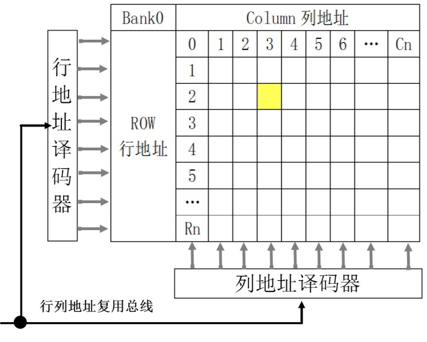
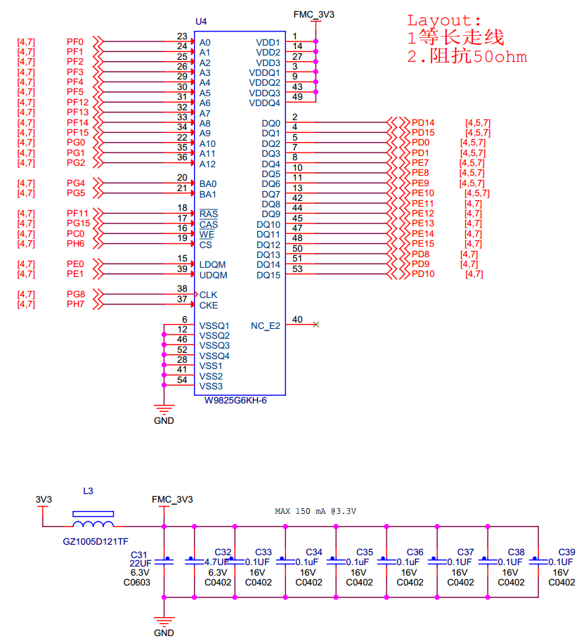

FMC—扩展外部SDRAM
-----------------

本章参考资料：《STM32H743用户手册》、《STM32H743xI规格书》、库帮助文档《STM32H753xx_User_Manual.chm》。

关于SDRAM存储器，请参考前面的“常用存储器介绍”章节，实验中SDRAM芯片的具体参数，请参考其规格书《W9812G6JN》来了解。

SDRAM控制原理
~~~~~~~~~~~~~

STM32控制器芯片内部有一定大小的SRAM及FLASH作为内存和程序存储空间，但当程序较大，内存和程序空间不足时，就需要在STM32芯片的外部扩展存储器了。

STM32H743系列芯片扩展内存时可以选择SRAM和SDRAM，由于SDRAM的“容量/价格”比较高，即使用SDRAM要比SRAM要划算得多。我们以SDRAM为例讲解如何为STM32扩展内存。

给STM32芯片扩展内存与给PC扩展内存的原理是一样的，只是PC上一般以内存条的形式扩展，内存条实质是由多个内存颗粒(即SDRAM芯片)组成的通用标准模块，
而STM32直接与SDRAM芯片连接。见 SDRAM芯片外观_，这是一种型号为W9812G6JN的SDRAM芯片内部结构框图，以它为模型进行学习。

SDRAM芯片外观

一种SDRAM芯片的内部结构框图

SDRAM信号线
^^^^^^^^^^^

图 26‑2虚线框外引出的是SDRAM芯片的控制引脚，其说明见表 26‑1。

表 26‑1 SDRAM控制引脚说明

+----------+------+-------------------------------------------------------+
| 信号线   | 类型 | 说明                                                  |
+==========+======+=======================================================+
| CLK      | I    | 同步时钟信号，所有输入信号都在CLK为上升沿的时候被采集 |
+----------+------+-------------------------------------------------------+
| CKE      | I    | 时钟使能信号，禁止时钟信号时SDRAM会启动自刷新操作     |
+----------+------+-------------------------------------------------------+
| CS#      | I    | 片选信号，低电平有效                                  |
+----------+------+-------------------------------------------------------+
| CAS#     | I    | 列地址选通，为低电平时地址线表示的是列地址            |
+----------+------+-------------------------------------------------------+
| RAS#     | I    | 行地址选通，为低电平时地址线表示的是行地址            |
+----------+------+-------------------------------------------------------+
| WE#      | I    | 写入使能，低电平有效                                  |
+----------+------+-------------------------------------------------------+
| DQM[0:1] | I    | 数据输入/输出掩码信号，表示DQ信号线的有效部分         |
+----------+------+-------------------------------------------------------+
| BA[0:1]  | I    | Bank地址输入，选择要控制的Bank                        |
+----------+------+-------------------------------------------------------+
| A[0:12]  | I    | 地址输入                                              |
+----------+------+-------------------------------------------------------+
| DQ[0:15] | I/O  | 数据输入输出信号                                      |
+----------+------+-------------------------------------------------------+

除了时钟、地址和数据线，控制SDRAM还需要很多信号配合，它们具体作用在描述时序图时进行讲解。

控制逻辑
^^^^^^^^

SDRAM内部的“控制逻辑”指挥着整个系统的运行，外部可通过CS、WE、CAS、RAS以及地址线来向控制逻辑输入命令，命令经过“命令器译码器”译码，并将控制参数保存到“模式寄存器中”，控制逻辑依此运行。

地址控制
^^^^^^^^

SDRAM包含有“A”以及“BA”两类地址线，A类地址线是行(Row)与列(Column)共用的地址总线，BA地址线是独立的用于指定SDRAM内部存储阵列号(Bank)。在命令模式下，A类地址线还用于某些命令输入参数。

SDRAM的存储阵列
^^^^^^^^^^^^^^^

要了解SDRAM的储存单元寻址以及“A”、“BA”线的具体运用，需要先熟悉它内部存储阵列的结构，见 SDRAM存储阵列模型_。

SDRAM存储阵列模型

SDRAM内部包含的存储阵列，可以把它理解成一张表格，数据就填在这张表格上。和表格查找一样，指定一个行地址和列地址，
就可以精确地找到目标单元格，这是SDRAM芯片寻址的基本原理。这样的每个单元格被称为存储单元，而这样的表则被称为存储阵列(Bank)，
目前设计的SDRAM芯片基本上内部都包含有4个这样的Bank，寻址时指定Bank号以及行地址，然后再指定列地址即可寻找到目标存储单元。
SDRAM内部具有多个Bank时的结构见
SDRAM结构图_。

SDRAM内有多个Bank时的结构图

SDRAM芯片向外部提供有独立的BA类地址线用于Bank寻址，而行与列则共用A类地址线。

SDRAM芯片的内部结构框图_ 标号中表示的就是它内部的存储阵列结构，通讯时当RAS线为低电平，则“行地址选通器”被选通，
地址线A[12:0]表示的地址会被输入到“行地址译码及锁存器”中，作为存储阵列中选定的行地址，同时地址线BA[1:0]表示的Bank也被锁存，
选中了要操作的Bank号；接着控制CAS线为低电平，“列地址选通器”被选通，地址线A[11:0]表示的地址会被锁存到“列地址译码器”中作为列地址，完成寻址过程。

数据输入输出
^^^^^^^^^^^^

若是写SDRAM内容，寻址完成后，DQ[15:0]线表示的数据经过 SDRAM芯片的内部结构框图_
标号中的输入数据寄存器，然后传输到存储器阵列中，数据被保存；数据输出过程相反。

本型号的SDRAM存储阵列的“数据宽度”是16位(即数据线的数量)，在与SDRAM进行数据通讯时，16位的数据是同步传输的，但实际应用中我们可能会以8位、16位的宽度存取数据，也就是说16位的数据线并不是所有时候都同时使用的，而且在传输低宽度数据的时候，我们不希望其它数据线表示的数据被录入。如传输8位数据的时候，我们只需要DQ[7:0]表示的数据，而DQ[15:8]数据线表示的数据必须忽略，否则会修改非目标存储空间的内容。所以数据输入输出时，还会使用DQM[1:0]线来配合，每根DQM线对应8位数据，如“DQM0(LDQM)”为低电平，“DQM1(HDQM)”为高电平时，数据线DQ[7:0]表示的数据有效，而DQ[15:8]表示的数据无效。

SDRAM的命令
^^^^^^^^^^^

控制SDRAM需要用到一系列的命令，见 SDRAM命令表_。各种信号线状态组合产生不同的控制命令。

表 26‑2 SDRAM命令表

表中的H表示高电平，L表示低电平，X表示任意电平，High-Z表示高阻态。

命令禁止
''''''''

只要CS引脚为高电平，即表示“命令禁止”(COMMAND
INHBIT)，它用于禁止SDRAM执行新的命令，但它不能停止当前正在执行的命令。

空操作
''''''

“空操作”(NO
OPERATION)，“命令禁止”的反操作，用于选中SDRAM，以便接下来发送命令。

行有效
''''''

进行存储单元寻址时，需要先选中要访问的Bank和行，使它处于激活状态。该操作通过“行有效”(ACTIVE)命令实现，
见 行有效命令时序图_，发送行有效命令时，RAS线为低电平，同时通过BA线以及A线发送Bank地址和行地址。

行有效命令时序图

列读写
''''''

行地址通过“行有效”命令确定后，就要对列地址进行寻址了。“读命令”(READ)和“写命令”(WRITE)的时序很相似，
见 读取命令时序_，通过共用的地址线A发送列地址，同时使用WE引脚表示读/写方向，WE为低电平时表示写，
高电平时表示读。数据读写时，使用DQM线表示有效的DQ数据线。

.. image:: media/image7.jpeg
   :align: center
   :alt: 读取命令时序
   :name: 读取命令时序

读取命令时序

本型号的SDRAM芯片表示列地址时仅使用A[8:0]线，而A10线用于控制是否“自动预充电”，该线为高电平时使能，低电平时关闭。

预充电
''''''

 SDRAM 的寻址具有独占性，所以在进行完读写操作后，如果要对同一个Bank 的另一行进行寻址，就要将原来有效（ACTIVE）的行关闭，重新发送行/列地址。Bank 关闭当前工作行，准备打开新行的操作就是预充电（Precharge）。

预充电可以通过独立的命令控制，也可以在每次发送读写命令的同时使用“A10”线控制自动进行预充电。实际上，预充电是一种对工作行中所有存储阵列进行数据重写，并对行地址进行复位，以准备新行的工作。

独立的预充电命令时序见
PRECHARGE命令时序_。该命令配合使用A10线控制，若A10为高电平时，所有Bank都预充电；A10为低电平时，使用BA线选择要预充电的Bank。

PRECHARGE命令时序

刷新
''''

SDRAM要不断进行刷新(Refresh)才能保留住数据，因此它是 DRAM
最重要的操作。刷新操作与预充电中重写的操作本质是一样的。

但因为预充电是对一个或所有Bank
中的工作行操作，并且不定期，而刷新则是有固定的周期，依次对所有行进行操作，以保证那些久久没被访问的存储单元数据正确。

刷新操作分为两种：“自动刷新”（Auto Refresh）与“自我刷新”(Self
Refresh)，发送命令后CKE时钟为有效时(低电平)，使用自动刷新操作，否则使用自我刷新操作。不论是何种刷新方式，都不需要外部提供行地址信息，因为这是一个内部的自动操作。

对于“自动刷新”， SDRAM
内部有一个行地址生成器（也称刷新计数器）用来自动地依次生成行地址，每收到一次命令刷新一行。在刷新过程中，所有Bank都停止工作，而每次刷新所占用的时间为N个时钟周期(视SDRAM型号而定，通常为N=9)，刷新结束之后才可进入正常的工作状态，也就是说在这N个时钟期间内，所有工作指令只能等待而无法执行。一次次地按行刷新，刷新完所有行后，将再次对第一行重新进行刷新操作，这个对同一行刷新操作的时间间隔，称为SDRAM的刷新周期，通常为64ms。显然刷新会对SDRAM的性能造成影响，但这是它的DRAM的特性决定的，也是DRAM相对于SRAM取得成本优势的同时所付出的代价。

“自我刷新”则主要用于休眠模式低功耗状态下的数据保存，也就是说即使外部控制器不工作了，SDRAM都能自己确保数据正常。在发出“自我刷新”命令后，将
CKE
置于无效状态(低电平)，就进入自我刷新模式，此时不再依靠外部时钟工作，而是根据SDRAM内部的时钟进行刷新操作。在自我刷新期间除了
CKE 之外的所有外部信号都是无效的，只有重新使 CKE
有效才能退出自我刷新模式并进入正常操作状态。

加载模式寄存器
''''''''''''''

前面提到SDRAM的控制逻辑是根据它的模式寄存器来管理整个系统的，而这个寄存器的参数就是通过“加载模式寄存器”命令(LOAD
MODE
REGISTER)来配置的。发送该命令时，使用地址线表示要存入模式寄存器的参数“OP-Code”，各个地址线表示的参数见 模式寄存器解析图_。

模式寄存器解析图

模式寄存器的各个参数介绍如下：

Burst Length
================

Burst
Length译为突发长度，下面简称BL。突发是指在同一行中相邻的存储单元连续进行数据传输的方式，连续传输所涉及到存储单元（列）的数量就是突发长度。

上文讲到的读/写操作，都是一次对一个存储单元进行寻址，如果要连续读/写就还要对当前存储单元的下一个单元进行寻址，也就是要不断的发送列地址与读/写命令（行地址不变，所以不用再对行寻址）。虽然由于读/写延迟相同可以让数据的传输在
I/O
端是连续的，但它占用了大量的内存控制资源，在数据进行连续传输时无法输入新的命令，效率很低。

为此，人们开发了突发传输技术，只要指定起始列地址与突发长度，内存就会依次地自动对后面相应数量的存储单元进行读/写操作而不再需要控制器连续地提供列地址。这样，除了第一笔数据的传输需要若干个周期外，其后每个数据只需一个周期的即可获得。其实我们在EERPOM及FLASH读写章节讲解的按页写入就是突发写入，而它们的读取过程都是突发性质的。

非突发连续读取模式：不采用突发传输而是依次单独寻址，此时可等效于
BL=1。虽然也可以让数据连续地传输，但每次都要发送列地址与命令信息，控制资源占用极大。突发连续读取模式：只要指定起始列地址与突发长度，寻址与数据的读取自动进行，而只要控制好两段突发读取命令的间隔周期(与
BL 相同)即可做到连续的突发传输。 而BL
的数值，也是不能随便设或在数据进行传输前临时决定。在初始化SDRAM调用LOAD
MODE REGISTER命令时就被固定。BL可用的选项是 1、2、4、8，常见的设定是 4
和8。若传输时实际需要数据长度小于设定的BL值，则调用“突发停止”(BURST
TERMINATE)命令结束传输。

BT
====

模式寄存器中的BT位用于设置突发模式，突发模式分为顺序(Sequential)与间隔(Interleaved)两种。在顺序方式中，操作按地址的顺序连续执行，如果是间隔模式，则操作地址是跳跃的。跳跃访问的方式比较乱，不太符合思维习惯，我们一般用顺序模式。顺序访问模式时按照
“0-1-2-3-4-5-6-7”的地址序列访问。

CASLatency
===============

模式寄存器中的CASLatency是指列地址选通延迟，简称CL。在发出读命令(命令同时包含列地址)后，需要等待几个时钟周期数据线DQ才会输出有效数据，
这之间的时钟周期就是指CL，CL一般可以设置为2或3个时钟周期，见 说明图_。

.. image:: media/image10.jpeg
   :align: center
   :alt: CL=2和CL=3的说明图
   :name: 说明图

CL=2和CL=3的说明图

CL只是针对读命令时的数据延时，在写命令是不需要这个延时的，发出写命令时可同时发送要写入的数据。

Op Mode
=============

OP Mode指Operating
Mode，SDRAM的工作模式。当它被配置为“00”的时候表示工作在正常模式，其它值是测试模式或被保留的设定。实际使用时必须配置成正常模式。

WB
===

WB用于配置写操作的突发特性，可选择使用BL设置的突发长度或非突发模式。

Reserved
==========

模式寄存器的最后三位的被保留，没有设置参数。

SDRAM的初始化流程
^^^^^^^^^^^^^^^^^

最后我们来了解SDRAM的初始化流程。SDRAM并不是上电后立即就可以开始读写数据的，它需要按步骤进行初始化，
对存储矩阵进行预充电、刷新并设置模式寄存器，见 SDRAM初始化流程_。

.. image:: media/image11.jpeg
   :align: center
   :alt: SDRAM初始化流程
   :name: SDRAM初始化流程

SDRAM初始化流程

该流程说明如下：

(1) 给SDRAM上电，并提供稳定的时钟，至少100us；

(2) 发送“空操作”(NOP)命令；

(3) 发送“预充电”(PRECHARGE)命令，控制所有Bank进行预充电，并等待t\ :sub:`RP`\ 时间，
    t\ :sub:`RP`\ 表示预充电与其它命令之间的延迟；

(4) 发送至少2个“自动刷新”(AUTO
    REFRESH)命令，每个命令后需等待t\ :sub:`RFC`\ 时间，t\ :sub:`RFC`\ 表示自动刷新时间；

(5) 发送“加载模式寄存器”(LOAD MODE REGISTER)命令，配置SDRAM的工作参数，
    并等待t\ :sub:`MRD`\ 时间，t\ :sub:`MRD`\ 表示加载模式寄存器命令与行有行或刷新命令之间的延迟；

(6) 初始化流程完毕，可以开始读写数据。

其中t\ :sub:`RP`\ 、t\ :sub:`RFC`\ 、t\ :sub:`MRD`\ 等时间参数跟具体的SDRAM有关，
可查阅其数据手册获知，STM32FMC访问时配置需要这些参数。

SDRAM的读写流程
^^^^^^^^^^^^^^^

初始化步骤完成，开始读写数据，其时序流程见 PRECHARGE的读时序_ 及 PRECHARGE命令的写时序_。

CL=2时，带AUTO PRECHARGE的读时序

.. image:: media/image13.jpeg
   :align: center
   :alt: PRECHARGE命令的写时序
   :name: PRECHARGE命令的写时序

带AUTO PRECHARGE命令的写时序

读时序和写时序的命令过程很类似，下面我们统一解说：

(1) 发送“行有效”(ACTIVE)命令，发送命令的同时包含行地址和Bank地址，
    然后等待t\ :sub:`RCD`\ 时间，t\ :sub:`RCD`\ 表示行有效命令与读/写命令之间的延迟；

(2) 发送“读/写”(READ/WRITE)命令，在发送命令的同时发送列地址，完成寻址的地址输入。对于读命令，根据模式寄存器的CL定义，
    延迟CL个时钟周期后，SDRAM的数据线DQ才输出有效数据，而写命令是没有CL延迟的，主机在发送写命令的同时就可以把要写入的数据用DQ输入到SDRAM中，
    这是读命令与写命令的时序最主要的区别。图中的读/写命令都通过地址线A10控制自动预充电，
    而SDRAM接收到带预充电要求的读/写命令后，并不会立即预充电，
    而是等待t\ :sub:`WR`\ 时间才开始，t\ :sub:`WR`\ 表示写命令与预充电之间的延迟；

(3) 执行“预充电”(auto
    precharge)命令后，需要等待t\ :sub:`RP`\ 时间，t\ :sub:`RP`\ 表示预充电与其它命令之间的延迟；

(4) 图中的标号处的t\ :sub:`RAS`\ ，表示自刷新周期，即在前一个“行有效”与
    “预充电”命令之间的时间；

(5) 发送第二次“行有效”(ACTIVE)命令准备读写下一个数据，在图中的标号处的t\ :sub:`RC`\ ，表示两个行有效命令或两个刷新命令之间的延迟。

其中t\ :sub:`RCD`\ 、t\ :sub:`WR`\ 、t\ :sub:`RP`\ 、
t\ :sub:`RAS`\ 以及t\ :sub:`RC`\ 等时间参数跟具体的SDRAM有关，
可查阅其数据手册获知，STM32
FMC访问时配置需要这些参数。

FMC简介
~~~~~~~

STM32H743使用FMC外设来管理扩展的存储器，FMC是Flexible Memory
Controller的缩写，译为可变存储控制器。它可以用于驱动包括SRAM、SDRAM、NOR
FLASH以及NAND
FLSAH类型的存储器。在其它系列的STM32控制器中，只有FSMC控制器(Flexible
Static Memory
Controller)，译为可变静态存储控制器，所以它们不能驱动SDRAM这样的动态存储器，因为驱动SDRAM时需要定时刷新，STM32H743的FMC外设才支持该功能，且只支持普通的SDRAM，不支持DDR类型的SDRAM。我们只讲述FMC的SDRAM控制功能。

FMC框图剖析
~~~~~~~~~~~

STM32的FMC外设内部结构见 FMC控制器框图_。

FMC控制器框图

通讯引脚
^^^^^^^^^^

在框图的右侧是FMC外设相关的控制引脚，由于控制不同类型存储器的时候会有一些不同的引脚，看起来有非常多，其中地址线FMC_A和数据线FMC_D是所有控制器都共用的。这些FMC引脚具体对应的GPIO端口及引脚号可在《STM32H743xI规格书》中搜索查找到，不在此列出。针对SDRAM控制器，我们是整理出以下的FMC与SDRAM引脚对照表
26‑3。

表 26‑3 FMC中的SDRAM控制信号线

+----------------+-----------------+-----------------------------------+
| FMC引脚名称    | 对应SDRAM引脚名 | 说明                              |
+================+=================+===================================+
| FMC_NBL[3:0]   | DQM[3:0]        | 数据掩码信号                      |
+----------------+-----------------+-----------------------------------+
| FMC_A[12:0]    | A[12:0]         | 行/列地址线                       |
+----------------+-----------------+-----------------------------------+
| FMC_A[15:14]   | BA[1:0]         | Bank地址线                        |
+----------------+-----------------+-----------------------------------+
| FMC_D[31:0]    | DQ[31:0]        | 数据线                            |
+----------------+-----------------+-----------------------------------+
| FMC_SDCLK      | CLK             | 同步时钟信号                      |
+----------------+-----------------+-----------------------------------+
| FMC_SDNWE      | WE#             | 写入使能                          |
+----------------+-----------------+-----------------------------------+
| FMC_SDCKE[1:0] | CKE             | SDCKE0：SDRAM 存储区域 1 时钟使能 |
|                |                 |                                   |
|                |                 | SDCKE1：SDRAM 存储区域 2 时钟使能 |
+----------------+-----------------+-----------------------------------+
| FMC_SDNE[1:0]  | --              | SDNE0：SDRAM 存储区域 1 芯片使能  |
|                |                 |                                   |
|                |                 | SDNE1：SDRAM 存储区域 2 芯片使能  |
+----------------+-----------------+-----------------------------------+
| FMC_NRAS       | RAS#            | 行地址选通信号                    |
+----------------+-----------------+-----------------------------------+
| FMC_NCAS       | CAS#            | 列地址选通信号                    |
+----------------+-----------------+-----------------------------------+

其中比较特殊的是FMC_A[15:14]引脚用作Bank的寻址线；而FMC_SDCKE线和FMC_SDNE都各有2条，FMC_SDCKE用于控制SDRAM的时钟使能，
FMC_SDNE用于控制SDRAM芯片的片选使能。它们用于控制STM32使用不同的存储区域驱动SDRAM，使用编号为0的信号线组会使用STM32的存储器区域1，
使用编号为1的信号线组会使用存储器区域2。使用不同存储区域时，
STM32访问SDRAM的地址不一样，具体将在“\ `FMC的地址映射 <#_FMC的地址映射>`__\ ”小节讲解。

存储器控制器
^^^^^^^^^^^^^^^^^

上面不同类型的引脚是连接到FMC内部对应的存储控制器中的。NOR/PSRAM/SRAM设备使用相同的控制器，NAND/PC卡设备使用相同的控制器，而SDRAM存储器使用独立的控制器。不同的控制器有专用的寄存器用于配置其工作模式。

控制SDRAM的有FMC_SDCR1/FMC_SDCR2控制寄存器、FMC_SDTR1/FMC_SDTR2时序寄存器、FMC_SDCMR命令模式寄存器以及FMC_SDRTR刷新定时器寄存器。其中控制寄存器及时序寄存器各有2个，分别对应于SDRAM存储区域1和存储区域2的配置。

FMC_SDCR控制寄存器可配置SDCLK的同步时钟频率、突发读使能、写保护、CAS延迟、行列地址位数以及数据总线宽度等。

FMC_SDTR时序寄存器用于配置SDRAM访问时的各种时间延迟，如TRP行预充电延迟、TMRD加载模式寄存器激活延迟等。

FMC_SDCMR命令模式寄存器用于存储要发送到SDRAM模式寄存器的配置，以及要向SDRAM芯片发送的命令。

FMC_SDRTR用于配置SDRAM的自动刷新周期。

时钟控制逻辑
^^^^^^^^^^^^^^^^

FMC外设挂载在AHB3总线上，时钟信号来自于HCLK(默认200MHz)，控制器的时钟输出就是可以由它分频得到，或者选择HCLK3、PLL1Q、PLL2R作为时钟输出的来源。可以通过配置RCC_D1CCIPR来进行选择，默认选择HCLK3。SDRAM控制器的FMC_SDCLK引脚输出的时钟，是用于与SDRAM芯片进行同步通讯，它的时钟频率可通过FMC_SDCR1寄存器的SDCLK位配置，可以配置为时钟来源的1/2或1/3。

FMC的地址映射
~~~~~~~~~~~~~

FMC连接好外部的存储器并初始化后，就可以直接通过访问地址来读写数据，这种地址访问与I2C
EEPROM、SPI
FLASH的不一样，后两种方式都需要控制I2C或SPI总线给存储器发送地址，
然后获取数据；在程序里，这个地址和数据都需要分开使用不同的变量存储，
并且访问时还需要使用代码控制发送读写命令。而使用FMC外接存储器时，
其存储单元是映射到STM32的内部寻址空间的；在程序里，
定义一个指向这些地址的指针，然后就可以通过指针直接修改该存储单元的内容，
FMC外设会自动完成数据访问过程，读写命令之类的操作不需要程序控制。FMC的地址映射见 FMC的地址映射_。

FMC的地址映射

图中左侧的是Cortex-M7内核的存储空间分配，右侧是STM32
FMC外设的地址映射。可以看到FMC的NOR/PSRAM/SRAM/NAND
FLASH以及PC卡的地址都在External
RAM地址空间内，而SDRAM的地址是分配到External
device区域的。正是因为存在这样的地址映射，使得访问FMC控制的存储器时，就跟访问STM32的片上外设寄存器一样(片上外设的地址映射即图中左侧的“Peripheral”区域)。

SDRAM的存储区域
^^^^^^^^^^^^^^^^^^

FMC把SDRAM的存储区域分成了Bank1和Bank2两块，这里的Bank与SDRAM芯片内部的Bank是不一样的概念，只是FMC的地址区域划分而已。每个Bank有不一样的起始地址，且有独立的FMC_SDCR控制寄存器和FMC_SDTR时序寄存器，还有独立的FMC_SDCKE时钟使能信号线和FMC_SDCLK信号线。FMC_SDCKE0和FMC_SDCLK0对应的存储区域1的地址范围是0xC000
0000-0xCFFF
FFFF，而FMC_SDCKE1和FMC_SDCLK1对应的存储区域2的地址范围是0xD000 0000-
0xDFFF
FFFF。当程序里控制内核访问这些地址的存储空间时，FMC外设会即会产生对应的时序，对它外接的SDRAM芯片进行读写。

External RAM 与External device的区别
^^^^^^^^^^^^^^^^^^^^^^^^^^^^^^^^^^^^^^^^^^

比较遗憾的是FMC给SDRAM分配的区域不在External
RAM区，这个区域可以直接执行代码，而SDRAM所在的External
device区却不支持这个功能。这里说的可直接执行代码的特性就是在“常用存储器”章节介绍的XIP(eXecute
In
Place)特性，即存储器上若存储了代码，CPU可直接访问代码执行，无需缓存到其它设备上再运行；而且XIP特性还对存储器的种类有要求，SRAM/SDRAM及NOR
Flash都支持这种特性，而NAND
FLASH及PC卡是不支持XIP的。结合存储器的特性和STM32
FMC存储器种类的地址分配，就发现它的地址规划不合理了，NAND
FLASH和PC卡这些不支持XIP的存储器却占据了External
RAM的空间，而支持XIP的SDRAM存储器的空间却被分配到了Extern
device区。为了解决这个问题，通过配置“SYSCFG_MEMRMP”寄存器的“SWP_FMC”寄存器位可用于交换SDRAM与NAND/PC卡的地址映射，使得存储在SDRAM中的代码能被执行，只是由于SDRAM的最高同步时钟是108MHz，代码的执行速度会受影响。

本章主要讲解当STM32的片内SRAM不够用时使用SDRAM扩展内存，但假如程序太大，它的程序空间FLASH不够用怎么办呢？首先是裁剪代码，目前STM32H743系列芯片内部FLASH空间最高可达2MB，实际应用中只要我们把代码中的图片、字模等占据大空间的内容放到外部存储器中，纯粹的代码很难达到2MB。如果还不够用，非要扩展程序空间的话，一种方法是使用FMC扩展NOR
FLASH，把程序存储到NOR上，程序代码能够直接在NOR
FLASH上执行。另一种方法是把程序存储在其它外部存储器，如SD卡，需要时把存储在SD卡上的代码加载到SRAM或SDRAM上，再在RAM上执行代码。

如果SDRAM不是用于存储可执行代码，只是用来保存数据的话，在External
RAM或Exteranl device区域都没有区别，不需要与NAND的映射地址交换。

SDRAM时序结构体
~~~~~~~~~~~~~~~

控制FMC使用SDRAM存储器时主要是配置时序寄存器以及控制寄存器，利用ST32中的HAL库的SDRAM时序结构体以及初始化结构体可以很方便地写入参数。

SDRAM时序结构体的成员见代码清单。

代码清单 SDRAM时序结构体FMC_SDRAM_TimingTypeDef

.. code-block:: c

    /* @brief  控制SDRAM的时序参数，这些参数的单位都是“周期”
    *         各个参数的值可设置为1-16个周期。           */
    typedef struct
    {
        uint32_t LoadToActiveDelay;    /*TMRD:加载模式寄存器命令后的延迟*/
        uint32_t ExitSelfRefreshDelay; /*TXSR:自刷新命令后的延迟 */
        uint32_t SelfRefreshTime;       /*TRAS:自刷新时间*/
        uint32_t RowCycleDelay;         /*TRC:行循环延迟*/
        uint32_t WriteRecoveryTime;    /*TWR:恢复延迟 */
        uint32_t RPDelay;                /*TRP:行预充电延迟*/
        uint32_t RCDDelay;               /*TRCD:行到列延迟*/
    } FMC_SDRAM_TimingTypeDef;

这个结构体成员定义的都是SDRAM发送各种命令后必须的延迟，它的配置对应到FMC_SDTR中的寄存器位。所有成员参数值的单位是周期，
参数值大小都可设置成“1-16”。关于这些延时时间的定义可以看“\ `SDRAM初始化流程 <#_SDRAM的初始化流程>`__\ ”和“\ `SDRAM读写流程 <#_SDRAM的读写流程>`__\ ”小节的时序图了解。具体参数值根据SDRAM芯片的手册说明来配置。各成员介绍如下：

(1) LoadToActiveDelay

    本成员设置TMRD延迟(Load Mode Register to
    Active)，即发送加载模式寄存器命令后要等待的时间，过了这段时间才可以发送行有效或刷新命令。

(2) ExitSelfRefreshDelay

    本成员设置退出TXSR延迟(Exit Self-refresh
    delay)，即退出自我刷新命令后要等待的时间，过了这段时间才可以发送行有效命令。

(3) SelfRefreshTime

    本成员设置自我刷新时间TRAS，即发送行有效命令后要等待的时间，过了这段时间才执行预充电命令。

(4) RowCycleDelay

    本成员设置TRC延迟(Row cycle
    delay)，即两个行有效命令之间的延迟，以及两个相邻刷新命令之间的延迟

(5) WriteRecoveryTime

    本成员设置TWR延迟(Recovery
    delay)，即写命令和预充电命令之间的延迟，等待这段时间后才开始执行预充电命令。

(6) RPDelay

本成员设置TRP延迟(Row precharge
delay)，即预充电命令与其它命令之间的延迟。

(7) FMC_RCDDelay

本成员设置TRCD延迟(Row to column
delay)，即行有效命令到列读写命令之间的延迟。

SDRAM初始化结构体
~~~~~~~~~~~~~~~~~

FMC的SDRAM初始化结构体见代码清单。

SDRAM初始化结构体FMC_SDRAMInitTypeDef

.. code-block:: c

    /* @brief  FMC SDRAM 初始化结构体类型定义 */
    typedef struct
    {
        uint32_t Bank;                   /*选择FMC的SDRAM存储区域*/
        uint32_t ColumnBitsNumber;     /*定义SDRAM的列地址宽度 */
        uint32_t RowBitsNumber;         /*定义SDRAM的行地址宽度 */
        uint32_t MemoryDataWidth;    /*定义SDRAM的数据宽度 */
        uint32_t InternalBankNumber;   /*定义SDRAM内部的Bank数目 */
        uint32_t CASLatency;             /*定义CASLatency的时钟个数*/
        uint32_t WriteProtection;       /*定义是否使能写保护模式 */
        uint32_t SDClockPeriod;         /*配置同步时钟SDCLK的参数*/
        uint32_t ReadBurst;              /*是否使能突发读模式*/
        uint32_t ReadPipeDelay;          /*定义在CAS个延迟后再等待多
                                        少个HCLK时钟才读取数据 */
    } FMC_SDRAM_InitTypeDef;

这个结构体成员的配置都对应到FMC_SDCR中的寄存器位。各个成员意义在前面的小节已有具体讲解，其可选参数介绍如下，括号中的是STM32
HAL库定义的宏：

(1) Bank

    本成员用于选择FMC映射的SDRAM存储区域，可选择存储区域1或2
    (FMC_SDRAM_BANK1/FMC_SDRAM_BANK2)。

(2) ColumnBitsNumber

    本成员用于设置要控制的SDRAM的列地址宽度，可选择8-11位(FMC_SDRAM_COLUMN_BITS_NUM_8/9/10/11b)。

(3) RowBitsNumber

    本成员用于设置要控制的SDRAM的行地址宽度，可选择设置成11-13位(FMC_SDRAM_ROW_BITS_NUM_11/12/13b)。

(4) MemoryDataWidth

    本成员用于设置要控制的SDRAM的数据宽度，可选择设置成8、16或32位(FMC_SDRAM_MEM_BUS_WIDTH_8/16/32b)。

(5) InternalBankNumber

    本成员用于设置要控制的SDRAM的内部Bank数目，可选择设置成2或4个Bank数目(FMC_SDRAM_INTERN_BANKS_NUM_2/4)，请注意区分这个结构体成员与Bank的区别。

(6) CASLatency

    本成员用于设置CASLatency即CL的时钟数目，可选择设置为1、2或3个时钟周期(FMC_SDRAM_CAS_LATENCY_1/2/3)。

(7) WriteProtection

    本成员用于设置是否使能写保护模式，如果使能了写保护则不能向SDRAM写入数据，正常使用都是禁止写保护的。

(8) ClockPeriod

    本成员用于设置FMC与外部SDRAM通讯时的同步时钟参数，可以设置成STM32的HCLK时钟频率的1/2、1/3或禁止输出时钟(FMC_SDRAM_CLOCK_PERIOD_2/3或FMC_SDRAM_CLOCK_DISABLE)。

(9) ReadBurst

    本成员用于设置是否使能突发读取模式，禁止时等效于BL=1，使能时BL的值等于模式寄存器中的配置。

(10) ReadPipeDelay

    本成员用于配置在CASLatency个时钟周期后，再等待多少个HCLK时钟周期才进行数据采样，在确保正确的前提下，这个值设置为越短越好，可选择设置的参数值为0、1或2个HCLK时钟周期(FMC_SDRAM_RPIPE_DELAY_0/1/2)。

配置完SDRAM初始化结构体后，调用FMC_SDRAMInit函数把这些配置写入到FMC的SDRAM控制寄存器及时序寄存器，实现FMC的初始化。

SDRAM命令结构体
~~~~~~~~~~~~~~~

控制SDRAM时需要各种命令，通过向FMC的命令模式寄存器FMC_SDCMR写入控制参数，即可控制FMC对外发送命令，为了方便使用，STM32
HAL库也把它封装成了结构体，见代码清单。

SDRAM命令结构体

.. code-block:: c

    typedef struct
    {
        uint32_t CommandMode;            /*要发送的命令 */
        uint32_t CommandTarget;          /*目标存储器区域 */
        uint32_t AutoRefreshNumber;      /*若发送的是自动刷新命令，
                                            此处为发送的刷新次数，其它命令时无效 */
        uint32_t ModeRegisterDefinition; /*若发送的是加载模式寄存器命令，
                                            此处为要写入SDRAM模式寄存器的参数 */
    } FMC_SDRAM_CommandTypeDef;

命令结构体中的各个成员介绍如下：

(1) CommandMode

本成员用于配置将要发送的命令，它可以被赋值为表
26‑4中的宏，这些宏代表了不同命令;

    表 26‑4 FMC可输出的SDRAM控制命令

+--------------------------------+----------------------+
| 宏                             | 命令说明             |
+================================+======================+
| FMC_SDRAM_CMD_NORMAL_MODE      | 正常模式命令         |
+--------------------------------+----------------------+
| FMC_SDRAM_CMD_CLK_ENABLE       | 使能CLK命令          |
+--------------------------------+----------------------+
| FMC_SDRAM_CMD_PALL             | 对所有Bank预充电命令 |
+--------------------------------+----------------------+
| FMC_SDRAM_CMD_AUTOREFRESH_MODE | 自动刷新命令         |
+--------------------------------+----------------------+
| FMC_SDRAM_CMD_LOAD_MODE        | 加载模式寄存器命令   |
+--------------------------------+----------------------+
| FMC_SDRAM_CMD_SELFREFRESH_MODE | 自我刷新命令         |
+--------------------------------+----------------------+
| FMC_SDRAM_CMD_POWERDOWN_MODE   | 掉电命令             |
+--------------------------------+----------------------+

(2) CommandTarget

    本成员用于选择要控制的FMC存储区域，可选择存储区域1或2或1和2(FMC_SDRAM_CMD_TARGET_BANK1/2，FMC_SDRAM_CMD_TARGET_BANK1_2);

(3) AutoRefreshNumber

    有时需要连续发送多个 “自动刷新”(Auto
    Refresh)命令时，配置本成员即可控制它发送多少次，可输入参数值为1-16，若发送的是其它命令，本参数值无效。如CommandMode成员被配置为宏FMC_SDRAM_CMD_AUTOREFRESH_MODE，而AutoRefreshNumber被设置为2时，FMC就会控制发送2次自动刷新命令。

(4) ModeRegisterDefinition

    当向SDRAM发送加载模式寄存器命令时，这个结构体成员的值将通过地址线发送到SDRAM的模式寄存器中，这个成员值长度为13位，各个位一一对应SDRAM的模式寄存器。

配置完这些结构体成员，调用库函数HAL_SDRAM_SendCommand即可把这些参数写入到FMC_SDCMR寄存器中，然后FMC外设就会发送相应的命令了。

FMC—扩展外部SDRAM实验
~~~~~~~~~~~~~~~~~~~~~

本小节以型号为“W9825G6KH”的SDRAM芯片为STM32扩展内存。它的行地址宽度为12位，列地址宽度为8位，内部含有4个Bank，数据线宽度为16位，容量大小为32MB。

学习本小节内容时，请打开配套的“FMC—读写SDRAM”工程配合阅读。本实验仅讲解基本的SDRAM驱动，不涉及内存管理的内容，在本书的《MDK编译过程及文件类型全解》章节将会讲解使用更简单的方法从SDRAM中分配变量，以及使用C语言标准库的malloc函数来分配SDRAM的空间。

硬件设计
^^^^^^^^

SDRAM硬件连接图

SDRAM与STM32相连的引脚非常多，主要是地址线和数据线，这些具有特定FMC功能的GPIO引脚可查询《STM32H743xI规格书》中的说明来了解。

关于该SDRAM芯片的更多信息，请参考其规格书《W9825G6KH》了解。若您使用的实验板FLASH的型号或控制引脚不一样，可在我们工程的基础上修改，程序的控制原理相同。

软件设计
^^^^^^^^

为了使工程更加有条理，我们把SDRAM初始化相关的代码独立分开存储，方便以后移植。在“工程模板”之上新建“bsp_sdram.c”及“bsp_sdram.h”文件，这些文件也可根据您的喜好命名，它们不属于STM32
HAL库的内容，是由我们自己根据应用需要编写的。

编程要点
''''''''

(1) 初始化通讯使用的目标引脚及端口时钟；

(2) 使能FMC外设的时钟；

(3) 配置FMC SDRAM的时序、工作模式；

(4) 根据SDRAM的初始化流程编写初始化函数；

(5) 建立机制访问外部SDRAM存储器；

(6) 编写测试程序，对读写数据进行校验。

代码分析
''''''''

FMC硬件相关宏定义
========================

我们把FMC SDRAM硬件相关的配置都以宏的形式定义到
“bsp_sdram.h”文件中，见代码清单。

代码清单 SDRAM硬件配置相关的宏(省略了大部分数据线)

.. code-block:: c

    /*地址信号线*/
    #define FMC_A0_GPIO_PORT         GPIOF
    #define FMC_A0_GPIO_CLK()        __GPIOF_CLK_ENABLE()
    #define FMC_A0_GPIO_PIN          GPIO_PIN_0
    /*省略一些引脚*/
    #define FMC_A11_GPIO_PORT        GPIOG
    #define FMC_A11_GPIO_CLK()       __GPIOG_CLK_ENABLE()
    #define FMC_A11_GPIO_PIN         GPIO_PIN_2

    /*数据信号线*/
    #define FMC_D0_GPIO_PORT         GPIOD
    #define FMC_D0_GPIO_CLK()        __GPIOD_CLK_ENABLE()
    #define FMC_D0_GPIO_PIN          GPIO_PIN_14

    /*省略一些引脚*/
    #define FMC_D15_GPIO_PORT        GPIOD
    #define FMC_D15_GPIO_CLK()       __GPIOD_CLK_ENABLE()
    #define FMC_D15_GPIO_PIN         GPIO_PIN_10

    /*控制信号线*/
    #define FMC_CS_GPIO_PORT         GPIOH
    #define FMC_CS_GPIO_CLK()        __GPIOH_CLK_ENABLE()
    #define FMC_CS_GPIO_PIN          GPIO_PIN_6

    #define FMC_BA0_GPIO_PORT        GPIOG
    #define FMC_BA0_GPIO_CLK()       __GPIOG_CLK_ENABLE()
    #define FMC_BA0_GPIO_PIN         GPIO_PIN_4

    #define FMC_BA1_GPIO_PORT        GPIOG
    #define FMC_BA1_GPIO_CLK()       __GPIOG_CLK_ENABLE()
    #define FMC_BA1_GPIO_PIN         GPIO_PIN_5

    #define FMC_WE_GPIO_PORT         GPIOC
    #define FMC_WE_GPIO_CLK()        __GPIOC_CLK_ENABLE()
    #define FMC_WE_GPIO_PIN          GPIO_PIN_0

    #define FMC_RAS_GPIO_PORT        GPIOF
    #define FMC_RAS_GPIO_CLK()       __GPIOF_CLK_ENABLE()
    #define FMC_RAS_GPIO_PIN         GPIO_PIN_11

    #define FMC_CAS_GPIO_PORT        GPIOG
    #define FMC_CAS_GPIO_CLK()       __GPIOG_CLK_ENABLE()
    #define FMC_CAS_GPIO_PIN         GPIO_PIN_15

    #define FMC_CLK_GPIO_PORT        GPIOG
    #define FMC_CLK_GPIO_CLK()       __GPIOG_CLK_ENABLE()
    #define FMC_CLK_GPIO_PIN         GPIO_PIN_8

    #define FMC_CKE_GPIO_PORT        GPIOH
    #define FMC_CKE_GPIO_CLK()       __GPIOH_CLK_ENABLE()
    #define FMC_CKE_GPIO_PIN         GPIO_PIN_7

    /*UDQM LDQM*/
    #define FMC_UDQM_GPIO_PORT        GPIOE
    #define FMC_UDQM_GPIO_CLK()       __GPIOE_CLK_ENABLE()
    #define FMC_UDQM_GPIO_PIN         GPIO_PIN_1

    #define FMC_LDQM_GPIO_PORT        GPIOE
    #define FMC_LDQM_GPIO_CLK()       __GPIOE_CLK_ENABLE()
    #define FMC_LDQM_GPIO_PIN         GPIO_PIN_0

以上代码根据硬件的连接，把与SDRAM通讯使用的引脚号、引脚源以及复用功能映射都以宏封装起来。其中FMC_CKE和FMC_CLK引脚对应的是FMC的存储区域2，所以后面我们对SDRAM的寻址空间也是要指向存储区域2的。

初始化FMC的 GPIO
====================

利用上面的宏，编写FMC的GPIO引脚初始化函数，见代码清单。

代码清单 FMC的GPIO初始化函数(省略了大部分数据线)

.. code-block:: c

    /**
    * @brief  初始化控制SDRAM的IO
    * @param  无
    * @retval 无
    */
    static void SDRAM_GPIO_Config(void)
    {
        GPIO_InitTypeDef GPIO_InitStructure;

        /*此处省略大量地址线、数据线以及控制信号线，
        它们的时钟配置都相同，具体请查看工程中的代码*/
        /* 使能SDRAM相关的GPIO时钟 */
        /*地址信号线*/
        FMC_A0_GPIO_CLK();FMC_A1_GPIO_CLK(); FMC_A2_GPIO_CLK();
    /*数据信号线*/  /*控制信号线*/
        FMC_UDQM_GPIO_CLK();FMC_LDQM_GPIO_CLK();

        /*--所有GPIO的配置都相同，此处省略大量引脚初始化，具体请查看工程中的代码*/
        /* 通用 GPIO 配置 */
        GPIO_InitStructure.Mode = GPIO_MODE_AF_PP;//配置为复用功能
        GPIO_InitStructure.Pull = GPIO_PULLUP;
        GPIO_InitStructure.Speed = GPIO_SPEED_HIGH;
        GPIO_InitStructure.Alternate = GPIO_AF12_FMC;

        /*A行列地址信号线 针对引脚配置*/
        GPIO_InitStructure.Pin = FMC_A0_GPIO_PIN;
        HAL_GPIO_Init(FMC_A0_GPIO_PORT, &GPIO_InitStructure);

        /*...*/
        /*DQ数据信号线 针对引脚配置*/
        GPIO_InitStructure.Pin = FMC_D0_GPIO_PIN;
        HAL_GPIO_Init(FMC_D0_GPIO_PORT, &GPIO_InitStructure);

        /*...*/
        /*控制信号线*/
        GPIO_InitStructure.Pin = FMC_CS_GPIO_PIN;
        HAL_GPIO_Init(FMC_CS_GPIO_PORT, &GPIO_InitStructure);

        /*...*/
    }

与所有使用到GPIO的外设一样，都要先把使用到的GPIO引脚模式初始化，以上代码把FMC
SDRAM的所有信号线全都初始化为FMC复用功能，所有引脚配置都是一样的。

配置FMC的模式
==================

接下来需要配置FMC
SDRAM的工作模式，这个函数的主体是根据硬件连接的SDRAM特性，对时序结构体以及初始化结构体进行赋值。见以下代码。

代码清单 配置FMC的模式

.. code-block:: c

    void SDRAM_Init(void)
    {

        FMC_SDRAM_TimingTypeDef SdramTiming;
        RCC_PeriphCLKInitTypeDef RCC_PeriphClkInit;

        /* 配置FMC接口相关的 GPIO*/
        SDRAM_GPIO_Config();

        /* 配置SDRAM时钟源*/
        RCC_PeriphClkInit.PeriphClockSelection = RCC_PERIPHCLK_FMC;
        RCC_PeriphClkInit.PLL2.PLL2M = 5;
        RCC_PeriphClkInit.PLL2.PLL2N = 156;
        RCC_PeriphClkInit.PLL2.PLL2P = 2;
        RCC_PeriphClkInit.PLL2.PLL2Q = 2;
        RCC_PeriphClkInit.PLL2.PLL2R = 3;
        RCC_PeriphClkInit.PLL2.PLL2RGE = RCC_PLL2VCIRANGE_2;
        RCC_PeriphClkInit.PLL2.PLL2VCOSEL = RCC_PLL2VCOWIDE;
        RCC_PeriphClkInit.PLL2.PLL2FRACN = 0;
        RCC_PeriphClkInit.FmcClockSelection = RCC_FMCCLKSOURCE_PLL2;
        if (HAL_RCCEx_PeriphCLKConfig(&RCC_PeriphClkInit) != HAL_OK) {
            while (1);
        }
        /* 使能 FMC 时钟 */
        __FMC_CLK_ENABLE();

        /*执行SDRAM1的内存初始化序列 */
        hsdram1.Instance = FMC_SDRAM_DEVICE;
        /* hsdram1结构体初始化*/
        hsdram1.Init.SDBank = FMC_SDRAM_BANK2;
        hsdram1.Init.ColumnBitsNumber = FMC_SDRAM_COLUMN_BITS_NUM_9;//SDRAM列数
        hsdram1.Init.RowBitsNumber = FMC_SDRAM_ROW_BITS_NUM_12;//SDRAM行数
        hsdram1.Init.MemoryDataWidth = FMC_SDRAM_MEM_BUS_WIDTH_16;//总线数据宽度为16位
        hsdram1.Init.InternalBankNumber = FMC_SDRAM_INTERN_BANKS_NUM_4;//4个扇区
        hsdram1.Init.CASLatency = FMC_SDRAM_CAS_LATENCY_3;//列地址选通信延时
        hsdram1.Init.WriteProtection = FMC_SDRAM_WRITE_PROTECTION_DISABLE;//禁止写保护
        hsdram1.Init.SDClockPeriod = FMC_SDRAM_CLOCK_PERIOD_2;//SDRAM时钟130MHz
        hsdram1.Init.ReadBurst = FMC_SDRAM_RBURST_ENABLE;     //使能突发传输模式
        hsdram1.Init.ReadPipeDelay = FMC_SDRAM_RPIPE_DELAY_1; //读通道延时
        /* SDRAM时序 */
        SdramTiming.LoadToActiveDelay = 2;
                                        //加载模式寄存器命令与行有效或刷新命令之间的延迟
        SdramTiming.ExitSelfRefreshDelay = 8;//退出自我刷新到行有效命令之间的延迟
        SdramTiming.SelfRefreshTime = 5;//行有效与预充电命令之间的延迟
        SdramTiming.RowCycleDelay = 8;//两个刷新命令或两个行有效命令之间的延迟
        SdramTiming.WriteRecoveryTime = 2;//写入命令到预充电命令之间的延迟
        SdramTiming.RPDelay = 2;//预充电与行有效命令之间的延迟
        SdramTiming.RCDDelay = 2;//行有效与列读写命令之间的延迟

        HAL_SDRAM_Init(&hsdram1, &SdramTiming);
        /* FMC SDRAM 设备时序初始化 */
        SDRAM_InitSequence();
    }

这个函数的执行流程如下：

(1) 初始化GPIO引脚以及FMC时钟

    函数开头调用了前面定义的SDRAM_GPIO_Config函数对FMC用到的GPIO进行初始化，使用库函数HAL_RCCEx_PeriphCLKConfig配置FMC时钟输出的来源为PLL2R，频率为130MHz。调用__FMC_CLK_ENABLE函数使能FMC外设时钟。

(2) 时序结构体赋值

接下来对时序结构体hsdram1和SdramTiming赋值。在前面我们了解到时序结构体各个成员值的单位是同步时钟SDCLK的周期数，而根据我们使用的SDRAM芯片，可查询得它对这些时序要求，见表
26‑5。

    表 26‑5 SDRAM的延时参数(摘自《W9812G6JN》规格书)

+----------+------------------------------------------------+--------+-------+
| 时间参数 |                      说明                      | 最小值 | 单位  |
+==========+================================================+========+=======+
| trc      | 两个刷新命令或两个行有效命令之间的延迟         | 60     | ns    |
+----------+------------------------------------------------+--------+-------+
| tras     | 行有效与预充电命令之间的延迟                   | 42     | ns    |
+----------+------------------------------------------------+--------+-------+
| trp      | 预充电与行有效命令之间的延迟                   | 15     | ns    |
+----------+------------------------------------------------+--------+-------+
| trcd     | 行有效与列读写命令之间的延迟                   | 15     | ns    |
+----------+------------------------------------------------+--------+-------+
| twr      | 写入命令到预充电命令之间的延迟                 | 2      | cycle |
+----------+------------------------------------------------+--------+-------+
| txsr     | 退出自我刷新到行有效命令之间的延迟             | 72     | ns    |
+----------+------------------------------------------------+--------+-------+
| tmrd     | 加载模式寄存器命令与行有效或刷新命令之间的延迟 | 2      | cycle |
+----------+------------------------------------------------+--------+-------+

部分时间参数以ns为单位，因此我们需要进行单位转换，而以SDCLK时钟周期数(cycle)为单位的时间参数，直接赋值到时序结构体成员里即可。

由于我们配置FMC输出的SDCLK时钟频率为HCLK的1/2(在后面的程序里配置的)，即F\ :sub:`SDCLK`\ =130MHz，
可得1个SDCLK时钟周期长度为T\ :sub:`SDCLK`\ =1/F\ :sub:`SDCLK`
=7.69ns，然后设置各个成员的时候，只要保证时间大于以上SDRAM延时参数表的要求即可。如trc要求大于60ns，而7.69ns
x
8=64.52ns，所以FMC_RowCycleDelay(TRC)成员值被设置为8个时钟周期，依葫芦画瓢完成时序参数的设置。

(3) 配置FMC初始化结构体

函数接下来对FMC
SDRAM的初始化结构体赋值。包括行列地址线宽度、数据线宽度、SDRAM内部Bank数量以及CL长度，这些都是根据外接的SDRAM的特性设置的，其中CL长度要与后面初始化流程中给SDRAM模式寄存器中的赋值一致。

-  设置存储区域

    Bank成员设置FMC的SDRAM存储区域映射选择为FMC_SDRAM_BANK2，这是由于我们的SDRAM硬件连接到FMC_CKE1和FMC_CLK1，所以对应到存储区域2；

-  行地址、列地址、数据线宽度及内部Bank数量

    这些结构体成员都是根据SDRAM芯片的特性配置的，行地址宽度为9位，列地址宽度为13位，数据线宽度为16位，SDRAM内部有4个Bank；

-  CL长度

    CL的长度这里被设置为2个同步时钟周期，它需要与后面SDRAM模式寄存器中的配置一样；

-  写保护

    WriteProtection用于设置写保护，如果使能了这个功能是无法向SDRAM写入数据的，所以我们关闭这个功能；

-  同步时钟参数

    SDClockPeriod成员被设置为FMC_SDRAM_CLOCK_PERIOD_2
    ，所以同步时钟的频率就被设置为HCLK的1/2了；

-  突发读模式及读延迟

    为了加快读取速度，我们使能突发读功能，且读延迟周期为0；

-  时序参数

    最后向SdramTiming赋值为前面的时序结构体，包含了我们设定的SDRAM时间参数。

-  赋值完成后调用库函数HAL_SDRAM_Init把初始化结构体配置的各种参数写入到FMC_SDCR控制寄存器及FMC_SDTR时序寄存器中。
   函数的最后调用SDRAM_InitSequence函数实现执行SDRAM的上电初始化时序。

实现SDRAM的初始化时序
========================

在上面配置完成STM32的FMC外设参数后，在读写SDRAM前还需要执行前面介绍的SDRAM上电初始化时序，
它就是由SDRAM_InitSequence函数实现的，见代码清单

代码清单 SDRAM上电初始化时序

.. code-block:: c

    static void SDRAM_InitSequence(void)
    {
        uint32_t tmpr = 0;

        /* Step 1 ----------------------------------------------------*/
        /* 配置命令：开启提供给SDRAM的时钟 */
        Command.CommandMode = FMC_SDRAM_CMD_CLK_ENABLE;
        Command.CommandTarget = FMC_COMMAND_TARGET_BANK;
        Command.AutoRefreshNumber = 1;
        Command.ModeRegisterDefinition = 0;
        /* 发送配置命令 */
        HAL_SDRAM_SendCommand(&sdramHandle, &Command, SDRAM_TIMEOUT);

        /* Step 2: 延时100us */
        SDRAM_delay(1);

        /* Step 3 ----------------------------------------------------*/
        /* 配置命令：对所有的bank预充电 */
        Command.CommandMode = FMC_SDRAM_CMD_PALL;
        Command.CommandTarget = FMC_COMMAND_TARGET_BANK;
        Command.AutoRefreshNumber = 1;
        Command.ModeRegisterDefinition = 0;
        /* 发送配置命令 */
        HAL_SDRAM_SendCommand(&sdramHandle, &Command, SDRAM_TIMEOUT);

        /* Step 4 -----------------------------------------------------*/
        /* 配置命令：自动刷新 */
        Command.CommandMode = FMC_SDRAM_CMD_AUTOREFRESH_MODE;
        Command.CommandTarget = FMC_COMMAND_TARGET_BANK;
        Command.AutoRefreshNumber = 8;
        Command.ModeRegisterDefinition = 0;
        /* 发送配置命令 */
        HAL_SDRAM_SendCommand(&sdramHandle, &Command, SDRAM_TIMEOUT);

        /* Step 5 ------------------------------------------------------*/
        /* 设置sdram寄存器配置 */
        tmpr = (uint32_t)SDRAM_MODEREG_BURST_LENGTH_1          |
            SDRAM_MODEREG_BURST_TYPE_SEQUENTIAL   |
            SDRAM_MODEREG_CAS_LATENCY_3           |
            SDRAM_MODEREG_OPERATING_MODE_STANDARD |
            SDRAM_MODEREG_WRITEBURST_MODE_SINGLE;

        /* 配置命令：设置SDRAM寄存器 */
        Command.CommandMode = FMC_SDRAM_CMD_LOAD_MODE;
        Command.CommandTarget = FMC_COMMAND_TARGET_BANK;
        Command.AutoRefreshNumber = 1;
        Command.ModeRegisterDefinition = tmpr;
        /* 发送配置命令 */
        HAL_SDRAM_SendCommand(&sdramHandle, &Command, SDRAM_TIMEOUT);

        /* Step 6 -----------------------------------------------------*/

        /* 设置刷新计数器 */
        /* 刷新周期=64ms/4096行=15.625us */
        /* COUNT=(15.625 us x Freq) - 20 */
        /* 设置自刷新速率 */
        HAL_SDRAM_ProgramRefreshRate(&sdramHandle, 2011);
    }

SDRAM的初始化流程实际上是发送一系列控制命令，利用命令结构体FMC_SDRAM_CommandTypeDef及库函数HAL_SDRAM_SendCommand配合即可发送各种命令。函数中按次序发送了使能CLK命令、预充电命令、2个自动刷新命令以及加载模式寄存器命令。

其中发送加载模式寄存器命令时使用了一些自定义的宏，使用这些宏组合起来然后赋值到命令结构体的FMC_ModeRegisterDefinition成员中，这些宏定义见代码清单
。

代码清单 加载模式寄存器命令相关的宏

.. code-block:: c

    /**
    * @brief  FMC SDRAM 模式配置的寄存器相关定义
    */
    #define SDRAM_MODEREG_BURST_LENGTH_1             ((uint16_t)0x0000)
    #define SDRAM_MODEREG_BURST_LENGTH_2             ((uint16_t)0x0001)
    #define SDRAM_MODEREG_BURST_LENGTH_4             ((uint16_t)0x0002)
    #define SDRAM_MODEREG_BURST_LENGTH_8             ((uint16_t)0x0004)
    #define SDRAM_MODEREG_BURST_TYPE_SEQUENTIAL      ((uint16_t)0x0000)
    #define SDRAM_MODEREG_BURST_TYPE_INTERLEAVED     ((uint16_t)0x0008)
    #define SDRAM_MODEREG_CAS_LATENCY_2              ((uint16_t)0x0020)
    #define SDRAM_MODEREG_CAS_LATENCY_3              ((uint16_t)0x0030)
    #define SDRAM_MODEREG_OPERATING_MODE_STANDARD    ((uint16_t)0x0000)
    #define SDRAM_MODEREG_WRITEBURST_MODE_PROGRAMMED ((uint16_t)0x0000)
    #define SDRAM_MODEREG_WRITEBURST_MODE_SINGLE     ((uint16_t)0x0200)

这些宏是根据“SDRAM的模式寄存器”的位定义的，例如突发长度、突发模式、CL长度、SDRAM工作模式以及突发写模式，
其中的CL长度注意要与前面FMC
SDRAN初始化结构体中定义的一致。

设置自动刷新周期
=====================

在上面SDRAM_InitSequence函数的最后，我们还调用了库函数FMC_SetRefreshCount设置FMC自动刷新周期，这个函数会向刷新定时寄存器FMC_SDRTR写入计数值，这个计数值每个SDCLK周期自动减1，减至0时FMC会自动向SDRAM发出自动刷新命令，控制SDRAM刷新，SDRAM每次收到刷新命令后，刷新一行，对同一行进行刷新操作的时间间隔称为SDRAM的刷新周期。

根据STM32H74xxx参考手册的说明，COUNT值的计算公式如下：

刷新速率 = (COUNT + 1) x SDRAM 频率时钟

COUNT =（ SDRAM 刷新周期/行数) – 20

而查询我们的SDRAM芯片规格书，可知它的SDRAM刷新周期为64ms，行数为8192，可算出它的SDRAM刷新要求：

T\ :sub:`Refresh` = 64ms/8192=7.8125us

即每隔7.813us需要收到一次自动刷新命令。

所以：

COUNT\ :sub:`A` = T\ :sub:`Refresh`/T:sub:`SDCLK`\ =7.8125x108=844

但是根据要求，如果SDRAM在接受读请求后出现内部刷新请求，则必须将刷新速率增加
20 个 SDRAM 时钟周期以获得重充足的裕量。

最后计算出：COUNT=COUNT\ :sub:`A`-20=824。

以上就是函数FMC_SetRefreshCount参数值的计算过程。

使用指针的方式访问SDRAM存储器
================================

完成初始化SDRAM后，我们就可以利用它存储数据了，由于SDRAM的存储空间是被映射到内核的寻址区域的，我们可以通过映射的地址直接访问SDRAM，访问这些地址时，FMC外设自动读写SDRAM，程序上无需额外操作。

通过地址访问内存，最直接的方式就是使用C语言的指针方式了，见代码清单。

代码清单 使用指针的方式访问SDRAM

.. code-block:: c

    /*SDRAM起始地址 存储空间2的起始地址*/
    #define SDRAM_BANK_ADDR     ((uint32_t)0xD0000000)
    /*SDRAM大小，8M字节*/
    #define W9825G6KH_SIZE 0x800000

    uint32_t temp;
    /*向SDRAM写入8位数据*/
    *( uint8_t*) (SDRAM_BANK_ADDR ) = (uint8_t)0xAA;
    /*从SDRAM读取数据*/
    temp =  *( uint8_t*) (SDRAM_BANK_ADDR );

    /*写/读 16位数据*/
    *( uint16_t*) (SDRAM_BANK_ADDR+10 ) = (uint16_t)0xBBBB;
    temp =  *( uint16_t*) (SDRAM_BANK_ADDR+10 );

    /*写/读 32位数据*/
    *( uint32_t*) (SDRAM_BANK_ADDR+20 ) = (uint32_t)0xCCCCCCCC;
    temp =  *( uint32_t*) (SDRAM_BANK_ADDR+20 );

为方便使用，代码中首先定义了宏SDRAM_BANK_ADDR表示SDRAM的起始地址，该地址即FMC映射的存储区域2的首地址；
宏W9825G6KH_SIZE表示SDRAM的大小，所以从地址(SDRAM_BANK_ADDR)到(SDRAM_BANK_ADDR+ W9825G6KH_SIZE)都表示在SDRAM的存储空间，访问这些地址，直接就能访问SDRAM。

配合这些宏，使用指针的强制转换以及取指针操作即可读写SDRAM的数据，使用上跟普通的变量无异。

直接指定变量存储到SDRAM空间
===============================

每次存取数据都使用指针来访问太麻烦了，为了简化操作，可以直接指定变量存储到SDRAM空间，见代码清单。

代码清单 直接指定变量地址的方式访问SDRAM

.. code-block:: c

    /*SDRAM起始地址 存储空间2的起始地址*/
    #define SDRAM_BANK_ADDR     ((uint32_t)0xD0000000)
    /*绝对定位方式访问SDRAM,这种方式必须定义成全局变量*/
    uint8_t testValue __attribute__((at(SDRAM_BANK_ADDR)));
    testValue = 0xDD;

这种方式使用关键字“__attribute__((at()))”来指定变量的地址，代码中指定testValue存储到SDRAM的起始地址，从而实现把变量存储到SDRAM上。要注意使用这种方法定义变量时，必须在函数外把它定义成全局变量，才可以存储到指定地址上。

更常见的是利用这种方法定义一个很大的数组，整个数组都指定到SDRAM地址上，然后就像使用malloc函数一样，用户自定义一些内存管理函数，动态地使用SDRAM的内存，我们在使用emWin写GUI应用的时候就是这样做的。

在本书的《MDK编译过程及文件类型全解》章节将会讲解使用更简单的方法从SDRAM中分配变量，以及使用C语言HAL库的malloc函数来分配SDRAM的空间，更有效地进行内存管理。

main函数
''''''''

最后我们来编写main函数，进行SDRAM芯片读写校验，见代码清单。

代码清单 main函数

.. code-block:: c

    int main(void)
    {
        RCC_PeriphCLKInitTypeDef PeriphClkInitStruct;

        /* 系统时钟初始化成400MHz */
        SystemClock_Config();

        LED_GPIO_Config();
        /* 配置串口1为：115200 8-N-1 */
        UARTx_Config();

        printf("\r\n 欢迎使用野火  STM32 H743 开发板。\r\n");

        printf("\r\n野火STM32H743 SDRAM 读写测试例程\r\n");

        /*初始化SDRAM模块*/
        SDRAM_Init();
        /*蓝灯亮，表示正在读写SDRAM测试*/
        LED_BLUE;

        /*选择PLL输出作为RNG时钟源 */
        PeriphClkInitStruct.PeriphClockSelection = RCC_PERIPHCLK_RNG;
        PeriphClkInitStruct.RngClockSelection = RCC_RNGCLKSOURCE_PLL;
        HAL_RCCEx_PeriphCLKConfig(&PeriphClkInitStruct);

        /*使能RNG时钟*/
        __HAL_RCC_RNG_CLK_ENABLE();
        /*初始化RNG模块产生随机数*/
        hrng.Instance = RNG;
        HAL_RNG_Init(&hrng);

        printf("开始生成10000个SDRAM测试随机数\r\n");
        for (count=0; count<10000; count++)

        {
            HAL_RNG_GenerateRandomNumber(&hrng,&RadomBuffer[count]);

        }
        printf("10000个SDRAM测试随机数生成完毕\r\n");

        SDRAM_Check();

        while (1) {

        }
    }

函数中初始化了系统时钟、LED、串口，初始化随机数发生模块，产生10000个随机数用于写入SDRAM，接着调用前面定义好的SDRAM_Init函数初始化FMC及SDRAM，然后调用自定义的测试函数SDRAM_Test测试整个SDRAM填满随机数，进行读写校验是否正确，它就是使用指针的方式存取数据并校验而已，此处不展开。

注意对SDRAM存储空间的数据操作都要在SDRAM_Init初始化FMC之后，否则数据是无法正常存储的。

下载验证
^^^^^^^^

用USB线连接开发板“USB TO
UART”接口跟电脑，在电脑端打开串口调试助手，把编译好的程序下载到开发板。在串口调试助手可看到SDRAM测试的调试信息。
