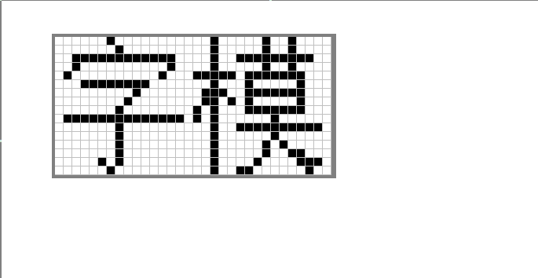
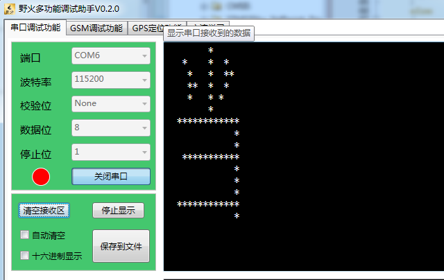
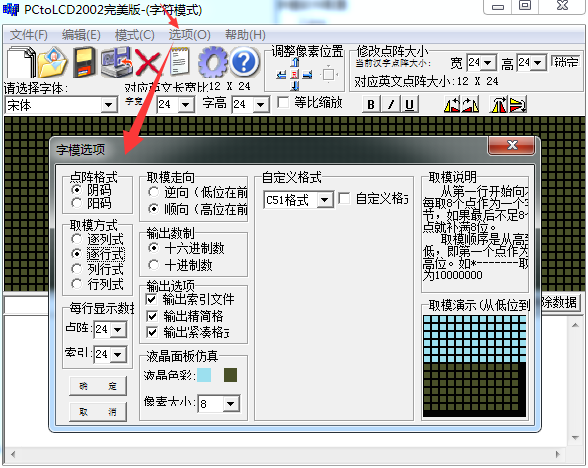
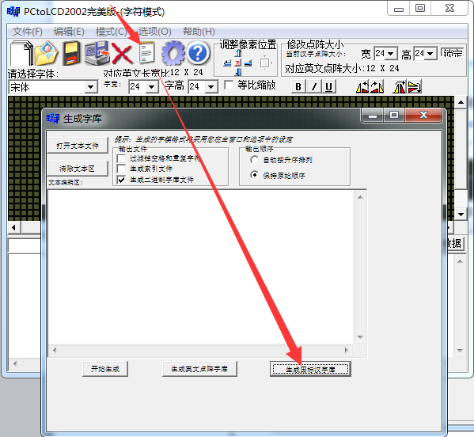
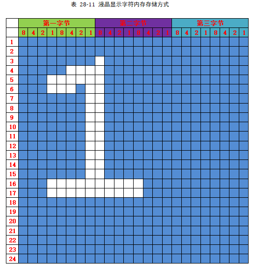
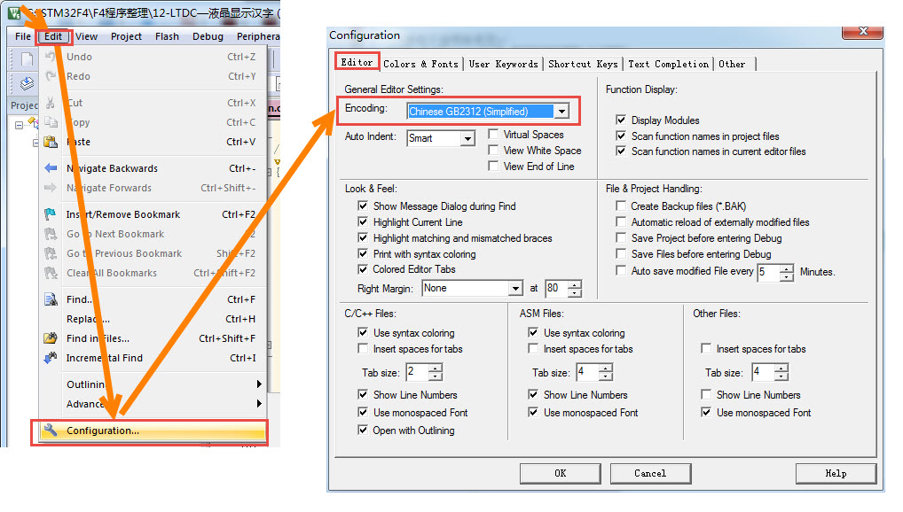
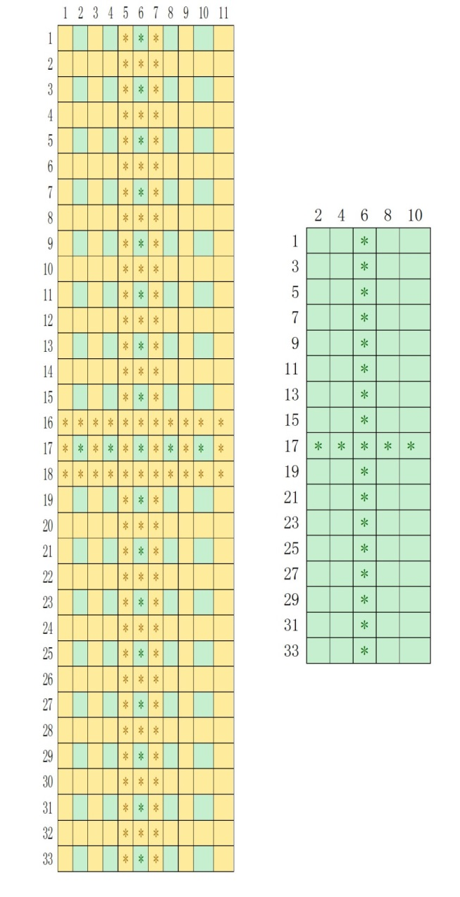

LTDC—液晶显示中英文
-----------------------

本章参考资料：《STM32H743用户手册》、《STM32H743xI规格书》、库帮助文档《STM32H753xx_User_Manual.chm》。

关于开发板配套的液晶屏参数可查阅《5.0寸液晶屏数据手册》（或7.0寸数据手册）配套资料获知。
本教程讲解时主要使用5寸屏来说明，对于我们配套的7寸屏，使用原理及配置参数完全一致（该7寸屏与5寸屏都是800x480的分辨率，仅尺寸不一样）。

在前面我们学习了如何使用LTDC外设控制液晶屏并用它显示各种图形，本章讲解如何控制液晶屏显示文字。使用液晶屏显示文字时，涉及到字符编码与字模的知识。

字符编码
~~~~~~~~

由于计算机只能识别0和1，文字也只能以0和1的形式在计算机里存储，所以我们需要对文字进行编码才能让计算机处理，编码的过程就是规定特定的01数字串来表示特定的文字，最简单的字符编码例子是ASCII码。

ASCII编码
^^^^^^^^^

学习C语言时，我们知道在程序设计中使用ASCII编码表约定了一些控制字符、英文及数字。它们在存储器中，本质也是
二进制数，只是我们约定这些二进制数可以表示某些特殊意义，如以ASCII编码解释数字“0x41”时，它表示英文字符“A”。ASC
II码表分为两部分，第一部分是控制字符或通讯专用字符，它们的数字编码从0~31，见表
27‑1，它们并没有特定的图形显示，但会根据不同的应用程序，而对文本显示有不同的影响。ASCII码
的第二部分包括空格、阿拉伯数字、标点符号、大小写英文字母以及“DEL（删除控制）”，这部分符号的
数字编码从32~127，除最后一个DEL符号外，都能以图形的方式来表示，它们属于传统文字书写系统的一部分。

表 27‑1 ASCII码中的控制字符或通讯专用字符

====== ======== =========================== ============
十进制 十六进制 缩写/字符                   解释
0      0        NUL(null)                   空字符
1      1        SOH(start of headline)      标题开始
2      2        STX (start of text)         正文开始
3      3        ETX (end of text)           正文结束
4      4        EOT (end of transmission)   传输结束
5      5        ENQ (enquiry)               请求
6      6        ACK (acknowledge)           收到通知
7      7        BEL (bell)                  响铃
8      8        BS (backspace)              退格
9      9        HT (horizontal tab)         水平制表符
10     0A       LF (NL line feed, new line) 换行键
11     0B       VT (vertical tab)           垂直制表符
12     0C       FF (NP form feed, new page) 换页键
13     0D       CR (carriage return)        回车键
14     0E       SO (shift out)              不用切换
15     0F       SI (shift in)               启用切换
16     10       DLE (data link escape)      数据链路转义
17     11       DC1 (device control 1)      设备控制1
18     12       DC2 (device control 2)      设备控制2
19     13       DC3 (device control 3)      设备控制3
20     14       DC4 (device control 4)      设备控制4
21     15       NAK (negative acknowledge)  拒绝接收
22     16       SYN (synchronous idle)      同步空闲
23     17       ETB (end of trans. block)   传输块结束
24     18       CAN (cancel)                取消
25     19       EM (end of medium)          介质中断
26     1A       SUB (substitute)            替补
27     1B       ESC (escape)                换码(溢出)
28     1C       FS (file separator)         文件分割符
29     1D       GS (group separator)        分组符
30     1E       RS (record separator)       记录分离符
31     1F       US (unit separator)         单元分隔符
====== ======== =========================== ============

表 27‑2 ASCII码中的字符及数字

======  ========  ===========  ======  ========  =========  ========  ====
十进制  十六进制  缩写/字符    十进制  十六进制  缩写/字符
32      20        (space)空格  80      50        P
33      21        !            81      51        Q
34      22        "            82      52        R
35      23        #            83      53        S
36      24        $            84      54        T
37      25        %            85      55        U
38      26        &            86      56        V
39      27        '            87      57        W
40      28        (            88      58        X
41      29        )            89      59        Y
42      2A        \*           90      5A        Z
43      2B        +            91      5B        [
44      2C        ,            92      5C        \
45      2D        -            93      5D        ]
46      2E        .            94      5E        ^
47      2F        /            95      5F        _
48      30        0            96      60        **`**
49      31        1            97      61        a
50      32        2            98      62        b
51      33        3            99      63        c
52      34        4            100     64        d
53      35        5            101     65        e
54      36        6            102     66        f
55      37        7            103     67        g
56      38        8            104     68        h
57      39        9            105     69        i
58      3A        :            106     6A        j
59      3B        ;            107     6B        k
60      3C        <            108     6C        l
61      3D        =            109     6D        m
62      3E        >            110     6E        n
63      3F        ?            111     6F        o
64      40        @            112     70        p
65      41        A            113     71        q
66      42        B            114     72        r
67      43        C            115     73        s
68      44        D            116     74        t
69      45        E            117     75        u
70      46        F            118     76        v
71      47        G            119     77        w
72      48        H            120     78        x
73      49        I            121     79        y
74      4A        J            122     7A        z
75      4B        K            123     7B        {
76      4C        L            124     7C        |
77      4D        M            125     7D        }
78      4E        N            126     7E        ~
79      4F        O            127     7F        DEL        (delete)  删除
======  ========  ===========  ======  ========  =========  ========  ====

后来，计算机引进到其它国家的时候，由于他们使用的不是英语，他们使用的字母在ASCII码表中没有定义，所以他们采用127号之后的位来表示这些新的字母，还加入了各种形状，一直编号到255。从128到255这些字符被称为ASCII扩展字符集。至此基本存储单位Byte(char)能表示的编号都被用完了。

中文编码
^^^^^^^^

由于英文书写系统都是由26个基本字母组成，利用26个字母组可合出不同的单词，所以用ASCII码表就能表达整个英文书写系统。而中文书写系统中的汉字是独立的方块，若参考单词拆解成字母的表示方式，汉字可以拆解成部首、笔画来表示，但这样会非常复杂(可参考五笔输入法编码)，所以中文编码直接对方块字进行编码，一个汉字使用一个号码。

由于汉字非常多，常用字就有6000多个，如果像ASCII编码表那样只使用1个字节最多只能表示256个汉字，所以我们使用2个字节来编码。

GB2312标准
''''''''''

我们首先定义的是GB2312标准。它把ASCII码表127号之后的扩展字符集直接取消掉，并规定小于127的编码按原来ASCII标准解释字符。当2个大于127的字符连在一起时，就表示1个汉字，第1个字节使用
(0xA1-0xFE)
编码，第2个字节使用(0xA1-0xFE)编码，这样的编码组合起来可以表示了7000多个符号，其中包含6763个汉字。在这些编码里，我们还把数学符号、罗马字母、日文假名等都编进表中，就连原来在ASCII里原本就有的数字、标点以及字母也重新编了2个字节长的编码，这就是平时在输入法里可切换的“全角”字符，而标准的ASCII码表中127号以下的就被称为“半角”字符。

表
27‑3说明了GB2312是如何兼容ASCII码的，当我们设定系统使用GB2312标准的时候，它遇到一个字符串时，会按字节检测字符值的大小，若遇到连续两个字节的数值都大于127时就把这两个连续的字节合在一起，用GB2312解码，若遇到的数值小于127，就直接用ASCII把它解码。

表 27‑3 GB2312兼容ASCII码的原理

======= ======= ========== ===========================================
第1字节 第2字节 表示的字符 说明
0x68    0x69    (hi)       两个字节的值都小于127(0x7F)，使用ASCII解码
0xB0    0xA1    (啊)       两个字节的值都大于127(0x7F)，使用GB2312解码
======= ======= ========== ===========================================

区位码
=======

在GB2312编码的实际使用中，有时会用到区位码的概念，见 图27_1_。GB2312编码对
所收录字符进行了“分区”处理，共94个区，每区含有94个位，共8836个码位。而区位码实际是GB2312编码的内部形式，它规定对收录的每个字符采用两个字节表示，第一个字节为“高字节”，对应94个区；第二个字节为“低字节”，对应94个位。所以它的区位码范围是：0101-9494。为兼容ASCII码，区号和位号分别加上0xA0偏移就得到GB2312编码。在区位码上加上0xA0偏移，可求得GB2312编码范围：0xA1A1－0xFEFE，其中汉字的编码范围为0xB0A1-0xF7FE，第一字节0xB0-0xF7（对应区号：16－87），第二个字节0xA1-0xFE（对应位号：01－94）。

例如，“啊”字是GB2312编码中的第一个汉字，它位于16区的01位，所以它的区位码就是1601，加上0xA0偏移，其GB2312编码为0xB0A1。其中区位码为0101的码位表示的是“空格”符。

.. image:: media/image1.jpg
   :align: center
   :alt: 图 27‑1 GB2312 的部分区位码
   :name: 图27_1

图 27‑1 GB2312 的部分区位码

GBK编码
'''''''

据统计，GB2312编码中表示的6763个汉字已经覆盖中国大陆99.75%的使用率，单看这个数字已经很令人满意了，但是我们不能因为那些文字不常用就不让它进入信息时代，而且生僻字在人名、文言文中的出现频率是非常高的。为此我们在GB2312标准的基础上又增加了14240个新汉字(包括所有后面介绍的Big5中的所有汉字)和符号，这个方案被称为GBK标准。增加这么多字符，按照GB2312原来的格式来编码，2个字节已经没有足够的编码，我们聪明的程序员修改了一下格式，不再要求第2个字节的编码值必须大于127，只要第1个字节大于127就表示这是一个汉字的开始，这样就做到了兼容ASCII和GB2312标准。

表27‑4说明了GBK是如何兼容ASCII和GB2312标准的，当我们设定系统使用GBK标准的时候，它按顺序遍历字符串，按字节检测字符值的大小，若遇到一个字符的值大于127时，就再读取它后面的一个字符，把这两个字符值合在一起，用GBK解码，解码完后，再读取第3个字符，重新开始以上过程，若该字符值小于127，则直接用ASCII解码。

表 27‑4 GBK兼容ASCII和GB2312的原理

+-----------+-----------+-----------+------------+---------------------+
|  第1字节  |  第2字节  |  第3字节  | 表示的字符 |        说明         |
+===========+===========+===========+============+=====================+
| 0x68(<7F) | 0xB0(>7F) | 0xA1(>7F) | (h啊)      | 第1个字节小于127，  |
|           |           |           |            | 使用ASCII解码，每   |
|           |           |           |            | 2个字节大于127，直  |
|           |           |           |            | 接使用GBK解码，兼容 |
|           |           |           |            | GB2312              |
+-----------+-----------+-----------+------------+---------------------+
| 0xB0(>7F) | 0xA1(>7F) | 0x68(<7F) | (啊h)      | 第1个字节大于127，  |
|           |           |           |            | 直接使用GBK码解释， |
|           |           |           |            | 第3个字节小于127，  |
|           |           |           |            | 使用ASCII解码       |
+-----------+-----------+-----------+------------+---------------------+
| 0xB0(>7F) | 0x56(<7F) | 0x68(<7F) | (癡h)      | 第1个字节大于127，  |
|           |           |           |            | 第2个字节虽然小于12 |
|           |           |           |            | 7，直接使用GBK解码  |
|           |           |           |            | ，第3个字节小于127  |
|           |           |           |            | ，使用ASCII解码     |
+-----------+-----------+-----------+------------+---------------------+

GB18030
'''''''

随着计算机技术的普及，我们后来又在GBK的标准上不断扩展字符，这些标准被称为GB18030，如GB18030-2000、GB18030-2005等(“-”号后面的数字是制定标准时的年号)，GB18030的编码使用4个字节，它利用前面标准中的第2个字节未使用的“0x30-0x39”编码表示扩充四字节的后缀，兼容GBK、GB2312及ASCII标准。

GB18030-2000主要在GBK基础上增加了“CJK(中日韩)统一汉字扩充A”的汉字。加上前面GBK的内容，GB18030-2000一共规定了27533个汉字（包括部首、部件等）的编码，还有一些常用非汉字符号。

GB18030-2005的主要特点是在GB18030-2000基础上增加了“CJK(中日韩)统一汉字扩充B”的汉字。增加了42711个汉字和多种我国少数民族文字的编码（如藏、蒙古、傣、彝、朝鲜、维吾尔文等）。加上前面GB18030-2000的内容，一共收录了70244个汉字。

GB2312、GBK及GB18030是汉字的国家标准编码，新版向下兼容旧版，各个标准简要说明见表
27‑5，目前比较流行的是GBK编码，因为每个汉字只占用2个字节，而且它编码的字符已经能满足大部分的需求，但国家要求一些产品必须支持GB18030标准。

表 27‑5 汉字国家标准

+-------------+-----------------+-----------------+------------+------------------------+
|    类别     |    编码范围     |  汉字编码范围   | 扩充汉字数 |          说明          |
+=============+=================+=================+============+========================+
| GB2312      | 第一字节0xA1-0x | 第一字节0xB0-0x | 6763       | 除汉字外，还包括拉丁字 |
|             | FE              | F7              |            | 母、希腊字母、日文平假 |
|             |                 |                 |            | 名及片假名字母、俄语西 |
|             | 第二字节0xA1-0x | 第二字节0xA1-0x |            | 里尔字母在内的682个    |
|             | FE              | FE              |            | 全角字符               |
+-------------+-----------------+-----------------+------------+------------------------+
|             |                 |                 |            |                        |
+-------------+-----------------+-----------------+------------+------------------------+
| GBK         | 第一字节0x81-0x | 第一字节0x81-0x | 6080       | 包括部首和构件,中日韩  |
|             | FE              | A0              |            | 汉字,包含了BIG5编      |
|             |                 |                 |            | 码中的所有汉字,加上G   |
|             | 第二字节0x40-0x | 第二字节0x40-0x |            | B2312的原内容，一      |
|             | FE              | FE              |            | 共有21003个汉字        |
+-------------+-----------------+-----------------+------------+------------------------+
|             |                 |                 |            |                        |
+-------------+-----------------+-----------------+------------+------------------------+
|             |                 | 第一字节0xAA-0x | 8160       |                        |
|             |                 | FE              |            |                        |
|             |                 |                 |            |                        |
|             |                 | 第二字节0x40-0x |            |                        |
|             |                 | A0              |            |                        |
+-------------+-----------------+-----------------+------------+------------------------+
|             |                 |                 |            |                        |
+-------------+-----------------+-----------------+------------+------------------------+
| GB18030-200 | 第一字节0x81-0x | 第一字节0x81-0x | 6530       | 在GBK基础上增加了中    |
| 0           | FE              | 82              |            | 日韩统一汉字扩充A的汉  |
|             |                 |                 |            | 字，加上GB2312、       |
|             | 第二字节0x30-0x | 第二字节0x30-0x |            | GBK的内容，一共有2     |
|             | 39              | 39              |            | 7533个汉字             |
|             |                 |                 |            |                        |
|             | 第三字节0x81-0x | 第三字节0x81-0x |            |                        |
|             | FE              | FE              |            |                        |
|             |                 |                 |            |                        |
|             | 第四字节0x30-0x | 第四字节0x30-0x |            |                        |
|             | 39              | 39              |            |                        |
+-------------+-----------------+-----------------+------------+------------------------+
|             |                 |                 |            |                        |
+-------------+-----------------+-----------------+------------+------------------------+
|             |                 |                 |            |                        |
+-------------+-----------------+-----------------+------------+------------------------+
|             |                 |                 |            |                        |
+-------------+-----------------+-----------------+------------+------------------------+
| GB18030-200 | 第一字节0x81-0x | 第一字节0x95-0x | 42711      | 在GB18030-20           |
| 5           | FE              | 98              |            | 00的基础上增加了42     |
|             |                 |                 |            | 711中日韩统一汉字扩    |
|             | 第二字节0x30-0x | 第二字节0x30-0x |            | 充B中的汉字和多种我国  |
|             | 39              | 39              |            | 少数民族文字的编码（如 |
|             |                 |                 |            | 藏、蒙古、傣、彝、朝鲜 |
|             | 第三字节0x81-0x | 第三字节0x81-0x |            | 、维吾尔文等），加上前 |
|             | FE              | FE              |            | 面GB2312、GBK          |
|             |                 |                 |            | 、GB18030-20           |
|             | 第四字节0x30-0x | 第四字节0x30-0x |            | 00的内容，一共702      |
|             | 39              | 39              |            | 44个汉字               |
+-------------+-----------------+-----------------+------------+------------------------+
|             |                 |                 |            |                        |
+-------------+-----------------+-----------------+------------+------------------------+
|             |                 |                 |            |                        |
+-------------+-----------------+-----------------+------------+------------------------+
|             |                 |                 |            |                        |
+-------------+-----------------+-----------------+------------+------------------------+

Big5编码
''''''''

在台湾、香港等地区，使用较多的是Big5编码，它的主要特点是收录了繁体字。而从GBK编码开始，已经把Big5中的所有汉字收录进编码了。即对于汉字部分，GBK是Big5的超集，Big5能表示的汉字，在GBK都能找到那些字相应的编码，但他们的编码是不一样的，两个标准不兼容，如GBK中的“啊”字编码是“0xB0A1”，而Big5标准中的编码为“0xB0DA”。

Unicode字符集和编码
^^^^^^^^^^^^^^^^^^^

由于各个国家或地区都根据使用自己的文字系统制定标准，同一个编码在不同的标准里表示不一样的字符，各个标准互不兼容，而又没有一个标准能够囊括所有的字符，即无法用一个标准表达所有字符。国际标准化组织(ISO)为解决这一问题，它舍弃了地区性的方案，重新给全球上所有文化使用的字母和符号进行编号，对每个字符指定一个唯一的编号(ASCII中原有的字符编号不变)，这些字符的号码从0x000000到0x10FFFF，该编号集被称为Universal
Multiple-Octet Coded Character
Set，简称UCS，也被称为Unicode。最新版的Unicode标准还包含了表情符号(聊天软件中的部分emoji表情)，可访问Unicode官网了解：\ http://www.unicode.org\ 。

Unicode字符集只是对字符进行编号，但具体怎么对每个字符进行编码，Unicode并没指定，因此也衍生出了如下几种unicode编码方案(Unicode
Transformation Format)。

UTF-32
^^^^^^

对Unicode字符集编码，最自然的就是UTF-32方式了。编码时，它直接对Unicode字符集里的每个字符都用4字节来表示，转换方式很简单，直接将字符对应的编号数字转换为4字节的二进制数。如表
27‑6，由于UTF-32把每个字符都用要4字节来存储，因此UTF-32不兼容ASCII编码，也就是说ASCII编码的文件用UTF-32标准来打开会成为乱码。

   表 27‑6 UTF-32编码示例

==== ======= =========== ===================
字符 GBK编码 Unicode编号 UTF-32编码
A    0x41    0x0000 0041 大端格式0x0000 0041
啊   0xB0A1  0x0000 554A 大端格式0x0000 554A
==== ======= =========== ===================

对UTF-32数据进行解码的时候，以4个字节为单位进行解析即可，根据编码可直接找到Unicode字符集中对应编号的字符。

UTF-32的优点是编码简单，解码也很方便，读取编码的时候每次都直接读4个字节，不需要加其它的判断。它的缺点是浪费存储空间，大量常用字符的编号只需要2个字节就能表示。其次，在存储的时候需要指定字节顺序，是高位字节存储在前(大端格式)，还是低位字节存储在前(小端格式)。

UTF-16
^^^^^^

针对UTF-32的缺点，人们改进出了UTF-16的编码方式，它采用2字节或4字节的变长编码方式(UTF-32定长为4字节)。对Unicode字符编号在0到65535的统一用2个字节来表示，将每个字符的编号转换为2字节的二进制数，即从0x0000到0xFFFF。而由于Unicode字符集在0xD800-0xDBFF这个区间是没有表示任何字符的，所以UTF-16就利用这段空间，对Unicode中编号超出0xFFFF的字符，利用它们的编号做某种运算与该空间建立映射关系，从而利用该空间表示4字节扩展，感兴趣的读者可查阅相关资料了解具体的映射过程。

   表 27‑7 UTF-16编码示例

==== =========== =========== ===================
字符 GB18030编码 Unicode编号 UTF-16编码
A    0x41        0x0000 0041 大端格式0x0041
啊   0xB0A1      0x0000 554A 大端格式0x554A
𧗌   0x9735 F832 0x0002 75CC 大端格式0xD85D DDCC
==== =========== =========== ===================

注：𧗌
五笔：TLHH(不支持GB18030码的输入法无法找到该字，感兴趣可搜索它的Unicode编号找到)

UTF-16解码时，按两个字节去读取，如果这两个字节不在0xD800到0xDFFF范围内，那就是双字节编码的字符，以双字节进行解析，找到对应编号的字符。如果这两个字节在0xD800到
0xDFFF之间，那它就是四字节编码的字符，以四字节进行解析，找到对应编号的字符。

UTF-16编码的优点是相对UTF-32节约了存储空间，缺点是仍不兼容ASCII码，仍有大小端格式问题。

UTF-8
^^^^^

UTF-8是目前Unicode字符集中使用得最广的编码方式，目前大部分网页文件已使用UTF-8编码，如使用浏览器查看百度首页源文件，可以在前几行HTML代码中找到如下代码：

.. code-block:: c

   <meta http-equiv=Content-Type content="text/html;charset=utf-8">

其中“charset”等号后面的“utf-8”即表示该网页字符的编码方式UTF-8。

UTF-8也是一种变长的编码方式，它的编码有1、2、3、4字节长度的方式，每个Unicode字符根据自己的编号范围去进行对应的编码，见表
27‑8。它的编码符合以下规律：

-  对于UTF-8单字节的编码，该字节的第1位设为0(从左边数起第1位，即最高位)，剩余
   的位用来写入字符的Unicode编号。即对于Unicode编号从0x0000
   0000-0x0000
   007F的字符，UTF-8编码只需要1个字节，因为这个范围Unicode编号的字符与ASCII码完全相同，所以UTF-8兼容了ASCII码表。

-  对于UTF-8使用N个字节的编码(N>1)，第一个字节的前N位设为1，第N+1
   位设为0，后面字节的前两位都设为10，这N个字节的其余空位填充该字符的Unicode编号，高位用0补足。

表 27‑8 UTF-8编码原理(x的位置用于填充Unicode编号)

=================  ==============  ========  ========  ========  ========
Unicode(16进制)    UTF-8（2进制）
编号范围           第一字节        第二字节  第三字节  第四字节  第五字节
00000000-0000007F  0xxxxxxx
00000080-000007FF  110xxxxx        10xxxxxx
00000800-0000FFFF  1110xxxx        10xxxxxx  10xxxxxx
00010000-0010FFFF  11110xxx        10xxxxxx  10xxxxxx  10xxxxxx
…                  111110xx        10xxxxxx  10xxxxxx  10xxxxxx  10xxxxxx
=================  ==============  ========  ========  ========  ========

注：实际上utf-8编码长度最大为四个字节，所以最多只能表示Unicode编码值的二进制数为21位的Unicode字符。但是已经能表示所有的Unicode字符，因为Unicode的最大码位0x10FFFF也只有21位。

UTF-8解码的时候以字节为单位去看，如果第一个字节的bit位以0开头，那就是ASCII字符，以单字节进行解析。如果第一个字节的数据位以“110”开头，就按双字节进行解析，3、4字节的解析方法类似。

UTF-8的优点是兼容了ASCII码，节约空间，且没有字节顺序的问题，它直接根据第1个字节前面数据位中连续的1个数决定后面有多少个字节。不过使用UTF-8编码汉字平均需要3个字节，比GBK编码要多一个字节。

BOM
^^^

由于UTF系列有多种编码方式，而且对于UTF-16和UTF-32还有大小端的区分，那么计算机软件在打开文档的时候到底应该用什么编码方式去解码呢？有的人就想到在文档最前面加标记，一种标记对应一种编码方式，这些标记就叫做BOM(Byte
Order Mark)，它们位于文本文件的开头，见表
27‑9。注意BOM是对Unicode的几种编码而言的，ANSI编码没有BOM。

   表 27‑9 BOM标记

=================== ===============
BOM标记             表示的编码
0xEF 0xBB 0xBF      UTF-8
0xFF 0xFE           UTF-16 小端格式
0xFE 0xFF           UTF-16 大端格式
0xFF 0xFE 0x00 0x00 UTF-32 小端格式
0x00 0x00 0xFE 0xFF UTF-32 大端格式
=================== ===============

但由于带BOM的设计很多规范不兼容，不能跨平台，所以这种带BOM的设计没有流行起来。Linux系统下默认不带BOM。

什么是字模？
~~~~~~~~~~~~

有了编码，我们就能在计算机中处理、存储字符了，但是如果计算机处理完字符后直接以编码的形式输出，人类将难以识别。来，在2秒内告诉我ASCII编码的“0x25”表示什么字符？不容易吧？要是觉得容易，再来告诉我GBK编码的“0xBCC6”表示什么字符。因此计算机与人交互时，一般会把字符转化成人类习惯的表现形式进行输出，如显示、打印的时候。

但是如果仅有字符编码，计算机还不知道该如何表达该字符，因为字符实际上是一个个独特的图形，计算机必须把字符编码转化成对应的字符图形人类才能正常识别，因此我们要给计算机提供字符的图形数据，这些数据就是字模，多个字模数据组成的文件也被称为字库。计算机显示字符时，根据字符编码与字模数据的映射关系找到它相应的字模数据，液晶屏根据字模数据显示该字符。

字模的构成
^^^^^^^^^^

已知字模是图形数据，而图形在计算机中是由一个个像素点组成的，所以字模实质是一个个像素点数据。为方便处理，我们把字模定义
成方块形的像素点阵，且每个像素点只有0和1这两种状态(可以理解为单色图像数据)。见 图27_2_，这是两个宽、高为16x
16的像素点阵组成的两个汉字图形，其中的黑色像素点即为文字
的笔迹。计算机要表示这样的图形，只需使用16x16个二进制数据位，每个数据位记录一个像素点的状态，把黑色像素点以“1”表示，无色像素点以“0”表示即可。这样的一个汉字图形，使用16x16/8=32个字节来就可以记录下来。

16x16的“字”的字模数据以C语言数组的方式表示，见 代码清单27_1_。在这样的字模中，以两个字节表示一行像素点，16行构成一个字模。

代码清单27‑1：“字”的字模数据

.. code-block:: c
   :name: 代码清单27_1

   /* 字 */
   unsigned char code Bmp003[]=
   {
   /*------------------------------------------------------------
   ;  源文件 / 文字 : 字
   ;  宽×高（像素）: 16×16
   ;  字模格式/大小 : 单色点阵液晶字模，横向取模，字节正序/32字节
   ----------------------------------------------------------*/

   0x02,0x00,0x01,0x00,0x3F,0xFC,0x20,0x04,0x40,0x08,0x1F,0xE0,0x00,0x40,
   0x00,0x80,
   0xFF,0xFF,0x7F,0xFE,0x01,0x00,0x01,0x00,0x01,0x00,0x01,0x00,0x05,0x00,
   0x02,0x00,
   };

字模显示原理
^^^^^^^^^^^^

如果使用LCD的画点函数，按位来扫描这些字模数据，把为1的位以黑色来显示(也可以使用其它颜色)，为0的数据位以白色来显示，即可把整个点阵还原出来，显示在液晶屏上。

为便于理解，我们编写了一个使用串口printf利用字模打印字符到串口上位机，见
代码清单27_2_ 中演示的字模显示原理。

代码清单 27‑2 使用串口利用字模打印字到上位机

.. code-block:: c
   :name: 代码清单27_2

   /*"当"字符的字模*/
   unsigned char charater_matrix[] =
      {
      0x00,0x80,0x10,0x90,0x08,0x98,0x0C,0x90,
      0x08,0xA0,0x00,0x80,0x3F,0xFC,0x00,0x04,
      0x00,0x04,0x1F,0xFC,0x00,0x04,0x00,0x04,
      0x00,0x04,0x3F,0xFC,0x00,0x04,0x00,0x00
      };

   /**
   * @brief  使用串口在上位机打印字模
   *   演示字模显示原理
   * @retval 无
   */
   void Printf_Charater(void)
      {
      int i,j;
      unsigned char kk;

      /*i用作行计数*/
      for ( i=0; i<16; i++)
         {
         /*j用作一字节内数据的移位计数*/
         /*一行像素的第一个字节*/
         for (j=0; j<8; j++)
               {
               /*一个数据位一个数据位地处理*/
               kk = charater_matrix[2*i] << j ;  //左移J位
               if ( kk & 0x80)
                  {
                  printf("*"); //如果最高位为1，输出"*"号,表示笔迹
                  }
               else
                  {
                  printf(" "); //如果最高位为0，输出"空格"，表示空白
                  }
               }
         /*一行像素的第二个字节*/
         for (j=0; j<8; j++)
            {
            kk = charater_matrix[2*i+1] << j ;  //左移J位

            if ( kk & 0x80)
                  {
                  printf("*"); //如果最高位为1，输出"*"号，表示笔迹
                  }
            else
                  {
                  printf(" "); //如果最高位为0，输出"空格"，表示空白
                  }
            }
         printf("\n");    //输出完一行像素，换行
         }
      printf("\n\n");     //一个字输出完毕
      }

在main函数中运行这段代码，连接好开发板到上位机，可以看到
图27_3_ 中的现象。该函数中利用printf函数对字模数据中为1的数据位打印“*”号，为0的数据
位打印出“空格”，从而在串口接收区域中使用“*”号表达出了一个“当”字。

如何制作字模
^^^^^^^^^^^^

以上只是某几个字符的字模，为方便使用，我们需要制作所有常用字符的字模，如程序只需要英文显示，那就需要制作包含ASCII码表
27‑2中所有字符的字模，如程序只需要使用一些常用汉字，我们可以选择制作GB2312编码里所有字符的字模，而且希望字模数据与字符编码有固定的映射关系，以便在程序中使用字符编码作为索引，查找字模。在网上搜索可找到一些制作字模的软件工具，可满足这些需求。在我们提供的《LTDC—液晶显示汉字》的工程目录下提供了一个取模软件“PCtoLCD”，这里以它为例讲解如何制作字模，其它字模软件也是类似的。

(1) 配置字模格式

打开取模软件，点击“选项”菜单，会弹出一个对话框，见图 27‑4。

-  选项“点阵格式”中的阴、阳码是指字模点阵中有笔迹像素位的状态是“1”还是“0”，像我们前文介绍的那种就是阴码，反过来就是阳码。本工程中使用阴码。

-  选项“取模方式”是指字模图形的扫描方向，修改这部分的设置后，选项框的右侧会有相应的说明及动画显示，这里我们依然按前文介绍的字模类型，把它配置成“逐行式”

-  选项“每行显示的数据”里我们把点阵和索引都配置成24，设置这个点阵的像素大小为24x24。

字模选项的格式保持不变，设置完我们点击确定即可，字模选项的这些配置会影响到显示代码的编
写方式，即类似前文 代码清单27_2_ 中的程序。

(2) 生成GB2312字模

配置完字模选项后，点击软件中的导入文本图标，会弹出一个“生成字库”的对话框，点击右下角的生成国标汉字库按钮即可生成包含了GB2312编码里所有字符的字模文件。在《液晶显示中英文》的工程目录下的《GB2312_H2424.FON》是我用这个取模软件生成的字模原文件，若不想自己制作字模，可直接使用该文件。

字模寻址公式
^^^^^^^^^^^^

使用字模软件制作的字模数据一般会按照编码格式排列。如我们利用以上软件生成的字模文件《GB2312_H2424.FON》中的数据，是根据GB2312的区位码表的顺序存储的，它存储了区位码为0101-9494的字符，每个字模的大小为24x24/8=72字节。其中第一个字符“空格”的区位码为0101，它是首个字符，所以文件的前72字节存储的是它的字模数据；同理，72-144字节存储的则是0102字符“、”的字模数据。所以我们可以导出任意字符的寻址公式:

Addr = (((Code:sub:`H`-0xA0-1)*94) +(Code\ :sub:`L`-0xA0-1))*24*24/8

其中Code\ :sub:`H`\ 和Code\ :sub:`L`\ 分别是GB2312编码的第一字节和第二字节；94是指一个区中有94个位(即94个字符)。
公式的实质是根据字符的GB2312编码，求出区位码，然后区位码乘以每个字符占据的字节数，求出地址偏移。

存储字模文件
^^^^^^^^^^^^

上面生成的《GB2312_H2424.FON》文件的大小为576KB，比很多STM32芯片内部的所有FLASH空间都大，如果我们还是在程序中直接以C语言数组的方式存储字模数据，STM32芯片的程序空间会非常紧张，一般的做法是把字模数据存储到外部存储器，如SD卡或SPI-FLASH芯片，当需要显示某个字符时，控制器根据字符的编码算好字模的存储地址，再从存储器中读取，而FLASH芯片在生产前就固化好字模内容，然后直接把FLASH芯片贴到电路板上，作为整个系统的一部分。

LTDC—各种模式的液晶显示字符实验
~~~~~~~~~~~~~~~~~~~~~~~~~~~~~~~~

本小节讲解如何利用字模使用在液晶屏上显示字符。

根据编码或字模存储位置、使用方式的不同，讲解中涉及到多个工程，见表
27‑10中的说明，在讲解特定实验的时候，请读者打开相应的工程来阅读

   表 27‑10 各种模式的液晶显示字符实验

+--------------------------------------+--------------------------------------------------------------------+
|               工程名称               |                                说明                                |
+======================================+====================================================================+
| LTDC—液晶显示英文（字库在内部FLASH） | 仅包含ASCII码字符显示功能，字库直接以C语言常量数组的方式存储       |
|                                      | 在STM32芯片的内部FLASH空间                                         |
+--------------------------------------+--------------------------------------------------------------------+
| LTDC—液晶显示汉字（字库在外部FLASH） | 包含ASCII码字符及GB2312码字符的显示功能，ASCII码字                 |
|                                      | 符存储在STM32内部FLASH，GB2312码字符存储在外部SP                   |
|                                      | I-FLASH芯片                                                        |
+--------------------------------------+--------------------------------------------------------------------+
| LTDC—LCD显示汉字（字库在SD卡）       | 包含ASCII码字符及GB2312码字符的显示功能，ASCII码字                 |
|                                      | 符存储在STM32内部FLASH，GB2312码字符直接以文件的格                 |
|                                      | 式存储在SD卡中                                                     |
+--------------------------------------+--------------------------------------------------------------------+
| LTDC—液晶显示汉字（显示任意大小）    | 在基础字库的支持下，使用字库缩放函数，使得只用一种字库，就能显示任 |
|                                      | 意大小的字符。包含ASCII码字符及GB2312码字符的显示功能，            |
|                                      | ASCII码字符存储在STM32内部FLASH，GB2312码字符                      |
|                                      | 存储在外部SPI-FLASH芯片                                            |
+--------------------------------------+--------------------------------------------------------------------+

这些实验是在“LTDC/DMA2D—液晶显示”工程的基础上修改的，主要添加了字符显示相关的内容，本小节只讲解这部分新增的函数。关于液晶驱动的原理在此不再赘述，不理解这部分的可阅读前面的章节。

硬件设计
^^^^^^^^

针对不同模式的液晶显示字符工程，需要有不同的硬件支持。字库存储在STM32芯片内部FLASH的工程，只需要液晶屏和SDRAM的支持即可，跟普通液晶显示的硬件需求无异。需要外部字库的工程，要有额外的SPI-FLASH、SD支持，使用外部FLASH时，我们的实验板上直接用板子上的SPI-FLASH芯片存储字库，出厂前我们已给FLASH芯片烧录了前面的《GB2312_H2424.FON》字库文件，如果您想把我们的程序移植到您自己设计产品上，请确保该系统包含有存储了字库的FLASH芯片，才能正常显示汉字使用SD卡时，需要给板子接入存储有《GB2312_H2424.FON》字库文件的MicroSD卡，SD卡的文件系统格式需要是FAT格式，且字库文件所在的目录需要跟程序里使用的文件目录一致。

关于SPI-FLASH和SD卡的原理图及驱动说明可参考其他的章节。给外部SPI-FLASH和SD卡存储字库的操作我们将在另一个文档中说明，本章的教程默认您已配置好SDI-FLASH和SD卡相关的字库环境。

显示ASCII编码的字符
^^^^^^^^^^^^^^^^^^^

我们先来看如何显示ASCII码表中的字符，请打开“LTDC—液晶显示英文（字库在内部FLASH）”的工程文件。本工程中我们把字库数据相关的函数代码写在“fonts.c”及“fonts.h”文件中，字符显示的函数仍存储在LCD驱动文件“bsp_lcd.c”及“bsp_lcd.h”中。

编程要点
''''''''

(1) 获取字模数据；

(2) 根据字模格式，编写液晶显示函数；

(3) 编写测试程序，控制液晶英文。

代码分析
''''''''

ASCII字模数据
==============

要显示字符首先要有字库数据，在工程的“fonts.c”文件中我们定义了一系列大小为17x24、14x20、11x16、7x12及5x8的ASCII码表的字模数据，
其形式见 代码清单27_3_。

代码清单 27‑3 部分英文字库17x24大小(fonts.c文件)

.. code-block:: c
   :name: 代码清单27_3

   const uint8_t Font24_Table [] = {
      // @0 ' ' (17 pixels wide)
      0x00, 0x00, 0x00, //
      0x00, 0x00, 0x00, //
      0x00, 0x00, 0x00, //
      0x00, 0x00, 0x00, //
      0x00, 0x00, 0x00, //
      0x00, 0x00, 0x00, //
      0x00, 0x00, 0x00, //
      0x00, 0x00, 0x00, //
      0x00, 0x00, 0x00, //
      0x00, 0x00, 0x00, //
      0x00, 0x00, 0x00, //
      0x00, 0x00, 0x00, //
      0x00, 0x00, 0x00, //
      0x00, 0x00, 0x00, //
      0x00, 0x00, 0x00, //
      0x00, 0x00, 0x00, //
      0x00, 0x00, 0x00, //
      0x00, 0x00, 0x00, //
      0x00, 0x00, 0x00, //
      0x00, 0x00, 0x00, //
      0x00, 0x00, 0x00, //
      0x00, 0x00, 0x00, //
      0x00, 0x00, 0x00, //
      0x00, 0x00, 0x00, //

      // @72 '!' (17 pixels wide)
      0x00, 0x00, 0x00, //
      0x00, 0x00, 0x00, //
      0x03, 0x80, 0x00, //       ###
      0x03, 0x80, 0x00, //       ###
      0x03, 0x80, 0x00, //       ###
      0x03, 0x80, 0x00, //       ###
      0x03, 0x80, 0x00, //       ###
      0x03, 0x80, 0x00, //       ###
      0x03, 0x80, 0x00, //       ###
      0x03, 0x80, 0x00, //       ###
      0x03, 0x80, 0x00, //       ###
      0x01, 0x00, 0x00, //        #
      0x01, 0x00, 0x00, //        #
      0x00, 0x00, 0x00, //
      0x00, 0x00, 0x00, //
      0x03, 0x80, 0x00, //       ###
      0x03, 0x80, 0x00, //       ###
      0x00, 0x00, 0x00, //
      0x00, 0x00, 0x00, //
      0x00, 0x00, 0x00, //
      0x00, 0x00, 0x00, //
      0x00, 0x00, 0x00, //
      0x00, 0x00, 0x00, //
      0x00, 0x00, 0x00, //
      /*以下部分省略.....*/

由于ASCII中的字符并不多，所以本工程中直接以C语言数组的方式存储这些字模数据，C语言的const数组是作为常量直接存储到STM32芯片的内部FLASH中的，所以如果您不需要显示中文，可以不用外部的SPI-FLASH芯片，可省去烧录字库的麻烦。以上代码定义的ASCII24_Table数组是17x24大小的ASCII字库。

管理英文字模的结构体
======================

为了方便使用各种不同的字体，工程中定义了一个“_tFont”结构体类型，
并利用它定义存储了不同字体信息的结构体变量，见 代码清单27_4_。

代码清单 27‑4 管理英文字模的结构体(font.h文件)

.. code-block:: c
   :name: 代码清单27_4

   /*字体格式*/
   typedef struct _tFont
   {
      const uint16_t *table;    /*指向字模数据的指针*/
      uint16_t Width;           /*字模的像素宽度*/
      uint16_t Height;          /*字模的像素高度*/
   } sFONT;

这个结构体类型定义了三个变量，第一个是指向字模数据的指针，即前面提到的C语言数组，每二、三个变量存储了该字模单个字符的像素宽度和高度。利用这个类型定义了Font8x16、Font16x32之类的变量，方便显示时寻址。

切换字体
===========

在程序中若要方便切换字体，还需要定义一个存储了当前选择字体的变量DrawProp[ActiveLayer].pFont，见 代码清单27_5_。

代码清单 27‑5 切换字体(bsp_lcd.c文件)

.. code-block:: c
   :name: 代码清单27_5

   /**
   * @brief  设置LCD当前层显示的字体
   * @param  fonts: 字体类型
   * @retval None
   */
   void LCD_SetFont(sFONT *fonts)
   {
      DrawProp[ActiveLayer].pFont = fonts;
   }

使用LCD_SetFont可以切换LCD_Currentfonts指向的字体类型，函数的可输入参数即前面的Font24、Font12之类的变量。

ASCII字符显示函数
========================

利用字模数据以及上述结构体变量，我们可以编写一个能显示各
种字体的通用函数，见 代码清单27_6_。

代码清单 27‑6 ASCII字符显示函数

.. code-block:: c
   :name: 代码清单27_6

   /**
   * @brief  显示一个字符
   * @param  Xpos: 显示字符的行位置
   * @param  Ypos: 列起始位置
   * @param  c: 指向字体数据的指针
   * @retval 无
   */
   static void DrawChar(uint16_t Xpos, uint16_t Ypos, const uint8_t *c)
   {
      uint32_t i = 0, j = 0;
      uint16_t height, width;
      uint8_t  offset;
      uint8_t  *pchar;
      uint32_t line;

      height = DrawProp[ActiveLayer].pFont->Height;//获取正在使用字体高度
      width  = DrawProp[ActiveLayer].pFont->Width; //获取正在使用字体宽度

      offset =  8 *((width + 7)/8) -  width ;//计算字符的每一行像素的偏移值，实际存储大小-字体宽度

      for (i = 0; i < height; i++) { //遍历字体高度绘点
         pchar = ((uint8_t *)c + (width + 7)/8 * i);//计算字符的每一行像素的偏移地址

         switch (((width + 7)/8)) { //根据字体宽度来提取不同字体的实际像素值

         case 1:
               line =  pchar[0];      //提取字体宽度小于8的字符的像素值
               break;

         case 2:
               line =  (pchar[0]<< 8) | pchar[1]; //提取字体宽度大于8小于16的字符的像素值
               break;

         case 3:
         default:
               line =  (pchar[0]<< 16) | (pchar[1]<< 8) | pchar[2];
                     //提取字体宽度大于16小于24的字符的像素值
               break;
         }

         for (j = 0; j < width; j++) { //遍历字体宽度绘点
               if (line & (1 << (width- j + offset- 1))) {
                  //根据每一行的像素值及偏移位置按照当前字体颜色进行绘点
                  LCD_DrawPixel((Xpos + j), Ypos, DrawProp[ActiveLayer].TextColor);
               } else { //如果这一行没有字体像素则按照背景颜色绘点
                  LCD_DrawPixel((Xpos + j), Ypos, DrawProp[ActiveLayer].BackColor);
               }
         }
         Ypos++;
      }
   }

我们常用的字体Font24宽度和高度分别是17、24用矩阵来表示的话是横向24bit即三字节，纵向24行实际为一个24*24的像素矩阵。为方便理解，
请配合表28-11理解，该表代表液晶显示数字“1”的像素矩阵，每个单元格表示一个液晶像素点，其中蓝色部分代表液晶屏的背景颜色，
白色部分表示字符“1”， 实际上字库的字符矩阵跟液晶显示的像素矩阵式一一对应关系。

该函数的说明如下：

(1) 输入参数

   这个字符显示函数有Xpos、Ypos及c参数。其中Xpos和Ypos分别表示字符显示位置的像素行号及像素列号，我们这里不需要做处理直接传递给描点函数LCD_DrawPixel，而输入参数c是一个指向将要显示的字符的字模数据的指针，它的指针地址由上层函数计算，在本函数中我们可以看出内存放置的字符跟液晶要显示的像素点是一一对应的，我们只需要将它的数据搬到显存中按照字符矩阵的排列填充表中的白色单元格，即字符显示矩阵。最后就得到我们想要的字符。

(2) 行循环与列循环

   根据字模数据的宽度判断字体的存储所占的位宽，函数使用了两个for循环，对字符显示矩阵里每个像素位进行遍历，一个点一点点地描上颜色。其中内层for循环用于遍历行内像素位，外层for循环用于遍历像素行。for循环中的判断条件利用了当前选择字体DrawProp[ActiveLayer].pFont的宽度及高度变量，以使函数适应不同的字模格式。

(3) 判断像素位的状态

   在for循环里遍历每个像素位时，有一个if条件判断，它根据字模数据中的数据位决定特定像素要显示字体颜色还是背景颜色。代码中的判断条件加入了字体的宽度变量进行运算，对不同字模数据进行不同的处理。这里字体宽度是17按照MSB的方式存在一个32bit的变量line里，再通过LCD_DrawPixel函数显示出来，每次都会操作每个字符像素矩阵的一行中的某一列，通过判断该行的每一列是否有像素数据来决定该显示背景颜色还是显示字体颜色。

直接使用ASCII码显示字符
==========================

上面的函数需要直接指定要显示的字符的字模地址，不符合使用习惯，
为此我们再定义一个函数LCD_DisplayChar，使得可以直接用ASCII字符串来显示，
见 代码清单27_7_。

代码清单27_7 直接使用ASCII码显示字符

.. code-block:: c
   :name: 代码清单27_7

   /**
      * @brief  显示一个字符
      * @param  Xpos: X轴起始坐标
      * @param  Ypos: Y轴起始坐标
      * @param  Ascii: 字符 ascii 码,范围（ 0x20 —0x7E ）
      * @retval 无
      */
   void LCD_DisplayChar(uint16_t Xpos, uint16_t Ypos, uint8_t Ascii)
   {
      DrawChar(Xpos, Ypos, &DrawProp[ActiveLayer].pFont->table[(Ascii-' ') *\
   DrawProp[ActiveLayer].pFont->Height * ((DrawProp[ActiveLayer].pFont->Width + 7) / 8)]);
   }

该函数利用包含Xpos，Ypos及Ascii三个输入参数。其中Xpos，Ypos参数可以输入液晶显示的具体位置。
Ascii参数用于输入要显示字符的ASCII编码，这里通过这个编码我们计算出字符在字库中的偏移地址。
这样我们最终在程序中可以使用“ ‘A’ ”这种形式赋值。

显示字符串
================

继续对以上函数进行封装，我们可以得到ASCII字符的字符串显示函数，默认选择左对齐的方式。
见 代码清单27_8_。

代码清单 27‑8 字符串显示函数

.. code-block:: c
   :name: 代码清单27_8

   /**
   * @brief  显示字符串
   * @param  Xpos: X轴起始坐标
   * @param  Ypos: Y轴起始坐标
   * @param  Text: 字符串指针
   * @param  Mode: 显示对齐方式，可以是CENTER_MODE、RIGHT_MODE、LEFT_MODE
   * @retval None
   */
   void LCD_DisplayStringAt(uint16_t Xpos, uint16_t Ypos, uint8_t *Text, Text_AlignModeTypdef Mode)
   {
      uint16_t ref_column = 1, i = 0;
      uint32_t size = 0, xsize = 0;
      uint8_t  *ptr = Text;

      /* 获取字符串大小 */
      while (*ptr++) size ++ ;

      /* 每一行可以显示字符的数量 */
      xsize = (LCD_GetXSize()/DrawProp[ActiveLayer].pFont->Width);

      switch (Mode) {
      case CENTER_MODE: {
      ref_column = Xpos + ((xsize - size)* DrawProp[ActiveLayer].pFont->Width) / 2;
            break;
      }
      case LEFT_MODE: {
            ref_column = Xpos;
            break;
      }
      case RIGHT_MODE: {
            ref_column = - Xpos + ((xsize - size)*DrawProp[ActiveLayer].pFont->Width);
            break;
      }
      default: {
            ref_column = Xpos;
            break;
      }
      }

      /*检查起始行是否在显示范围内 */
      if ((ref_column < 1) || (ref_column >= 0x8000)) {
            ref_column = 1;
      }

      /* 使用字符显示函数显示每一个字符*/
   while ((*Text != 0) & (((LCD_GetXSize() - (i*DrawProp[ActiveLayer].pFont->Width)) & 0xFFFF)\
                              >= DrawProp[ActiveLayer].pFont->Width)) {
            /* 显示一个字符 */
            LCD_DisplayChar(ref_column, Ypos, *Text);
            /* 根据字体大小计算下一个偏移位置 */
            ref_column += DrawProp[ActiveLayer].pFont->Width;
            /* 指针指向下一个字符 */
            Text++;
            i++;
      }
   }

   /**
      * @brief  在指定行显示字符串(最多60个)
      * @param  Line: 显示的行
      * @param  ptr: 字符串指针
      * @retval 无
      */
   void LCD_DisplayStringLine(uint16_t Line, uint8_t *ptr)
   {
      LCD_DisplayStringAt(0, LINE(Line), ptr, LEFT_MODE);
   }

本函数中的输入参数ptr为指向要显示的字符串的指针，在函数的内部它把字符串中的字符一个个地利用LCD_DisplayChar函数显示到液晶屏上。使用这个函数，我们可以很方便地利用“LCD_DisplayStringLine(1,”test”)”这样的格式在液晶屏上直接显示一串字符。

显示ASCII码示例
=====================

下面我们再来看main文件是如何利用这些函数显示ASCII码字符的，见
代码清单27_9_。

代码清单 27‑9 清除屏幕字符

.. code-block:: c
   :name: 代码清单27_9

   int main(void)
   {

      /* 系统时钟初始化成400MHz */
      SystemClock_Config();
      /* LED 端口初始化 */
      LED_GPIO_Config();
      /* 配置串口1为：115200 8-N-1 */
      UARTx_Config();

      printf("\r\n 欢迎使用野火  STM32 H743 开发板。\r\n");
      printf("\r\n野火STM32H743 LTDC液晶显示英文测试例程\r\n");
      /*蓝灯亮*/
      LED_BLUE;
      /* LCD 端口初始化 */
      LCD_Init();
      /* LCD 第一层初始化 */
      LCD_LayerInit(0, LCD_FB_START_ADDRESS,RGB888);
      /* LCD 第二层初始化 */
      LCD_LayerInit(1, LCD_FB_START_ADDRESS+(LCD_GetXSize()*LCD_GetYSize(
                     )*4),ARGB8888);
      /* 使能LCD，包括开背光 */
      LCD_DisplayOn();

      /* 选择LCD第一层 */
      LCD_SelectLayer(0);

      /* 第一层清屏，显示全黑 */
      LCD_Clear(LCD_COLOR_BLACK);

      /* 选择LCD第二层 */
      LCD_SelectLayer(1);

      /* 第二层清屏，显示全黑 */
      LCD_Clear(LCD_COLOR_TRANSPARENT);

      /* 配置第一和第二层的透明度,
      最小值为0，最大值为255*/
      LCD_SetTransparency(0, 255);
      LCD_SetTransparency(1, 0);

      while (1) {
         LCD_Test();
      }
   }

main函数中主要是对液晶屏初始化，初始化完成后就能够显示ASCII码字符了，无需利用SPI-FLASH及SD卡。
在while循环中调用的LCD_Test函数包含了显示字符的函数调用示例，见 代码清单27_10_。

代码清单 27‑10 LCD_Test函数中的ASCII码显示示例

.. code-block:: c
   :name: 代码清单27_10

   /*用于测试各种液晶的函数*/
   void LCD_Test(void)
   {
      /*演示显示变量*/
      static uint8_t testCNT = 0;
      char dispBuff[100];

      testCNT++;

      /*使用不透明前景层*/
      LCD_SetLayer(LCD_FOREGROUND_LAYER);
      LCD_SetTransparency(0xff);

      LCD_Clear(LCD_COLOR_BLACK); /* 清屏，显示全黑 */

      /*设置字体颜色及字体的背景颜色(此处的背景不是指LCD的背景层！注意区分)*/
      LCD_SetColors(LCD_COLOR_WHITE,LCD_COLOR_BLACK);

      /*选择字体*/
      LCD_SetFont(&Font16x24);
      LCD_DisplayStringLine(1,(uint8_t* )"BH 5.0 inch LCD para:");
      LCD_DisplayStringLine(2,(uint8_t* )"Image resolution:800x480 px");
      LCD_DisplayStringLine(3,(uint8_t* )"Touch pad:5 point touch supported");
      LCD_DisplayStringLine(4,(uint8_t* )"Use STM32-LTDC directed driver,");
      LCD_DisplayStringLine(5,(uint8_t* )"no extern lcd driver needed,RGB888,24bits data bus");
      LCD_DisplayStringLine(6,(uint8_t* )"Touch pad use IIC to communicate");

      /*使用cHAL库把变量转化成字符串*/
      sprintf(dispBuff,"Display value demo: testCount = %d ",testCNT);
      LCD_ClearLine(LINE(7));

      /*然后显示该字符串即可，其它变量也是这样处理*/
      LCD_DisplayStringLine(LINE(7),(uint8_t* )dispBuff);
      /*... 以下省略其它液晶测试函数的内容*/
   }

这段代码包含了使用字符串显示函数显示常量字符和变量的示例。显示常量字符串时，直接使用双引号括起要显示的字符串即可，根据C语言的语法，这些字符串会被转化成常量数组，数组内存储对应字符的ASCII码，然后存储到STM32的FLASH空间，函数调用时通过指针来找到对应的ASCII码，液晶显示函数使用前面分析过的流程，转换成液晶显示输出。

在很多场合下，我们可能需要使用液晶屏显示代码中变量的内容，这时很多用户就不知道该如何解决了，上面的LCD_Test函数结尾处演示了如何处理。它主要是使用一个C语言HAL库里的函数sprintf，把变量转化成ASCII码字符串，转化后的字符串存储到一个数组中，然后我们再利用液晶显示字符串的函数显示该数组的内容即可。spritnf函数的用法与printf函数类似，使用它时需要包含头文件string.h。

显示GB2312编码的字符
^^^^^^^^^^^^^^^^^^^^

显示ASCII编码比较简单，由于字库文件小，甚至都不需要使用外部的存储器，而显示汉字时，由于我们的字库是存储到外部存储器上的，这涉及到额外的获取字模数据的操作，且由于字库制作方式与前面ASCII码字库不一样，显示的函数也要作相应的更改。

我们分别制作了两个工程来演示如何显示汉字，以下部分的内容请打开“LTDC—液晶显示汉字（字库在外部FLASH）”和“LTDC—LCD显示汉字（字库在SD卡）”工程阅读理解。
这两个工程使用的字库文件内容相同，只是字库存储的位置不一样，工程中我们把获取字库数据相关的函数代码写在“fonts.c”及“fonts.h” 文件中，
字符显示的函数仍存储在LCD驱动文件“bsp_lcd.c”及“bsp_lcd.h”中。

编程要点
''''''''

(1) 获取字模数据；

(2) 根据字模格式，编写液晶显示函数；

(3) 编写测试程序，控制液晶汉字。

代码分析
''''''''

显示汉字字符
===============

由于我们的GB2312字库文件与ASCII字库文件不是使用同一种方式生成的，所以为了显示汉字，需要另外编写一个字符显示函数，
它利用前文生成的《GB2312_H2424.FON》字库显示GB2312编码里的字符，见 代码清单27_12_。

代码清单 27‑12 显示GB2312编码字符的函数(bsp_ldc.c文件)

.. code-block:: c
   :name: 代码清单27_12

   /**
   * @brief  在显示器上显示一个中文字符
   * @param  usX ：在特定扫描方向下字符的起始X坐标
   * @param  usY ：在特定扫描方向下字符的起始Y坐标
   * @param  usChar ：要显示的中文字符（国标码）
   * @retval 无
   */
   static void LCD_DispChar_CH (uint16_t Xpos, uint16_t Ypos, uint16_t Text)
   {
      uint32_t i = 0, j = 0;
      uint16_t height, width;
      uint8_t  offset;
      uint8_t  *pchar;
      uint8_t  Buffer[HEIGHT_CH_CHAR*3];
      uint32_t line;

      GetGBKCode (Buffer, Text );

      height =  HEIGHT_CH_CHAR;//取字模数据//获取正在使用字体高度
      width  =  WIDTH_CH_CHAR; //获取正在使用字体宽度

      offset =  8 *((width + 7)/8) -  width ;//计算字符的每一行像素的偏移值，实际存储大小-字体宽度

      for (i = 0; i < height; i++) { //遍历字体高度绘点
         pchar = ((uint8_t *)Buffer + (width + 7)/8 * i);//计算字符的每一行像素的偏移地址

         switch (((width + 7)/8)) { //根据字体宽度来提取不同字体的实际像素值

         case 1:
               line =  pchar[0];      //提取字体宽度小于8的字符的像素值
               break;

         case 2:
               line =  (pchar[0]<< 8) | pchar[1]; //提取字体宽度大于8小于16的字符的像素值
               break;

         case 3:
         default:
               line =  (pchar[0]<< 16) | (pchar[1]<< 8) | pchar[2];
                     //提取字体宽度大于16小于24的字符的像素值
               break;
         }

         for (j = 0; j < width; j++) { //遍历字体宽度绘点
               if (line & (1 << (width- j + offset- 1))) {
                  //根据每一行的像素值及偏移位置按照当前字体颜色进行绘点
                  LCD_DrawPixel((Xpos + j), Ypos, DrawProp[ActiveLayer].TextColor);
               } else { //如果这一行没有字体像素则按照背景颜色绘点
                  LCD_DrawPixel((Xpos + j), Ypos, DrawProp[ActiveLayer].BackColor);
               }
         }
         Ypos++;
      }
   }

这个GB2312码的显示函数与ASCII码的显示函数是很类似的，它的输入参数有Xpos，Ypos及text。其中Xpos和Ypos用于设定字符的显示位置，text是字符的编码，这是一个16位的变量，因为GB2312编码中每个字符是2个字节的。函数的执行流程介绍如下：

(1) 使用GetGBKCode函数获取字模数据，向该函数输入text参数(字符的编码)，它会从外部SPI-FLASH芯片或SD卡中读取该字符的字模数据，
    读取得的数据被存储到数组Buffer中。关于GetGBKCode函数我们在后面详细讲解。

(2) 遍历像素点。这个代码在遍历时还使用了line变量用来缓存一行的字模数据(本字模一行有3个字节)，然后一位一位地判断这些数据，
    数据位为1的时候，像素点就显示字体颜色，否则显示背景颜色。原理是跟ASCII字符显示一样的。

显示中英文字符串
=====================

类似地，我们希望希望汉字也能直接以字符串的形式来调用函数显示，而且最好是中英文字符可以混在一个字符串里。
为此，我们编写了LCD_DisplayStringLine_EN_CH 函数，，代码清单27_13_。

代码清单 27‑13 显示中英文的字符串

.. code-block:: c
   :name: 代码清单27_13

   /**
   * @brief  显示一行字符，若超出液晶宽度，不自动换行。
         中英混显时，请把英文字体设置为Font24格式
   * @param  Line: 要显示的行编号LINE(0) - LINE(N)
   * @param  *ptr: 要显示的字符串指针
   * @retval None
   */
   void LCD_DisplayStringLine_EN_CH(uint16_t Line, uint8_t *ptr)
   {
      uint16_t refcolumn = 0;
      /* 判断显示位置不能超出液晶的边界 */
      while ((refcolumn < LCD_PIXEL_WIDTH) && ((*ptr != 0) & (((refcolumn + DrawProp[ActiveLayer].pFont->Width) & 0xFFFF) >
            = DrawProp[ActiveLayer].pFont->Width))) {
         /* 使用LCD显示一个字符 */
         if ( * ptr <= 126 ) {             //英文字符

               LCD_DisplayChar(refcolumn, LINE(Line), *ptr);
               /* 根据字体偏移显示的位置 */
               refcolumn += DrawProp[ActiveLayer].pFont->Width;
               /* 指向字符串中的下一个字符 */
               ptr++;
         }

         else {                            //汉字字符
               uint16_t usCh;

               /*一个汉字两字节*/
               usCh = * ( uint16_t * ) ptr;
               /*交换编码顺序*/
               usCh = ( usCh << 8 ) + ( usCh >> 8 );

               /*显示汉字*/
               LCD_DispChar_CH ( refcolumn,LINE(Line) , usCh );
               /*显示位置偏移*/
               refcolumn += WIDTH_CH_CHAR;
               /* 指向字符串中的下一个字符 */
               ptr += 2;
         }
      }
   }

这个函数根据字符串中的编码值，判断它是ASCII码还是国标码中的字符，然后作不同处理。英文部分与前方中的英文字符串显示函数是一样的，中文部分也很类似，需要注意的是中文字符每个占2个字节，而且由于STM32芯片的数据是小端格式存储的，国标码是大端格式存储的，所以函数中对输入参数ptr指针获取的编码usCh交换了字节顺序，再输入到单个字符的显示函数LCD_DispChar_CH中。

获取SPI-FLASH中的字模数据
==========================

前面提到的GetGBKCode函数用于获取汉字字模数据，它根据字库文件的存储位置，有SPI-FLASH和SD卡两个版本，我们先来分析比较简单的SPI-FLASH版本，
代码清单27_14_。该函数定义在“LTDC—液晶显示汉字（字库在外部FLASH）”工程的“bsp_lcd.c”和“fonts.h”文件中。

代码清单 27‑14 从SPI-FLASH获取字模数据(“LTDC—液晶显示汉字（字库在外部FLASH）“工程)

.. code-block:: c
   :name: 代码清单27_14

   /*************fonts.h文件中的定义 **********************************/

   /*使用FLASH字模*/
   /*中文字库存储在FLASH的起始地址*/
   /*FLASH*/
   #define GBKCODE_START_ADDRESS   1360*4096

   /*获取字库的函数*/
   //定义获取中文字符字模数组的函数名，
   //ucBuffer为存放字模数组名，
   //usChar为中文字符（国标码）
   #define macGetGBKCode( ucBuffer, usChar )  \
                              GetGBKCode_from_EXFlash( ucBuffer, usChar )
   int GetGBKCode_from_EXFlash( uint8_t * pBuffer, uint16_t c);
   /*********************************************************************/

   /************fonts.c文件中的字义**************************************/
   /*使用FLASH字模*/

   //中文字库存储在FLASH的起始地址 ：
   /**
   * @brief  获取FLASH中文显示字库数据
      * @param  pBuffer:存储字库矩阵的缓冲区
      * @param  c ： 要获取的文字
   * @retval None.
   */
   int GetGBKCode_from_EXFlash( uint8_t * pBuffer, uint16_t c)
   {
      unsigned char High8bit,Low8bit;
      unsigned int pos;

      static uint8_t everRead=0;

      /*第一次使用，初始化FLASH*/
      if (everRead == 0)
      {
         QSPI_FLASH_Init ();
         everRead=1;
      }

      High8bit= c >> 8;     /* 取高8位编码 */
      Low8bit= c & 0x00FF;  /* 取低8位编码*/

      /*GB2312 公式*/
      pos = ((High8bit-0xa1)*94+Low8bit-0xa1)*24*24/8;
      //读取字模数据
      BSP_QSPI_Read (pBuffer,GBKCODE_START_ADDRESS+pos,24*24/8);

      return 0;
   }

这个GetGBKCode实质上是一个宏，当使用SPI-FLASH作为字库数据源时，它等效于GetGBKCode_from_EXFlash函数，它的执行过程如下：

(1) 初始化QSPI外设，以使用QSPI读取FLASH的内容，并且初始化后做一个标记，以后再读取字模数据的时候就不需要再次初始化QSPI了；

(2) 取出要显示字符的GB2312编码的高位字节和低位字节，以便后面用于计算字符的字模地址偏移；

(3) 根据字符的编码及字模的大小导出的寻址公式，计算当前要显示字模数据在字库中的地址偏移；

(4) 利用BSP_QSPI_Read函数，从SPI-FLASH中读取该字模的数据，输入参数中的GBKCODE_START_ADDRESS是在代码头部定义的一个宏，
    它是字库文件存储在SPI-FLASH芯片的基地址，该基地址加上字模在字库中的地址偏移，即可求出字模在SPI-FLASH中存储的实际位置。
    这个基地址具体数值是在我们烧录FLASH字库时决定的，程序中定义的是实验板出厂时默认烧录的位置。

(5) 获取到的字模数据存储到pBuffer指针指向的存储空间，显示汉字的函数直接利用它来显示字符。

获取SD卡中的字模数据
=======================

类似地，从SD卡中获取字模数据时，使用GetGBKCode_from_sd函数，见
代码清单27_15_。该函数定义在“LTDC—液晶显示汉字（字库在SD卡）”工程的“fonts.c”和“fonts.h”文件中。

代码清单27‑15 从SD卡中获取字模数据(“LTDC—液晶显示汉字（字库在SD卡）”工程)

.. code-block:: c
   :name: 代码清单27_15

   /*SD卡字模路径*/
   #define GBKCODE_FILE_NAME           "0:/Font/GB2312_H2424.FON"

   /**
   * @brief  获取SD卡中文显示字库数据
   * @param  pBuffer:存储字库矩阵的缓冲区
   * @param  c ： 要获取的文字
   * @retval None.
   */
   #define macGetGBKCode( ucBuffer, usChar )  \
                           GetGBKCode_from_sd( ucBuffer, usChar )

   int GetGBKCode_from_sd ( uint8_t * pBuffer, uint16_t c)
   {
      unsigned char High8bit,Low8bit;
      unsigned int pos;
      uint32_t xC;
      uint32_t err = 0;
      uint32_t right = 0;

      static uint8_t everRead = 0;
      static uint8_t everRead2 = 0;

      High8bit= c >> 8;     /* 取高8位数据 */
      Low8bit= c & 0x00FF;  /* 取低8位数据 */

      pos = ((High8bit-0xa1)*94+Low8bit-0xa1)*24*24/8;
      /*第一次使用，挂载文件系统，初始化sd*/
      if (everRead == 0) {
         //链接驱动器，创建盘符
         FATFS_LinkDriver(&SD_Driver, SDPath);
         //在外部SD卡挂载文件系统，文件系统挂载时会SD卡初始化
         res_sd = f_mount(&fs,"0:",1);

         /*----------------------- 格式化测试 ---------------------------*/
         /*
         如果没有文件系统就格式化创建创建文件系统
         */
         if (res_sd == FR_NO_FILESYSTEM) {
               printf("》SD卡还没有文件系统，即将进行格式...\r\n");

               if (res_sd == FR_OK) {
                  printf("》SD卡已成功格式化文件系统。\r\n");
                  /* 格式化后，先取消挂载 */
                  res_sd = f_mount(NULL,"0:",1);
                  /* 重新挂载 */
                  res_sd = f_mount(&fs,"0:",1);
               } else {
                  printf("《《格式化失败。》》\r\n");
                  while (1);
               }
         }
         everRead = 1;

      }

      res_sd = f_open(&fnew , GBKCODE_FILE_NAME, FA_OPEN_EXISTING | FA_READ);

      if ( res_sd == FR_OK ) {
         f_lseek (&fnew, pos);   //指针偏移
         res_sd = f_read( &fnew, pBuffer, 24*24/8, &br );  //24*24大小的汉字其字模占用24*24/8个字节

         f_close(&fnew);

         return 0;
      } else
         return -1;
   }

当字库的数据源在SD卡时， GetGBKCode宏指向的是这个GetGBKCode_from_sd函数。由于字库是使用SD卡的文件系统存储的，
从SD卡中获取字模数据实质上是直接读取字库文件，利用f_lseek函数偏移文件的读取指针，使它能够读取特定字符的字模数据。

由于使用文件系统的方式读取数据比较慢，而SD卡大多数都会使用文件系统，所以我们一般使用SPI-FLASH直接存储字库(不带文件系统地使用)，市场上有一些厂商直接生产专用的字库芯片，可以直接使用，省去自己制作字库的麻烦。

显示GB2312字符示例
========================

下面我们再来看main文件是如何利用这些函数显示GB2312的字符，由于我们用GetGBKCode宏屏蔽了差异，
所以在上层使用字符串函数时，不需要针对不同的字库来源写不同的代码，见 代码清单27_16_。

代码清单 27‑16 main函数

.. code-block:: c
   :name: 代码清单27_16

   int main(void)
   {
      /* 系统时钟初始化成400MHz */
      SystemClock_Config();
      CPU_CACHE_Enable();
      /* LED 端口初始化 */
      LED_GPIO_Config();
      /* 配置串口1为：115200 8-N-1 */
      UARTx_Config();

      printf("\r\n 欢迎使用野火  STM32 H743 开发板。\r\n");
      printf("\r\n 野火STM32H743 LTDC液晶显示中文测试例程\r\n");
      /*蓝灯亮，表示正在读写SDRAM测试*/
      LED_BLUE;
      /* LCD 端口初始化 */
      LCD_Init();
      /* LCD 第一层初始化 */
      LCD_LayerInit(0, LCD_FB_START_ADDRESS,RGB888);
      /* LCD 第二层初始化 */
      LCD_LayerInit(1, LCD_FB_START_ADDRESS+(LCD_GetXSize()*LCD_GetYSize(
                     )*4),RGB888);
      /* 使能LCD，包括开背光 */
      LCD_DisplayOn();

      /* 选择LCD第一层 */
      LCD_SelectLayer(0);

      /* 第一层清屏，显示全黑 */
      LCD_Clear(LCD_COLOR_BLACK);

      /* 选择LCD第二层 */
      LCD_SelectLayer(1);

      /* 第二层清屏，显示全黑 */
      LCD_Clear(LCD_COLOR_TRANSPARENT);

      /* 配置第一和第二层的透明度,
      最小值为0，最大值为255*/
      LCD_SetTransparency(0, 255);
      LCD_SetTransparency(1, 0);

      while (1) {
            LCD_Test();
      }
   }

main文件中的初始化流程与普通的液晶初始化没有区别，这里也不需要初始化SPI或SDIO，
因为我们在获取字库的函数中包含了相应的初始化流程。
在while循环里调用的LCD_Test包含了显示GB2312字符串的示例，见 代码清单27_17_。

代码清单 27‑17 显示GB2312字符示例

.. code-block:: c
   :name: 代码清单27_17

   /*用于测试各种液晶的函数*/
   void LCD_Test(void)
   {
      /*演示显示变量*/
      static uint8_t testCNT = 0;
      char dispBuff[100];

      /* 选择LCD第一层 */
      LCD_SelectLayer(0);

      /* 清屏，显示全黑 */
      LCD_Clear(LCD_COLOR_BLACK);
      /*设置字体颜色及字体的背景颜色(此处的背景不是指LCD的背景层！注意区分)*/
      LCD_SetColors(LCD_COLOR_WHITE,LCD_COLOR_BLACK);
      /*选择字体*/
      LCD_SetFont(&LCD_DEFAULT_FONT);

      LCD_DisplayStringLine_EN_CH(1,(uint8_t* )"野火5.0英寸液晶屏参数");
      LCD_DisplayStringLine_EN_CH(2,(uint8_t* )"分辨率:800x480 像素");
      LCD_DisplayStringLine_EN_CH(3,(uint8_t* )"触摸屏:5点电容触摸屏");
      LCD_DisplayStringLine_EN_CH(4,(uint8_t* )"使用STM32-LTDC直接驱动,无需外部液晶驱动器");
      LCD_DisplayStringLine_EN_CH(5,(uint8_t* )"支持RGB888/565,24位数据总线");
      LCD_DisplayStringLine_EN_CH(6,(uint8_t* )"触摸屏使用IIC总线驱动");

      /*使用cHAL库把变量转化成字符串*/
      sprintf(dispBuff,"显示变量例子: testCount = %d ",testCNT);
      LCD_ClearLine(7);
      /*设置字体颜色及字体的背景颜色(此处的背景不是指LCD的背景层！注意区分)*/
      LCD_SetColors(LCD_COLOR_WHITE,LCD_COLOR_BLACK);
      /*然后显示该字符串即可，其它变量也是这样处理*/
      LCD_DisplayStringLine_EN_CH(7,(uint8_t* )dispBuff);
      /*以下省略*/
   }

在调用字符串显示函数的时候，我们也是直接使用双引号括起要显示的中文字符即可，为什么这样就能正常显示呢？
我们的字符串显示函数需要的输入参数是字符的GB2312编码，编译器会自动转化这些中文字符成相应的GB2312编码吗？
为什么编译器不把它转化成UTF-8编码呢？这跟我们的开发环境配置有关，在MDK软件中，
可在“Edit->Configuration->Editor->Encoding”选项设定编码，见 图27_7_。

编译环境会把文件中的字符串转换成这里配置的编码，然后存储到STM32的程序空间中，所以这里的设定要与您的字库编码格式一样。如果您的实验板显示的时候出现乱码，请确保以下所有环节都正常：

-  SPI-FLASH或SD卡中是否有字库文件？

-  文件存储的位置或路径是否与程序的配置一致？

-  开发环境中的字符编码选项是否与字库的编码一致？

显示任意大小的字符
^^^^^^^^^^^^^^^^^^

前文中无论是ASCII字符还是GB2312的字符，都只能显示字库中设定的字体大小，例如，我们想显示一些像素大小为48x48的字符，那我们又得制作相应的字库，非常麻烦。为此我们编写了一些函数，简便地实现显示任意大小字符的目的。本小节的内容请打开“LTDC—液晶显示汉字（显示任意大小）”工程来配合阅读。

编程要点
''''''''

(1) 编写缩放字模数据的函数；

(2) 编写利用缩放字模的结果进行字符显示的函数；

(3) 编写测试程序，控制显示不同大小的字符。

代码分析
''''''''

缩放字模数据
==============

显示任意大小字符的功能，其核心是缩放字模，通过LCD_zoomChar函数对原始字模数据进行缩放，见代码清单27‑18。

代码清单 27‑18 缩放字模数据

.. code-block:: c
   :name: 代码清单27_18

   /**
   * @brief  缩放字模，缩放后的字模由1个像素点由8个数据位来表示
                        0x01表示笔迹，0x00表示空白区
   * @param  in_width ：原始字符宽度
   * @param  in_heig ：原始字符高度
   * @param  out_width ：缩放后的字符宽度
   * @param  out_heig：缩放后的字符高度
   * @param  in_ptr ：字库输入指针 注意：1pixel 1bit
   * @param  out_ptr ：缩放后的字符输出指针 注意: 1pixel 8bit
   *    out_ptr实际上没有正常输出，改成了直接输出到全局指针zoomBuff中
   * @param  en_cn ：0为英文，1为中文
   * @retval 无
   */
   void LCD_zoomChar(  uint16_t in_width,  //原始字符宽度
                        uint16_t in_heig,   //原始字符高度
                        uint16_t out_width, //缩放后的字符宽度
                        uint16_t out_heig,  //缩放后的字符高度
                        uint8_t *in_ptr,  //字库输入指针  注意：1pixel 1bit
                        uint8_t *out_ptr, //缩放后的字符输出指针 注意: 1pixel 8bit
                        uint8_t en_cn)    //0为英文，1为中文
   {
      uint8_t *pts,*ots;
      //根据源字模及目标字模大小，设定运算比例因子，左移16是为了把浮点运算转成定点运算

      unsigned int xrIntFloat_16=(in_width<<16)/out_width+1;
      unsigned int yrIntFloat_16=(in_heig<<16)/out_heig+1;

      unsigned int srcy_16=0;
      unsigned int y,x;
      uint8_t *pSrcLine;
      uint8_t tempBuff[1024] = {0};
      uint32_t  uChar;

      //检查参数是否合法
      if (in_width >= 32) return;                       //字库不允许超过32像素
      if (in_width * in_heig == 0) return;
      if (in_width * in_heig >= 1024 ) return;          //限制输入最大 32*32

      if (out_width * out_heig == 0) return;
      if (out_width * out_heig >= ZOOMMAXBUFF ) return; //限制最大缩放 128*128
      pts = (uint8_t*)&tempBuff;

      //为方便运算，字库的数据由1 pixel 1bit 映射到1pixel 8bit
      //0x01表示笔迹，0x00表示空白区
      if (en_cn == 0x00) { //英文
            //这里以17 * 24字库作为测试，每一行三个字节表示
            //英文和中文字库上下边界不对，可在此次调整。需要注意tempBuff防止溢出
            pts+=in_width*4;
      }

      for (y=0; y<in_heig; y++) {
            /*源字模数据*/
            uChar = in_ptr [ y * 3 ];
            uChar = ( uChar << 8 );
            uChar |= in_ptr [ y * 3 + 1 ];
            uChar = ( uChar << 8 );
            uChar |= in_ptr [ y * 3 + 2];
            /*映射*/
            for (x=0; x<in_width; x++) {
               if (((uChar << x) & 0x800000) == 0x800000)
                  *pts++ = 0x01;
               else
                  *pts++ = 0x00;
            }
      }

      //zoom过程
      pts = (uint8_t*)&tempBuff;  //映射后的源数据指针
      ots = (uint8_t*)&zoomBuff;  //输出数据的指针
      for (y=0; y<out_heig; y++) {  /*行遍历*/
            unsigned int srcx_16=0;
            pSrcLine=pts+in_width*(srcy_16>>16);
            for (x=0; x<out_width; x++) { /*行内像素遍历*/
               ots[x]=pSrcLine[srcx_16>>16]; //把源字模数据复制到目标指针中
               srcx_16+=xrIntFloat_16;     //按比例偏移源像素点
            }
            srcy_16+=yrIntFloat_16;         //按比例偏移源像素点
            ots+=out_width;
      }
   }

缩放字模的本质是按照缩放比例，减少或增加矩阵中的像素点，见
图27_8_，只要把左侧的矩阵隔一行、隔一列地取出像素点，即可得到右侧按比例缩小了的矩阵，
而右侧的小矩阵按比例填复制像素点即可得到左侧放大的矩阵，上述函数就是完成了这样的工作。

该函数的说明如下：

(1) 输入参数

..

   函数包含输入参数源字模、缩放后字模的宽度及高度：in_width、inheig、out_width、out_heig。源字模数据指针in_ptr，缩放后的字符指针out_ptr以及用于指示字模是英文还是中文的标志en_cn。其中out_ptr指针实质上没有用到，这个函数缩放后的数据最后直接存储在全局变量zoomBuff中了。

(2) 计算缩放比例

..

   根据输入字模与要求的输出字模大小，计算出缩放比例到xrIntFloat_16及yrIntFloat_16变量中，运算式中的左移16位是典型的把浮点型运算转换成定点运算的处理方式。理解的时候可把左移16位的运算去掉，把它当成一个自然的数学小数运算即可。

(3) 检查输入参数

..

   由于运算变量及数组的一些限制，函数中要检查输入参数的范围，本函数限制最大输出字模的大小为128\*128像素，输入字模限制不可以超过24\*24像素。

(4) 映射字模

..

   输入源的字模都是1个数据位表示1个像素点的，为方便后面的运算，函数把输入字模转化成1个字节(8个数据位)表示1个像素点，该字节的值为0x01表示笔迹像素，0x00表示空白像素。把字模数据的1个数据位映射为1个字节，可以方便后面直接使用指针和数组索引运算。

(5) 缩放字符

..

   缩放字符这部分代码比较难理解，但总的来说它就是利用前面计算得的比例因子，以它为步长复制源字模的数据到目标字模的缓冲区中，具体的抽象运算只能意会了。其中的右移16位是把比例因子由定点数转换回原始的数值。如果还是觉得难以理解，可以把函数的宽度及高度输入参数in_width、inheig、out_width及out_heig都设置成16，然后代入运算来阅读这段代码。

(6) 缩放结果

..

   经过运算，缩放的结果存储在zoomBuff中，它只是存储了一个字模的缩放结果，所以每显示一个字模都需要先调用这个函数更新zoomBuff中的字模数据，而且它也是用1个字节表示1个像素位的。

利用缩放的字模数据显示字符
==============================

由于缩放后的字模数据格式与我们原来用的字模数据格式不一样，所以我们也
要重新编写字符显示函数，见 代码清单27_19_。

代码清单 27‑19 利用缩放的字模显示字符

.. code-block:: c
   :name: 代码清单27_19

   /**
   * @brief  利用缩放后的字模显示字符
   * @param  Xpos ：字符显示位置x
   * @param  Ypos ：字符显示位置y
   * @param  Font_width ：字符宽度
   * @param  Font_Heig：字符高度
   * @param  c ：要显示的字模数据
   * @param  DrawModel ：是否反色显示
   * @retval 无
   */
   void LCD_DrawChar_Ex(   uint16_t Xpos, //字符显示位置x
                           uint16_t Ypos, //字符显示位置y
                           uint16_t Font_width, //字符宽度
                           uint16_t Font_Heig,  //字符高度
                           uint8_t *c,     //字模数据
                           uint16_t DrawModel) //是否反色显示
   {
      uint32_t i = 0, j = 0;
      uint16_t height, width;

      height =  Font_Heig;//取字模数据//获取正在使用字体高度
      width  =  Font_width; //获取正在使用字体宽度

      for (i = 0; i < height; i++) { //遍历字体高度绘点
         for (j = 0; j < width; j++) { //遍历字体宽度绘点
               if (*c++ != DrawModel) { //每一个字节表示一个像素，进行描点显示
                  LCD_DrawPixel((Xpos + j), Ypos, DrawProp[ActiveLayer].TextColor);
               } else {
                  LCD_DrawPixel((Xpos + j), Ypos, DrawProp[ActiveLayer].BackColor);
               }
         }
         Ypos++;
      }
   }

这个函数主体与前面介绍的字符显示函数都很类似，只是它在判断字模数据位的时候，直接用一整个字节来判断，区分显示分支，而且还支持了反色显示模式。

利用缩放的字模显示字符串
========================

单个字符显示的函数并不包含字模的获取过程，为便于使用，我们把它直接封装成字符串显示函数，见
代码清单27_20_。

代码清单 27‑20 利用缩放的字模显示字符串

.. code-block:: c
   :name: 代码清单27_20

   /**
   * @brief  利用缩放后的字模显示字符串
   * @param  Xpos ：字符显示位置x
   * @param  Ypos ：字符显示位置y
   * @param  Font_width ：字符宽度，英文字符在此基础上/2。注意为偶数
   * @param  Font_Heig：字符高度，注意为偶数
   * @param  c ：要显示的字符串
   * @param  DrawModel ：是否反色显示
   * @retval 无
   */
   void LCD_DisplayStringLineEx(uint16_t x,    //字符显示位置x
                              uint16_t y,        //字符显示位置y
                              uint16_t Font_width,
                              //要显示的字体宽度，英文字符在此基础上/2。注意为偶数
                              uint16_t Font_Heig,  //要显示的字体高度，注意为偶数
                              uint8_t *ptr,          //显示的字符内容
                              uint16_t DrawModel)  //是否反色显示
   {
      uint16_t refcolumn = x; //x坐标
      uint16_t Charwidth;
      uint8_t *psr;
      uint8_t Ascii;  //英文
      uint16_t usCh;  //中文
      uint8_t ucBuffer [ 24*24/8 ];

   while ((refcolumn < LCD_PIXEL_WIDTH) && ((*ptr != 0) & (((refcolumn +
   DrawProp[ActiveLayer].pFont->Width) & 0xFFFF) >= DrawProp[ActiveLayer].pFont->Width))) {
         if (*ptr > 0x80) { //如果是中文
               Charwidth = Font_width;
               usCh = * ( uint16_t * ) ptr;
               usCh = ( usCh << 8 ) + ( usCh >> 8 );
               GetGBKCode ( ucBuffer, usCh );  //取字模数据
               //缩放字模数据
               LCD_zoomChar(24,24,Charwidth,Font_Heig,(uint8_t *)&ucBuffer,psr,1);
               //显示单个字符
               LCD_DrawChar_Ex(refcolumn,y,Charwidth,Font_Heig,(uint8_t*)&zoomBuff,DrawModel);
               refcolumn+=Charwidth;
               ptr+=2;
         } else {
               Charwidth = Font_width / 2;
               Ascii = *ptr - 32;
               //缩放字模数据
         LCD_zoomChar(17,24,Charwidth,Font_Heig,(uint8_t *)&DrawProp[ActiveLayer].pFont->table[Ascii*\
   DrawProp[ActiveLayer].pFont->Height * ((DrawProp[ActiveLayer].pFont->Width + 7) / 8)],psr,0);
               //显示单个字符
               LCD_DrawChar_Ex(refcolumn,y,Charwidth,Font_Heig,(uint8_t*)&zoomBuff,DrawModel);
               refcolumn+=Charwidth;
               ptr++;
            }
      }
   }

这个函数包含了从字符编码到源字模获取、字模缩放及单个字符显示的过程，多个这样的过程组合起来，就实现了简单易用的字符串显示函数。而且可了解到它使用的英文源字模数据是Font16x32字体，而中文源字模数据仍是采用GetGBKCode函数获取，使得数据源的获取与上层分离，支持从SPI
FLASH及SD卡中获取数据源。

利用缩放的字模显示示例
==========================

利用缩放的字模显示时，液晶的初始化过程与前面的工程无异，以下我们给出LCD_Test函数
中调用字符串函数显示不同字符时的示例，见 代码清单27_21_。

代码清单 27‑21 利用缩放的字模显示示例

.. code-block:: c
   :name: 代码清单27_21

   /*用于测试各种液晶的函数*/
   void LCD_Test(void)
   {
      static uint8_t testCNT=0;
      char dispBuff[100];

      testCNT++;

      /*使用不透明前景层*/
      LCD_SetLayer(LCD_FOREGROUND_LAYER);
      LCD_SetTransparency(0xff);

      LCD_Clear(LCD_COLOR_BLACK); /* 清屏，显示全黑 */

      /*设置字体颜色及字体的背景颜色(此处的背景不是指LCD的背景层！注意区分)*/
      LCD_SetColors(LCD_COLOR_WHITE,LCD_COLOR_BLACK);

      LCD_DisplayStringLineEx(0,5,16,16,(uint8_t* )"野火H743 16*16 ",0);
      LCD_DisplayStringLine_EN_CH(LINE(1),(uint8_t* )"野火H743 24*24 ");
      LCD_DisplayStringLineEx(0,50,32,32,(uint8_t* )"野火H743 32*32 ",0);
      LCD_DisplayStringLineEx(0,82,48,48,(uint8_t* )"野火H743 48*48 ",0);
      /*...以下部分省略*/
   }

下载验证
^^^^^^^^

用USB线连接开发板，编译程序下载到实验板，并上电复位，各个不同的工程会有不同的的液晶屏显示字符示例。
