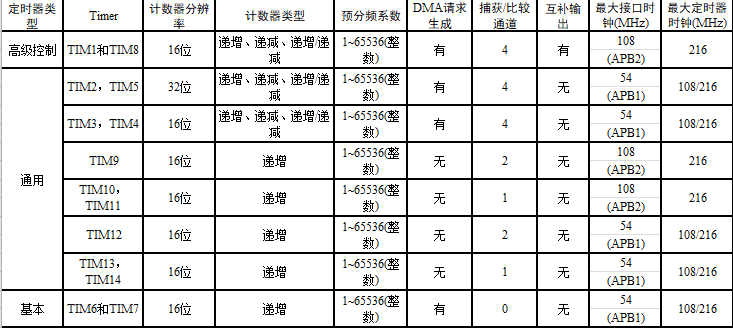
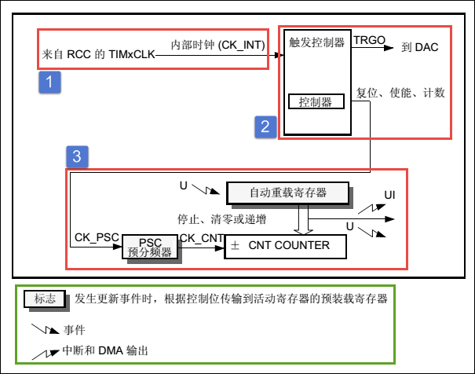
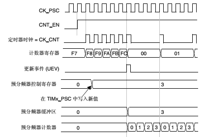

TIM—基本定时器
--------------

本章参考资料：《STM32H743用户手册》、《STM32H743xI规格书》、库帮助文档《STM32H753xx_User_Manual.chm》。

学习本章时，配合《STM32H743用户手册》基本定时器章节一起阅读，效果会更佳，特别是涉及到寄存器说明的部分。

特别说明，本书内容是以STM32H743系列控制器资源讲解。

TIM简介
~~~~~~~

定时器(Timer)最基本的功能就是定时了，比如定时发送USART数据、定时采集AD数据等等。如果把定时器与GPIO结合起来使用的话可以实现非常丰富的功能，可以测量输入信号的脉冲宽度，可以生产输出波形。定时器生产PWM控制电机状态是工业控制普遍方法，这方面知识非常有必要深入了解。

STM32H743控制器有2个高级控制定时器、10个通用定时器和2个基本定时器，还有2个看门狗定时器。看门狗定时器不在本章讨论范围，
有专门讲解的章节。控制器上所有定时器都是彼此独立的，不共享任何资源。
各个定时器特性参考 表31_1_。

.. _表31_1:

表 31‑1 各个定时器特性

其中最大定时器时钟可通过RCC_CFGR寄存器配置为100MHz或者400MHz。

定时器功能强大，这一点透过《STM32H743用户手册》讲解定时器内容就有160多页就显而易见了。定时器篇幅长，内容多，对于新手想完全掌握确实有些难度，特别参考手册是先介绍高级控制定时器，然后介绍通用定时器，最后才介绍基本定时器。实际上，就功能上来说通用定时器包含所有基本定时器功能，而高级控制定时器包含通用定时器所有功能。所以高级控制定时器功能繁多，但也是最难理解的，本章我们先选择最简单的基本定时器进行讲解。 

基本定时器
~~~~~~~~~~

基本定时器比高级控制定时器和通用定时器功能少，结构简单，理解起来更容易，我们就开始先讲解基本定时器内容。基本定时器主要两个功能，第一就是基本定时功能，生成时基，第二就是专门用于驱动数模转换器(DAC)。关于驱动DAC具体应用参考DAC章节。

控制器有两个基本定时器TIM6和TIM7，功能完全一样，但所用资源彼此都完全独立，可以同时使用。在本章内容中，以TIMx统称基本定时器。

基本上定时器TIM6和TIM7是一个16位向上递增的定时器，当我在自动重载寄存器(TIMx_ARR)添加一个计数值后并使能TIMx，计数寄存器(TIMx_CNT)就会从0开始递增，当TIMx_CNT的数值与TIMx_ARR值相同时就会生成事件并把TIMx_CNT寄存器清0，完成一次循环过程。如果没有停止定时器就循环执行上述过程。这些只是大概的流程，希望大家有个感性认识，下面细讲整个过程。

基本定时器功能框图
~~~~~~~~~~~~~~~~~~

基本定时器的功能框图包含了基本定时器最核心内容，掌握了功能框图，对基本定时器就有一个整体的把握，在编程时思路就非常清晰，见 图31_1_。

首先先看 图31_1_ 中绿色框内容，第一个是带有阴影的方框，方框内容一般是一个寄存器名称，
比如图中主体部分的自动重载寄存器(TIMx_ARR)或PSC预分频器(TIMx_PSC)，这里要特别突出的是阴影这个标志的作用，
它表示这个寄存器还自带有影子寄存器，在硬件结构上实际是有两个寄存器，源寄存器是我们可以进行读写操作，
而影子寄存器我们是完全无法操作的，有内部硬件使用。影子寄存器是在程序运行时真正起到作用的，源寄存器只是给我们读写用的，
只有在特定时候(特定事件发生时)才把源寄存器的值拷贝给它的影子寄存器。多个影子寄存器一起使用可以到达同步更新多个寄存器内容的目的。

接下来是一个指向右下角的图标，它表示一个事件，而一个指向右上角的图标表示中断和DMA输出。这个我们把它放在图中主体更好理解。图中的自动重载寄存器有影子寄存器，它左边有一个带有“U”字母的事件图标，表示在更新事件生成时就把自动重载寄存器内容拷贝到影子寄存器内，这个与上面分析是一致。寄存器右边的事件图标、中断和DMA输出图标表示在自动重载寄存器值与计数器寄存器值相等时生成事件、中断和DMA输出。

图 31‑1 基本定时器功能框图

①时钟源
'''''''

定时器要实现计数必须有个时钟源，基本定时器时钟只能来自内部时钟，高级控制定时器和通用定时器还可以选择外部时钟源或者直接来自其他定时器等待模式。
我们可以通过RCC专用时钟配置寄存器(RCC_DCKCFGR)的TIMPRE位设置所有定时器的时钟频率，我们一般设置该位为默认值0，
使得 表31_1_ 其中最大定时器时钟可通过RCC_CFGR寄存器配置为100MHz或者400MHz。

基本定时器只能使用内部时钟，当TIM6和TIM7控制寄存器1(TIMx_CR1)的CEN位置1时，启动基本定时器，并且预分频器的时钟来源就是CK_INT。对于高级控制定时器和通用定时器的时钟源可以来找控制器外部时钟、其他定时器等等模式，较为复杂，我们在相关章节会详细介绍。

②控制器
'''''''

定时器控制器控制实现定时器功能，控制定时器复位、使能、计数是其基础功能，基本定时器还专门用于DAC转换触发。

③计数器
'''''''

基本定时器计数过程主要涉及到三个寄存器内容，分别是计数器寄存器(TIMx_CNT)、预分频器寄存器(TIMx_PSC)、自动重载寄存器(TIMx_ARR)，这三个寄存器都是16位有效数字，即可设置值为0至65535。

首先我们来看 图31_1_ 中预分频器PSC，它有一个输入时钟CK_PSC和一个输出时钟CK_CNT。
输入时钟CK_PSC来源于控制器部分，基本定时器只有内部时钟源所以CK_PSC实际等于CK_INT，即108MHz。
在不同应用场所，经常需要不同的定时频率，通过设置预分频器PSC的值可以非常方便得到不同的CK_CNT，实际计算为：fCK_CNT等于fCK_PSC/(PSC[15:0]+1)。

图31_2_ 是将预分频器PSC的值从1改为4时计数器时钟变化过程。原来是1分频，CK_PSC和CK_CNT频率相同。
向TIMx_PSC寄存器写入新值时，并不会马上更新CK_CNT输出频率，而是等到更新事件发生时，把TIMx_PSC寄存器值更新到影子寄存器中，
使其真正产生效果。更新为4分频后，在CK_PSC连续出现4个脉冲后CK_CNT才产生一个脉冲。

图 31‑2 基本定时器时钟源分频

在定时器使能(CEN置1)时，计数器COUNTER根据CK_CNT频率向上计数，即每来一个CK_CNT脉冲，TIMx_CNT值就加1。当TIMx_CNT值与TIMx_ARR的设定值相等时就自动生成事件并TIMx_CNT自动清零，然后自动重新开始计数，如此重复以上过程。为此可见，我们只要设置CK_PSC和TIMx_ARR这两个寄存器的值就可以控制事件生成的时间，而我们一般的应用程序就是在事件生成的回调函数中运行的。在TIMx_CNT递增至与TIMx_ARR值相等，我们叫做为定时器上溢。

自动重载寄存器TIMx_ARR用来存放于计数器值比较的数值，如果两个数值相等就生成事件，将相关事件标志位置位，生成DMA和中断输出。TIMx_ARR有影子寄存器，可以通过TIMx_CR1寄存器的ARPE位控制影子寄存器功能，如果ARPE位置1，影子寄存器有效，只有在事件更新时才把TIMx_ARR值赋给影子寄存器。如果ARPE位为0，修改TIMx_ARR值马上有效。

定时器周期计算
''''''''''''''

经过上面分析，我们知道定时事件生成时间主要由TIMx_PSC和TIMx_ARR两个寄存器值决定，这个也就是定时器的周期。比如我们需要一个1s周期的定时器，具体这两个寄存器值该如何设置内。假设，我们先设置TIMx_ARR寄存器值为9999，即当TIMx_CNT从0开始计算，刚好等于9999时生成事件，总共计数10000次，那么如果此时时钟源周期为100us即可得到刚好1s的定时周期。

接下来问题就是设置TIMx_PSC寄存器值使得CK_CNT输出为100us周期(10000Hz)的时钟。预分频器的输入时钟CK_PSC为200MHz，所以设置预分频器值为(20000-1)即可满足。

定时器初始化结构体详解
~~~~~~~~~~~~~~~~~~~~~~

HAL库函数对定时器外设建立了四个初始化结构体，基本定时器只用到其中一个即TIM_TimeBaseInitTypeDef，该结构体成员用于设置定时器基本工作参数，并由定时器基本初始化配置函数TIM_TimeBaseInit调用，这些设定参数将会设置定时器相应的寄存器，达到配置定时器工作环境的目的。这一章我们只介绍TIM_TimeBaseInitTypeDef结构体，其他结构体将在相关章节介绍。

初始化结构体和初始化库函数配合使用是HAL库精髓所在，理解了初始化结构体每个成员意义基本上就可以对该外设运用自如了。初始化结构体定义在STM32F7xx_hal_tim.h文件中，初始化库函数定义在STM32F7xx_hal_tim.c文件中，编程时我们可以结合这两个文件内注释使用。

代码清单 31.1 定时器外设管理结构体（stm32h7xx_hal_tim.h文件）

.. code-block:: c
   :name: 代码31_1

    typedef struct {
        TIM_TypeDef              *Instance; /*!< 外设寄存器基地址 */
        TIM_Base_InitTypeDef     Init;   /*!< 定时器时基单元初始化结构体 */
        HAL_TIM_ActiveChannel    Channel;  /*!< TIM通道x */
        DMA_HandleTypeDef        *hdma[7]; /*!< DMA外设管理结构体 */
        HAL_LockTypeDef          Lock;     /*!< 锁资源 */
        __IO HAL_TIM_StateTypeDef   State; /*!< TIM工作状态 */
    } TIM_HandleTypeDef;

(1)	Instance：TIM寄存器基地址指针，所有参数都是指定基地址后才能正确写入寄存器。

(2)	Init：TIM时基单元初始化结构体，下面会详细讲解每一个成员。

(3)	Channel：TIMx的通道，可以选择HAL_TIM_ACTIVE_CHANNEL_1~HAL_TIM_ACTIVE_CHANNEL_6。

(4)	DMA_Handle：DMA外设管理结构体，用来配置TIM的DMA请求。

(5)	Lock：ADC锁资源。

(6)	State：TIM的工作状态。有HAL_TIM_STATE_READY，HAL_TIM_STATE_BUSY，HAL_TIM_STATE_TIMEOUT和HAL_TIM_STATE_ERROR等工作状态，方便用户排除错误。

代码清单 31.1.1 定时器基本初始化结构体

.. code-block:: c
   :name: 代码31_1_1

    typedef struct {
        uint32_t Prescaler;         /*!< 预分频器 */
        uint32_t CounterMode;       /*!< 计数模式 */
        uint32_t Period;            /*!< 定时器周期*/
        uint32_t ClockDivision;     /*!< 时钟分频 */
        uint32_t RepetitionCounter;  /*!< 重复计数器 */
        uint32_t AutoReloadPreload;  /*!< 自动重装载寄存器的值 */
    } TIM_Base_InitTypeDef; 

(1)	Prescaler：定时器预分频器设置，时钟源经该预分频器才是定时器时钟，它设定TIMx_PSC寄存器的值。可设置范围为0至65535，实现1至65536分频。

(2)	CounterMode：定时器计数方式，可是在为向上计数、向下计数以及三种中心对齐模式。基本定时器只能是向上计数，即TIMx_CNT只能从0开始递增，并且无需初始化。

(3)	Period：定时器周期，实际就是设定自动重载寄存器的值，在事件生成时更新到影子寄存器。可设置范围为0至65535。

(4)	ClockDivision：时钟分频，设置定时器时钟CK_INT频率与数字滤波器采样时钟频率分频比，基本定时器没有此功能，不用设置。

(5)	RepetitionCounter：重复计数器，属于高级控制寄存器专用寄存器位，利用它可以非常容易控制输出PWM的个数。这里不用设置。

(6)	AutoReloadPreload：自动重装载计数器的值。当ARPE位置0时，自动重装载计算器的值会立刻生效。

虽然定时器基本初始化结构体有6个成员，但对于基本定时器只需设置其中两个（时钟分频以及定时器周期）就可以，想想使用基本定时器就是简单。

基本定时器定时实验
~~~~~~~~~~~~~~~~~~

在DAC转换中几乎都用到基本定时器，使用有关基本定时器触发DAC转换内容在DAC章节讲解即可，这里就利用基本定时器实现简单的定时功能。

我们使用基本定时器循环定时0.5s并使能定时器中断，每到0.5s就在定时器中断服务函数翻转RGB彩灯，使得最终效果RGB彩灯暗0.5s，亮0.5s，如此循环。

硬件设计
''''''''''''''

基本定时器没有相关GPIO，这里我们只用定时器的定时功能，无效其他外部引脚，至于RGB彩灯硬件可参考GPIO章节。

软件设计
''''''''''''''

这里只讲解核心的部分代码，有些变量的设置，头文件的包含等并没有涉及到，完整的代码请参考本章配套的工程。我们创建了两个文件：bsp_basic_tim.c和bsp_basic_tim.h文件用来存基本定时器驱动程序及相关宏定义，中断服务函数放在stm32F7xx_it.h文件中。

编程要点
^^^^^^^^^^^

(1) 初始化系统时钟；

(2) 初始化RGB彩灯GPIO；

(3) 开启基本定时器时钟；

(4) 设置定时器周期和预分频器；

(5) 启动定时器更新中断，并开启定时器；

(6) 定时器中断服务函数实现RGB彩灯翻转。

软件分析
^^^^^^^^^^^

宏定义
===========

代码清单 31‑2 宏定义

.. code-block:: c
   :name: 代码31_2

    #define BASIC_TIM                 TIM6
    #define BASIC_TIM_CLK_ENABLE()    __TIM6_CLK_ENABLE()

    #define BASIC_TIM_IRQn            TIM6_DAC_IRQn
    #define BASIC_TIM_IRQHandler      TIM6_DAC_IRQHandler

使用宏定义非常方便程序升级、移植。

NCIV配置
===========

代码清单 31‑3 NVIC配置

.. code-block:: c
   :name: 代码31_3

    /**
    * @brief  初始化基本定时器定时，1ms产生一次中断
    * @param  无
    * @retval 无
    */
    void TIM_Basic_Init(void)
    {
        TIMx_Configuration();

        TIMx_NVIC_Configuration();
    }

实验用到定时器更新中断，需要配置NVIC，实验只有一个中断，对NVIC配置没什么具体要求。

基本定时器模式配置
======================

代码清单 31‑4 基本定时器模式配置

.. code-block:: c
   :name: 代码31_4

    static void TIMx_Configuration(void)
    {
        BASIC_TIM_CLK_ENABLE();
    
        TIM_Base.Instance = BASIC_TIM;
        /* 累计 TIM_Period个后产生一个更新或者中断*/
        //当定时器从0计数到4999，即为5000次，为一个定时周期
        TIM_Base.Init.Period = 5000 - 1;
        //定时器时钟源TIMxCLK = 2 * PCLK1
        //        PCLK1 = HCLK / 4
        //        => TIMxCLK=HCLK/2=SystemCoreClock/2=200MHz
        // 设定定时器频率为=TIMxCLK/(TIM_Prescaler+1)=10000Hz
        TIM_Base.Init.Prescaler =  20000 - 1;
        // 初始化定时器TIM
        HAL_TIM_Base_Init(&TIM_Base);
        // 开启定时器更新中断
        HAL_TIM_Base_Start_IT(&TIM_Base);
    }

使用定时器之前都必须开启定时器时钟，基本定时器属于APB1总线外设。

接下来设置定时器周期数为4999，即计数5000次生成事件。设置定时器预分频器为(20000-1)，基本定时器使能内部时钟，频率为200MHz，经过预分频器后得到10KHz的频率。然后就是调用TIM_HAL_TIM_Base_Init函数完成定时器配置。

最后使用HAL_TIM_Base_Start_IT函数开启定时器和更新中断。

定时器中断服务函数
======================

代码清单 31‑5 定时器中断服务函数（stm32h7xx_it.c文件）

.. code-block:: c
   :name: 代码31_5

    void BASIC_TIM_IRQHandler(void)
    {
        HAL_TIM_IRQHandler(&TIM_Base);
    }

我们在TIM_Mode_Config函数启动了定时器更新中断，在发生中断时，中断服务函数就得到运行。在服务函数内直接调用库函数HAL_TIM_IRQHandler函数，它会产生一个中断回调函数HAL_TIM_PeriodElapsedCallback，用来添加用户代码，确定是TIM6产生中断后才运行RGB彩灯翻转动作。

代码清单 31‑5-1 TIM更新中断回调函数（bsp_basic_tim.c文件）

.. code-block:: c
   :name: 代码31_5_1

    /**
    * @brief  定时器更新中断回调函数
    * @param  htim : TIM句柄
    * @retval 无
    */
    void HAL_TIM_PeriodElapsedCallback(TIM_HandleTypeDef *htim)
    {
        if (htim->Instance == TIM6)
            LED1_TOGGLE;
    }

主函数
===========

代码清单 31‑6 主函数

.. code-block:: c
   :name: 代码31_6

    int main(void)
    {
        /* 系统时钟初始化成400MHz */
        SystemClock_Config();
        /* 初始化LED */
        LED_GPIO_Config();
        /* 初始化基本定时器定时，1s产生一次中断 */
        TIM_Basic_Init();

        while (1) {
        }
    }

实验中先初始化系统时钟，用到RGB彩灯，需要对其初始化配置。LED_GPIO_Config函数是定义在bsp_led.c文件的完成RGB彩灯GPIO初始化配置的程序。

TIM_Basic_Init函数是定义在bsp_basic_tim.c文件的一个函数，它只是简单的先后调用TIMx_NVIC_Configuration和TIMx_Configuration两个函数完成NVIC配置和基本定时器模式配置。

下载验证
''''''''''''''

保证开发板相关硬件连接正确，把编译好的程序下载到开发板。开始RGB彩灯是暗的，等一会RGB彩灯变为红色，再等一会又暗了，如此反复。如果我们使用表钟与RGB彩灯闪烁对比，可以发现它是每0.5s改变一次RGB彩灯状态的。
