TIM—高级定时器
--------------

本章参考资料：《STM32H743用户手册》、《STM32H743xI规格书》、库帮助文档《STM32H753xx_User_Manual.chm》。

学习本章时，配合《STM32H743用户手册》高级定时器章节一起阅读，效果会更佳，特别是涉及到寄存器说明的部分。

特别说明，本书内容是以STM32H743系列控制器资源讲解。

上一章我们讲解了基本定时器功能，基本定时器功能简单，理解起来也容易。高级控制定时器包含了通用定时器的功能，再加上已经有了基本定时器基础的基础，如果再把通用定时器单独拿出来讲那内容有很多重复，实际效果不是很好，所以通用定时器不作为独立章节讲解，可以在理解了高级定时器后参考《STM32H743用户手册》通用定时器章节内容理解即可。

高级控制定时器
~~~~~~~~~~~~~~

高级控制定时器(TIM1和TIM8)和通用定时器在基本定时器的基础上引入了外部引脚，可以输入捕获和输出比较功能。高级控制定时器比通用定时器增加了可编程死区互补输出、重复计数器、带刹车(断路)功能，这些功能都是针对工业电机控制方面。这几个功能在本书不做详细的介绍，主要介绍常用的输入捕获和输出比较功能。

高级控制定时器时基单元包含一个16位自动重载计数器ARR，一个16位的计数器CNT，可向上/下计数，一个16位可编程预分频器PSC，预分频器时钟源有多种可选，有内部的时钟、外部时钟。还有一个8位的重复计数器RCR，这样最高可实现40位的可编程定时。

STM32H743的高级/通用定时器的IO分配具体见 表32_1_。
配套开发板因为IO资源紧缺，定时器的IO很多已经复用它途，故下表中的IO只有部分可用于定时器的实验。

.. _表32_1:

表 32‑1 高级控制和通用定时器通道引脚分布

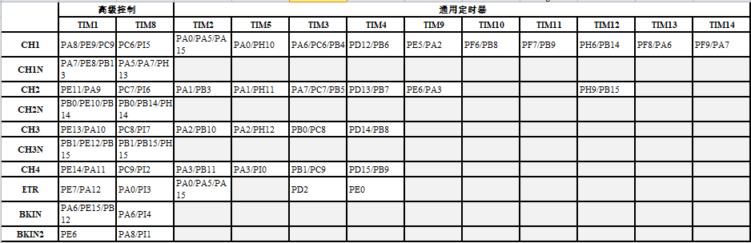

高级控制定时器功能框图
~~~~~~~~~~~~~~~~~~~~~~

高级控制定时器功能框图包含了高级控制定时器最核心内容，掌握了功能框图，
对高级控制定时器就有一个整体的把握，在编程时思路就非常清晰，见 图31_1_。

关于图中带阴影的寄存器，即带有影子寄存器，指向左下角的事件更新图标以及指向右上角的中断和DMA输出标志在上一章已经做了解释，这里就不再介绍。

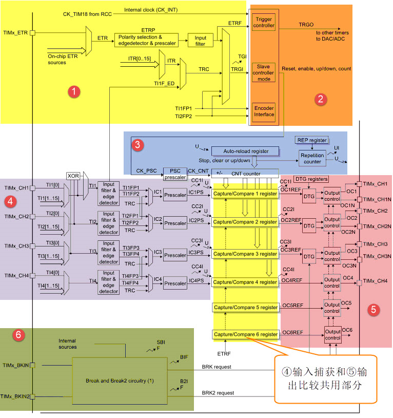

①时钟源
'''''''

高级控制定时器有四个时钟源可选：

-  内部时钟源CK_INT

-  外部时钟模式1：外部输入引脚TIx（x=1,2,3,4）

-  外部时钟模式2：外部触发输入ETR

-  内部触发输入(ITRx)

内部时钟源(CK_INT)
.......................

内部时钟CK_INT即来自于芯片内部，等于200M，一般情况下，我们都是使用内部时钟。当从模式控制寄存器TIMx_SMCR的SMS位等于000时，则使用内部时钟。

外部时钟模式1
.......................

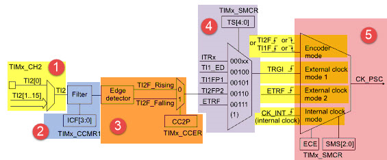

**①：时钟信号输入引脚**

当使用外部时钟模式1的时候，时钟信号来自于定时器的输入通道，总共有4个，分别为TI1/2/3/4，即TIMx_CH1/2/3/4。具体使用哪一路信号，由TIM_CCMx的位CCxS[1:0]配置，其中CCM1的CCxS[1:0](x=1,2)控制TI1/2，CCM2的CCxS[1:0] (x=1,2)控制TI3/4。

**②：滤波器**

如果来自外部的时钟信号的频率过高或者混杂有高频干扰信号的话，我们就需要使用滤波器对ETRP信号重新采样，来达到降频或者去除高频干扰的目的，具体的由TIMx_CCMx的位ICxF[3:0]配置。

**③：边沿检测**

边沿检测的信号来自于滤波器的输出，在成为触发信号之前，需要进行边沿检测，决定是上升沿有效还是下降沿有效，具体的由TIMx_CCER的位CCxP和CCxNP配置。

**④：触发选择**

当使用外部时钟模式1时，触发源有两个，一个是滤波后的定时器输入1（TI1FP1）和滤波后的定时器输入2（TI2FP2），具体的由TIMxSMCR的位TS[4:0]配置。

**⑤：从模式选择**

选定了触发源信号后，最后我们需把信号连接到TRGI引脚，让触发信号成为外部时钟模式1的输入，最终等于CK_PSC，然后驱动计数器CNT计数。具体的配置TIMx_SMCR的位SMS[2:0]为0111即可选择外部时钟模式1。

**⑥：使能计数器**

经过上面的5个步骤之后，最后我们只需使能计数器开始计数，外部时钟模式1的配置就算完成。使能计数器由TIMx_CR1的位CEN配置。

外部时钟模式2
.......................

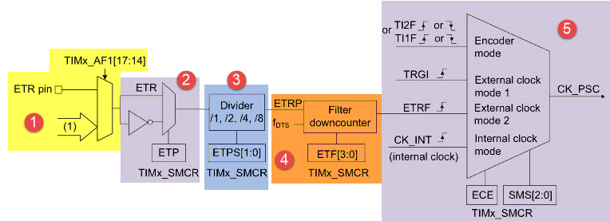

图 31‑3 外部时钟模式2框图

**①：时钟信号输入引脚**

当使用外部时钟模式2的时候，时钟信号来自于定时器的特定输入通道TIMx_ETR，比较输出和模拟看门狗，见 图31_2_1_ TIM1和TIM8的ETR输入电路，具体的由TIMx_AF1的位ETRSEL[3:0]配置。

.. image:: media/image3_1.png
   :align: center
   :alt: 图 31‑2-1 TIM1和TIM8的ETR输入电路
   :name: 图31_2_1

**②：外部触发极性**

来自ETR引脚输入的信号可以选择为上升沿或者下降沿有效，具体的由TIMx_SMCR的位ETP配置。

**③：外部触发预分频器**

由于ETRP的信号的频率不能超过TIMx_CLK（200M）的1/4，当触发信号的频率很高的情况下，就必须使用分频器来降频，具体的由 TIMx_SMCR的位ETPS[1:0]配置。

**④：滤波器**

如果ETRP的信号的频率过高或者混杂有高频干扰信号的话，我们就需要使用滤波器对ETRP信号重新采样，来达到降频或者
去除高频干扰的目的。具体的由TIMx_SMCR的位ETF[3:0]配置，其中的f\ :sub:`DTS`\ 是由内部时钟CK_INT分频得
到，具体的由TIMx_CR1的位CKD[1:0]配置。

**⑤：从模式选择**

经过滤波器滤波的信号连接到ETRF引脚后，触发信号成为外部时钟模式2的输入，最终等于CK_PSC，然后驱动计数器CNT计数。具体的配置TIMx_SMCR的位ECE为1即可选择外部时钟模式2。

**⑥：使能计数器**

经过上面的5个步骤之后，最后我们只需使能计数器开始计数，外部时钟模式2的配置就算完成。使能计数器由TIMx_CR1的位CEN配置。

②控制器
'''''''

高级控制定时器控制器部分包括触发控制器、从模式控制器以及编码器接口。触发控制器用来针对片内外设输出触发信号，比如为其它定时器提供时钟和触发DAC/ADC转换。

编码器接口专门针对编码器计数而设计。从模式控制器可以控制计数器复位、启动、递增/递减、计数。有关控制器部分只需熟练阅读寄存器描述即可。

③时基单元
'''''''''

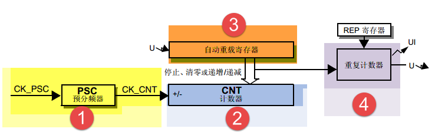

图 31‑5 高级定时器时基单元

高级控制定时器时基单元功能包括四个寄存器，分别是计数器寄存器(CNT)、预分频器寄存器(PSC)、自动重载寄存器(ARR)和重复计数器寄存器(RCR)。其中重复计数器RCR是高级定时器独有，通用和基本定时器没有。前面三个寄存器都是16位有效，TIMx_RCR寄存器是8位有效。

预分频器PSC
............

预分频器PSC，有一个输入时钟CK_PSC和一个输出时钟CK_CNT。输入时钟CK_PSC就是上面时钟源的
输出，输出CK_CNT则用来驱动计数器CNT计数。通过设置预分频器PSC的值可以得到不同的CK_CNT，实际
计算为：f\ :sub:`CK_CNT`\ 等于f\ :sub:`CK_PSC`/(PSC[15:0]+1)，可以实现1至65536分频。

计数器CNT
.............

高级控制定时器的计数器有三种计数模式，分别为递增计数模式、递减计数模式和递增/递减(中心对齐)计数模式。

(1) 递增计数模式下，计数器从0开始计数，每来一个CK_CNT脉冲计数器就增加1，直到计数器的值与
    自动重载寄存器ARR值相等，然后计数器又从0开始计数并生成计数器上溢事件，计数器总是如此循环计数。如果
    禁用重复计数器，在计数器生成上溢事件就马上生成更新事件(UEV)；如果使能重复计数器，每生成一次上溢事件重复计数器内容就减1，直到重复计数器内容为0时才会生成更新事件。

(2) 递减计数模式下，计数器从自动重载寄存器ARR值开始计数，每来一个CK_CNT脉冲计数器就减1，直到计数器值为0，然
    后计数器又从自动重载寄存器ARR值开始递减计数并生成计数器下溢事件，计数器总是如此循环计数。如果禁用重复计数器，
    在计数器生成下溢事件就马上生成更新事件；如果使能重复计数器，每生成一次下溢事件重复计数器内容就减1，直到重复计数器内容为0时才会生成更新事件。

(3) 中心对齐模式下，计数器从0开始递增计数，直到计数值等于(ARR-1)值生成计数器上溢事件，然后从ARR值开始递减计数
    直到1生成计数器下溢事件。然后又从0开始计数，如此循环。每次发生计数器上溢和下溢事件都会生成更新事件。

自动重载寄存器ARR
...................

自动重载寄存器ARR用来存放与计数器CNT比较的值，如果两个值相等就递减重复计数器。可以通过TIMx_CR1寄存器的ARPE位控制自动重载影子寄存器功能，如果ARPE位置1，自动重载影子寄存器有效，只有在事件更新时才把TIMx_ARR值赋给影子寄存器。如果ARPE位为0，则修改TIMx_ARR值马上有效。

重复计数器RCR
...................

在基本/通用定时器发生上/下溢事件时直接就生成更新事件，但对于高级控制定时器却不是这样，高级控制定时器在硬件结构上多出了重复计数器，在定时器发生上溢或下溢事件是递减重复计数器的值，只有当重复计数器为0时才会生成更新事件。在发生N+1个上溢或下溢事件(N为RCR的值)时产生更新事件。

④输入捕获
'''''''''

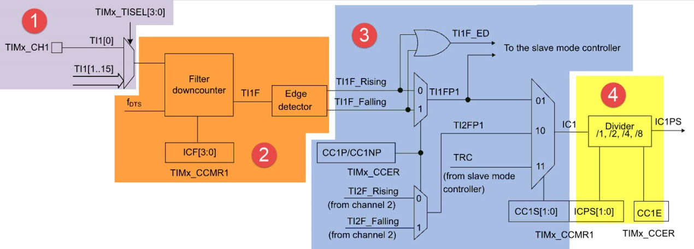

图 31‑6 输入捕获功能框图

输入捕获可以对输入的信号的上升沿，下降沿或者双边沿进行捕获，常用的有测量输入信号的脉宽和测量PWM输入信号的频率和占空比这两种。

输入捕获的大概的原理就是，当捕获到信号的跳变沿的时候，把计数器CNT的值锁存到捕获寄存器CCR中，把前后两次捕获到的CCR寄存器中的值相减，就可以算出脉宽或者频率。如果捕获的脉宽的时间长度超过你的捕获定时器的周期，就会发生溢出，这个我们需要做额外的处理。

①输入通道
...........

需要被测量的信号从定时器的外部引脚TIMx_CH1/2/3/4进入，通常叫TI1/2/3/4，在后面的捕获讲解中对于要被测量的信号我们都以TIx为标准叫法。

②输入滤波器和边沿检测器
.................................

当输入的信号存在高频干扰的时候，我们需要对输入信号进行滤波，即进行重新采样，根据采样定律，采样的频率必须大于等于两倍的输入信号。比如输入的信号为1M，又存在高频的信号干扰，那么此时就很有必要进行滤波，我们可以设置采样频率为2M，这样可以在保证采样到有效信号的基础上把高于2M的高频干扰信号过滤掉。

滤波器的配置由CR1寄存器的位CKD[1:0]和CCMR1/2的位ICxF[3:0]控制。从ICxF位的描述可知，采样频
率f\ :sub:`SAMPLE`\ 可以
由f\ :sub:`CK_INT`\ 和f\ :sub:`DTS`\ 分频后的时钟提供，其中是f\ :sub:`CK_INT`\ 内部
时钟，f\ :sub:`DTS`\ 是f\ :sub:`CK_INT`\ 经过
分频后得到的频率，分频因子由CKD[1:0]决定，可以是不分频，2分频或者是4分频。

边沿检测器用来设置信号在捕获的时候是什么边沿有效，可以是上升沿，下降沿，或者是双边沿，具体的由CCER寄存器的位CCxP和CCxNP决定。

③捕获通道
...........

捕获通道就是图中的IC1/2/3/4，每个捕获通道都有相对应的捕获寄存器CCR1/2/3/4，当发生捕获的时候，计数器CNT的值就会被锁存到捕获寄存器中。

这里我们要搞清楚输入通道和捕获通道的区别，输入通道是用来输入信号的，捕获通道是用来捕获输入信号的通道，一个输入通道的信号可以同时输入给两个捕获通道。比如输入通道TI1的信号经过滤波边沿检测器之后的TI1FP1和TI1FP2可以进入到捕获通道IC1和IC2，其实这就是我们后面要讲的PWM输入捕获，只有一路输入信号（TI1）却占用了两个捕获通道（IC1和IC2）。当只需要测量输入信号的脉宽时候，用一个捕获通道即可。输入通道和捕获通道的映射关系具体由寄存器CCMRx的位CCxS[1:0]配置。

④预分频器
...........

ICx的输出信号会经过一个预分频器，用于决定发生多少个事件时进行一次捕获。具体的由寄存器CCMRx的位ICxPSC配置，如果希望捕获信号的每一个边沿，则不分频。

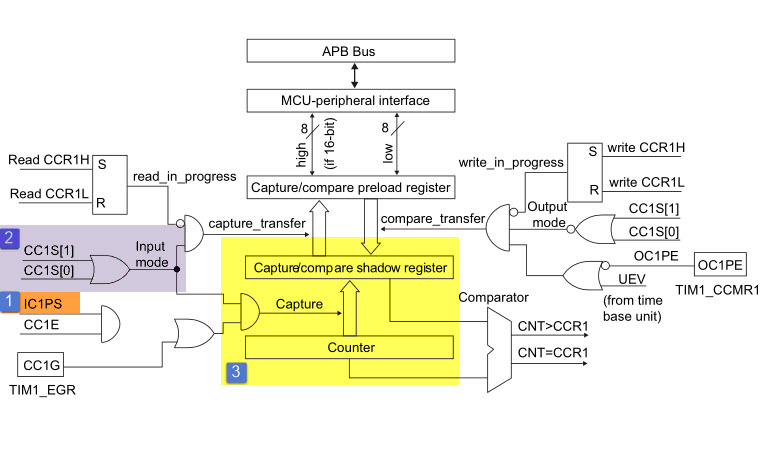

⑤捕获寄存器
...........

方框2中，表示的是TIMx_CCMRx寄存器中的CC1S位，只要CC1S不等于00，就会将通道配置为输入模式。经过预分频器的信号ICxPS是最终被捕获的信号（方框1），当发生捕获时（第一次），计数器CNT的值会被锁存到捕获寄存器CCR中（方框3），还会产生CCxI中断，相应的中断位CCxIF（在SR寄存器中）会被置位，通过软件或者读取CCR中的值可以将CCxIF清0。如果发生第二次捕获（即重复捕获：CCR 寄存器中已捕获到计数器值且 CCxIF 标志已置 1），则捕获溢出标志位CCxOF（在SR寄存器中）会被置位，CCxOF只能通过软件清零。

⑤输出比较
'''''''''

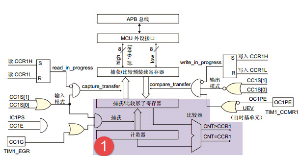

图 31‑7 输出比较功能框图

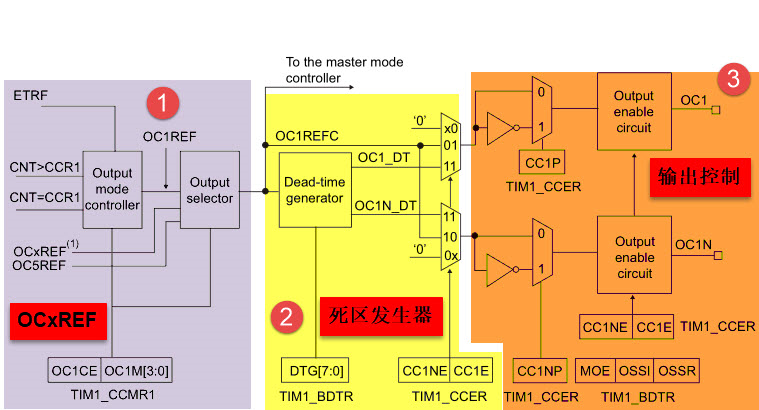

图 31‑7 输出比较功能框图(续)

输出比较就是通过定时器的外部引脚对外输出控制信号，有冻结、将通道X（x=1,2,3,4）设置为匹配时输出有效电平、将通道X设置为匹配时输出无效电平、翻转、强制变为无效电平、强制变为有效电平、PWM1和PWM2这八种模式，具体使用哪种模式由寄存器CCMRx的位OCxM[2:0]配置。其中PWM模式是输出比较中的特例，使用的也最多。

①比较寄存器
..............

当计数器CNT的值跟比较寄存器CCR的值相等的时候，输出参考信号OCxREF的信号的极性就会改变，其中OCxREF=1（高电平）称之为有效电平，OCxREF=0（低电平）称之为无效电平，并且会产生比较中断CCxI，相应的标志位CCxIF（SR寄存器中）会置位。然后OCxREF再经过一系列的控制之后就成为真正的输出信号OCx/OCxN。

②死区发生器
..............

在生成的参考波形OCxREF的基础上，可以插入死区时间，用于生成两路互补的输出信号OCx和OCxN，死区时间的大小具体由BDTR寄存器的位DTG[7:0]配置。死区时间的大小必须根据与输出信号相连接的器件及其特性来调整。下面我们简单举例说明下带死区的PWM信号的应用，我们以一个板桥驱动电路为例。

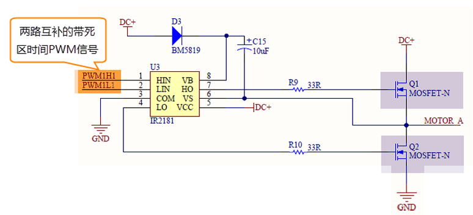

图 31‑8 半桥驱动电路

在这个半桥驱动电路中，Q1导通，Q2截止，此时我想让Q1截止Q2导通，肯定是要先让Q1截止一段时间之后，再等一段时间才让Q2导通，那么这段等待的时间就称为死区时间，因为Q1关闭需要时间（由MOS管的工艺决定）。如果Q1关闭之后，马上打开Q2，那么此时一段时间内相当于Q1和Q2都导通了，这样电路会短路。

图31_9_ 是针对上面的半桥驱动电路而画的带死区插入的PWM信号，图中的死区时间要根据MOS管的工艺来调节。

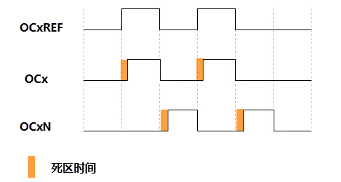

图 31‑9 带死区插入的互补输出

③输出控制
.............

在输出比较的输出控制中，参考信号OCxREF在经过死区发生器之后会产生两路带死区的互补信号OCx_DT和OCxN_DT（通道1~3才有互补信号，通道4没有，其余跟通道1~3一样），这两路带死区的互补信号然后就进入输出控制电路，如果没有加入死区控制，那么进入输出控制电路的信号就直接是OCxREF。

进入输出控制电路的信号会被分成两路，一路是原始信号，一路是被反向的信号，具体的由寄存器CCER的位CCxP和CCxNP控制。经过极性选择的信号是否由OCx引脚输出到外部引脚CHx/CHxN则由寄存器CCER的位CxE/CxNE配置。

如果加入了断路（刹车）功能，则断路和死区寄存器BDTR的MOE、OSSI和OSSR这三个位会共同影响输出的信号。

④输出引脚
.............

输出比较的输出信号最终是通过定时器的外部IO来输出的，分别为CH1/2/3/4，其中前面三个通道还有互补的输出通道CH1/2/3N。更加详细的IO说明还请查阅相关的数据手册。

⑥断路功能
'''''''''

断路功能就是电机控制的刹车功能，使能断路功能时，根据相关控制位状态修改输出信号电平。在任何情况下，OCx和OCxN输出都不能同时为有效电平，这关系到电机控制常用的H桥电路结构原因。

断路源可以是时钟故障事件，由内部复位时钟控制器中的时钟安全系统(CSS)生成，也可以是外部断路输入IO，两者是或运算关系。

系统复位启动都默认关闭断路功能，将断路和死区寄存器(TIMx_BDTR)的BKE为置1，使能断路功能。可通过TIMx_BDTR
寄存器的BKP位设置设置断路输入引脚的有效电平，设置为1时输入BRK为高电平有效，否则低电平有效。

发送断路时，将产生以下效果：

-  TIMx_BDTR
   寄存器中主输出模式使能(MOE)位被清零，输出处于无效、空闲或复位状态；

-  根据相关控制位状态控制输出通道引脚电平；当使能通道互补输出时，会根据情况自动控制输出通道电平；

-  将TIMx_SR 寄存器中的 BIF位置 1，并可产生中断和DMA传输请求。

-  如果 TIMx_BDTR 寄存器中的 自动输出使能(AOE)位置
   1，则MOE位会在发生下一个UEV事件时自动再次置 1。

输入捕获应用
~~~~~~~~~~~~

输入捕获一般应用在两个方面，一个方面是脉冲跳变沿时间测量，另一方面是PWM输入测量。

测量脉宽或者频率
''''''''''''''''''''

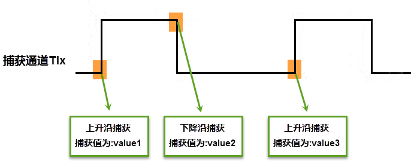

图 31‑11 脉宽/频率测量示意图

测量频率
.........

当捕获通道TIx上出现上升沿时，发生第一次捕获，计数器CNT的值会被锁存到捕获寄存器CCR中，而且还会进入捕获中断，在中断服务程序中记录一次捕获（可以用一个标志变量来记录），并把捕获寄存器中的值读取到value1中。当出现第二次上升沿时，发生第二次捕获，计数器CNT的值会再次被锁存到捕获寄存器CCR中，并再次进入捕获中断，在捕获中断中，把捕获寄存器的值读取到value3中，并清除捕获记录标志。利用value3和value1的差值我们就可以算出信号的周期（频率）。

测量脉宽
..........

当捕获通道TIx上出现上升沿时，发生第一次捕获，计数器CNT的值会被锁存到捕获寄存器CCR中，而且还会进入捕获中断，在中断服务程序中记录一次捕获（可以用一个标志变量来记录），并把捕获寄存器中的值读取到value1中。然后把捕获边沿改变为下降沿捕获，目的是捕获后面的下降沿。当下降沿到来的时候，发生第二次捕获，计数器CNT的值会再次被锁存到捕获寄存器CCR中，并再次进入捕获中断，在捕获中断中，把捕获寄存器的值读取到value3中，并清除捕获记录标志。然后把捕获边沿设置为上升沿捕获。

在测量脉宽过程中需要来回的切换捕获边沿的极性，如果测量的脉宽时间比较长，定时器就会发生溢出，溢出的时候会产生更新中断，我们可以在中断里面对溢出进行记录处理。

PWM输入模式
''''''''''''''

测量脉宽和频率还有一个更简便的方法就是使用PWM输入模式。与上面那种只使用一个捕获寄存器测量脉宽和频率的方法相比，PWM输入模式需要占用两个捕获寄存器。

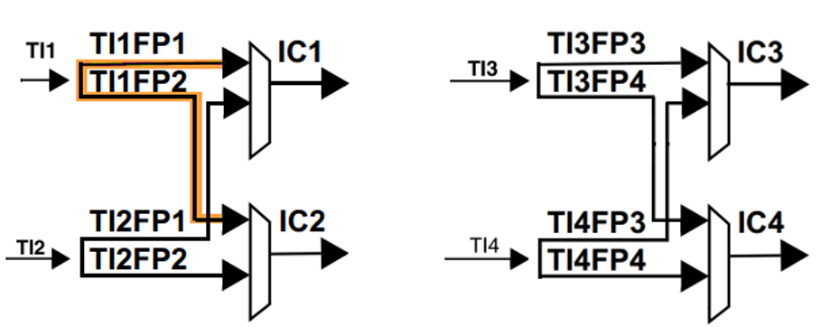

图 31‑12 输入通道和捕获通道的关系映射图

当使用PWM输入模式的时候，因为一个输入通道(TIx)会占用两个捕获通道(ICx)，所以一个定时器在使用PWM输入的时候最多只能使用两个输入通道(TIx)。

我们以输入通道TI1工作在PWM输入模式为例来讲解下具体的工作原理，其他通道以此类推即可。

PWM信号由输入通道TI1进入，因为是PWM输入模式的缘故，信号会被分为两路，一路是TI1FP1，另外一路是TI2FP2。其中一路是周期，另一路是占空比，具体哪一路信号对应周期还是占空比，得从程序上设置哪一路信号作为触发输入，作为触发输入的哪一路信号对应的就是周期，另一路就是对应占空比。作为触发输入的那一路信号还需要设置极性，是上升沿还是下降沿捕获，一旦设置好触发输入的极性，另外一路硬件就会自动配置为相反的极性捕获，无需软件配置。一句话概括就是：选定输入通道，确定触发信号，然后设置触发信号的极性即可，因为是PWM输入的缘故，另一路信号则由硬件配置，无需软件配置。

当使用PWM输入模式的时候必须将从模式控制器配置为复位模式（配置寄存器SMCR的位SMS[2:0]来实现），即当我们启动触发信号开始进行捕获的时候，同时把计数器CNT复位清零。

下面我们以一个更加具体的时序图来分析下PWM输入模式。

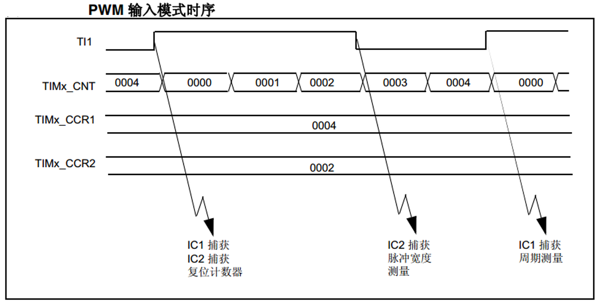

图 31‑13 PWM输入模式时序

PWM信号由输入通道TI1进入，配置TI1FP1为触发信号，上升沿捕获。当上升沿的时候IC1和IC2同时捕获，计数器CNT清零，到了下降沿的时候，IC2捕获，此时计数器CNT的值被锁存到捕获寄存器CCR2中，到了下一个上升沿的时候，IC1捕获，计数器CNT的值被锁存到捕获寄存器CCR1中。其中CCR2+1测量的是脉宽，CCR1+1测量的是周期。这里要注意的是CCR2和CCR1的值在计算占空比和频率的时候都必须加1，因为计数器是从0开始计数的。

从软件上来说，用PWM输入模式测量脉宽和周期更容易，付出的代价是需要占用两个捕获寄存器。

输出比较应用
~~~~~~~~~~~~

输出比较模式总共有8种，具体的由寄存器CCMRx的位OCxM[2:0]配置。我们这里只讲解最常用的PWM模式，其他几种模式具体的看数据手册即可。

PWM输出模式
'''''''''''''''

PWM输出就是对外输出脉宽（即占空比）可调的方波信号，信号频率由自动重装寄存器ARR的值决定，占空比由比较寄存器CCR的值决定。

PWM模式分为两种，PWM1和PWM2，总得来说是差不多，就看你怎么用而已，具体的区别见表格
31‑1。

表格 31‑1 PWM1与PWM2模式的区别

==== ================= =================================
模式 计数器CNT计算方式 说明
PWM1 递增              CNT<CCR，通道CH为有效，否则为无效
\    递减              CNT>CCR，通道CH为无效，否则为有效
PWM2 递增              CNT<CCR，通道CH为无效，否则为有效
\    递减              CNT>CCR，通道CH为有效，否则为无效
==== ================= =================================

下面我们以PWM1模式来讲解，以计数器CNT计数的方向不同还分为边沿对齐模式和中心对齐模式。PWM信号主要都是用来控制电机，一般的电机控制用的都是边沿对齐模式，FOC电机一般用中心对齐模式。我们这里只分析这两种模式在信号感官上（即信号波形）的区别，具体在电机控制中的区别不做讨论，到了你真正需要使用的时候就会知道了。

PWM边沿对齐模式
..................

| 在递增计数模式下，计数器从 0 计数到自动重载值（ TIMx_ARR
  寄存器的内容），然后重新
| 从 0 开始计数并生成计数器上溢事件

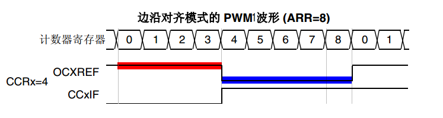

图 31‑14 PWM1模式的边沿对齐波形

在边沿对齐模式下，计数器CNT只工作在一种模式，递增或者递减模式。这里我们以CNT工作在递增模式为例，在中，ARR=8，CCR=4，CNT从0开始计数，当CNT<CCR的值时，OCxREF为有效的高电平，于此同时，比较中断寄存器CCxIF置位。当CCR=<CNT<=ARR时，OCxREF为无效的低电平。然后CNT又从0开始计数并生成计数器上溢事件，以此循环往复。

PWM中心对齐模式
................

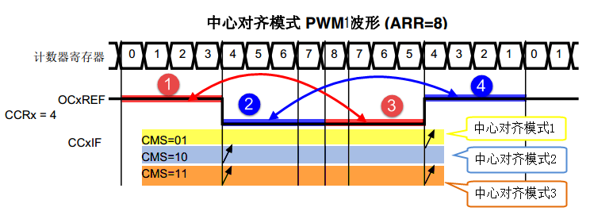

图 31‑15 PWM1模式的中心对齐波形

在中心对齐模式下，计数器CNT是工作做递增/递减模式下。开始的时候，计数器CNT从0
开始计数到自动重载值减1(ARR-1)，生成计数器上溢事件；然后从自动重载值开始向下计数到1 并生成计数器下溢事件。之后从0 开始重新计数。

图31_15_ 是PWM1模式的中心对齐波形，ARR=8，CCR=4。第一阶段计数器CNT工作在递增模式下，从0开始计数，当CNT<CCR的值
时，OCxREF为有效的高电平，当CCR=<CNT<<ARR时，OCxREF为无效的低电平。第二阶段计数器CNT工作在递减模式，从ARR的值开始递减，当CNT>CCR时，OCxREF为无效的低电平，当CCR=>CNT>=1时，OCxREF为有效的高电平。

在波形图上我们把波形分为两个阶段，第一个阶段是计数器CNT工作在递增模式的波形，这个阶段我们又分为①和②两个阶段，第二个阶段是计数器CNT工作在递减模式的波形，这个阶段我们又分为③和④两个阶段。要说中心对齐模式下的波形有什么特征的话，那就是①和③阶段的时间相等，②和④阶段的时间相等。

中心对齐模式又分为中心对齐模式1/2/3
三种，具体由寄存器CR1位CMS[1:0]配置。具体的区别就是比较中断中断标志位CCxIF在何时置1：中心模式1在CNT递减计数的时候置1，中心对齐模式2在CNT递增计数时置1，中心模式3在CNT递增和递减计数时都置1。

定时器初始化结构体详解
~~~~~~~~~~~~~~~~~~~~~~

HAL库函数对定时器外设建立了多个初始化结构体，分别为时基初始化结构体TIM_Base_InitTypeDef、输出比较初始化结构体TIM_OC_InitTypeDef、输入捕获初始化结构体TIM_IC_InitTypeDef、单脉冲初始化结构体TIM_OnePulse_InitTypeDef、编码器模式配置初始化结构体TIM_Encoder_InitTypeDef、断路和死区初始化结构体TIM_BreakDeadTimeConfigTypeDef，高级控制定时器可以用到所有初始化结构体，通用定时器不能使用TIM_BreakDeadTimeConfigTypeDef结构体，基本定时器只能使用时基结构体。初始化结构体成员用于设置定时器工作环境参数，并由定时器相应初始化配置函数调用，最终这些参数将会写入到定时器相应的寄存器中。

初始化结构体和初始化库函数配合使用是HAL库精髓所在，理解了初始化结构体每个成员意义基本上就可以对该外设运用自如。初始化结构体定义在stm32h7xx_hal_tim.h和stm32h7xx_hal_tim_ex.h文件中，初始化库函数定义在stm32h7xx_hal_tim.c和stm32h7xx_hal_tim_ex.c文件中，编程时我们可以结合这四个文件内注释使用。

TIM_HandleTypeDef
'''''''''''''''''''''''

TIM外设管理结构体TIM_HandleTypeDef用于管理TIM外设的资源。

代码清单 31‑1 定时器基本初始化结构体

.. code-block:: c
   :name: 代码清单31_1

    typedef struct {
        TIM_TypeDef              *Instance; /*!< 外设寄存器基地址 */
        TIM_Base_InitTypeDef     Init;   /*!< 定时器时基单元初始化结构体 */
        HAL_TIM_ActiveChannel    Channel;  /*!< TIM通道x */
        DMA_HandleTypeDef        *hdma[7]; /*!< DMA外设管理结构体 */
        HAL_LockTypeDef          Lock;     /*!< 锁资源 */
        __IO HAL_TIM_StateTypeDef   State; /*!< TIM工作状态 */
    } TIM_HandleTypeDef;

(1)	Instance：TIM寄存器基地址指针，所有参数都是指定基地址后才能正确写入寄存器。

(2)	Init：TIM时基单元初始化结构体，下面会详细讲解每一个成员。

(3)	Channel：TIMx的通道，可以选择HAL_TIM_ACTIVE_CHANNEL_1~HAL_TIM_ACTIVE_CHANNEL_6。

(4)	DMA_Handle：DMA外设管理结构体，用来配置TIM的DMA请求。

(5)	Lock：ADC锁资源。

(6)	State：TIM的工作状态。有HAL_TIM_STATE_READY，HAL_TIM_STATE_BUSY，HAL_TIM_STATE_TIMEOUT和HAL_TIM_STATE_ERROR等工作状态，方便用户排除错误。

TIM_Base_InitTypeDef
'''''''''''''''''''''''

.. code-block:: c
   :name: 代码清单31_1_1

    typedef struct {
        uint32_t Prescaler;         /*!< 预分频器 */
        uint32_t CounterMode;       /*!< 计数模式 */
        uint32_t Period;            /*!< 定时器周期*/
        uint32_t ClockDivision;     /*!< 时钟分频 */
        uint32_t RepetitionCounter;  /*!< 重复计数器 */
        uint32_t AutoReloadPreload;  /*!< 自动重装载寄存器的值 */
    } TIM_Base_InitTypeDef; 

(1) Prescaler：定时器预分频器设置，时钟源经该预分频器才是定时器计数时钟CK_CNT，它设定PSC寄存器的值。计算公式为：计数器时钟频率
    (f:sub:`CK_CNT`) 等于 f\ :sub:`CK_PSC` / (PSC[15:0] +
    1)，可实现1至65536分频。

(2)	CounterMode：定时器计数方式，可设置为向上计数、向下计数以及中心对齐。高级控制定时器允许选择任意一种。

(3)	Period：定时器周期，实际就是设定自动重载寄存器ARR的值，ARR 为要装载到实际自动重载寄存器（即影子寄存器）的值，可设置范围为0至65535。

(4)	ClockDivision：时钟分频，设置定时器时钟CK_INT频率与死区发生器以及数字滤波器采样时钟频率分频比。可以选择1、2、4分频。

(5)	RepetitionCounter：重复计数器，只有8位，只存在于高级定时器。

(6)	AutoReloadPreload：自动重装载计数器的值。当ARPE位置0时，自动重装载计算器的值会立刻生效。

TIM_OC_InitTypeDef
''''''''''''''''''

输出比较结构体TIM_OCInitTypeDef用于输出比较模式，与TIM_OCx_SetConfig函数配合使用完成指定定时器输出通道初始化配置。高级控制定时器有四个定时器通道，使用时都必须单独设置。

代码清单 31‑2 定时器比较输出初始化结构体

.. code-block:: c
   :name: 代码清单31_2

    typedef struct {
        uint32_t OCMode;        	// 比较输出模式
        uint32_t Pulse;   		// 脉冲宽度
        uint32_t OCPolarity;  	// 输出极性
        uint32_t OCNPolarity;      // 互补输出极性
        uint32_t OCFastMode;    	// 比较输出模式快速使能
        uint32_t OCIdleState;   	// 空闲状态下比较输出状态
        uint32_t OCNIdleState;  	// 空闲状态下比较互补输出状态
    } TIM_OCInitTypeDef;

(1) OCMode：比较输出模式选择，总共有八种，常用的为PWM1/PWM2。它设定CCMRx寄存器OCxM[2:0]位的值。

(2) Pulse：比较输出脉冲宽度，实际设定比较寄存器CCR的值，决定脉冲宽度。可设置范围为0至65535。

(3) OCPolarity：比较输出极性，可选OCx为高电平有效或低电平有效。它决定着定时器通道有效电平。它设定CCER寄存器的CCxP位的值。

(4) OCNPolarity：比较互补输出极性，可选OCxN为高电平有效或低电平有效。它设定TIMx_CCER寄存器的CCxNP位的值。

(5) OCFastMode：比较输出模式快速使能。它设定TIMx_CCMR寄存器的，OCxFE位的值可以快速使能或者禁能输出。

(6) OCIdleState：空闲状态时通道输出电平设置，可选输出1或输出0，即在空闲状态(BDTR_MOE位为0)时，经过死区时间
    后定时器通道输出高电平或低电平。它设定CR2寄存器的OISx位的值。

(7) OCNIdleState：空闲状态时互补通道输出电平设置，可选输出1或输出0，即在空闲状态(BDTR_MOE位为0)时，经过死区时间后
    定时器互补通道输出高电平或低电平，设定值必须与OCIdleState相反。它设定是CR2寄存器的OISxN位的值。

TIM_IC_InitTypeDef
''''''''''''''''''

输入捕获结构体TIM_IC_InitTypeDef用于输入捕获模式，与HAL_TIM_IC_ConfigChannel函数配合使用完成定时器输入通道初始化配置。如果使用PWM输入模式需要与HAL_TIM_PWM_ConfigChannel函数配合使用完成定时器输入通道初始化配置。

代码清单 31‑3 定时器输入捕获初始化结构体

.. code-block:: c
   :name: 代码清单31_3

    typedef struct {
        uint32_t ICPolarity;   // 输入捕获触发选择
        uint32_t ICSelection;  // 输入捕获选择
        uint32_t ICPrescaler;  // 输入捕获预分频器
        uint32_t ICFilter;     // 输入捕获滤波器
    } TIM_IC_InitTypeDef;

(1) ICPolarity：输入捕获边沿触发选择，可选上升沿触发、下降沿触发或边沿跳变触发。它设定CCER寄存器CCxP位和CCxNP位的值。

(2) ICSelection：输入通道选择，捕获通道ICx的信号可来自三个输入通道，分别为TIM_ICSELECTION_DIRECTTI、TIM_ICSELECTION_INDIRECTTI或TIM_ICSELECTION_TRC，具体的区别见图
    31‑16。它设定CCRMx寄存器的CCxS[1:0]位的值。

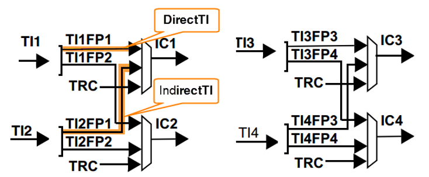

图 31‑16输入通道与捕获通道IC的映射图

(3) ICPrescaler：输入捕获通道预分频器，可设置1、2、4、8分频，它设定CCMRx寄存器的ICxPSC[1:0]位的值。如果需要
    捕获输入信号的每个有效边沿，则设置1分频即可。

(4) ICFilter：输入捕获滤波器设置，可选设置0x0至0x0F。它设定CCMRx寄存器ICxF[3:0]位的值。一般我们不使用滤波器，即设置为0。

TIM_BreakDeadTimeConfigTypeDef
'''''''''''''''''''''''''''''''''''

断路和死区结构体TIM_BreakDeadTimeConfigTypeDef用于断路和死区参数的设置，属于高级定时器专用，用于配置断路时通道输出状态，以及死区时间。它与HAL_TIMEx_ConfigBreakDeadTime函数配置使用完成参数配置。这个结构体的成员只对应BDTR这个寄存器，有关成员的具体使用配置请参考手册BDTR寄存器的详细描述。

代码清单 31‑4 断路和死区初始化结构体

.. code-block:: c
   :name: 代码清单31_4

    typedef struct {
        uint32_t OffStateRunMode;        // 运行模式下的关闭状态选择
        uint32_t OffStateIDLEMode;       // 空闲模式下的关闭状态选择
        uint32_t LockLevel;        	// 锁定配置
        uint32_t DeadTime;         	// 死区时间
        uint32_t BreakState;             // 断路输入使能控制
        uint32_t BreakPolarity;    	// 断路输入极性
        uint32_t BreakFilter;    		// 断路输入滤波器
        uint32_t Break2State;    		// 断路2输入使能控制
        uint32_t Break2Polarity;    	// 断路2输入极性
        uint32_t Break2Filter;    		// 断路2输入滤波器
        uint32_t AutomaticOutput;        // 自动输出使能
    } TIM_BreakDeadTimeConfigTypeDef;

(1)  OffStateRunMode：运行模式下的关闭状态选择，它设定BDTR寄存器OSSR位的值。

(2)  OffStateIDLEMode：空闲模式下的关闭状态选择，它设定BDTR寄存器OSSI位的值。

(3)  LockLevel：锁定级别配置， BDTR寄存器LOCK[1:0]位的值。

(4)  DeadTime：配置死区发生器，定义死区持续时间，可选设置范围为0x0至0xFF。它设定BDTR寄存器DTG[7:0]位的值。

(5)  BreakState：断路输入功能选择，可选使能或禁止。它设定BDTR寄存器BKE位的值。

(6)  BreakPolarity：断路输入通道BRK极性选择，可选高电平有效或低电平有效。它设定BDTR寄存器BKP位的值。

(7)  BreakFilter：断路输入滤波器，定义BRK 输入的采样频率和适用于
     BRK的数字滤波器带宽。它设定BDTR寄存器BKF[3:0]位的值。

(8)  Break2State：断路2输入功能选择，可选使能或禁止。它设定BDTR寄存器BK2E位的值。

(9)  Break2Polarity：断路2输入通道BRK2极性选择，可选高电平有效或低电平有效。它设定BDTR寄存器BK2P位的值。

(10) Break2Filter：断路2输入滤波器，定义BRK2 输入的采样频率和适用于
     BRK2的数字滤波器带宽。它设定BDTR寄存器BK2F[3:0]位的值。

(11) AutomaticOutput：自动输出使能，可选使能或禁止，它设定BDTR寄存器AOE位的值。

PWM互补输出实验
~~~~~~~~~~~~~~~

输出比较模式比较多，这里我们以PWM输出为例讲解，并通过示波器来观察波形。实验中不仅在主输出通道输出波形，还在互补通道输出与主通道互补的的波形，并且添加了断路和死区功能。

硬件设计
'''''''''''''''

根据开发板引脚使用情况，并且参考 表32_1_ 中定时器引脚信息
，使用TIM8的通道1及其互补通道作为本实验的波形输出通道，对应选择PC6和PA5引脚。将示波器的两个输入通道分别与PC6和PA5引脚短接，用于观察波形，还有注意共地。

为增加断路功能，需要用到TIM8_BKIN引脚，这里选择PA6引脚。程序我们设置该引脚为低电平有效，所以先使用杜邦线将该引脚与开发板上3.3V短接。

另外，实验用到两个按键用于调节PWM的占空比大小，直接使用开发板上独立按键即可，电路参考独立按键相关章节。

软件设计
'''''''''''''

这里只讲解核心的部分代码，有些变量的设置，头文件的包含等并没有涉及到，完整的代码请参考本章配套的工程。我们创建了两个文件：bsp_advance_tim.c和bsp_advance_tim.h文件用来存定时器驱动程序及相关宏定义。

编程要点
.............

(1) 定时器 IO 配置

(2) 定时器时基结构体TIM_HandleTypeDef配置

(3) 定时器输出比较结构体TIM_OC_InitTypeDef配置

(4) 定时器断路和死区结构体TIM_BreakDeadTimeConfigTypeDef配置

软件分析
............

宏定义
============

代码清单 31‑5 宏定义

.. code-block:: c
   :name: 代码清单31_5

    /* 定时器 */
    #define ADVANCE_TIM                     TIM8
    #define ADVANCE_TIM_CLK_ENABLE()        __TIM8_CLK_ENABLE()

    /* TIM8通道1输出引脚 */
    #define ADVANCE_OCPWM_PIN               GPIO_PIN_6
    #define ADVANCE_OCPWM_GPIO_PORT         GPIOC
    #define ADVANCE_OCPWM_GPIO_CLK_ENABLE()   __GPIOC_CLK_ENABLE()
    #define ADVANCE_OCPWM_AF          	GPIO_AF3_TIM8

    /* TIM8通道1互补输出引脚 */
    #define ADVANCE_OCNPWM_PIN                GPIO_PIN_5
    #define ADVANCE_OCNPWM_GPIO_PORT          GPIOA
    #define ADVANCE_OCNPWM_GPIO_CLK_ENABLE()  __GPIOA_CLK_ENABLE()
    #define ADVANCE_OCNPWM_AF         	GPIO_AF3_TIM8

    /* TIM8断路输入引脚 */
    #define ADVANCE_BKIN_PIN                  GPIO_PIN_6
    #define ADVANCE_BKIN_GPIO_PORT            GPIOA
    #define ADVANCE_BKIN_GPIO_CLK_ENABLE()    __GPIOA_CLK_ENABLE()
    #define ADVANCE_BKIN_AF           	     GPIO_AF3_TIM8

使用宏定义非常方便程序升级、移植。如果使用不同的定时器IO，修改这些宏即可。

定时器复用功能引脚初始化
============================

代码清单 31‑6 定时器复用功能引脚初始化

.. code-block:: c
   :name: 代码清单31_6

    static void TIMx_GPIO_Config(void)
    {
        /*定义一个GPIO_InitTypeDef类型的结构体*/
        GPIO_InitTypeDef GPIO_InitStructure;

        /*开启定时器相关的GPIO外设时钟*/
        ADVANCE_OCPWM_GPIO_CLK_ENABLE();
        ADVANCE_OCNPWM_GPIO_CLK_ENABLE();
        ADVANCE_BKIN_GPIO_CLK_ENABLE();

        /* 定时器功能引脚初始化 */
        GPIO_InitStructure.Pin = ADVANCE_OCPWM_PIN;
        GPIO_InitStructure.Mode = GPIO_MODE_AF_PP;
        GPIO_InitStructure.Pull = GPIO_NOPULL;
        GPIO_InitStructure.Speed = GPIO_SPEED_HIGH;
        GPIO_InitStructure.Alternate = ADVANCE_OCPWM_AF;
        HAL_GPIO_Init(ADVANCE_OCPWM_GPIO_PORT, &GPIO_InitStructure);

        GPIO_InitStructure.Pin = ADVANCE_OCNPWM_PIN;
        GPIO_InitStructure.Alternate = ADVANCE_OCNPWM_AF;
        HAL_GPIO_Init(ADVANCE_OCNPWM_GPIO_PORT, &GPIO_InitStructure);

        GPIO_InitStructure.Pin = ADVANCE_BKIN_PIN;
        GPIO_InitStructure.Alternate = ADVANCE_BKIN_AF;
        HAL_GPIO_Init(ADVANCE_BKIN_GPIO_PORT, &GPIO_InitStructure);
    }

定时器通道引脚使用之前必须设定相关参数，这选择复用功能，并指定到对应的定时器。使用GPIO之前都必须开启相应端口时钟。

定时器模式配置
=====================

代码清单 31‑7 定时器模式配置

.. code-block:: c
   :name: 代码清单31_7

    static void TIMx_Configuration(void)
    {
        //使能TIMx的时钟
        ADVANCE_TIM_CLK_ENABLE();
        //TIMx的外设寄存器基地址
        TIM_Handle.Instance = ADVANCE_TIM;
        //计数模式为向上计数，递增
        TIM_Handle.Init.CounterMode = TIM_COUNTERMODE_UP;
        /* 累计 TIM_Period个后产生一个更新或者中断*/
        //当定时器从0计数到9999，即为10000次，为一个定时周期
        TIM_Handle.Init.Period = 10000 - 1;
        //时钟不分频，即一个TIM_CLK时钟计1次
        TIM_Handle.Init.ClockDivision = TIM_CLOCKDIVISION_DIV1;
        //定时器时钟源TIMxCLK = 2 * PCLK1
        //        PCLK1 = HCLK / 4
        //        => TIMxCLK=HCLK/2=SystemCoreClock/2=200MHz
        // 设定定时器频率为=TIMxCLK/(TIM_Prescaler+1)=1000000Hz
        TIM_Handle.Init.Prescaler =  200 - 1;
        // 初始化定时器TIM
        HAL_TIM_PWM_Init(&TIM_Handle);

        /* 配置TIM为互补输出模式 */
        //互补输出，PWM1模式
        //计数值CNT小于比较值CCR（sConfig.Pulse），通道x为有效电平
        //计数值CNT大于比较值CCR（sConfig.Pulse），通道x为无效电平
        sConfig.OCMode = TIM_OCMODE_PWM1;
        //CHx的有效电平为高电平
        sConfig.OCPolarity = TIM_OCPOLARITY_HIGH;
        //CHx在空闲状态下为低电平
        sConfig.OCIdleState = TIM_OCNIDLESTATE_RESET;
        //CHxN在空闲状态下为高电平(必须与CHx相反)
        sConfig.OCNIdleState = TIM_OCIDLESTATE_SET;
        //CHxN的有效电平为高电平
        sConfig.OCNPolarity = TIM_OCNPOLARITY_HIGH;
        //比较器CCR的值
        sConfig.Pulse = ChannelPulse;
        //初始化输出比较通道
        HAL_TIM_PWM_ConfigChannel(&TIM_Handle, &sConfig, ADVANCE_TIM_CH);

        //使能自动输出功能
        sBreakDeadTimeConfig.AutomaticOutput = TIM_AUTOMATICOUTPUT_ENABLE;
        //断路输入极性：低电平有效
        sBreakDeadTimeConfig.BreakPolarity = TIM_BREAKPOLARITY_HIGH;
        //使能断路功能
        sBreakDeadTimeConfig.BreakState = TIM_BREAK_ENABLE;
        //死区时间：11*Fdts
        sBreakDeadTimeConfig.DeadTime = 11;
        //对寄存器提供写保护，级别越高，可操作的寄存器位越少
        sBreakDeadTimeConfig.LockLevel = TIM_LOCKLEVEL_1;
        //空闲模式下的断路状态，允许通道输出
        sBreakDeadTimeConfig.OffStateIDLEMode = TIM_OSSI_ENABLE;
        //运行模式下的断路状态，允许通道输出
        sBreakDeadTimeConfig.OffStateRunMode = TIM_OSSR_ENABLE;
        //配置TIM为死区，断路功能
        HAL_TIMEx_ConfigBreakDeadTime(&TIM_Handle, &sBreakDeadTimeConfig);
        //主动输出CHx使能
        HAL_TIM_PWM_Start(&TIM_Handle, ADVANCE_TIM_CH);
        //主动输出CHxN使能
        HAL_TIMEx_PWMN_Start(&TIM_Handle, ADVANCE_TIM_CH);
    }

首先定义三个定时器初始化结构体，定时器模式配置函数主要就是对这三个结构体的成员进行初始化，然后通过相应的初始化函数把这些参数写入定时器的寄存器中。有关结构体的成员介绍请参考定时器初始化结构体详解小节。

不同的定时器可能对应不同的APB总线，在使能定时器时钟是必须特别注意。高级控制定时器属于APB2，定时器内部时钟是200MHz。

在时基结构体中我们设置定时器周期参数10000，频率为1MHz，使用向上计数方式。因为我们使用的是内部时钟，所以外部时钟采样分频成员不需要设置，重复计数器我们没用到，也不需要设置。

在输出比较结构体中，设置输出模式为PWM1模式，主通道和互补通道输出高电平有效，设置脉宽为ChannelPulse，ChannelPulse是我们定义的一个无符号16位整形的全局变量，用来指定占空比大小，实际上脉宽就是设定比较寄存器CCR的值，用于跟计数器CNT的值比较。

断路和死区结构体中，使能断路功能，设定断路信号的有效极性，设定死区时间。

最后使用HAL_TIM_PWM_Start函数和HAL_TIMEx_PWMN_Start函数让计数器开始计数和通道输出。

主函数
=============

代码清单 31‑8 main函数

.. code-block:: c
   :name: 代码清单31_8

    int main(void)
    {

        /* 系统时钟初始化成400MHz */
        SystemClock_Config();
        /* 初始化按键GPIO */
        Key_GPIO_Config();
        /* 初始化基本定时器定时，1s产生一次中断 */
        TIM_Advance_Init();

        while (1) {
            /* 扫描KEY1 */
            if ( Key_Scan(KEY1_GPIO_PORT,KEY1_PIN) == KEY_ON  ) {
                /* 增大占空比 */
                if (ChannelPulse<10000)
                    ChannelPulse+=1000;
                else
                    ChannelPulse=10000;
                __HAL_TIM_SetCompare(&TIM_Handle,TIM_CHANNEL_1,ChannelPulse);
            }
            /* 扫描KEY2 */
            if ( Key_Scan(KEY2_GPIO_PORT,KEY2_PIN) == KEY_ON  ) {
                /* 减小占空比 */
                if (ChannelPulse>=1000)
                    ChannelPulse-=1000;
                else
                    ChannelPulse=0;
                __HAL_TIM_SetCompare(&TIM_Handle,TIM_CHANNEL_1,ChannelPulse);
            }
        }
    }

首先，调用初始化系统时钟，Key_GPIO_Config函数完成按键引脚初始化配置，该函数定义在bsp_key.c文件中。

接下来，调用TIMx_Configuration函数完成定时器参数配置，包括定时器复用引脚配置和定时器模式配置，该函数定义在bsp_advance_tim.c文件中它实际上只是简单的调用TIMx_GPIO_Config函数和TIM_Mode_Config函数。运行完该函数后通道引脚就已经有PWM波形输出，通过示波器可直观观察到。

最后，在无限循环函数中检测按键状态，如果是KEY1被按下，就增加ChannelPulse变量值，并调用TIM_SetCompare1函数完成增加占空比设置；如果是KEY2被按下，就减小ChannelPulse变量值，并调用TIM_SetCompare1函数完成减少占空比设置。TIM_SetCompare1函数实际是设定TIMx_CCR1寄存器值。

下载验证
............

根据实验的硬件设计内容接好示波器输入通道和开发板引脚连接，并把断路输入引脚拉高。编译实验程序并下载到开发板上，调整示波器到合适参数，在示波器显示屏和看到一路互补的PWM波形，参考
图31_17_。此时，按下开发板上KEY1或KEY2可改变波形的占空比。断路功能特别注意断路引脚需要接高电平才会正常输出PWM，如果接低电平输出会变成默认电平而不会输出PWM.

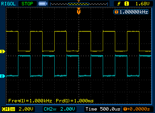

图 31‑17 互补波形输出示波器图

PWM输入捕获实验
~~~~~~~~~~~~~~~~~~~~

实验中，我们用通用定时器产生已知频率和占空比的PWM信号，然后用高级定时器的PWM输入模式来测量这个已知的PWM信号的频率和占空比，通过两者的对比即可知道测量是否准确。

硬件设计
'''''''''''

实验中用到两个引脚，一个是通用定时器通道用于波形输出，另一个是高级控制定时器通道用于输入捕获，实验中直接使用一根杜邦线短接即可。

软件设计
''''''''''''

这里只讲解核心的部分代码，有些变量的设置，头文件的包含等并没有涉及到，完整的代码请参考本章配套的工程。我们创建了两个文件：bsp_advance_tim.c和bsp_advance_tim.h文件用来存定时器驱动程序及相关宏定义。

编程要点
..............

(1)	通用定时器产生PWM配置

(2)	高级定时器PWM输入配置

(3)	计算测量的频率和占空比，并打印出来比较

软件分析
...............

宏定义
===========

.. code-block:: c
   :caption: 代码清单 31‑9 宏定义
   :name: 代码清单31_9

    //通用定时器宏定义
    #define GENERAL_TIM                       TIM2
    #define GENERAL_TIM_CLK_ENABLE()          __TIM2_CLK_ENABLE()
    #define GENERAL_TIM_CH                    TIM_CHANNEL_1
    //通用定时器TIM通道CH1宏定义
    #define GENERAL_TIM_CHx_CLK()            __GPIOA_CLK_ENABLE()
    #define GENERAL_TIM_CHx_PORT             GPIOA
    #define GENERAL_TIM_CHx_PIN              GPIO_PIN_5

    //高级定时器宏定义
    #define ADVANCE_TIM                       TIM8
    #define ADVANCE_TIM_CLK_ENABLE()          __TIM8_CLK_ENABLE()
    #define ADVANCE_TIM_CH                    TIM_CHANNEL_1
    //TIM通道CH1的引脚宏定义
    #define ADVANCE_TIM_CHx_CLK()             __GPIOC_CLK_ENABLE()
    #define ADVANCE_TIM_CHx_PORT              GPIOC
    #define ADVANCE_TIM_CHx_PIN               GPIO_PIN_6
    //TIM通道CH1N的引脚宏定义
    #define ADVANCE_TIM_CHxN_CLK()            __GPIOA_CLK_ENABLE()
    #define ADVANCE_TIM_CHxN_PORT             GPIOA
    #define ADVANCE_TIM_CHxN_PIN              GPIO_PIN_5

    #define ADVANCE_TIM_IRQ                   TIM8_CC_IRQn
    #define ADVANCE_TIM_IRQHandler            TIM8_CC_IRQHandler

使用宏定义非常方便程序升级、移植。如果使用不同的定时器IO，修改这些宏即可。

定时器复用功能引脚初始化
===========================

代码清单 31‑10 定时器复用功能引脚初始化

.. code-block:: c
   :name: 代码清单31_10

    static void TIMx_GPIO_Configuration(void)
    {
        GPIO_InitTypeDef GPIO_InitStruct;
        //使能高级定时器的引脚时钟
        ADVANCE_TIM_CHx_CLK();
        //使能通用定时器的引脚时钟
        GENERAL_TIM_CHx_CLK();

        GPIO_InitStruct.Mode = GPIO_MODE_AF_PP;
        GPIO_InitStruct.Pull = GPIO_NOPULL;
        GPIO_InitStruct.Speed = GPIO_SPEED_FREQ_HIGH ;

        GPIO_InitStruct.Pin = GENERAL_TIM_CHx_PIN;
        GPIO_InitStruct.Alternate = GPIO_AF1_TIM2;
        HAL_GPIO_Init(GENERAL_TIM_CHx_PORT, &GPIO_InitStruct);

        GPIO_InitStruct.Pin = ADVANCE_TIM_CHx_PIN;
        GPIO_InitStruct.Alternate = GPIO_AF3_TIM8;
        HAL_GPIO_Init(ADVANCE_TIM_CHx_PORT, &GPIO_InitStruct);
    }

定时器通道引脚使用之前必须设定相关参数，这选择复用功能，并指定到对应的定时器。使用GPIO之前都必须开启相应端口时钟。

嵌套向量中断控制器组配置
==================================

.. code-block:: c

    static void ADVANCE_TIM_NVIC_Config(void)
    {
        HAL_NVIC_SetPriority(ADVANCE_TIM_IRQ, 0, 0);
        HAL_NVIC_EnableIRQ(ADVANCE_TIM_IRQ);
    }

实验用到高级控制定时器捕获/比较中断，需要配置中断优先级，因为实验只用到一个中断，所以这里对优先级配置没具体要求，只要符合中断组参数要求即可。

通用定时器PWM输出
=================

代码清单 31‑11 定时器模式配置

.. code-block:: c
   :name: 代码清单31_11

    static void TIMx_Output_Configuration(void)
    {
        //使能TIMx的时钟
        GENERAL_TIM_CLK_ENABLE();
        //TIMx的外设寄存器基地址
        TIM_PWMOUTNPUT_Handle.Instance = GENERAL_TIM;
        //计数模式为向上计数，递增
        TIM_PWMOUTNPUT_Handle.Init.CounterMode = TIM_COUNTERMODE_UP;
        /* 累计 TIM_Period个后产生一个更新或者中断*/
        //当定时器从0计数到9999，即为10000次，为一个定时周期
        TIM_PWMOUTNPUT_Handle.Init.Period = 10000 - 1;
        //时钟不分频，即一个TIM_CLK时钟计1次
        TIM_PWMOUTNPUT_Handle.Init.ClockDivision = TIM_CLOCKDIVISION_DIV1;
        //定时器时钟源TIMxCLK = 2 * PCLK1
        //        PCLK1 = HCLK / 4
        //        => TIMxCLK=HCLK/2=SystemCoreClock/2=200MHz
        // 设定定时器频率为=TIMxCLK/(TIM_Prescaler+1)=1000000Hz
        TIM_PWMOUTNPUT_Handle.Init.Prescaler =  200 - 1;
        // 初始化定时器TIM
        HAL_TIM_PWM_Init(&TIM_PWMOUTNPUT_Handle);

        /* 配置TIM为互补输出模式 */
        //互补输出，PWM1模式
        //计数值CNT小于比较值CCR（sConfig.Pulse），通道x为有效电平
        //计数值CNT大于比较值CCR（sConfig.Pulse），通道x为无效电平
        sConfig.OCMode = TIM_OCMODE_PWM1;
        //CHx的有效电平为高电平
        sConfig.OCPolarity = TIM_OCPOLARITY_HIGH;
        //CHx在空闲状态下为低电平
        sConfig.OCIdleState = TIM_OCNIDLESTATE_RESET;
        //CHxN在空闲状态下为高电平(必须与CHx相反)
        sConfig.OCNIdleState = TIM_OCIDLESTATE_SET;
        //CHxN的有效电平为高电平
        sConfig.OCNPolarity = TIM_OCNPOLARITY_HIGH;
        //比较器CCR的值
        sConfig.Pulse = ChannelPulse;
        //初始化输出比较通道
        HAL_TIM_OC_ConfigChannel(&TIM_PWMOUTNPUT_Handle, &sConfig, GENERAL_TIM_CH);

        //主动输出CHx使能
        HAL_TIM_OC_Start(&TIM_PWMOUTNPUT_Handle, GENERAL_TIM_CH);

    }

定时器PWM输出模式配置函数很简单，看代码注释即可。这里我们设置了PWM的频率为100Hz，
即周期为10ms，占空比为：(Pulse+1)/(Period+1) = 50%。

高级控制定时PWM输入模式
============================

代码清单 PWM输入模式配置

.. code-block:: c
   :name: 代码清单PWM输入模式配置

    static void TIMx_Input_Configuration(void)
    {
    
        TIM_IC_InitTypeDef TIM_IC_Config;
        TIM_SlaveConfigTypeDef TIM_SlaveConfig;
    
        //使能TIMx的时钟
        ADVANCE_TIM_CLK_ENABLE();
        //TIMx的外设寄存器基地址
        TIM_PWMINPUT_Handle.Instance = ADVANCE_TIM;
        //计数模式为向上计数，递增
        TIM_PWMINPUT_Handle.Init.CounterMode = TIM_COUNTERMODE_UP;
        /* 累计 TIM_Period个后产生一个更新或者中断*/
        //当定时器从0计数到9999，即为10000次，为一个定时周期
        TIM_PWMINPUT_Handle.Init.Period = 10000;
        //时钟不分频，即一个TIM_CLK时钟计1次
        TIM_PWMINPUT_Handle.Init.ClockDivision = TIM_CLOCKDIVISION_DIV1;
        //定时器时钟源TIMxCLK = 2 * PCLK1
        //        PCLK1 = HCLK / 4
        //        => TIMxCLK=HCLK/2=SystemCoreClock/2=200MHz
        // 设定定时器频率为=TIMxCLK/(TIM_Prescaler+1)=100Hz
        TIM_PWMINPUT_Handle.Init.Prescaler =  200 - 1;
        // 初始化定时器TIM
        HAL_TIM_PWM_Init(&TIM_PWMINPUT_Handle);
    
        /* IC1捕获：上升沿触发TI1FP1 */
        TIM_IC_Config.ICPolarity = TIM_ICPOLARITY_RISING;
        TIM_IC_Config.ICFilter = 0;
        TIM_IC_Config.ICPrescaler = TIM_ICPSC_DIV1;
        TIM_IC_Config.ICSelection = TIM_ICSELECTION_DIRECTTI;
        HAL_TIM_IC_ConfigChannel(&TIM_PWMINPUT_Handle, &TIM_IC_Config, ADVANCE_TIM_IC_CH1);
        /* IC2捕获：上升沿触发TI1FP2 */
        TIM_IC_Config.ICPolarity = TIM_ICPOLARITY_FALLING;
        TIM_IC_Config.ICFilter = 0;
        TIM_IC_Config.ICPrescaler = TIM_ICPSC_DIV1;
        TIM_IC_Config.ICSelection = TIM_ICSELECTION_INDIRECTTI;
        HAL_TIM_IC_ConfigChannel(&TIM_PWMINPUT_Handle, &TIM_IC_Config, ADVANCE_TIM_IC_CH2);
        /* 选择从模式: 复位模式 */
        TIM_SlaveConfig.SlaveMode = TIM_SLAVEMODE_RESET;
        /* 选择定时器输入触发: TI1FP1 */
        TIM_SlaveConfig.InputTrigger = TIM_TS_TI1FP1;
        HAL_TIM_SlaveConfigSynchronization(&TIM_PWMINPUT_Handle,&TIM_SlaveConfig);
    
        HAL_TIM_IC_Start_IT(&TIM_PWMINPUT_Handle,ADVANCE_TIM_IC_CH1);
        HAL_TIM_IC_Start_IT(&TIM_PWMINPUT_Handle,ADVANCE_TIM_IC_CH2);
    } 

输入捕获配置中，主要初始化三个结构体，时基结构体部分很简单，看注释理解即可。关键部分是输入捕获结构体和从模式结构体的初始化。

首先，我们要选定捕获通道，这里我们用IC1，然后设置捕获信号的极性，这里我们配置为上升沿，我们需要对捕获信号的每个有效边沿（即我们设置的上升沿）都捕获，所以我们不分频，滤波器我们也不需要用。那么捕获通道的信号来源于哪里呢？IC1的信号可以是TI1输入的TI1FP1，也可以是从TI2输入的TI2FP1，我们这里选择直连（DIRECTTI），即IC1映射到TI1FP1，即PWM信号从TI1输入。

我们知道，PWM输入模式，需要使用两个捕获通道，占用两个捕获寄存器。由输入通道TI1输入的信号会分成TI1FP1和TI1FP2，具体选择哪一路信号作为捕获触发信号决定着哪个捕获通道测量的是周期。这里我们选择TI1FP1作为捕获的触发信号，那PWM信号的周期则存储在CCR1寄存器中，剩下的另外一路信号TI1FP2则进入IC2，CCR2寄存器存储的是脉冲宽度。

测量脉冲宽度我们选择捕获通道2，即IC2，设置捕获信号的极性，这里我们配置为下降沿，我们需要对捕获信号的每个有效边沿（即我们设置的下降沿）都捕获，所以我们不分频，滤波器我们也不需要用。那么捕获通道的信号来源于TI2输入的TI2FP1，这里选择间接（INDIRECTTI），T1的PWM信号进入IC2。这里配置通道2，主要为了是T1的输入连接到IC2，T2的输入连接到IC1。满足图 3 13 输入通道和捕获通道的关系映射图的映射关系。

I2C作为间接输入模式，我们需要配置他的从模式，即从模式复位模式，定时器触发源为TIM_TS_TI1FP1，最后使用函数HAL_TIM_SlaveConfigSynchronization进行配置。

最后调用函数HAL_TIM_IC_Start_IT启动定时器的两个通道捕获。

高级控制定时器中断服务函数
============================

.. code-block:: c
   :caption: 代码清单 高级控制定时器中断服务函数

    void HAL_TIM_IC_CaptureCallback(TIM_HandleTypeDef *htim)
    {
        if (htim->Channel == HAL_TIM_ACTIVE_CHANNEL_1) {
            /* 获取输入捕获值 */
            IC1Value = HAL_TIM_ReadCapturedValue(&TIM_PWMINPUT_Handle,TIM_CHANNEL_1);
            IC2Value = HAL_TIM_ReadCapturedValue(&TIM_PWMINPUT_Handle,TIM_CHANNEL_2);
            if (IC1Value != 0) {
                /* 占空比计算 */
                DutyCycle = (float)((IC2Value+1) * 100) / (IC1Value+1);
    
                /* 频率计算 */
                Frequency = 200000000/200/(float)(IC1Value+1);
    
            } else {
                DutyCycle = 0;
                Frequency = 0;
            }
        }
    }

中断服务函数的回调函数中，我们获取CCR1和CCR2寄存器中的值，当CCR1的值不为0时，说明有效捕获到了一个周期，然后计算出频率和占空比。

如果是第一个上升沿中断，计数器会被复位，锁存到CCR1寄存器的值是0，CCR2寄存器的值也是0，无法计算频率和占空比。当第二次上升沿到来的时候，CCR1和CCR2捕获到的才是有效的值。

主函数
==============

代码清单 31‑12 main函数

.. code-block:: c
   :name: 代码清单31_12

    int main(void)
    {

        /* 系统时钟初始化成400MHz */
        SystemClock_Config();
        /* 初始化串口 */
        DEBUG_USART_Config();
        /* 初始化基本定时器定时，1s产生一次中断 */
        TIM_Advance_Init();

        while (1) {
            HAL_Delay(500);
            printf("IC1Value = %d  IC2Value = %d ",IC1Value,IC2Value);
            printf("占空比：%0.2f%%   频率：%0.2fHz\n",DutyCycle,Frequency);
        }
    }

主函数内容非常简单，首先初始化系统时钟、调用DEBUG_USART_Config函数完成串口初始化配置，该函定义在bsp _usart.c文件内。

接下来就是调用TIM_Advance_Init函数完成定时器配置，该函数定义在bsp_advance_tim.c文件内，它只是简单的分别调用TIMx_GPIO_Configuration ()、ADVANCE_TIM_NVIC_Config ()、TIMx_Output_Configuration ()和TIMx_Input_Configuration ()四个函数，完成定时器引脚初始化配置，NVIC配置，通用定时器输出PWM以及高级控制定时器PWM输入模式配置。

主函数的无限循环每隔500ms输出一次捕获结果。

下载验证
'''''''''''''

根据硬件设计内容结合软件设计的引脚宏定义参数，用杜邦线连接通用定时器PWM输出引脚和高级控制定时器的输入捕获引脚。
使用USB线连接开发板上的“USB TO UART”接口到电脑，电脑端配置好串口调试助手参数。编译实验程序并下载到开发板上，
程序运行后在串口调试助手可接收到开发板发过来有关测量波形的参数信息。
