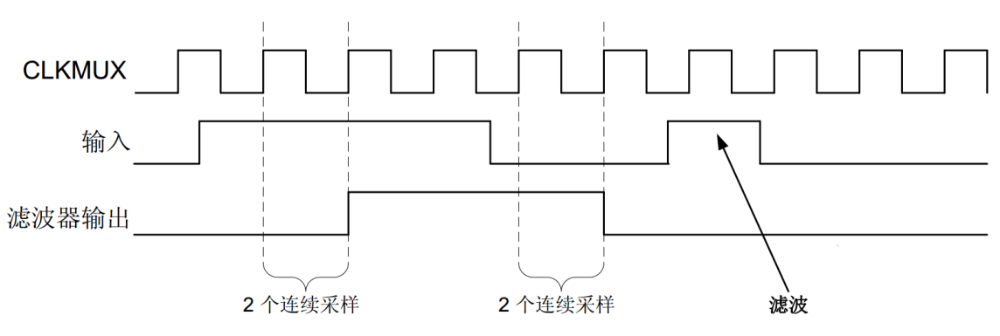

LPTIM—低功耗定时器
------------------

本章参考资料：《STM32H743用户手册》、《STM32H743xI规格书》、库帮助文档《STM32H753xx_User_Manual.chm》

学习本章时，配合《STM32H743用户手册》低功耗定时器章节一起阅读，效果会更佳，特别是涉及到寄存器说明的部分。

特别说明，本书内容是以STM32H743系列控制器资源讲解。

低功耗定时器
~~~~~~~~~~~~

LPTIM 是一个 16 位定时器，顾名思义他就是可以实现低功耗应用的一个特殊定时器。由于时钟源的多样性，LPTIM 能够在除待机模式以外的所有电源模式下保持运行。即使没有内部时钟源， LPTIM 也能运行，鉴于这一点，可将其用作“脉冲计数器”，这种脉冲计数器在某些应用中十分有用。此外， LPTIM 还能将系统从低功耗模式唤醒，因此非常适合实现“超时功能”，而且功耗极低。

LPTIM 引入了一个灵活的时钟方案，该方案能够提供所需的功能和性能，同时还能最大程度地降低功耗。

LPTIM时基单元包含一个16位自动重载计数器ARR，一个16位的递增计数器CNT，一个3位可编程预分频器可以采用8种分频系数（1、2、4、8、16、32、64、128），预分频器时钟源有多种可选，有内部时钟源： LSE、 LSI、 HSI 或 APB 时钟、外部时钟ULPTIM 输入的外部时钟源（在没有 LP 振荡器运行的情况下工作，由脉冲计数器应用使用）。

低功耗定时器功能框图
~~~~~~~~~~~~~~~~~~~~

低功耗定时器功能框图包含了低功耗定时器最核心内容，掌握了功能框图，对低功耗定时器就有一个整体的把握，在编程时思路就非常清晰，见 高级控制定时器功能框图_。

.. image:: media/image1.png
   :align: center
   :alt: 高级控制定时器功能框图
   :name: 高级控制定时器功能框图

高级控制定时器功能框图

①时钟源
'''''''

低功耗定时器有多个时钟源可选：

-  内部时钟源APB时钟，PCLK1=100MHz(默认)

-  内部时钟LSE

-  内部时钟LSI

-  内部时钟HIS

-  外部输入引脚提供时钟

当通过外部时钟源提供时钟时，LPTIM可以在下述两种可能配置中的其中一种配置下运行：

(1) LPTIM 通过外部信号提供时钟，但同时通过 APB 或 LSE、 LSI 和
    HSI等任何其他内置振荡器为 LPTIM 提供内部时钟信号。

(2) LPTIM
    仅由外部时钟源通过外部输入提供时钟。此配置可在进入低功耗模式后所有内置振荡器关闭时，用于实现超时功能或脉冲计数器功能。

对 CKSEL 和 COUNTMODE 位进行编程，可控制 LPTIM使用外部时钟源还是内部时钟源。

当使用外部时钟源时，可使用 CKPOL位选择外部时钟信号的有效边沿。如果上升沿和下降沿均为有效边沿，
则还应提供内部时钟信号（第一种配置）。在这种情况下，内部时钟信号频率应至少为外部时钟信号频率的五倍。

②干扰滤波器
'''''''''''

LPTIM 输入（外部或内部）由数字滤波器保护，避免任何毛刺和噪声干扰在 LPTIM
内部传播，从而防止产生意外计数或触发。在激活数字滤波器之前，首先应向
LPTIM
提供内部时钟源，这是保证滤波器正常工作的必要条件。特别注意不提供内部时钟信号时，必须通过将
CKFLT 和 TRGFLT 位设为 0
来停用数字滤波器。在这种情况下，可使用外部模拟滤波器来防止 LPTIM
外部输入产生干扰。

数字滤波器分为两组:

(1) 第一组数字滤波器保护 LPTIM外部输入。数字滤波器的敏感性由 CKFLT
    位控制。

(2) 第二组数字滤波器保护 LPTIM 内部触发输入。数字滤波器的敏感性由 TRGFLT
    位控制。

数字滤波器的敏感性以组为单位进行控制。无法单独配置同一组内各个数字滤波器的敏感性。滤波器的敏感性会影响相同的连续采样的数量，在其中一个
LPTIM 输入上检测到此类连续采样时，才能将某信号电平变化视为有效切换。干扰滤波器时序图_ 给出了编程 2 个连续采样时，干扰滤波器的时序图。

干扰滤波器时序图

③预分频器
'''''''''

LPTIM 16 位计数器前面要有一个可配置的 2 次幂预分频器。预分频器的分频比由
PRESC[2:0]3 位域进行控制。表
33‑1预分频器的分频比列出了所有可能的分频比：

表 33‑1预分频器的分频比

+------+----------+
| 编程 | 分频系数 |
+======+==========+
| 000  | /1       |
+------+----------+
| 001  | /2       |
+------+----------+
| 010  | /4       |
+------+----------+
| 011  | /8       |
+------+----------+
| 100  | /16      |
+------+----------+
| 101  | /32      |
+------+----------+
| 110  | /64      |
+------+----------+
| 111  | /128     |
+------+----------+

④触发多路复用器
'''''''''''''''

| LPTIM 计数器可通过软件启动，也可以在 8
  个触发输入之一上检测到有效边沿后启动。
| TRIGEN[1:0] 用于确定 LPTIM 触发源：

TRIGEN[1:0] 等于“ 00”时， LPTIM 计数器会在通过软件将 CNTSTRT 位或
SNGSTRT位其中之一置 1 后立即启动。

TRIGEN[1:0] 的其余三个可能的值用于配置触发输入使用的有效边沿。 LPTIM
计数器会在检测到有效边沿后立即启动。

TRIGEN[1:0] 不等于“ 00”时， TRIGSEL[2:0] 用于选择使用 8
个触发输入中的哪一个来启动计数器。

外部触发信号视为 LPTIM
的异步信号。因此，检测到触发信号后，由于同步问题，需要延迟两个计数器时钟周期，定时器才能开始运行。

外部触发信号视为 LPTIM
的异步信号。因此，检测到触发信号后，由于同步问题，需要延迟两个计数器时钟周期，定时器才能开始运行。必须使能定时器，才能将
SNGSTRT/CNTSTRT 位置
1。当定时器禁止时，对这些位执行的任何写操作都将被硬件丢弃。

⑤生成PWM
''''''''

两个 16 位寄存器， LPTIMx_ARR（自动重载寄存器）和
LPTIMx_CMP（比较寄存器）用于在 LPTIM 输出上生成多个不同的波形。

定时器可生成以下波形：

(1) PWM 模式：若 LPTIMx_CMP 寄存器与 LPTIMx_CNT 寄存器匹配，则会立即将
    LPTIM输出置 1。若 LPTIMx_ARR 寄存器与 LPTIMx_CNT
    寄存器匹配，则会立即将 LPTIM输出复位。

(2) 单脉冲模式：对于第一个脉冲，输出波形与 PWM
    模式输出波形类似，随后输出将永久复位。

(3) 置 1
    一次模式：除输出保持最后一个信号电平外（取决于配置的输出极性），输出波形与单脉冲模式输出波形类似。

上述模式要求 LPTIMx_ARR 寄存器的值严格大于 LPTIMx_CMP 寄存器的值。

LPTIM 输出波形可通过 WAVE 位配置，具体如下:

若将 WAVE 位复位为 0，则会强制 LPTIM 生成 PWM
波形或单脉冲波形，具体取决于将哪个位（ CNTSTRT 或 SNGSTRT）置 1。

若将 WAVE 位置 1，则会强制 LPTIM 生成置 1 一次波形。

WAVPOL 位控制 LPTIM
输出极性。更改立即生效，因此输出默认值将在极性重新配置后立即更改，甚至会在定时器使能前进行更改。

生成的信号的频率高达 LPTIM 时钟频率 2 分频。 给出了可能在 LPTIM
输出上生成的三种波形。此外，此图还显示了通过 WAVPOL
位更改极性所产生的效果。

生成PWM时序图

⑥计数器模式
'''''''''''

LPTIM 计数器可用于对 LPTIM Input1
上的外部事件进行计数，也可用于对内部时钟周期进行计数。 CKSEL 位和
COUNTMODE 位用于控制将使用哪些源更新计数器。

若使用 LPTIM 对 Input1
上的外部事件进行计数，计数器可在上升沿、下降沿或两种边沿进行更新，具体取决于写入
CKPOL[1:0] 位的值。

根据 CKSEL 和 COUNTMODE 值，可选择以下计数模式

CKSEL = 0： LPTIM 由内部时钟源提供时钟

COUNTMODE = 0

| 当 LPTIM 由内部时钟源提供时钟，且 LPTIM 计数器根据在 LPTIM 外部 Input1
  上
| 检测到的有效边沿进行更新时，不得对提供给 LPTIM 的内部时钟进行预分频
| （ PRESC[2:0] = “ 000”）。

COUNTMODE = 1

| LPTIM 外部 Input1 通过提供给 LPTIM
  的内部时钟采样。因此，为了不丢失任何事
| 件，外部 Input1 信号变化的频率决不应超过提供给 LPTIM
  的内部时钟的频率。
| • CKSEL = 1： LPTIM 由外部时钟源提供时钟

COUNTMODE 值不相关。

| 在这种配置下， LPTIM 无需内部时钟源（已使能干扰滤波器时除外）。注入到
  LPTIM
| 外部 Input1 的信号用作 LPTIM
  的系统时钟。此配置适合未使能任何内置振荡器的工作
| 模式。

| 对于这种配置， LPTIM 计数器可以在 input1
  时钟信号的上升沿或下降沿进行更新，但
| 不可在上升沿和下降沿均更新。

由于注入到 LPTIM 外部 Input1 的信号也可用于 LPTIM
的时钟，计数器递增计数前存在

一些初始延时（使能 PTIM 后）。更确切地说， LPTIM 外部 Input1
的前五个有效边沿将丢失（使能PTIM后）。

⑦编码器模式
'''''''''''

此模式用于处理来自正交编码器的信号，此正交编码器用于检测旋转元件的角度位置。编码器接口模式就相当于带有方向选择的外部时钟。这意味着，计数器仅在
0 到
LPTIMx_ARR寄存器中编程的自动重载值之间进行连续计数（根据具体方向，从 0
递增计数到 ARR，或从 ARR 递减计数到 0）。因此，在启动前必须先配置
LPTIMx_ARR。通过两个外部输入信号 Input1 和 Input2 生成时钟信号作为 LPTIM
计数器时钟。这两个信号间的相位确定计数方向。

仅当 LPTIM 由内部时钟源提供时钟时才可使用编码器模式。 Input1 和 Input2
输入上的信号频率不得超过 LPTIM 内部时钟频率 4
分频。必须满足此条件才能确保 LPTIM 正常工作。

方向变化由 LPTIMx_ISR 寄存器中的两个递减和递增标志指示。此外，如果通过
LPTIMx_IER寄存器使能，还可为两种方向变化事件产生中断。

要激活编码器模式，必须将 ENC 位置 1。 LPTIM 必须首先配置为连续模式。

当编码器模式激活时， LPTIM
计数器按照增量编码器的速度和方向自动修改。因此，其内容始终代表编码器的位置。计数方向由递增和递减标志指示，对应于所连传感器的旋转方向。根据使用
CKPOL[1:0]
位配置的边沿敏感性，可得几种不同的计数方案。下表汇总了可能的组合（假设
Input1 和 Input2 不同时切换）。

表 33‑2预分频器的分频比

下图所示为编码器模式下配置了两种边沿敏感性的计数序列。特别注意在此模式下，
LPTIM 必须由内部时钟源提供时钟，因此 CKSEL 位必须保持其复位值
0。另外，预分频器分频比必须等于其复位值 1（ PRESC[2:0] 位必须为“
000”）。

编码器模式计数序列

定时器初始化结构体详解
~~~~~~~~~~~~~~~~~~~~~~

初始化结构体和初始化库函数配合使用是HAL库精髓所在，理解了初始化结构体每个成员意义基本上就可以对该外设运用自如。初始化结构体定义在stm32h7xx_hal_lptim.h中，初始化库函数定义在stm32h7xx_hal_lptim.c c文件中，编程时我们可以结合这两个文件内注释使用。

LPTIM_HandleTypeDef
'''''''''''''''''''

时基结构体LPTIM_HandleTypeDef用于定时器基础参数设置，与HAL_LPTIM_Init函数配合使用完成配置。

代码清单  低功耗定时器基本初始化结构体（stm32h7xx_hal_lptim.h文件）

.. code-block:: c
   :name: 代码清单 低功耗定时器基本初始化结构体

    typedef struct {
        LPTIM_TypeDef                  *Instance;  //句柄，寄存器基地址
        LPTIM_InitTypeDef              Init;       // LPTIM初始化结构体
        HAL_StatusTypeDef              Status;     // HAL状态
        HAL_LockTypeDef                Lock;       // LPTIM锁定对象
        __IO  HAL_LPTIM_StateTypeDef   State;      // LPTIM 外设状态
    } LPTIM_HandleTypeDef;

(1) \*Instance：定义低功耗定时器外设的基地址，所有寄存器的操作都基于这个基地址操作。

(2) Init：低功耗定时器初始化结构体，用于初始化定时器的参数。

(3) Status：HAL库初始化状态。

(4) Lock：LPTIM锁定对象，开始初始化的时候上锁，结束初始化的时候解锁，避免初始化被打断。

(5) State：LPTIM 外设初始化状态。

LPTIM_InitTypeDef
'''''''''''''''''

低功耗定时器初始化结构体LPTIM_InitTypeDef用于定时器基础参数设置，与HAL_LPTIM_Init函数配合使用完成配置。

代码清单 定时器基本初始化结构体

.. code-block:: c
   :name: 代码清单 定时器基本初始化结构体（stm32h7xx_hal_lptim.h文件）

    typedef struct {
        LPTIM_ClockConfigTypeDef     Clock;  /*!< 配置时钟参数 */
        LPTIM_ULPClockConfigTypeDef UltraLowPowerClock;/*!<配置超低功耗时钟参数 */
        LPTIM_TriggerConfigTypeDef   Trigger;/*!< 配置定时器触发参数 */
        uint32_t      OutputPolarity;/*!< 配置输出极性 */
        uint32_t      UpdateMode;/*!< 配置定时器更新模式 */
        uint32_t      CounterSource;/*!< 配置计数器基于内部或者外部事件触发递增 */
        uint32_t      Input1Source;/*!< 选择外部输入1的时钟来源*/
        uint32_t      Input2Source;/*!< 选择外部输入2的时钟来源 */
    } LPTIM_InitTypeDef; 

(1)	Clock：定时器时钟参数的设置，通过clock结构体配置时钟输入源及分频系数。

(2)	UltraLowPowerClock：定时器超低功耗时钟参数的设置， 选择超低功耗时钟源之后改组设置才生效。可设置时钟极性和时钟的采样时间。

(3)	Trigger：配置定时器触发参数，配置触发源、触发有效边沿、触发采样时间。

(4)	OutputPolarity：配置输出极性。

(5)	UpdateMode：配置定时器的更新模式。

(6)	CounterSource：配置计数器基于内部或者外部事件触发递增。

(7)	Input1Source：选择外部输入1的时钟来源，用于提供LPTIM时钟。

(8)	Input1Source：选择外部输入2的时钟来源，只适用于LPTIM1和LPTIM2的编码器模式。

PWM输出实验
~~~~~~~~~~~

这里我们以PWM输出为例讲解，介绍MCU在低功耗的情况下输出PWM，并通过示波器来观察波形。实验中配置LPTIM输出PWM然后进入停机模式，这个时候一直会有波形产生，直到按键唤醒退出低功耗模式，然后软件控制停止输出波形。

硬件设计
''''''''''''

根据开发板引脚使用情况，并且参考规格书中引脚信息
，使用PD13(LPTIM1_OUT)作为本实验的波形输出通道。将示波器的第一个输入通道与PD13引脚短接，用于观察波形，还有注意共地。

为增加低功耗唤醒功能，需要用到按键KEY2。程序我们设置该引脚为下降沿有效，按下按键会产生一个下降沿，程序响应中断，MCU退出低功耗模式恢复正常模式。

软件设计
''''''''''''

这里只讲解核心的部分代码，有些变量的设置，头文件的包含等并没有涉及到，完整的代码请参考本章配套的工程。我们创建了两个文件：bsp_lptim.c和bsp_lptim.h文件用来存定时器驱动程序及相关宏定义。

编程要点
^^^^^^^^^^^^

(1) 定时器 IO 配置

(2) 定时器时基结构体LPTIM_HandleTypeDef配置

(3) 定时器输出比较结构体LPTIM_InitTypeDef配置

(4) 定时器周期占空比配置

软件分析
^^^^^^^^^^

宏定义
==========

代码清单 宏定义

.. code-block:: c
   :name: 代码清单 宏定义

    #define LSE                               1
    #define LSI                               2
    //选择内部时钟的来源
    #define LPTIMx_CLK_Source                 LSI

    //引脚定义
    /*******************************************************/
    #define LPTIMx_CLK_ENABLE()               __LPTIM1_CLK_ENABLE()
    #define LPTIMx_Instance                   LPTIM1

    #define LPTIMx_OUT_GPIO_CLK_ENABLE()      __GPIOD_CLK_ENABLE()
    #define LPTIMx_OUT_GPIO_PORT              GPIOD
    #define LPTIMx_OUT_PIN                    GPIO_PIN_13
    #define LPTIMx_OUT_AF                     GPIO_AF1_LPTIM1

使用宏定义非常方便程序升级、移植。如果使用不同的定时器IO，修改这些宏即可。

定时器复用功能引脚初始化
============================

代码清单 定时器复用功能引脚初始化

.. code-block:: c
   :name: 代码清单 定时器复用功能引脚初始化

    void LPTIM_GPIO_Config(void)
    {
        GPIO_InitTypeDef GPIO_InitStructure;
        /*开启LPTIM1引脚的时钟*/
        LPTIMx_OUT_GPIO_CLK_ENABLE();
        /*选择按键的引脚*/
        GPIO_InitStructure.Pin = LPTIMx_OUT_PIN;
        /*设置引脚为复用推捖模式*/
        GPIO_InitStructure.Mode = GPIO_MODE_AF_PP;
        /*设置引脚不上拉也不下拉*/
        GPIO_InitStructure.Pull = GPIO_PULLUP;
        GPIO_InitStructure.Speed = GPIO_SPEED_FREQ_HIGH;
        GPIO_InitStructure.Alternate = LPTIMx_OUT_AF;
        /*使用上面的结构体初始化按键*/
        HAL_GPIO_Init(LPTIMx_OUT_GPIO_PORT, &GPIO_InitStructure);
    }

定时器通道引脚使用之前必须设定相关参数，这选择复用功能，并指定到对应的定时器。使用GPIO之前都必须开启相应端口时钟。

定时器模式配置
=================

代码清单 定时器模式配置

.. code-block:: c
   :name: 代码清单 定时器模式配置（bsp_lptim.c文件）

    void LPTIM_MODE_Config(void)
    {
    
        RCC_PeriphCLKInitTypeDef RCC_PeriphCLKInitStruct;
        uint32_t PeriodValue;
        uint32_t PulseValue;
        RCC_PeriphCLKInitStruct.PeriphClockSelection = RCC_PERIPHCLK_LPTIM1;
        /* 选择LSI时钟作为LPTIM时钟源 */
    #if (LPTIMx_CLK_Source == LSI)
        RCC_PeriphCLKInitStruct.Lptim1ClockSelection = RCC_LPTIM1CLKSOURCE_LSI;
        /* 选择LSE时钟作为LPTIM时钟源 */
    #elif (LPTIMx_CLK_Source == LSE)
        RCC_PeriphCLKInitStruct.Lptim1ClockSelection = RCC_LPTIM1CLKSOURCE_LSE;
    #endif
        HAL_RCCEx_PeriphCLKConfig(&RCC_PeriphCLKInitStruct);
        /*开启LPTIM1的时钟*/
    
        LPTIMx_CLK_ENABLE();
        /* 定义定时器的句柄即确定定时器寄存器的基地址*/
        LPTIM_Handle.Instance = LPTIMx_Instance;
        //选择内部时钟源LPTIM_CLK = LSE=32.768KHz
        LPTIM_Handle.Init.Clock.Source = LPTIM_CLOCKSOURCE_APBCLOCK_LPOSC;
        // 定时器时钟分频系数
        LPTIM_Handle.Init.Clock.Prescaler = LPTIM_PRESCALER_DIV1;
        // 定时器计数源，内部
        LPTIM_Handle.Init.CounterSource = LPTIM_COUNTERSOURCE_INTERNAL;
        // 触发源，软件触发
        LPTIM_Handle.Init.Trigger.Source  = LPTIM_TRIGSOURCE_SOFTWARE;
        // 定时器输出极性
        LPTIM_Handle.Init.OutputPolarity  = LPTIM_OUTPUTPOLARITY_HIGH;
        // 定时器更新方式
        LPTIM_Handle.Init.UpdateMode      = LPTIM_UPDATE_IMMEDIATE;
    
        HAL_LPTIM_Init(&LPTIM_Handle);
        /*PWM模式配置*/
        /*当定时器从0计数到99，即为100次，
        为一个定时周期PWM周期，32.768KHz/100=327.68Hz*/
        PeriodValue = 100-1;
        /*PWM脉冲为周期一半即50% */
        PulseValue = 50-1;
        HAL_LPTIM_PWM_Start(&LPTIM_Handle, PeriodValue, PulseValue);
    }

首先定义低功耗定时器初始化结构体，定时器模式配置函数主要就是对这两个个结构体的成员进行初始化，然后通过相应的初始化函数把这些参数写入定时器的寄存器中。有关结构体的成员介绍请参考低功耗定时器初始化结构体详解小节。

不同的定时器可能对应不同的时钟源，在使能定时器时钟是必须特别注意。低功耗定时器我们选择LSI作为时钟源，即32KHz。

输出PWM我们只需确定两个参数，PeriodValue为波形周期，这里设置为100，周期为32 KHz/100=32Hz，PulseValue为周期的一半，即占空比为50%，最后使用库函数HAL_LPTIM_PWM_Start直接产生波形。

低功耗模式输出波形，按键唤醒退出
====================================

代码清单 LPTIM_PWM_OUT函数

.. code-block:: c
   :name: 代码清单 LPTIM_PWM_OUT函数

    void LPTIM_PWM_OUT(void)
    {
        LPTIM_GPIO_Config();

        LPTIM_Mode_Config();
        /* 进入低功耗模式 */
        HAL_PWR_EnterSTOPMode(PWR_LOWPOWERREGULATOR_ON, PWR_STOPENTRY_WFI);
        /* 等待系统被按键KEY2唤醒，退出低功耗模式后停止输出PWM */
        HAL_LPTIM_PWM_Stop(&LPTIM_Handle);
    }

首先，初始化定时器的输出引脚，然后配置定时器输出PWM，接着进入低功耗模式，此时示波器可以观察到波形持续输出PWM，直到按键2下才退出低功耗模式，程序控制停止输出PWM。由于程序会进入低功耗模式，此时再烧录其他程序会提示MCU还没上电启动，这个时候只需要按下按键2即可启动并可以正常烧录。

主函数
============

代码清单 main函数

.. code-block:: c
   :name: 代码清单 main函数

    int main(void)
    {

        /* 系统时钟初始化成400MHz */
        SystemClock_Config();
        /* 初始化低速时钟为32.768KHz */
        LPTIM_ClockEnable();
        /* 初始化按键GPIO */
        Key_GPIO_Config();
        /* 低功耗定时器在低功耗模式输出PWM */
        LPTIM_PWM_OUT();
        while (1) {

        }
    }

首先，调用初始化系统时钟和低速时钟，Key_GPIO_Config函数完成按键引脚初始化配置，该函数定义在bsp_key.c文件中，其中KEY2配置为上升沿中断模式。

接下来，调用LPTIM_PWM_OUT函数完成定时器参数配置，包括定时器复用引脚配置和定时器模式配置，该函数定义在bsp_advance_tim.c文件中它实际上只是简单的调用TIMx_GPIO_Config函数和TIM_Mode_Config函数。接着调用HAL_PWR_EnterSTOPMode函数进入低功耗模式，此时会一直输出PWM，知道按键KEY2产生中断才退出低功耗模式，并使用HAL_LPTIM_PWM_Stop函数停止输出PWM。

下载验证
^^^^^^^^

根据实验的硬件设计内容接好示波器输入通道和开发板引脚连接。编译实验程序并下载到开发板上，
调整示波器到合适参数，在示波器显示屏看到一路PWM波形，参考 低功耗定时输出PWM_。
如果按下开发板上KEY2则会退出低功耗模式，PWM波形也会停止输出。

低功耗定时输出PWM
