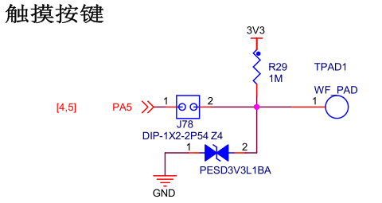

TIM—电容按键检测
----------------

本章参考资料：《STM32H74xxx参考手册》、《STM32F7xx规格书》、库帮助文档《STM32F779xx_User_Manual.chm》。

前面章节我们讲解了基本定时器和高级控制定时器功能，这一章我们将介绍定时器输入捕获一个应用实例，帮助我们更加深入理解定时器。

电容按键原理
~~~~~~~~~~~~

电容器(简称为电容)就是可以容纳电荷的器件，两个金属块中间隔一层绝缘体就可以构成一个最简单的电容。如
图32_1_ (俯视图)，有两个金属片，之间有一个绝缘介质，这样就构成了一个电容。这样一个电容在电路板上非常容易
实现，一般设计四周的铜片与电路板地信号连通，这样一种结构就是电容按键的模型。当电路板形状固定之后，该电容的容量也是相对稳定的。

图 32‑1 片状电容器

电路板制作时都会在表面上覆盖一层绝缘层，用于防腐蚀和绝缘，所以实际电路板设计时情况如
图32_2_。电路板最上层是绝缘材料，下面一层是导电铜箔，我们根据电路走线情况设计决定铜箔的形状，再下面一层一
般是FR-4板材。金属感应片与地信号之间有绝缘材料隔着，整个可以等效为一个电容Cx。一般在设计时候，把金属感应片设计成方便手指触摸大小。

图 32‑2 无手指触摸情况

在电路板未上电时，可以认为电容Cx是没有电荷的，在上电时，在电阻作用下，电容Cx就会有一个充电过程，直到电容充满，即Vc电压值为3.3V，这个充电过程的时间长短受到电阻R阻值和电容Cx容值的直接影响。但是在我们选择合适电阻R并焊接固定到电路板上后，这个充电时间就基本上不会变了，因为此时电阻R已经是固定的，电容Cx在无外界明显干扰情况下基本上也是保持不变的。

现在，我们来看看当我们用手指触摸时会是怎样一个情况？如
图32_3_，当我们用手指触摸时，金属感应片除了与地信号形成一个等效电容Cx外，还会与手指形成一个Cs等效电容。

图 32‑3 有手指触摸情况

此时整个电容按键可以容纳的电荷数量就比没有手指触摸时要多了，可以看成是Cx和Cs叠加的效果。在相同的电阻R情况下，因为电容容值增大了，导致需要更长的充电时间。也就是这个充电时间变长使得我们区分有无手指触摸，也就是电容按键是否被按下。

现在最主要的任务就是测量充电时间。充电过程可以看出是一个信号从低电平变成高电平的过程，现在就是要求出这个变化过程的时间。我们可以利用定时器输入捕获功能计算充电时间，即设置TIMx_CH为定时器输入捕获模式通道。这样先测量得到无触摸时的充电时间作为比较基准，然后再定时循环测量充电时间与无触摸时的充电时间作比较，如果超过一定的阈值就认为是有手指触摸。

图32_4_ 为Vc跟随时间变化情况，可以看出在无触摸情况下，电压变化较快；而在有触摸时，总的电容量增大了，电压变化缓慢一些。

图 32‑4 Vc电压与充电时间关系

为测量充电时间，我们需要设置定时器输入捕获功能为上升沿触发，
图32_4_ 中V\ :sub:`H`\ 就是被触发上升沿的电压值，也是STM32认为是高电平的最低电压值，大
约为1.8V。t1和t2可以通过定时器捕获/比较寄存器获取得到。

不过，在测量充电时间之前，我们必须想办法制作这个充电过程。之前的分析是在电路板上电时会有充电过程，现在我们要求在程序运行中循环检测按键，所以必须可以控制充电过程的生成。我们可以控制TIMx_CH引脚作为普通的GPIO使用，使其输出一小段时间的低电平，为电容Cx放电，即Vc为0V。当我们重新配置TIMx_CH为输入捕获时电容Cx在电阻R的作用下就可以产生充电过程。

电容按键检测实验
~~~~~~~~~~~~~~~~

电容按键不需要任何外部机械部件，使用方便，成本低，很容易制成与周围环境相密封的键盘，以起到防潮防湿的作用。电容按键优势突出使得越来越多电子产品使用它代替传统的机械按键。

本实验实现电容按键状态检测方法，提供一个编程实例。

硬件设计
^^^^^^^^

开发板板载一个电容按键，原理图设计参考 图32_5_。

图 32‑5 电容按键电路设计

标示TPAD1在电路板上就是电容按键实体，它通过一根导线连接至定时器通道引脚，这里选用的电阻阻值为1M。

实验还用到调试串口和蜂鸣器功能，用来打印输入捕获信息和指示按键状态，这两个模块电路可参考之前相关章节。

软件设计
^^^^^^^^

这里只讲解核心的部分代码，有些变量的设置，头文件的包含等并没有涉及到，完整的代码请参考本章配套的工程。我们创建了两个文件：bsp_touchpad.c和bsp_touchpad.h文件用来存放电容按键检测相关函数和宏定义。

编程要点
''''''''

(1) 初始化蜂鸣器、调试串口以及系统滴答定时器；

(2) 配置定时器基本初始化结构体并完成定时器基本初始化；

(3) 配置定时器输入捕获功能；

(4) 使能电容按键引脚输出低电平为电容按键放电；

(5) 待放电完整后，配置为输入捕获模式，并获取输入捕获值，该值即为无触摸时输入捕获值；

(6) 循环执行电容按键放电、读取输入捕获值检过程，将捕获值与无触摸时捕获值对比，以确定电容按键状态。

软件分析
''''''''

电容按键宏定义
==================

代码清单 32‑1 宏定义

.. code-block:: c
   :name: 代码清单32_1

    #define TPAD_TIMx                   TIM2
    #define TPAD_TIM_CLK_ENABLE()     __TIM2_CLK_ENABLE()

    #define TPAD_TIM_Channel_X          TIM_CHANNEL_1
    #define TPAD_TIM_GetCaptureX        TIM_GetCapture1

    #define TPAD_TIM_GPIO_CLK_ENABLE()  __GPIOA_CLK_ENABLE()
    #define TPAD_TIM_CH_PORT            GPIOA
    #define TPAD_TIM_CH_PIN             GPIO_PIN_5
    #define TPAD_TIM_AF                 GPIO_AF1_TIM2

使用宏定义非常方便程序升级、移植。

开发板选择使用通用定时器2的通道1连接到电容按键，对应的引脚为PA5。

定时器初始化配置
=====================

定时器初始化配置

.. code-block:: c

    static void TIMx_CHx_Cap_Init(uint32_t arr,uint16_t psc)
    {
        GPIO_InitTypeDef  GPIO_InitStructure;
        TIM_IC_InitTypeDef sConfigIC;
        //使能TIM时钟
        TPAD_TIM_CLK_ENABLE();
        //使能通道引脚时钟
        TPAD_TIM_GPIO_CLK_ENABLE();
        //端口配置
        GPIO_InitStructure.Pin = TPAD_TIM_CH_PIN;
        //复用功能
        GPIO_InitStructure.Mode = GPIO_MODE_AF_PP;
        GPIO_InitStructure.Alternate = TPAD_TIM_AF;
        GPIO_InitStructure.Speed = GPIO_SPEED_HIGH;
        //不带上下拉
        GPIO_InitStructure.Pull = GPIO_NOPULL;
        HAL_GPIO_Init(TPAD_TIM_CH_PORT, &GPIO_InitStructure);
        //初始化TIM
        //设定计数器自动重装值
        TIM_Handle.Instance = TPAD_TIMx;
        TIM_Handle.Init.Prescaler = psc;
        TIM_Handle.Init.CounterMode = TIM_COUNTERMODE_UP;
        TIM_Handle.Init.RepetitionCounter = 0;
        TIM_Handle.Init.Period = arr;
        TIM_Handle.Init.ClockDivision = TIM_CLOCKDIVISION_DIV1;
        HAL_TIM_IC_Init(&TIM_Handle);
        //上升沿触发
        sConfigIC.ICPolarity = TIM_INPUTCHANNELPOLARITY_RISING;
        // 输入捕获选择
        sConfigIC.ICSelection = TIM_ICSELECTION_DIRECTTI;
        //配置输入分频,不分频
        sConfigIC.ICPrescaler = TIM_ICPSC_DIV1;
        //配置输入滤波器 不滤波
        sConfigIC.ICFilter = 0;
        //初始化捕获通道
        HAL_TIM_IC_ConfigChannel(&TIM_Handle, &sConfigIC, TPAD_TIM_Channel_X);
        //启动TIM
        HAL_TIM_IC_Start(&TIM_Handle, TPAD_TIM_Channel_X);
    }

首先定义三个初始化结构体变量，这三个结构体之前都做了详细的介绍，可以参考相关章节理解。

使用外设之前都必须开启相关时钟，这里开启定时器时钟和定时器通道引脚对应端口时钟，并指定定时器通道引脚复用功能。

接下来初始化配置定时器通道引脚为复用功能，无需上下拉。

然后，配置定时器功能。定时器周期和预分频器值由函数形参决定，采用向上计数方式。指定输入捕获通道，电容按键检测需要采用上升沿触发方式。

最后，启动定时器。

电容按键复位
=====================

电容按键复位

.. code-block:: c

    static void TPAD_Reset(void)
    {
        GPIO_InitTypeDef  GPIO_InitStructure;
        //配置引脚为普通推挽输出
        GPIO_InitStructure.Pin = TPAD_TIM_CH_PIN;
        GPIO_InitStructure.Mode = GPIO_MODE_OUTPUT_PP;
        GPIO_InitStructure.Speed = GPIO_SPEED_HIGH;
        GPIO_InitStructure.Pull = GPIO_PULLDOWN;
        HAL_GPIO_Init(TPAD_TIM_CH_PORT, &GPIO_InitStructure);

        //输出低电平,放电
        HAL_GPIO_WritePin ( TPAD_TIM_CH_PORT,
        TPAD_TIM_CH_PIN ,GPIO_PIN_RESET);
        //保持一小段时间低电平，保证放电完全
        HAL_Delay(5);

        //清除更新标志
        __HAL_TIM_CLEAR_FLAG(&TIM_Handle,TIM_FLAG_CC1);
        __HAL_TIM_CLEAR_FLAG(&TIM_Handle,TIM_FLAG_UPDATE);
        //计数器归0
        __HAL_TIM_SET_COUNTER(&TIM_Handle,0);
        //引脚配置为复用功能，不上、下拉
        GPIO_InitStructure.Pin = TPAD_TIM_CH_PIN;
        GPIO_InitStructure.Mode = GPIO_MODE_AF_PP;
        GPIO_InitStructure.Alternate = TPAD_TIM_AF;
        GPIO_InitStructure.Speed = GPIO_SPEED_HIGH;
        GPIO_InitStructure.Pull = GPIO_NOPULL;
        HAL_GPIO_Init(TPAD_TIM_CH_PORT,&GPIO_InitStructure);
    }

该函数实现两个主要功能：控制电容按键放电和复位计数器。

首先，配置定时器通道引脚作为普通GPIO，使其为下拉的推挽输出模式。然后调用HAL_GPIO_WritePin函数输出低电平，为保证放电完整，需要延时一小会时间，这里调用HAL_Delay函数完成5毫秒的延时。HAL_Delay函数是定义在STM32F4xx_hal.c文件的一个延时函数，它利用系统滴答定时器功能实现毫秒级的精准延时。这个函数再初始化时钟的时候默认已经初始化，可以随时调用。

这里还需要一个注意的地方，在控制电容按键放电的整个过程定时器是没有停止的，计数器还是在不断向上计数的，只是现阶段计数值对我们来说没有意义而已。

然后，清除定时器捕获/比较标志位和更新标志位以及将定时器计数值赋值为0，使其重新从0开始计数。

最后，配置定时器通道引脚为定时器复用功能，不上下拉。在执行完该GPIO初始化函数后，电容按键就马上开始充电，定时器通道引脚电压就上升，当达到1.8V时定时器就输入捕获成功。所以在执行完TPAD_Reset函数后应用程序需要不断查询定时器输入捕获标志，在发送输入捕获时马上读取TIMx_CCRx寄存器的值，作为该次电容按键捕获值。

获取输入捕获值
================

获取输入捕获值

.. code-block:: c

    //定时器最大计数值
    #define TPAD_ARR_MAX_VAL  0XFFFF

    static uint16_t TPAD_Get_Val(void)
    {
        /* 先放电完全，并复位计数器 */
        TPAD_Reset();
        //等待捕获上升沿
        while (__HAL_TIM_GET_FLAG(&TIM_Handle,TIM_FLAG_CC1) == RESET) {
            //超时了,直接返回CNT的值
            if (__HAL_TIM_GET_COUNTER( &TIM_Handle)>TPAD_ARR_MAX_VAL-500)
                return __HAL_TIM_GET_COUNTER( &TIM_Handle);
        };
        /* 捕获到上升沿后输出TIMx_CCRx寄存器值 */
        return HAL_TIM_ReadCapturedValue(&TIM_Handle, TIM_CHANNEL_1);
    }

开始是TPAD_ARR_MAX_VAL的宏定义，它指定定时器自动重载寄存器(TIMx_ARR)的值。

TPAD_Get_Val函数用来获取一次电容按键捕获值，包括电容按键放电和输入捕获过程。

先调用TPAD_Reset函数完成电容按键放电过程，并复位计数器。

接下来，使用__HAL_TIM_GET_FLAG函数获取当前计数器的输入捕获状态，如果成功输入捕获就使用HAL_TIM_ReadCapturedValue函数获取此刻定时器捕获/比较寄存器的值并返回该值。如果还没有发生输入捕获，说明还处于充电过程，就进入等待状态。

为防止无限等待情况，加上超时处理函数，如果发生超时则直接返回计数器值。实际上，如果发生超时情况，很大可能是硬件出现问题。

获取最大输入捕获值
===================

获取最大输入捕获值

.. code-block:: c

    static uint16_t TPAD_Get_MaxVal(uint8_t n)
    {
        uint16_t temp=0;
        uint16_t res=0;
        while (n--) {
            temp=TPAD_Get_Val();//得到一次值
            if (temp>res)res=temp;
        };
        return res;
    }

该函数接收一个参数，用来指定获取电容按键捕获值的循环次数，函数的返回值则为n次发生捕获中最大的捕获值。

电容按键捕获初始化
==========================

电容按键捕获初始化

.. code-block:: c

    uint8_t TPAD_Init(void)
    {
        uint16_t buf[10];
        uint16_t temp;
        uint8_t j,i;

        //设定定时器预分频器目标时钟为：9MHz(216Mhz/24)
        TIMx_CHx_Cap_Init(TPAD_ARR_MAX_VAL,24-1);
        for (i=0; i<10; i++) { //连续读取10次
            buf[i]=TPAD_Get_Val();
            Delay_ms(10);
        }
        for (i=0; i<9; i++) { //排序
            for (j=i+1; j<10; j++) {
                if (buf[i]>buf[j]) { //升序排列
                    temp=buf[i];
                    buf[i]=buf[j];
                    buf[j]=temp;
                }
            }
        }
        temp=0;
        //取中间的6个数据进行平均
        for (i=2; i<8; i++) {
            temp+=buf[i];
        }
        tpad_default_val=temp/6;
        /* printf打印函数调试使用，用来确定阈值TPAD_GATE_VAL，在应用工程中应注释掉 */
        printf("tpad_default_val:%d\r\n",tpad_default_val);

        //初始化遇到超过TPAD_ARR_MAX_VAL/2的数值,不正常!
        if (tpad_default_val>TPAD_ARR_MAX_VAL/2) {
            return 1;
        }
        return 0;
    }

该函数实现定时器初始化配置和无触摸时电容按键捕获值确定功能。它一般在main函数靠前位置调用完成电容按键初始化功能。

程序先调用TIMx_CHx_Cap_Init函数完成定时器基本初始化和输入捕获功能配置，两个参数用于设置定时器的自动重载计数和定时器时钟频率，这里自动重载计数被赋值为TPAD_ARR_MAX_VAL，这里对该值没有具体要求，不要设置过低即可。定时器时钟配置设置为9MHz为合适，实验中用到TIM2，默认使用内部时钟为216MHz，经过参数设置预分频器为24分频，使定时器时钟为9MHz。

接下来，循环10次读取电容按键捕获值，并保存在数组内。TPAD_Init函数一般在开机时被调用，所以认为10次读取到的捕获值都是无触摸状态下的捕获值。

然后，对10个捕获值从小到大排序，取中间6个的平均数作为无触摸状态下的参考捕获值，
并保存在tpad_default_val变量中，该值对应 图32_4_ 中的时间t1。

程序最后会检测tpad_default_val变量的合法性。

电容按键状态扫描
=====================

电容按键状态扫描

.. code-block:: c

    //阈值：捕获时间必须大于(tpad_default_val + TPAD_GATE_VAL),才认为是有效触摸.
    #define TPAD_GATE_VAL   100

    uint8_t TPAD_Scan(uint8_t mode)
    {
        //0,可以开始检测;>0,还不能开始检测
        static uint8_t keyen=0;
        //扫描结果
        uint8_t res=0;
        //默认采样次数为3次
        uint8_t sample=3;
        //捕获值
        uint16_t rval;

        if (mode) {
            //支持连按的时候，设置采样次数为6次
            sample=6;
            //支持连按
            keyen=0;
        }
        /* 获取当前捕获值(返回 sample 次扫描的最大值) */
        rval=TPAD_Get_MaxVal(sample);
        /* printf打印函数调试使用，用来确定阈值TPAD_GATE_VAL，在应用工程中应注释掉 */
    //  printf("scan_rval=%d\n",rval);

        //大于tpad_default_val+TPAD_GATE_VAL,且小于10倍tpad_default_val,则有效
        if (rval>(tpad_default_val+TPAD_GATE_VAL)&&rval<(10*tpad_default_val)) {
            //keyen==0,有效
            if (keyen==0) {
                res=1;
            }
            keyen=3;        //至少要再过3次之后才能按键有效
        }

        if (keyen) {
            keyen--;
        }
        return res;
    }

TPAD_GATE_VAL用于指定电容按键触摸阈值，当实时捕获值大于该阈值和无触摸捕获参考值tpad_default_val之和时就认为电容按键有触摸，否则认为没有触摸。阈值大小一般需要通过测试得到，一般做法是通过串口在TPAD_Init函数中把tpad_default_val值打印到串口调试助手并记录下来，在TPAD_Scan函数中也把实时捕获值打印出来，在运行时触摸电容按键，获取有触摸时的捕获值，这样两个值对比就可以大概确定TPAD_GATE_VAL。

TPAD_Scan函数用来扫描电容按键状态，需要被循环调用，类似独立按键的状态扫描函数。它有一个形参，用于指定电容按键的工作模式，当为赋值为1时，电容按键支持连续触发，即当一直触摸不松开时，每次运行TPAD_Scan函数都会返回电容按键被触摸状态，直到松开手指，才返回无触摸状态。当参数赋值为0时，每次触摸函数只返回一次被触摸状态，之后就总是返回无触摸状态，除非松开手指再触摸。TPAD_Scan函数有一个返回值，用于指示电容按键状态，返回值为0表示无触摸，为1表示有触摸。

TPAD_Scan函数主要是调用TPAD_Get_MaxVal函数获取当前电容按键捕获值，该值这里指定在连续触发模式下取6次扫描的最大值为当前捕获值，
如果是不连续触发只取三次扫描的最大值。正常情况下，如果无触摸，当前捕获值与捕获参考值相差很小；
如果有触摸，当前捕获值比捕获参考值相差较大，此时捕获值对应 图32_4_ 的时间t2。

接下来比较当前捕获值与无触摸捕获参考值和阈值之和的关系，以确定电容按键状态。这里为增强可靠性，还加了当前捕获值不能超过参考值的10倍的限制条件，因为超过10倍关系几乎可以认定为出错情况。

电容按键状态扫描
=====================

main函数

.. code-block:: c

    int main(void)
    {
        /* 系统时钟初始化成216 MHz */
        SystemClock_Config();
        /*串口初始化 */
        UARTx_Config();
        /*蜂鸣器端口初始化 */
        BEEP_GPIO_Config();
        /* 初始化电容按键 */
        TPAD_Init();
        /* 控制IO */
        while (1) {
            if (TPAD_Scan(0)) {
                BEEP_ON;
                HAL_Delay(100);
                BEEP_OFF;
            }
        }
    }

主函数分别调用SystemClock_Config
()、UARTx_Config()和Beep_GPIO_Config()完成系统时钟、串口和蜂鸣器的初始化。

TPAD_Init函数初始化配置定时器，并获取无触摸时的捕获参考值。

无限循环中调用TPAD_Scan函数完成电容按键状态扫描，指定为不连续触发方式。如果检测到有触摸就让蜂鸣器响100ms。

下载验证
^^^^^^^^

使用USB线连接开发板上的“USB TO UART”接口到电脑，电脑端配置好串口调试助手参数。编译实验程序并下载到开发板上，
程序运行后在串口调试助手可接收到开发板发过来有关定时器捕获值的参数信息。
用手册触摸开发板上电容按键时可以听到蜂鸣器响一声，移开手指后再触摸，又可以听到响声。
