SDIO—SD卡读写测试
-----------------

本章参考资料：《STM32H74xxx参考手册》、《STM32F7xx规格书》、库帮助文档《STM32F779xx_User_Manual.chm》
以及SD简易规格文件《Physical Layer Simplified Specification V2.0》(版本号：2.00)。

特别说明，本书内容是以STM32F7xx系列控制器资源讲解。

阅读本章内容之前，建议先阅读SD简易规格文件。

SDIO简介
~~~~~~~~

SD卡(Secure Digital Memory
Card)在我们生活中已经非常普遍了，控制器对SD卡进行读写通信操作一般有两种通信接口可选，一种是SPI接口，另外一种就是SDIO接口。SDIO全称是安全数字输入/输出接口，多媒体卡(MMC)、SD卡、SD
I/O卡都有SDIO接口。STM32F10x系列控制器有一个SDIO主机接口，它可以与MMC卡、SD卡、SD
I/O卡以及CE-ATA设备进行数据传输。MMC卡可以说是SD卡的前身，现阶段已经用得很少。SD
I/O卡本身不是用于存储的卡，它是指利用SDIO传输协议的一种外设。比如Wi-Fi
Card，它主要是提供Wi-Fi功能，有些Wi-Fi模块是使用串口或者SPI接口进行通信的，但Wi-Fi
SDIO Card是使用SDIO接口进行通信的。并且一般设计SD
I/O卡是可以插入到SD的插槽。CE-ATA是专为轻薄笔记本硬盘设计的硬盘高速通讯接口。

多媒体卡协会网站\ `www.mmca.org <http://www.mmca.org>`__\ 中提供了有MMCA技术委员会发布的多媒体卡系统规范。

SD卡协会网站\ `www.sdcard.org <http://www.sdcard.org>`__\ 中提供了SD存储卡和SDIO卡系统规范。

CE-ATA工作组网站\ `www.ce-ata.org <http://www.ce-ata.org>`__\ 中提供了CE_ATA系统规范。

随之科技发展，SD卡容量需求越来越大，SD卡发展到现在也是有几个版本的，关于SDIO接口的设备整体概括见
图35_1_。

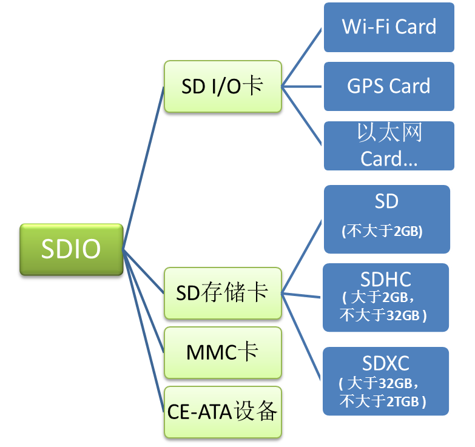

图 35‑1 SDIO接口的设备

关于SD卡和SD I/O部分内容可以在SD协会网站获取到详细的介绍，比如各种SD卡尺寸规则、读写速度标示方法、应用扩展等等信息。

本章内容针对SD卡使用讲解，对于其他类型卡的应用可以参考相关系统规范实现，所以对于控制器中针对其他类型卡的内容可能在本章中简单提及或者被忽略，本章内容不区分SDIO和SD卡这两个概念。即使目前SD协议提供的SD卡规范版本最新是4.01版本，但STM32F10x系列控制器只支持SD卡规范版本2.0，即只支持标准容量SD和高容量SDHC标准卡，不支持超大容量SDXC标准卡，所以可以支持的最高卡容量是32GB。

SD卡物理结构
~~~~~~~~~~~~

一张SD卡包括有存储单元、存储单元接口、电源检测、卡及接口控制器和接口驱动器5个部分，见图
35‑2。存储单元是存储数据部件，存储单元通过存储单元接口与卡控制单元进行数据传输；电源检测单元保证SD卡工作在合适的电压下，如出现掉电或上状态时，它会使控制单元和存储单元接口复位；卡及接口控制单元控制SD卡的运行状态，它包括有8个寄存器；接口驱动器控制SD卡引脚的输入输出。

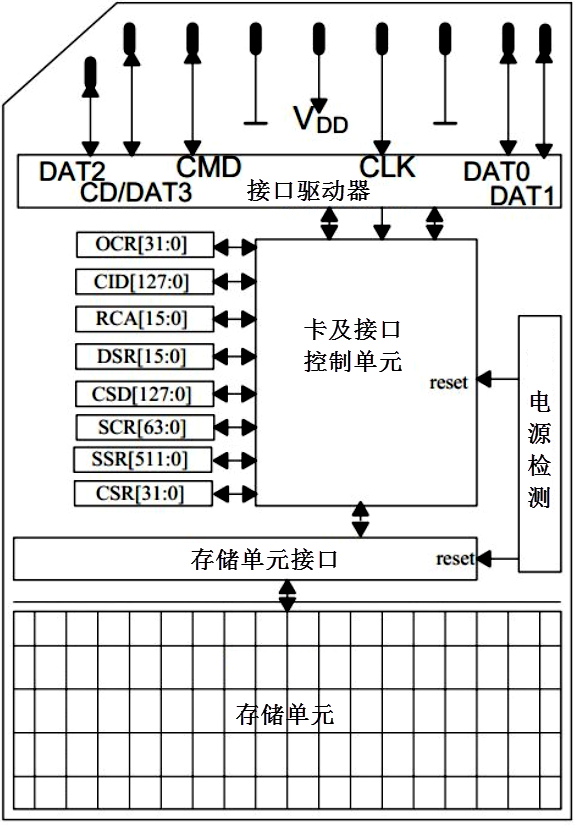

图 35‑2 SD卡物理结构

SD卡总共有8个寄存器，用于设定或表示SD卡信息，参考表
35‑1。这些寄存器只能通过对应的命令访问，对SD卡进行控制操作并不是像操作控制器GPIO相关寄存器那样一次读写一个寄存器的，它是通过命令来控制，SDIO定义了64个命令，每个命令都有特殊意义，可以实现某一特定功能，SD卡接收到命令后，根据命令要求对SD卡内部寄存器进行修改，程序控制中只需要发送组合命令就可以实现SD卡的控制以及读写操作。

   表 35‑1 SD卡寄存器

======== =========== ======================================================================================
  名称     bit宽度     描述
  CID    128         卡识别号(Card identification number):用来识别的卡的个体号码(唯一的)
  RCA    16          相对地址(Relative card address):卡的本地系统地址，初始化时，动态地由卡建议，主机核准。
  DSR    16          驱动级寄存器(Driver Stage Register):配置卡的输出驱动
  CSD    128         卡的特定数据(Card Specific Data):卡的操作条件信息
  SCR    64          SD配置寄存器(SD Configuration Register):SD 卡特殊特性信息
  OCR    32          操作条件寄存器(Operation conditions register)
  SSR    512         SD状态(SD Status):SD卡专有特征的信息
  CSR    32          卡状态(Card Status):卡状态信息
======== =========== ======================================================================================

每个寄存器位的含义可以参考SD简易规格文件《Physical Layer Simplified
Specification V2.0》第5章内容。

SDIO总线
~~~~~~~~

总线拓扑
^^^^^^^^

SD卡一般都支持SDIO和SPI这两种接口，本章内容只介绍SDIO接口操作方式，如果需要使用SPI操作方式可以参考SPI相关章节。另外，STM32H743x系列控制器的SDIO是不支持SPI通信模式的，如果需要用到SPI通信只能使用SPI外设。

SD卡总线拓扑参考图
35‑3。虽然可以共用总线，但不推荐多卡槽共用总线信号，要求一个单独SD总线应该连接一个单独的SD卡。

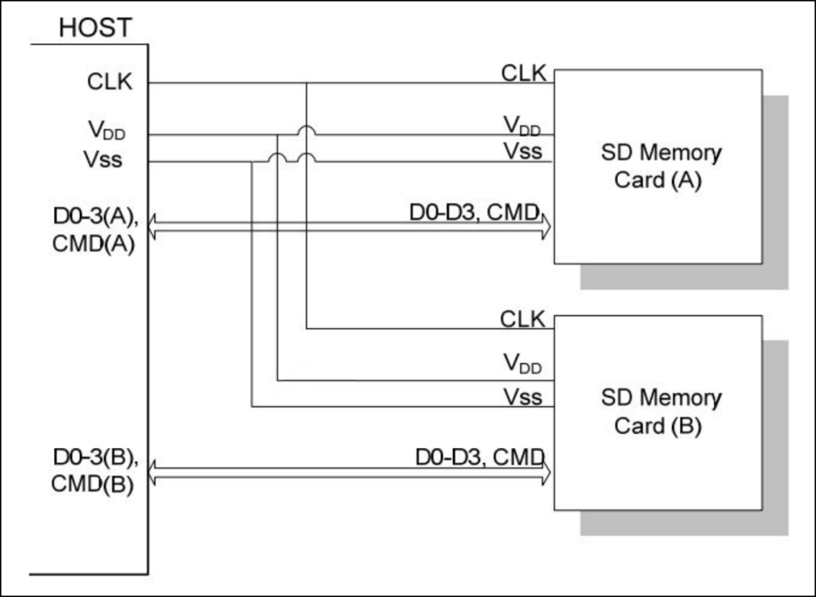

图 35‑3 SD卡总线拓扑

SD卡使用9-pin接口通信，其中3根电源线、1根时钟线、1根命令线和4根数据线，具体说明如下：

-  **CLK：**\ 时钟线，由SDIO主机产生，即由STM32控制器输出；

-  **CMD：**\ 命令控制线，SDIO主机通过该线发送命令控制SD卡，如果命令要求SD卡提供应答(响应)，SD卡也是通过该线传输应答信息；

-  **D0-3：**\ 数据线，传输读写数据；SD卡可将D0拉低表示忙状态；

-  **V\ DD\ 、V\ SS1\ 、V\ SS2\ ：**\ 电源和地信号。

在之前的I2C以及SPI章节都有详细讲解了对应的通信时序，实际上，SDIO的通信时序简单许多，SDIO不管是从主机控制器
向SD卡传输，还是SD卡向主机控制器传输都只以CLK时钟线的\ **上升沿**\ 为有效。SD卡操作过程会使用两种不同频率
的时钟同步数据，一个是识别卡阶段时钟频率FOD，最高为400kHz，另外一个是数据传输模式下时钟频率FPP，默认最高
为25MHz，如果通过相关寄存器配置使SDIO工作在高速模式，此时数据传输模式最高频率为50MHz。

虽然STM32H743控制器有两个SDIO主机，但是我们的开发板只使用了一个SDIO主机，开发板上集成了一个Micro
SD卡槽和SDIO接口的WiFi模块，要求只能使用其中一个设备。SDIO接口的WiFi模块一般集成有使能线，如果需要用到SD卡需要先控制该使能线禁用WiFi模块。

总线协议
^^^^^^^^

SD总线通信是基于命令和数据传输的。通讯由一个起始位(“0”)，由一个停止位(“1”)终止。SD通信一般是主机发送一个命令(Command)，从设备在接收到命令后作出响应(Response)，如有需要会有数据(Data)传输参与。

SD总线的基本交互是命令与响应交互，见图 35‑4。

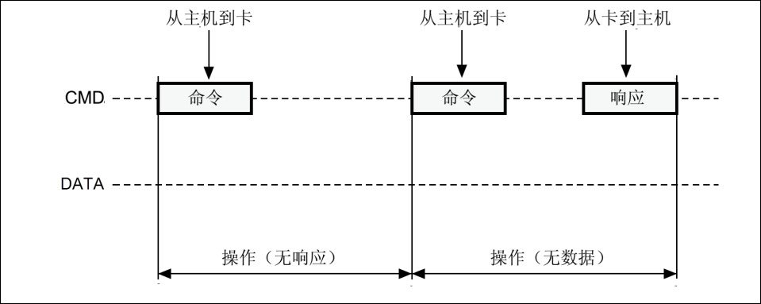

图 35‑4 命令与响应交互

SD数据是以块(Black)形式传输的，SDHC卡数据块长度一般为512字节，数据可以从主机到卡，也可以是从卡到主机。数据块需要CRC位来
保证数据传输成功。CRC位由SD卡系统硬件生成。STM32控制器可以控制使用单线或4线传输，本开发板设计使用4线传输。
图35_5_ 为主机向SD卡写入数据块操作示意。

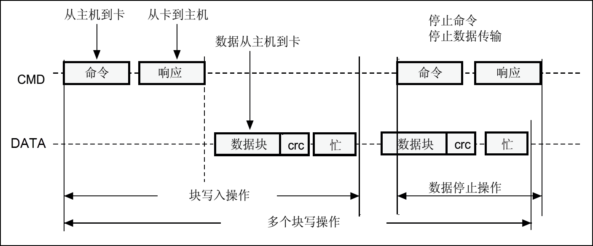

图 35‑5 多块写入操作

SD数据传输支持单块和多块读写，它们分别对应不同的操作命令，多块写入还需要使用命令来停止整个写入操作。数据写入前需要检测SD卡忙状态，因为SD卡在接收到数据后编程到存储区过程需要一定操作时间。SD卡忙状态通过把D0线拉低表示。

数据块读操作与之类似，只是无需忙状态检测。

使用4数据线传输时，每次传输4bit数据，每根数据线都必须有起始位、终止位以及CRC位，CRC位每根数据线都要分别检查，并把检查结果汇总然后在数据传输完后通过D0线反馈给主机。

SD卡数据包有两种格式，一种是常规数据(8bit宽)，它先发低字节再发高字节，而每个字节则是先发高位再发低位，4线传输示意如
图35_6_。

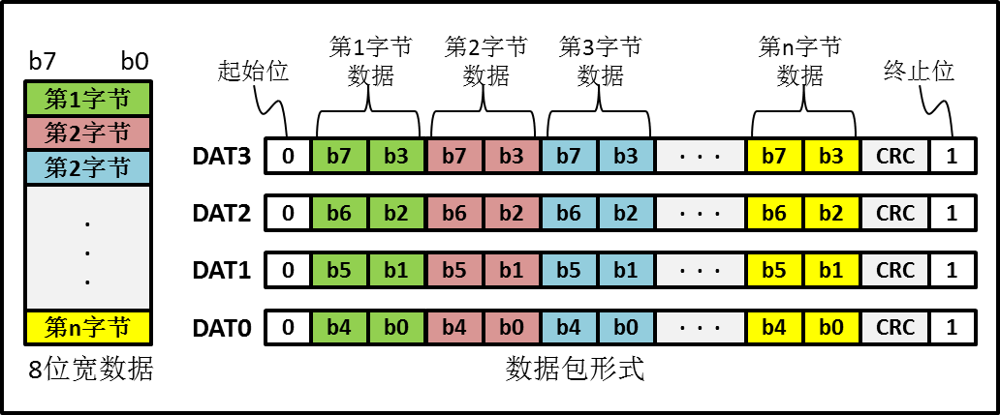

图 35‑6 8位宽数据包传输

4线同步发送，每根线发送一个字节的其中两个位，数据位在四线顺序排列发送，DAT3数据线发较高位，DAT0数据线发较低位。

另外一种数据包发送格式是宽位数据包格式，对SD卡而言宽位数据包发送方式是针对SD卡SSR(SD状态)寄存器内容发送的，SSR寄存器总共有512bit，在
主机发出ACMD13命令后SD卡将SSR寄存器内容通过DAT线发送给主机。宽位数据包格式示意见
图35_7_。

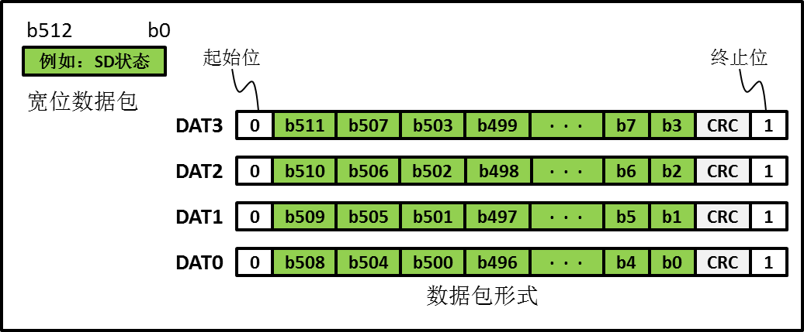

图 35‑7 宽位数据包传输

命令
^^^^

SD命令由主机发出，以广播命令和寻址命令为例，广播命令是针对与SD主机总线连接的所有从设备发送的，寻址命令是指定某个地址设备进行命令传输。

命令格式
''''''''

SD命令格式固定为48bit，都是通过CMD线连续传输的（数据线不参与），见
图35_8_。

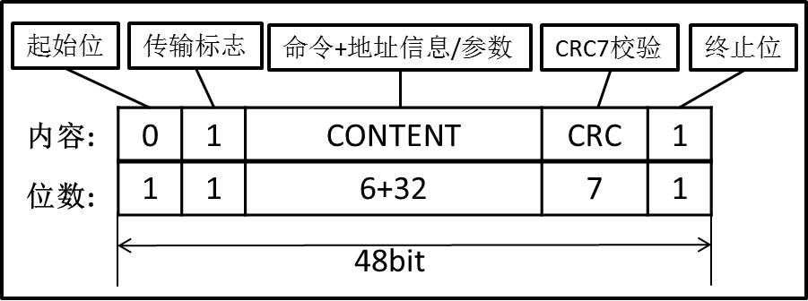

图 35‑8 SD命令格式

SD命令的组成如下：

-  起始位和终止位：命令的主体包含在起始位与终止位之间，它们都只包含一个数据位，起始位为0，终止位为1。

-  传输标志：用于区分传输方向，该位为1时表示命令，方向为主机传输到SD卡，该位为0时表示响应，方向为SD卡传输到主机。

命令主体内容包括命令、地址信息/参数和CRC校验三个部分。

-  命令号：它固定占用6bit，所以总共有64个命令(代号：CMD0~CMD63)，每个命令都有特
   定的用途，部分命令不适用于SD卡操作，只是专门用于MMC卡或者SD
   I/O卡。

-  地址/参数：每个命令有32bit地址信息/参数用于命令附加内容，例如，广播命令没有地址
   信息，这32bit用于指定参数，而寻址命令这32bit用于指定目标SD卡的地址。

-  CRC7校验：长度为7bit的校验位用于验证命令传输内容正确性，如果发生外部干扰导致传输
   数据个别位状态改变将导致校准失败，也意味着命令传输失败，SD卡不执行命令。

命令类型
''''''''

SD命令有4种类型：

-  无响应广播命令(bc)，发送到所有卡，不返回任务响应；

-  带响应广播命令(bcr)，发送到所有卡，同时接收来自所有卡响应；

-  寻址命令(ac)，发送到选定卡，DAT线无数据传输；

-  寻址数据传输命令(adtc)，发送到选定卡，DAT线有数据传输。

另外，SD卡主机模块系统旨在为各种应用程序类型提供一个标准接口。在此环境中，需要有特定的客户/应用程序功能。为实现这些功能，在标准中定义了两种类型的通用命令：特定应用命令(ACMD)和常规命令(GEN_CMD)。要使用SD卡制造商特定的ACMD命令如ACMD6，需要在发送该命令之前无发送CMD55命令，告知SD卡接下来的命令为特定应用命令。CMD55命令只对紧接的第一个命令有效，SD卡如果检测到CMD55之后的第一条命令为ACMD则执行其特定应用功能，如果检测发现不是ACMD命令，则执行标准命令。

命令描述
''''''''

SD卡系统的命令被分为多个类，每个类支持一种“卡的功能设置”。表
35‑2列举了SD卡部分命令信息，更多详细信息可以参考SD简易规格文件说明，表中填充位和保留位都必须被设置为0。

虽然没有必须完全记住每个命令详细信息，但越熟悉命令对后面编程理解非常有帮助。

.. _表35_2:

表 35‑2 SD部分命令描述

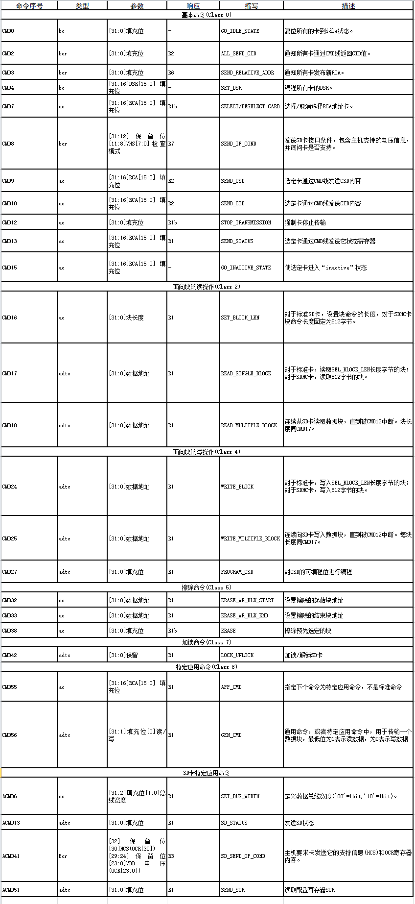

响应
^^^^

响应由SD卡向主机发出，部分命令要求SD卡作出响应，这些响应多用于反馈SD卡的状态。SDIO总共有7个响应类型(代号：R1~R7)，其中SD卡没有R4、R5类型响应。特定的命令对应有特定的响应类型，比如当主机发送CMD3命令时，可以得到响应R6。与命令一样，SD卡的响应也是通过CMD线连续传输的。根据响应内容大小可以分为短响应和长响应。短响应是48bit长度，只有R2类型是长响应，其长度为136bit。各个类型响应具体情况如表
35‑3。

除了R3类型之外，其他响应都使用CRC7校验来校验，对于R2类型是使用CID和CSD寄存器内部CRC7。

表 35‑3 SD卡响应类型

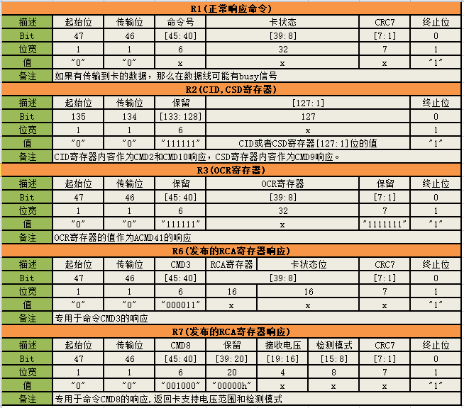

SD卡的操作模式及切换
~~~~~~~~~~~~~~~~~~~~

SD卡的操作模式
^^^^^^^^^^^^^^

SD卡有多个版本，STM32控制器目前最高支持《Physical Layer Simplified
Specification
V2.0》定义的SD卡，STM32控制器对SD卡进行数据读写之前需要识别卡的种类：V1.0标准卡、V2.0标准卡、V2.0高容量卡或者不被识别卡。

SD卡系统(包括主机和SD卡)定义了两种操作模式：卡识别模式和数据传输模式。在系统复位后，主机处于卡识别模式，寻找总线上可用的SDIO设备；同时，SD卡也处于卡识别模式，直到被主机识别到，即当SD卡接收到SEND_RCA(CMD3)命令后，SD卡就会进入数据传输模式，而主机在总线上所有卡被识别后也进入数据传输模式。在每个操作模式下，SD卡都有几种状态，参考表
35‑4，通过命令控制实现卡状态的切换。

   表 35‑4 SD卡状态与操作模式

==================================== ================================
  操作模式                             SD卡状态
无效模式(Inactive)                   无效状态(Inactive State)
卡识别模式(Card identification mode) 空闲状态(Idle State)
\                                    准备状态(Ready State)
\                                    识别状态(Identification State)
数据传输模式(Data transfer mode)     待机状态(Stand-by State)
\                                    传输状态(Transfer State)
\                                    发送数据状态(Sending-data State)
\                                    接收数据状态(Receive-data State)
\                                    编程状态(Programming State)
\                                    断开连接状态(Disconnect State)
==================================== ================================

卡识别模式
^^^^^^^^^^

在卡识别模式下，主机会复位所有处于“卡识别模式”的SD卡，确认其工作电压范围，识别SD卡类型，并且获取SD卡的相对地址(卡相对地址较短，便于寻址)。
在卡识别过程中，要求SD卡工作在识别时钟频率FOD的状态下。卡识别模式下SD卡状态转换如
图35_9_。

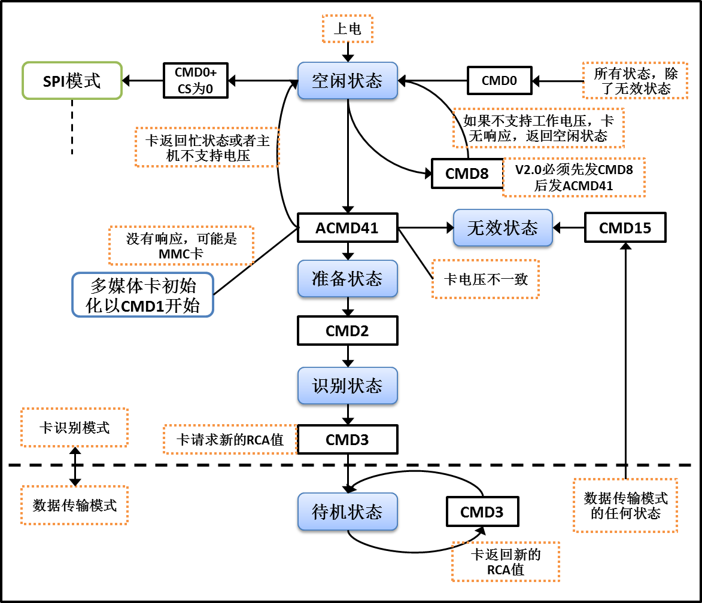

图 35‑9 卡识别模式状态转换图

主机上电后，所有卡处于空闲状态，包括当前处于无效状态的卡。主机也可以发送GO_IDLE_STATE(CMD0)让所有卡软复位从而进入空闲状态，但当前处于无效状态的卡并不会复位。

主机在开始与卡通信前，需要先确定双方在互相支持的电压范围内。SD卡有一个电压支持范围，主机当前电压必须在该范围可能才能与卡正常通信。SEND_IF_COND(CMD8)命令就是用于验证卡接口操作条件的(主要是电压支持)。卡会根据命令的参数来检测操作条件匹配性，如果卡支持主机电压就产生响应，否则不响应。而主机则根据响应内容确定卡的电压匹配性。CMD8是SD卡标准V2.0版本才有的新命令，所以如果主机有接收到响应，可以判断卡为V2.0或更高版本SD卡。

SD_SEND_OP_COND(ACMD41)命令可以识别或拒绝不匹配它的电压范围的卡。ACMD41命令的VDD电压参数用于设置主机支持电压范围，卡响应会返回卡支持的电压范围。对于对CMD8有响应的卡，把ACMD41命令的HCS位设置为1，可以测试卡的容量类型，如果卡响应的CCS位为1说明为高容量SD卡，否则为标准卡。卡在响应ACMD41之后进入准备状态，不响应ACMD41的卡为不可用卡，进入无效状态。ACMD41是应用特定命令，发送该命令之前必须先发CMD55。

ALL_SEND_CID(CMD2)用来控制所有卡返回它们的卡识别号(CID)，处于准备状态的卡在发送CID之后就进入识别状态。之后主机就发送SEND_RELATIVE_ADDR(CMD3)命令，让卡自己推荐一个相对地址(RCA)并响应命令。这个RCA是16bit地址，而CID是128bit地址，使用RCA简化通信。卡在接收到CMD3并发出响应后就进入数据传输模式，并处于待机状态，主机在获取所有卡RCA之后也进入数据传输模式。

数据传输模式
^^^^^^^^^^^^

只有SD卡系统处于数据传输模式下才可以进行数据读写操作。数据传输模式下可以将主机SD时钟频率设置为FPP，默认最高为25MHz，频率切换可以通
过CMD4命令来实现。数据传输模式下，SD卡状态转换过程见
图35_10_。

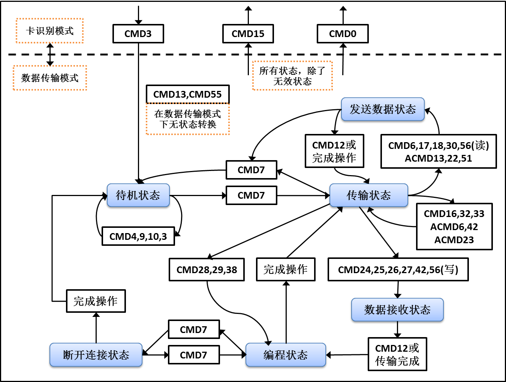

图 35‑10 数据传输模式卡状态转换

CMD7用来选定和取消指定的卡，卡在待机状态下还不能进行数据通信，因为总线上可能有多个卡都是出于待机状态，必须选择一个RCA地址目标卡使其进入传输状态才可以进行数据通信。同时通过CMD7命令也可以让已经被选择的目标卡返回到待机状态。

数据传输模式下的数据通信都是主机和目标卡之间通过寻址命令点对点进行的。卡处于传输状态下可以使用表
35‑2中面向块的读写以及擦除命令对卡进行数据读写、擦除。CMD12可以中断正在进行的数据通信，让卡返回到传输状态。CMD0和CMD15会中止任何数据编程操作，返回卡识别模式，这可能导致卡数据被损坏。

STM32的SDMMC功能框图
~~~~~~~~~~~~~~~~~~~~~~~~

STM32控制器有一个SDMMC，由两部分组成：SDMMC适配器和APB2接口，见SDMMC功能框图
图35_11_。SDMMC适配器提供SDMMC主机功能，可以提供SD时钟、发送命令和进行数据传输。APB2接口用于控制器访问SDMMC适配器寄存器并且可以产生中断和DMA请求信号。

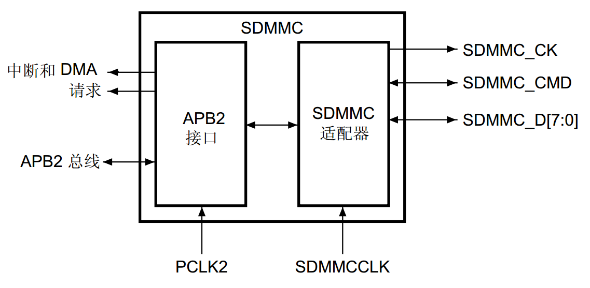

图 35‑11 SDMMC功能框图

SDMMC使用两个时钟信号，一个是SDMMC适配器时钟(SDMMCCLK=48MHz)，另外一个是APB2总线时钟(PCLK2，一般为108MHz)。

STM32控制器的SDMMC是针对MMC卡和SD卡的主设备，所以预留有8根数据线，对于SD卡最多用四根数据线。

SDMMC适配器是SD卡系统主机部分，是STM32控制器与SD卡数据通信中间设备。SDMMC适配器由五个单元组成，分别是控制单元、命令路径单元、数据路径单元、寄存器单元以及FIFO，见
图35_12_。

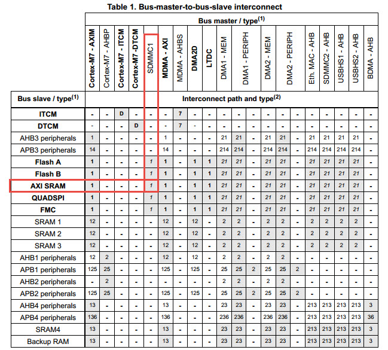

图 35‑12 SDMMC适配器框图

控制单元
^^^^^^^^^^

控制单元包含电源管理和时钟管理功能，结构如
图35_13_。电源管理部件会在系统断电和上电阶段禁止SD卡总线输出信号。时钟管理部件控制CLK线时钟信号生成。一般使用SDIOCLK分频得到。

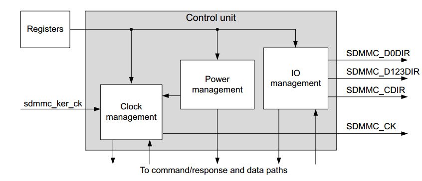

图 35‑13 SDMMC适配器控制单元

命令路径
^^^^^^^^^^

命令路径控制命令发送，并接收卡的响应，结构见 图35_14_。

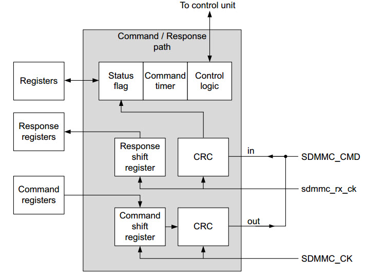

图 35‑14 SDMMC适配器命令路径

关于SDIO适配器状态转换流程可以参考
图35_9_，当SD卡处于某一状态时，SDIO适配器必然处于特定状态与之对应。STM32控制器以命令路径状态机(CPSM)来描述SDIO适配器的状态变化，并加入了等待
超时检测功能，以便退出永久等待的情况。CPSM的描述见 图35_15_。

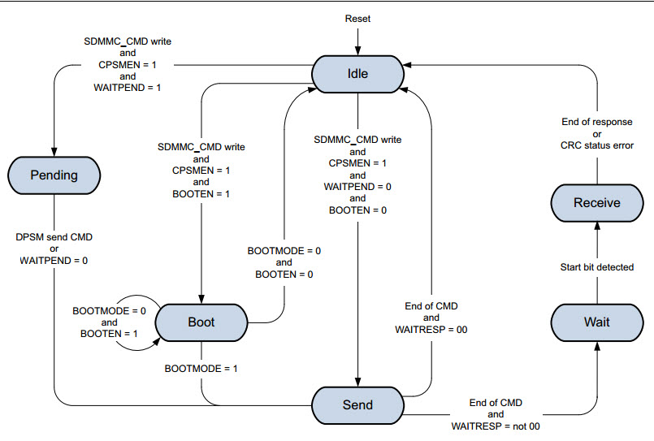

图 35‑15 CPSM状态机描述图

数据路径
^^^^^^^^^^

数据路径部件负责与SD卡相互数据传输，内部结构见 图35_16_。

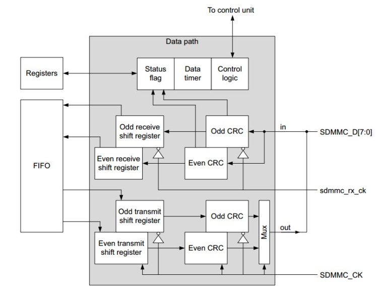

图 35‑16 SDMMC适配器数据路径

SD卡系统数据传输状态转换参考 图35_10_，SDMMC适配器以数据路径状态机(DPSM)来描述SDMMC适配器状态变化情况。
并加入了等待超时检测功能，以便退出永久等待情况。发送数据时，DPSM处于等待发送(Wait_S)状态，如果数据FIFO不为空，
DPSM变成发送状态并且数据路径部件启动向卡发送数据。接收数据时，DPSM处于等待接收状态，当DPSM收到起始位时变成接收状态，
并且数据路径部件开始从卡接收数据。DPSM状态机描述见
图35_17_。

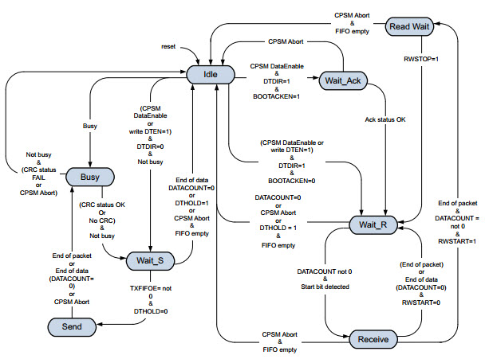

图 35‑17 DPSM状态机描述图

数据FIFO
^^^^^^^^^^

数据FIFO(先进先出)部件是一个数据缓冲器，带发送和接收单元。控制器的FIFO包含宽度为32bit、深度为32字的数据缓冲器和发送/接收逻辑。其中SDMMC状态寄存器(SDMMC_STA)的TXACT位用于指示当前正在发送数据，RXACT位指示当前正在接收数据，这两个位不可能同时为1。

-  当TXACT为1时，可以通过AHB接口将数据写入到传输FIFO。

-  当RXACT为1时，接收FIFO存放从数据路径部件接收到的数据。

根据FIFO空或满状态会把SDMMC_STA寄存器位值1，并可以产生中断和DMA请求。

适配器寄存器
^^^^^^^^^^^^^^^^^^^^

适配器寄存器包含了控制SDMMC外设的各种控制寄存器及状态寄存器，内容较多，可以通过SDMMC提供的各种结构体来了解，这些寄存器的功能都被整合到了结构体或ST的HAL库之中。

SDMMC初始化结构体
~~~~~~~~~~~~~~~~~~

HAL库函数对SDMMC外设建立了三个初始化结构体，分别为SDMMC初始化结构体SDMMC_InitTypeDef、SDMMC命令初始化结构体SDMMC_CmdInitTypeDef和SDMMC数据初始化结构体SDMMC_DataInitTypeDef。这些结构体成员用于设置SDMMC工作环境参数，并由SDMMC相应初始化配置函数或功能函数调用，这些参数将会被写入到SDMMC相应的寄存器，达到配置SDMMC工作环境的目的。

初始化结构体和初始化库函数配合使用是HAL库精髓所在，理解了初始化结构体每个成员意义基本上就可以对该外设运用自如了。初始化结构体定义在stm32f7xx_ll_sdmmc.h文件中，初始化库函数定义在stm32f7xx_ll_sdmmc.c文件中，编程时我们可以结合这两个文件内注释使用。

SDMMC初始化结构体用于配置SDMMC基本工作环境，比如时钟分频、时钟沿、数据宽度等等。它被HAL_SD_Init函数使用。

代码清单 35‑1 SDMMC初始化结构体

.. code-block:: c
   :name: 代码清单35_1

    typedef struct {
        uint32_t ClockEdge;              // 时钟沿
        uint32_t ClockBypass;            // 旁路时钟
        uint32_t ClockPowerSave;         // 节能模式
        uint32_t BusWide;                // 数据宽度
        uint32_t HardwareFlowControl;    // 硬件流控制
        uint32_t ClockDiv;               // 时钟分频
    } SDMMC_InitTypeDef;

各结构体成员的作用介绍如下：

(1)	ClockEdge：主时钟SDMMCCLK产生CLK引脚时钟有效沿选择，可选上升沿或下降沿，它设定SDMMC时钟控制寄存器(SDMMC_CLKCR)的NEGEDGE位的值，一般选择设置为高电平。

(2) ClockBypass：时钟分频旁路使用，可选使能或禁用，它设定SDMMC_CLKCR寄存器的BYPASS位。如果使能旁路，
    SDMMCCLK直接驱动CLK线输出时钟；如果禁用，使用SDMMC_CLKCR寄存器的CLKDIV位值分频SDMMCCLK，然后输出到CLK线。一般选择禁用时钟分频旁路。

(3)	ClockPowerSave：节能模式选择，可选使能或禁用，它设定SDMMC_CLKCR寄存器的PWRSAV位的值。如果使能节能模式，CLK线只有在总线激活时才有时钟输出；如果禁用节能模式，始终使能CLK线输出时钟。

(4)	BusWide：数据线宽度选择，可选1位数据总线、4位数据总线或8为数据总线，系统默认使用1位数据总线，操作SD卡时在数据传输模式下一般选择4位数据总线。它设定SDMMC_CLKCR寄存器的WIDBUS位的值。

(5)	HardwareFlowControl：硬件流控制选择，可选使能或禁用，它设定SDMMC_CLKCR寄存器的HWFC_EN位的值。硬件流控制功能可以避免FIFO发送上溢和下溢错误。

(6)	ClockDiv：时钟分频系数，它设定SDMMC_CLKCR寄存器的CLKDIV位的值，设置SDMMCCLK与CLK线输出时钟分频系数：

..

   CLK线时钟频率=SDMMCCLK/([CLKDIV+2])。

SDMMC命令初始化结构体
~~~~~~~~~~~~~~~~~~~~~~~

SDMMC命令初始化结构体用于设置命令相关内容，比如命令号、命令参数、响应类型等等。它被SDMMC_SendCommand函数使用。

代码清单 35‑2 SDMMC命令初始化接口

.. code-block:: c
   :name: 代码清单35_2

    typedef struct {
        uint32_t Argument; // 命令参数
        uint32_t CmdIndex; // 命令号
        uint32_t Response; // 响应类型
        uint32_t WaitForInterrupt; // 等待使能
        uint32_t CPSM;     // 命令路径状态机
    } SDMMC_CmdInitTypeDef;

各个结构体成员介绍如下：

(1) Argument：作为命令的一部分发送到卡的命令参数，它设定SDMMC参数寄存器(SDMMC_ARG)的值。

(2) CmdIndex：命令号选择，它设定SDMMC命令寄存器(SDMMC_CMD)的CMDINDEX位的值。

(3) Response：响应类型，SDMMC定义两个响应类型：长响应和短响应。根据命令号选择对应的响应类型。
    SDMMC定义了四个32位的SDMMC响应寄存器(SDMMC_RESPx,x=1..4)，短响应只用到SDMMC_RESP1。

(4) WaitForInterrupt：等待类型选择，有三种状态可选，一种是无等待状态，超时检测功能启动；
    一种是等待中断，另外一种是等待传输完成。它设定SDMMC_CMD寄存器的WAITPEND位和WAITINT位的值。

(5)	CPSM：命令路径状态机控制，可选使能或禁用CPSM。它设定SDMMC_CMD寄存器的CPSMEN位的值。

SDMMC数据初始化结构体
~~~~~~~~~~~~~~~~~~~~~~~~~~~

SDMMC数据初始化结构体用于配置数据发送和接收参数，比如传输超时、数据长度、传输模式等等。它被SDMMC_DataConfig函数使用。

代码清单 35‑3 SDMMC数据初始化结构体

.. code-block:: c
   :name: 代码清单35_3

    typedef struct {
        uint32_t DataTimeOut;    // 数据传输超时
        uint32_t DataLength;     // 数据长度
        uint32_t DataBlockSize;  // 数据块大小
        uint32_t TransferDir;    // 数据传输方向
        uint32_t TransferMode;   // 数据传输模式
        uint32_t DPSM;           // 数据路径状态机
    } SDMMC_DataInitTypeDef;

各结构体成员介绍如下：

(1) DataTimeOut：设置数据传输以卡总线时钟周期表示的超时周期，它设定SDMMC数据定时器寄存器(SDMMC_DTIMER)的值。
    在DPSM进入Wait_R或繁忙状态后开始递减，直到0还处于以上两种状态则将超时状态标志置1.

(2) DataLength：设置传输数据长度，它设定SDMMC数据长度寄存器(SDMMC_DLEN)的值。

(3) DataBlockSize：设置数据块大小，有多种尺寸可选，不同命令要求的数据块可能不同。
    它设定SDMMC数据控制寄存器(SDMMC_DCTRL)寄存器的DBLOCKSIZE位的值。

(4) TransferDir：数据传输方向，可选从主机到卡的写操作，或从卡到主机的读操作。它设定SDMMC_DCTRL寄存器的DTDIR位的值。

(5) TransferMode：数据传输模式，可选数据块或数据流模式。对于SD卡操作使用数据块类型。它设定SDMMC_DCTRL寄存器的DTMODE位的值。

(6) DPSM：数据路径状态机控制，可选使能或禁用DPSM。它设定SDMMC_DCTRL寄存器的DTEN位的值。
    要实现数据传输都必须使能SDMMC_DPSM。

SD卡读写测试实验
~~~~~~~~~~~~~~~~

SD卡广泛用于便携式设备上，比如数码相机、手机、多媒体播放器等。对于嵌入式设备来说是一种重要的存储数据部件。
类似与SPI Flash芯片数据操作，可以直接进行读写，也可以写入文件系统，然后使用文件系统读写函数，
使用文件系统操作。本实验是进行SD卡最底层的数据读写操作，直接使用SDIO对SD卡进行读写，会损坏SD卡原本内容，
导致数据丢失，实验前请注意备份SD卡的原内容。由于SD卡容量很大，我们平时使用的SD卡都是已经包含有文件系统的，
一般不会使用本章的操作方式编写SD卡的应用，但它是SD卡操作的基础，对于原理学习是非常有必要的，在它的基础上移植文件系统到SD卡的应用将在下一章讲解。

硬件设计
^^^^^^^^

STM32控制器的SDMMC引脚是被设计固定不变的，开发板设计采用四根数据线模式。对于命令线和数据线须需要加一个上拉电阻。

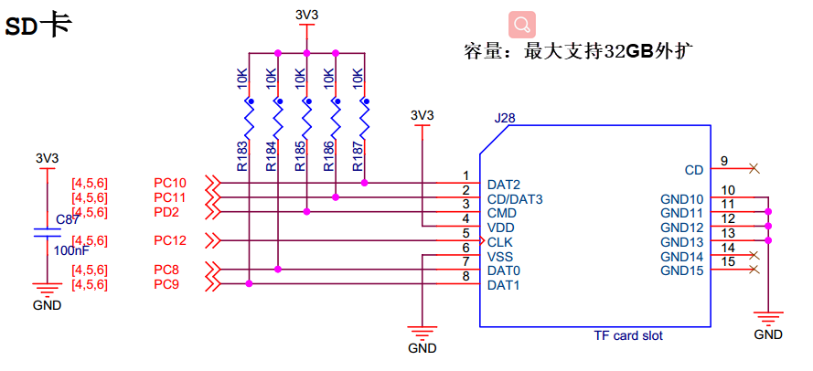

图 35‑18 SD卡硬件设计

软件设计
^^^^^^^^

这里只讲解核心的部分代码，有些变量的设置，头文件的包含等没有全部罗列出来，完整的代码请参考本章配套的工程。有了之前相关SDMMC知识基础，我们就可以着手开始编写SD卡驱动程序了，根据之前内容，可了解操作的大概流程：

-  初始化相关GPIO及SDMMC外设；

-  配置SDMMC基本通信环境进入卡识别模式，通过几个命令处理后得到卡类型；

-  如果是可用卡就进入数据传输模式，接下来就可以进行读、写、擦除的操作。

虽然看起来只有三步，但它们有非常多的细节需要处理。实际上，SD卡是非常常用外设部件，ST公司在其测试板上也有板子SD卡卡槽，并提供了完整的驱动程序，我们直接参考移植使用即可。类似SDMMC、USB这些复杂的外设，它们的通信协议相当庞大，要自行编写完整、严谨的驱动不是一件轻松的事情，这时我们就可以利用ST官方例程的驱动文件，根据自己硬件移植到自己开发平台即可。

在“初识STM32
HAL库”章节我们重点讲解了HAL库的源代码及启动文件和库使用帮助文档这两部分内容，实际上“Utilities”文件夹内容是非常有参考价值的，该文件夹包含了基于ST官方实验板的驱动文件，比如LCD、SDRAM、SD卡、音频解码IC等等底层驱动程序，
另外还有第三方软件库，如emWin图像软件库和FatFs文件系统。虽然，我们的开发平台跟ST官方实验平台硬件设计略有差别，但移植程序方法是完全可行的。学会移植程序可以减少很多工作量，加快项目进程，更何况ST官方的驱动代码是经过严格验证的。

在“STM32Cube_FW_F7_V1.6.0\\Drivers\\BSP”文件路径下可以知道SD卡驱动文件，见 图35_19_。
我们需要stm32746g_discovery_sd.c和stm32746g_discovery_sd.h两个文件的完整内容。
另外还需要stm32746g_discovery.c和stm32746g_discovery.h两个文件的部分代码内容，为简化工程，
本章配置工程代码是将这两个文件需要用到的内容移植到stm32746g_discovery_sd.c文件中，具体可以参考工程文件。

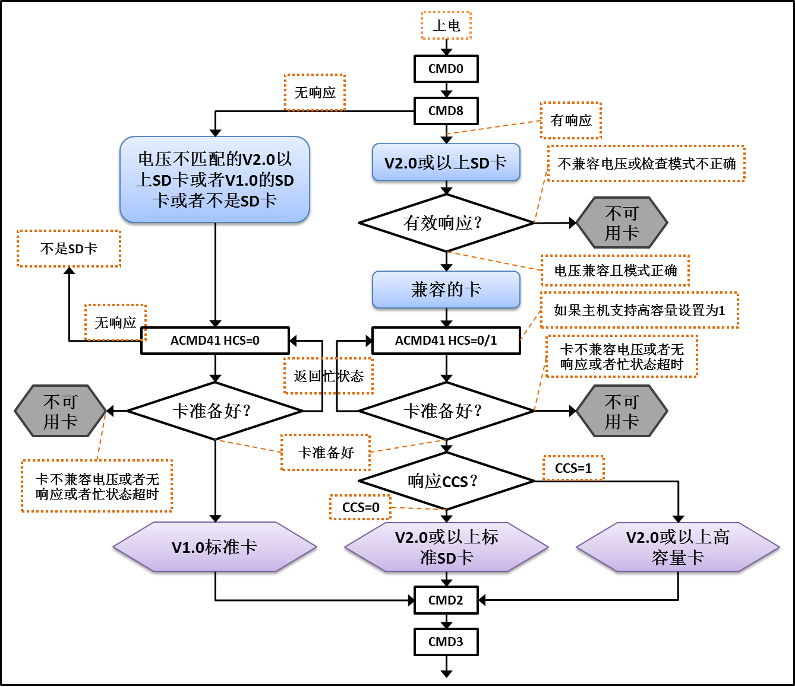

图 35‑19 ST官方实验板SD卡驱动文件

我们把stm32746g_discovery_sd.c和stm32746g_discovery_sd.h两个文件拷贝到我们的工程文件夹中，并将其对应改名为bsp_sdio_sd.c和bsp_sdio_sd.h，见
图35_20_。另外，sdio_test.c和sdio_test.h文件包含了SD卡读、写、擦除测试代码。

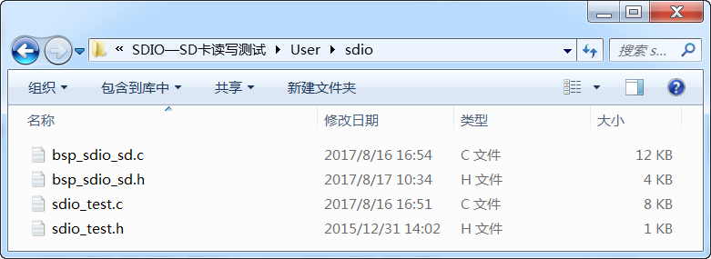

图 35‑20 SD卡驱动文件

GPIO初始化和DMA配置
'''''''''''''''''''

SDMMC用到CLK线、CMD线和4根DAT线，使用之前必须初始化相关的GPIO，并设置复用模式为SDMMC的类型。而SDMMC外设又支持生成DMA请求，使用DMA传输可以提高数据传输效率，因此在SDMMC的控制代码中，可以把它设置为DMA传输模式或轮询模式，STM32HAL库提供SDMMC示例中针对这两个模式做了区分处理。由于应用中一般都使用DMA传输模式，所以接下来代码分析都以DMA传输模式介绍。

GPIO初始化和DMA配置这部分代码从stm32746g_discovery_sd.c和stm32746g_discovery_sd.h两个文件中移植而来。

DMA及相关配置宏定义
========================================

代码清单 35‑4 DMA及相关配置宏定义

.. code-block:: c
   :name: 代码清单35_4

    #define MSD_OK                        	((uint8_t)0x00)
    #define MSD_ERROR                     	((uint8_t)0x01)

    #define SD_DATATIMEOUT           	((uint32_t)100000000)

    /* DMA definitions for SD DMA transfer */
    #define __DMAx_TxRx_CLK_ENABLE            __DMA2_CLK_ENABLE
    #define SD_DMAx_Tx_CHANNEL                DMA_CHANNEL_4
    #define SD_DMAx_Rx_CHANNEL                DMA_CHANNEL_4
    #define SD_DMAx_Tx_STREAM                 DMA2_Stream6
    #define SD_DMAx_Rx_STREAM                 DMA2_Stream3
    #define SD_DMAx_Tx_IRQn                   DMA2_Stream6_IRQn
    #define SD_DMAx_Rx_IRQn                   DMA2_Stream3_IRQn
    #define SD_DMAx_Tx_IRQHandler             DMA2_Stream6_IRQHandler
    #define SD_DMAx_Rx_IRQHandler             DMA2_Stream3_IRQHandler

使用宏定义编程对程序在同系列而不同型号主控芯片移植起到很好的帮助，同时简化程序代码。数据FIFO起始地址可用于DMA传输地址；SDIOCLK在卡识别模式和数据传输模式下一般是不同的，使用不同分频系数控制。SDMMC使用DMA2外设，可选择stream3和stream6。

SDMMC底层驱动初始化
========================================

SDMMC底层驱动初始化

.. code-block:: c
   :name: 代码清单35_5

    void BSP_SD_MspInit(SD_HandleTypeDef *hsd, void *Params)
    {
        static DMA_HandleTypeDef dma_rx_handle;
        static DMA_HandleTypeDef dma_tx_handle;
        GPIO_InitTypeDef gpio_init_structure;

        /* 使能 SDMMC 时钟 */
        __HAL_RCC_SDMMC1_CLK_ENABLE();

        /* 使能 DMA2 时钟 */
        __DMAx_TxRx_CLK_ENABLE();

        /* 使能 GPIOs 时钟 */
        __HAL_RCC_GPIOC_CLK_ENABLE();
        __HAL_RCC_GPIOD_CLK_ENABLE();

        /* 配置GPIO复用推挽、上拉、高速模式 */
        gpio_init_structure.Mode      = GPIO_MODE_AF_PP;
        gpio_init_structure.Pull      = GPIO_PULLUP;
        gpio_init_structure.Speed     = GPIO_SPEED_HIGH;
        gpio_init_structure.Alternate = GPIO_AF12_SDMMC1;
        /* GPIOC 配置 */
        gpio_init_structure.Pin = GPIO_PIN_8 | GPIO_PIN_9 | GPIO_PIN_10 | GPIO_PIN_11 | GPIO_PIN_12;
        HAL_GPIO_Init(GPIOC, &gpio_init_structure);

        /* GPIOD 配置 */
        gpio_init_structure.Pin = GPIO_PIN_2;
        HAL_GPIO_Init(GPIOD, &gpio_init_structure);

        /* SDMMC 中断配置 */
        HAL_NVIC_SetPriority(SDMMC1_IRQn, 5, 0);
        HAL_NVIC_EnableIRQ(SDMMC1_IRQn);

        /* 配置 DMA 接收参数 */
        dma_rx_handle.Init.Channel             = SD_DMAx_Rx_CHANNEL;
        dma_rx_handle.Init.Direction           = DMA_PERIPH_TO_MEMORY;
        dma_rx_handle.Init.PeriphInc           = DMA_PINC_DISABLE;
        dma_rx_handle.Init.MemInc              = DMA_MINC_ENABLE;
        dma_rx_handle.Init.PeriphDataAlignment = DMA_PDATAALIGN_WORD;
        dma_rx_handle.Init.MemDataAlignment    = DMA_MDATAALIGN_WORD;
        dma_rx_handle.Init.Mode                = DMA_PFCTRL;
        dma_rx_handle.Init.Priority            = DMA_PRIORITY_VERY_HIGH;
        dma_rx_handle.Init.FIFOMode            = DMA_FIFOMODE_ENABLE;
        dma_rx_handle.Init.FIFOThreshold       = DMA_FIFO_THRESHOLD_FULL;
        dma_rx_handle.Init.MemBurst            = DMA_MBURST_INC4;
        dma_rx_handle.Init.PeriphBurst         = DMA_PBURST_INC4;

        dma_rx_handle.Instance = SD_DMAx_Rx_STREAM;

        /* 关联DMA句柄 */
        __HAL_LINKDMA(hsd, hdmarx, dma_rx_handle);

        /* 初始化传输数据流为默认值 */
        HAL_DMA_DeInit(&dma_rx_handle);

        /* 配置 DMA 接收数据流 */
        HAL_DMA_Init(&dma_rx_handle);

        /* 配置 DMA 发送参数 */
        dma_tx_handle.Init.Channel             = SD_DMAx_Tx_CHANNEL;
        dma_tx_handle.Init.Direction           = DMA_MEMORY_TO_PERIPH;
        dma_tx_handle.Init.PeriphInc           = DMA_PINC_DISABLE;
        dma_tx_handle.Init.MemInc              = DMA_MINC_ENABLE;
        dma_tx_handle.Init.PeriphDataAlignment = DMA_PDATAALIGN_WORD;
        dma_tx_handle.Init.MemDataAlignment    = DMA_MDATAALIGN_WORD;
        dma_tx_handle.Init.Mode                = DMA_PFCTRL;
        dma_tx_handle.Init.Priority            = DMA_PRIORITY_VERY_HIGH;
        dma_tx_handle.Init.FIFOMode            = DMA_FIFOMODE_ENABLE;
        dma_tx_handle.Init.FIFOThreshold       = DMA_FIFO_THRESHOLD_FULL;
        dma_tx_handle.Init.MemBurst            = DMA_MBURST_INC4;
        dma_tx_handle.Init.PeriphBurst         = DMA_PBURST_INC4;

        dma_tx_handle.Instance = SD_DMAx_Tx_STREAM;

        /* 关联 DMA 句柄 */
        __HAL_LINKDMA(hsd, hdmatx, dma_tx_handle);

        /* 初始化传输数据流为默认值 */
        HAL_DMA_DeInit(&dma_tx_handle);

        /* 配置 DMA 发送数据流 */
        HAL_DMA_Init(&dma_tx_handle);

        /* 配置DMA接收传输完成中断 */
        HAL_NVIC_SetPriority(SD_DMAx_Rx_IRQn, 6, 0);
        HAL_NVIC_EnableIRQ(SD_DMAx_Rx_IRQn);

        /* 配置DMA发送传输完成中断 */
        HAL_NVIC_SetPriority(SD_DMAx_Tx_IRQn, 6, 0);
        HAL_NVIC_EnableIRQ(SD_DMAx_Tx_IRQn);
    }

由于SDMMC对应的IO引脚都是固定的，所以这里没有使用宏定义方式给出，直接使用GPIO引脚，该函数初始化引脚之后还使能了SDMMC和DMA2时钟。

接着分别配置DMA的SDMMC发送和接收数据流参数，关联DMA句柄，初始化DMA发送和接收数据流。对于DMA相关配置可以参考DMA章节内容。

相关类型定义
'''''''''''''

打开bsp_sdio_sd.h文件可以发现有非常多的枚举类型定义、结构体类型定义以及宏定义，把所有的定义在这里罗列出来不太现实，这部分代码内容请直接打开工程查看，针对这些内容在此处简要介绍如下：

-  枚举类型定义：有SD_ERROR、SDTransferState和SDCardState三个。SD_ERROR是列举了控制器可能出
   现的错误、比如CRC校验错误、CRC校验错误、通信等待超时、FIFO上溢或下溢、擦除命令错误等等。这些错误类型部分是控制器系统寄存器的标志位，部分是通过命令的响应内容得到的。SDTransferState定义了SDMMC传输状态，有传输正常状态、传输忙状态和传输错误状态。SDCardState定义卡的当前状态，比如准备状态、识别状态、待机状态、传输状态等等，具体状态转换过程参考
   图35_9_ 和 图35_10_。

-  结构体类型定义：有SD_CSD、SD_CID、SD_CardStatus以及SD_CardInfo。SD_CSD定义了SD
   卡的特定数据(CSD)寄存器位，一般提
   供R2类型的响应可以获取得到CSD寄存器内容。SD_CID结构体类似SD_CSD结构体，它定义SD卡CID寄存器内容，也是通过R2响应类型获取得到。SD_CardStatus结构体定义了SD卡状态，有数据宽度、卡类型、速度等级、擦除宽度、传输偏移地址等等SD卡状态。SD_CardInfo结构体定义了SD卡信息，包括了SD_CSD类型和SD_CID类型成员，还有定义了卡容量、卡块大小、卡相对地址RCA和卡类型成员。

-  宏定义内容：包含有命令号定义、SDMMC传输方式、SD卡插入状态以及SD卡类型定义。参考 表35_2_ 列举了描述了部分命令，
   文件中为每个命令号定义一个宏，比如将复位CMD0定义为SD_CMD_GO_IDLE_STATE，这与 表35_2_ 中缩写部分是类似的，
   所以熟悉命名用途可以更好理解SD卡操作过程。SDMMC数据传输可以选择是否使用DMA传输，前面提到的SD_DMA_MODE和SD_POLLING_MODE就定义在这里，
   两种方式只能二选一使用，为提高系统性能，一般使用DMA传输模式。接下来还定义了检测SD卡是否正确插入的宏SD_PRESENT和SD_NOT_PRESENT，
   ST官方的原SD卡驱动是以一个输入引脚电平判断SD卡是否正确插入，由于我们的硬件没有使用该引脚，所以我们的程序里把ST驱动中原来的引脚检测部分代码删除掉了，
   但保留了SD_PRESENT和SD_NOT_PRESENT两个宏定义。最后定义SD卡具体的类型，有V1.1版本标准卡、V2.0版本标准卡、高容量SD卡以及其他类型卡，前面三个是常用的类型。

在bsp_sdio_sd.c文件也有部分宏定义，这部分宏定义只能在该文件中使用。这部分宏定义包括命令超时时间定义、OCR寄存器位掩码、R6响应位掩码等等，这些定义更多是为提取特定响应位内容而设计的掩码。

因为类型定义和宏定义内容没有在本文中列举出来，读者有必要使用KEIL工具打开本章配套例程理解清楚。同时了解bsp_sdio_sd.c文件中定义的多个不同类型变量。

接下来我们就开始根据SD卡识别过程和数据传输过程理解SD卡驱动函数代码。这部分代码内容也是非常庞大，不可能全部在文档中全部列出，对于部分函数只介绍其功能。

SD卡初始化
''''''''''

SD卡初始化过程主要是卡识别和相关SD卡状态获取。整个初始化函数可以实现
图35_21_ 中的功能。

SD卡初始化函数
==================

代码清单 35‑6 SD_Init函数

.. code-block:: c
   :name: 代码清单35_6

    uint8_t BSP_SD_Init(void)
    {
        uint8_t sd_state = MSD_OK;

        /* 定义SDMMC句柄 */
        uSdHandle.Instance = SDMMC1;

        uSdHandle.Init.ClockEdge           = SDMMC_CLOCK_EDGE_RISING;
        uSdHandle.Init.ClockBypass         = SDMMC_CLOCK_BYPASS_DISABLE;
        uSdHandle.Init.ClockPowerSave      = SDMMC_CLOCK_POWER_SAVE_DISABLE;
        uSdHandle.Init.BusWide             = SDMMC_BUS_WIDE_1B;
        uSdHandle.Init.HardwareFlowControl =
        SDMMC_HARDWARE_FLOW_CONTROL_DISABLE;
        uSdHandle.Init.ClockDiv            = SDMMC_TRANSFER_CLK_DIV;

        /* 初始化SD底层驱动 */
        BSP_SD_MspInit(&uSdHandle, NULL);
        /* HAL SD 初始化 */
        if (HAL_SD_Init(&uSdHandle, &uSdCardInfo) != SD_OK) {
            sd_state = MSD_ERROR;
        }

        /* 配置SD总线位宽 */
        if (sd_state == MSD_OK) {
            /* 配置为4bit模式 */
            if (HAL_SD_WideBusOperation_Config(&uSdHandle,
                SDMMC_BUS_WIDE_4B) != SD_OK) {
                sd_state = MSD_ERROR;
            } else {
                sd_state = MSD_OK;
            }
        }
        return  sd_state;
    }

该函数的部分执行流程如下：

(1)	配置SD外设参数，初始化SD外设。

(2)	执行BSP_SD_MspInit函数，其功能是对底层SDMMC引脚进行初始化以及开启相关时钟，该函数在之前已经讲解。

(3) HAL_SD_Init函数用于初始化SDMMC外设接口，识别SD卡，流程包括初始化卡上外设接口的默认配置，
    识别卡工作电压，初始化当前的 SD卡并将其置于空闲状态，读取 CSD/CID 寄存器获取SD卡信息，选择卡，配置 SDMMC 外设接口。

(4)	配置SD接口位宽为4bit用于数据传输。

SD_POWERON函数
=================

代码清单 35‑7 SD_POWERON函数

.. code-block:: c
   :name: 代码清单35_7

    static HAL_SD_ErrorTypedef SD_PowerON(SD_HandleTypeDef *hsd)
    {
        SDMMC_CmdInitTypeDef sdmmc_cmdinitstructure;
        __IO HAL_SD_ErrorTypedef errorstate = SD_OK;
        uint32_t response = 0, count = 0, validvoltage = 0;
        uint32_t sdtype = SD_STD_CAPACITY;

        /* Power ON Sequence ----------------------------------------------*/
        /* Disable SDMMC Clock */
        __HAL_SD_SDMMC_DISABLE(hsd);

        /* Set Power State to ON */
        SDMMC_PowerState_ON(hsd->Instance);

        /* 1ms: required power up waiting time before starting the SD initialization sequence */
        HAL_Delay(1);

        /* Enable SDMMC Clock */
        __HAL_SD_SDMMC_ENABLE(hsd);

        /* CMD0: GO_IDLE_STATE --------------------------------------------*/
        /* No CMD response required */
        sdmmc_cmdinitstructure.Argument         = 0;
        sdmmc_cmdinitstructure.CmdIndex         = SD_CMD_GO_IDLE_STATE;
        sdmmc_cmdinitstructure.Response         = SDMMC_RESPONSE_NO;
        sdmmc_cmdinitstructure.WaitForInterrupt = SDMMC_WAIT_NO;
        sdmmc_cmdinitstructure.CPSM             = SDMMC_CPSM_ENABLE;
        SDMMC_SendCommand(hsd->Instance, &sdmmc_cmdinitstructure);

        /* Check for error conditions */
        errorstate = SD_CmdError(hsd);

        if (errorstate != SD_OK) {
            /* CMD Response Timeout (wait for CMDSENT flag) */
            return errorstate;
        }

        /* CMD8: SEND_IF_COND ---------------------------------------------*/
        /* Send CMD8 to verify SD card interface operating condition */
        /* Argument: - [31:12]: Reserved (shall be set to '0')
        - [11:8]: Supply Voltage (VHS) 0x1 (Range: 2.7-3.6 V)
        - [7:0]: Check Pattern (recommended 0xAA) */
        /* CMD Response: R7 */
        sdmmc_cmdinitstructure.Argument         = SD_CHECK_PATTERN;
        sdmmc_cmdinitstructure.CmdIndex         = SD_SDMMC_SEND_IF_COND;
        sdmmc_cmdinitstructure.Response         = SDMMC_RESPONSE_SHORT;
        SDMMC_SendCommand(hsd->Instance, &sdmmc_cmdinitstructure);

        /* Check for error conditions */
        errorstate = SD_CmdResp7Error(hsd);

        if (errorstate == SD_OK) {
            /* SD Card 2.0 */
            hsd->CardType = STD_CAPACITY_SD_CARD_V2_0;
            sdtype        = SD_HIGH_CAPACITY;
        }

        /* Send CMD55 */
        sdmmc_cmdinitstructure.Argument         = 0;
        sdmmc_cmdinitstructure.CmdIndex         = SD_CMD_APP_CMD;
        SDMMC_SendCommand(hsd->Instance, &sdmmc_cmdinitstructure);

        /* Check for error conditions */
        errorstate = SD_CmdResp1Error(hsd, SD_CMD_APP_CMD);

        /* If errorstate is Command Timeout, it is a MMC card */
        /* If errorstate is SD_OK it is a SD card: SD card 2.0 (voltage range mismatch)  or SD card 1.x */
        if (errorstate == SD_OK) {
            /* SD CARD */
            /* Send ACMD41 SD_APP_OP_COND with Argument 0x80100000 */
            while ((!validvoltage) && (count < SD_MAX_VOLT_TRIAL)) {

                /* SEND CMD55 APP_CMD with RCA as 0 */
                sdmmc_cmdinitstructure.Argument         = 0;
                sdmmc_cmdinitstructure.CmdIndex         = SD_CMD_APP_CMD;
                sdmmc_cmdinitstructure.Response         = SDMMC_RESPONSE_SHORT;
                sdmmc_cmdinitstructure.WaitForInterrupt = SDMMC_WAIT_NO;
                sdmmc_cmdinitstructure.CPSM             = SDMMC_CPSM_ENABLE;
                SDMMC_SendCommand(hsd->Instance, &sdmmc_cmdinitstructure);

                /* Check for error conditions */
                errorstate = SD_CmdResp1Error(hsd, SD_CMD_APP_CMD);

                if (errorstate != SD_OK) {
                    return errorstate;
                }

                /* Send CMD41 */
                sdmmc_cmdinitstructure.Argument     = SD_VOLTAGE_WINDOW_SD | sdtype;
                sdmmc_cmdinitstructure.CmdIndex     = SD_CMD_SD_APP_OP_COND;
                sdmmc_cmdinitstructure.Response     = SDMMC_RESPONSE_SHORT;
                sdmmc_cmdinitstructure.WaitForInterrupt = SDMMC_WAIT_NO;
                sdmmc_cmdinitstructure.CPSM             = SDMMC_CPSM_ENABLE;
                SDMMC_SendCommand(hsd->Instance, &sdmmc_cmdinitstructure);

                /* Check for error conditions */
                errorstate = SD_CmdResp3Error(hsd);

                if (errorstate != SD_OK) {
                    return errorstate;
                }

                /* Get command response */
                response = SDMMC_GetResponse(hsd->Instance, SDMMC_RESP1);

                /* Get operating voltage*/
                validvoltage = (((response >> 31) == 1) ? 1 : 0);

                count++;
            }

            if (count >= SD_MAX_VOLT_TRIAL) {
                errorstate = SD_INVALID_VOLTRANGE;

                return errorstate;
            }

    if ((response & SD_HIGH_CAPACITY) == SD_HIGH_CAPACITY) {
    /* (response &= SD_HIGH_CAPACITY) */
                hsd->CardType = HIGH_CAPACITY_SD_CARD;
            }

        } /* else MMC Card */

        return errorstate;
    }

SD_POWERON函数执行流程如下：

(1)	配置SDIO_InitStructure结构体变量成员并调用SDIO_Init库函数完成SDIO外设的基本配置，注意此处的SDIO时钟分频，由于处于卡识别阶段，其时钟不能超过400KHz。

(2)	调用SDMMC_PowerState_ON函数控制SDMMC的电源状态，给SDMMC提供电源，并调用__HAL_SD_SDMMC_DISABLE库函数使能SDMMC时钟。

(3) 发送命令给SD卡，首先发送CMD0，复位所有SD卡，CMD0命令无需响应，所以调用SD_CmdError函数检测错误即可。
    SD_CmdError函数用于无需响应的命令发送检测，带有等待超时检测功能，
    它通过不断检测SDIO_STA寄存器的CMDSENT位即可知道命令发送成功与否。
    如果遇到超时错误则直接退出SDMMC_PowerState_ON函数。如果无错误则执行下面程序。

(4) 发送CMD8命令，检测SD卡支持的操作条件，主要就是电压匹配，CMD8的响应类型是R7，使用SD_CmdResp7Error函数可获取得到R7响应结果，
    它是通过检测SDMMC_STA寄存器相关位完成的，并具有等待超时检测功能。如果SD_CmdResp7Error函数返回值为SD_OK，即CMD8有响应，
    可以判定SD卡为V2.0及以上的高容量SD卡，如果没有响应可能是V1.1版本卡或者是不可用卡。

(5) 使用ACMD41命令判断卡的具体类型。在发送ACMD41之前必须先发送CMD55，CMD55命令的响应类型的R1。
    如果CMD55命令都没有响应说明是MMC卡或不可用卡。在正确发送CMD55之后就可以发送ACMD41，并根据响应判断卡类型，ACMD41的响应号为R3，SD_CmdResp3Error函数用于检测命令正确发送并带有超时检测功能，但并不具备响应内容接收功能，需要在判定命令正确发送之后调用SDMMC_GetResponse函数才能获取响应的内容。实际上，在有响应时，SDMMC外设会自动把响应存放在SDMMC_RESPx寄存器中，SDMMC_GetResponse函数只是根据形参返回对应响应寄存器的值。通过判定响应内容值即可确定SD卡类型。

(6) 执行SD_PowerON函数无错误后就已经确定了SD卡类型，并说明卡和主机电压是匹配的，SD卡处于卡识别模式下的准备状态。
    退出SD_Power_ON函数返回HAL_SD_Init函数，执行接下来代码。判断执行SD_PowerON函数无错误后，执行下面的SD_Initialize_Cards函数进行与SD卡相关的初始化，使得卡进入数据传输模式下的待机模式。

SD_InitializeCards函数
==========================

代码清单 35‑8 SD_InitializeCards函数

.. code-block:: c
   :name: 代码清单35_8

    static HAL_SD_ErrorTypedef SD_Initialize_Cards(SD_HandleTypeDef *hsd)
    {
        SDMMC_CmdInitTypeDef sdmmc_cmdinitstructure;
        HAL_SD_ErrorTypedef errorstate = SD_OK;
        uint16_t sd_rca = 1;

        if (SDMMC_GetPowerState(hsd->Instance) == 0) { /* Power off */
            errorstate = SD_REQUEST_NOT_APPLICABLE;

            return errorstate;
        }

        if (hsd->CardType != SECURE_DIGITAL_IO_CARD) {
            /* Send CMD2 ALL_SEND_CID */
            sdmmc_cmdinitstructure.Argument         = 0;
            sdmmc_cmdinitstructure.CmdIndex         = SD_CMD_ALL_SEND_CID;
            sdmmc_cmdinitstructure.Response         = SDMMC_RESPONSE_LONG;
            sdmmc_cmdinitstructure.WaitForInterrupt = SDMMC_WAIT_NO;
            sdmmc_cmdinitstructure.CPSM             = SDMMC_CPSM_ENABLE;
            SDMMC_SendCommand(hsd->Instance, &sdmmc_cmdinitstructure);

            /* Check for error conditions */
            errorstate = SD_CmdResp2Error(hsd);

            if (errorstate != SD_OK) {
                return errorstate;
            }

            /* Get Card identification number data */
            hsd->CID[0] = SDMMC_GetResponse(hsd->Instance, SDMMC_RESP1);
            hsd->CID[1] = SDMMC_GetResponse(hsd->Instance, SDMMC_RESP2);
            hsd->CID[2] = SDMMC_GetResponse(hsd->Instance, SDMMC_RESP3);
            hsd->CID[3] = SDMMC_GetResponse(hsd->Instance, SDMMC_RESP4);
        }

    if ((hsd->CardType == STD_CAPACITY_SD_CARD_V1_1) ||
        (hsd->CardType == STD_CAPACITY_SD_CARD_V2_0) ||\
        (hsd->CardType == SECURE_DIGITAL_IO_COMBO_CARD) ||
        (hsd->CardType == HIGH_CAPACITY_SD_CARD)) {
            /* Send CMD3 SET_REL_ADDR with argument 0 */
            /* SD Card publishes its RCA. */
            sdmmc_cmdinitstructure.CmdIndex         = SD_CMD_SET_REL_ADDR;
            sdmmc_cmdinitstructure.Response         = SDMMC_RESPONSE_SHORT;
            SDMMC_SendCommand(hsd->Instance, &sdmmc_cmdinitstructure);

            /* Check for error conditions */
            errorstate = SD_CmdResp6Error(hsd, SD_CMD_SET_REL_ADDR, &sd_rca);

            if (errorstate != SD_OK) {
                return errorstate;
            }
        }

        if (hsd->CardType != SECURE_DIGITAL_IO_CARD) {
            /* Get the SD card RCA */
            hsd->RCA = sd_rca;

            /* Send CMD9 SEND_CSD with argument as card's RCA */
        sdmmc_cmdinitstructure.Argument         = (uint32_t)(hsd->RCA << 16);
            sdmmc_cmdinitstructure.CmdIndex         = SD_CMD_SEND_CSD;
            sdmmc_cmdinitstructure.Response         = SDMMC_RESPONSE_LONG;
            SDMMC_SendCommand(hsd->Instance, &sdmmc_cmdinitstructure);

            /* Check for error conditions */
            errorstate = SD_CmdResp2Error(hsd);

            if (errorstate != SD_OK) {
                return errorstate;
            }

            /* Get Card Specific Data */
            hsd->CSD[0] = SDMMC_GetResponse(hsd->Instance, SDMMC_RESP1);
            hsd->CSD[1] = SDMMC_GetResponse(hsd->Instance, SDMMC_RESP2);
            hsd->CSD[2] = SDMMC_GetResponse(hsd->Instance, SDMMC_RESP3);
            hsd->CSD[3] = SDMMC_GetResponse(hsd->Instance, SDMMC_RESP4);
        }

        /* All cards are initialized */
        return errorstate;
    }

SD_InitializeCards函数执行流程如下：

(1)	判断SDMMC电源是否启动，如果没有启动电源返回错误。

(2) SD卡不是SD I/O卡时会进入if判断，执行发送CMD2，CMD2是用于通知所有卡通过CMD线返回CID值，
    执行CMD2发送之后就可以使用CmdResp2Error函数获取CMD2命令发送情况，
    发送无错误后即可以使用SDMMC_GetResponse函数获取响应内容，
    它是个长响应，我们把CMD2响应内容存放在CID数组内。

(3) 发送CMD2之后紧接着就发送CMD3，用于指示SD卡自行推荐RCA地址，CMD3的响应为R6类型，SD_CmdResp6Error函数用于检查R6响应错误，
    它有两个形参，一个是命令号，这里为CMD3，另外一个是RCA数据指针，这里使用rca变量的地址赋值给它，使得在CMD3正确响应之后rca变量即存放SD卡的RCA。R6响应还有一部分位用于指示卡的状态，SD_CmdResp6Error函数通用会对每个错误位进行必要的检测，如果发现有错误存在则直接返回对应错误类型。执行完SD_CmdResp6Error函数之后返回到SD_Initialize_Cards函数中，如果判断无错误说明此刻SD卡已经处于数据传输模式。

(4)	发送CMD9给指定RCA的SD卡使其发送返回其CSD寄存器内容，这里的RCA就是在SD_CmdResp6Error函数获取得到的rca。最后把响应内容存放在CSD数组中。

执行SD_Initialize_Cards函数无错误后SD卡就已经处于数据传输模式下的待机状态，退出SD_Initialize_Cards后会返回前面的HAL_SD_Init函数，执行接下来代码，以下是HAL_SD_Init函数的后续执行过程：

(1)	重新配置SDMMC外设，提高时钟频率，之前的卡识别模式都设定CMD线时钟为小于400KHz，进入数据传输模式可以把时钟设置为小于25MHz，以便提高数据传输速率。

(2) 调用SD_Initialize_Cards函数获取SD卡信息，它需要一个指向SD_CardInfo类型变量地址的指针形参，这里赋值为SDCardInfo变量的地址。
    SD卡信息主要是CID和CSD寄存器内容，这两个寄存器内容在SD_InitializeCards函数中都完成读取过程并将其分别存放在CID数组和CSD数组中，所以HAL_SD_Get_CardInfo函数只是简单的把这两个数组内容整合复制到SDCardInfo变量对应成员内。正确执行HAL_SD_Get_CardInfo函数后，SDCardInfo变量就存放了SD卡的很多状态信息，这在之后应用中使用频率是很高的。

(3)	调用SD_Select_Deselect函数用于选择特定RCA的SD卡，它实际是向SD卡发送CMD7。执行之后，卡就从待机状态转变为传输模式，可以说数据传输已经是万事俱备了。

(4) 扩展数据线宽度，之前的所有操作都是使用一根数据线传输完成的，使用4根数据线可以提高传输性能，调用可以设置数据线宽度，
    函数有两个形参，一个指定句柄另外一个用于指定数据线宽度。在HAL_SD_WideBusOperation_Config函数中，调用了SD_WideBus_Enable函数使能使用宽数据线，然后传输SDIO_InitTypeDef类型变量并使用SDMMC_Init函数完成使用4根数据线配置。

至此，BSP_SD_Init函数已经全部执行完成。如果程序可以正确执行，接下来就可以进行SD卡读写以及擦除等操作。虽然bsp_sdio_sd.c文件看起来非常长，但在BSP_SD_Init函数分析过程就已经涉及到它差不多一半内容了，另外一半内容主要就是读、写或擦除相关函数。

SD卡数据操作
''''''''''''

SD卡数据操作一般包括数据读取、数据写入以及存储区擦除。数据读取和写入都可以分为单块操作和多块操作。

擦除函数
==============

代码清单 35‑9 SD_Erase函数

.. code-block:: c
   :name: 代码清单35_9

    HAL_SD_ErrorTypedef HAL_SD_Erase(SD_HandleTypeDef *hsd,
    uint64_t startaddr, uint64_t endaddr)
    {
        HAL_SD_ErrorTypedef errorstate = SD_OK;
        SDMMC_CmdInitTypeDef sdmmc_cmdinitstructure;

        uint32_t delay         = 0;
        __IO uint32_t maxdelay = 0;
        uint8_t cardstate      = 0;

        /* Check if the card command class supports erase command */
        if (((hsd->CSD[1] >> 20) & SD_CCCC_ERASE) == 0) {
            errorstate = SD_REQUEST_NOT_APPLICABLE;

            return errorstate;
        }

        /* Get max delay value */
        maxdelay = 120000 / (((hsd->Instance->CLKCR) & 0xFF) + 2);

        if ((SDMMC_GetResponse(hsd->Instance, SDMMC_RESP1) &SD_CARD_LOCKED) == SD_CARD_LOCKED) {
            errorstate = SD_LOCK_UNLOCK_FAILED;

            return errorstate;
        }

        /* Get start and end block for high capacity cards */
        if (hsd->CardType == HIGH_CAPACITY_SD_CARD) {
            startaddr /= 512;
            endaddr   /= 512;
        }

        /* According to sd-card spec 1.0 ERASE_GROUP_START (CMD32) and erase_group_end(CMD33) */
    if ((hsd->CardType == STD_CAPACITY_SD_CARD_V1_1) ||
    (hsd->CardType == STD_CAPACITY_SD_CARD_V2_0) ||\
        (hsd->CardType == HIGH_CAPACITY_SD_CARD)) {
            /* Send CMD32 SD_ERASE_GRP_START with argument as addr  */
            sdmmc_cmdinitstructure.Argument         =(uint32_t)startaddr;
            sdmmc_cmdinitstructure.CmdIndex         = SD_CMD_SD_ERASE_GRP_START;
            sdmmc_cmdinitstructure.Response         = SDMMC_RESPONSE_SHORT;
            sdmmc_cmdinitstructure.WaitForInterrupt = SDMMC_WAIT_NO;
            sdmmc_cmdinitstructure.CPSM             = SDMMC_CPSM_ENABLE;
            SDMMC_SendCommand(hsd->Instance, &sdmmc_cmdinitstructure);

            /* Check for error conditions */
            errorstate = SD_CmdResp1Error(hsd, SD_CMD_SD_ERASE_GRP_START);

            if (errorstate != SD_OK) {
                return errorstate;
            }

            /* Send CMD33 SD_ERASE_GRP_END with argument as addr  */
            sdmmc_cmdinitstructure.Argument         = (uint32_t)endaddr;
            sdmmc_cmdinitstructure.CmdIndex         = SD_CMD_SD_ERASE_GRP_END;
            SDMMC_SendCommand(hsd->Instance, &sdmmc_cmdinitstructure);

            /* Check for error conditions */
            errorstate = SD_CmdResp1Error(hsd, SD_CMD_SD_ERASE_GRP_END);

            if (errorstate != SD_OK) {
                return errorstate;
            }
        }

        /* Send CMD38 ERASE */
        sdmmc_cmdinitstructure.Argument         = 0;
        sdmmc_cmdinitstructure.CmdIndex         = SD_CMD_ERASE;
        SDMMC_SendCommand(hsd->Instance, &sdmmc_cmdinitstructure);

        /* Check for error conditions */
        errorstate = SD_CmdResp1Error(hsd, SD_CMD_ERASE);

        if (errorstate != SD_OK) {
            return errorstate;
        }

        for (; delay < maxdelay; delay++) {
        }

        /* Wait until the card is in programming state */
        errorstate = SD_IsCardProgramming(hsd, &cardstate);

        delay = SD_DATATIMEOUT;

    while ((delay > 0) && (errorstate == SD_OK) && ((cardstate == SD_CARD_PROGRAMMING) ||
            (cardstate == SD_CARD_RECEIVING))) {
            errorstate = SD_IsCardProgramming(hsd, &cardstate);
            delay--;
        }
        return errorstate;
    }

HAL_SD_Erase函数用于擦除SD卡指定地址范围内的数据。该函数接收三个参数，一个是SD外设的句柄，一个是擦除的起始地址，另外一个是擦除的结束地址。对于高容量SD卡都是以块大小为512字节进行擦除的，所以保证字节对齐是程序员的责任。HAL_SD_Erase函数的执行流程如下：

(1)	检查SD卡是否支持擦除功能，如果不支持则直接返回错误。为保证擦除指令正常进行，要求主机一个遵循下面的命令序列发送指令：CMD32->CMD33->CMD38。如果发送顺序不对，SD卡会设置ERASE_SEQ_ERROR位到状态寄存器。

(2)	HAL_SD_Erase函数发送CMD32指令用于设定擦除块开始地址，在执行无错误后发送CMD33设置擦除块的结束地址。

(3)	发送擦除命令CMD38，使得SD卡进行擦除操作。SD卡擦除操作由SD卡内部控制完成，不同卡擦除后是0xff还是0x00由厂家决定。擦除操作需要花费一定时间，这段时间不能对SD卡进行其他操作。

(4)	通过SD_IsCardProgramming函数可以检测SD卡是否处于编程状态(即卡内部的擦写状态)，需要确保SD卡擦除完成才退出HAL_SD_Erase函数。IsCardProgramming函数先通过发送CMD13命令SD卡发送它的状态寄存器内容，并对响应内容进行分析得出当前SD卡的状态以及可能发送的错误。

数据写入操作
================

数据写入可分为单块数据写入和多块数据写入，这里只分析单块数据写入，多块的与之类似。SD卡数据写入之前并没有硬性要求擦除写入块，
这与SPI Flash芯片写入是不同的。ST官方的SD卡写入函数包括扫描查询方式和DMA传输方式，我们这里只介绍DMA传输模式。

代码清单 35‑10 SD_WriteBlock函数

.. code-block:: c
   :name: 代码清单35_10

    HAL_SD_ErrorTypedef HAL_SD_WriteBlocks_DMA(SD_HandleTypeDef *hsd, uint32_t
                            *pWriteBuffer, uint64_t WriteAddr, uint32_t  BlockSize,
                                uint32_t NumberOfBlocks)
    {
        SDMMC_CmdInitTypeDef sdmmc_cmdinitstructure;
        SDMMC_DataInitTypeDef sdmmc_datainitstructure;
        HAL_SD_ErrorTypedef errorstate = SD_OK;

        /* Initialize data control register */
        hsd->Instance->DCTRL = 0;

        /* Initialize handle flags */
        hsd->SdTransferCplt  = 0;
        hsd->DmaTransferCplt = 0;
        hsd->SdTransferErr   = SD_OK;

        /* Initialize SD Write operation */
        if (NumberOfBlocks > 1) {
            hsd->SdOperation = SD_WRITE_MULTIPLE_BLOCK;
        } else {
            hsd->SdOperation = SD_WRITE_SINGLE_BLOCK;
        }

        /* Enable transfer interrupts */
        __HAL_SD_SDMMC_ENABLE_IT(hsd, (SDMMC_IT_DCRCFAIL |\
                                    SDMMC_IT_DTIMEOUT |\
                                    SDMMC_IT_DATAEND  |\
                                    SDMMC_IT_TXUNDERR));

        /* Configure DMA user callbacks */
        hsd->hdmatx->XferCpltCallback  = SD_DMA_TxCplt;
        hsd->hdmatx->XferErrorCallback = SD_DMA_TxError;

        /* Enable the DMA Channel */
        HAL_DMA_Start_IT(hsd->hdmatx, (uint32_t)pWriteBuffer, (uint32_t)&hsd->Instance->FIFO, (uint32_t)(BlockSize *   NumberOfBlocks)/4);

        /* Enable SDMMC DMA transfer */
        __HAL_SD_SDMMC_DMA_ENABLE(hsd);

        if (hsd->CardType == HIGH_CAPACITY_SD_CARD) {
            BlockSize = 512;
            WriteAddr /= 512;
        }

        /* Set Block Size for Card */
        sdmmc_cmdinitstructure.Argument         = (uint32_t)BlockSize;
        sdmmc_cmdinitstructure.CmdIndex         = SD_CMD_SET_BLOCKLEN;
        sdmmc_cmdinitstructure.Response         = SDMMC_RESPONSE_SHORT;
        sdmmc_cmdinitstructure.WaitForInterrupt = SDMMC_WAIT_NO;
        sdmmc_cmdinitstructure.CPSM             = SDMMC_CPSM_ENABLE;
        SDMMC_SendCommand(hsd->Instance, &sdmmc_cmdinitstructure);

        /* Check for error conditions */
        errorstate = SD_CmdResp1Error(hsd, SD_CMD_SET_BLOCKLEN);

        if (errorstate != SD_OK) {
            return errorstate;
        }

        /* Check number of blocks command */
        if (NumberOfBlocks <= 1) {
            /* Send CMD24 WRITE_SINGLE_BLOCK */
            sdmmc_cmdinitstructure.CmdIndex = SD_CMD_WRITE_SINGLE_BLOCK;
        } else {
            /* Send CMD25 WRITE_MULT_BLOCK with argument data address */
            sdmmc_cmdinitstructure.CmdIndex = SD_CMD_WRITE_MULT_BLOCK;
        }

        sdmmc_cmdinitstructure.Argument         = (uint32_t)WriteAddr;
        SDMMC_SendCommand(hsd->Instance, &sdmmc_cmdinitstructure);

        /* Check for error conditions */
        if (NumberOfBlocks > 1) {
            errorstate = SD_CmdResp1Error(hsd, SD_CMD_WRITE_MULT_BLOCK);
        } else {
            errorstate = SD_CmdResp1Error(hsd, SD_CMD_WRITE_SINGLE_BLOCK);
        }

        if (errorstate != SD_OK) {
            return errorstate;
        }

        /* Configure the SD DPSM (Data Path State Machine) */
        sdmmc_datainitstructure.DataTimeOut   = SD_DATATIMEOUT;
        sdmmc_datainitstructure.DataLength    = BlockSize * NumberOfBlocks;
        sdmmc_datainitstructure.DataBlockSize = SDMMC_DATABLOCK_SIZE_512B;
        sdmmc_datainitstructure.TransferDir   = SDMMC_TRANSFER_DIR_TO_CARD;
        sdmmc_datainitstructure.TransferMode  = SDMMC_TRANSFER_MODE_BLOCK;
        sdmmc_datainitstructure.DPSM          = SDMMC_DPSM_ENABLE;
        SDMMC_DataConfig(hsd->Instance, &sdmmc_datainitstructure);

        hsd->SdTransferErr = errorstate;

        return errorstate;
    }

HAL_SD_WriteBlocks_DMA函数用于向指定的目标地址写入块的数据，它有五个形参，分别为指SDMMC外设句柄，向待写入数据的首地址的指针变量、目标写入地址和块大小，块数量。块大小一般都设置为512字节。HAL_SD_WriteBlocks_DMA写入函数的执行流程如下：

(1)	HAL_SD_WriteBlocks_DMA函数开始将SDMMC数据控制寄存器 (SDMMC_DCTRL)清理，复位之前的传输设置。

(2)	来调用__HAL_SD_SDMMC_ENABLE_IT函数使能相关中断，包括数据CRC失败中断、数据超时中断、数据结束中断等等。

(3)	调用HAL_DMA_Start_IT函数，配置使能SDMMC数据向SD卡的数据传输的DMA请求。为使SDMMC发送DMA请求，需要调用__HAL_SD_SDMMC_DMA_ENABLE函数使能。对于高容量的SD卡要求块大小必须为512字节，程序员有责任保证数据写入地址与块大小的字节对齐问题。

(4)	对SD卡进行数据读写之前，都必须发送CMD16指定块的大小，对于标准卡，要写入BlockSize长度字节的块；对于SDHC卡，写入512字节的块。接下来就可以发送块写入命令CMD24通知SD卡要进行数据写入操作，并指定待写入数据的目标地址。

(5)	利用SDMMC_DataInitTypeDef结构体类型变量配置数据传输的超时、块数量、数据块大小、数据传输方向等参数并使用SDMMC_DataConfig函数完成数据传输环境配置。

执行完以上代码后，SDMMC外设会自动生成DMA发送请求，将指定数据使用DMA传输写入到SD卡内。

写入操作等待函数
====================

HAL_SD_CheckWriteOperation函数用于检测和等待数据写入完成，在调用数据写入函数之后一般都需要调用，HAL_SD_CheckWriteOperation函数不仅使用于单块写入函数也适用于多块写入函数。

代码清单 35‑11 SD_WaitWriteOperation函数

.. code-block:: c
   :name: 代码清单35_11

    HAL_SD_ErrorTypedef HAL_SD_CheckWriteOperation
    (SD_HandleTypeDef *hsd, uint32_t Timeout)
    {
        HAL_SD_ErrorTypedef errorstate = SD_OK;
        uint32_t timeout = Timeout;
        uint32_t tmp1, tmp2;
        HAL_SD_ErrorTypedef tmp3;

        /* Wait for DMA/SD transfer end or SD error variables to be in SD handle */
        tmp1 = hsd->DmaTransferCplt;
        tmp2 = hsd->SdTransferCplt;
        tmp3 = (HAL_SD_ErrorTypedef)hsd->SdTransferErr;

        while (((tmp1 & tmp2) == 0) && (tmp3 == SD_OK) && (timeout > 0)) {
            tmp1 = hsd->DmaTransferCplt;
            tmp2 = hsd->SdTransferCplt;
            tmp3 = (HAL_SD_ErrorTypedef)hsd->SdTransferErr;
            timeout--;
        }

        timeout = Timeout;

        /* Wait until the Tx transfer is no longer active */
        while ((__HAL_SD_SDMMC_GET_FLAG(hsd, SDMMC_FLAG_TXACT)) && (timeout > 0)) {
            timeout--;
        }

        /* Send stop command in multiblock write */
        if (hsd->SdOperation == SD_WRITE_MULTIPLE_BLOCK) {
            errorstate = HAL_SD_StopTransfer(hsd);
        }

        if ((timeout == 0) && (errorstate == SD_OK)) {
            errorstate = SD_DATA_TIMEOUT;
        }

        /* Clear all the static flags */
        __HAL_SD_SDMMC_CLEAR_FLAG(hsd, SDMMC_STATIC_FLAGS);

        /* Return error state */
        if (hsd->SdTransferErr != SD_OK) {
            return (HAL_SD_ErrorTypedef)(hsd->SdTransferErr);
        }

        /* Wait until write is complete */
        while (HAL_SD_GetStatus(hsd) != SD_TRANSFER_OK) {
        }

        return errorstate;
    }

该函数开始等待当前块数据正确传输完成，并添加了超时检测功能。然后不停监测SDMMC_STA寄存器的TXACT位，以等待数据写入完成。对于多块数据写入操作需要调用HAL_SD_StopTransfer函数停止数据传输，而单块写入则不需要。HAL_SD_StopTransfer函数实际是向SD卡发送CMD12，该命令专门用于停止数据传输，SD卡系统保证在主机发送CMD12之后整块传输完后才停止数据传输。HAL_SD_CheckWriteOperation函数最后是清除相关标志位并返回错误。

数据读取操作
==================

同向SD卡写入数据类似，从SD卡读取数据可分为单块读取和多块读取。这里这介绍单块读操作函数，多块读操作类似理解即可。

代码清单 35‑12 SD_ReadBlock函数

.. code-block:: c
   :name: 代码清单35_12

    HAL_SD_ErrorTypedef HAL_SD_ReadBlocks_DMA(SD_HandleTypeDef *hsd,
                uint32_t *pReadBuffer, uint64_t ReadAddr,
                uint32_t BlockSize, uint32_t NumberOfBlocks)
    {
        SDMMC_CmdInitTypeDef sdmmc_cmdinitstructure;
        SDMMC_DataInitTypeDef sdmmc_datainitstructure;
        HAL_SD_ErrorTypedef errorstate = SD_OK;

        /* Initialize data control register */
        hsd->Instance->DCTRL = 0;

        /* Initialize handle flags */
        hsd->SdTransferCplt  = 0;
        hsd->DmaTransferCplt = 0;
        hsd->SdTransferErr   = SD_OK;

        /* Initialize SD Read operation */
        if (NumberOfBlocks > 1) {
            hsd->SdOperation = SD_READ_MULTIPLE_BLOCK;
        } else {
            hsd->SdOperation = SD_READ_SINGLE_BLOCK;
        }

        /* Enable transfer interrupts */
        __HAL_SD_SDMMC_ENABLE_IT(hsd, (SDMMC_IT_DCRCFAIL |\
                                    SDMMC_IT_DTIMEOUT |\
                                    SDMMC_IT_DATAEND  |\
                                    SDMMC_IT_RXOVERR));

        /* Enable SDMMC DMA transfer */
        __HAL_SD_SDMMC_DMA_ENABLE(hsd);

        /* Configure DMA user callbacks */
        hsd->hdmarx->XferCpltCallback  = SD_DMA_RxCplt;
        hsd->hdmarx->XferErrorCallback = SD_DMA_RxError;

        /* Enable the DMA Channel */
        HAL_DMA_Start_IT(hsd->hdmarx, (uint32_t)&hsd->Instance->FIFO,
                (uint32_t)pReadBuffer,
            (uint32_t)(BlockSize * NumberOfBlocks)/4);
        if (hsd->CardType == HIGH_CAPACITY_SD_CARD) {
            BlockSize = 512;
            ReadAddr /= 512;
        }

        /* Set Block Size for Card */
        sdmmc_cmdinitstructure.Argument         = (uint32_t)BlockSize;
        sdmmc_cmdinitstructure.CmdIndex         = SD_CMD_SET_BLOCKLEN;
        sdmmc_cmdinitstructure.Response         = SDMMC_RESPONSE_SHORT;
        sdmmc_cmdinitstructure.WaitForInterrupt = SDMMC_WAIT_NO;
        sdmmc_cmdinitstructure.CPSM             = SDMMC_CPSM_ENABLE;
        SDMMC_SendCommand(hsd->Instance, &sdmmc_cmdinitstructure);

        /* Check for error conditions */
        errorstate = SD_CmdResp1Error(hsd, SD_CMD_SET_BLOCKLEN);

        if (errorstate != SD_OK) {
            return errorstate;
        }

        /* Configure the SD DPSM (Data Path State Machine) */
        sdmmc_datainitstructure.DataTimeOut   = SD_DATATIMEOUT;
        sdmmc_datainitstructure.DataLength    = BlockSize * NumberOfBlocks;
        sdmmc_datainitstructure.DataBlockSize = SDMMC_DATABLOCK_SIZE_512B;
        sdmmc_datainitstructure.TransferDir   = SDMMC_TRANSFER_DIR_TO_SDMMC;
        sdmmc_datainitstructure.TransferMode  = SDMMC_TRANSFER_MODE_BLOCK;
        sdmmc_datainitstructure.DPSM          = SDMMC_DPSM_ENABLE;
        SDMMC_DataConfig(hsd->Instance, &sdmmc_datainitstructure);

        /* Check number of blocks command */
        if (NumberOfBlocks > 1) {
            /* Send CMD18 READ_MULT_BLOCK with argument data address */
            sdmmc_cmdinitstructure.CmdIndex = SD_CMD_READ_MULT_BLOCK;
        } else {
            /* Send CMD17 READ_SINGLE_BLOCK */
            sdmmc_cmdinitstructure.CmdIndex = SD_CMD_READ_SINGLE_BLOCK;
        }

        sdmmc_cmdinitstructure.Argument         = (uint32_t)ReadAddr;
        SMMC_SendCommand(hsd->Instance, &sdmmc_cmdinitstructure);

        /* Check for error conditions */
        if (NumberOfBlocks > 1) {
            errorstate = SD_CmdResp1Error(hsd, SD_CMD_READ_MULT_BLOCK);
        } else {
            errorstate = SD_CmdResp1Error(hsd, SD_CMD_READ_SINGLE_BLOCK);
        }

        /* Update the SD transfer error in SD handle */
        hsd->SdTransferErr = errorstate;

        return errorstate;
    }

数据读取操作与数据写入操作编程流程是类似，只是数据传输方向改变，使用到的SD命令号也有所不同而已。HAL_SD_ReadBlocks_DMA函数有五个形参，分别为指SDMMC外设句柄，向待写入数据的首地址的指针变量、目标写入地址和块大小，块数量。HAL_SD_ReadBlocks_DMA函数执行流程如下：

(1)	将SDMMC外设的数据控制寄存器 (SDMMC_DCTRL)清理，复位之前的传输设置。

(2) 调用__HAL_SD_SDMMC_ENABLE_IT函数使能相关中断，包括数据CRC失败中断、数据超时中断、数据结束中断等等。然后调用HAL_DMA_Start_IT函数，
    配置使能SDMMC从SD卡的读取数据的DMA请求，该函数可以参考前面章节。为使SDMMC发送DMA请求，需要调用__HAL_SD_SDMMC_DMA_ENABLE函数使能。对于高容量的SD卡要求块大小必须为512字节，程序员有责任保证目标读取地址与块大小的字节对齐问题。

(3)	对SD卡进行数据读写之前，都必须发送CMD16指定块的大小，对于标准卡，读取BlockSize长度字节的块；对于SDHC卡，读取512字节的块。

(4)	利用SDMMC_DataInitTypeDef结构体类型变量配置数据传输的超时、块数量、数据块大小、数据传输方向等参数并使用SDMMC_DataConfig函数完成数据传输环境配置。

(5)	最后控制器向SD卡发送单块读数据命令CMD17，SD卡在接收到命令后就会通过数据线把数据传输到控制器数据FIFO内，并自动生成DMA传输请求。

读取操作等待函数
=======================

HAL_SD_CheckReadOperation函数用于等待数据读取操作完成，只有在确保数据读取完成了我们才可以放心使用数据。HAL_SD_CheckReadOperation函数也是适用于单块读取函数和多块读取函数的。

代码清单 35‑13 HAL_SD_CheckReadOperation函数

.. code-block:: c
   :name: 代码清单35_13

    HAL_SD_ErrorTypedef HAL_SD_CheckReadOperation(SD_HandleTypeDef *hsd,
    uint32_t Timeout)
    {
        HAL_SD_ErrorTypedef errorstate = SD_OK;
        uint32_t timeout = Timeout;
        uint32_t tmp1, tmp2;
        HAL_SD_ErrorTypedef tmp3;

        /* Wait for DMA/SD transfer end or SD error variables to be in SD handle */
        tmp1 = hsd->DmaTransferCplt;
        tmp2 = hsd->SdTransferCplt;
        tmp3 = (HAL_SD_ErrorTypedef)hsd->SdTransferErr;

        while (((tmp1 & tmp2) == 0) && (tmp3 == SD_OK) && (timeout > 0)) {
            tmp1 = hsd->DmaTransferCplt;
            tmp2 = hsd->SdTransferCplt;
            tmp3 = (HAL_SD_ErrorTypedef)hsd->SdTransferErr;
            timeout--;
        }

        timeout = Timeout;

        /* Wait until the Rx transfer is no longer active */
        while ((__HAL_SD_SDMMC_GET_FLAG(hsd, SDMMC_FLAG_RXACT)) && (timeout > 0)) {
            timeout--;
        }

        /* Send stop command in multiblock read */
        if (hsd->SdOperation == SD_READ_MULTIPLE_BLOCK) {
            errorstate = HAL_SD_StopTransfer(hsd);
        }
        if ((timeout == 0) && (errorstate == SD_OK)) {
            errorstate = SD_DATA_TIMEOUT;
        }

        /* Clear all the static flags */
        __HAL_SD_SDMMC_CLEAR_FLAG(hsd, SDMMC_STATIC_FLAGS);

        /* Return error state */
        if (hsd->SdTransferErr != SD_OK) {
            return (HAL_SD_ErrorTypedef)(hsd->SdTransferErr);
        }

        return errorstate;
    }

该函数开始等待当前块数据正确传输完成，并添加了超时检测功能。然后不停监测SDMMC_STA寄存器的RXACT位，以等待数据读取完成。对于多块数据读取操作需要调用HAL_SD_StopTransfer函数停止数据传输，而单块写入则不需要。该函数最后是清除相关标志位并返回错误。

SDMMC中断服务函数
'''''''''''''''''''''''

在进行数据传输操作时都会使能相关标志中断，用于跟踪传输进程和错误检测。如果是使用DMA传输，也会使能DMA相关中断。为简化代码，加之SDMMC中断服务函数内容一般不会修改，将中断服务函数放在bsp_sdio_sd.c文件中，而不是放在常用于存放中断服务函数的stm32f7xx_it.c文件。

代码清单 35‑14 SDMMC中断服务函数

.. code-block:: c
   :name: 代码清单35_14

    void HAL_SD_IRQHandler(SD_HandleTypeDef *hsd)
    {
        /* Check for SDMMC interrupt flags */
        if (__HAL_SD_SDMMC_GET_FLAG(hsd, SDMMC_IT_DATAEND)) {
            __HAL_SD_SDMMC_CLEAR_FLAG(hsd, SDMMC_IT_DATAEND);

            /* SD transfer is complete */
            hsd->SdTransferCplt = 1;

            /* No transfer error */
            hsd->SdTransferErr  = SD_OK;

            HAL_SD_XferCpltCallback(hsd);
        } else if (__HAL_SD_SDMMC_GET_FLAG(hsd, SDMMC_IT_DCRCFAIL)) {
            __HAL_SD_SDMMC_CLEAR_FLAG(hsd, SDMMC_FLAG_DCRCFAIL);

            hsd->SdTransferErr = SD_DATA_CRC_FAIL;

            HAL_SD_XferErrorCallback(hsd);

        } else if (__HAL_SD_SDMMC_GET_FLAG(hsd, SDMMC_IT_DTIMEOUT)) {
            __HAL_SD_SDMMC_CLEAR_FLAG(hsd, SDMMC_FLAG_DTIMEOUT);

            hsd->SdTransferErr = SD_DATA_TIMEOUT;

            HAL_SD_XferErrorCallback(hsd);
        } else if (__HAL_SD_SDMMC_GET_FLAG(hsd, SDMMC_IT_RXOVERR)) {
            __HAL_SD_SDMMC_CLEAR_FLAG(hsd, SDMMC_FLAG_RXOVERR);

            hsd->SdTransferErr = SD_RX_OVERRUN;

            HAL_SD_XferErrorCallback(hsd);
        } else if (__HAL_SD_SDMMC_GET_FLAG(hsd, SDMMC_IT_TXUNDERR)) {
            __HAL_SD_SDMMC_CLEAR_FLAG(hsd, SDMMC_FLAG_TXUNDERR);

            hsd->SdTransferErr = SD_TX_UNDERRUN;

            HAL_SD_XferErrorCallback(hsd);
        } else {
            /* No error flag set */
        }

        /* Disable all SDMMC peripheral interrupt sources */
        __HAL_SD_SDMMC_DISABLE_IT(hsd, SDMMC_IT_DCRCFAIL | SDMMC_IT_DTIMEOUT
            | SDMMC_IT_DATAEND  | SDMMC_IT_TXFIFOHE | SDMMC_IT_RXFIFOHF |
    SDMMC_IT_TXUNDERR |SDMMC_IT_RXOVERR);
    }

SDMMC中断服务函数HAL_SD_IRQHandler通过多个if判断语句分辨中断源，并对传输错误标志变量TransferError赋值以指示当前传输状态，每个状态都有一个中断回调函数供客户编写用户代码。最后禁用SDMMC中断。

DMA请求中断

.. code-block:: c

    /**
    * @brief  Handles SD DMA Tx transfer interrupt request.
    * @retval None
    */
    void BSP_SD_DMA_Tx_IRQHandler(void)
    {
        HAL_DMA_IRQHandler(uSdHandle.hdmatx);
    }

    /**
    * @brief  Handles SD DMA Rx transfer interrupt request.
    * @retval None
    */
    void BSP_SD_DMA_Rx_IRQHandler(void)
    {
        HAL_DMA_IRQHandler(uSdHandle.hdmarx);
    }

BSP_SD_DMA_Tx_IRQHandler和BSP_SD_DMA_Rx_IRQHandler函数是DMA传输中断服务函数，它直接调用HAL_DMA_IRQHandler函数执行。

至此，我们已经介绍了SD卡初始化、SD卡数据操作的基础功能函数以及SDIO相关中断服务函数内容，很多时候这些函数已经足够我们使用了。接下来我们就编写一些简单的测试程序验证移植的正确性。

测试函数
''''''''

测试SD卡部分的函数是我们自己编写的，存放在sdio_test.c文件中。

SD卡测试函数
==============

代码清单 35‑15 SD_Test

.. code-block:: c
   :name: 代码清单35_15

    void SD_Test(void)
    {

        LED_BLUE;
    /*------------------------------ SD 初始化 ------------------------ */
    /* SD卡使用SDIO中断及DMA中断接收数据，中断服务程序位于bsp_sdio_sd.c文件尾*/
        if (BSP_SD_Init() != MSD_OK) {
            LED_RED;
        printf("SD卡初始化失败，请确保SD卡已正确接入开发板，或换一张SD卡测试！\n");
        } else {
            printf("SD卡初始化成功！\n");

            LED_BLUE;
            /*擦除测试*/
            SD_EraseTest();

            LED_BLUE;
            /*single block 读写测试*/
            SD_SingleBlockTest();

            LED_BLUE;
            /*muti block 读写测试*/
            SD_MultiBlockTest();
        }

    }

测试程序以开发板上LED灯指示测试结果，同时打印相关测试结果到串口调试助手。
测试程序先调用BSP_SD_Init函数完成SD卡初始化，该函数具体代码参考 代码清单35_15_，
如果初始化成功就可以进行数据操作测试。

SD卡擦除测试
=================

代码清单 35‑16 SD_EraseTest

.. code-block:: c
   :name: 代码清单35_16

    void SD_EraseTest(void)
    {
        /*------------------- Block Erase ---------------------------------*/
        if (Status == SD_OK) {
            /* Erase NumberOfBlocks Blocks of WRITE_BL_LEN(512 Bytes) */
            Status = BSP_SD_Erase(0x00, (BLOCK_SIZE * NUMBER_OF_BLOCKS));
        }

    if (Status == SD_OK) { Status = BSP_SD_ReadBlocks_DMA(
            Buffer_MultiBlock_Rx, 0x00, BLOCK_SIZE, NUMBER_OF_BLOCKS);
        }

        /* Check the correctness of erased blocks */
        if (Status == SD_OK) {
        EraseStatus = eBuffercmp(Buffer_MultiBlock_Rx, MULTI_BUFFER_SIZE/4);
        }

        if (EraseStatus == PASSED) {
            LED_GREEN;
            printf("SD卡擦除测试成功！\n");
        } else {
            LED_RED;
            printf("SD卡擦除测试失败！\n");
            printf("温馨提示：部分SD卡不支持擦除测试，若SD卡能通过下面的single读写测试，即表示SD卡能够正常使用。\n");
        }
    }

SD_EraseTest函数主要编程思路是擦除一定数量的数据块，接着读取已擦除块的数据，把读取到的数据与0xff或者0x00比较，得出擦除结果。

BSP_SD_Erase函数用于擦除指定地址空间，源代码参考 代码清单35_16_，
它接收两个参数指定擦除空间的起始地址和终止地址。如果BSP_SD_Erase函数返回正确，表示擦除成功则执行数据块读取；
如果BSP_SD_Erase函数返回错误，表示SD卡擦除失败，并不是所有卡都能擦除成功的，
部分卡虽然擦除失败，但数据读写操作也是可以正常执行的。这里使用多块读取函数BSP_SD_ReadBlocks_DMA，
它有四个形参，分别为读取数据存储器、读取数据目标地址、块大小以及块数量，
函数后面都会跟随等待数据传输完成相关处理代码。接下来会调用eBuffercmp函数判断擦除结果，
它有两个形参，分别为数据指针和数据字节长度，它实际上是把数据存储器内所有数据都与0xff或0x00做比较，只有出现这两个数之外就报错退出。

单块读写测试
==================

代码清单 35‑17 SD_SingleBlockTest函数

.. code-block:: c
   :name: 代码清单35_17

    void SD_SingleBlockTest(void)
    {
        /*------------------- Block Read/Write --------------------------*/
        /* Fill the buffer to send */
        Fill_Buffer(Buffer_Block_Tx, BLOCK_SIZE/4, 0);

        if (Status == SD_OK) {
            /* Write block of 512 bytes on address 0 */
    Status = BSP_SD_WriteBlocks_DMA(Buffer_Block_Tx, 0x00, BLOCK_SIZE,1);
        }

        if (Status == SD_OK) {
            /* Read block of 512 bytes from address 0 */
    Status = BSP_SD_ReadBlocks_DMA(Buffer_Block_Rx, 0x00, BLOCK_SIZE,1);
        }

        /* Check the correctness of written data */
        if (Status == SD_OK) {
        TransferStatus1 = Buffercmp(Buffer_Block_Tx, Buffer_Block_Rx, BLOCK_SIZE/4);
        }

        if (TransferStatus1 == PASSED) {
            LED_GREEN;
            printf("Single block 测试成功！\n");

        } else {
            LED_RED;
        printf("Single block 测试失败，请确保SD卡正确接入开发板，或换一张SD卡测试！\n");

        }
    }

SD_SingleBlockTest函数主要编程思想是首先填充一个块大小的存储器，通过写入操作把数据写入到SD卡内，然后通过读取操作读取数据到另外的存储器，然后在对比存储器内容得出读写操作是否正确。

SD_SingleBlockTest函数一开始调用Fill_Buffer函数用于填充存储器内容，
它只是简单实用for循环赋值方法给存储区填充数据，它有三个形参，分别为存储区指针、
填充字节数和起始数选择，这里的起始数选择参数对本测试没有实际意义。
BSP_SD_WriteBlocks_DMA函数和BSP_SD_ReadBlocks_DMA函数分别执行数据写入和读取操作，
具体可以参考 代码清单35_10_ 和 代码清单35_12_。
Buffercmp函数用于比较两个存储区内容是否完全相等，它有三个形参，分别为第一个存储区指针、第二个存储区指针和存储器长度，该函数只是循环比较两个存储区对应位置的两个数据是否相等，只有发现存在不相等就报错退出。

SD_MultiBlockTest函数与SD_SingleBlockTest函数执行过程类似，这里就不做详细分析。

主函数
==========

代码清单 35‑18 main函数

.. code-block:: c
   :name: 代码清单35_18

    int main(void)
    {
        /* 配置系统时钟为216 MHz */
        SystemClock_Config();
        /*禁用WiFi模块*/
        WIFI_PDN_INIT();
        /* 初始化RGB彩灯 */
        LED_GPIO_Config();
        LED_BLUE;
        /* 初始化USART1 配置模式为 115200 8-N-1 */
        UARTx_Config();
        /* 初始化独立按键 */
        Key_GPIO_Config();
        printf("\r\n欢迎使用野火  STM32 H743 开发板。\r\n");
        printf("在开始进行SD卡基本测试前，请给开发板插入32G以内的SD卡\r\n");
        printf("本程序会对SD卡进行 非文件系统 方式读写，会删除SD卡的文件系统\r\n");
        printf("实验后可通过电脑格式化或使用SD卡文件系统的例程恢复SD卡文件系统\r\n");
        printf("\r\n 但sd卡内的原文件不可恢复，实验前务必备份SD卡内的原文件！！！\r\n");
        printf("\r\n 若已确认，请按开发板的KEY1按键，开始SD卡测试实验....\r\n");

        while (1) {
            /*按下按键开始进行SD卡读写实验，会损坏SD卡原文件*/
            if (  Key_Scan(KEY1_GPIO_PORT,KEY1_PIN) == KEY_ON) {
                printf("\r\n开始进行SD卡读写实验\r\n");
                SD_Test();
            }
        }
    }

开发板板载了SDIO接口的WiFi模块，可以认为是个SD
I/O卡，因为STM32H743x系统控制器只用了一个SDIO，为使用SD卡，需要把WiFi模块的使能端拉低，禁用WiFi模块，WIFI_PDN_INIT函数就是实现该功能。测试过程中有用到LED灯、独立按键和调试串口，所以需要对这些模块进行初始化配置。在无限循环中不断检测按键状态，如果有被按下就执行SD卡测试函数。

下载验证
^^^^^^^^

把Micro SD卡插入到开发板右侧的卡槽内，使用USB线连接开发板上的“USB TO
UART”接口到电脑，电脑端配置好串口调试助手参数。编译实验程序并下载到开发板上，程序运行后在串口调试助手可接收到开发板发过来的提示信息，按下开发板左下边沿的K1按键，开始执行SD卡测试，测试结果在串口调试助手可观察到，板子上LED灯也可以指示测试结果。
