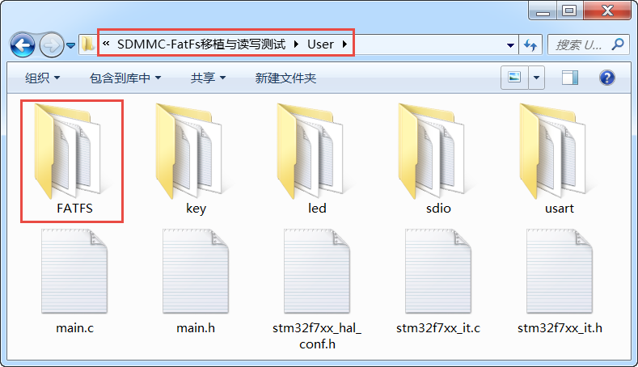
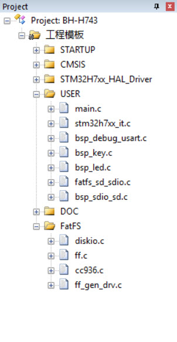
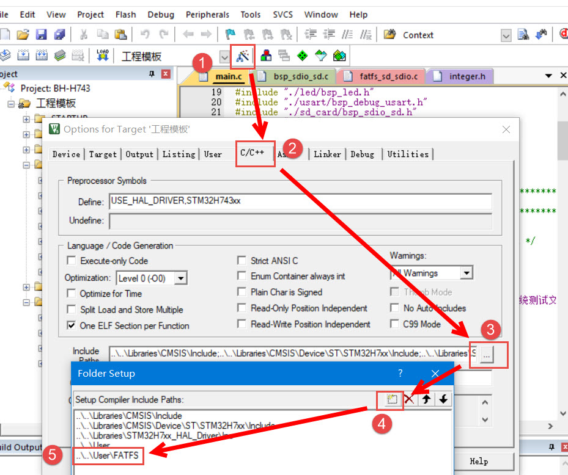

基于SD卡的FatFs文件系统
-----------------------

上一章我们已经全面介绍了SD卡的识别和简单的数据读写，也进行了简单的读写测试，不过像这样直接操作SD卡存储单元，在实际应用中是不现实的。SD卡一般用来存放文件，所以都需要加载文件系统到里面。
类似于串行Flash芯片，我们移植FatFs文件系统到SD卡内。

对于FatFs文件系统的介绍和具体移植过程参考“基于串行Flash的FatFs文件系统”，这里就不做过多介绍，重点放在SD卡与FatFs接口函数编写上。与串行Flash的FatFs文件系统移植例程相比，FatFs文件系统部分的代码只有diskio.c文件有所不同，其他的不用修改，所以一个简易的移植方法是利用原来工程进行修改。下面讲解利用原来工程实现SD卡的FatFs文件系统。

FatFs移植步骤
~~~~~~~~~~~~~

上一章我们已经完成了SD卡驱动程序以及进行了简单的读写测试。该工程有很多东西是现在可以使用的，所以我们先把上一章的工程文件完整的拷贝一份，并修改文件夹名为“SDIO-FatFs移植与读写测试”，如果此时使用KEIL软件打开该工程，应该是编译无错误并实现上一章的测试功能。

接下来，我们到串行Flash文件系统移植工程文件的“\\SPI—FatFs移植与读写测试\\User”文件夹下拷贝“FATFS”整个文件夹到现在工程文件的“\\SDIO—FatFs移植与读
写测试\\User”文件夹下，如 图36_1_。
该文件夹是FatFs文件系统的所有代码文件，在串行Flash移植FatFs文件系统时我们对部分文件做了修改，这里主要是想要保留之前的配置，而不是使用FatFs官方源码还需要重新配置。

图 36‑1 拷贝FatFs文件夹

现在就可以使用KEIL软件打开“SDIO-FatFs移植与读写测试”工程文件，并把FatFs相关文件添加到工程内，同时把sdio_test.c文件移除，参考
图36_2_。

添加文件之后还必须打开工程选项对话框添加文件系统的头文件路径，参考
图36_3_。

操作到这来，工程文件结构就算完整了，接下来就是修改文件代码了。这来有两个文件需要修改，为diskio.c文件和main.c文件。main.c文件内容可以
参考“SPI—FatFs移植与读写测试”工程中的main.c文件，只有做小细节修改而已。这来重点讲解diskio.c文件，也是整个移植的重点。

FatFs接口函数
~~~~~~~~~~~~~

FatFs文件系统与存储设备的连接函数在sd_diskio.c文件中，主要有5个函数需要我们编写的。

宏定义和存储设备状态获取函数
'''''''''''''''''''''''''''''''''''

代码清单 36‑1 宏定义和SD_status函数

.. code-block:: c
   :name: 代码清单36_1

    DSTATUS SD_status(BYTE lun)
    {
        Stat = STA_NOINIT;

        if (BSP_SD_GetStatus() == MSD_OK) {
            Stat &= ~STA_NOINIT;
        }

        return Stat;
    }

SD_status函数要求返回存储设备的当前状态，对于SD卡一般返回SD卡插入状态，这里直接返回正常状态。

存储设备初始化函数
'''''''''''''''''''''

代码清单 36‑2 disk_initialize函数

.. code-block:: c
   :name: 代码清单36_2

    DSTATUS SD_initialize(BYTE lun)
    {
        Stat = STA_NOINIT;

        /* Configure the uSD device */
        if (BSP_SD_Init() == MSD_OK) {
            Stat &= ~STA_NOINIT;
        }

        return Stat;
    }

该函数用于初始化存储设备，一般包括相关GPIO初始化、外设环境初始化、中断配置等等。对于SD卡，直接调用BSP_SD_Init函数实现对SD卡初始化，如果函数返回SD_OK说明SD卡正确插入，并且控制器可以与之正常通信。

存储设备数据读取函数
''''''''''''''''''''''''''

代码清单 36‑3 SD_read函数

.. code-block:: c
   :name: 代码清单36_3

    DRESULT SD_read(BYTE lun, BYTE *buff, DWORD sector, UINT count)
    {
        DRESULT res = RES_OK;

        if ((DWORD)buff & 3) {
            DWORD scratch[BLOCK_SIZE / 4];

            while (count--) {
                memcpy(scratch, buff, BLOCK_SIZE);
                res = SD_read(lun,(void *)scratch, sector++, 1);

                if (res != RES_OK) {
                    break;
                }
                buff += BLOCK_SIZE;
            }

            return (res);
        }
        if (BSP_SD_ReadBlocks_DMA((uint32_t*)buff,
                            (uint64_t) (sector * BLOCK_SIZE),
                            BLOCK_SIZE,
                            count) != MSD_OK) {
            res = RES_ERROR;
        }

        return res;
    }

SD_read函数用于从存储设备指定地址开始读取一定的数量的数据到指定存储区内。对于SD卡，最重要是使用BSP_SD_ReadBlocks_DMA函数读取多块数据到存储区。这里需要注意的地方是SD卡数据操作是使用DMA传输的，并设置数据尺寸为32位大小，为实现数据正确传输，要求存储区是4字节对齐。在某些情况下，FatFs提供的buff地址不是4字节对齐，这会导致DMA数据传输失败，所以为保证数据传输正确，可以先判断存储区地址是否是4字节对齐，如果存储区地址已经是4字节对齐，无需其他处理，直接使用BSP_SD_ReadBlocks_DMA函数执行多块读取即可。如果判断得到地址不是4字节对齐，则先申请一个4字节对齐的临时缓冲区，即局部数组变量scratch，通过定义为DWORD类型可以使得其自动4字节对齐，scratch所占的总存储空间也是一个块大小，这样把一个块数据读取到scratch内，然后把scratch存储器内容拷贝到buff地址空间上就可以了。

BSP_SD_ReadBlocks_DMA函数用于从SD卡内读取多个块数据，它有四个形参，分别为存储区地址指针、起始块地址、块大小以及块数量。

存储设备数据写入函数
''''''''''''''''''''''''

代码清单 36‑4 disk_write函数

.. code-block:: c
   :name: 代码清单36_4

    DRESULT SD_write(BYTE lun, const BYTE *buff, DWORD sector, UINT count)
    {
        DRESULT res = RES_OK;

        if ((DWORD)buff & 3) {
            DWORD scratch[BLOCK_SIZE / 4];

            while (count--) {
                memcpy(scratch, buff, BLOCK_SIZE);
                res = SD_write(lun,(void *)scratch, sector++, 1);

                if (res != RES_OK) {
                    break;
                }
                buff += BLOCK_SIZE;
            }

            return (res);
        }
        if (BSP_SD_WriteBlocks_DMA((uint32_t*)buff,
                            (uint64_t)(sector * BLOCK_SIZE),
                            BLOCK_SIZE, count) != MSD_OK) {
            res = RES_ERROR;
        }

        return res;
    }

SD_write函数用于向存储设备指定地址写入指定数量的数据。对于SD卡，执行过程与SD_read函数是非常相似，也必须先检测存储区地址是否是4字节对齐，如果是4字节对齐则直接调用BSP_SD_WriteBlocks_DMA函数完成多块数据写入操作。如果不是4字节对齐，申请一个4字节对齐的临时缓冲区，先把待写入的数据拷贝到该临时缓冲区内，然后才写入到SD卡。

BSP_SD_WriteBlocks_DMA函数是向SD卡写入多个块数据，它有四个形参，分别为存储区地址指针、起始块地址、块大小以及块数量，它与BSP_SD_ReadBlocks_DMA函数执行相互过程。最后也是需要使用相关函数保存数据写入完整才退出SD_write函数。

其他控制函数
'''''''''''''''

代码清单 36‑5 disk_ioctl函数

.. code-block:: c
   :name: 代码清单36_5

    DRESULT SD_ioctl(BYTE lun, BYTE cmd, void *buff)
    {
        DRESULT res = RES_ERROR;
        SD_CardInfo CardInfo;

        if (Stat & STA_NOINIT) return RES_NOTRDY;

        switch (cmd) {
        /* Make sure that no pending write process */
        case CTRL_SYNC :
            res = RES_OK;
            break;

        /* Get number of sectors on the disk (DWORD) */
        case GET_SECTOR_COUNT :
            BSP_SD_GetCardInfo(&CardInfo);
            *(DWORD*)buff = CardInfo.CardCapacity / BLOCK_SIZE;
            res = RES_OK;
            break;

        /* Get R/W sector size (WORD) */
        case GET_SECTOR_SIZE :
            *(WORD*)buff = BLOCK_SIZE;
            res = RES_OK;
            break;

        /* Get erase block size in unit of sector (DWORD) */
        case GET_BLOCK_SIZE :
            *(DWORD*)buff = BLOCK_SIZE;
            break;

        default:
            res = RES_PARERR;
        }

        return res;
    }

SD_ioctl函数有三个形参，lun为设备物理编号，cmd为控制指令，包括发出同步信号、获取扇区数目、获取扇区大小、获取擦除块数量等等指令，buff为指令对应的数据指针。

对于SD卡，为支持格式化功能，需要用到获取扇区数量(GET_SECTOR_COUNT)指令和获取块尺寸(GET_BLOCK_SIZE)。另外，SD卡扇区大小为512字节，串行Flash芯片一般设置扇区大小为4096字节，所以需要用到获取扇区大小(GET_SECTOR_SIZE)指令。

至此，基于SD卡的FatFs文件系统移植就已经完成了，最重要就是sd_diskio.c文件中5个函数的编写。接下来就编写FatFs基本的文件操作检测移植代码是否可以正确执行。

FatFs功能测试
~~~~~~~~~~~~~

主要的测试包括格式化测试、文件写入测试和文件读取测试三个部分，主要程序都在main.c文件中实现。

变量定义
''''''''''''

代码清单 36‑6 变量定义

.. code-block:: c
   :name: 代码清单36_6

    char SDPath[4]; 		/* SD逻辑驱动器路径 */
    FATFS fs;                         /* FatFs文件系统对象 */
    FIL fnew;                         /* 文件对象 */
    FRESULT res_sd;                /* 文件操作结果 */
    UINT fnum;                    /* 文件成功读写数量 */
    BYTE ReadBuffer[1024]= {0};       /* 读缓冲区 */
    BYTE WriteBuffer[] =              /* 写缓冲区*/
        "欢迎使用野火STM32 H743开发板 今天是个好日子，新建文件系统测试文件\r\n";

SDPath[4] 为存储SD逻辑驱动器路径的一个数组，存储的内容是“0:/”。

FATFS是在ff.h文件定义的一个结构体类型，针对的对象是物理设备，包含了物理设备的物理编号、扇区大小等等信息，一般我们都需要为每个物理设备定义一个FATFS变量。

FIL也是在ff.h文件定义的一个结构体类型，针对的对象是文件系统内具体的文件，包含了文件很多基本属性，比如文件大小、路径、当前读写地址等等。如果需要在同一时间打开多个文件进行读写，才需要定义多个FIL变量，不然一般定义一个FIL变量即可。

FRESULT是也在ff.h文件定义的一个枚举类型，作为FatFs函数的返回值类型，主要管理FatFs运行中出现的错误。总共有19种错误类型，包括物理设备读写错误、找不到文件、没有挂载工作空间等等错误。这在实际编程中非常重要，当有错误出现是我们要停止文件读写，通过返回值我们可以快速定位到错误发生的可能地点。如果运行没有错误才返回FR_OK。

fnum是个32位无符号整形变量，用来记录实际读取或者写入数据的数组。

buffer和textFileBuffer分别对应读取和写入数据缓存区，都是8位无符号整形数组。

主函数
'''''''''''''

代码清单 36‑7 main函数

.. code-block:: c
   :name: 代码清单36_7

    int main(void)
    {
        /* 配置系统时钟为216 MHz */
        SystemClock_Config();
        /* 使能指令缓存 */
        SCB_EnableICache();
        /* 使能数据缓存 */
        SCB_EnableDCache();
        /*禁用WiFi模块*/
        WIFI_PDN_INIT();
        /* 初始化LED */
        LED_GPIO_Config();
        LED_BLUE;
        /* 初始化调试串口，一般为串口1 */
        UARTx_Config();
        printf("****** 这是一个SD卡文件系统实验 ******\r\n");
        //链接驱动器，创建盘符
        FATFS_LinkDriver(&SD_Driver, SDPath);
        //在外部SD卡挂载文件系统，文件系统挂载时会对SD卡初始化
        res_sd = f_mount(&fs,"0:",1);

        /*----------------------- 格式化测试 ---------------------------*/
        /* 如果没有文件系统就格式化创建创建文件系统 */
        if (res_sd == FR_NO_FILESYSTEM) {
            printf("》SD卡还没有文件系统，即将进行格式化...\r\n");
            /* 格式化 */
            res_sd=f_mkfs("0:",0,0);

            if (res_sd == FR_OK) {
                printf("》SD卡已成功格式化文件系统。\r\n");
                /* 格式化后，先取消挂载 */
                res_sd = f_mount(NULL,"0:",1);
                /* 重新挂载 */
                res_sd = f_mount(&fs,"0:",1);
            } else {
                LED_RED;
                printf("《《格式化失败。》》\r\n");
                while (1);
            }
        } else if (res_sd!=FR_OK) {
            printf("！！SD卡挂载文件系统失败。(%d)\r\n",res_sd);
            printf("！！可能原因：SD卡初始化不成功。\r\n");
            while (1);
        } else {
            printf("》文件系统挂载成功，可以进行读写测试\r\n");
        }

        /*----------------------- 文件系统测试：写测试--------------------------*/
        /* 打开文件，如果文件不存在则创建它 */
        printf("\r\n****** 即将进行文件写入测试... ******\r\n");
    res_sd = f_open(&fnew, "0:FatFs读写测试文件.txt",FA_CREATE_ALWAYS | FA_WRITE );
        if ( res_sd == FR_OK ) {
            printf("》打开/创建FatFs读写测试文件.txt文件成功，向文件写入数据。\r\n");
            /* 将指定存储区内容写入到文件内 */
            res_sd=f_write(&fnew,WriteBuffer,sizeof(WriteBuffer),&fnum);
            if (res_sd==FR_OK) {
                printf("》文件写入成功，写入字节数据：%d\n",fnum);
                printf("》向文件写入的数据为：\r\n%s\r\n",WriteBuffer);
            } else {
                printf("！！文件写入失败：(%d)\n",res_sd);
            }
            /* 不再读写，关闭文件 */
            f_close(&fnew);
        } else {
            LED_RED;
            printf("！！打开/创建文件失败。\r\n");
        }

        /*------------------- 文件系统测试：读测试 ---------------------------*/
        printf("****** 即将进行文件读取测试... ******\r\n");
        res_sd = f_open(&fnew, "0:FatFs读写测试文件.txt", FA_OPEN_EXISTING | FA_READ);
        if (res_sd == FR_OK) {
            LED_GREEN;
            printf("》打开文件成功。\r\n");
            res_sd = f_read(&fnew, ReadBuffer, sizeof(ReadBuffer), &fnum);
            if (res_sd==FR_OK) {
                printf("》文件读取成功,读到字节数据：%d\r\n",fnum);
                printf("》读取得的文件数据为：\r\n%s \r\n", ReadBuffer);
            } else {
                printf("！！文件读取失败：(%d)\n",res_sd);
            }
        } else {
            LED_RED;
            printf("！！打开文件失败。\r\n");
        }
        /* 不再读写，关闭文件 */
        f_close(&fnew);

        /* 不再使用文件系统，取消挂载文件系统 */
        f_mount(NULL,"0:",1);

        /* 操作完成，停机 */
        while (1) {
        }
    }

首先，初始化系统时钟，调用WIFI_PDN_INIT函数禁用WiFi模块，接下来初始化RGB彩灯和调试串口，
用来指示程序进程。

FatFs的第一步工作是使用FATFS_LinkDriver函数创建盘符，然后就是使用f_mount函数挂载工作区。
f_mount函数有三个形参，第一个参数是指向FATFS变量指针，如果赋值为NULL可以取消物理设备挂载。
第二个参数为逻辑设备编号，使用设备根路径表示，与物理设备编号挂钩，在 代码清单36_7_ 中我们定义SD卡物理编号为0，
所以这里使用“0：”。第三个参数可选0或1，1表示立即挂载，0表示不立即挂载，延迟挂载。
f_mount函数会返回一个FRESULT类型值，指示运行情况。

如果f_mount函数返回值为FR_NO_FILESYSTEM，说明SD卡没有FAT文件系统。我们就必须对SD卡进行格式化处理。
使用f_mkfs函数可以实现格式化操作。f_mkfs函数有三个形参，第一个参数为逻辑设备编号；
第二参数可选0或者1，0表示设备为一般硬盘，1表示设备为软盘。第三个参数指定扇区大小，如果为0，
表示通过 代码清单36_5_ 中disk_ioctl函数获取。格式化成功后需要先取消挂载原来设备，再重新挂载设备。

在设备正常挂载后，就可以进行文件读写操作了。使用文件之前，必须使用f_open函数打开文件，不再使用文件必须使用f_close函数关闭文件，这个跟电脑端操作文件步骤类似。
f_open函数有三个形参，第一个参数为文件对象指针。第二参数为目标文件，包含绝对路径的文件名称和后缀名。第三个参数为访问文件模式选择，可以是打开已经存在的文件模式、读模式、写模式、新建模式、总是新建模式等的或运行结果。比如对于写测试，使用FA_CREATE_ALWAYS和FA_WRITE组合模式，就是总是新建文件并进行写模式。

f_close函数用于不再对文件进行读写操作关闭文件，f_close函数只要一个形参，为文件对象指针。f_close函数运行可以确保缓冲区完全写入到文件内。

成功打开文件之后就可以使用f_write函数和f_read函数对文件进行写操作和读操作。这两个函数用到的参数是一致的，只不过一个是数据写入，一个是数据读取。f_write函数第一个形参为文件对象指针，使用与f_open函数一致即可。第二个参数为待写入数据的首地址，对于f_read函数就是用来存放读出数据的首地址。第三个参数为写入数据的字节数，对于f_read函数就是欲读取数据的字节数。第四个参数为32位无符号整形指针，这里使用fnum变量地址赋值给它，在运行读写操作函数后，fnum变量指示成功读取或者写入的字节个数。

最后，不再使用文件系统时，使用f_mount函数取消挂载。

下载验证
'''''''''''

保证开发板相关硬件连接正确，用USB线连接开发板“USB TO UART”接口跟电脑，在电脑端打开串口调试助手，把编译好的程序下载到开发板。
程序开始运行后，RGB彩灯为蓝色，在串口调试助手可看到格式化测试、写文件检测和读文件检测三个过程；最后如果所有读写操作都正常，
RGB彩灯会指示为绿色，如果在运行中FatFs出现错误RGB彩灯指示为红色。正确执行例程程序后可以使用读卡器将SD卡在电脑端打开，
我们可以在SD卡根目录下看到“FatFs读写测试文件.txt”文件，这与程序设计是相吻合的。
