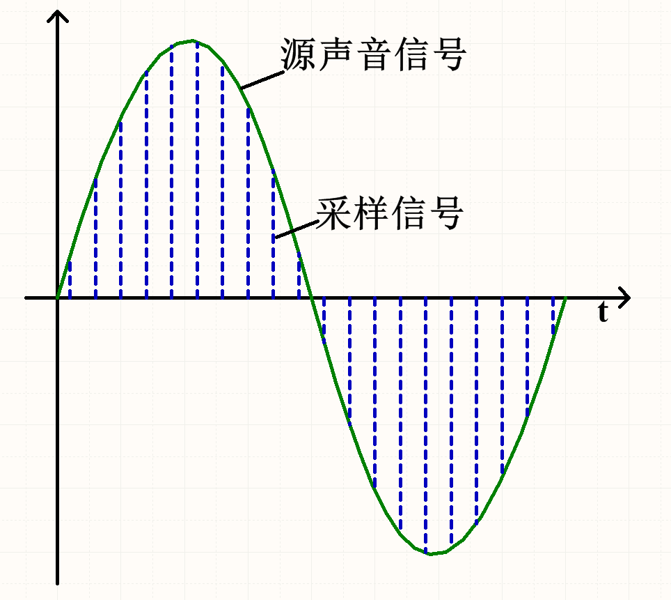
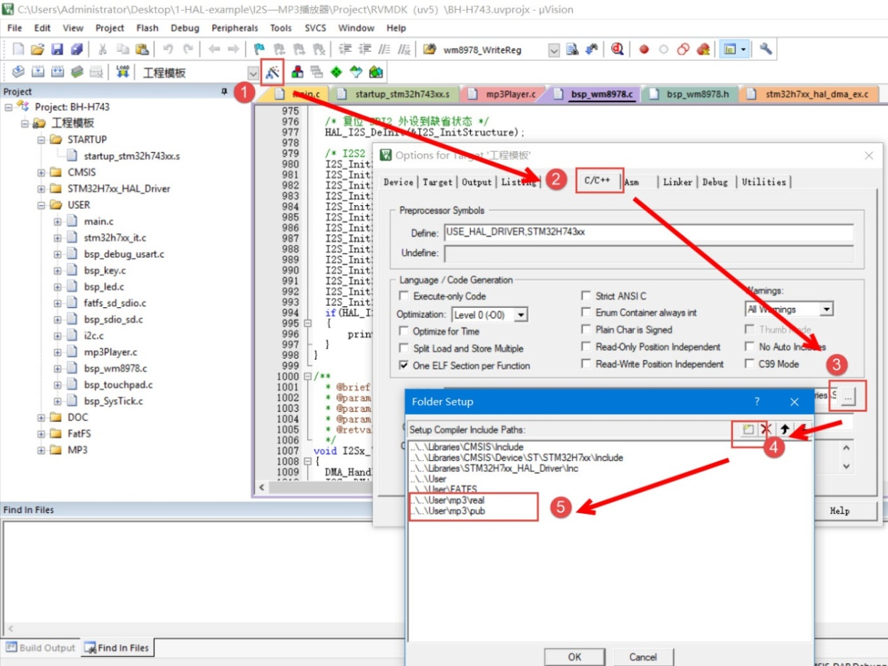

I2S—音频播放与录音输入
----------------------

本章参考资料：《STM32H74xxx参考手册》、《STM32F7xx规格书》、
库帮助文档《STM32F779xx_User_Manual.chm》及《I2S BUS》。

若对I2S通讯协议不了解，可先阅读《I2S BUS》文档的内容学习。

关于音频编译码器WM8978，请参考其规格书《WM8978_v4.5》来了解。

I2S简介
~~~~~~~

Inter-IC Sount
Bus(I2S)是飞利浦半导体公司(现为恩智浦半导体公司)针对数字音频设备之间的音频数据传输而制定的一种总线标准。在飞利浦公司的I2S标准中，既规定了硬件接口规范，也规定了数字音频数据的格式。

数字音频技术
^^^^^^^^^^^^

现实生活中的声音是通过一定介质传播的连续的波，它可以由周期和振幅两个重要指标描述。
正常人可以听到的声音频率范围为20Hz~20KHz。现实存在的声音是模拟量，
这对声音保存和长距离传输造成很大的困难，一般的做法是把模拟量转成对应的数字量保存，
在需要还原声音的地方再把数字量的转成模拟量输出，参考 图36_0_1_。

图 36_0_1 音频转换过程

模拟量转成数字量过程，一般可以分为三个过程，分别为采样、量化、编码，参考 图36_0_2_ 。
用一个比源声音频率高的采样信号去量化源声音，记录每个采样点的值，
最后如果把所有采样点数值连接起来与源声音曲线是互相吻合的，只是它不是连续的。
在图中两条蓝色虚线距离就是采样信号的周期，即对应一个采样频率(F\ :sub:`S`)，
可以想象得到采样频率越高最后得到的结果就与源声音越吻合，但此时采样数据量越越大，
一般使用44.1KHz采样频率即可得到高保真的声音。每条蓝色虚线长度决定着该时刻源声音的量化值，
该量化值有另外一个概念与之挂钩，就是量化位数。量化位数表示每个采样点用多少位表示数据范围，
常用有16bit、24bit或32bit，位数越高最后还原得到的音质越好，数据量也会越大。

图 36_0_2 声音数字化过程

WM8978是一个低功耗、高质量的立体声多媒体数字信号编译码器，集成DAC和ADC，可以实现声音信号量化成数字量输出，也可以实现数字量音频数据转换为模拟量声音驱动扬声器。这样使用WM8978芯片解决了声音与数字量音频数据转换问题，并且通过配置WM8978芯片相关寄存器可以控制转换过程的参数，比如采样频率，量化位数，增益、滤波等等。

WM8978芯片是一个音频编译码器，但本身没有保存音频数据功能，它只能接收其它设备传输过来的音频数据进行转换输出到扬声器，或者把采样到的音频数据输出到其它具有存储功能的设备保存下来。该芯片与其他设备进行音频数据传输接口就是I2S协议的音频接口。

I2S总线接口
^^^^^^^^^^^

I2S总线接口有3个主要信号，STM32F4xx只能实现数据半双工传输。

(1) SD(Serial
    Data)：串行数据线，用于发送或接收两个时分复用的数据通道上的数据。

(2) WS(Word
    Select)：字段选择线，也称帧时钟(LRC)线，表明当前传输数据的声道，不同标准有不同的定义。WS线的频率等于采样频率(F\ :sub:`S`)。

(3) CK(Serial
    Clock)：串行时钟线，也称位时钟(BCLK)，数字音频的每一位数据都对应有一个CK脉冲，它的频率为：2*采样频率*量化位数，2代表左右两个通道数据。

另外，有时为使系统间更好地同步，还要传输一个主时钟(MCK)，STM32H743x系列控制器固定输出为256\*
F\ :sub:`S`\ 。

音频数据传输协议标准
^^^^^^^^^^^^^^^^^^^^

随着技术的发展，在统一的I2S硬件接口下，出现了多种不同的数据格式，可分为左对齐(MSB)标准、右对齐(LSB)标准、I2S
Philips标准。另外，STM32H743x系列控制器还支持PCM(脉冲编码调)音频传输协议。下面以STM32H743x系列控制器资源解释这四个传输协议。

STM32H743x系列控制器I2S的数据寄存器只有16bit，并且左右声道数据一般是紧邻传输，为正确得到左右两个声道数据，需要软件控制数据对应通道数据写入或读取。另外，音频数据的量化位数可能不同，控制器支持16bit、24bit和32bit三种数据长度，因为数据寄存器是16bit的，所以对于24bit和32bit数据长度需要发送两个。为此，可以产生四种数据和帧格式组合：

-  将16位数据封装在16位帧中

-  将16位数据封装在32位帧中

-  将24位数据封装在32位帧中

-  将32位数据封装在32位帧中

当使用32位数据包中的16位数据时，前16位(MSB)为有效位，16位LSB被强制清零，无需任何软件操作或DMA请求（只需一个读/写操作）。如果程序使用DMA传输(一般都会用)，则24位和32位数据帧需要对数据寄存器执行两次DMA操作。24位的数据帧，硬件会将8位非有效位扩展到带有0位的32位。对于所有数据格式和通信标准而言，始终会先发送最高有效位(MSB优先)。

I2S Philips标准
'''''''''''''''

使用WS信号来指示当前正在发送的数据所属的通道，为0时表示左通道数据。
该信号从当前通道数据的第一个位(MSB)之前的一个时钟开始有效。发送方在时钟信号(CK)的下降沿改变数据，
接收方在上升沿读取数据。WS信号也在SCK的下降沿变化。参考 图36_0_3_，
为24bit数据封装在32bit帧传输波形。正如之前所说，
WS线频率对于采样频率F\ :sub:`S`\ ，一个WS线周期包括发送左声道和右声道数据，
在图中实际需要64个CK周期来完成一次传输。

图 36_0_3 I2S Philips标准24bit传输

左对齐标准
''''''''''

在WS发生翻转同时开始传输数据，参考 图36_0_4_，为24bit数据封装在32bit帧传输波形。
该标准较少使用。注意此时WS为1时，传输的是左声道数据，这刚好与I2S
Philips标准相反。

图 36_0_4 左对齐标准24bit传输

右对齐标准
''''''''''

与左对齐标准类似，参考 图36_0_5_，为24bit数据封装在32bit帧传输波形。

图36_0_5 右对齐标准24bit传输

PCM标准
'''''''

PCM即脉冲编码调制，模拟语音信号经过采样量化以及一定数据排列就是PCM了。WS不再作为声道数据选择。它有两种模式，短帧模式和长帧模式，以WS信号高电平保持时间为判别依据，长帧模式保持13个CK周期，短帧模式只保持1个CK周期，可以通过相关寄存器位选择。如果有多通道数据是在一个WS周期内传输完成的，传完左声道数据就紧跟发送右声道数据。
图36_0_6_ 为单声道数据16bit扩展到32bit数据帧发送波形。

图36_0_6 PCM标准16bit传输

I2S功能框图
~~~~~~~~~~~

STM32H743x系列控制器有三个I2S，I2S1、I2S2和I2S3，三个的资源是相互独立的，但分别与SPI1、SPI2和SPI3共用大部分资源。这样I2S1和SPI1只能选择一个功能使用，I2S2和SPI2、I2S3和SPI3相同道理。资源共用包括引脚共用和部分寄存器共用，当然也有部分是专用的。SPI已经在之前相关章节做了详细讲解，建议先看懂SPI相关内容再学习I2S。

控制器的I2S支持两种工作模式，主模式和从模式；主模式下使用自身时钟发生器生成通信时钟。I2S功能框图参考
图36_0_7_。

图36_0_7 I2S功能框图

功能引脚
^^^^^^^^^^^

I2S的SD映射到SPI的MOSI引脚，ext_SD映射到SPI的MISO引脚，WS映射到SPI的NSS引脚，CK映射到SPI的SCK引脚。MCK是I2S专用引脚，用于主模式下输出时钟或在从模式下输入时钟。I2S时钟发生器可以由控制器内部时钟源分频产生，亦可采用CKIN引脚输入时钟分频得到，一般使用内部时钟源即可。控制器I2S引脚分布参考表
36-0‑1。

表 36-0‑1 STM32f4xx系列控制器I2S引脚分布

+------+---------------+-----------------------+------------------+
| 引脚 |     I2S1      |         I2S2          |       I2S3       |
+======+===============+=======================+==================+
| SD   | PA7/PB5/PD7   | PC1/PC3/PB15/PI3      | PB2/PB5/PC12/PD6 |
+------+---------------+-----------------------+------------------+
| WS   | PA4/PA15/PG10 | PA11/PB12/PI0/PB4/PB9 | PA4/PA15         |
+------+---------------+-----------------------+------------------+
| CK   | PA5/PB3/PG11  | PA9/PA12/PB13/PI1/PD3 | PC10/PB3         |
+------+---------------+-----------------------+------------------+
| MCK  | PC4           | PC6                   | PC7              |
+------+---------------+-----------------------+------------------+
| CKIN | PC9                                                      |
+------+---------------+-----------------------+------------------+

数据寄存器
^^^^^^^^^^^

I2S有一个与SPI共用的SPI数据寄存器(SPI_DR)，有效长度为16bit，用于I2S数据发送和接收，它实际由三个部分组成，一个移位寄存器、一个发送缓冲区和一个接收缓冲区，当处于发送模式时，向SPI_DR写入数据先保存在发送缓冲区，总线自动把发送缓冲区内容转入到移位寄存器中进行传输；在接收模式下，实际接收到的数据先填充移位寄存器，然后自动转入接收缓冲区，软件读取SPI_DR时自动从接收缓冲区内读取。I2S是挂载在APB1总线上的。

逻辑控制
^^^^^^^^^^^

I2S的逻辑控制通过设置相关寄存器位实现，比如通过配置SPI_I2S配置寄存器(SPI_I2SCFGR)的相关位可以实现选择I2S和SPI模式切换、选择I2S工作在主模式还是从模式并且选择是发送还是接收、选择I2S标准、传输数据长度等等。SPI控制寄存器2(SPI_CR2)可用于设置相关中断和DMA请求使能，I2S有5个中断事件，分别为发送缓冲区为空、接收缓冲区非空、上溢错误、下溢错误和帧错误。SPI状态寄存器(SPI_SR)用于指示当前I2S状态。

时钟发生器
^^^^^^^^^^^

I2S比特率用来确定I2S数据线上的数据流和I2S时钟信号频率。I2S比特率=每个通道的位数×通道数×音频采样频率。

图36_0_8_ 为I2S时钟发生器内部结构图。
I2SxCLK(x可选2或3)可以通过RCC_CFGR寄存器的I2SSRC位选择使用PLLI2S时钟作为I2S时钟源或I2S_CKIN引脚输入时钟作为I2S时钟源。
一般选择内部PLLI2S(通过R分频系数)作为时钟源。例程程序设置PLLI2S时钟为258MHz，R分频系数为3，此时I2SxCLK时钟为86MHz。

图 36-0‑8 I2S时钟发生器内部结构

SPI_I2S预分频器寄存器(SPI_I2SPR)的MCKOE位用于设置MCK引脚时钟输出使能；ODD位设置预分频器的奇数因子，实际分频值=I2SDIV*2+ODD；I2SDIV为8位线性分频器，不可设置为0或1。

当使能MCK时钟输出，即MCKOE=1时，采样频率计算如下：

F\ :sub:`S` =
I2SxCLK/[(16*2)*((2*I2SDIV)+ODD)*8)]（通道帧宽度为16bit时）

F\ :sub:`S` =
I2SxCLK/[(32*2)*((2*I2SDIV)+ODD)*4)]（通道帧宽度为32bit时）

当禁止MCK时钟输出，即MCKOE=0时，采样频率计算如下：

F\ :sub:`S` = I2SxCLK/[(16*2)*((2*I2SDIV)+ODD))]（通道帧宽度为16bit时）

F\ :sub:`S` = I2SxCLK/[(32*2)*((2*I2SDIV)+ODD))]（通道帧宽度为32bit时）

WM8978音频编译码器
~~~~~~~~~~~~~~~~~~

WM8978是一个低功耗、高质量的立体声多媒体数字信号编译码器。它主要应用于便携式应用。它结合了立体声差分麦克风的前置放大与扬声器、耳机和差分、立体声线输出的驱动，减少了应用时必需的外部组件，比如不需要单独的麦克风或者耳机的放大器。

高级的片上数字信号处理功能，包含一个5路均衡功能，一个用于ADC和麦克风或者线路输入之间的混合信号的电平自动控制功能，一个纯粹的录音或者重放的数字限幅功能。另外在ADC的线路上提供了一个数字滤波的功能，可以更好的应用滤波，比如“减少风噪声”。

WM8978可以被应用为一个主机或者一个从机。基于共同的参考时钟频率，比如
12MHz和13MHz，内部的PLL可以为编译码器提供所有需要的音频时钟。与STM32控制器连接使用，STM32一般作为主机，WM8978作为从机。

图36_0_9_ 为WM8978芯片内部结构示意图，参考来自《WM8978_v4.5》。
该图给人的第一印象感觉就是很复杂，密密麻麻很多内容，特别有很多“开关”。
实际上，每个开关对应着WM8978内部寄存器的一个位，通过控制寄存器的就可以控制开关的状态。

图 36-0‑9 WM8978内部结构

输入部分
^^^^^^^^^^^

WM8978结构图的左边部分是输入部分，可用于模拟声音输入，即用于录音输入。有三个输入接口，一个是由LIN和LIP、RIN和RIP组合而成的伪差分立体声麦克风输入，一个是由L2和R2组合的立体声麦克风输入，还有一个是由AUXL和AUXR组合的线输入或用来传输告警声的输入。

输出部分
^^^^^^^^^^^

WM8978结构图的右边部分是声音放大输出部分，LOUT1和ROUT1用于耳机驱动，LOUT2和ROUT2用于扬声器驱动，OUT3和OUT4也可以配置成立体声线输出，OUT4也可以用于提供一个左右声道的单声道混合。

ADC和DAC
^^^^^^^^^^^

WM8978结构图的中边部分是芯片核心内容，处理声音的AD和DA转换。ADC部分对声音输入进行处理，包括ADC滤波处理、音量控制、输入限幅器/电平自动控制等等。DAC部分控制声音输出效果，包括DAC5路均衡器、DAC
3D放大、DAC输出限幅以及音量控制等等处理。

通信接口
^^^^^^^^^^^

WM8978有两个通信接口，一个是数字音频通信接口，另外一个是控制接口。音频接口是采用I2S接口，支持左对齐、右对齐和I2S标准模式，以及DSP模式A和模拟B。控制接口用于控制器发送控制命令配置WM8978运行状态，它提供2线或3线控制接口，对于STM32控制器，我们选择2线接口方式，它实际就是I2C总线方式，其芯片地址固定为0011010。通过控制接口可以访问WM8978内部寄存器，实现芯片工作环境配置，总共有58个寄存器，表示为R0至R57，限于篇幅问题这里不再深入探究，每个寄存器意义参考《WM8978_v4.5》了解。

WM8978寄存器是16bit长度，高7位([15:9]bit)用于表示寄存器地址，低9为有实际意义，比如对于 图36_0_9_ 中的某个开关。
所以在控制器向芯片发送控制命令时，必须传输长度为16bit的指令，芯片会根据接收命令高7位值寻址。

其他部分
^^^^^^^^^^^

WM8978作为主从机都必须对时钟进行管理，由内部PLL单元控制。另外还有电源管理单元。

WAV格式文件
~~~~~~~~~~~

WAV是微软公司开发的一种音频格式文件，用于保存Windows平台的音频信息资源，它符合资源互换文件格式(Resource
Interchange File
Format，RIFF)文件规范。标准格式化的WAV文件和CD格式一样，也是44.1K的取样频率，16位量化数字，因此在声音文件质量和CD相差无几！WAVE是录音时用的标准的WINDOWS文件格式，文件的扩展名为“WAV”，数据本身的格式为PCM或压缩型，属于无损音乐格式的一种。

RIFF文件规范
^^^^^^^^^^^^

RIFF有不同数量的chunk(区块)组成，每个chunk由“标识符”、“数据大小”和“数据”三个部分组成，
“标识符”和“数据大小”都是占用4个字节空间。简单RIFF格式文件结构参考 图36_0_10_。
最开始是ID为“RIFF”的chunk，Size为“RIFF”chunk数据字节长度，所以总文件大小为Size+8。
一般来说，chunk不允许内部再包含chunk，但有两个例外，ID为“RIFF”和“LIST”的chunk却是允许。
对此“RIFF”在其“数据”首4个字节用来存放“格式标识码(Form
Type)”，“LIST”则对应“LIST Type”。

图36_0_10 RIFF文件格式结构

WAVE文件
^^^^^^^^

WAVE文件是非常简单的一种RIFF文件，其“格式标识码”定义为WAVE。RIFF
chunk包括两个子chunk，ID分别为fmt和data，还有一个可选的fact chunk。Fmt
chunk用于表示音频数据的属性，包括编码方式、声道数目、采样频率、每个采样需要的bit数等等信息。fact
chunk是一个可选chunk，一般当WAVE文件由某些软件转化而成就包含fact
chunk。data chunk包含WAVE文件的数字化波形声音数据。WAVE整体结构如表
36-0‑2。

表 36‑0‑2 WAVE文件结构

+--------------------+
| 标识码(“RIFF”)     |
+====================+
| 数据大小           |
+--------------------+
| 格式标识码(“WAVE”) |
+--------------------+
| “fmt”              |
+--------------------+
| “fmt”块数据大小    |
+--------------------+
| “fmt”数据          |
+--------------------+
| “fact”(可选)       |
+--------------------+
| “fact”块数据大小   |
+--------------------+
| “fact”数据         |
+--------------------+
| “data”             |
+--------------------+
| 声音数据大小       |
+--------------------+
| 声音数据           |
+--------------------+

data
chunk是WAVE文件主体部分，包含声音数据，一般有两个编码格式：PCM和ADPCM，ADPCM(自适应差分脉冲编码调制)属于有损压缩，现在几乎不用，绝大部分WAVE文件是PCM编码。PCM编码声音数据可以说是在“数字音频技术”介绍的源数据，主要参数是采样频率和量化位数。

表 36-0‑3为量化位数为16bit时不同声道数据在data chunk数据排列格式。

表 36‑0‑3 16bit声音数据格式

WAVE文件实例分析
^^^^^^^^^^^^^^^^

利用winhex工具软件可以非常方便以十六进制查看文件，图36_0_11_ 为名为“张国荣-一盏小明灯.wav”
文件使用winhex工具打开的部分界面截图。这部分截图是WAVE文件头部分，声音数据部分数据量非常大，有兴趣可以使用winhex查看。

图36_0_11 WAV文件头实例

下面对文件头进行解读，参考表 36‑0-4。

表 36‑0‑4 WAVE文件格式说明

+--------+----------+--------+----------+--------------+------------------+
|        | 偏移地址 | 字节数 | 数据类型 | 十六进制源码 |       内容       |
+========+==========+========+==========+==============+==================+
| 文件头 | 00H      | 4      | char     | 52 49 46     | “RIFF”标识       |
|        |          |        |          | 46           | 符               |
+--------+----------+--------+----------+--------------+------------------+
|        | 04H      | 4      | long int | F4 FE 83     | 文件长度：0x0    |
|        |          |        |          | 01           | 183FEF4(         |
|        |          |        |          |              | 注意顺序)        |
+--------+----------+--------+----------+--------------+------------------+
|        | 08H      | 4      | char     | 57 41 56     | “WAVE”标识       |
|        |          |        |          | 45           | 符               |
+--------+----------+--------+----------+--------------+------------------+
|        | 0CH      | 4      | char     | 66 6D 74     | “fmt             |
|        |          |        |          | 20           | ”，最后一位为空  |
|        |          |        |          |              | 格               |
+--------+----------+--------+----------+--------------+------------------+
|        | 10H      | 4      | long int | 10 00 00     | fmt              |
|        |          |        |          | 00           | chunk大小：      |
|        |          |        |          |              | 0x10             |
+--------+----------+--------+----------+--------------+------------------+
|        | 14H      | 2      | int      | 01 00        | 编码格式：0x0    |
|        |          |        |          |              | 1为PCM。         |
+--------+----------+--------+----------+--------------+------------------+
|        | 16H      | 2      | int      | 02 00        | 声道数目：0x0    |
|        |          |        |          |              | 1为单声道，0x    |
|        |          |        |          |              | 02为双声道       |
+--------+----------+--------+----------+--------------+------------------+
|        | 18H      | 4      | int      | 44 AC 00     | 采样频率(每秒样  |
|        |          |        |          | 00           | 本数)：0xAC      |
|        |          |        |          |              | 44(44100         |
|        |          |        |          |              | )                |
+--------+----------+--------+----------+--------------+------------------+
|        | 1CH      | 4      | long int | 10 B1 02     | 每秒字节数：0x   |
|        |          |        |          | 00           | 02B110，等       |
|        |          |        |          |              | 于声道数*采样频  |
|        |          |        |          |              | 率*量化位数/8    |
+--------+----------+--------+----------+--------------+------------------+
|        | 20H      | 2      | int      | 04 00        | 每个采样点字节数 |
|        |          |        |          |              | ：0x04，等于     |
|        |          |        |          |              | 声道数*量化位数  |
|        |          |        |          |              | /8               |
+--------+----------+--------+----------+--------------+------------------+
|        | 22H      | 2      | int      | 10 00        | 量化位数：0x1    |
|        |          |        |          |              | 0                |
+--------+----------+--------+----------+--------------+------------------+
|        | 24H      | 4      | char     | 64 61 74     | “data”数据       |
|        |          |        |          | 61           | 标识符           |
+--------+----------+--------+----------+--------------+------------------+
|        | 28H      | 4      | long int | 48 FE 83     | 声音数据量：0x   |
|        |          |        |          | 01           | 0183FE48         |
+--------+----------+--------+----------+--------------+------------------+

I2S初始化结构体详解
~~~~~~~~~~~~~~~~~~~

HAL库函数对I2S外设建立了一个初始化结构体I2S_InitTypeDef。初始化结构体成员用于设置I2S工作环境参数，并由I2S相应初始化配置函数HAL_I2S_Init调用，这些设定参数将会设置I2S相应的寄存器，达到配置I2S工作环境的目的。

初始化结构体和初始化库函数配合使用是HAL库精髓所在，理解了初始化结构体每个成员意义基本上就可以对该外设运用自如了。初始化结构体定义在stm32f7xx_hal_spi.h文件中，初始化库函数定义在stm32f7xx_hal_spi.c文件中，编程时我们可以结合这两个文件内注释使用。

I2S初始化结构体用于配置I2S基本工作环境，比如I2S工作模式、通信标准选择等等。它被I2S_Init函数调用。

代码清单36_0_1 I2S_InitTypeDef结构体

.. code-block:: c
   :name: 代码清单36_0_1

    typedef struct {
        uint32_t Mode;        // I2S模式选择
        uint32_t Standard;    // I2S标准选择
        uint32_t DataFormat;  // 数据格式
        uint32_t MCLKOutput;  // 主时钟输出使能
        uint32_t AudioFreq;   // 采样频率
        uint32_t CPOL;        // 空闲电平选择
    } I2S_InitTypeDef;

(1) Mode：I2S模式选择，可选主机发送、主机接收、从机发送以及从机接收模式，
    它设定SPI_I2SCFGR寄存器I2SCFG位的值。一般设置STM32控制器为主机模式，
    当播放声音时选择发送模式；当录制声音时选择接收模式。

(2) Standard：通信标准格式选择，可选I2S
    Philips标准、左对齐标准、右对齐标准、PCM短帧标准或PCM长帧标准，它设定SPI_I2SCFGR寄存器I2SSTD位和PCMSYNC位的值。一般设置为I2S
    Philips标准即可。

(3) DataFormat：数据格式选择，设定有效数据长度和帧长度，可选标准16bit格式、
    扩展16bit(32bit帧长度)格式、24bit格式和32bit格式，它设定SPI_I2SCFGR寄存器DATLEN位和CHLEN位的值。
    对应16bit数据长度可选16bit或32bit帧长度，其他都是32bit帧长度。

(4) MCLKOutput：主时钟输出使能控制，可选使能输出或禁止输出，它设定SPI_I2SPR寄存器MCKOE位的值。
    为提高系统性能一般使能主时钟输出。

(5) AudioFreq：采样频率设置，HAL库提供采样采样频率选择，分别为8kHz、11kHz、16kHz、
    22kHz、32kHz、44kHz、48kHz、96kHz、192kHz以及默认2Hz，它设定SPI_I2SPR寄存器的值。

(6) CPOL：空闲状态的CK线电平，可选高电平或低电平，它设定SPI_I2SCFGR寄存器CKPOL位的值。一般设置为电平即可。

录音与回放实验
~~~~~~~~~~~~~~~~

WAV格式文件在现阶段一般以无损音乐格式存在，音质可以达到CD格式标准。结合上一章SD卡操作内容，本实验通过FatFS文件系统函数从SD卡读取WAV格式文件数据，然后通过I2S接口将音频数据发送到WM8978芯片，这样在WM8978芯片的扬声器接口即可输出声音，整个系统构成一个简单的音频播放器。反过来的，我们可以实现录音功能，控制启动WM8978芯片的麦克风输入功能，音频数据从WM8978芯片的I2S接口传输到STM32控制器存储器中，利用SD卡文件读写函数，根据WAV格式文件的要求填充文件头，然后就把WM8978传输过来的音频数据写入到WAV格式文件中，这样就可以制成一个WAV格式文件，可以通过开发板回放也可以在电脑端回放。

硬件设计
^^^^^^^^

开发板板载WM8978芯片，具体电路设计参考 图36_0_12_。WM8978与STM32H743x有两个连接接口，I2S音频接口和两线I2C控制接口，
通过将WM8978芯片的MODE引脚拉低选择两线控制接口，符合I2C通信协议，这也导致WM8978是只写的，所以在程序上需要做一些处理。
WM8978输入部分有两种模式，一个是板载咪头输入，另外一个是通过3.5mm耳机插座引出。WM8978输出部分通过3.5mm耳机插座引出，
可直接接普通的耳机线或作为功放设备的输入源。由于STM32H743x的I2S是半双工，所以录音跟播音我们需要用到一个模拟开关来切换，
而控制开关(MIC_EN)则使用WM8978的GPIO1控制。

图 36-0‑12 WM8978电路设计

软件设计
^^^^^^^^

这里只讲解核心的部分代码，有些变量的设置，头文件的包含等没有全部罗列出来，完整的代码请参考本章配套的工程。

上一章我们已经介绍了基于SD卡的文件系统，认识读写SD卡内文件方法，前面已经介绍了WAV格式文件结构以及WM8978芯片相关内容，通过WM8978音频接口传输过来的音频数据可以直接作为WAV格式文件的音频数据部分，大致过程就是程序控制WM8978启动录音功能，通过I2S音频数据接口WM8978的录音输出传输到STM32控制器指定缓冲区内，然后利用FatFs的文件写入函数把缓冲区数据写入到WAV格式文件中，最终实现声音录制功能。同样的道理，WAV格式文件中的音频数据可以直接传输给WM8978芯片实现音乐播放，整个过程与声音录制工程相反。

STM32控制器与WM8978通信可分为两部分驱动函数，一部分是I2C控制接口，另一部分是I2S音频数据接口。

bsp_wm8978.c和bsp_wm8978.h两个是专门创建用来存放WM8978芯片驱动代码。

I2C控制接口
'''''''''''

WM8978要正常工作并且实现符合我们的要求，我们必须对芯片相关寄存器进行必须要配置，STM32控制器通过I2C接口与WM8978芯片控制接口连接。I2C接口内容也已经在以前做了详细介绍，这里主要讲解WM8978的功能函数。

bsp_wm8978.c文件中的I2C_GPIO_Config函数、I2C_Mode_Configu函数以及wm8978_Init函数用于I2C通信接口GPIO和I2C相关配置，属于常规配置可以参考GPIO和I2C章节理解，这里不再分析，代码具体见本章配套程序工程文件。

输入输出选择枚举
==================

代码清单36_0_2 输入输出选择枚举

.. code-block:: c
   :name: 代码清单36_0_2

    /* WM8978 音频输入通道控制选项, 可以选择多路，比如 MIC_LEFT_ON | LINE_ON */
    typedef enum {
        IN_PATH_OFF   = 0x00, /* 无输入 */
        MIC_LEFT_ON   = 0x01, /* LIN,LIP脚，MIC左声道（接板载咪头）  */
        MIC_RIGHT_ON  = 0x02, /* RIN,RIP脚，MIC右声道（接板载咪头）  */
        LINE_ON       = 0x04, /* L2,R2 立体声输入(接板载耳机插座) */
        AUX_ON        = 0x08, /* AUXL,AUXR 立体声输入（开发板没用到） */
        DAC_ON        = 0x10, /* I2S数据DAC (CPU产生音频信号) */
        ADC_ON        = 0x20  /* 输入的音频馈入WM8978内部ADC （I2S录音) */
    } IN_PATH_E;

    /* WM8978 音频输出通道控制选项, 可以选择多路 */
    typedef enum {
        OUT_PATH_OFF  = 0x00, /* 无输出 */
        EAR_LEFT_ON   = 0x01, /* LOUT1 耳机左声道(接板载耳机插座) */
        EAR_RIGHT_ON  = 0x02, /* ROUT1 耳机右声道(接板载耳机插座) */
        SPK_ON        = 0x04, /* LOUT2和ROUT2反相输出单声道（开发板没用到）*/
        OUT3_4_ON     = 0x08, /* OUT3 和 OUT4 输出单声道音频（开发板没用到）*/
    } OUT_PATH_E;

IN_PATH_E和OUT_PATH_E枚举了WM8978芯片可用的声音输入源和输出端口，具体到开发板，如果进行录用功能，设置输入源为(MIC_RIGHT_ON|ADC_ON)或(LINE_ON|ADC_ON)，设置输出端口为OUT_PATH_OFF或(EAR_LEFT_ON
\|
EAR_RIGHT_ON)；对于音乐播放功能，设置输入源为DAC_ON，设置输出端口为(EAR_LEFT_ON
\| EAR_RIGHT_ON)。

宏定义
==========

代码清单36_0_3 宏定义

.. code-block:: c
   :name: 代码清单36_0_3

    /* 定义最大音量 */
    #define VOLUME_MAX                            63    /* 最大音量 */
    #define VOLUME_STEP                           1    /* 音量调节步长 */

    /* 定义最大MIC增益 */
    #define GAIN_MAX                               63    /* 最大增益 */
    #define GAIN_STEP                              1    /* 增益步长 */

    /* WM8978 I2C从机地址 */
    #define WM8978_SLAVE_ADDRESS                   0x34
    /*等待超时时间*/
    #define WM8978_I2C_FLAG_TIMEOUT             ((uint32_t)0x4000)
    #define WM8978_I2C_LONG_TIMEOUT  ((uint32_t)(10*WM8978_I2C_FLAG_TIMEOUT))

WM8978声音调节有一定的范围限制，比如R52(LOUT1 Volume
Control)的LOUT1VOL[5:0]位用于设置LOUT1的音量大小，可赋值范围为0~63。WM8978包含可调节的输入麦克风PGA增益，可对每个外部输入端口可单独设置增益大小，比如R45(Left
Channel input PGA volume
control)的INPPGAVOL[5:0]位用于设置左通道输入增益音量，最大可设置值为63。

WM8978控制接口被设置为I2C模式，其地址固定为0011010，为方便使用，直接定义为0x34。

最后定义I2C通信超时等待时间。

WM8978寄存器写入
==================

代码清单36_0_4 WM8978寄存器写入

.. code-block:: c
   :name: 代码清单36_0_4

    /**
    * @brief  通过I2C将给定寄存器的字节写入音频编解码器
    * @param  RegisterAddr: 待写入寄存器的地址
    * @param  RegisterValue: 要写入目标寄存器的字节值
    * @retval 通信成功返回1，失败返回0
    */
    static uint8_t WM8978_I2C_WriteRegister(uint8_t RegisterAddr,
    uint16_t RegisterValue)
    {
        uint16_t tmp;

        tmp  = (RegisterValue&0xff) << 8;
        tmp |= ((RegisterAddr << 1) & 0xFE) | ((RegisterValue >> 8) & 0x1);
        if (HAL_I2C_Master_Transmit(&I2C_Handle,WM8978_SLAVE_ADDRESS,(uint8_t
        *)&tmp,2,WM8978_I2C_FLAG_TIMEOUT)==HAL_OK) {    return 1;
        } else
            return 0;
    }

WM8978_I2C_WriteRegister用于向WM8978芯片寄存器写入数值，达到配置芯片工作环境，函数有两个形参，一个是寄存器地址，可设置范围为0~57；另外一个是寄存器值，WM8978芯片寄存器总共有16bit，前7bit用于寻址，后9位才是数据，这里寄存器值形参使用uint16_t类型，只有低9位有效。

使用I2C通信，首先使用中间变量提取正确的寄存器地址及数据值，然后调用HAL_I2C_Master_Transmit
函数发送两次数据，因为I2C数据发送一次只能发送8bit数据，为此需要把RegisterValue变量的第9bit整合到RegisterAddr变量的第0位先发送，接下来再发送RegisterValue变量的低8bit数据。

HAL_I2C_Master_Transmit函数中还有I2C通信超时等待功能，防止出错时卡死。

WM8978寄存器读取
===================

WM8978芯片是从硬件上选择I2C通信模式，该模式是只写的，STM32控制器无法读取WM8978寄存器内容，但程序有时需要用到寄存器内容，
为此我们创建了一个存放WM8978所有寄存器值的数组，在系统复位是将数组内容设置为WM8978缺省值，
然后在每次修改寄存器内容时同步更新该数组内容，这样可以达到该数组与WM8978寄存器内容相等的效果，参考 代码清单36_0_5_。

代码清单36_0_5 WM8978寄存器值缓冲区和读取

.. code-block:: c
   :name: 代码清单36_0_5

    /*
    wm8978寄存器缓存
    由于WM8978的I2C两线接口不支持读取操作，因此寄存器值缓存在内存中，
    当写寄存器时同步更新缓存，读寄存器时直接返回缓存中的值。
    寄存器MAP 在WM8978(V4.5_2011).pdf 的第89页，寄存器地址是7bit， 寄存器数据是9bit
    */
    static uint16_t wm8978_RegCash[] = {
        0x000, 0x000, 0x000, 0x000, 0x050, 0x000, 0x140, 0x000,
        0x000, 0x000, 0x000, 0x0FF, 0x0FF, 0x000, 0x100, 0x0FF,
        0x0FF, 0x000, 0x12C, 0x02C, 0x02C, 0x02C, 0x02C, 0x000,
        0x032, 0x000, 0x000, 0x000, 0x000, 0x000, 0x000, 0x000,
        0x038, 0x00B, 0x032, 0x000, 0x008, 0x00C, 0x093, 0x0E9,
        0x000, 0x000, 0x000, 0x000, 0x003, 0x010, 0x010, 0x100,
        0x100, 0x002, 0x001, 0x001, 0x039, 0x039, 0x039, 0x039,
        0x001, 0x001
    };

    /**
    * @brief  从cash中读回读回wm8978寄存器
    * @param  _ucRegAddr ： 寄存器地址
    * @retval 寄存器值
    */
    static uint16_t wm8978_ReadReg(uint8_t _ucRegAddr)
    {
        return wm8978_RegCash[_ucRegAddr];
    }

    /**
    * @brief  写wm8978寄存器
    * @param  _ucRegAddr： 寄存器地址
    * @param  _usValue： 寄存器值
    * @retval 0：写入失败
    *         1：写入成功
    */
    static uint8_t wm8978_WriteReg(uint8_t _ucRegAddr, uint16_t _usValue)
    {
        uint8_t res;
        res=WM8978_I2C_WriteRegister(_ucRegAddr,_usValue);
        wm8978_RegCash[_ucRegAddr] = _usValue;
        return res;
    }

wm8978_WriteReg实现向WM8978寄存器写入数据并修改缓冲区内容。

输出音量修改与读取
=====================

代码清单36_0_6 音量修改与读取

.. code-block:: c
   :name: 代码清单36_0_6

    /**
    * @brief  修改输出通道1音量
    * @param  _ucVolume ：音量值, 0-63
    * @retval 无
    */
    void wm8978_SetOUT1Volume(uint8_t _ucVolume)
    {
        uint16_t regL;
        uint16_t regR;

        if (_ucVolume > VOLUME_MAX) {
            _ucVolume = VOLUME_MAX;
        }
        regL = _ucVolume;
        regR = _ucVolume;
        /*
        R52 LOUT1 Volume control
        R53 ROUT1 Volume control
        */
        /* 先更新左声道缓存值 */
        wm8978_WriteReg(52, regL | 0x00);

        /* 再同步更新左右声道的音量 */
        /* 0x180表示 在音量为0时再更新，避免调节音量出现的“嘎哒”声 */
        wm8978_WriteReg(53, regR | 0x100);
    }

    /**
    * @brief  读取输出通道1音量
    * @param  无
    * @retval 当前音量值
    */
    uint8_t wm8978_ReadOUT1Volume(void)
    {
        return (uint8_t)(wm8978_ReadReg(52) & 0x3F );
    }

    /**
    * @brief  输出静音.
    * @param  _ucMute：模式选择
    *         @arg 1：静音
    *         @arg 0：取消静音
    * @retval 无
    */
    void wm8978_OutMute(uint8_t _ucMute)
    {
        uint16_t usRegValue;
        if (_ucMute == 1) { /* 静音 */
            usRegValue = wm8978_ReadReg(52); /* Left Mixer Control */
            usRegValue |= (1u << 6);
            wm8978_WriteReg(52, usRegValue);

            usRegValue = wm8978_ReadReg(53); /* Left Mixer Control */
            usRegValue |= (1u << 6);
            wm8978_WriteReg(53, usRegValue);

            usRegValue = wm8978_ReadReg(45); /* Right Mixer Control */
            usRegValue |= (1u << 6);
            wm8978_WriteReg(45, usRegValue);

            usRegValue = wm8978_ReadReg(55); /* Right Mixer Control */
            usRegValue |= (1u << 6);
            wm8978_WriteReg(55, usRegValue);
        } else {  /* 取消静音 */
            usRegValue = wm8978_ReadReg(52);
            usRegValue &= ~(1u << 6);
            wm8978_WriteReg(52, usRegValue);

            usRegValue = wm8978_ReadReg(53); /* Left Mixer Control */
            usRegValue &= ~(1u << 6);
            wm8978_WriteReg(53, usRegValue);

            usRegValue = wm8978_ReadReg(45);
            usRegValue &= ~(1u << 6);
            wm8978_WriteReg(45, usRegValue);

            usRegValue = wm8978_ReadReg(55); /* Left Mixer Control */
            usRegValue &= ~(1u << 6);
            wm8978_WriteReg(55, usRegValue);
        }
    }

wm8978_SetOUT1Volume函数用于修改OUT1通道的音量大小，有一个形参用于指示音量大小，要求范围为0~63。这里同时更新OUT1的左右两个声道音量，WM8978芯片的R52和R53分别用于设置OUT1的左声道和右声道音量，具体位段意义参考表
36-0‑5。wm8978_SetOUT1Volume函数会同时修改WM8978寄存器缓存区wm8978_RegCash数组内容。

    表 36‑0‑5 OUT1音量控制寄存器

+-----------------+-----+--------+------------------------------+
|   寄存器地址    | 位  | 默认值 |             描述             |
+=================+=====+========+==============================+
| R52(LOUT1       | 8   | 不锁存 | 直到一个 1                   |
| Volume Control) |     |        | 写入到 HPVU                  |
|                 |     |        | 才更 新 LOUT1                |
|                 |     |        | 和 ROUT1 音量                |
+-----------------+-----+--------+------------------------------+
|                 | 7   | 0      | 耳机音量零交叉使能：0=仅仅在 |
|                 |     |        | 零交叉时改变增益；1=立即改变 |
|                 |     |        | 增益                         |
+-----------------+-----+--------+------------------------------+
|                 | 6   | 0      | 左耳机输出消声：0=正常操作； |
|                 |     |        | 1=消声                       |
+-----------------+-----+--------+------------------------------+
|                 | 5:0 | 11101  | 左耳机输出驱动：             |
|                 |     |        |                              |
|                 |     |        |                              |
|                 |     |        | 000000=-57dB                 |
|                 |     |        |                              |
|                 |     |        | …                            |
|                 |     |        |                              |
|                 |     |        | 111001=0dB                   |
|                 |     |        |                              |
|                 |     |        | …                            |
|                 |     |        |                              |
|                 |     |        | 111111=+6dB                  |
+-----------------+-----+--------+------------------------------+
| R53(ROUT1       | 8   | 不锁存 | 直到一个 1                   |
| Volume Control) |     |        | 写入到 HPVU                  |
|                 |     |        | 才更 新 LOUT1                |
|                 |     |        | 和 ROUT1 音量                |
+-----------------+-----+--------+------------------------------+
|                 | 7   | 0      | 耳机音量零交叉使能：0=仅仅在 |
|                 |     |        | 零交叉时改变增益；1=立即改变 |
|                 |     |        | 增益                         |
+-----------------+-----+--------+------------------------------+
|                 | 6   | 0      | 左耳机输出消声：0=正常操作； |
|                 |     |        | 1=消声                       |
+-----------------+-----+--------+------------------------------+
|                 | 5:0 | 11101  | 右耳机输出驱动：             |
|                 |     |        |                              |
|                 |     |        |                              |
|                 |     |        | 000000=-57dB                 |
|                 |     |        |                              |
|                 |     |        | …                            |
|                 |     |        |                              |
|                 |     |        | 111001=0dB                   |
|                 |     |        |                              |
|                 |     |        | …                            |
|                 |     |        |                              |
|                 |     |        | 111111=+6dB                  |
+-----------------+-----+--------+------------------------------+

另外，wm8978_SetOUT2Volume用于设置OUT2的音量，程序结构与wm8978_SetOUT1Volume相同，只是对应修改R45和R55。

wm8978_ReadOUT1Volume函数用于读取OUT1的音量，它实际就是读取wm8978_RegCash数组对应元素内容。

wm8978_OutMute用于静音控制，它有一个形参用于设置静音效果，如果为1则为开启静音，如果为0则取消静音。静音控制是通过R52和R53的第6位实现的，在进入静音模式时需要先保存OUT1和OUT2的音量大小，然后在退出静音模式时就可以正确返回到静音前OUT1和OUT2的配置。

输入增益调整
==============

代码清单36_0_7 输入增益调整

.. code-block:: c
   :name: 代码清单36_0_7

    /**
    * @brief  设置增益
    * @param  _ucGain ：增益值, 0-63
    * @retval 无
    */
    void wm8978_SetMicGain(uint8_t _ucGain)
    {
        if (_ucGain > GAIN_MAX) {
            _ucGain = GAIN_MAX;
        }

        /* PGA 音量控制  R45， R46
        Bit8  INPPGAUPDATE
        Bit7  INPPGAZCL   过零再更改
        Bit6  INPPGAMUTEL   PGA静音
        Bit5:0  增益值，010000是0dB
        */
        wm8978_WriteReg(45, _ucGain);
        wm8978_WriteReg(46, _ucGain | (1 << 8));
    }

    /**
    * @brief  设置Line输入通道的增益
    * @param  _ucGain ：音量值, 0-7. 7最大，0最小。 可衰减可放大。
    * @retval 无
    */
    void wm8978_SetLineGain(uint8_t _ucGain)
    {
        uint16_t usRegValue;

        if (_ucGain > 7) {
            _ucGain = 7;
        }

        /*
        Mic 输入信道的增益由 PGABOOSTL 和 PGABOOSTR 控制
        Aux 输入信道的输入增益由 AUXL2BOOSTVO[2:0] 和 AUXR2BOOSTVO[2:0] 控制
        Line 输入信道的增益由 LIP2BOOSTVOL[2:0] 和 RIP2BOOSTVOL[2:0] 控制
        */
        /* R47（左声道），R48（右声道）, MIC 增益控制寄存器
        R47 (R48定义与此相同)
        B8 PGABOOSTL=1,0表示MIC信号直通无增益，1表示MIC信号+20dB增益（通过自举电路）
        B7 = 0， 保留
        B6:4  L2_2BOOSTVOL=x，0表示禁止，1-7表示增益-12dB ~ +6dB（可以衰减也可以放大）
        B3 = 0， 保留
        B2:0 AUXL2BOOSTVOL=x，0表示禁止，1-7表示增益-12dB~+6dB（可以衰减也可以放大）
        */

        usRegValue = wm8978_ReadReg(47);
        usRegValue &= 0x8F;/* 将Bit6:4清0   1000 1111*/
        usRegValue |= (_ucGain << 4);
        wm8978_WriteReg(47, usRegValue);  /* 写左声道输入增益控制寄存器 */

        usRegValue = wm8978_ReadReg(48);
        usRegValue &= 0x8F;/* 将Bit6:4清0   1000 1111*/
        usRegValue |= (_ucGain << 4);
        wm8978_WriteReg(48, usRegValue);  /* 写右声道输入增益控制寄存器 */
    }

wm8978_SetMicGain用于设置麦克风输入的增益，可以设置增强或减弱输入效果，比如对于部分声音源本身就是比较微弱，我们就可以设置放大该信号，从而得到合适的录制效果，该函数主要通过设置R45和R46实现，可设置的范围为0~63，默认值为16，没有增益效果。

wm8978_SetLineGain用于设置LINE输入的增益，对应芯片的L2和R2引脚组合的输入，开发板使用耳机插座引出拓展。它通过设置R47和R48寄存器实现，可设置范围为0~7，默认值为0，没有增益效果。

音频接口标准选择
==================

代码清单36_0_8 wm8978_CfgAudioIF函数

.. code-block:: c
   :name: 代码清单36_0_8

    /**
    * @brief  配置WM8978的音频接口(I2S)
    * @param  _usStandard : 接口标准，
            I2S_Standard_Phillips, I2S_Standard_MSB 或 I2S_Standard_LSB
    * @param  _ucWordLen : 字长，16、24、32  （丢弃不常用的20bit格式）
    * @retval 无
    */
    void wm8978_CfgAudioIF(uint16_t _usStandard, uint8_t _ucWordLen)
    {
        uint16_t usReg;

        /* WM8978(V4.5_2011).pdf 73页，寄存器列表 */
        /*  REG R4, 音频接口控制寄存器
        B8    BCP  = X, BCLK极性，0表示正常，1表示反相
        B7    LRCP = x, LRC时钟极性，0表示正常，1表示反相
        B6:5  WL = x， 字长，00=16bit，01=20bit，10=24bit，11=32bit
            （右对齐模式只能操作在最大24bit)
        B4:3  FMT = x，音频数据格式，00=右对齐，01=左对齐，10=I2S格式，11=PCM
        B2    DACLRSWAP = x, 控制DAC数据出现在LRC时钟的左边还是右边
        B1    ADCLRSWAP = x，控制ADC数据出现在LRC时钟的左边还是右边
        B0    MONO  = 0，0表示立体声，1表示单声道，仅左声道有效
        */
        usReg = 0;
        if (_usStandard == I2S_Standard_Phillips) { /* I2S飞利浦标准 */
            usReg |= (2 << 3);
        } else if (_usStandard == I2S_Standard_MSB) { /* MSB对齐标准(左对齐) */
            usReg |= (1 << 3);
        } else if (_usStandard == I2S_Standard_LSB) { /* LSB对齐标准(右对齐) */
            usReg |= (0 << 3);
        } else {  /*PCM标准(16位通道帧上带长或短帧同步或者16位数据帧扩展为32位通道帧) */
            usReg |= (3 << 3);;
        }

        if (_ucWordLen == 24) {
            usReg |= (2 << 5);
        } else if (_ucWordLen == 32) {
            usReg |= (3 << 5);
        } else {
            usReg |= (0 << 5);    /* 16bit */
        }
        wm8978_WriteReg(4, usReg);

        /*
        R6，时钟产生控制寄存器
        MS = 0,  WM8978被动时钟，由MCU提供MCLK时钟
        */
        wm8978_WriteReg(6, 0x000);
    }

wm8978_CfgAudioIF函数用于设置WM8978芯片的音频接口标准，它有两个形参，第一个是标准选择，可选I2S
Philips标准(I2S_Standard_Phillips)、左对齐标准(I2S_Standard_MSB)以及右对齐标准(I2S_Standard_LSB)；另外一个形参是字长设置，可选16bit、24bit以及32bit，较常用16bit。它函数通过控制WM8978芯片R4实现，最后还通过通用时钟控制寄存器R6设置芯片的I2S工作在从模式，时钟线为输入时钟。

输入输出通道设置
======================

代码清单36_0_9 wm8978_CfgAudioPath函数

.. code-block:: c
   :name: 代码清单36_0_9

    void wm8978_CfgAudioPath(uint16_t _InPath, uint16_t _OutPath)
    {
        uint16_t usReg;
        if ((_InPath == IN_PATH_OFF) && (_OutPath == OUT_PATH_OFF)) {
            wm8978_PowerDown();
            return;
        }

        /*
        R1 寄存器 Power manage 1
        Bit8    BUFDCOPEN,  Output stage 1.5xAVDD/2 driver enable
        Bit7    OUT4MIXEN, OUT4 mixer enable
        Bit6    OUT3MIXEN, OUT3 mixer enable
        Bit5    PLLEN .不用
        Bit4   MICBEN ,Microphone Bias Enable (MIC偏置电路使能)
        Bit3   BIASEN ,Analogue amplifier bias control必须设置为1模拟放大器才工作
        Bit2    BUFIOEN , Unused input/output tie off buffer enable
        Bit1:0  VMIDSEL, 必须设置为非00值模拟放大器才工作
        */
        usReg = (1 << 3) | (3 << 0);
        if (_OutPath & OUT3_4_ON) { /* OUT3和OUT4使能输出 */
            usReg |= ((1 << 7) | (1 << 6));
        }
        if ((_InPath & MIC_LEFT_ON) || (_InPath & MIC_RIGHT_ON)) {
            usReg |= (1 << 4);
        }
        wm8978_WriteReg(1, usReg);  /* 写寄存器 */

        /**********************************************/
        /*         此处省略部分代码，具体参考工程文件          */
        /**********************************************/

        /*  R10 寄存器 DAC Control
        B8  0
        B7  0
        B6  SOFTMUTE, Softmute enable:
        B5  0
        B4  0
        B3  DACOSR128,  DAC oversampling rate: 0=64x (lowest power)
                                            1=128x (best performance)
        B2  AMUTE,    Automute enable
        B1  DACPOLR,  Right DAC output polarity
        B0  DACPOLL,  Left DAC output polarity:
        */
        if (_InPath & DAC_ON) {
            wm8978_WriteReg(10, 0);
        }
    }

wm8978_CfgAudioPath函数用于配置声音输入输出通道，有两个形参，第一个形参用于设置输入源，可以使用IN_PATH_E枚举类型成员的一个或多个或运算结果；第二个形参用于设置输出通道，可以使用OUT_PATH_E枚举类型成员的一个或多个或运算结果。具体到开发板，如果进行录用功能，设置输入源为(MIC_RIGHT_ON|ADC_ON)或(LINE_ON|ADC_ON)，设置输出端口为OUT_PATH_OFF或(EAR_LEFT_ON
\|
EAR_RIGHT_ON)；对于音乐播放功能，设置输入源为DAC_ON，设置输出端口为(EAR_LEFT_ON
\| EAR_RIGHT_ON)。

wm8978_CfgAudioPath函数首先判断输入参数合法性，如果输入出错直接调用函数wm8978_PowerDown进入低功耗模式，并退出。

接下来使用wm8978_WriteReg配置相关寄存器值。大致可分三个部分，第一部分是电源管理部分，主要涉及到R1、R2和R3三个寄存器，使用输入输出通道之前必须开启相关电源。第二部分是输入通道选择及相关配置，配置R44控制选择输入通道，R14设置输入的高通滤波器功能，R27、R28、R29和R30设置输入的可调陷波滤波器功能，R32、R33和R34控制输入限幅器/电平自动控制(ALC)，R35设置ALC噪声门限，R47和R48设置通道增益参数，R15和R16设置ADC数字音量，R43设置AUXR功能。第三部分是输出通道选择及相关配置，控制R49选择输出通道，R50和R51设置左右通道混合输出效果，R56设置OUT3混合输出效果，R57设置OUT4混合输出效果，R11和R12设置左右DAC数字音量，R10设置DAC参数。

录音放音设置
===============

代码清单36_0_10 wm8978_CtrlGPIO1函数

.. code-block:: c
   :name: 代码清单36_0_10

    /**
    * @brief  控制WM8978的GPIO1引脚输出0或1，
    *     控制模拟开关来切换录音放音
    *     1：放音
    *     0：录音
    * @param  _ucValue ：GPIO1输出值，0或1
    * @retval 无
    */
    void wm8978_CtrlGPIO1(uint8_t _ucValue)
    {
        uint16_t usRegValue;

        /* R8， pdf 62页 */
        if (_ucValue == 0) { /* 输出0 */
            usRegValue = 6; /* B2:0 = 110 */
        } else {
            usRegValue = 7; /* B2:0 = 111 */
        }
        wm8978_WriteReg(8, usRegValue);
    }

由于H743的I2S是半双工，因此wm8978_CtrlGPIO1函数用于控制一个模拟开关来控制WM8978是录音还是放音，置高电平是放音，置低电平是录音。

软件复位
==========

代码清单36_0_11 wm8978_Reset函数

.. code-block:: c
   :name: 代码清单36_0_11

    uint8_t wm8978_Reset(void)
    {
        /* wm8978寄存器缺省值 */
        const uint16_t reg_default[] = {
            0x000, 0x000, 0x000, 0x000, 0x050, 0x000, 0x140, 0x000,
            0x000, 0x000, 0x000, 0x0FF, 0x0FF, 0x000, 0x100, 0x0FF,
            0x0FF, 0x000, 0x12C, 0x02C, 0x02C, 0x02C, 0x02C, 0x000,
            0x032, 0x000, 0x000, 0x000, 0x000, 0x000, 0x000, 0x000,
            0x038, 0x00B, 0x032, 0x000, 0x008, 0x00C, 0x093, 0x0E9,
            0x000, 0x000, 0x000, 0x000, 0x003, 0x010, 0x010, 0x100,
            0x100, 0x002, 0x001, 0x001, 0x039, 0x039, 0x039, 0x039,
            0x001, 0x001
        };
        uint8_t res;
        uint8_t i;

        res=wm8978_WriteReg(0x00, 0);

        for (i = 0; i < sizeof(reg_default) / 2; i++) {
            wm8978_RegCash[i] = reg_default[i];
        }
        return res;
    }

wm8978_Reset函数用于软件复位WM8978芯片，通过写入R0完成，使其寄存器复位到缺省状态，同时会更新寄存器缓冲区数组wm8978_RegCash恢复到缺省状态。

I2S控制接口
'''''''''''

WM8978集成I2S音频接口，用于与外部设备进行数字音频数据传输，芯片I2S接口属性通过wm8978_CfgAudioIF函数配置。STM32控制器与WM8978进行音频数据传输，一般设置STM32控制器为主机模式，WM8978作为从设备。

I2S_GPIO_Config函数用于初始化I2S相关GPIO，具体参考工程文件。

I2S工作模式配置
=================

代码清单36_0_12 I2Sx_Mode_Config函数

.. code-block:: c
   :name: 代码清单36_0_12

    void I2Sx_Mode_Config(const uint16_t _usStandard,const uint16_t
                                    _usWordLen,const uint32_t _usAudioFreq){

        /* PLL时钟根据AudioFreq设置 (44.1khz vs 48khz groups) */
        BSP_AUDIO_OUT_ClockConfig(&I2S_InitStructure,_usAudioFreq, NULL);
        /* Clock config is shared between AUDIO IN and OUT   */

        /* 打开 I2S2 APB1 时钟 */
        WM8978_CLK_ENABLE();

        /* 复位 SPI2 外设到缺省状态 */
        HAL_I2S_DeInit(&I2S_InitStructure);

        /* I2S2 外设配置 */
        I2S_InitStructure.Instance = WM8978_I2Sx_SPI;
        I2S_InitStructure.Init.ClockSource=RCC_I2SCLKSOURCE_PLLI2S;
        I2S_InitStructure.Init.Mode = I2S_MODE_MASTER_TX;/* 配置I2S工作模式 */
        I2S_InitStructure.Init.Standard = _usStandard;   /* 接口标准 */
        I2S_InitStructure.Init.DataFormat = _usWordLen; /* 数据格式，16bit */
        I2S_InitStructure.Init.MCLKOutput = I2S_MCLKOUTPUT_ENABLE;/* 主时钟模式 */
        I2S_InitStructure.Init.AudioFreq = _usAudioFreq; /* 音频采样频率 */
        I2S_InitStructure.Init.CPOL = I2S_CPOL_LOW;
        HAL_I2S_Init(&I2S_InitStructure);

        /* 使能 SPI2/I2S2 外设 */
        __HAL_I2S_ENABLE(&I2S_InitStructure);
    }

I2Sx_Mode_Config函数用于配置STM32控制器的I2S接口工作模式，它有三个形参，第一个为指定I2S接口标准，一般设置为I2S
Philips标准，第二个为字长设置，一般设置为16bit，第三个为采样频率，一般设置为44KHz既可得到高音质效果。

首先是时钟配置，使用BSP_AUDIO_OUT_ClockConfig函数选择I2S时钟源，一般选择内部PLLI2S时钟，使能PLLI2S时钟，并等待时钟正常后使用WM8978_CLK_ENABLE函数开启I2S外设时钟。

接下来通过给I2S_InitTypeDef结构体类型变量赋值设置I2S工作模式，并由HAL_I2S_Init函数完成I2S基本工作环境配置。

最后，__HAL_I2S_ENABLE函数用于使能I2S。

I2S数据发送(DMA传输)
=========================

代码清单36_0_13 I2Sx_TX_DMA_Init函数

.. code-block:: c
   :name: 代码清单36_0_13

    /**
    * @brief  I2Sx TX DMA配置,设置为双缓冲模式,并开启DMA传输完成中断
    * @param  buf0:M0AR地址.
    * @param  buf1:M1AR地址.
    * @param  num:每次传输数据量(以两个字节算的一个传输数据量，因为数据长度为HalfWord)
    * @retval 无
    */
    void I2Sx_TX_DMA_Init(const uint32_t buffer0,const uint32_t buffer1,const uint32_t num)
    {
        DMA_HandleTypeDef  DMA_InitStructure;

        I2Sx_DMA_CLK_ENABLE();//DMA1时钟使能

        //清空DMA1_StreaM7上所有中断标志
        __HAL_DMA_CLEAR_FLAG(&DMA_InitStructure,DMA_FLAG_FEIF0_4  |
                            DMA_FLAG_DMEIF0_4 | DMA_FLAG_TEIF0_4 |
                            DMA_FLAG_HTIF0_4 | DMA_FLAG_TCIF0_4);
        /* 配置 DMA Stream */
        hdma_spi2_tx.Instance =I2Sx_TX_DMA_STREAM;
        hdma_spi2_tx.Init.Channel = I2Sx_TX_DMA_CHANNEL;  //通道0 SPIx_TX通道
        hdma_spi2_tx.Init.Direction = DMA_MEMORY_TO_PERIPH;//存储器到外设模式
        hdma_spi2_tx.Init.PeriphInc = DMA_PINC_DISABLE;//外设非增量模式
        hdma_spi2_tx.Init.MemInc = DMA_MINC_ENABLE;//存储器增量模式
        hdma_spi2_tx.Init.PeriphDataAlignment=DMA_PDATAALIGN_HALFWORD;//外设数据长度:16位
        hdma_spi2_tx.Init.MemDataAlignment=DMA_MDATAALIGN_HALFWORD;//存储器数据长度：16位
        hdma_spi2_tx.Init.Mode = DMA_CIRCULAR;// 使用循环模式
        hdma_spi2_tx.Init.Priority = DMA_PRIORITY_HIGH;//高优先级
        hdma_spi2_tx.Init.FIFOMode = DMA_FIFOMODE_DISABLE; //不使用FIFO模式
        hdma_spi2_tx.Init.FIFOThreshold = DMA_FIFO_THRESHOLD_FULL;

        HAL_DMA_Init(&hdma_spi2_tx);//初始化DMA Stream

        __HAL_LINKDMA(&I2S_InitStructure,hdmatx,hdma_spi2_tx);

        //注册回调函数,读取数据等操作在这里面处理
        hdma_spi2_tx.XferCpltCallback = I2S_DMAConvCplt;
        hdma_spi2_tx.XferM1CpltCallback = I2S_DMAConvCplt;
        hdma_spi2_tx.XferErrorCallback = I2S_DMAError;

        HAL_DMAEx_MultiBufferStart_IT(&hdma_spi2_tx,(uint32_t)buffer0,
                                    (uint32_t)&(WM8978_I2Sx_SPI->DR),(uint32_t)buffer1,num);

        HAL_NVIC_SetPriority(I2Sx_TX_DMA_STREAM_IRQn,0,0);
        HAL_NVIC_EnableIRQ(I2Sx_TX_DMA_STREAM_IRQn);
    }

I2Sx_TX_DMA_Init函数用于初始化I2S数据发送DMA请求工作环境，并启动DMA传输。它有三个形参，第一个为缓冲区1地址，第二个为缓冲区2地址，第三为缓冲区大小。这里使用DMA的双缓冲区模式，就是开辟两个缓冲区空间，当第一个缓冲区用于DMA传输时(不占用CPU)，CPU可以往第二个缓冲区填充数据，等到第一个缓冲区DMA传输完成后切换第二个缓冲区用于DMA传输，CPU往第一个缓冲区填充数据，如此不断循环切换，可以达到DMA数据传输不间断效果，具体可参考DMA章节。这里为保证播放流畅性使用了DMA双缓冲区模式。

I2Sx_TX_DMA_Init函数首先是使能I2S发送DMA流时钟，并复位DMA流配置和相关中断标志位。

通过对DMA_HandleTypeDef结构体类型的变量赋值配置DMA流工作环境并通过HAL_DMA_Init完成配置。

HAL_DMAEx_MultiBufferStart_IT函数用于指定DMA双缓冲区模式下缓冲区地址。这里使能DMA传输完成中，用于指示其中一个缓冲区传输完成，需要切换缓冲区，可以开始往缓冲区填充数据。

\__HAL_LINKDMA用于DMA关联I2S外设。

最后配置DMA传输完成中断的优先级。

DMA数据发送传输完成中断服务函数
===================================

代码清单36_0_14 DMA数据发送传输完成中断服务函数

.. code-block:: c
   :name: 代码清单36_0_14

    /**
    * @brief  SPIx_TX_DMA_STREAM中断服务函数
    * @param  无
    * @retval 无
    */
    void I2Sx_TX_DMA_STREAM_IRQFUN(void)
    {
        //执行回调函数,读取数据等操作在这里面处理
        hdma_spi2_tx.XferCpltCallback = I2S_DMAConvCplt;
        hdma_spi2_tx.XferM1CpltCallback = I2S_DMAConvCplt;
        HAL_DMA_IRQHandler(&hdma_spi2_tx);
    }

I2Sx_TX_DMA_STREAM_IRQFUN函数是I2S的DMA传输中断服务函数，在判断是DMA传输完成中断后执行I2S_DMAConvCplt函数指针对应函数内容。

启动和停止播放控制
===================

代码清单36_0_15 启动和停止播放控制

.. code-block:: c
   :name: 代码清单36_0_15

    /**
    * @brief  I2S开始播放
    * @param  无
    * @retval 无
    */
    void I2S_Play_Start(void)
    {
        //开启DMA TX发送请求,开始播放
        I2S_InitStructure.Instance->CR2 |= SPI_CR2_TXDMAEN;
    }

    /**
    * @brief  关闭I2S播放
    * @param  无
    * @retval 无
    */
    void I2S_Play_Stop(void)
    {
        //关闭DMA TX传输,结束播放
        HAL_I2S_DMAStop(&I2S_InitStructure);
    }

I2S_Play_Start用于开始播放，I2S_Play_Stop用于停止播放，实际是通过控制DMA传输使能来实现。

I2S录音功能模式配置
====================

代码清单36_0_16 I2Sxext_Mode_Config函数

.. code-block:: c
   :name: 代码清单36_0_16

    /**
    *@brief  配置STM32的I2S外设工作模式
    *@param_usStandard:接口标准，I2S_Standard_Phillips,I2S_Standard_MSB或I2S_Standard_LSB
    *@param  _usWordlen : 数据格式，16bit 或者24bit
    *@param  _usAudioFreq : 采样频率，I2S_AudioFreq_8K、I2S_AudioFreq_16K、I2S_AudioFreq_22K、
    *         I2S_AudioFreq_44K、I2S_AudioFreq_48
    * @retval 无
    */
    void I2Sxext_Mode_Config(uint16_t _usStandard, uint16_t _usWordLen, uint32_t _usAudioFreq)
    {

        BSP_AUDIO_OUT_ClockConfig(&I2Sext_InitStructure,_usAudioFreq, NULL);

        /* 复位 SPI2 外设到缺省状态 */
        HAL_I2S_DeInit(&I2Sext_InitStructure);

        /* I2S2 外设配置 */
        I2Sext_InitStructure.Instance = WM8978_I2Sx_ext;
        I2Sext_InitStructure.Init.ClockSource=RCC_I2SCLKSOURCE_PLLI2S;
        I2Sext_InitStructure.Init.FullDuplexMode = I2S_FULLDUPLEXMODE_ENABLE;
        I2Sext_InitStructure.Init.Mode = I2S_MODE_SLAVE_RX;//配置I2S工作模式
        I2Sext_InitStructure.Init.Standard = _usStandard;     /* 接口标准 */
        I2Sext_InitStructure.Init.DataFormat = _usWordLen;//数据格式，16bit
        I2Sext_InitStructure.Init.MCLKOutput=I2S_MCLKOUTPUT_ENABLE;//主时钟模式
        I2Sext_InitStructure.Init.AudioFreq = _usAudioFreq; /* 音频采样频率 */
        I2Sext_InitStructure.Init.CPOL = I2S_CPOL_LOW;
    //  HAL_I2S_Init(&I2S_InitStructure);

        if (HAL_I2S_Init(&I2Sext_InitStructure) != HAL_OK) {
            printf("I2S初始化失败\r\n");
        }
        /* 使能 SPI2/I2S2 外设 */
        __HAL_I2S_ENABLE(&I2Sext_InitStructure);

        /* Enable I2S peripheral after the I2S */
        __HAL_I2S_ENABLE(&I2S_InitStructure);
    }

I2Sx_Mode_Config函数与I2Sx_Mode_Config函数类似，只不过一个用于输入即录音一个用于输出即放音。这里用于配置STM32控制器的I2S接口工作模式为录音，它有三个形参，第一个为指定I2S接口标准，一般设置为I2S
Philips标准，第二个为字长设置，一般设置为16bit，第三个为采样频率，一般设置为44KHz既可得到高音质效果。

首先是时钟配置，使用BSP_AUDIO_OUT_ClockConfig函数选择I2S时钟源，一般选择内部PLLI2S时钟，使能PLLI2S时钟，并等待时钟正常后使用WM8978_CLK_ENABLE函数开启I2S外设时钟。

接下来通过给I2S_InitTypeDef结构体类型变量赋值设置I2S工作模式，并由HAL_I2S_Init函数完成I2S基本工作环境配置。

最后，__HAL_I2S_ENABLE函数用于使能I2S。

I2S扩展数据接收(DMA传输)
===========================

代码清单36_0_17 I2Sxext_RX_DMA_Init函数

.. code-block:: c
   :name: 代码清单36_0_17

    /**
    * @brief  I2Sxext RX DMA配置,设置为双缓冲模式,并开启DMA传输完成中断
    * @param  buf0:M0AR地址.
    * @param  buf1:M1AR地址.
    * @param  num:每次传输数据量
    * @retval 无
    */
    void I2Sxext_RX_DMA_Init(const uint16_t *buffer0,const uint16_t *buffer1,const uint32_t num){
        DMA_HandleTypeDef  DMA_RXInitStructure;

        I2Sx_DMA_CLK_ENABLE();//DMA1时钟使能

        /* 配置 DMA Stream */
        hdma_spi2_rx.Instance =I2Sxext_RX_DMA_STREAM;
        hdma_spi2_rx.Init.Channel = I2Sxext_RX_DMA_CHANNEL;  //通道3 SPIx_RX通道
        hdma_spi2_rx.Init.Direction = DMA_PERIPH_TO_MEMORY;//存储器到外设模式
        hdma_spi2_rx.Init.PeriphInc = DMA_PINC_DISABLE;//外设非增量模式
        hdma_spi2_rx.Init.MemInc = DMA_MINC_ENABLE;//存储器增量模式
        hdma_spi2_rx.Init.PeriphDataAlignment = DMA_PDATAALIGN_HALFWORD;//外设数据长度:16位
        hdma_spi2_rx.Init.MemDataAlignment = DMA_MDATAALIGN_HALFWORD;//存储器数据长度：16位
        hdma_spi2_rx.Init.Mode = DMA_CIRCULAR;// 使用循环模式
        hdma_spi2_rx.Init.Priority = DMA_PRIORITY_LOW;//高优先级
        hdma_spi2_rx.Init.FIFOMode = DMA_FIFOMODE_DISABLE; //不使用FIFO模式
        hdma_spi2_rx.Init.FIFOThreshold = DMA_FIFO_THRESHOLD_FULL;
        hdma_spi2_rx.Init.MemBurst = DMA_MBURST_SINGLE;//外设突发单次传输
        hdma_spi2_rx.Init.PeriphBurst = DMA_PBURST_SINGLE;//存储器突发单次传输
        __HAL_DMA_CLEAR_FLAG(&DMA_RXInitStructure,DMA_FLAG_FEIF3_7 | DMA_FLAG_DMEIF3_7 | DMA_FLAG_TEIF3_7 |
        DMA_FLAG_HTIF3_7  | DMA_FLAG_TCIF3_7);
        HAL_DMA_Init(&hdma_spi2_rx);//初始化DMA Stream

        HAL_DMAEx_MultiBufferStart_IT(&hdma_spi2_rx,(uint32_t)&(WM8978_I2Sx_SPI->DR),(uint32_t)buffer0,(uint32_t)buffer1,num);

        __HAL_LINKDMA(&I2Sext_InitStructure,hdmarx,hdma_spi2_rx);

        /* NVIC configuration for I2S interrupts */
        HAL_NVIC_SetPriority(SPI2_IRQn, 0, 3);
        HAL_NVIC_EnableIRQ(SPI2_IRQn);

        HAL_NVIC_SetPriority(I2Sxext_RX_DMA_STREAM_IRQn,0,0);
        HAL_NVIC_EnableIRQ(I2Sxext_RX_DMA_STREAM_IRQn);
    }

I2Sxext_RX_DMA_Init函数配置I2S的数据接收功能，使用DMA传输方式接收数据，程序结构与I2Sx_TX_DMA_Init函数一致，只是DMA传输方向不同，I2Sxext_RX_DMA_Init函数是从外设到存储器传输，I2Sx_TX_DMA_Init函数是存储器到外设传输。

I2Sxext_RX_DMA_Init函数也是使用DMA的双缓冲区模式传输数据。最后使能了DMA传输完成中断，并使能DMA数据接收请求。

DMA数据接收传输完成中断服务函数
========================================

代码清单36_0_18 DMA数据接收传输完成中断服务函数

.. code-block:: c
   :name: 代码清单36_0_18

    /**
    * @brief  I2Sxext_RX_DMA_STREAM中断服务函数
    * @param  无
    * @retval 无
    */
    void I2Sxext_RX_DMA_STREAM_IRQFUN(void)
    {
        //执行回调函数,读取数据等操作在这里面处理
        hdma_spi2_rx.XferCpltCallback = I2Sxext_DMAConvCplt;
        hdma_spi2_rx.XferM1CpltCallback = I2Sxext_DMAConvCplt;
        HAL_DMA_IRQHandler(&hdma_spi2_rx);
    }

与DMA数据发送传输完成中断服务函数类似，I2Sxext_RX_DMA_STREAM_IRQFUN函数在判断得到是数据接收传输完成后执行I2Sxext_DMAConvCplt函数，I2Sxext_DMAConvCplt实际也是一个函数指针。

启动和停止录音
================

代码清单36_0_19 启动和停止录音

.. code-block:: c
   :name: 代码清单36_0_19

    /**
    * @brief  I2S开始录音
    * @param  无
    * @retval 无
    */
    void I2Sxext_Recorde_Start(void)
    {
        //开启DMA RX传输,开始录音
        I2Sext_InitStructure.Instance->CR2 |= SPI_CR2_RXDMAEN;
    }

    /**
    * @brief  关闭I2S录音
    * @param  无
    * @retval 无
    */
    void I2Sxext_Recorde_Stop(void)
    {
        HAL_I2S_DMAStop(&I2Sext_InitStructure);
    }

I2Sxext_Recorde_Start函数用于启动录音，I2Sxext_Recorde_Stop函数用于停止录音，实际是通过控制DMA传输使能来实现。

至此，关于WM8978芯片的驱动程序已经介绍完整了，该部分程序都是在bsp_wm8978.c文件中的，接下来我们就可以使用这些驱动程序实现录音和回放功能了。

录音和回放功能
''''''''''''''

录音和回放功能是在WM8978驱动函数基础上搭建而成的，实现代码存放在Recorder.c和Recorder.h文件中。启动录音功能后会在SD卡内创建一个WAV格式文件，把音频数据保存在该文件中，录音结束后既可得到一个完整的WAV格式文件。回放功能用于播放录音文件，实际上回放功能的实现函数也是适用于播放其他WAV格式文件的。

枚举和结构体类型定义
=======================

代码清单36_0_20 枚举和结构体类型定义

.. code-block:: c
   :name: 代码清单36_0_20

    /* 录音机状态 */
    enum {
        STA_IDLE = 0, /* 待机状态 */
        STA_RECORDING,  /* 录音状态 */
        STA_PLAYING,  /* 放音状态 */
        STA_ERR,      /*  error  */
    };

    typedef struct {
        uint8_t ucInput;      /* 输入源：0:MIC, 1:线输入 */
        uint8_t ucFmtIdx;     /* 音频格式：标准、位长、采样频率 */
        uint8_t ucVolume;     /* 当前放音音量 */
        uint8_t ucGain;       /* 当前增益 */
        uint8_t ucStatus;     /* 录音机状态，0表示待机，1表示录音中，2表示播放中 */
    } REC_TYPE;

    /* WAV文件头格式 */
    typedef __packed struct {
        uint32_t  riff;             /* = "RIFF" 0x46464952*/
        uint32_t  size_8;           /* 从下个地址开始到文件尾的总字节数 */
        uint32_t  wave;             /* = "WAVE" 0x45564157*/

        uint32_t  fmt;              /* = "fmt " 0x20746d66*/
        uint32_t  fmtSize;          /* 下一个结构体的大小(一般为16) */
        uint16_t  wFormatTag;       /* 编码方式,一般为1  */
        uint16_t  wChannels;        /* 通道数，单声道为1，立体声为2 */
        uint32_t  dwSamplesPerSec;  /* 采样率 */
        uint32_t  dwAvgBytesPerSec; /* 每秒字节数(= 采样率 × 每个采样点字节数) */
        uint16_t  wBlockAlign;      /* 每个采样点字节数(=量化比特数/8*通道数) */
        uint16_t  wBitsPerSample;   /* 量化比特数(每个采样需要的bit数) */

        uint32_t  data;             /* = "data" 0x61746164*/
        uint32_t  datasize;         /* 纯数据长度 */
    } WavHead;

首先，定义一个枚举类型罗列录音和回放功能的状态，录音和回放功能是不能同时使用的，使用枚举类型区分非常有效。

REC_TYPE结构体类型定义了录音和回放功能相关可控参数，包括WM8978声音源输入端，可选板载咪头或板载耳机插座的LINE线输入；音频格式选择，一般选择I2S
Philips标准、16bit字长、44KHz采样频率；音频输出耳机音量控制；录音时声音增益；当前状态。

WavHead结构体类型定义了WAV格式文件头，具体参考“WAV格式文件”，这里没有用到fact
chunk。需要注意的是这里使用__packed关键字，它表示结构字节对齐。

启动播放WAV格式音频文件
==========================

代码清单36_0_21 StartPlay函数

.. code-block:: c
   :name: 代码清单36_0_21

    /**
    * @brief  配置WM8978和STM32的I2S开始放音。
    * @param  无
    * @retval 无
    */
    static void StartPlay(const char *filename)
    {
        printf("当前播放文件 -> %s\n",filename);
        result=f_open(&file,filename,FA_READ);
        if (result!=FR_OK) {
            printf("打开音频文件失败!!!->%d\r\n",result);
            result = f_close (&file);
            Recorder.ucStatus = STA_ERR;
            return;
        }
        //读取WAV文件头
        result = f_read(&file,&rec_wav,sizeof(rec_wav),&bw);
        //先读取音频数据到缓冲区
        result = f_read(&file,(uint16_t *)buffer0,RECBUFFER_SIZE*2,&bw);
        result = f_read(&file,(uint16_t *)buffer1,RECBUFFER_SIZE*2,&bw);

        Delay_ms(10); /* 延迟一段时间，等待I2S中断结束 */
        I2S_Stop();     /* 停止I2S录音和放音 */
        wm8978_Reset();   /* 复位WM8978到复位状态 */
        wm8978_CtrlGPIO1(1);
        Recorder.ucStatus = STA_PLAYING;    /* 放音状态 */

        /* 配置WM8978芯片，输入为DAC，输出为耳机 */
        wm8978_CfgAudioPath(DAC_ON, EAR_LEFT_ON | EAR_RIGHT_ON);
        /* 调节音量，左右相同音量 */
        wm8978_SetOUT1Volume(Recorder.ucVolume);
        /* 配置WM8978音频接口为飞利浦标准I2S接口，16bit */
        wm8978_CfgAudioIF(I2S_STANDARD_PHILIPS, 16);
        I2Sx_Mode_Config(g_FmtList[Recorder.ucFmtIdx][0],
        g_FmtList[Recorder.ucFmtIdx][1],g_FmtList[Recorder.ucFmtIdx][2]);
        I2x_TX_DMA_Init((uint32_t)&buffer0,(uint32_t)&buffer1,ECBUFFER_SIZE);
        I2S_Play_Start();
    }

StartPlay函数用于启动播放WAV格式音频文件，它有一个形参，用于指示待播放文件名称。函数首先检查待播放文件是否可以正常打开，如果打开失败则退出播放。如果可以正常打开文件则先读取WAV格式文件头，保存在WavHead结构体类型变量rec_wav中，同时先读取音频数据填充到两个缓冲区中，这两个缓冲区buffer0和buffer1是定义的全局数组变量，用于DMA双缓冲区模式。

接下来，配置WM8978的工作环境，首先停止I2S并复位WM8978芯片。这里是播放音频功能，所以设置WM8978的输入是DAC，
播放I2S接口接收到的音频数据，输出设置为耳机输出。
STM32控制器的I2S接口和WM8978的I2S接口都设置为I2S Philips标志、字长为16bit。

然后，调用I2Sx_TX_DMA_Init配置I2S的DMA发送请求，并调用I2S_Play_Start函数使能DMA数据传输。

启动录音功能
===================

代码清单36_0_22 StartRecord函数

.. code-block:: c
   :name: 代码清单36_0_22

    /**
    * @brief  配置WM8978和STM32的I2S开始录音。
    * @param  无
    * @retval 无
    */
    static void StartRecord(const char *filename)
    {
        printf("当前录音文件 -> %s\n",filename);
        result = f_close (&file);
        result=f_open(&file,filename,FA_CREATE_ALWAYS|FA_WRITE);
        if (result!=FR_OK) {
            printf("Open wavfile fail!!!->%d\r\n",result);
            result = f_close (&file);
            Recorder.ucStatus = STA_ERR;
            return;
        }

        // 写入WAV文件头，这里必须写入写入后文件指针自动偏移到sizeof(rec_wav)位置，
        // 接下来写入音频数据才符合格式要求。
        result=f_write(&file,(const void *)&rec_wav,sizeof(rec_wav),&bw);

        Delay_ms(10);   /* 延迟一段时间，等待I2S中断结束 */
        I2S_Stop();     /* 停止I2S录音和放音 */
        wm8978_Reset();   /* 复位WM8978到复位状态 */
        wm8978_CtrlGPIO1(0);
        Recorder.ucStatus = STA_RECORDING;    /* 录音状态 */

        /* 调节放音音量，左右相同音量 */
        wm8978_SetOUT1Volume(Recorder.ucVolume);

        if (Recorder.ucInput == 1) { /* 线输入 */
            /* 配置WM8978芯片，输入为线输入，输出为耳机 */
            wm8978_CfgAudioPath(LINE_ON | ADC_ON, EAR_LEFT_ON | EAR_RIGHT_ON);
            wm8978_SetLineGain(Recorder.ucGain);
        } else { /* MIC输入 */
            /* 配置WM8978芯片，输入为Mic，输出为耳机 */
            //wm8978_CfgAudioPath(MIC_LEFT_ON | ADC_ON, EAR_LEFT_ON | EAR_RIGHT_ON);
            wm8978_CfgAudioPath(MIC_RIGHT_ON |MIC_LEFT_ON | ADC_ON, OUT_PATH_OFF);//EAR_LEFT_ON | EAR_RIGHT_ON)
            //wm8978_CfgAudioPath(MIC_LEFT_ON | MIC_RIGHT_ON | ADC_ON, EAR_LEFT_ON | EAR_RIGHT_ON);
            wm8978_SetMicGain(Recorder.ucGain);
        }

        /* 配置WM8978音频接口为飞利浦标准I2S接口，16bit */
        wm8978_CfgAudioIF(I2S_STANDARD_PHILIPS, 16);

        I2Sxext_Mode_Config(g_FmtList[Recorder.ucFmtIdx][0],g_FmtList[Recorder.ucFmtIdx][1],g_FmtList[Recorder.ucFmtIdx][2]);
        I2Sxext_RX_DMA_Init(buffer0,buffer1,RECBUFFER_SIZE);

        I2Sxext_Recorde_Start();
    }

StartRecord函数在结构上与StartPlay函数类似，它实现启动录音功能，它有一个形参，指示保存录音数据的文件名称。StartRecord函数会首先创建录音文件，因为用到FA_CREATE_ALWAYS标志位，f_open函数会总是创建新文件，如果已存在该文件则会覆盖原先的文件内容。

这些必须先写入WAV格式文件头数据，这样当前文件指针自动移动到文件头的下一个字节，即是存放音频数据的起始位置。

开发板支持LINE线输入和板载咪头输入，程序默认使用咪头输入，在录音同时使能耳机输出，这样录音时在耳机接口是有相同的声音输出的。

录音功能需要使能扩展I2S。

录音和回放功能选择
==========================

代码清单36_0_23 RecorderDemo函数

.. code-block:: c
   :name: 代码清单36_0_23

    void RecorderDemo(void)
    {
        uint8_t i;
        uint8_t ucRefresh;  /* 通过串口打印相关信息标志 */
        DIR dir;

        Recorder.ucStatus=STA_IDLE;    /* 开始设置为空闲状态  */
        Recorder.ucInput=0;            /* 缺省MIC输入  */
        Recorder.ucFmtIdx=3;   /* 缺省飞利浦I2S标准，16bit数据长度，44K采样率  */
        Recorder.ucVolume=35;          /* 缺省耳机音量  */
        if (Recorder.ucInput==0) { //MIC
            Recorder.ucGain=50;          /* 缺省MIC增益  */
            rec_wav.wChannels=1;         /* 缺省MIC单通道 */
        } else {                //LINE
            Recorder.ucGain=6;           /* 缺省线路输入增益 */
            rec_wav.wChannels=2;         /* 缺省线路输入双声道 */
        }

        rec_wav.riff=0x46464952;       /* “RIFF”; RIFF 标志 */
        rec_wav.size_8=0;              /* 文件长度，未确定 */
        rec_wav.wave=0x45564157;       /* “WAVE”; WAVE 标志 */

        rec_wav.fmt=0x20746d66;        /* “fmt ”; fmt 标志，最后一位为空 */
        rec_wav.fmtSize=16;            /* sizeof(PCMWAVEFORMAT) */
        rec_wav.wFormatTag=1;          /* 1 表示为PCM 形式的声音数据 */
        /* 每样本的数据位数，表示每个声道中各个样本的数据位数。 */
        rec_wav.wBitsPerSample=16;
        /* 采样频率（每秒样本数） */
        rec_wav.dwSamplesPerSec=g_FmtList[Recorder.ucFmtIdx][2];
        /* 每秒数据量；其值为通道数×每秒数据位数×每样本的数据位数／ 8。 */
        rec_wav.dwAvgBytesPerSec=
        rec_wav.wChannels*rec_wav.dwSamplesPerSec*rec_wav.wBitsPerSample/8;
        /* 数据块的调整数（按字节算的），其值为通道数×每样本的数据位值／8。 */
        rec_wav.wBlockAlign=rec_wav.wChannels*rec_wav.wBitsPerSample/8;

        rec_wav.data=0x61746164;       /* “data”; 数据标记符 */
        rec_wav.datasize=0;            /* 语音数据大小 目前未确定*/

        /*  如果路径不存在，创建文件夹  */
        result = f_opendir(&dir,RECORDERDIR);
        while (result != FR_OK) {
            f_mkdir(RECORDERDIR);
            result = f_opendir(&dir,RECORDERDIR);
        }

        /*  初始化并配置I2S  */
        I2S_Stop();
        I2S_GPIO_Config();
        I2Sx_Mode_Config(g_FmtList[Recorder.ucFmtIdx][0],
        g_FmtList[Recorder.ucFmtIdx][1],g_FmtList[Recorder.ucFmtIdx][2]);
        I2Sxext_Mode_Config(g_FmtList[Recorder.ucFmtIdx][0],
        g_FmtList[Recorder.ucFmtIdx][1],g_FmtList[Recorder.ucFmtIdx][2]);

        I2S_DMA_TX_Callback=MusicPlayer_I2S_DMA_TX_Callback;
        I2S_Play_Stop();
        I2S_DMA_RX_Callback=Recorder_I2S_DMA_RX_Callback;
        I2Sxext_Recorde_Stop();

        ucRefresh = 1;
        bufflag=0;
        Isread=0;
        /* 进入主程序循环体 */
        while (1) {
            /* 如果使能串口打印标志则打印相关信息 */
            if (ucRefresh == 1) {
                DispStatus();   /* 显示当前状态，频率，音量等 */
                ucRefresh = 0;
            }
            if (Recorder.ucStatus == STA_IDLE) {
                /*  KEY2开始录音  */
                if (Key_Scan(KEY2_GPIO_PORT,KEY2_PIN)==KEY_ON) {
                    /* 寻找合适文件名 */
                    for (i=1; i<0xff; ++i) {
                        sprintf(recfilename,"0:/recorder/rec%03d.wav",i);
                result=f_open(&file,(const TCHAR *)recfilename,FA_READ);
                        if (result==FR_NO_FILE)break;
                    }
                    f_close(&file);

                    if (i==0xff) {
                        Recorder.ucStatus =STA_ERR;
                        continue;
                    }
                    /* 开始录音 */
                    StartRecord(recfilename);
                    ucRefresh = 1;
                }
                /*  TouchPAD开始回放录音  */
                if (TPAD_Scan(0)) {
                    /* 开始回放 */
                    StartPlay(recfilename);
                    ucRefresh = 1;
                }
            } else {
                /*  KEY1停止录音或回放  */
                if (Key_Scan(KEY1_GPIO_PORT,KEY1_PIN)==KEY_ON) {
                    /* 对于录音，需要把WAV文件内容填充完整 */
                    if (Recorder.ucStatus == STA_RECORDING) {
                            I2Sxext_Recorde_Stop();
                            I2S_Play_Stop();
                            rec_wav.size_8=wavsize+36;
                            rec_wav.datasize=wavsize;
                            result=f_lseek(&file,0);
                            result=f_write(&file,(const void *)&rec_wav,
                                        sizeof(rec_wav),&bw);
                            result=f_close(&file);
                            printf("录音结束\r\n");
                        }
                        ucRefresh = 1;
                        Recorder.ucStatus = STA_IDLE;   /* 待机状态 */
                        I2S_Stop();   /* 停止I2S录音和放音 */
                        wm8978_Reset(); /* 复位WM8978到复位状态 */
                    }
                }
                /* DMA传输完成 */
                if (Isread==1) {
                    Isread=0;
                    switch (Recorder.ucStatus) {
                    case STA_RECORDING:  // 录音功能，写入数据到文件
                        if (bufflag==0)
                        result=f_write(&file,buffer0,RECBUFFER_SIZE*2,(UINT*)&bw);
                        else
                        result=f_write(&file,buffer1,RECBUFFER_SIZE*2,(UINT*)&bw);
                        wavsize+=RECBUFFER_SIZE*2;
                        break;
                    case STA_PLAYING:   // 回放功能，读取数据到播放缓冲区
                        if (bufflag==0)
                            result = f_read(&file,buffer0,RECBUFFER_SIZE*2,&bw);
                        else
                            result = f_read(&file,buffer1,RECBUFFER_SIZE*2,&bw);
                        /* 播放完成或读取出错停止工作 */
                        if ((result!=FR_OK)||(file.fptr==file.fsize)) {
                            printf("播放完或者读取出错退出...\r\n");
                            I2S_Play_Stop();
                            file.fptr=0;
                            f_close(&file);
                            Recorder.ucStatus = STA_IDLE;   /* 待机状态 */
                            I2S_Stop();   /* 停止I2S录音和放音 */
                            wm8978_Reset(); /* 复位WM8978到复位状态 */
                        }
                        break;
                }
            }
        }
    }

RecorderDemo函数实现录音和回放功能。Recorder是一个REC_TYPE结构体类型变量，指示录音和回放功能相关参数，这里通过赋值缺省选择板载咪头输入、使用I2S
Philips标准、16bit字长、44KHz采样频率，并设置了音量和增益，对于LINE输入增益范围为0~7。rec_wav是WavHead结构体类型变量，用于设置WAV格式文件头，很多成员赋值为缺省值即可，成员size_8和datasize变量表示数据大小，因为录音时间长度直接影响这两个变量大小，现在并无法确定它们大小，需要在停止录音后才可计算得到它们的值。

接下来是使用FatFs的功能函数f_opendir和f_mkdir组合判断SD卡内是否有名为“recorder”的文件夹，如果没有改文件夹就创建它，因为我们打算把录音文件存放在该文件夹内。

接下来就是调用I2S相关函数完成I2S工作环境配置。

开始时停止录音和回放功能。

ucRefresh变量作为通过串口打印相关操作和状态信息到串口调试助手“刷新”标志。bufflag变量用于指示当前空闲缓冲区，工程定义了两个缓冲区buffer0和buffer1用于DMA双缓冲区模式，对于录音功能，buffag为0表示当前DMA使用buffer1填充，buffer0已经填充完整，为1表示当前DMA使用buffer0填充，buffer1已经填充完整；对于回放功能，buffag为0表示buffer1用于当前播放，buffer0已经播放完成需要读取新数据填充，为1表示buffer0用于当前播放，buffer1已经播放完成需要读取新数据填充。Isread变量用于指示DMA传输完成状态，为1时表示DMA传输完成，只有在DMA传输完成中断服务函数中才会被置1。

接下来就是无限循环函数了，先判断ucRefresh变量状态，如果为1就执行DispStatus函数，该函数只是使用printf函数打印相关信息。开发板集成有两个独立按键K1和K2，还有一个电容按键，程序设置按下K2按键开始录音功能，触摸电容按键开始回放功能，按下K1按键用于停止录音和回放功能，这里K2按键和电容按键是互斥的。

在空闲状态下，允许按下K2按键启动录音，录音功能是通过调用StartRecord函数启动的，该函数需要一个参数指示录音文件名称，使用在执行StartRecord函数之前会循环使用f_open函数获取SD卡内不存在的文件，防止覆盖已存在文件。

在空闲状态下，允许触摸电容按键启动回放功能，它直接使用StartPlay函数启动上一个录音文件播放。

不在空闲状态下，按下K1按键可以停在录音或回放功能，回放功能只需要停在I2S的DMA数据发送接口并复位WM8978即可，录音功能需要停在扩展I2S的DMA数据接收功能，并且需要填充完整WAV格式文件头并写入到录音文件中。

无限循环还要不懂检测Isread变量的状态，当它在DMA传输完成中断服务函数被置1时说明双缓冲区状态发生改变，对于录音功能，需要把以填充满的缓冲区数据通过f_write写入到文件中；对于回放功能，需要利用f_read函数读取新数据填充到已播缓冲区中，如果遇到读取出错或文件已经播放完全需要停止I2S的DMA传输并复位WM8978。

DMA传输完成中断回调函数
================================

代码清单36_0_24 DMA传输完成中断回调函数

.. code-block:: c
   :name: 代码清单36_0_24

    /* DMA发送完成中断回调函数 */
    /* 缓冲区内容已经播放完成，需要切换缓冲区，进行新缓冲区内容播放
    同时读取WAV文件数据填充到已播缓冲区  */
    void MusicPlayer_I2S_DMA_TX_Callback(void)
    {
        if (Recorder.ucStatus == STA_PLAYING) {
            if (I2Sx_TX_DMA_STREAM->CR&(1<<19)) { //当前使用Memory1数据
                bufflag=0;                       //可以将数据读取到缓冲区0
            } else {                           //当前使用Memory0数据
                bufflag=1;                       //可以将数据读取到缓冲区1
            }
            Isread=1;                          // DMA传输完成标志
        }
    }

    /* DMA接收完成中断回调函数 */
    /* 录音数据已经填充满了一个缓冲区，需要切换缓冲区，
    同时可以把已满的缓冲区内容写入到文件中 */
    void Recorder_I2S_DMA_RX_Callback(void)
    {
        if (Recorder.ucStatus == STA_RECORDING) {
            if (I2Sxext_RX_DMA_STREAM->CR&(1<<19)) { //当前使用Memory1数据
                bufflag=0;
            } else {                             //当前使用Memory0数据
                bufflag=1;
            }
            Isread=1;                            // DMA传输完成标志
        }
    }

这两个函数用于在DMA传输完成后切换缓冲区。DMA数据流x配置寄存器的CT位用于指示当前目标缓冲区，如果为1，当前目标缓冲区为存储器1；如果为0，则为存储器0。

主函数
==========

代码清单36_0_25 main函数

.. code-block:: c
   :name: 代码清单36_0_25

    int main(void)
    {
        /* 配置系统时钟为216 MHz */
        SystemClock_Config();
        /* 使能指令缓存 */
        SCB_EnableICache();
        /*禁用WiFi模块*/
        WIFI_PDN_INIT();
        /* 初始化LED */
        LED_GPIO_Config();
        LED_BLUE;
        /* 初始化触摸按键 */
        TPAD_Init();
        /* 初始化调试串口，一般为串口1 */
        UARTx_Config();
        printf("WM8978录音和回放功能\n");
        //链接驱动器，创建盘符
        FATFS_LinkDriver(&SD_Driver, SDPath);
        //在外部SD卡挂载文件系统，文件系统挂载时会对SD卡初始化
        res_sd = f_mount(&fs,"0:",1);

        if (res_sd!=FR_OK) {
            printf("！！SD卡挂载文件系统失败。(%d)\r\n",res_sd);
            printf("！！可能原因：SD卡初始化不成功。\r\n");
            while (1);
        } else {
            printf("SD卡挂载成功\r\n");
        }
        /* 检测WM8978芯片，此函数会自动配置CPU的GPIO */
        if (wm8978_Init()==0) {
            printf("检测不到WM8978芯片!!!\n");
            while (1);  /* 停机 */
        }
        printf("初始化WM8978成功\n");

        /* 录音与回放功能 */
        RecorderDemo();

        while (1) {
        }
    }

main函数主要完成各个外设的初始化，包括独立按键初始化、电容按键初始化、调试串口初始化、SD卡文件系统挂载还有系统定时器初始化。

wm8978_Init初始化I2C接口用于控制WM8978芯片，并复位WM8978芯片，如果初始化成功则运行RecorderDemo函数进行录音和回放功能测试。

下载验证
^^^^^^^^

把Micro SD卡插入到开发板右侧的卡槽内，使用USB线连接开发板上的“USB TO
UART”接口到电脑，将耳机插入到开发板上边沿左侧的耳机插座，电脑端配置好串口调试助手参数。编译实验程序并下载到开发板上，程序运行后在串口调试助手可接收到开发板发过来的提示信息，按下开发板左下边沿的K2按键，开始执行录音功能测试，不断对着咪头说话，就可以把声音录制下来，按下K1按键可以停止录音。然后触摸电容按键就可以在耳机接口听到之前录音内容了，按下K1按键可停止播放。录音完成后也可以在电脑端打开SD卡，找到其中的录音文件，可在电脑端音频播放器播放录音文件。

MP3播放器
~~~~~~~~~

MP3格式音乐文件普遍存在我们生活中，实际上MP3本身是一种音频编码方式，全称为Moving
Picture Experts Group Audio Layer III(MPEG Audio Layer
3)。MPEG音频文件是MPEG标准中的声音部分，根据压缩质量和编码复杂程度划分为三层，即Layer-1、Layer2、Layer3，且分别对应MP1、MP2、MP3这三种声音文件，其中MP3压缩率可达到10:1至12:1，可以大大减少文件占用存储空间大小。MPEG音频编码的层次越高，编码器越复杂，压缩率也越高。MP3是利用人耳对高频声音信号不敏感的特性，将时域波形信号转换成频域信号，并划分成多个频段，对不同的频段使用不同的压缩率，对高频加大压缩比（甚至忽略信号）对低频信号使用小压缩比，保证信号不失真。这样一来就相当于抛弃人耳基本听不到的高频声音，只保留能听到的低频部分，这样可得到很高的压缩率。

MP3文件结构
^^^^^^^^^^^

MP3文件大致分为3个部分：TAG_V2（ID3V2），音频数据，TAG_V1(ID3V1)。ID3是MP3文件中附加关于该MP3文件的歌手、标题、专辑名称、年代、风格等等信息，有两个版本ID3V1和ID3V2。ID3V1固定存放在MP3文件末尾，固定长度为128字节，以TAG三个字符开头，后面跟上歌曲信息。因为ID3V1可存储信息量有限，有些MP3文件添加了ID3V2，ID3V2是可选的，如果存在ID3V2那它必然存在在MP3文件起始位置，它实际是ID3V1的补充。

ID3V2
'''''

ID3V2以灵活管理方法MP3文件附件信息，比ID3V1可以存储更多的信息，同时也比ID3V1在结构上复杂得多。常用是ID3V2.3版本，一个MP3文件最多就一个ID3V2.3标签。ID3V2.3标签由一个标签头和若干个标签帧或一个扩展标签头组成。关于曲目的信息如标题、作者等都存放在不同的标签帧中，扩展标签头和标签帧并不是必要的，但每个标签至少要有一个标签帧。标签头和标签帧一起顺序存放在MP3文件的首部。

标签头结构如表 38‑6。

表 38‑38‑6 标签头

+------+----------+------+---------------------------------------+
| 地址 | 标识     | 字节 | 描述                                  |
+======+==========+======+=======================================+
| 00H  | Header   | 3    | 字符串“ID3”                           |
+------+----------+------+---------------------------------------+
| 03H  | Ver      | 1    | 版本号，ID3V2.3就记录为3              |
+------+----------+------+---------------------------------------+
| 04H  | Revision | 1    | 副版本号，一般记录为0                 |
+------+----------+------+---------------------------------------+
| 05H  | Flag     | 1    | 标志字节，一般不用设置                |
+------+----------+------+---------------------------------------+
| 06H  | Size     | 4    | 标签大小，整个ID3V2所占空间字节的大小 |
+------+----------+------+---------------------------------------+

其中标签大小计算如下：

Total_size=(Size[0]&0x7F)*0x200000+(Size[1]&0x7F)*0x400

+(Size[2]&0x7F)*0x80+(Size[3]&0x7F)

每个标签帧都有一个10个字节的帧头和至少一个字节的不定长度内容，在文件中是连续存放的。标签帧头由三个部分组成，即Frame[4]、Size[4]和Flags[2]。Frame是用四个字符表示帧内容含义，比如TIT2为标题、TPE1为作者、TALB为专辑、TRCK为音轨、TYER为年代等等信息。Size用四个字节组成32bit数表示帧大小。Flags是标签帧的标志位，一般为0即可。

ID3V1
'''''

ID3V1是早期的版本，可以存放的信息量有限，但编程比ID3V2简单很多，即使到现在使用还是很多。ID3V1是固定存放在MP3文件末尾的128字节，组成结构见表
36-0‑7。

表 36‑0‑7 ID3V1结构

+--------+------+---------------+
| 字节   | 字长 | 描述          |
+========+======+===============+
| 1-3    | 3    | 标识符：“TAG” |
+--------+------+---------------+
| 4-33   | 30   | 歌名          |
+--------+------+---------------+
| 34-63  | 30   | 作者          |
+--------+------+---------------+
| 64-93  | 30   | 专辑名        |
+--------+------+---------------+
| 94-97  | 4    | 年份          |
+--------+------+---------------+
| 98-127 | 30   | 附注          |
+--------+------+---------------+
| 128    | 1    | MP3音乐类别   |
+--------+------+---------------+

其中，歌名是固定分配为30个字节，如果歌名太短则以0填充完整，太长则被截断，其他信息类似情况存储。MP3音乐类别总共有147种，每一种对应一个数组，比如0对应“Blues”、1对应“Classic
Rock”、2对应“Country”等等。

MP3数据帧
'''''''''

音频数据是MP3文件的主体部分，它由一系列数据帧(Frame)组成，每个Frame包含一段音频的压缩数据，通过解码库解码即可得到对应PCM音频数据，就可以通过I2S发送到WM8978芯片播放音乐，按顺序解码所有帧就可以得到整个MP3文件的音轨。

每个Frame由两部分组成，帧头和数据实体，Frame长度可能不同，由位率决定。帧头记录了MP3数据帧的位率、采样率、版本等等信息，总共有4个字节，见表36‑0‑8。

表 36‑0‑8 数据帧头结构

+----------------+------------+------+--------------------------------+
|      名称      |    位长    | 描述 |                                |
+================+============+======+================================+
| Sync           | 第1、2字节 | 11   | 同步信息：每位固定为：1。      |
+----------------+------------+------+--------------------------------+
| Version        |            | 2    | 版本：00-MPEG2.5；0            |
|                |            |      | 1-未定义；10-MPEG2；           |
|                |            |      | 11-MPEG1。                     |
+----------------+------------+------+--------------------------------+
| Layer          |            | 2    | 层：00-未定义；01-Lay          |
|                |            |      | er3；10-Layer2；1              |
|                |            |      | 1-Layer1。                     |
+----------------+------------+------+--------------------------------+
| Error          |            | 1    | CRC校验：0-校验；1-不校        |
| Protection     |            |      | 验。                           |
+----------------+------------+------+--------------------------------+
| Bitrate incdex | 第3字节    | 4    | 位率：参考表                   |
|                |            |      | 42‑9。                         |
+----------------+------------+------+--------------------------------+
| Sampling       |            | 2    | 采样频率：                     |
| frequency      |            |      |                                |
|                |            |      | 对于MPEG-1：00-44.             |
|                |            |      | 1kHz；01-48kHz；1              |
|                |            |      | 0-32kHz；11-未定义。           |
|                |            |      |                                |
|                |            |      |                                |
|                |            |      | 对于MPEG-2：00-22.             |
|                |            |      | 05kHz；01-24kHz；              |
|                |            |      | 10-16kHz；11-未定义            |
|                |            |      | 。                             |
|                |            |      |                                |
|                |            |      | 对于MPEG-2.5：00-1             |
|                |            |      | 1.025kHz；01-12k               |
|                |            |      | Hz；10-8kHz；11-未             |
|                |            |      | 定义。                         |
+----------------+------------+------+--------------------------------+
| Padding        |            | 1    | 帧长调整：用来调整文件头长度， |
|                |            |      | 0-无需调整；1-调整。           |
+----------------+------------+------+--------------------------------+
| Private        |            | 1    | 保留字。                       |
+----------------+------------+------+--------------------------------+
| Mode           | 第4字节    | 2    | 声道：00-立体声Stereo          |
|                |            |      | ；01-Joint                     |
|                |            |      | Stereo；10-双声道；1           |
|                |            |      | 1-单声道。                     |
+----------------+------------+------+--------------------------------+
| Mode extension |            | 2    | 扩充模式：当声道模式为01时才   |
|                |            |      | 使用。                         |
+----------------+------------+------+--------------------------------+
| Copyright      |            | 1    | 版权：文件是否合法，0-不合法   |
|                |            |      | ；1-合法。                     |
+----------------+------------+------+--------------------------------+
| Original       |            | 1    | 原版标志：0-非原版；1-原版     |
|                |            |      | 。                             |
+----------------+------------+------+--------------------------------+
| Emphasis       |            | 2    | 强调方式：用于声音经降噪压缩后 |
|                |            |      | 再补偿的分类，几乎不用。       |
+----------------+------------+------+--------------------------------+

位率位在不同版本和层都有不同的定义，具体参考表36‑0‑9，单位为kbps。其中V1对应MPEG-1，V2对应MPEG-2和MPEG-2.5；L1对应Layer1，L2对应Layer2，L3对应Layer3，free表示位率可变，bad表示该定义不合法。

表 36‑0‑9 位率选择

+------+-------+-------+-------+----------+----------+----------+
| bits | V1,L1 | V1,L2 | V1,L3 | V2,L1    | V2,L2    | V2,L3    |
+======+=======+=======+=======+==========+==========+==========+
| 0000 | free  | free  | free  | free     | free     | free     |
+------+-------+-------+-------+----------+----------+----------+
| 0001 | 32    | 32    | 32    | 32(32)   | 32(8)    | 8(8)     |
+------+-------+-------+-------+----------+----------+----------+
| 0010 | 64    | 48    | 40    | 64(48)   | 48(16)   | 16(16)   |
+------+-------+-------+-------+----------+----------+----------+
| 0011 | 96    | 56    | 48    | 96(56)   | 56(24)   | 24(24)   |
+------+-------+-------+-------+----------+----------+----------+
| 0100 | 128   | 64    | 56    | 128(64)  | 64(32)   | 32(32)   |
+------+-------+-------+-------+----------+----------+----------+
| 0101 | 160   | 80    | 64    | 160(80)  | 80(40)   | 64(40)   |
+------+-------+-------+-------+----------+----------+----------+
| 0110 | 192   | 96    | 80    | 192(96)  | 96(48)   | 80(48)   |
+------+-------+-------+-------+----------+----------+----------+
| 0111 | 224   | 112   | 96    | 224(112) | 112(56)  | 56(56)   |
+------+-------+-------+-------+----------+----------+----------+
| 1000 | 256   | 128   | 112   | 256(128) | 128(64)  | 64(64)   |
+------+-------+-------+-------+----------+----------+----------+
| 1001 | 288   | 160   | 128   | 288(144) | 160(80)  | 128(80)  |
+------+-------+-------+-------+----------+----------+----------+
| 1010 | 320   | 192   | 160   | 320(160) | 192(96)  | 160(96)  |
+------+-------+-------+-------+----------+----------+----------+
| 1011 | 352   | 224   | 192   | 352(176) | 224(112) | 112(112) |
+------+-------+-------+-------+----------+----------+----------+
| 1100 | 384   | 256   | 224   | 384(192) | 256(128) | 128(128) |
+------+-------+-------+-------+----------+----------+----------+
| 1101 | 416   | 320   | 256   | 416(224) | 320(144) | 256(144) |
+------+-------+-------+-------+----------+----------+----------+
| 1110 | 448   | 384   | 320   | 448(256) | 384(160) | 320(160) |
+------+-------+-------+-------+----------+----------+----------+
| 1111 | bad   | bad   | bad   | bad      | bad      | bad      |
+------+-------+-------+-------+----------+----------+----------+

例如，当Version=11，Layer=01，Bitrate_incdex=0101时，描述为MPEG-1
Layer3(MP3)位率为64kbps。

数据帧长度取决于位率(Bitrate)和采样频率(Sampling_freq)，具体计算如下：

对于MPEG-1标准，Layer1时：

Size=(48000*Bitrate)/Sampling_freq + Padding；

Layer2或Layer3时：

Size=(144000*Bitrate)/Sampling_freq + Padding；

对于MPEG-2或MPEG-2.5标准，Layer1时：

Size=(24000*Bitrate)/Sampling_freq + Padding；

Layer2或Layer3时：

Size=(72000*Bitrate)/Sampling_freq + Padding；

如果有CRC校验，则存放在在帧头后两个字节。接下来就是帧主数据(MAIN_DATA)。一般来说一个MP3文件每个帧的Bitrate是固定不变的，所以每个帧都有相同的长度，称为CBR，还有小部分MP3文件的Bitrate是可变，称之为VBR，它是XING公司推出的算法。

MAIN_DATA保存的是经过压缩算法压缩后得到的数据，为得到大的压缩率会损失部分源声音，属于失真压缩。

MP3解码库
^^^^^^^^^

MP3文件是经过压缩算法压缩而存在的，为得到PCM信号，需要对MP3文件进行解码，解码过程大致为：比特流分析、霍夫曼编码、逆量化处理、立体声处理、频谱重排列、抗锯齿处理、IMDCT变换、子带合成、PCM输出。整个过程涉及很多算法计算，要自己编程实现不是一件现实的事情，还好有很多公司经过长期努力实现了解码库编程。

现在合适在小型嵌入式控制器移植运行的有两个版本的开源MP3解码库，分别为Libmad解码库和Helix解码库，Libmad是一个高精度MPEG音频解码库，支持MPEG-1、MPEG-2以及MPEG-2.5标准，它可以提供24bitPCM输出，完全是定点计算，更多信息可参考网站：\ `http://www.underbit.com/ <http://www.underbit.com/>`__\ 。

Helix解码库支持浮点和定点计算实现，将该算法移植到STM32控制器运行使用定点计算实现，它支持MPEG-1、MPEG-2以及MPEG-2.5标准的Layer3解码。Helix解码库支持可变位速率、恒定位速率，以及立体声和单声道音频格式。更多信息可参考网站：\ `https://datatype.helixcommunity.org/Mp3dec <https://datatype.helixcommunity.org/Mp3dec>`__\ 。

因为Helix解码库需要占用的资源比Libmad解码库更少，特别是RAM空间的使用，这对STM32控制器来说是比较重要的，所以在实验工程中我们选择Helix解码库实现MP3文件解码。这两个解码库都是一帧为解码单位的，一次解码一帧，这在应用解码库时是需要着重注意的。

Helix解码库涉及算法计算，整个界面过程复杂，有兴趣可以深入探究，这里我们着重讲解Helix移植和使用方法。

Helix网站有提供解码库代码，经过整理，移植Helix解码库需要用到的的文件如 图36_0_13_。
有优化解码速度，部分解码过程使用汇编实现。

图36_0_13 Helix解码库文件结构

Helix解码库移植
^^^^^^^^^^^^^^^

在“录音与回放实验”已经实现了WM8978驱动代码，现在我们可以移植Helix解码库工程中，实现MP3文件解码，将解码输出的PCM数据通过I2S接口发送到WM8978芯片实现音乐播放。

我们在“录音与回放实验”工程文件基础上移植Helix解码，首先将需要用到的文件添加到工程中，如 图36_0_14_。
MP3文件夹下文件是Helix解码库源码，工程移植中是不需要修改文件夹下代码的，我们只需直接调用相关解码函数即可。
建议自己移植时直接使用例程中mp3文件夹内文件。我们是在mp3Player.c文件中调用Helix解码库相关函数实现MP3文件解码的，该文件是我们自己创建的。

图36_0_14 添加Helix解码库文件到工程

接下来还需要在工程选项中添加Helix解码库的文件夹路径，编译器可以寻找到相关头文件，见
图36_0_15_。

图36_0_15 添加Helix解码库文件夹路径

MP3播放器功能实现
^^^^^^^^^^^^^^^^^

“录音与回放实验”中的回放功能实际上就是从SD卡内读取WAV格式文件数据，然后提取里边音频数据通过I2S传输到WM8978芯片内实现声音播放。MP3播放器的功能也是类似的，只不过现在音频数据提取方法不同，MP3需要先经过解码库解码后才可得到“可直接”播放的音频数据。由此可以看到，MP3播放器只是添加了MP3解码库实现代码，在硬件设计上并没有任何改变，即这里直接使用“录音与回放实验”中硬件设计即可。

实验工程代码中创建mp3Player.c和mp3Player.h两个文件存放MP3播放器实现代码。Helix解码库是用来解码MP3数据帧，一次解码一帧，它是不能用来检索ID3V1和ID3V2标签的，如果需要获取歌名、作者等信息需要自己编程实现。解码过程可能用到的Helix解码库函数有：

-  MP3InitDecoder：初始化解码器函数

-  MP3FreeDecoder：关闭解码器函数

-  MP3FindSyncWord：寻找帧同步函数

-  MP3Decode：解码MP3帧函数

-  MP3GetLastFrameInfo：获取帧信息函数

MP3InitDecoder函数初始化解码器，它会申请分配一个存储空间用于存放解码器状态的一个数据结构并将其初始化，该数据结构由MP3DecInfo结构体定义，它封装了解码器内部运算数据信息。MP3InitDecoder函数会返回指向该数据结构的指针。

MP3FreeDecoder函数用于关闭解码器，释放由MP3InitDecoder函数申请的存储空间，所以一个MP3InitDecoder函数都需要有一个MP3FreeDecoder函数与之对应。它有一个形参，一般由MP3InitDecoder函数的返回指针赋值。

MP3FindSyncWord函数用于寻址数据帧同步信息，实际上就是寻址数据帧开始的11bit都为“1”的同步信息。它有两个形参，第一个为源数据缓冲区指针，第二个为缓冲区大小，它会返回一个int类型变量，用于指示同步字较缓冲区起始地址的偏移量，如果在缓冲区中找不到同步字，则直接返回-1。

MP3Decode函数用于解码数据帧，它有五个形参，第一个为解码器数据结构指针，一般由MP3InitDecoder函数返回值赋值；第二个参数为指向解码源数据缓冲区开始地址的一个指针，注意这里是地址的指针，即是指针的指针；第三个参数是一个指向存放解码源数据缓冲区有效数据量的变量指针；第四个参数是解码后输出PCM数据的指针，一般由我们定义的缓冲区地址赋值，对于双声道输出数据缓冲区以LRLRLR…顺序排列；第五个参数是数据格式选择，一般设置为0表示标准的MPEG格式。函数还有一个返回值，用于返回解码错误，返回ERR_MP3_NONE说明解码正常。

MP3GetLastFrameInfo函数用于获取数据帧信息，它有两个形参，第一个为解码器数据结构指针，
一般由MP3InitDecoder函数返回值赋值；第二个参数为数据帧信息结构体指针，
该结构体定义见 代码清单36_0_26_ MP3数据帧信息结构体。

代码清单36_0_26 MP3数据帧信息结构体

.. code-block:: c
   :name: 代码清单36_0_26

    typedef struct _MP3FrameInfo {
        int bitrate;        //位率
        int nChans;         //声道数
        int samprate;       //采样率
        int bitsPerSample;  //采样位数
        int outputSamps;    //PCM数据数
        int layer;          //层级
        int version;        //版本
    } MP3FrameInfo;

该结构体成员包括了该数据帧的位率、声道、采样频率等等信息，它实际上是从数据帧的帧头信息中提取的。

MP3播放器实现
''''''''''''''

代码清单36_0_27 mp3PlayerDemo函数

.. code-block:: c
   :name: 代码清单36_0_27

    void mp3PlayerDemo(const char *mp3file)
    {
        uint8_t *read_ptr=inputbuf;
        uint32_t frames=0;
        int err=0, i=0, outputSamps=0;
        int read_offset = 0;        /* 读偏移指针 */
        int bytes_left = 0;         /* 剩余字节数 */

        mp3player.ucFreq=I2S_AudioFreq_Default;
        mp3player.ucStatus=STA_IDLE;
        mp3player.ucVolume=40;

        result=f_open(&file,mp3file,FA_READ);
        if (result!=FR_OK) {
            printf("Open mp3file :%s fail!!!->%d\r\n",mp3file,result);
            result = f_close (&file);
            return; /* 停止播放 */
    }
    printf("当前播放文件 -> %s\n",mp3file);

    //初始化MP3解码器
    Mp3Decoder = MP3InitDecoder();
    if (Mp3Decoder==0) {
        printf("初始化helix解码库设备\n");
        return; /* 停止播放 */
    }
    printf("初始化中...\n");

    Delay_ms(10); /* 延迟一段时间，等待I2S中断结束 */
    wm8978_Reset();   /* 复位WM8978到复位状态 */

    /* 配置WM8978芯片，输入为DAC，输出为耳机 */
    wm8978_CfgAudioPath(DAC_ON, EAR_LEFT_ON | EAR_RIGHT_ON);

    /* 调节音量，左右相同音量 */
    wm8978_SetOUT1Volume(mp3player.ucVolume);

    /* 配置WM8978音频接口为飞利浦标准I2S接口，16bit */
    wm8978_CfgAudioIF(I2S_Standard_Phillips, 16);

    /*  初始化并配置I2S  */
    I2S_Stop();
    I2S_GPIO_Config();
    I2Sx_Mode_Config(I2S_Standard_Phillips,
    I2S_DataFormat_16b, mp3player.ucFreq);
    I2S_DMA_TX_Callback=MP3Player_I2S_DMA_TX_Callback;
    I2Sx_TX_DMA_Init((uint16_t *)outbuffer[0],
                (uint16_t *)outbuffer[1], MP3BUFFER_SIZE);

    bufflag=0;
    Isread=0;

    mp3player.ucStatus = STA_PLAYING;   /* 放音状态 */
    result=f_read(&file,inputbuf,INPUTBUF_SIZE,&bw);
    if (result!=FR_OK) {
        printf("读取%s失败 -> %d\r\n",mp3file,result);
        MP3FreeDecoder(Mp3Decoder);
        return;
    }
    read_ptr=inputbuf;
    bytes_left=bw;
    /* 进入主程序循环体 */
    while (mp3player.ucStatus == STA_PLAYING) {
        //寻找帧同步，返回第一个同步字的位置
        read_offset = MP3FindSyncWord(read_ptr, bytes_left);
        //没有找到同步字
        if (read_offset < 0) {
            result=f_read(&file,inputbuf,INPUTBUF_SIZE,&bw);
            if (result!=FR_OK) {
                printf("读取%s失败 -> %d\r\n",mp3file,result);
                break;
            }
            read_ptr=inputbuf;
            bytes_left=bw;
            continue;
        }

        read_ptr += read_offset;          //偏移至同步字的位置
        bytes_left -= read_offset;        //同步字之后的数据大小
        if (bytes_left < 1024) {            //补充数据
            /* 注意这个地方因为采用的是DMA读取，所以一定要4字节对齐  */
            i=(uint32_t)(bytes_left)&3;                 //判断多余的字节
            if (i) i=4-i;                           //需要补充的字节
            memcpy(inputbuf+i, read_ptr, bytes_left); //从对齐位置开始复制
            read_ptr = inputbuf+i;                    //指向数据对齐位置
            //补充数据
            result=f_read(&file,inputbuf+bytes_left+i,
                                    INPUTBUF_SIZE-bytes_left-i,&bw);
            bytes_left += bw;                   //有效数据流大小
        }
        //开始解码 参数：mp3解码结构体、输入流指针、输入流大小、输出流指针、数据格式
        err = MP3Decode(Mp3Decoder, &read_ptr, &bytes_left,
                                    outbuffer[bufflag], 0);
        frames++;
        //错误处理
        if (err != ERR_MP3_NONE) {
            switch (err) {
            case ERR_MP3_INDATA_UNDERFLOW:
                printf("ERR_MP3_INDATA_UNDERFLOW\r\n");
                result = f_read(&file, inputbuf, INPUTBUF_SIZE, &bw);
                read_ptr = inputbuf;
                bytes_left = bw;
                break;
            case ERR_MP3_MAINDATA_UNDERFLOW:
    /* do nothing - next call to decode will provide more mainData */
                printf("ERR_MP3_MAINDATA_UNDERFLOW\r\n");
                break;
            default:
                printf("UNKNOWN ERROR:%d\r\n", err);
                // 跳过此帧
                if (bytes_left > 0) {
                    bytes_left --;
                    read_ptr ++;
                }
                break;
            }
            Isread=1;
        } else {  //解码无错误，准备把数据输出到PCM
        MP3GetLastFrameInfo(Mp3Decoder, &Mp3FrameInfo);   //获取解码信息
                /* 输出到DAC */
        outputSamps = Mp3FrameInfo.outputSamps;             //PCM数据个数
                if (outputSamps > 0) {
                    if (Mp3FrameInfo.nChans == 1) { //单声道
                        //单声道数据需要复制一份到另一个声道
                        for (i = outputSamps - 1; i >= 0; i--) {
                    outbuffer[bufflag][i * 2] = outbuffer[bufflag][i];
                    outbuffer[bufflag][i * 2 + 1] = outbuffer[bufflag][i];
                        }
                        outputSamps *= 2;
                    }//if (Mp3FrameInfo.nChans == 1)  //单声道
                }//if (outputSamps > 0)

                /* 根据解码信息设置采样率 */
                if (Mp3FrameInfo.samprate != mp3player.ucFreq) {  //采样率
                mp3player.ucFreq = Mp3FrameInfo.samprate;

                printf(" \r\n Bitrate       %dKbps",Mp3FrameInfo.bitrate/1000);
                printf(" \r\n Samprate      %dHz", mp3player.ucFreq);
                printf(" \r\n BitsPerSample %db", Mp3FrameInfo.bitsPerSample);
                printf(" \r\n nChans        %d", Mp3FrameInfo.nChans);
                printf(" \r\n Layer         %d", Mp3FrameInfo.layer);
                printf(" \r\n Version       %d", Mp3FrameInfo.version);
                printf(" \r\n OutputSamps   %d", Mp3FrameInfo.outputSamps);
                printf("\r\n");
                //I2S_AudioFreq_Default = 2，正常的帧，每次都要改速率
                if (mp3player.ucFreq >= I2S_AudioFreq_Default) {
                        //根据采样率修改I2S速率
            I2Sx_Mode_Config(I2S_Standard_Phillips,I2S_DataFormat_16b,
                                mp3player.ucFreq);
            I2Sx_TX_DMA_Init((uint16_t *)outbuffer[0],
                            (uint16_t *)outbuffer[1],outputSamps);
                }
                I2S_Play_Start();
                }
            }//else 解码正常

            if (file.fptr==file.fsize) {  //mp3文件读取完成，退出
                printf("END\r\n");
                break;
            }

            while (Isread==0) {
            }
            Isread=0;
        }
        I2S_Stop();
        mp3player.ucStatus=STA_IDLE;
        MP3FreeDecoder(Mp3Decoder);
        f_close(&file);
    }

mp3PlayerDemo函数是MP3播放器的实现函数，篇幅很长，需要我们仔细分析。它有一个形参，用于指定待播放的MP3文件，需要用MP3文件的绝对路径加全名称赋值。

read_ptr是定义的一个指针变量，它用于指示解码器源数据地址，把它初始化为用来存放解码器源数据缓冲区(inputbuf数组)的首地址。read_offset和bytes_left主要用于MP3FindSyncWord函数，read_offset用来指示帧同步相对解码器源数据缓冲区首地址的偏移量，bytes_left用于指示解码器源数据缓冲区有效数据量。

mp3player是一个MP3_TYPE结构体类型变量，指示音量、状态和采样频率信息。

f_open函数用于打开文件，如果文件打开失败则直接退出播放。MP3InitDecoder函数用于初始化Helix解码器，分配解码器必须内存空间，如果初始化解码器失败直接退出播放。

接下来配置WM8978芯片功能，使能耳机输出，设置音量，使用I2S
Philips标准和16bit数据长度。还要设置I2S外设工作环境，同样是I2S
Philips标准和16bit数据长度，采样频率先使用I2S_AudioFreq_Default，在运行MP3GetLastFrameInfo函数获取数据帧的采样频率后需要再次修改。MP3Player_I2S_DMA_TX_Callback是一个函数名，该函数实现DMA双缓冲区标志位切换以及指示DMA传输完成，它在I2S的DMA发送传输完成中断服务函数中调用。I2Sx_TX_DMA_Init用于初始化I2S的DMA发送请求，使用双缓冲区模式。bufflag用于指示当前DMA传输的缓冲区号，Isread用于指示DMA传输完成。

f_read函数从SD卡读取MP3文件数据，存放在inputbuf缓冲区中，bw变量保存实际读取到的数据的字节数。如果读取数据失败则运行MP3FreeDecoder函数关闭解码器后退出播放器。

接下来是循环解码帧数据并播放。MP3FindSyncWord用于选择帧同步信息，如果在源数据缓冲区中找不到同步信息，read_offset值为-1，需要读取新的MP3文件数据，重新寻找帧同步信息。一般MP3起始部分是ID3V2信息，所以可能需要循环几次才能寻找到帧同步信息。如果找到帧同步信息说明找到数据帧，接下来数据就是数据帧的帧头以及MAIN_DATA。

有时找到了帧同步信息，但可能源数据缓冲区并没有包括整帧数据，这时需要把从帧同步信息开始的源数据，复制到源数据缓冲区起始地址上，再使用f_read函数读取新数据填充满整个源数据缓冲区，保证源数据缓冲区保存有整帧源数据。

MP3Decode函数开始对源数据缓冲区中帧数据进行解码，通过函数返回值可判断得到解码状态，如果发生解码错误则执行对应的代码。

在解码无错误时，就可以使用MP3GetLastFrameInfo函数获取帧信息，如果有数据输出并且是单声道需要把数据复制成双声道数据格式。如果采样频率与上一次有所不同则执行通过串口打印帧信息到串口调试助手，可能还需要调整I2S的工作环境，还调用I2S_Play_Start启动播放。因为mp3player.ucFreq缺省值为I2S_AudioFreq_Default，一般都不会与Mp3FrameInfo.samprate相等，所以会至少进入if语句内，即会执行I2S_Play_Start函数。

如果文件读取已经都了文件末尾就退出循环，MP3文件已经播放完整。循环中还需要等待DMA数据传输完成才进行下一帧的解码操作。

mp3PlayerDemo函数最后停止I2S，关闭解码器和MP3文件。

DMA发送完成中断回调函数
''''''''''''''''''''''''''''

代码清单36_0_28 MP3Player_I2S_DMA_TX_Callback函数

.. code-block:: c
   :name: 代码清单36_0_28

    void MP3Player_I2S_DMA_TX_Callback(void)
    {
        if (I2Sx_TX_DMA_STREAM->CR&(1<<19)) { //当前使用Memory1数据
            bufflag=0;                       //可以将数据读取到缓冲区0
        } else {                           //当前使用Memory0数据
            bufflag=1;                       //可以将数据读取到缓冲区1
        }
        Isread=1;                          // DMA传输完成标志
    }

主函数
''''''''''''''''''''''''''''

代码清单36_0_29 main函数

.. code-block:: c
   :name: 代码清单36_0_29

    int main(void)
    {
        /* 配置系统时钟为216 MHz */
        SystemClock_Config();
        /* 使能指令缓存 */
        SCB_EnableICache();
        /*禁用WiFi模块*/
        WIFI_PDN_INIT();
        /* 初始化LED */
        LED_GPIO_Config();
        LED_BLUE;
        /* 初始化触摸按键 */
        TPAD_Init();
        /* 初始化调试串口，一般为串口1 */
        UARTx_Config();

        printf("Music Player\n");
        //链接驱动器，创建盘符
        FATFS_LinkDriver(&SD_Driver, SDPath);
        //在外部SD卡挂载文件系统，文件系统挂载时会对SD卡初始化
        res_sd = f_mount(&fs,"0:",1);

        if (res_sd!=FR_OK) {
            printf("！！SD卡挂载文件系统失败。(%d)\r\n",res_sd);
            printf("！！可能原因：SD卡初始化不成功。\r\n");
            while (1);
        } else {
            printf("SD卡挂载成功\r\n");
        }
        /* 检测WM8978芯片，此函数会自动配置CPU的GPIO */
        if (wm8978_Init()==0) {
            printf("检测不到WM8978芯片!!!\n");
            while (1);  /* 停机 */
        }
        printf("初始化WM8978成功\n");

        while (1) {
            mp3PlayerDemo("0:/mp3/张国荣-玻璃之情.mp3");
            mp3PlayerDemo("0:/mp3/张国荣-全赖有你.mp3");
        }
    }

main函数主要完成各个外设的初始化，包括初始化禁用WIFI模块、调试串口初始化、SD卡文件系统挂载还有系统滴答定时器初始化。

wm8978_Init初始化I2C接口用于控制WM8978芯片，并复位WM8978芯片，如果初始化成功则进入无限循环，执行MP3播放器实现函数mp3PlayerDemo，它有一个形参，用于指定播放文件。

另外，为使程序正常运行还需要适当增加控制器的栈空间，见 代码清单36_0_30_
栈空间大小调整，Helix解码过程需要用到较多局部变量，需要调整栈空间，防止栈空间溢出。

代码清单36_0_30 栈空间大小调整

.. code-block:: c
   :name: 代码清单36_0_30

    Stack_Size      EQU     0x00001000

    AREA    STACK, NOINIT, READWRITE, ALIGN=3
    Stack_Mem       SPACE   Stack_Size

下载验证
^^^^^^^^

将工程文件夹中的“音频文件放在SD卡根目录下”文件夹的内容拷贝到Micro SD卡根目录中，把Micro SD卡插入到开发板右侧的卡槽内，
使用USB线连接开发板上的“USB TO UART”接口到电脑，电脑端配置好串口调试助手参数，在开发板的上边沿的耳机插座(左边那个)插入耳机。
编译实验程序并下载到开发板上，程序运行后在串口调试助手可接收到开发板发过来的提示信息，
如果没有提示错误信息则直接在耳机可听到音乐，播放完后自动切换下一首，如此循环。

实验主要展示MP3解码库移植过程和实现简单MP3文件播放，跟实际意义上的MP3播放器在功能上还有待完善，比如快进快退功能、声音调节、音效调节等等。
