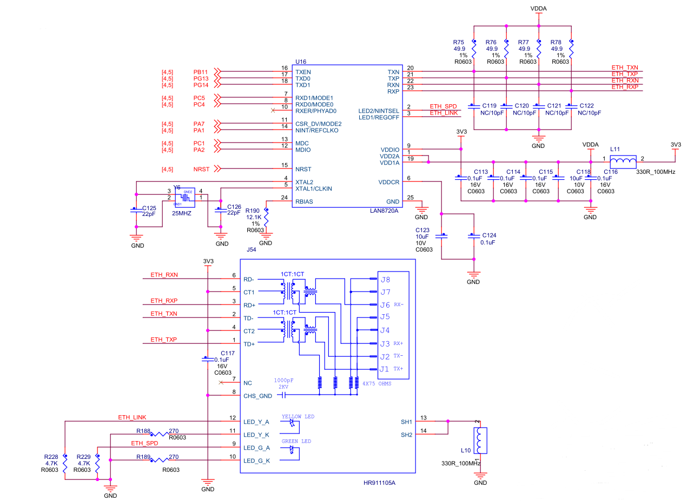

ETH—Lwip以太网通信
------------------

互联网技术对人类社会的影响不言而喻。当今大部分电子设备都能以不同的方式接入互联网(Internet)，在家庭中PC常见的互联网接入方式是使用路由器(Router)组建小型局域网(LAN)，利用互联网专线或者调制调解器(modem)经过电话线网络，连接到互联网服务提供商(ISP)，由互联网服务提供商把用户的局域网接入互联网。而企业或学校的局域网规模较大，常使用交换机组成局域网，经过路由以不同的方式接入到互联网中。

互联网模型
~~~~~~~~~~

通信至少是两个设备的事，需要相互兼容的硬件和软件支持，我们称之为通信协议。以太网通信在结构比较复杂，国际标准组织将整个以太网通信结构制定了OSI模型，总共分层七个层，分别为应用层、表示层、会话层、传输层、网络层、数据链路层以及物理层，每个层功能不同，通信中各司其职，整个模型包括硬件和软件定义。OSI模型是理想分层，一般的网络系统只是涉及其中几层。

TCP/IP是互联网最基本的协议，是互联网通信使用的网络协议，由网络层的IP协议和传输层的TCP协议组成。TCP/IP只有四个分层，分别为应用层、传输层、网络层以及网络访问层。虽然TCP/IP分层少了，但与OSI模型是不冲突的，它把OSI模型一些层次整合一起的，本质上可以实现相同功能。

实际上，还有一个TCP/IP混合模型，分为五个层，参考 TCPIP混合参考模型_，它实际与TCP/IP四层模型是相通的，
只是把网络访问层拆成数据链路层和物理层。这种分层方法对我们学习理解更容易。

TCP/IP混合参考模型

设计网络时，为了降低网络设计的复杂性，对组成网络的硬件、软件进行封装、分层，这些分层即构成了网络体系模型。在两个设备相同层之间的对话、通信约定，构成了层级协议。设备中使用的所有协议加起来统称协议栈。在这个网络模型中，每一层完成不同的任务，都提供接口供上一层访问。而在每层的内部，可以使用不同的方式来实现接口，因而内部的改变不会影响其它层。

在TCP/IP混合参考模型中，数据链路层又被分为LLC层(逻辑链路层)和MAC层(媒体介质访问层)。目前，对于普通的接入网络终端的设备，
LLC层和MAC层是软、硬件的分界线。如PC的网卡主要负责实现参考模型中的MAC子层和物理层，在PC的软件系统中则有一套庞大程序实现了LLC层及以上的所有网络层次的协议。

由硬件实现的物理层和MAC子层在不同的网络形式有很大的区别，如以太网和Wi-Fi，这是由物理传输方式决定的。但由软件实现的其它网络层次通常不会有太大区别，在PC上也许能实现完整的功能，一般支持所有协议，而在嵌入式领域则按需要进行裁剪。

以太网
~~~~~~

以太网(Ethernet)是互联网技术的一种，由于它是在组网技术中占的比例最高，很多人直接把以太网理解为互联网。

以太网是指遵守IEEE 802.3标准组成的局域网，由IEEE
802.3标准规定的主要是位于参考模型的物理层(PHY)和数据链路层中的介质访问控制子层(MAC)。在家庭、企业和学校所组建的PC局域网形式一般也是以太网，其标志是使用水晶头网线来连接(当然还有其它形式)。IEEE还有其它局域网标准，如IEEE
802.11是无线局域网，俗称Wi-Fi。IEEE
802.15是个人域网，即蓝牙技术，其中的802.15.4标准则是ZigBee技术。

现阶段，工业控制、环境监测、智能家居的嵌入式设备产生了接入互联网的需求，利用以太网技术，嵌入式设备可以非常容易地接入到现有的计算机网络中。

PHY层
^^^^^

在物理层，由IEEE
802.3标准规定了以太网使用的传输介质、传输速度、数据编码方式和冲突检测机制，物理层一般是通过一个PHY芯片实现其功能的。

传输介质
''''''''

传输介质包括同轴电缆、双绞线(水晶头网线是一种双绞线)、光纤。根据不同的传输速度和距离要求，基于这三类介质的信号线又衍生出很多不同的种类。最常用的是“五类线”适用于100BASE-T和10BASE-T的网络，它们的网络速率分别为100Mbps和10Mbps。

编码
''''

为了让接收方在没有外部时钟参考的情况也能确定每一位的起始、结束和中间位置，在传输信号时不直接采用二进制编码。在10BASE-T的传输方式中采用曼彻斯特编码，在100BASE-T中则采用4B/5B编码。

曼彻斯特编码把每一个二进制位的周期分为两个间隔，在表示“1”时，以前半个周期为高电平，后半个周期为低电平。表示“0”时则相反，见 曼彻斯特编码_

曼彻斯特编码

采用曼彻斯特码在每个位周期都有电压变化，便于同步。但这样的编码方式效率太低，只有50%。

在100BASE-T
采用的4B/5B编码是把待发送数据位流的每4位分为一组，以特定的5位编码来表示，这些特定的5位编码能使数据流有足够多的跳变，达到同步的目的，而且效率也从曼彻斯特编码的50%提高到了80%。

CSMA/CD冲突检测
'''''''''''''''

早期的以太网大多是多个节点连接到同一条网络总线上(总线型网络)，存在信道竞争问题，因而每个连接到以太网上的节点都必须具备冲突检测功能。以太网具备CSMA/CD冲突检测机制，如果多个节点同时利用同一条总线发送数据，则会产生冲突，总线上的节点可通过接收到的信号与原始发送的信号的比较检测是否存在冲突，若存在冲突则停止发送数据，随机等待一段时间再重传。

现在大多数局域网组建的时候很少采用总线型网络，大多是一个设备接入到一个独立的路由或交换机接口，组成星型网络，不会产生冲突。但为了兼容，新出的产品还是带有冲突检测机制。

MAC子层
^^^^^^^

MAC的功能
'''''''''

MAC子层是属于数据链路层的下半部分，它主要负责与物理层进行数据交接，如是否可以发送数据，发送的数据是否正确，对数据流进行控制等。它自动对来自上层的数据包加上一些控制信号，交给物理层。接收方得到正常数据时，自动去除MAC控制信号，把该数据包交给上层。

MAC数据包
'''''''''

IEEE对以太网上传输的数据包格式也进行了统一规定，见 MAC数据包格式_。该数据包被称为MAC数据包。

.. image:: media/image2.png
   :align: center
   :alt: MAC数据包格式
   :name: MAC数据包格式

MAC数据包格式

MAC数据包由前导字段、帧起始定界符、目标地址、源地址、数据包类型、数据域、填充域、校验和域组成。

-  前导字段，也称报头，这是一段方波，用于使收发节点的时钟同步。内容为连续7个字节的0x55。字段和帧起始定界符在MAC收到数据包后会自动过滤掉。

-  帧起始定界符(SFD)：用于区分前导段与数据段的，内容为0xD5。

-  MAC地址：
   MAC地址由48位数字组成，它是网卡的物理地址，在以太网传输的最底层，就是根据MAC地址来收发数据的。部分MAC地址用于广播和多播，在同一个网络里不能有两个相同的MAC地址。PC的网卡在出厂时已经设置好了MAC地址，但也可以通过一些软件来进行修改，在嵌入式的以太网控制器中可由程序进行配置。数据包中的DA是目标地址，SA是源地址。

-  数据包类型：本区域可以用来描述本MAC数据包是属于TCP/IP协议层的IP包、ARP包还是SNMP包，也可以用来描述本MAC数据包数据段的长度。
   如果该值被设置大于0x0600，不用于长度描述，而是用于类型描述功能，表示与以太网帧相关的MAC客户端协议的种类。

-  数据段：数据段是MAC包的核心内容，它包含的数据来自MAC的上层。其长度可以从0~1500字节间变化。

-  填充域：由于协议要求整个MAC数据包的长度至少为64字节(接收到的数据包如果少于64字节会被认为发生冲突，数据包被自动丢弃)，
   当数据段的字节少于46字节时，在填充域会自动填上无效数据，以使数据包符合长度要求。

-  校验和域：MAC数据包的尾部是校验和域，它保存了CRC校验序列，用于检错。

以上是标准的MAC数据包，IEEE
802.3同时还规定了扩展的MAC数据包，它是在标准的MAC数据包的SA和数据包类型之间添加4个字节的QTag前缀字段，用于获取标志的MAC帧。前2个字节固定为0x8100，用于识别QTag前缀的存在；后两个字节内容分别为3个位的用户优先级、1个位的标准格式指示符(CFI)和一个12位的VLAN标识符。

TCP/IP协议栈
~~~~~~~~~~~~

标准TCP/IP协议是用于计算机通信的一组协议，通常称为TCP/IP协议栈，通俗讲就是符合以太网通信要求的代码集合，一般要求它可以实现图
40‑1中每个层对应的协议，比如应用层的HTTP、FTP、DNS、SMTP协议，传输层的TCP、UDP协议、网络层的IP、ICMP协议等等。关于TCP/IP协议详细内容推荐阅读《TCP-IP详解》和《用TCP/IP进行网际互连》理解。

Windows操作系统、UNIX类操作系统都有自己的一套方法来实现TCP/IP通信协议，它们都提供非常完整的TCP/IP协议。对于一般的嵌入式设备，受制于硬件条件没办法支持使用在Window或UNIX类操作系统的运行的TCP/IP协议栈，一般只能使用简化版本的TCP/IP协议栈，目前开源的适合嵌入式的有uIP、TinyTCP、uC/TCP-IP、LwIP等等。其中LwIP是目前在嵌入式网络领域被讨论和使用广泛的协议栈。本章内容其中一个目的就是移植LwIP到开发板上运行。

为什么需要协议栈
^^^^^^^^^^^^^^^^

物理层主要定义物理介质性质，MAC子层负责与物理层进行数据交接，这两部分是与硬件紧密联系的，就嵌入式控制芯片来说，很多都内部集成了MAC控制器，完成MAC子层功能，所以依靠这部分功能是可以实现两个设备数据交换，而时间传输的数据就是MAC数据包，发送端封装好数据包，接收端则解封数据包得到可用数据，这样的一个模型与使用USART控制器实现数据传输是非常类似的。但如果将以太网运用在如此基础的功能上，完全是大材小用，因为以太网具有传输速度快、可传输距离远、支持星型拓扑设备连接等等强大功能。功能强大的东西一般都会用高级的应用，这也是设计者的初衷。

使用以太网接口的目的就是为了方便与其它设备互联，如果所有设备都约定使用一种互联方式，在软件上加一些层次来封装，这样不同系统、不同的设备通讯就变得相对容易了。而且只要新加入的设备也使用同一种方式，就可以直接与之前存在于网络上的其它设备通讯。这就是为什么产生了在MAC之上的其它层次的网络协议及为什么要使用协议栈的原因。又由于在各种协议栈中TCP/IP协议栈得到了最广泛使用，所有接入互联网的设备都遵守TCP/IP协议。所以，想方便地与其它设备互联通信，需要提供对TCP/IP协议的支持。

各网络层的功能
^^^^^^^^^^^^^^

用以太网和Wi-Fi作例子，它们的MAC子层和物理层有较大的区别，但在MAC之上的LLC层、网络层、传输层和应用层的协议，是基本上同的，这几层协议由软件实现，并对各层进行封装。根据TCP/IP协议，各层的要实现的功能如下：

LLC层：处理传输错误；调节数据流，协调收发数据双方速度，防止发送方发送得太快而接收方丢失数据。主要使用数据链路协议。

网络层：本层也被称为IP层。LLC层负责把数据从线的一端传输到另一端，但很多时候不同的设备位于不同的网络中(并不是简单的网线的两头)。此时就需要网络层来解决子网路由拓扑问题、路径选择问题。在这一层主要有IP协议、ICMP协议。

传输层：由网络层处理好了网络传输的路径问题后，端到端的路径就建立起来了。传输层就负责处理端到端的通讯。在这一层中主要有TCP、UDP协议

应用层：经过前面三层的处理，通讯完全建立。应用层可以通过调用传输层的接口来编写特定的应用程序。而TCP/IP协议一般也会包含一些简单的应用程序如Telnet远程登录、FTP文件传输、SMTP邮件传输协议。

实际上，在发送数据时，经过网络协议栈的每一层，都会给来自上层的数据添加上一个数据包的头，再传递给下一层。在接收方收到数据时，一层层地把所在层的数据包的头去掉，向上层递交数据，参考图
40‑4。

图 40‑4 数据经过每一层的封装和还原

以太网外设(ETH)
~~~~~~~~~~~~~~~

STM32H743x系列控制器内部集成了一个以太网外设，它实际是一个通过DMA控制器进行介质访问控制(MAC)，它的功能就是实现MAC层的任务。借助以太网外设，STM32H743x控制器可以通过ETH外设按照IEEE
802.3-2002标准发送和接收MAC数据包。ETH内部自带专用的DMA控制器用于MAC，ETH支持两个工业标准接口介质独立接口(MII)和简化介质独立接口(RMII)用于与外部PHY芯片连接。MII和RMII接口用于MAC数据包传输，ETH还集成了站管理接口(SMI)接口专门用于与外部PHY通信，用于访问PHY芯片寄存器。

物理层定义了以太网使用的传输介质、传输速度、数据编码方式和冲突检测机制，PHY芯片是物理层功能实现的实体，生活中常用水晶头网线+水晶头插座+PHY组合构成了物理层。

ETH有专用的DMA控制器，它通过AHB主从接口与内核和存储器相连，AHB主接口用于控制数据传输，而AHB从接口用于访问“控制与状态寄存器”(CSR)空间。在进行数据发送是，先将数据有存储器以DMA传输到发送TX
FIFO进行缓冲，然后由MAC内核发送；接收数据时，RX
FIFO先接收以太网数据帧，再由DMA传输至存储器。见 ETH功能框图_。

.. image:: media/image4.png
   :align: center
   :alt: ETH功能框图
   :name: ETH功能框图

ETH功能框图

SMI接口
^^^^^^^

SMI是MAC内核访问PHY寄存器标志接口，它由两根线组成，数据线MDIO和时钟线MDC。SMI支持访问32个PHY，这在设备需要多个网口时非常有用，不过一般设备都只使用一个PHY。PHY芯片内部一般都有32个16位的寄存器，用于配置PHY芯片属性、工作环境、状态指示等等，当然很多PHY芯片并没有使用到所有寄存器位。MAC内核就是通过SMI向PHY的寄存器写入数据或从PHY寄存器读取PHY状态，一次只能对一个PHY的其中一个寄存器进行访问。SMI最大通信频率为2.5MHz，通过控制以太网MAC
MII地址寄存器 (ETH_MACMIIAR)的CR位可选择时钟频率。

SMI帧格式
'''''''''

SMI是通过数据帧方式与PHY通信的，帧格式如表
40‑1，数据位传输顺序从左到右。

    表 40‑1 SMI帧格式

+------+-------------+------+------+-------+-------+-----+-------------+------+
|      | 管理帧字段  |      |      |       |       |     |             |      |
+======+=============+======+======+=======+=======+=====+=============+======+
|      | 报头(32bit) | 起始 | 操作 | PADDR | RADDR | TA  | 数据(16bit) | 空闲 |
+------+-------------+------+------+-------+-------+-----+-------------+------+
| 读取 | 111…111     | 01   | 10   | ppppp | rrrrr | Z0  | ddd…ddd     | Z    |
+------+-------------+------+------+-------+-------+-----+-------------+------+
| 写入 | 111…111     | 01   | 01   | ppppp | rrrrr | 10  | ddd…ddd     | Z    |
+------+-------------+------+------+-------+-------+-----+-------------+------+

PADDR用于指定PHY地址，每个PHY都有一个地址，一般由PHY硬件设计决定，所以是固定不变的。RADDR用于指定PHY寄存器地址。TA为状态转换域，若为读操作，MAC输出两个位高阻态，而PHY芯片则在第一位时输出高阻态，第二位时输出“0”。若为写操作，MAC输出“10”，PHY芯片则输出高阻态。数据段有16位，对应PHY寄存器每个位，先发送或接收到的位对应以太网
MAC MII 数据寄存器(ETH_MACMIIDR)寄存器的位15。

SMI读写操作
'''''''''''

当以太网MAC MII地址寄存器
(ETH_MACMIIAR)的写入位和繁忙位被置1时，SMI将向指定的PHY芯片指定寄存器写入ETH_MACMIIDR中的数据。写操作时序见 SMI写操作_。

SMI写操作

当以太网MAC MII地址寄存器
(ETH_MACMIIAR)的写入位为0并且繁忙位被置1时，SMI将从向指定的PHY芯片指定寄存器读取数据到ETH_MACMIIDR内。
读操作时序见 SMI读操作_。

SMI读操作

MII和RMII接口
^^^^^^^^^^^^^

介质独立接口(MII)用于理解MAC控制器和PHY芯片，提供数据传输路径。RMII接口是MII接口的简化版本，MII需要16根通信线，
RMII只需7根通信，在功能上是相同的。图 MII接口连接_ 为MII接口连接示意图，
图 RMII接口连接_ 为RMII接口连接示意图。

MII接口连接

RMII接口连接

-  TX_CLK：数据发送时钟线。标称速率为10Mbit/s时为2.5MHz；速率为100Mbit/s时为25MHz。RMII接口没有该线。

-  RX_CLK：数据接收时钟线。标称速率为10Mbit/s时为2.5MHz；速率为100Mbit/s时为25MHz。RMII接口没有该线。

-  TX_EN：数据发送使能。在整个数据发送过程保存有效电平。

-  TXD[3:0]或TXD[1:0]：数据发送数据线。对于MII有4位，RMII只有2位。只有在TX_EN处于有效电平数据线才有效。

-  CRS：载波侦听信号，由PHY芯片负责驱动，当发送或接收介质处于非空闲状态时使能该信号。在全双工模式该信号线无效。

-  COL：冲突检测信号，由PHY芯片负责驱动，检测到介质上存在冲突后该线被使能，并且保持至冲突解除。在全双工模式该信号线无效。

-  RXD[3:0]或RXD[1:0]：数据接收数据线，由PHY芯片负责驱动。对于MII有4位，RMII只有2位。
   在MII模式，当RX_DV禁止、RX_ER使能时，特定的RXD[3:0]值用于传输来自PHY的特定信息。

-  RX_DV：接收数据有效信号，功能类似TX_EN，只不过用于数据接收，由PHY芯片负责驱动。
   对于RMII接口，是把CRS和RX_DV整合成CRS_DV信号线，当介质处于不同状态时会自切换该信号状态。

-  RX_ER：接收错误信号线，由PHY驱动，向MAC控制器报告在帧某处检测到错误。

-  REF_CLK：仅用于RMII接口，由外部时钟源提供50MHz参考时钟。

因为要达到100Mbit/s传输速度，MII和RMII数据线数量不同，使用MII和RMII在时钟线的设计是完全不同的。对于MII接口，一般是外部为PHY提供25MHz时钟源，再由PHY提供TX_CLK和RX_CLK时钟。对于RMII接口，一般需要外部直接提供50MHz时钟源，同时接入MAC和PHY。

开发板板载的PHY芯片型号为LAN8720A，该芯片只支持RMII接口，电路设计时参考 RMII接口连接_。

ETH相关硬件在STM32H743x控制器分布参考表 40‑2。

    表 40‑2 ETH复用引脚

+-----------+--------------+-----------+
| ETH(AF11) |     GPIO     |           |
+===========+==============+===========+
| MII       | MII_TX_CLK   | PC3       |
+-----------+--------------+-----------+
|           | MII_TXD0     | PB12/PG13 |
+-----------+--------------+-----------+
|           | MII_TXD1     | PB13/PG14 |
+-----------+--------------+-----------+
|           | MII_TXD2     | PC2       |
+-----------+--------------+-----------+
|           | MII_TXD3     | PB8/PE2   |
+-----------+--------------+-----------+
|           | MII_TX_EN    | PB11/PG11 |
+-----------+--------------+-----------+
|           | MII_RX_CLK   | PA1       |
+-----------+--------------+-----------+
|           | MII_RXD0     | PC4       |
+-----------+--------------+-----------+
|           | MII_RXD1     | PC5       |
+-----------+--------------+-----------+
|           | MII_RXD2     | PB0/PH6   |
+-----------+--------------+-----------+
|           | MII_RXD3     | PB1/PH7   |
+-----------+--------------+-----------+
|           | MII_RX_ER    | PB10/PI10 |
+-----------+--------------+-----------+
|           | MII_RX_DV    | PA7       |
+-----------+--------------+-----------+
|           | MII_CRS      | PA0/PH2   |
+-----------+--------------+-----------+
|           | MII_COL      | PA3/PH3   |
+-----------+--------------+-----------+
| RMII      | RMII_TXD0    | PB12/PG13 |
+-----------+--------------+-----------+
|           | RMII_TXD1    | PB13/PG14 |
+-----------+--------------+-----------+
|           | RMII_TX_EN   | PB11/PG11 |
+-----------+--------------+-----------+
|           | RMII_RXD0    | PC4       |
+-----------+--------------+-----------+
|           | RMII_RXD1    | PC5       |
+-----------+--------------+-----------+
|           | RMII_CRS_DV  | PA7       |
+-----------+--------------+-----------+
|           | RMII_REF_CLK | PA1       |
+-----------+--------------+-----------+
| SMI       | MDIO         | PA2       |
+-----------+--------------+-----------+
|           | MDC          | PC1       |
+-----------+--------------+-----------+
| 其他      | PPS_OUT      | PB5/PG8   |
+-----------+--------------+-----------+

其中，PPS_OUT是IEEE 1588定义的一个时钟同步机制。

MAC数据包发送和接收
^^^^^^^^^^^^^^^^^^^

ETH外设负责MAC数据包发送和接收。利用DMA从系统寄存器得到数据包数据内容，ETH外设自动填充完成MAC数据包封装，然后通过PHY发送出去。在检测到有MAC数据包需要接收时，ETH外设控制数据接收，并解封MAC数据包得到解封后数据通过DMA传输到系统寄存器内。

MAC数据包发送
'''''''''''''

MAC数据帧发送全部由DMA控制，从系统存储器读取的以太网帧由DMA推入FIFO，然后将帧弹出并传输到MAC内核。帧传输结束后，从MAC内核获取发送状态并传回DMA。在检测到SOF(Start
Of Frame)时，MAC接收数据并开始MII发送。在EOF(End Of
Frame)传输到MAC内核后，内核将完成正常的发送，然后将发送状态返回给DMA。如果在发送过程中发送常规冲突，MAC内核将使发送状态有效，然后接受并丢弃所有后续数据，直至收到下一SOF。检测到来自MAC的重试请求时，应从SOF重新发送同一帧。如果发送期间未连续提供数据，MAC将发出下溢状态。在帧的正常传输期间，如果MAC在未获得前一帧的EOF的情况下接收到SOF，则将忽略该SOF并将新的帧视为前一帧的延续。

MAC控制MAC数据包的发送操作，它会自动生成前导字段和SFD以及发送帧状态返回给DMA，在半双工模式下自动生成阻塞信号，
控制jabber(MAC看门狗)定时器用于在传输字节超过2048字节时切断数据包发送。在半双工模式下，MAC使用延迟机制进行流量控制，
程序通过将ETH_MACFCR寄存器的BPA位置1来请求流量控制。MAC包含符合IEEE
1588的时间戳快照逻辑。MAC数据包发送时序参考 MAC数据包发送时序无冲突_。

.. image:: media/image9.png
   :align: center
   :alt: MAC数据包发送时序(无冲突)
   :name: MAC数据包发送时序无冲突

MAC数据包发送时序(无冲突)

MAC数据包接收
'''''''''''''

MAC接收到的数据包填充RX
FIFO，达到FIFO设定阈值后请求DMA传输。在默认直通模式下，当FIFO接收到64个字节(使用ETH_DMAOMR寄存器中的RTC位配置)或完整的数据包时，数据将弹出，其可用性将通知给DMA。DMA向AHB接口发起传输后，数据传输将从FIFO持续进行，直到传输完整个数据包。完成EOF帧的传输后，状态字将弹出并发送到DMA控制器。在Rx
FIFO存储转发模式(通过ETH_DMAOMR寄存器中的RSF位配置)下，仅在帧完全写入Rx
FIFO后才可读出帧。

当MAC在MII上检测到SFD时，将启动接收操作。MAC内核将去除报头和SFD，然后再继续处理帧。检查报头字段以进行过滤，FCS字段用于验证帧的CRC如果帧未通过地址滤波器，则在内核中丢弃该帧。MAC数据包接收时序参考
MAC数据包接收时序无错误_。

MAC数据包接收时序(无错误)

MAC过滤
^^^^^^^

MAC过滤功能可以选择性的过滤设定目标地址或源地址的MAC帧。它将检查所有接收到的数据帧的目标地址和源地址，根据过滤选择设定情况，检测后报告过滤状态。针对目标地址过滤可以有三种，分别是单播、多播和广播目标地址过滤；针对源地址过滤就只有单播源地址过滤。

单播目标地址过滤是将接收的相应DA字段与预设的以太网MAC地址寄存器内容比较，最高可预设4个过滤MAC地址。多播目标地址过滤是根据帧过滤寄存器中的HM位执行对多播地址的过滤，是对MAC地址寄存器进行比较来实现的。单播和多播目标地址过滤都还支持Hash过滤模式。广播目标地址过滤通过将帧过滤寄存器的BFD位置1使能，这使得MAC丢弃所有广播帧。

单播源地址过滤是将接收的SA字段与SA寄存器内容进行比较过滤。

MAC过滤还具备反向过滤操作功能，即让过滤结构求补集。

PHY：LAN8720A
~~~~~~~~~~~~~

LAN8720A是SMSC公司(已被Microchip公司收购)设计的一个体积小、功耗低、全能型10/100Mbps的以太网物理层收发器。
它是针对消费类电子和企业应用而设计的。LAN8720A总共只有24Pin，仅支持RMII接口。
由它组成的网络结构见图 由LAN8720A组成的网络系统结构_。

由LAN8720A组成的网络系统结构

LAN8720A通过RMII与MAC连接。RJ45是网络插座，在与LAN8720A连接之间还需要一个变压器，所以一般使用带电压转换和LED指示灯的HY911105A型号的插座。一般来说，必须为使用RMII接口的PHY提供50MHz的时钟源输入到REF_CLK引脚，不过LAN8720A内部集成PLL，可以将25MHz的时钟源陪频到50MHz并在指定引脚输出该时钟，所以我们可以直接使其与REF_CLK连接达到提供50MHz时钟效果。

LAN8720A内部系统结构见图 LAN8720A内部系统结构_。

.. image:: media/image12.png
   :align: center
   :alt: LAN8720A内部系统结构
   :name: LAN8720A内部系统结构

LAN8720A内部系统结构

LAN8720A有各个不同功能模块组成，最重要的要数接收控制器和发送控制器，其它的基本上都是与外部引脚挂钩，实现信号传输。部分引脚是具有双重功能的，比如PHYAD0与RXER引脚是共用的，在系统上电后LAN8720A会马上读取这部分共用引脚的电平，以确定系统的状态并保存在相关寄存器内，之后则自动转入作为另一功能引脚。

PHYAD[0]引脚用于配置SMI通信的LAN8720A地址，在芯片内部该引脚已经自带下拉电阻，默认认为0(即使外部悬空不接)，在系统上电时会检测该引脚获取得到LAN8720A的地址为0或者1，并保存在特殊模式寄存器(R18)的PHYAD位中，该寄存器的PHYAD有5个位，在需要超过2个LAN8720A时可以通过软件设置不同SMI通信地址。PHYAD[0]是与RXER引脚共用。

MODE[2:0]引脚用于选择LAN8720A网络通信速率和工作模式，可选10Mbps或100Mbps通信速度，半双工或全双工工作模式，另外LAN8720A支持HP
Auto-MDIX自动翻转功能，即可自动识别直连或交叉网线并自适应。一般将MODE引脚都设置为1，可以让LAN8720A启动自适应功能，它会自动寻找最优工作方式。MODE[0]与RXD0引脚共用、MODE[1]与RXD1引脚共用、MODE[2]与CRS_DV引脚共用。

nINT/REFCLKO引脚用于RMII接口中REF_CLK信号线，当nINTSEL引脚为低电平是，它也可以被设置成50MHz时钟输出，这样可以直接与STM32H743x的REF_CLK引脚连接为其提供50MHz时钟源，这种模式要求为XTAL1与XTAL2之间或为XTAL1/CLKIN提供25MHz时钟，由LAN8720A内部PLL电路倍频得到50MHz时钟，此时nIN/REFCLKO引脚的中断功能不可用，用于50MHz时钟输出。当nINTSEL引脚为高电平时，LAN8720A被设置为时钟输入，即外部时钟源直接提供50MHz时钟接入STM32H743x的REF_CLK引脚和LAN8720A的XTAL1/CLKIN引脚，此时nINT/REFCLKO可用于中断功能。nINTSEL与LED2引脚共用，一般使用下拉

REGOFF引脚用于配置内部+1.2V电压源，LAN8720A内部需要+1.2V电压，可以通过VDDCR引脚输入+1.2V电压提供，也可以直接利用LAN8720A内部+1.2V稳压器提供。当REGOFF引脚为低电平时选择内部+1.2V稳压器。REGOFF与LED1引脚共用。

SMI支持寻址32个寄存器，LAN8720A只用到其中14个，参考表 40‑3。

表 40‑3 LAN8720A寄存器列表

+------+------------------------------------------------+-----------------+
| 序号 | 寄存器名称                                     | 分组            |
+======+================================================+=================+
| 0    | Basic Control Register                         | Basic           |
+------+------------------------------------------------+-----------------+
| 1    | Basic Status Register                          | Basic           |
+------+------------------------------------------------+-----------------+
| 2    | PHY Identifier 1                               | Extended        |
+------+------------------------------------------------+-----------------+
| 3    | PHY Identifier 2                               | Extended        |
+------+------------------------------------------------+-----------------+
| 4    | Auto-Negotiation Advertisement Register        | Extended        |
+------+------------------------------------------------+-----------------+
| 5    | Auto-Negotiation Link Partner Ability Register | Extended        |
+------+------------------------------------------------+-----------------+
| 6    | Auto-Negotiation Expansion Register            | Extended        |
+------+------------------------------------------------+-----------------+
| 17   | Mode Control/Status Register                   | Vendor-specific |
+------+------------------------------------------------+-----------------+
| 18   | Special Modes                                  | Vendor-specific |
+------+------------------------------------------------+-----------------+
| 26   | Symbol Error Counter Register                  | Vendor-specific |
+------+------------------------------------------------+-----------------+
| 27   | Control / Status Indication Register           | Vendor-specific |
+------+------------------------------------------------+-----------------+
| 29   | Interrupt Source Register                      | Vendor-specific |
+------+------------------------------------------------+-----------------+
| 30   | Interrupt Mask Register                        | Vendor-specific |
+------+------------------------------------------------+-----------------+
| 31   | PHY Special Control/Status Register            | Vendor-specific |
+------+------------------------------------------------+-----------------+

序号与SMI数据帧中的RADDR是对应的，这在编写驱动时非常重要，本文将它们标记为R0~R31。寄存器可规划为三个组：Basic、Extended和Vendor-specific。Basic是IEEE
802.3要求的，R0是基本控制寄存器，其位15为Soft
Reset位，向该位写1启动LAN8720A软件复位，还包括速度、自适应、低功耗等等功能设置。R1是基本状态寄存器。Extended是扩展寄存器，包括LAN8720A的ID号、制造商、版本号等等信息。Vendor-specific是供应商自定义寄存器，R31是特殊控制/状态寄存器，指示速度类型和自适应功能。

LwIP：轻型TCP/IP协议栈
~~~~~~~~~~~~~~~~~~~~~~

LwIP是Light Weight Internet Protocol 的缩写，是由瑞士计算机科学院Adam
Dunkels等开发的适用于嵌入式领域的开源轻量级TCP/IP协议栈。它可以移植到含有操作系统的平台中，也可以在无操作系统的平台下运行。由于它开源、占用的RAM和ROM比较少、支持较为完整的TCP/IP协议、且十分便于裁剪、调试，被广泛应用在中低端的32位控制器平台。可以访问网站：\ `http://savannah.nongnu.org/projects/lwip/ <http://savannah.nongnu.org/projects/lwip/>`__
获取更多LwIP信息。

目前，LwIP最新更新到2.0.3版本，我们在上述网站可找到相应的LwIP源码下载通道。我们下载两个压缩包：lwip-2.0.3.zip和contrib-2.01.zip，lwip-2.0.3.zip包括了LwIP的实现代码，contrib-2.0.3.zip包含了不同平台移植LwIP的驱动代码和使用LwIP实现的一些应用实例测试。

但是，遗憾的是contrib-2.0.3.zip并没有为STM32平台提供实例，这对于初学者想要移植LwIP来说难度还是非常大的。ST公司也是认识到LwIP在嵌入式领域的重要性，所以他们针对LwIP应用开发了测试平台。为减少移植工作量，我们选择使用ST官方HAL开发包《STM32Cube_FW_H7_V1.2.0》中一个例程的相关接口文件，工程路径为STM32Cube_FW_H7_V1.2.0\\Projects\\STM32756G_EVAL\\Applications\\LwIP\\LwIP_TCP_Echo_Client的，这样我们也可以花更多精力在理解代码实现方法上。

本章的一个重点内容就是介绍LwIP移植至我们的开发平台，详细的操作步骤参考下文介绍。

ETH初始化结构体详解
~~~~~~~~~~~~~~~~~~~

从STM32的ETH外设我们了解到它的功能非常多，控制涉及的寄存器也非常丰富，而使用STM32 HAL库提供的各种结构体及库函数可以简化这些控制过程。跟其它外设一样，STM32 HAL库提供了初始化结构体成员用于设置ETH工作环境参数，并由ETH相应初始化配置函数或功能函数调用，这些设定参数将会设置ETH相应的寄存器，达到配置ETH工作环境的目的。这些内容都定义在库文件“stm32h7xx_hal_eth.h”及“stm32h7xx_hal_eth.c”中，编程时我们可以结合这两个文件内的注释使用或参考库帮助文档。

代码清单 ETH_HandleTypeDef外设管理结构体（文件stm32h7xx_hal_eth.h）

.. code-block:: c

   typedef struct {
      ETH_TypeDef                *Instance; /*!< 外设寄存器基地址*/
      ETH_InitTypeDef            Init; /*!< 初始化结构体*/
      ETH_TxDescListTypeDef      TxDescList; /*!< 发送数据描述符*/
      ETH_RxDescListTypeDef      RxDescList; /*!< 接收数据描述符*/
      HAL_LockTypeDef            Lock; /*!< 锁资源*/
      __IO HAL_ETH_StateTypeDef  gState; /*!< ETH工作状态*/
      __IO HAL_ETH_StateTypeDef  RxState; /*!< ETH接收状态*/
      __IO uint32_t              ErrorCode; /*!< 错误操作返回值*/
      __IO uint32_t              DMAErrorCode; /*!< DMA错误执行操作返回值*/
      __IO uint32_t              MACErrorCode; /*!< MAC错误操作返回值*/
      __IO uint32_t              MACWakeUpEvent; /*!< MAC控制器唤醒事件*/
      __IO uint32_t              MACLPIEvent; /*!< MAC控制器低功耗空闲事件 */
   } ETH_HandleTypeDef;

(1)	Instance： 寄存器基地址指针，所有参数都是指定基地址后才能正确写入寄存器。

(2)	Init：ETH初始化结构体，下面会详细讲解每一个成员。

(3)	TxDescList：发送描述符，也就是发送缓冲区指针，指向当前发送数组的首地址。

(4)	RxDescList：接收描述符，接收缓冲区指针针，指向当前接收数组的首地址。

(5)	Lock：ETH外设锁资源。

(6)	gState：ETH的工作状态值以及发送过程的状态值，可以是HAL_ETH_STATE_RESET，HAL_ETH_STATE_READY等等。

(7)	RxState：ETH接收过程的状态值，其值与gState一样，也是HAL_ETH_StateTypeDef类型的枚举变量。

(8)	ErrorCode：ETH错误操作返回值，用户可以根据这个参数，找到代码的错误。

(9)	DMAErrorCode：DMA错误操作返回值，用户可以根据这个参数，找到代码的错误。

(10)	MACErrorCode：MAC控制器错误操作返回值，用户可以根据这个参数，找到代码的错误。

(11)	MACWakeUpEvent：MAC控制器的唤醒事件来源。

(12)	MACLPIEvent：MAC控制器低功耗状态下的事件来源。

有关ETH_HandleTypeDef外设管理结构体的成员中，我们只需要关注Instance和Init，这两个成员的变量。至于其他的变量，在调用HAL库的函数时，HAL库会根据外设的不同状态分别赋值，不需要用户关心。下面我们看一下，ETH的初始化结构体。

代码清单 ETH_InitTypeDef

.. code-block:: c

   typedef struct {
      uint8_t                     *MACAddr; /*!< MAC地址 */
      ETH_MediaInterfaceTypeDef   MediaInterface; /*!<选择总线类型*/
      ETH_DMADescTypeDef          *TxDesc;  /*!< 发送DMA描述符 */
      ETH_DMADescTypeDef          *RxDesc;  /*!< 接收DMA描述符 */
      uint32_t                    RxBuffLen;  /*!< 接收数组长度 */
   } ETH_InitTypeDef; 

1、\*MACAddr：MAC地址指针，必须是一个6个元素数组的指针。

2、MediaInterface：以太网介质接口，可以是MII介质接口或者RMII介质接口。

3、TxDesc：发送DMA描述符列表，指向当前发送数组的首地址。

4、RxDesc：接收DMA描述符列表，指向当前接收数组的首地址。

5、RxBuffLen：接收数组的长度。

代码清单 ETH_MACConfigTypeDef（文件stm32h7xx_hal_eth.h）

.. code-block:: c

   typedef struct {
      uint32_t         SourceAddrControl;/*!< 源地址过滤 */
      FunctionalState  ChecksumOffload;  /*!<校验和减荷*/
      uint32_t         InterPacketGapVal;/*!< 控制发送帧间的最小间隙*/
      FunctionalState  GiantPacketSizeLimitControl;/*!< Giant数据包的大小限制 */
      FunctionalState  Support2KPacket;             /*!< 支持2K大小的数据包*/
      FunctionalState  CRCStripTypePacket;          /*!< 去除CRC字节*/
      FunctionalState  AutomaticPadCRCStrip;/*!<自动去除PAD和FCS字段*/
      FunctionalState  Watchdog;       /*!<以太网看门狗*/
      FunctionalState  Jabber;         /*!< jabber定时器功能*/
      FunctionalState  JumboPacket;    /*!< 是否接收载波值 */
      uint32_t         Speed;            /*!< 以太网速度选择*/
      uint32_t         DuplexMode;       /*!< 工作模式*/
      FunctionalState  LoopbackMode;     /*!< 回送模式*/
      FunctionalState  CarrierSenseBeforeTransmit;  /*!< 载波侦听 */
      FunctionalState  ReceiveOwn;/*!< 接收自身*/
      FunctionalState  CarrierSenseDuringTransmit; /*!< 传输过程中载波侦听*/
      FunctionalState  RetryTransmission;/*!< 传输重试*/
      uint32_t         BackOffLimit;    /*!<后退限制*/
      FunctionalState  DeferralCheck;   /*!< 检查延迟*/
      uint32_t         PreambleLength;  /*!< 前导码的长度*/
      FunctionalState  UnicastSlowProtocolPacketDetect;/*!<单播模式下慢速协议检测*/
      FunctionalState  SlowProtocolDetect;          /*!< 慢速协议检测 */
      FunctionalState  CRCCheckingRxPackets;        /*!< 接收数据的CRC检验 */
      uint32_t         GiantPacketSizeLimit;        /*!< Giant数据大小的阈值*/
      FunctionalState  ExtendedInterPacketGap;      /*!< 扩展IPG选择*/
      uint32_t         ExtendedInterPacketGapVal;   /*!< 扩展IPG*/
      FunctionalState  ProgrammableWatchdog;        /*!< 可编程看门狗*/
      uint32_t         WatchdogTimeout;             /*!< 超时检测*/
      uint32_t        PauseTime;                   /*!< 暂停时间*/
      FunctionalState  ZeroQuantaPause;             /*!< 零时间片暂停*/
      uint32_t         PauseLowThreshold;           /*!< 暂停阈值下限 */
      FunctionalState  TransmitFlowControl;         /*!< 发送流控制 */
      FunctionalState  UnicastPausePacketDetect;    /*!< 单播暂停帧检测*/
      FunctionalState  ReceiveFlowControl;          /*!< 接收流控制 */
      uint32_t         TransmitQueueMode;           /*!< 发送队列模式*/
      uint32_t         ReceiveQueueMode;            /*!< 接收队列模式*/
      FunctionalState  DropTCPIPChecksumErrorPacket; /*!< 丢弃TCPIP校验和错误数据*/
      FunctionalState  ForwardRxErrorPacket;        /*!< 转发错误帧 */
      FunctionalState  ForwardRxUndersizedGoodPacket;  /*!< 转发过小的好帧*/
   } ETH_MACConfigTypeDef; 

1、	SourceAddrControl：源地址过滤，可选源地址过滤、源地址反向过滤或禁用源地址过滤，它设定ETH_MACFFR寄存器SAF位和SAIF位的值。一般选择禁用源地址过滤。

2、	ChecksumOffload：IPv4校验和减荷功能选择，可选使能或禁止，它设定ETH_MACCR寄存器IPCO位的值，当该位被置1时使能接收的帧有效载荷的TCP/UDP/ICMP标头的IPv4校验和检查。一般选择禁用，此时PCE和IP HCE状态位总是为0。

3、	InterPacketGapVal：控制发送帧间的最小间隙，可选96bit时间、88bit时间、…、40bit时间，他设定ETH_MACCR寄存器的IFG[2:0]位的值，一般设置96bit时间。

4、	GiantPacketSizeLimitControl：启用或禁用巨型数据包大小限制控制。

5、	Support2KPacket： IEEE 802.3是否支持2K大小的数据包

6、	CRCStripTypePacket：自动去除数据包的CRC字段功能，可选使能或禁用。

7、	AutomaticPadCRCStrip：自动去除PAD和FCS字段功能，可选使能或禁用，它设定ETH_MACCR寄存器APCS位的值。当设置为1时，MAC在长度字段值小于或等于1500自己是去除传入帧上的PAD和FCS字段。一般禁止自动去除PAD和FCS字段功能。

8、	Watchdog：以太网看门狗功能选择，可选使能或禁止，它设定以太网MAC配置寄存器(ETH_MACCR)的WD位的值。如果设置为1，使能看门狗，在接收MAC帧超过2048字节时自动切断后面数据，一般选择使能看门狗。如果设置为0，禁用看门狗，最长可接收16384字节的帧。

9、	JumboPacket：是否接受载波值，可以选择使能或者是不使能。最多能接收9，018个字节。

10、	Speed：以太网速度选择，可选10Mbps或100Mbps，它设定ETH_MACCR的FES位的值，一般设置100Mbps。但在使能自适应功能之后该位设置无效。

11、	DuplexMode：以太网工作模式选择，可选全双工模式或半双工模式，它设定ETH_MACCR寄存器DM位的值。一般选择全双工模式，在使能了自适应功能后该成员设置无效。

12、	LoopbackMode：回送模式选择，可选使能或禁止，它设定ETH_MACCR寄存器的LM位的值，当设置为1时，使能MAC在MII回送模式下工作。

13、	CarrierSenseBeforeTransmit：载波侦听功能选择，可选使能或禁止，它设定ETH_MACCR寄存器的CSD位的值。当被设置为低电平时，MAC发送器会生成载波侦听错误，一般使能载波侦听功能。

14、	ReceiveOwn：接收自身帧功能选择，可选使能或禁止，它设定ETH_MACCR寄存器的ROD位的值，当设置为0时，MAC接收发送时PHY提供的所有MAC包，如果设置为1，MAC禁止在半双工模式下接收帧。一般使能接收。

15、	CarrierSenseDuringTransmit：传输过程中载波侦听功能选择，可选使能或禁止，它设定ETH_MACCR寄存器的CSD位的值。当被设置为低电平时，MAC发送器会生成载波侦听错误，一般使能载波侦听功能。

16、	RetryTransmission：传输重试功能，可选使能或禁止，它设定ETH_MACCR寄存器RD位的值，当被设置为1时，MAC仅尝试发送一次，设置为0时，MAC会尝试根据BL的设置进行重试。一般选择使能重试。

17、	BackOffLimit：后退限制，在发送冲突后重新安排发送的延迟时间，可选10、8、4、1，它设定ETH_MACCR寄存器BL位的值。一般设置为10。

18、	DeferralCheck：检查延迟，可选使能或禁止，它设定ETH_MACCR寄存器DC位的值，当设置为0时，禁止延迟检查功能，MAC发送延迟，直到CRS信号变成无效信号。

19、	PreambleLength：选择或不选择传输数据包的前导码长度（全双工模式）。

21、	UnicastSlowProtocolPacketDetect：使用单播地址启用或禁用“慢速协议数据包检测”。

22、	SlowProtocolDetect：启用或禁用慢速协议检测。

23、	CRCCheckingRxPackets：启用或禁用接收数据包的CRC校验。

24、	GiantPacketSizeLimit：指定MAC将其声明为Giant的数据包大小，此参数的值必须是1518字节和32KB之间。

25、	ExtendedInterPacketGap：启用或禁用扩展的数据包间隙。

26、	ExtendedInterPacketGapVal：在传输过程中设置数据包之间的扩展IPG，此参数可以是0x0到0xFF之间的值

27、	ProgrammableWatchdog：启用或禁用可编程看门狗。

28、	WatchdogTimeout：指定接收数据包的监视程序超时

29、	PauseTime：暂停时间，保留发送控制帧中暂停时间字段要使用的值，可设置0至65535，它设定以太网MAC流控制寄存器(ETH_MACFCR)PT位的值。

30、	ZeroQuantaPause：零时间片暂停，可选使用或禁止，它设定ETH_MACFCR寄存器ZQPD位的值。当设置为1时，当来自FIFO层的流控制信号去断言后，此位会禁止自动生成零时间片暂停控制帧。一般选择禁止。

31、	PauseLowThreshold：暂停阈值下限，配置暂停定时器的阈值，达到该值值时，会自动程序传输暂停帧，可选暂停时间减去4个间隙、28个间隙、144个间隙或256个间隙，它设定ETH_MACFCR寄存器PLT位的值。一般选择暂停时间减去4个间隙。

32、	TransmitFlowControl：发送流控制，可选使能或禁止，它设定ETH_MACFCR寄存器TFCE位的值。在全双工模式下，当设置为1时，MAC将使能流控制操作来发送暂停帧；为0时，将禁止MAC中的流控制操作，MAC不会传送任何暂停帧。在半双工模式下，当设置为1时，MAC将使能背压操作；为0时，将禁止背压功能。

33、	UnicastPauseFrameDetect：单播暂停帧检测，可选使能或禁止，它设定ETH_MACFCR寄存器UPFD位的值。当设置为1时，MAC除了检测具有唯一多播地址的暂停帧外，还会检测具有ETH_MACA0HR和ETH_MACA0LR寄存器所指定的站单播地址的暂停帧。一般设置为禁止。

34、	ReceiveFlowControl：接收流控制，可选使能或禁止，它设定ETH_MACFCR寄存器RFCE位的值。当设定为1时，MAC对接收到的暂停帧进行解码，并禁止其在指定时间（暂停时间）内发送；当设置为0时，将禁止暂停帧的解码功能，一般设置为禁止。

35、	TransmitQueueMode：指定传输队列操作模式。

36、	ReceiveQueueMode：指定接收队列操作模式。

37、	DropTCPIPChecksumErrorPacket：丢弃TCP/IP校验错误帧，可选使能或禁止，它设定以太网DMA工作模式寄存器（ETH_DMAOMR）DTCEFD位的值，当设置为1时，如果帧中仅存在由接受校验和减荷引擎检测出来的错误，则内核不会丢弃它；为0时，如果FEF位复位，则会丢弃所有错误帧。

38、	ForwardRxErrorPacket：转发错误帧，可选使能或禁止，它设定ETH_DMAOMR寄存器FEF位的值，当设置为1时，除了段错误帧之外所有帧都会转发到 DMA；为0时，RXFIFO会丢弃所有错误状态的帧。一般选择禁止。

39、	ForwardRxUndersizedGoodPacket：转发过小的好帧，可选使能或禁止。它设定ETH_DMAOMR寄存器FUGF位的值，当设置为1时，RXFIFO会转发包括PAD和FCS字段的过小帧；为0时，会丢弃小于64字节的帧，除非接收阈值被设置为更低。

以太网通信实验：无操作系统LwIP移植
~~~~~~~~~~~~~~~~~~~~~~~~~~~~~~~~~~

LwIP可以在带操作系统上运行，亦可在无操作系统上运行，这一实验我们讲解在无操作系统的移植步骤，并实现简单的传输代码，后续章节会讲解在带操作系统移植过程，一般都是在无操作系统基础上修改而来的。

硬件设计
^^^^^^^^

在讲解移植步骤之前，有必须先介绍我们的实验硬件设计，主要是LAN8720A通过RMII和SMI接口与STM32H743x控制器连接，
见图 PHY硬件设计_。

PHY硬件设计

电路设计时，将NINTSEL引脚通过下拉电阻拉低，设置NINT/FEFCLKO为输出50MHz时钟，当然前提是在XTAL1和XTAL2接入了25MHz的时钟源。另外也把REGOFF引脚通过下拉电阻拉低，使能使用内部+1.2V稳压器。

移植步骤
^^^^^^^^

之前已经介绍了LwIP源代码(lwip-2.0.3.zip)和ST官方LwIP测试平台资料(STM32Cube_FW_H7_V1.2.0)下载，由于ST官方提供的LwIP的最新版本为2.0.0，所以我们移植步骤是基于这两份资料进行的。

下面介绍无操作系统移植LwIP需要的文件。lwip-2.0.3.zip文件解压后参考图
LwIP官方下载文件解压目录_ 。STM32Cube_FW_H7_V1.2.0.zip文件解压后在Middlewares文件夹下的目录参考
图 LwIP在CUBE开发包中作为中间件的文件目录_。
我们将STM32Cube_FW_H7_V1.2.0\\Middlewares\\Third_Party\\LwIP\\system路径下的system文件夹拷贝到lwip-2.0.3文件夹下。
两者结合得到我们最终需要移植的文件目录。新的lwip-2.0.3的文件目录参考
图 LwIP最终需要移植的文件目录_。

.. image:: media/image14.png
   :align: center
   :alt: LwIP官方下载文件解压目录
   :name: LwIP官方下载文件解压目录

LwIP官方下载文件解压目录

.. image:: media/image15.png
   :align: center
   :alt: LwIP在CUBE开发包中作为中间件的文件目录
   :name: LwIP在CUBE开发包中作为中间件的文件目录

LwIP 在CUBE开发包中作为中间件的文件目录

.. image:: media/image16.png
   :align: center
   :alt: LwIP最终需要移植的文件目录
   :name: LwIP最终需要移植的文件目录

LwIP最终需要移植的文件目录

我们先来熟悉LwIP栈的目录组织，如图 LwIP最终需要移植的文件目录_ 所示，其中，doc包含文档文件；src包含LwIP栈的源代码文件；api包含Netconn和套接字API文件；apps包含LwIP一些应用文件；core包含LwIP内核文件；include包含LwIP头文件；netif包含网络接口文件；system包含LwIP端口硬件实现文件；arch包含STM32架构端口文件（所用的数据类型）OS包含使用操作系统的LwIP端口实现文件；test包含LwIP官方的一些测试示例。

接下来，我们就根据图中文件结构详解移植过程。实验例程有需要用到系统滴答定时器systick、调试串口USART、LED灯功能，对这些功能实现不做具体介绍，可以参考相关章节理解。

第一步：相关文件拷贝到工程目录
''''''''''''''''''''''''''''''''''

首先，上面已经准备好协议栈文件，我们将其拷贝到工程目录的USER文件夹下，并新建APP，BSP两个文件夹，BSP文件夹下放LED，UART，LAN8720A等板载外设驱动，最终的文件结构见图
LwIP相关文件拷贝_，arch存放与开发平台相关头文件，Standalone文件夹是无操作系统移植时ETH外设与LwIP连接的底层驱动函数。

.. image:: media/image17.png
   :align: center
   :alt: LwIP相关文件拷贝
   :name: LwIP相关文件拷贝

LwIP相关文件拷贝

lwip-1.4.1文件夹下的doc文件夹存放LwIP版权、移植、使用等等说明文件，移植之前有必须认真浏览一遍；src文件夹存放LwIP的实现代码，也是我们工程代码真正需要的文件；test文件夹存放LwIP部分功能测试例程；另外，还有一些无后缀名的文件，都是一些说明性文件，可用记事本直接打开浏览。port文件夹存放LwIP与STM32平台连接的相关文件，正如上面所说contrib-1.4.1.zip包含了不同平台移植代码，不过遗憾地是没有STM32平台的，所以我们需要从ST官方提供的测试平台找到这部分连接代码，也就是port文件夹的内容。

接下来，在BSP文件下新建一个LAN8720A文件夹，用于存放以太网PHY相关驱动文件，包括两个部分文件，LAN8720A.h和LAN8720A.c，这两个文件包含相关GPIO初始化，直接硬件相关的文件，如果硬件有更改只需要改这两个文件。

在APP文件夹下，我们参考ST官方LwIP测试平台的一个例程，在如下目录STM32Cube_FW_H7_V1.2.0\\Projects\\STM32H743I_EVAL\\Applications\\LwIP\\LwIP_TCP_Echo_Client中的Src文件夹和Inc文件夹中，这里我们需要用到五个文件lwipopts.h、app_ethernet.h、app_ethernet.c、ethernetif.h、ethernetif.c，因为例程使用的PHY型号不是使用LAN8720A，所以这四个文件需要我们进行修改。

第二步：为工程添加文件
'''''''''''''''''''''''''

第一步已经把相关的文件拷贝到对应的文件夹中，接下来就可以把需要用到的文件添加到工程中。图
工程文件结构_ 已经指示出来工程需要用到的*.c文件，所以最终工程文件结构见图
40‑19，图中api、ipv4和core都包含了对应文件夹下的所有*.c文件。Netif文件夹下只需要添加ethernet.c文件。

工程文件结构

接下来，还需要在工程选择中添加相关头文件路径，参考图 添加相关头文件路径_。

添加相关头文件路径

第三步：文件修改
''''''''''''''''''

ethernetif.c文件是无操作系统时网络接口函数，该文件在移植时需要根据实际硬件初始化网络相关IO口，以及需要指定的SRAM空间作为缓存。该文件主要有三个部分函数，HAL_ETH_MspInit函数用于初始化系统硬件接口；
low_level_init函数用于初始化MAC相关工作环境、初始化DMA描述符链表，并使能MAC和DMA；
low_level_output函数是最底层发送一帧数据函数；
low_level_input函数是最底层接收一帧数据函数。sys_now函数获取当前时间的一个函数；ethernetif_init函数初始化网络接口结构
（netif）并调用 low_level_init
以初始化以太网外设；ethernet_input函数调用 low_level_input
接收包，然后将其提供给 LwIP 栈。

app_ethernet.c文件主要是实际的网络初始化应用程序，这里包含两个函数，Netif_Config函数是创建一个网络接口；User_notification函数是指示当前网络连接的状态。

LAN8720A.h和LAN8720A.c两个文件是ETH外设相关的底层配置，主要是
GPIO初始化即相关时钟使能。

代码清单 ETH_GPIO_Config函数

.. code-block:: c

   /* ETH_MDIO */
   #define ETH_MDIO_GPIO_CLK_ENABLE()          __GPIOA_CLK_ENABLE()
   #define ETH_MDIO_PORT                       GPIOA
   #define ETH_MDIO_PIN                        GPIO_PIN_2
   #define ETH_MDIO_AF                         GPIO_AF11_ETH

   /* ETH_MDC */
   #define ETH_MDC_GPIO_CLK_ENABLE()           __GPIOC_CLK_ENABLE();
   #define ETH_MDC_PORT                        GPIOC
   #define ETH_MDC_PIN                         GPIO_PIN_1
   #define ETH_MDC_AF                          GPIO_AF11_ETH

   /* ETH_RMII_REF_CLK */
   #define ETH_RMII_REF_CLK_GPIO_CLK_ENABLE()  __GPIOA_CLK_ENABLE();
   #define ETH_RMII_REF_CLK_PORT               GPIOA
   #define ETH_RMII_REF_CLK_PIN                GPIO_PIN_1
   #define ETH_RMII_REF_CLK_AF                 GPIO_AF11_ETH

   /* ETH_RMII_CRS_DV */
   #define ETH_RMII_CRS_DV_GPIO_CLK_ENABLE()   __GPIOA_CLK_ENABLE();
   #define ETH_RMII_CRS_DV_PORT                GPIOA
   #define ETH_RMII_CRS_DV_PIN                 GPIO_PIN_7
   #define ETH_RMII_CRS_DV_AF                  GPIO_AF11_ETH

   /* ETH_RMII_RXD0 */
   #define ETH_RMII_RXD0_GPIO_CLK_ENABLE()     __GPIOC_CLK_ENABLE();
   #define ETH_RMII_RXD0_PORT                  GPIOC
   #define ETH_RMII_RXD0_PIN                   GPIO_PIN_4
   #define ETH_RMII_RXD0_AF                    GPIO_AF11_ETH

   /* ETH_RMII_RXD1 */
   #define ETH_RMII_RXD1_GPIO_CLK_ENABLE()     __GPIOC_CLK_ENABLE();
   #define ETH_RMII_RXD1_PORT                  GPIOC
   #define ETH_RMII_RXD1_PIN                   GPIO_PIN_5
   #define ETH_RMII_RXD1_AF                    GPIO_AF11_ETH

   /* ETH_RMII_TX_EN */
   #define ETH_RMII_TX_EN_GPIO_CLK_ENABLE()    __GPIOB_CLK_ENABLE();
   #define ETH_RMII_TX_EN_PORT                 GPIOB
   #define ETH_RMII_TX_EN_PIN                  GPIO_PIN_11
   #define ETH_RMII_TX_EN_AF                   GPIO_AF11_ETH

   /* ETH_RMII_TXD0 */
   #define ETH_RMII_TXD0_GPIO_CLK_ENABLE()     __GPIOG_CLK_ENABLE();
   #define ETH_RMII_TXD0_PORT                  GPIOG
   #define ETH_RMII_TXD0_PIN                   GPIO_PIN_13
   #define ETH_RMII_TXD0_AF                    GPIO_AF11_ETH

   /* ETH_RMII_TXD1 */
   #define ETH_RMII_TXD1_GPIO_CLK_ENABLE()     __GPIOG_CLK_ENABLE();
   #define ETH_RMII_TXD1_PORT                  GPIOG
   #define ETH_RMII_TXD1_PIN                   GPIO_PIN_14
   #define ETH_RMII_TXD1_AF                    GPIO_AF11_ETH
   /**
   * @brief  配置以太网接口
   * @param  None
   * @retval None
   */
   void ETH_GPIO_Config(void)
   {
      GPIO_InitTypeDef GPIO_InitStructure;
      /* 使能端口时钟 */
      ETH_MDIO_GPIO_CLK_ENABLE();
      ETH_MDC_GPIO_CLK_ENABLE();
      ETH_RMII_REF_CLK_GPIO_CLK_ENABLE();
      ETH_RMII_CRS_DV_GPIO_CLK_ENABLE();
      ETH_RMII_RXD0_GPIO_CLK_ENABLE();
      ETH_RMII_RXD1_GPIO_CLK_ENABLE();
      ETH_RMII_TX_EN_GPIO_CLK_ENABLE();
      ETH_RMII_TXD0_GPIO_CLK_ENABLE();
      ETH_RMII_TXD1_GPIO_CLK_ENABLE();

      /* 配置以太网引脚*/
      /*
      ETH_MDIO -------------------------> PA2
      ETH_MDC --------------------------> PC1
      ETH_MII_RX_CLK/ETH_RMII_REF_CLK---> PA1
      ETH_MII_RX_DV/ETH_RMII_CRS_DV ----> PA7
      ETH_MII_RXD0/ETH_RMII_RXD0 -------> PC4
      ETH_MII_RXD1/ETH_RMII_RXD1 -------> PC5
      ETH_MII_TX_EN/ETH_RMII_TX_EN -----> PB11
      ETH_MII_TXD0/ETH_RMII_TXD0 -------> PG13
      ETH_MII_TXD1/ETH_RMII_TXD1 -------> PG14
      */

      /* 配置ETH_MDIO引脚 */
      GPIO_InitStructure.Pin = ETH_MDIO_PIN;
      GPIO_InitStructure.Speed = GPIO_SPEED_HIGH;
      GPIO_InitStructure.Mode = GPIO_MODE_AF_PP;
      GPIO_InitStructure.Pull = GPIO_NOPULL;
      GPIO_InitStructure.Alternate = ETH_MDIO_AF;
      HAL_GPIO_Init(ETH_MDIO_PORT, &GPIO_InitStructure);

      /* 配置ETH_MDC引脚 */
      GPIO_InitStructure.Pin = ETH_MDC_PIN;
      GPIO_InitStructure.Alternate = ETH_MDC_AF;
      HAL_GPIO_Init(ETH_MDC_PORT, &GPIO_InitStructure);

      /* 配置ETH_RMII_REF_CLK引脚 */
      GPIO_InitStructure.Pin = ETH_RMII_REF_CLK_PIN;
      GPIO_InitStructure.Alternate = ETH_RMII_REF_CLK_AF;
      HAL_GPIO_Init(ETH_RMII_REF_CLK_PORT, &GPIO_InitStructure);

      /* 配置ETH_RMII_CRS_DV引脚 */
      GPIO_InitStructure.Pin = ETH_RMII_CRS_DV_PIN;
      GPIO_InitStructure.Alternate = ETH_RMII_CRS_DV_AF;
      HAL_GPIO_Init(ETH_RMII_CRS_DV_PORT, &GPIO_InitStructure);

      /* 配置ETH_RMII_RXD0引脚 */
      GPIO_InitStructure.Pin = ETH_RMII_RXD0_PIN;
      GPIO_InitStructure.Alternate = ETH_RMII_RXD0_AF;
      HAL_GPIO_Init(ETH_RMII_RXD0_PORT, &GPIO_InitStructure);

      /* 配置ETH_RMII_RXD1引脚 */
      GPIO_InitStructure.Pin = ETH_RMII_RXD1_PIN;
      GPIO_InitStructure.Alternate = ETH_RMII_RXD1_AF;
      HAL_GPIO_Init(ETH_RMII_RXD1_PORT, &GPIO_InitStructure);

      /* 配置ETH_RMII_TX_EN引脚 */
      GPIO_InitStructure.Pin = ETH_RMII_TX_EN_PIN;
      GPIO_InitStructure.Alternate = ETH_RMII_TX_EN_AF;
      HAL_GPIO_Init(ETH_RMII_TX_EN_PORT, &GPIO_InitStructure);

      /* 配置ETH_RMII_TXD0引脚 */
      GPIO_InitStructure.Pin = ETH_RMII_TXD0_PIN;
      GPIO_InitStructure.Alternate = ETH_RMII_TXD0_AF;
      HAL_GPIO_Init(ETH_RMII_TXD0_PORT, &GPIO_InitStructure);

      /* 配置ETH_RMII_TXD1引脚 */
      GPIO_InitStructure.Pin = ETH_RMII_TXD1_PIN;
      GPIO_InitStructure.Alternate = ETH_RMII_TXD1_AF;
      HAL_GPIO_Init(ETH_RMII_TXD1_PORT, &GPIO_InitStructure);
   }

HAL_ETH_MspInit函数调用ETH_GPIO_Config进行硬件初始化，并使能以太网时钟。

代码清单 HAL_ETH_MspInit函数

.. code-block:: c

   /**
      * @brief  初始化ETH外设时钟，引脚.
      * @param  heth: ETH handle
      * @retval None
      */
   void HAL_ETH_MspInit(ETH_HandleTypeDef *heth)
   {
      ETH_GPIO_Config();
      /* 使能以太网时钟  */
      __HAL_RCC_ETH1MAC_CLK_ENABLE();
      __HAL_RCC_ETH1TX_CLK_ENABLE();
      __HAL_RCC_ETH1RX_CLK_ENABLE();
   } 

代码清单 LAN8720_Init函数（文件LAN8720a.c）

.. code-block:: c

   /**
      * @brief  初始化LAN8720A.
      * @param  heth: ETH handle
      * @retval HAL_StatusTypeDef：状态值
      */
   HAL_StatusTypeDef LAN8720_Init(ETH_HandleTypeDef *heth)
   {
      uint32_t phyreg = 0;
      uint32_t TIME_Out = 0;
      //软件复位LAN8720A
      if (HAL_ETH_WritePHYRegister(heth, LAN8720A_PHY_ADDRESS, PHY_BCR, PHY_RESET) != HAL_OK) {
            return HAL_ERROR;
      }
      //等待LAN8720A复位完成
      HAL_Delay(PHY_RESET_DELAY);
   
      if ((HAL_ETH_WritePHYRegister(heth, LAN8720A_PHY_ADDRESS, PHY_BCR, PHY_AUTONEGOTIATION)) != 
         HAL_OK) {
            return HAL_ERROR;
      }
      //等待LAN8720A写入完成
      HAL_Delay(0xFFF);
      do {
            HAL_ETH_ReadPHYRegister(heth, LAN8720A_PHY_ADDRESS, PHY_BSR, &phyreg);
            TIME_Out++;
            if (TIME_Out > PHY_READ_TO)
               return HAL_TIMEOUT;
      } while (((phyreg & PHY_AUTONEGO_COMPLETE) != PHY_AUTONEGO_COMPLETE));
   
      return HAL_OK;
   }

LAN8720_Init函数主要用于配置LAN8720A的寄存器。首先，向BCR寄存器的写入PHY_RESET值，调用HAL_Delay函数等待软件复位LAN8720A完成。接着想BCR寄存器写入PHY_AUTONEGOTIATION，设置为PHY芯片的自适应功能，调用HAL_Delay函数等待LAN8720A写入完成。最后，读取LAN8720A的BSR寄存器来确定器件器件是否正常工作，并将初始化器件的状态值返回。

ETH外设有专门实现数据搬运的DMA，可以在CPU完全不干预的情况下，用DMA描述符有效地将数据从源地址传送到目标地址。STM32H743通过以下两个数据结构来实现通信：一个是控制和状态寄存器（CSR），另一个是DMA描述符列表和数据缓冲区。所谓的描述符列表就是单片机的某一块内存单元，每一个描述符列表最多可以指向两个缓冲区。调用MPU_Config函数来保护这部分的内存单元，以及区域内的DCache的读写方式。

代码清单 DMA描述符定义（文件ethernetif.c）以及MPU外设配置（文件main.c）

.. code-block:: c

   //以太网Rx DMA描述符
   __attribute__((at(0x30040000))) ETH_DMADescTypeDef  DMARxDscrTab[ETH_RX_DESC_CNT];
   //以太网Tx DMA描述符
   __attribute__((at(0x30040060))) ETH_DMADescTypeDef  DMATxDscrTab[ETH_TX_DESC_CNT];
   //以太网接收缓冲区
   __attribute__((at(0x30040200))) uint8_t Rx_Buff[ETH_RX_DESC_CNT][ETH_MAX_PACKET_SIZE];
   
   /**
      * @brief  配置MPU外设
      * @param  None
      * @retval None
      */
   static void MPU_Config(void)
   {
      MPU_Region_InitTypeDef MPU_InitStruct;
   
      /* Disable the MPU */
      HAL_MPU_Disable();
   
      /* Configure the MPU attributes as Device not cacheable
         for ETH DMA descriptors */
      MPU_InitStruct.Enable = MPU_REGION_ENABLE;
      MPU_InitStruct.BaseAddress = 0x30040000;
      MPU_InitStruct.Size = MPU_REGION_SIZE_256B;
      MPU_InitStruct.AccessPermission = MPU_REGION_FULL_ACCESS;
      MPU_InitStruct.IsBufferable = MPU_ACCESS_BUFFERABLE;
      MPU_InitStruct.IsCacheable = MPU_ACCESS_NOT_CACHEABLE;
      MPU_InitStruct.IsShareable = MPU_ACCESS_NOT_SHAREABLE;
      MPU_InitStruct.Number = MPU_REGION_NUMBER0;
      MPU_InitStruct.TypeExtField = MPU_TEX_LEVEL0;
      MPU_InitStruct.SubRegionDisable = 0x00;
      MPU_InitStruct.DisableExec = MPU_INSTRUCTION_ACCESS_ENABLE;
   
      HAL_MPU_ConfigRegion(&MPU_InitStruct);
   
      /* Configure the MPU attributes as Cacheable write through
         for LwIP RAM heap which contains the Tx buffers */
      MPU_InitStruct.Enable = MPU_REGION_ENABLE;
      MPU_InitStruct.BaseAddress = 0x30044000;
      MPU_InitStruct.Size = MPU_REGION_SIZE_16KB;
      MPU_InitStruct.AccessPermission = MPU_REGION_FULL_ACCESS;
      MPU_InitStruct.IsBufferable = MPU_ACCESS_NOT_BUFFERABLE;
      MPU_InitStruct.IsCacheable = MPU_ACCESS_CACHEABLE;
      MPU_InitStruct.IsShareable = MPU_ACCESS_NOT_SHAREABLE;
      MPU_InitStruct.Number = MPU_REGION_NUMBER1;
      MPU_InitStruct.TypeExtField = MPU_TEX_LEVEL0;
      MPU_InitStruct.SubRegionDisable = 0x00;
      MPU_InitStruct.DisableExec = MPU_INSTRUCTION_ACCESS_ENABLE;
   
      HAL_MPU_ConfigRegion(&MPU_InitStruct);
   
      /* Enable the MPU */
      HAL_MPU_Enable(MPU_PRIVILEGED_DEFAULT);
   }

low_level_init主要是初始化硬件外设，最终被 ethernetif_init函数调用。

代码清单 low_level_init函数

.. code-block:: c

   /**
   * @brief 在这个函数中初始化硬件
   *      最终被ethernetif_init函数调用
   *
   * @param netif已经初始化了这个以太网的lwip网络接口结构
   */
   static void low_level_init(struct netif *netif)
   {
      uint8_t macaddress[6]= { MAC_ADDR0, MAC_ADDR1, MAC_ADDR2, MAC_ADDR3, MAC_ADDR4, MAC_ADDR5 };

      EthHandle.Instance = ETH;
      EthHandle.Init.MACAddr = macaddress;
      EthHandle.Init.AutoNegotiation = ETH_AUTONEGOTIATION_ENABLE;//使能自协商模式
      EthHandle.Init.Speed = ETH_SPEED_100M;//网络速率100M
      EthHandle.Init.DuplexMode = ETH_MODE_FULLDUPLEX;//全双工模式
      EthHandle.Init.MediaInterface = ETH_MEDIA_INTERFACE_RMII;//RMII接口
      EthHandle.Init.RxMode = ETH_RXPOLLING_MODE;//轮询接收模式
      EthHandle.Init.ChecksumMode = ETH_CHECKSUM_BY_HARDWARE;//硬件帧校验
      EthHandle.Init.PhyAddress = LAN8720A_PHY_ADDRESS;//PHY地址

      /* 配置以太网外设 (GPIOs, clocks, MAC, DMA) */
      if (HAL_ETH_Init(&EthHandle) == HAL_OK) {
         /* 设置netif链接标志 */
         netif->flags |= NETIF_FLAG_LINK_UP;
      }

      /* 初始化 Tx 描述符列表：链接模式 */
      HAL_ETH_DMATxDescListInit(&EthHandle, DMATxDscrTab, &Tx_Buff[0][0], ETH_TXBUFNB);

      /* 初始化 Rx 描述符列表：链接模式 */
      HAL_ETH_DMARxDescListInit(&EthHandle, DMARxDscrTab, &Rx_Buff[0][0], ETH_RXBUFNB);

      /* 设置netif MAC 硬件地址长度 */
      netif->hwaddr_len = ETHARP_HWADDR_LEN;

      /* 设置netif MAC 硬件地址 */
      netif->hwaddr[0] =  MAC_ADDR0;
      netif->hwaddr[1] =  MAC_ADDR1;
      netif->hwaddr[2] =  MAC_ADDR2;
      netif->hwaddr[3] =  MAC_ADDR3;
      netif->hwaddr[4] =  MAC_ADDR4;
      netif->hwaddr[5] =  MAC_ADDR5;

      /* 设置netif最大传输单位 */
      netif->mtu = 1500;

      /* 接收广播地址和ARP流量 */
      netif->flags |= NETIF_FLAG_BROADCAST | NETIF_FLAG_ETHARP;

      /* 使能 MAC 和 DMA 发送和接收 */
      HAL_ETH_Start(&EthHandle);
   }

首先是ETH_HandleTypeDef结构体填充，关于结构体各个成员意义已在“ETH初始化结构体详解”作了分析。然后调用系统函数HAL_ETH_Init初始化以太网外设。初始化相关描述符的列表，设置MAC地址，使能MAC和DMA发送和接收。

Netif_Config函数一般在main函数中在LwIP_Init函数初始化完成后调用。

代码清单 Netif_Config函数

.. code-block:: c

   #define DEST_IP_ADDR0   (uint8_t)192
   #define DEST_IP_ADDR1   (uint8_t)168
   #define DEST_IP_ADDR2   (uint8_t)31
   #define DEST_IP_ADDR3   (uint8_t)198

   #define DEST_PORT       (uint8_t)7

   /*Static IP ADDRESS: IP_ADDR0.IP_ADDR1.IP_ADDR2.IP_ADDR3 */
   #define IP_ADDR0   (uint8_t) 192
   #define IP_ADDR1   (uint8_t) 168
   #define IP_ADDR2   (uint8_t) 31
   #define IP_ADDR3   (uint8_t) 122

   /*NETMASK*/
   #define NETMASK_ADDR0   (uint8_t) 255
   #define NETMASK_ADDR1   (uint8_t) 255
   #define NETMASK_ADDR2   (uint8_t) 255
   #define NETMASK_ADDR3   (uint8_t) 0

   /*Gateway Address*/
   #define GW_ADDR0   (uint8_t) 192
   #define GW_ADDR1   (uint8_t) 168
   #define GW_ADDR2   (uint8_t) 31
   #define GW_ADDR3   (uint8_t) 1
   /**
   * @brief  建立网络接口
   * @param  None
   * @retval None
   */
   void Netif_Config(void)
   {
      ip_addr_t ipaddr;
      ip_addr_t netmask;
      ip_addr_t gw;

      IP_ADDR4(&ipaddr,IP_ADDR0,IP_ADDR1,IP_ADDR2,IP_ADDR3);
      IP_ADDR4(&netmask,NETMASK_ADDR0,NETMASK_ADDR1,NETMASK_ADDR2,NETMASK_ADDR3);
      IP_ADDR4(&gw,GW_ADDR0,GW_ADDR1,GW_ADDR2,GW_ADDR3);

      /* 添加网络接口 */
      netif_add(&gnetif, &ipaddr, &netmask, &gw, NULL, &ethernetif_init, &ethernet_input);

      /* 注册默认网络接口 */
      netif_set_default(&gnetif);

      if (netif_is_link_up(&gnetif)) {
         /* 当netif完全配置时，必须调用此函数 */
         netif_set_up(&gnetif);
      } else {
         /* 当netif链接断开时，必须调用此函数 */
         netif_set_down(&gnetif);
      }

   }

通过宏定义了远端IP和端口、MAC地址、静态IP地址、子网掩码、网关相关宏，可以根据实际情况修改。netif_add函数添加网络接口；netif_set_default注册默认网络接口。

代码清单 User_notification函数

.. code-block:: c

   /**
   * @brief  通知用户有关网络接口配置状态
   * @param  netif: 网络接口
   * @retval None
   */
   void User_notification(struct netif *netif)
   {
      if (netif_is_up(netif)) {
         printf("Static IP: %d.%d.%d.%d\n",IP_ADDR0,IP_ADDR1,IP_ADDR2,IP_ADDR3);
         printf("NETMASK  : %d.%d.%d.%d\n",NETMASK_ADDR0,NETMASK_ADDR1,NETMASK_ADDR2,NETMASK_ADDR3);
         printf("Gateway  : %d.%d.%d.%d\n",GW_ADDR0,GW_ADDR1,GW_ADDR2,GW_ADDR3);
         LED_GREEN;
      } else {
         printf ("The network cable is not connected \n");
         LED_RED;
      }
   }

User_notification函数在网络接口配置完成后调用，通知用户有关网络接口配置状态。打印接口连接状态，LED指示连接状态。

代码清单 lwip_Init函数

.. code-block:: c

   /**
   * @ingroup lwip_nosys
   * 初始化所有模块.
   * 在NO_SYS模式下使用,否则使用tcpip_init（）。
   */
   void
   lwip_init(void)
   {
   #ifndef LWIP_SKIP_CONST_CHECK
      int a = 0;
      LWIP_UNUSED_ARG(a);
      LWIP_ASSERT("LWIP_CONST_CAST not implemented correctly. Check your lwIP port.", LWIP_CONST_CAST(void*, &a) == &a);
   #endif
   #ifndef LWIP_SKIP_PACKING_CHECK
      LWIP_ASSERT("Struct packing not implemented correctly. Check your lwIP port.", sizeof(struct packed_struct_test) == PACKED_STRUCT_TEST_EXPECTED_SIZE);
   #endif

      /* 模块初始化 */
      stats_init();
   #if !NO_SYS
      sys_init();
   #endif /* !NO_SYS */
      mem_init();
      memp_init();
      pbuf_init();
      netif_init();
   #if LWIP_IPV4
      ip_init();
   #if LWIP_ARP
      etharp_init();
   #endif /* LWIP_ARP */
   #endif /* LWIP_IPV4 */
   #if LWIP_RAW
      raw_init();
   #endif /* LWIP_RAW */
   #if LWIP_UDP
      udp_init();
   #endif /* LWIP_UDP */
   #if LWIP_TCP
      tcp_init();
   #endif /* LWIP_TCP */
   #if LWIP_IGMP
      igmp_init();
   #endif /* LWIP_IGMP */
   #if LWIP_DNS
      dns_init();
   #endif /* LWIP_DNS */
   #if PPP_SUPPORT
      ppp_init();
   #endif

   #if LWIP_TIMERS
      sys_timeouts_init();
   #endif /* LWIP_TIMERS */
   }

lwip_Init函数用于初始化LwIP协议栈，一般在main函数中调用。首先是内存相关初始化，mem_init函数是动态内存堆初始化，memp_init函数是存储池初始化，LwIP是实现内存的高效利用，内部需要不同形式的内存管理模式。

pbuf
函数为预留的函数，目前是一个空操作。netif_init函数多播的时候用到，本例没有用到。后面的功能都是通过lwipopts.h进行裁剪。

代码清单 ethernetif_input函数

.. code-block:: c

   /**
   * @brief 当数据包准备好从接口读取时，应该调用此函数。
   *它使用应该处理来自网络接口的字节的实际接收的函数low_level_input。
   *然后确定接收到的分组的类型，并调用适当的输入功能。
   *
   * @param netif 以太网的lwip网络接口结构
   */
   void ethernetif_input(struct netif *netif)
   {
      err_t err;
      struct pbuf *p;

      /* 将接收到的数据包移动到新的pbuf中 */
      p = low_level_input(netif);

      /* 没有数据包可以读取，直接返回 */
      if (p == NULL) return;

      /* 到LwIP堆栈入口 */
      err = netif->input(p, netif);

      if (err != ERR_OK) {
         LWIP_DEBUGF(NETIF_DEBUG, ("ethernetif_input: IP input error\n"));
         pbuf_free(p);
         p = NULL;
      }
   }

ethernetif_input函数用于从以太网存储器读取一个以太网帧并将其发送给LwIP，它在接收到以太网帧时被调用，它是直接调用low_level_input函数实现的，该函数定义在ethernetif.c文件中。

代码清单 sys_check_timeouts函数

.. code-block:: c

   /**
   * @ingroup lwip_nosys
   * 处理NO_SYS==1超时 (即不使用tcpip_thread/sys_timeouts_mbox_fetch()）
   * 使用sys_now()函数，当超时到期时调用超时处理函数。
   * 必须定期从主循环中调用。
   */
   #if !NO_SYS && !defined __DOXYGEN__
   static
   #endif /* !NO_SYS */
   void
   sys_check_timeouts(void)
   {
      if (next_timeout) {
         struct sys_timeo *tmptimeout;
         u32_t diff;
         sys_timeout_handler handler;
         void *arg;
         u8_t had_one;
         u32_t now;

         now = sys_now();
         /* this cares for wraparounds */
         diff = now - timeouts_last_time;
         do {
               PBUF_CHECK_FREE_OOSEQ();
               had_one = 0;
               tmptimeout = next_timeout;
               if (tmptimeout && (tmptimeout->time <= diff)) {
                  /* timeout has expired */
                  had_one = 1;
                  timeouts_last_time += tmptimeout->time;
                  diff -= tmptimeout->time;
                  next_timeout = tmptimeout->next;
                  handler = tmptimeout->h;
                  arg = tmptimeout->arg;
   #if LWIP_DEBUG_TIMERNAMES
                  if (handler != NULL) {
                  LWIP_DEBUGF(TIMERS_DEBUG, ("sct calling h=%s arg=%p\n", tmptimeout->handler_name, arg));
                  }
   #endif /* LWIP_DEBUG_TIMERNAMES */
                  memp_free(MEMP_SYS_TIMEOUT, tmptimeout);
                  if (handler != NULL) {
   #if !NO_SYS
            /* For LWIP_TCPIP_CORE_LOCKING, lock the core before calling the timeout handler function. */
                        LOCK_TCPIP_CORE();
   #endif /* !NO_SYS */
                        handler(arg);
   #if !NO_SYS
                        UNLOCK_TCPIP_CORE();
   #endif /* !NO_SYS */
                  }
                  LWIP_TCPIP_THREAD_ALIVE();
               }
               /* repeat until all expired timers have been called */
            } while (had_one);
      }
   }

sys_check_timeouts函数是一个必须被无限循环调用的LwIP支持函数，一般在main函数的无限循环中调用，使用sys_now()函数，当超时到期时调用超时处理函数。

lwipopts.h文件存放一些宏定义，用于剪切LwIP功能，比如有无操作系统、内存空间分配、存储池分配、TCP功能、DHCP功能、UDP功能选择等等。这里使用与ST官方例程相同配置即可。

代码清单 main函数

.. code-block:: c

   /**
      * @brief  主函数
      * @param  无
      * @retval 无
      */
   int main(void)
   {
      /* 配置相应的内存单元为ETH的DMA描述符列表 */
      MPU_Config();
   
      /* Enable I-Cache */
      SCB_EnableICache();
   
      /* Enable D-Cache */
      SCB_EnableDCache();
      //将Cache设置write-through方式
      SCB->CACR|=1<<2;
   
      /* 配置系统时钟为400 MHz */
      SystemClock_Config();
   
      /* 初始化RGB彩灯 */
      LED_GPIO_Config();
   
      /* 初始化USART1 配置模式为 115200 8-N-1 */
      DEBUG_USART_Config();
   
      /* 初始化LwIP协议栈*/
      lwip_init();
   
      printf("LAN8720A Ethernet Demo\n");
      printf("LwIP版本：%s\n",LWIP_VERSION_STRING);
   
      printf("ping实验例程\n");
   
      printf("使用同一个局域网中的电脑ping开发板的地址，可进行测试\n");
   
      //IP地址和端口可在main.h文件修改
      printf("本地IP和端口: %d.%d.%d.%d\n",IP_ADDR0,IP_ADDR1,IP_ADDR2,IP_ADDR3);
      /* 网络接口配置 */
      Netif_Config();
   
      User_notification(&gnetif);
      while (1) {
            /* 从以太网缓冲区中读取数据包，交给LwIP处理 */
            ethernetif_input(&gnetif);
            /* 处理 LwIP 超时 */
            sys_check_timeouts();
      }
   }

首先是使能指令缓存、数据缓存，初始化系统时钟、LED指示灯、按键、调试串口，lwip_init
函数初始化LwIP协议栈。通过Netif_Config函数配置网络接口；通过User_notification函数报告用户网络连接状态。进入无限循环函数，调用ethernetif_input
函数从以太网缓存中读取数据包并交给LwIP处理；调用sys_check_timeouts
函数处理LwIP超时。这两个函数必须在大循环中调用。

下载验证
'''''''''''''

保证开发板相关硬件连接正确，用USB线连接开发板“USB TO
UART”接口跟电脑，在电脑端打开串口调试助手并配置好相关参数；使用网线连接开发板网口跟路由器，这里要求电脑连接在同一个路由器上，之所以使用路由器是这样连接方便，电脑端无需更多操作步骤，并且路由器可以提供DHCP服务器功能，而电脑不行的，最后在电脑端打开网络调试助手软件，并设置相关参数，路由的网关跟
main.h文件中相关宏定义是对应的，不同电脑设置情况可能不同。把编译好的程序下载到开发板。

在系统硬件初始化时串口调试助手会打印相关提示信息，等待初始化完成后可打开电脑端CMD窗口，输入ping命令测试开发板链路，图
ping窗口_ 为链路正常情况，如果出现ping不同情况，检查网线连接。

ping窗口

基于uCOS-III移植LwIP实验
~~~~~~~~~~~~~~~~~~~~~~~~

上面的实验是无操作系统移植LwIP，LwIP也确实是支持无操作系统移植运行，这对于芯片资源紧张、不合适运行操作系统环境还是有很大用处的。不过在很多应用中会采用操作系统上运行LwIP，这有利于提高整体性能。这个实验我们主要讲解移植操作步骤，过程中直接使用上个实验LwIP底层驱动，除非有需要修改地方才指出，同时这里假设已有移植好的uCOS-III工程可参考使用，关于uCOS-III移植部分可参考我们相关文档，这里主要介绍LwIP使用uCOS-III信号量、消息队列、定时器函数等等函数接口。

这个实验最终实现在uCOS-III操作系统基础上移植LwIP，使能DHCP功能，在动态获取IP之后即可ping通。运行uCOS-III操作系统之后一般会使用Netconn或Socket方法使用LwIP，关于这两个的应用方法限于篇幅问题这里不做深入探究。

UCOS-III和LwIP都是属于软件编程层次，所以硬件设计部分并不需要做更改，直接使用上个实验的硬件设计即可。

接下来开始介绍移植步骤，为简化移植步骤，我们的思路是直接使用uCOS-III例程，在其基础上移植LwIP部分。

第一步：文件拷贝
^^^^^^^^^^^^^^^^^^

拷贝整个uCOS-III工程，修改文件夹名称为“ETH—基于uCOS-III的LwIP移植”，作为我们这个实验工程基础，我们在此基础上添加功能。LwIP源码部分，我们参考上一章节裸机程序，直接拷贝上个实验工程中的lwip-2.0.3整个文件夹到USER文件夹(路径：…\\ETH—基于uCOS-III的LwIP移植\\USER)中。

把上个实验工程中的App文件夹拷贝到本实验相同位置。app_ethernet.c、app_ethernet.h、ethernetif.c、ethernetif.h和lwipopts.h五个文件是必需的。

最后，把上个实验工程中的LAN8720A文件夹拷贝到本实验相同位置，这个文件夹内容都是必需的，但我们不用进行修改。

第二步：为工程添加文件
^^^^^^^^^^^^^^^^^^^^^^

与上个工程相比，LwIP部分文件sys_arch.c和sys_arch.h文件需要修改，
其他使用与上个实验相同文件结构皆可，最终工程文件结构参考图
工程文件结构0_。

工程文件结构

添加完源文件后，还需要在工程选项中设置添加头文件路径，参考图 添加头文件路径_。

添加头文件路径

第三步：文件修改
^^^^^^^^^^^^^^^^^^^^^^

LAN8720A文件夹内文件，LAN8720A.c和LAN8720A.h个文件是ETH外部和PHY相关驱动，这个实验增加中断接收功能，初始化需要稍作修改。

代码清单 以太网中断使能

.. code-block:: c
   :name: 代码清单 以太网中断使能

   /* 使能以太网全局中断 */
   HAL_NVIC_SetPriority(ETH_IRQn, 7, 0);
   HAL_NVIC_EnableIRQ(ETH_IRQn);

sys_arch.h和sys_arch.c两个文件是LwIP与uCOS-III连接的实现代码。sys_arch.h存放相关宏定义和类型定义。

代码清单 宏定义

.. code-block:: c
   :name: 代码清单 宏定义

   #define LWIP_STK_SIZE         512
   #define LWIP_TASK_MAX         8

   #define LWIP_TSK_PRIO         3
   #define LWIP_TASK_START_PRIO  LWIP_TSK_PRIO
   #define LWIP_TASK_END_PRIO    LWIP_TSK_PRIO +LWIP_TASK_MAX

   #define MAX_QUEUES            10  // 消息邮箱的数量
   #define MAX_QUEUE_ENTRIES     20  // 每个邮箱的大小

   #define SYS_MBOX_NULL         (void *)0
   #define SYS_SEM_NULL          (void *)0

   #define sys_arch_mbox_tryfetch(mbox,msg)   sys_arch_mbox_fetch(mbox,msg,1)

宏LWIP_STK_SIZE定义LwIP任务栈空间大小，实际空间是4*LWIP_STK_SIZE个字节。宏LWIP_TASK_MAX定义预留给LwIP使用的最大任务数量。LWIP_TSK_PRIO、LWIP_TASK_START_PRIO和LWIP_TASK_END_PRIO三个宏指定LwIP任务的优先级范围。宏MAX_QUEUES定义LwIP可以使用的最大邮箱数量，宏MAX_QUEUE_ENTRIES定义每个邮箱的大小。宏SYS_MBOX_NULL和SYS_SEM_NULL分别定义邮箱和信号量NULL对于的值。sys_arch_mbox_tryfetch函数是尝试获取邮箱内容，这里直接调用sys_arch_mbox_fetch函数实现。

代码清单 类型定义

.. code-block:: c
   :name: 代码清单 类型定义

   typedef OS_SEM     sys_sem_t; // type of semiphores
   typedef OS_MUTEX   sys_mutex_t; // type of mutex
   typedef OS_Q       sys_mbox_t; // type of mailboxes
   typedef CPU_INT08U sys_thread_t; // type of id of the new thread
   typedef CPU_INT08U sys_prot_t;

不同操作系统有不同名称定义信号量、复合信号、邮箱、任务ID等等，这里使用uCOS-III操作系统需要使用对应的名称。

实际上，除了需要定于与操作系统对应的名称之外，还需要定于与编译器相关的名称，在sys_arch.h文件中有引用了cc.h头文件，因为我们使用Windows操作系统的Keil开发工具，需要对cc.h文件进行必须修改。

代码清单 编译器相关类型定于和宏定义

.. code-block:: c
   :name: 代码清单 编译器相关类型定于和宏定义

   //typedef int sys_prot_t;

sys_prot_t类型已在sys_arch.h文件中定于，在cc.h文件必须注释掉不被使用。

代码清单 调试信息输出定于位

.. code-block:: c
   :name: 代码清单 调试信息输出定位

   #define LWIP_PLATFORM_DIAG(x)  {printf x;}

   #define LWIP_PLATFORM_ASSERT(x) do { printf("Assertion \"%s\" failed at  \
      line %d in %s\n",x, __LINE__, __FILE__);} while(0)

   #define LWIP_ERROR(message, expression, handler) do { if (!(expression)) { \
   printf("Assertion \"%s\" failed at line %d in %s\n", message, \
   __LINE__, __FILE__); fflush(NULL);handler;} } while(0)

LwIP实现代码已经添加了调试信息功能，我们只需要定于信息输出途径即可，这里直接使用printf函数，将调试信息打印到串口调试助手。

sys_arch.c文件存放uCOS-III与LwIP连接函数，LwIP为实现在操作系统上运行，预留了相关接口函数，不同操作系统使用不同方法实现要求的功能。该文件存放在UCOS305文件夹内。

代码清单 sys_now函数

.. code-block:: c
   :name: 代码清单 sys_now函数

   u32_t sys_now()
   {
      OS_TICK os_tick_ctr;
      CPU_SR_ALLOC();

      CPU_CRITICAL_ENTER();
      os_tick_ctr = OSTickCtr;
      CPU_CRITICAL_EXIT();

      return os_tick_ctr;
   }

sys_now函数用于为LwIP提供系统时钟，这里直接的读取OSTickCtr变量值。CPU_CRITICAL_ENTER和CPU_CRITICAL_EXIT分别是关闭总中断和开启总中断。

LwIP的邮箱用于缓存和传递数据包。

代码清单 邮箱创建与删除

.. code-block:: c
   :name: 代码清单 邮箱创建与删除

   err_t sys_mbox_new(sys_mbox_t *mbox, int size)
   {
      OS_ERR       ucErr;

      OSQCreate(mbox,"LWIP quiue", size, &ucErr);
      LWIP_ASSERT( "OSQCreate ", ucErr == OS_ERR_NONE );

      if ( ucErr == OS_ERR_NONE) {
         return 0;
      }
      return -1;
   }

   void sys_mbox_free(sys_mbox_t *mbox)
   {
      OS_ERR     ucErr;
      LWIP_ASSERT( "sys_mbox_free ", mbox != SYS_MBOX_NULL );

      OSQFlush(mbox,& ucErr);

      OSQDel(mbox, OS_OPT_DEL_ALWAYS, &ucErr);
      LWIP_ASSERT( "OSQDel ", ucErr == OS_ERR_NONE );
   }

sys_mbox_new函数要求实现的功能是创建一个邮箱，这里使用OSQCreate函数创建一个队列。sys_mbox_free函数要求实现的功能是释放一个邮箱，如果邮箱存在内容，会发生错误，这里先使用OSQFlush函数清除队列内容，然后再使用OSQDel函数删除队列。LWIP_ASSERT函数是由LwIP定义的断言，用于调试错误。

代码清单 邮箱发送和获取

.. code-block:: c
   :name: 代码清单 邮箱发送和获取

   void sys_mbox_post(sys_mbox_t *mbox, void *data)
   {
      OS_ERR     ucErr;
      CPU_INT08U  i=0;
      if ( data == NULL ) data = (void*)&pvNullPointer;
      /* try 10 times */
      while (i<10) {
         OSQPost(mbox, data,0,OS_OPT_POST_ALL,&ucErr);
         if (ucErr == OS_ERR_NONE)
               break;
         i++;
         OSTimeDly(5,OS_OPT_TIME_DLY,&ucErr);
      }
      LWIP_ASSERT( "sys_mbox_post error!\n", i !=10 );
   }

   err_t sys_mbox_trypost(sys_mbox_t *mbox, void *msg)
   {
      OS_ERR     ucErr;
      if (msg == NULL ) msg = (void*)&pvNullPointer;
      OSQPost(mbox, msg,0,OS_OPT_POST_ALL,&ucErr);
      if (ucErr != OS_ERR_NONE) {
         return ERR_MEM;
      }
      return ERR_OK;
   }

   u32_t sys_arch_mbox_fetch(sys_mbox_t *mbox, void **msg, u32_t timeout)
   {
      OS_ERR  ucErr;
      OS_MSG_SIZE   msg_size;
      CPU_TS        ucos_timeout;
      CPU_TS        in_timeout = timeout/LWIP_ARCH_TICK_PER_MS;
      if (timeout && in_timeout == 0)
         in_timeout = 1;
      *msg  = OSQPend (mbox,in_timeout,OS_OPT_PEND_BLOCKING,&msg_size,
                        &ucos_timeout,&ucErr);

      if ( ucErr == OS_ERR_TIMEOUT )
         ucos_timeout = SYS_ARCH_TIMEOUT;
      return ucos_timeout;
   }

sys_mbox_post函数要求实现的功能是发送一个邮箱，这里主要调用OSQPost函数实现队列发送，为保证发送成功，最多尝试10次队列发送。sys_mbox_trypost函数是尝试发送一个邮箱，这里我们直接使用OSQPost函数发送一次信号量，而不像sys_mbox_post函数在发送失败时可能尝试发送多次。sys_arch_mbox_fetch函数用于获取邮箱内容，并指定等待超时时间，这里主要通过调用OSQPend函数实现队列获取。

代码清单 邮箱可用性检查和不可用设置

.. code-block:: c
   :name: 代码清单 邮箱可用性检查和不可用设置

   int sys_mbox_valid(sys_mbox_t *mbox)
   {
      if (mbox->NamePtr)
         return (strcmp(mbox->NamePtr,"?Q"))? 1:0;
      else
         return 0;
   }

   void sys_mbox_set_invalid(sys_mbox_t *mbox)
   {
      if (sys_mbox_valid(mbox))
         sys_mbox_free(mbox);
   }

sys_mbox_valid函数要求实现的功能是检查指定的邮箱是否可用，对于uCOSIII，直接调用strcmp函数检查队列名称是否存在“Q”字段，如果存在说明该邮箱可用，否则不可用。sys_mbox_set_invalid函数要求实现的功能是将指定的邮箱设置为不可用(无效)，这里先调用sys_mbox_valid函数判断邮箱是可用的，如果本身不可用就无需操作，确定邮箱可用后调用sys_mbox_free函数删除邮箱。

LwIP的信号量用于进程间的通信。

代码清单 新建信号量

.. code-block:: c
   :name: 代码清单 新建信号量

   err_t sys_sem_new(sys_sem_t *sem, u8_t count)
   {
      OS_ERR  ucErr;
      OSSemCreate (sem,"LWIP Sem",count,&ucErr);
      if (ucErr != OS_ERR_NONE ) {
         LWIP_ASSERT("OSSemCreate ",ucErr == OS_ERR_NONE );
         return -1;
      }
      return 0;
   }

sys_sem_new函数要求实现的功能是新建一个信号量，这里直接调用OSSemCreate函数新建一个信号量，count参数用于指定信号量初始值。

代码清单 信号量相关函数

.. code-block:: c
   :name: 代码清单 信号量相关函数

   u32_t sys_arch_sem_wait(sys_sem_t *sem, u32_t timeout)
   {
      OS_ERR  ucErr;
      CPU_TS        ucos_timeout;
      CPU_TS        in_timeout = timeout/LWIP_ARCH_TICK_PER_MS;
      if (timeout && in_timeout == 0)
         in_timeout = 1;
      OSSemPend (sem,in_timeout,OS_OPT_PEND_BLOCKING,&ucos_timeout,&ucErr);
      /*  only when timeout! */
      if (ucErr == OS_ERR_TIMEOUT)
         ucos_timeout = SYS_ARCH_TIMEOUT;
      return ucos_timeout;
   }

   void sys_sem_signal(sys_sem_t *sem)
   {
      OS_ERR  ucErr;
      OSSemPost(sem,OS_OPT_POST_ALL,&ucErr);
      LWIP_ASSERT("OSSemPost ",ucErr == OS_ERR_NONE );
   }

   void sys_sem_free(sys_sem_t *sem)
   {
      OS_ERR     ucErr;
      OSSemDel(sem, OS_OPT_DEL_ALWAYS, &ucErr );
      LWIP_ASSERT( "OSSemDel ", ucErr == OS_ERR_NONE );
   }

   int sys_sem_valid(sys_sem_t *sem)
   {
      if (sem->NamePtr)
         return (strcmp(sem->NamePtr,"?SEM"))? 1:0;
      else
         return 0;
   }

   void sys_sem_set_invalid(sys_sem_t *sem)
   {
      if (sys_sem_valid(sem))
         sys_sem_free(sem);
   }

sys_arch_sem_wait函数要求实现的功能是等待获取一个信号量，并具有超时等待检查功能，这里直接调用OSSemPend函数实现信号量获取。sys_sem_signal函数要求实现的功能是发送一个信号量，这里直接调用OSSemPost函数发送一个信号量。sys_sem_free函数要求实现的功能是释放一个信号量，这里直接调用OSSemDel函数删除信号量。sys_sem_valid函数要求实现的功能是检查指定的信号量是否可用，这里调用strcmp函数判断信号量名称中是否存在“SEM”字段，如果存在说明是信号量，否则不是信号量。sys_sem_set_invalid函数要求实现的功能是使指定的信号量不可用，这里先调用sys_sem_valid确保信号量可用，再调用sys_sem_free函数释放该信号量。

代码清单 系统初始化

.. code-block:: c
   :name: 代码清单 系统初始化

   void sys_init(void)
   {
      OS_ERR ucErr;
      memset(LwIP_task_priority_stask,0,sizeof(LwIP_task_priority_stask));
      /* init mem used by sys_mbox_t, use ucosIII functions */
      OSMemCreate(&StackMem,"LWIP TASK STK",(void*)LwIP_Task_Stk,
      LWIP_TASK_MAX,LWIP_STK_SIZE*sizeof(CPU_STK),&ucErr);
   LWIP_ASSERT( "sys_init: failed OSMemCreate STK", ucErr == OS_ERR_NONE );
   }

sys_init函数在系统启动时被调用，可以用于初始化工作环境，这里先调用memset函数将LwIP_task_priority_stask数组内容清空，该数值用于存放任务优先级，接下来调用OSMemCreate函数初始化申请内存空间，用于LwIP任务栈空间。

代码清单 任务创建

.. code-block:: c
   :name: 代码清单 任务创建

   sys_thread_t sys_thread_new(const char *name, lwip_thread_fn thread ,
                              void *arg, int stacksize, int prio)
   {
      CPU_INT08U  ubPrio = LWIP_TASK_START_PRIO;
      OS_ERR      ucErr;
      int i;
      int tsk_prio;
      CPU_STK * task_stk;
      if (prio) {
         ubPrio +=(prio-1);
         for (i=0; i<LWIP_TASK_MAX; ++i)
               if (LwIP_task_priority_stask[i] == ubPrio)
                  break;
         if (i == LWIP_TASK_MAX) {
               for (i=0; i<LWIP_TASK_MAX; ++i)
                  if (LwIP_task_priority_stask[i]==0) {
                     LwIP_task_priority_stask[i] = ubPrio;
                     break;
                  }
               if (i == LWIP_TASK_MAX) {
         LWIP_ASSERT("sys_thread_new: there is no space for priority",0);
                  return (-1);
               }
         } else
               prio = 0;
      }
      /* Search for a suitable priority */
      if (!prio) {
            ubPrio = LWIP_TASK_START_PRIO;
            while (ubPrio < (LWIP_TASK_START_PRIO+LWIP_TASK_MAX)) {
               for (i=0; i<LWIP_TASK_MAX; ++i)
                  if (LwIP_task_priority_stask[i] == ubPrio) {
                        ++ubPrio;
                        break;
                  }
               if (i == LWIP_TASK_MAX)
                  break;
            }
            if (ubPrio < (LWIP_TASK_START_PRIO+LWIP_TASK_MAX))
               for (i=0; i<LWIP_TASK_MAX; ++i)
                  if (LwIP_task_priority_stask[i]==0) {
                        LwIP_task_priority_stask[i] = ubPrio;
                        break;
                  }
      if(ubPrio>=(LWIP_TASK_START_PRIO+LWIP_TASK_MAX)||i==LWIP_TASK_MAX){
               LWIP_ASSERT( "sys_thread_new: there is no free priority", 0 );
               return (-1);
            }
      }
      if (stacksize > LWIP_STK_SIZE || !stacksize)
            stacksize = LWIP_STK_SIZE;
      /* get Stack from pool */
      task_stk = OSMemGet( &StackMem, &ucErr );
      if (ucErr != OS_ERR_NONE) {
            LWIP_ASSERT( "sys_thread_new: impossible to get a stack", 0 );
            return (-1);
      }
      tsk_prio = ubPrio-LWIP_TASK_START_PRIO;
      OSTaskCreate(&LwIP_task_TCB[tsk_prio],
                     (CPU_CHAR  *)name,
                     (OS_TASK_PTR)thread,
                     (void      *)0,
                     (OS_PRIO    )ubPrio,
                     (CPU_STK   *)&task_stk[0],
                     (CPU_STK_SIZE)stacksize/10,
                     (CPU_STK_SIZE)stacksize,
                     (OS_MSG_QTY )0,
                     (OS_TICK    )0,
                     (void      *)0,
                     (OS_OPT     )(OS_OPT_TASK_STK_CHK | OS_OPT_TASK_STK_CLR),
                     (OS_ERR    *)&ucErr);

      return ubPrio;
   }

sys_thread_new函数要求实现的功能是新建一个任务，函数有五个形参，分别指定任务名称、任何函数、任务自定义参数、任务栈空间大小、任务优先级。对于LwIP，系统有限制其最多可用任务数，对于优先级也指定一定的范围，sys_thread_new函数先对优先级参数进行处理，获取合适的优先级。OSMemGet函数用于从分配给LwIP任务栈使用的内存空间中申请一块空间用于本任务。OSTaskCreate函数用于创建一个任务。

代码清单 临界区域保护

.. code-block:: c
   :name: 代码清单 临界区域保护

   sys_prot_t sys_arch_protect(void)
   {
      CPU_SR_ALLOC();

      CPU_CRITICAL_ENTER();
      return 1;
   }

   void sys_arch_unprotect(sys_prot_t pval)
   {
      CPU_SR_ALLOC();

      LWIP_UNUSED_ARG(pval);
      CPU_CRITICAL_EXIT();
   }

sys_arch_protecth函数要求实现的功能是完成临界区域保护并保存当前内容，这里调用CPU_CRITICAL_ENTER函数进入临界区域保护。sys_arch_unprotect函数要求实现的功能是恢复受保护区域的先前状态，与sys_arch_protecth函数配套使用，这里直接调用CPU_CRITICAL_EXIT函数完成退出临界区域保护。

ethernetif.c文件存放LwIP与ETH外设连接函数(网络接口函数)，属于最底层驱动函数，与上个实验无操作系统移植的文件内容有所不同，这里在函数内部会调用相关系统操作函数。

代码清单 low_level_init函数

.. code-block:: c
   :name: 代码清单 low_level_init函数

   /**
   * @brief 在这个函数中初始化硬件
   *      最终被ethernetif_init函数调用
   *
   * @param netif已经初始化了这个以太网的lwip网络接口结构
   */
   static void low_level_init(struct netif *netif)
   {
      OS_ERR   err;
      uint8_t macaddress[6]= { MAC_ADDR0, MAC_ADDR1, MAC_ADDR2, MAC_ADDR3,
               MAC_ADDR4, MAC_ADDR5 };
      EthHandle.Instance = ETH;
      EthHandle.Init.MACAddr = macaddress;
      EthHandle.Init.AutoNegotiation = ETH_AUTONEGOTIATION_ENABLE;//使能自协商模式
      EthHandle.Init.Speed = ETH_SPEED_100M;//网络速率100M
      EthHandle.Init.DuplexMode = ETH_MODE_FULLDUPLEX;//全双工模式
      EthHandle.Init.MediaInterface = ETH_MEDIA_INTERFACE_RMII;//RMII接口
      EthHandle.Init.RxMode = ETH_RXINTERRUPT_MODE;//中断接收模式
      EthHandle.Init.ChecksumMode = ETH_CHECKSUM_BY_HARDWARE;//硬件帧校验
      EthHandle.Init.PhyAddress = LAN8720A_PHY_ADDRESS;//PHY地址

      /* 配置以太网外设 (GPIOs, clocks, MAC, DMA) */
      if (HAL_ETH_Init(&EthHandle) == HAL_OK) {
         /* 设置netif链接标志 */
         netif->flags |= NETIF_FLAG_LINK_UP;
      }

      /* 初始化 Tx 描述符列表：链接模式 */
      HAL_ETH_DMATxDescListInit(&EthHandle, DMATxDscrTab, &Tx_Buff[0][0],
      ETH_TXBUFNB);
      /* 初始化 Rx 描述符列表：链接模式 */
      HAL_ETH_DMARxDescListInit(&EthHandle, DMARxDscrTab, &Rx_Buff[0][0],
      ETH_RXBUFNB);
      /* 设置netif MAC 硬件地址长度 */
      netif->hwaddr_len = ETHARP_HWADDR_LEN;

      /* 设置netif MAC 硬件地址 */
      netif->hwaddr[0] =  MAC_ADDR0;
      netif->hwaddr[1] =  MAC_ADDR1;
      netif->hwaddr[2] =  MAC_ADDR2;
      netif->hwaddr[3] =  MAC_ADDR3;
      netif->hwaddr[4] =  MAC_ADDR4;
      netif->hwaddr[5] =  MAC_ADDR5;

      /* 设置netif最大传输单位 */
      netif->mtu = 1500;

      /* 接收广播地址和ARP流量 */
      netif->flags |= NETIF_FLAG_BROADCAST | NETIF_FLAG_ETHARP;

      //创建一个信号量
      OSSemCreate ((OS_SEM* )&LWIP_SEM,
                  (CPU_CHAR* )"LWIP_SEM",
                  (OS_SEM_CTR)0,
                  (OS_ERR* )&err);
      /* 创建处理 ETH_MAC 的任务 */
      sys_thread_new((const char*)"Eth_if",ethernetif_input,netif,
                     netifINTERFACE_TASK_STACK_SIZE, netifINTERFACE_TASK_PRIORITY);
      /* 使能 MAC 和 DMA 发送和接收 */
      HAL_ETH_Start(&EthHandle);
   }

low_level_init函数是网络接口初始化函数，在ethernetif_init函数被调用，在系统启动时被运行一次，用于初始化与网络接口相关硬件。函数先是使用函数HAL_ETH_Init初始化以太网PHY工作模式，给netif结构体成员赋值配置网卡参数，HAL_ETH_DMATxDescListInit和HAL_ETH_DMARxDescListInit初始化网络数据帧发送和接收描述符，设置为链模式。创建一个信号量LWIP_SEM用于同步中断接收任务。调用sys_thread_new函数创建一个任务，设置任务函数是ethernetif_input，该函数用于讲接收到数据包转入到LwIP内部缓存区，这里还传递了netif结构体变量。最后，调用HAL_ETH_Start函数使能MAC和DMA发送和接收。

low_level_output和low_level_input两个函数内容与上个实验工程同名函数几乎相同，这里不再讲解。

代码清单 ethernetif_input函数

.. code-block:: c
   :name: 代码清单 ethernetif_input函数

   /**
   * @brief 当数据包准备好从接口读取时，应该调用此函数。
   *它使用应该处理来自网络接口的字节的实际接收的函数low_level_input。
   *然后确定接收到的分组的类型，并调用适当的输入功能。
   *
   * @param netif 以太网的lwip网络接口结构
   */
   void ethernetif_input(void * argument)
   {
      OS_ERR   err;
      struct pbuf *p;
      struct netif *netif = (struct netif *) argument;
      while (1) {
      OSSemPend(&LWIP_SEM,0,OS_OPT_PEND_BLOCKING,(CPU_TS*)0,&err);//接收信号量
         if (err == OS_ERR_NONE) {
               do {
                  /* 将接收到的数据包移动到新的pbuf中 */
                  p = low_level_input( netif );
                  if (p != NULL) {
                     if (netif->input( p, netif) != ERR_OK ) {
                           pbuf_free(p);
                     }
                  }
               } while (p!=NULL);
         }
      }
   }

ethernetif_input函数作为sys_thread_new指定的任务函数，用于接收网络数据包并将其转入到LwIP内核。通过等待以太网中断发送完成回调函数的信号量，调用low_level_input函数获取接收到的数据包，如果判断没有接收到数据包则不执行本来循环后面内容。在判断接收到数据包后，将数据包内容转入LwIP内核。

相对与上个实验工程，那个时候我们需要在main函数中的无限循环中调用数据包接收查询，现在在这里我们创建一个这个数据包接收任务，让它执行数据包接收并将数据转入到LwIP内核。

代码清单 ethernetif_init函数

.. code-block:: c

   err_t ethernetif_init(struct netif *netif)
   {
      LWIP_ASSERT("netif != NULL", (netif != NULL));

   #if LWIP_NETIF_HOSTNAME
      /* Initialize interface hostname */
      netif->hostname = "lwip";
   #endif /* LWIP_NETIF_HOSTNAME */

      netif->name[0] = IFNAME0;
      netif->name[1] = IFNAME1;
      /* We directly use etharp_output() here to save a function call.
      * You can instead declare your own function an call etharp_output()
      * from it if you have to do some checks before sending (e.g. if link
      * is available...) */
      netif->output = etharp_output;
      netif->linkoutput = low_level_output;

      /* initialize the hardware */
      low_level_init(netif);

      return ERR_OK;
   }

ethernetif_init函数用于初始化网卡，在系统启动时必须被运行一次，该函数在LwIP_Init函数中被调用。函数首先为netif结构体成员赋值，然后调用low_level_init函数完成ETH外设初始化。

app_ethernet.c和app_ethernet.h用于存放LwIP配置相关代码。大部分跟裸机程序相同。不同于上个实验，现在app_ethernet.c文件只修改LwIP_DHCP_task函数。其中，参考代码清单。

代码清单 LwIP_DHCP_task函数

.. code-block:: c

   #ifdef USE_DHCP
   void LwIP_DHCP_task(void * pvParameters)
   {
      struct ip_addr ipaddr;
      struct ip_addr netmask;
      struct ip_addr gw;
      OS_ERR  os_err;
      struct netif *netif = (struct netif *) argument;
      while (1) {
         switch (DHCP_state) {
               /*************************************************/
               /*   与上个实验工程代码相同，参考代码清单 40 12          */
               /*************************************************/
         }
         OSTimeDlyHMSM( 0u, 0u, 0u, 250u,OS_OPT_TIME_HMSM_STRICT,&os_err);
      }
   }
   #endif

在main.h文件中定义了USE_DHCP宏，即开启了DHCP功能，LwIP_DHCP_task函数才有效。
在上个实验工程中，我们使用 LwIP_DHCP_Process_Handle函数_ 完成DHCP功能实现，
该函数是被周期调用执行的。现在，既然我们使用了操作系统，就可以直接创建一个任务执行DHCP功能，
LwIP_DHCP_task函数就是DHCP任务函数，函数需要实现的内容与代码 LwIP_DHCP_Process_Handle函数_ 相同，
在函数最后调用OSTimeDlyHMSM函数延时250ms。

lwipopts.h文件存放一些宏定义，用于裁剪LwIP功能，该文件拷贝自ST官方带操作系统的工程文件，方便我们移植，该文件同时使能了Netconn和Socket编程支持。这里我们还需要对该文件一个宏定义进行修改，直接把TCPIP_THREAD_PRIO宏定义为6，该宏定义了TCPIP任务的优先级。

至此，有关LwIP函数文件修改已经全部完成，接下来还需要实现就是调用相关初始化函数完成LwIP初始化，然后就可以直接使用LwIP函数完成用户任务。

首先是ETH外设硬件相关初始化函数调用，bsp.c文件中BSP_Init函数用于放置系统启动时各模块硬件初始化函数。

代码清单 BSP_Init函数

.. code-block:: c

   void  BSP_Init (void)
   {
      OS_ERR  err;
      BSP_OSTickInit();                  //初始化 OS 时钟源
      LED_GPIO_Config();                 //初始化LED
      /* 初始化调试串口，一般为串口1 */
      DEBUG_USART_Config();

      printf("基于uCOS-III的LwIP网络通信测试\n");
      printf("LwIP版本：%s\n",LWIP_VERSION_STRING);
      /* 创建TCPIP堆栈线程 */
      tcpip_init( NULL, NULL );
      /* 网络接口配置 */
      Netif_Config(&gnetif);
      /* 报告用户网络连接状态 */
      User_notification(&gnetif);
      printf("LAN8720A初始化成功\n");
   #ifdef USE_DHCP
      /* 启动DHCP客户端 */
      OSTaskCreate((OS_TCB     *)&AppTaskDHCPTCB, //任务控制块地址
                  (CPU_CHAR   *)"DHCP",          //任务名称
                  (OS_TASK_PTR ) LwIP_DHCP_task, //任务函数
                  (void       *) &gnetif, //传递给任务函数（形参p_arg）的实参
                  (OS_PRIO     ) APP_CFG_TASK_DHCP_PRIO, //任务的优先级
                  (CPU_STK    *)&AppTaskDHCPStk[0],      //任务堆栈的基地址
                  (CPU_STK_SIZE) APP_TASK_DHCP_STK_SIZE / 10,
                     //任务堆栈空间剩下1/10时限制其增长
                  (CPU_STK_SIZE) APP_TASK_DHCP_STK_SIZE,
                     //任务堆栈空间（单位：sizeof(CPU_STK)
                  (OS_MSG_QTY  ) 0u, //任务可接收的最大消息数
                  (OS_TICK     ) 0u,
                     //任务的时间片节拍数（0表默认值OSCfg_TickRate_Hz/10）
                  (void       *) 0,  //任务扩展（0表不扩展）
   (OS_OPT      )(OS_OPT_TASK_STK_CHK | OS_OPT_TASK_STK_CLR), //任务选项
                  (OS_ERR     *)&err);   //返回错误类型
   #endif  //#ifdef USE_DHCP
   }

在BSP_Init函数初始化OS时钟源，初始化LED，初始化串口，创建TCP_IP线程，配置网络接口，获取网络连接状态，如果使能了DHCP功能，就创建DHCP任务，指定LwIP_DHCP_task函数为DHCP任务函数。

代码清单 开始任务函数

.. code-block:: c

   static  void  AppTaskStart (void *p_arg)
   {
      OS_ERR  err;

      (void)p_arg;

      BSP_Init();               //板级初始化

   #if OS_CFG_STAT_TASK_EN > 0u  //如果使能（默认使能）了统计任务
   OSStatTaskCPUUsageInit(&err);//计算没有应用任务（只有空闲任务）运行时 CPU 的（最大）
   #endif   //容量（决定 OS_Stat_IdleCtrMax 的值，为后面计算 CPU
      //使用率使用）。
   #ifdef CPU_CFG_INT_DIS_MEAS_EN
      CPU_IntDisMeasMaxCurReset();//复位（清零）当前最大关中断时间
   #endif

      while (DEF_TRUE) {  //任务体，通常都写成一个死循环
         LED4_TOGGLE;    // LED灯每隔500ms闪烁一次
         OSTimeDly ( 500,OS_OPT_TIME_DLY,&err);
      }
   }

AppTaskStart函数是系统运行的启动任务函数，先执行BSP_Init函数完成各个模块硬件初始化和LwIP协议栈初始化，接下来几个函数用于uCOS-III初始化，系统正常运行会每隔500ms闪烁一次LED4。

这个实验只是简单实现LwIP在uCOS-III操作系统基础上移植，并没有过多实现应用层方面代码，最后通过开发板是否ping通检验。

下载验证
^^^^^^^^^^^^^^^^^^^^^^

保证开发板相关硬件连接正确，用USB线连接开发板“USB TO
UART”接口跟电脑，在电脑端打开串口调试助手并配置好相关参数；使用网线连接开发板网口跟路由器，
这里要求电脑连接在同一个路由器上，
这里要求使用路由器，可以提供DHCP服务器功能，而电脑不行的。编译工程文件下载到开发板上。
在串口调试助手可以看到相关信息，参考 串口调试助手窗口_，可以看到在使能DHCP功能之后，
开发板动态获取IP地址为：192.168.1.112，这与我们在main.h文件中设置的静态地址是不同的(当然存在刚好相同概率)。

串口调试助手显示如图
串口调试助手窗口_ 信息是代码移植成功的最基本保证。如果没有代码没有移植成功或者网线没有接好，是无法通过DHCP获取动态IP的。
保证移植成功之后，为进一步验证程序，我们可以在电脑端ping开发板网络。打开电脑端的DOC命令输入窗口，输入“ping
192.168.1.112”，就可以测试网络链路，链路正常时DOC窗口截图如图 ping命令窗口_。

