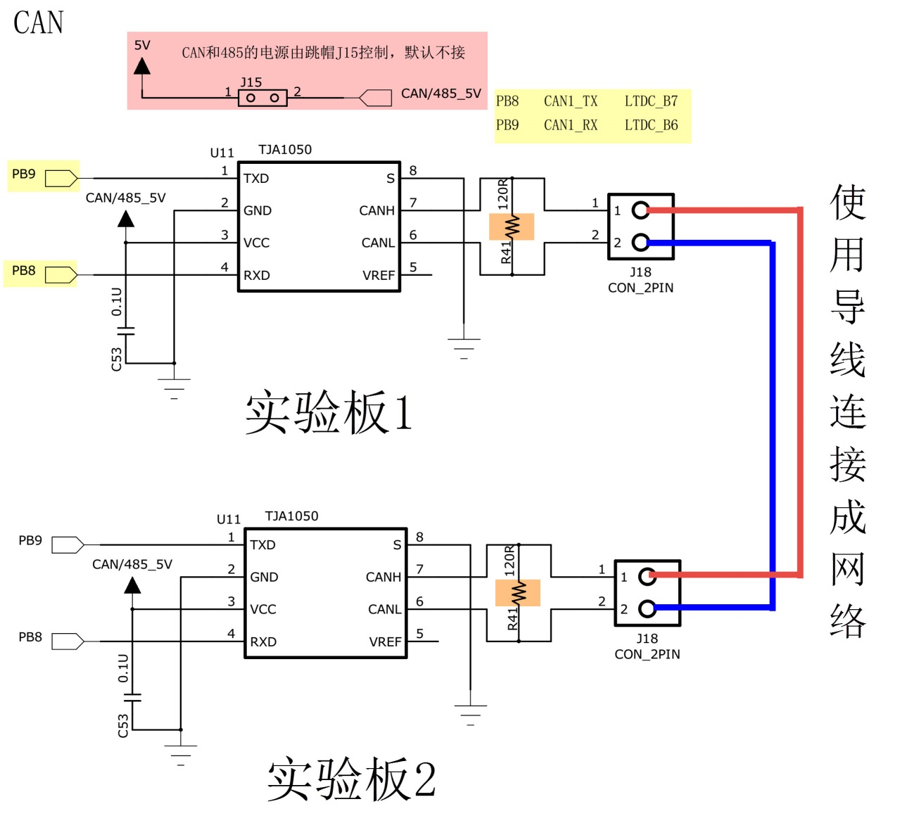

CAN—通讯实验
------------

本章参考资料：《STM32H743用户手册》、《STM32H743xI规格书》、库帮助文档《STM32H753xx_User_Manual.chm》。

若对CAN通讯协议不了解，可先阅读《CAN总线入门》、《CAN-bus规范》文档内容学习。

关于实验板上的CAN收发器可查阅《TJA1050》文档了解。

CAN协议简介
~~~~~~~~~~~

**CAN** 是控制器局域网络(Controller Area Network) 的简称，它是由研发和生产汽车电子产品著称的
德国BOSCH 公司开发的，并最终成为国际标准（ISO11519）， 是国际上应用最广泛的现场总线之一。

CAN 总线协议已经成为汽车计算机控制系统和嵌入式工业控制局域网的标准总线，并且拥有以CAN为底层协议专为大型货车和重工机械车辆设计的J1939协议。
近年来，它具有的高可靠性和良好的错误检测能力受到重视，被广泛应用于汽车计算机控制系统和环境温度恶劣、电磁辐射强及振动大的工业环境。

CAN物理层
^^^^^^^^^

与I2C、SPI等具有时钟信号的同步通讯方式不同，CAN通讯并不是以时钟信号来进行同步的，
它是一种异步通讯，只具有CAN_High 和CAN_Low 两条信号线，共同构成一组差分信号线，以差分信号的形式进行通讯。

闭环总线网络
''''''''''''

CAN物理层的形式主要有两种，图39_0_1_ 中的CAN通讯网络是一种遵循ISO11898标准的高速、短距离“闭环网络”，
它的总线最大长度为40m，通信速度最高为1Mbps，总线的两端各要求有一个“120欧”的电阻。

图 39‑1 CAN闭环总线通讯网络

开环总线网络
''''''''''''

图39_0_2_ 中的是遵循ISO11519-2标准的低速、远距离“开环网络”，它的最大传输距离为1km，
最高通讯速率为125kbps，两根总线是独立的、不形成闭环，要求每根总线上各串联有一个“2.2千欧”的电阻。

.. image:: media/image2.jpeg
   :align: center
   :alt: 图 39‑2 CAN开环总线通讯网络
   :name: 图39_0_2

图 39‑2 CAN开环总线通讯网络

通讯节点
'''''''''

从CAN通讯网络图可了解到，CAN总线上可以挂载多个通讯节点，节点之间的信号经过总线传输，实现节点间通讯。由于CAN通讯协议不对节点进行地址编码，而是对数据内容进行编码的，所以网络中的节点个数理论上不受限制，只要总线的负载足够即可，可以通过中继器增强负载。

CAN通讯节点由一个CAN控制器及CAN收发器 组成，控制器与收发器之间通过CAN_Tx及CAN_Rx信号线相连，
收发器与CAN总线之间使用CAN_High及CAN_Low信号线相连。其中CAN_Tx及CAN_Rx使用普通的类似TTL逻辑信号，
而CAN_High及CAN_Low是一对差分信号线，使用比较特别的差分信号，下一小节再详细说明。

当CAN节点需要发送数据时，控制器 把要发送的二进制编码通过CAN_Tx线发送到收发器 ，然后由收发器把这个普通的逻辑电平信号转化成差分信号 ，
通过差分线CAN_High和CAN_Low线输出到CAN总线网络。而通过收发器接收总线上的数据到控制器时，
则是相反的过程，收发器把总线上收到的CAN_High及CAN_Low信号转化成普通的逻辑电平信号，通过CAN_Rx输出到控制器中。

例如，STM32的CAN片上外设就是通讯节点中的控制器，为了构成完整的节点，还要给它外接一个收发器，
在我们实验板中使用型号为TJA1050的芯片作为CAN收发器。CAN控制器与CAN收发器的关系如同TTL串口与MAX3232电平转换芯片的关系，
MAX3232芯片把TTL电平的串口信号转换成RS-232电平的串口信号，CAN收发器的作用则是把CAN控制器的TTL电平信号转换成差分信号(或者相反) 。

差分信号
''''''''

差分信号又称差模信号，与传统使用单根信号线电压表示逻辑的方式有区别，使用差分信号传输时，需要两根信号线，
这两个信号线的振幅相等，相位相反，通过两根信号线的电压差值来表示逻辑0 和逻辑1。见
图39_0_3_，它使用了V+与V-信号的差值表达出了图下方的信号。

.. image:: media/image3.jpeg
   :align: center
   :alt: 图 39‑3 差分信号
   :name: 图39_0_3

图 39‑3 差分信号

相对于单信号线传输的方式，使用差分信号传输具有如下优点：

-  抗干扰能力强，当外界存在噪声干扰时，几乎会同时耦合到两条信号线上，而接收端只关心两个信号的差值，所以外界的共模噪声可以被完全抵消。

-  能有效抑制它对外部的电磁干扰，同样的道理，由于两根信号的极性相反，他们对外辐射的电磁场可以相互抵消，耦合的越紧密，泄放到外界的电磁能量越少。

-  时序定位精确，由于差分信号的开关变化是位于两个信号的交点，而不像普通单端信号依靠高低两个阈值电压判断，
   因而受工艺，温度的影响小，能降低时序上的误差，同时也更适合于低幅度信号的电路。

由于差分信号线具有这些优点，所以在USB协议、485协议、以太网协议及CAN协议的物理层中，都使用了差分信号传输。

CAN协议中的差分信号
'''''''''''''''''''

CAN协议中对它使用的CAN_High及CAN_Low表示的差分信号做了规定，见表
39‑1及 图39_0_4_。以高速CAN协议为例，当表示逻辑1 时(隐性电平) ，CAN_High和CAN_Low线上的电压均为2.5v，
即它们的电压差V\ :sub:`H`-V:sub:`L`\ =0V；而表示逻辑0 时(显性电平) ，CAN_High的电平为3.5V，
CAN_Low线的电平为1.5V，
即它们的电压差为V\ :sub:`H`-V:sub:`L`\ =2V。例如，当CAN收发器 从CAN_Tx线接收到来自CAN控制器的低电平 信号时(逻辑0)，
它会使CAN_High输出3.5V，同时CAN_Low输出1.5V，从而输出显性电平表示逻辑0 。

.. image:: media/image4.jpeg
   :align: center
   :alt: 图 39‑4 CAN的差分信号（高速）
   :name: 图39_0_4

图 39‑4 CAN的差分信号（高速）

在CAN总线中，必须使它处于隐性电平(逻辑1) 或显性电平(逻辑0) 中的其中一个状态。假如有两个CAN通讯节点，
在同一时间，一个输出隐性电平，另一个输出显性电平，类似I2C总线的“线与”特性将使它处于显性电平状态，
显性电平的名字就是这样来的， 即可以认为显性具有优先的意味 。

由于CAN总线协议的物理层只有1对差分线，在一个时刻只能表示一个信号，所以对通讯节点来说，CAN通讯是半双工的，收发数据需要分时进行。在CAN的通讯网络中，因为共用总线，在整个网络中同一时刻只能有一个通讯节点发送信号，其余的节点在该时刻都只能接收。

协议层
^^^^^^

以上是CAN的物理层标准，约定了电气特性，以下介绍的协议层则规定了通讯逻辑。

CAN的波特率及位同步
'''''''''''''''''''

由于CAN属于异步通讯，没有时钟信号线，连接在同一个总线网络中的各个节点会像串口异步通讯那样，
节点间使用约定好的波特率进行通讯，特别地，CAN还会使用“位同步” 的方式来抗干扰、吸收误差，
实现对总线电平信号进行正确的采样，确保通讯正常。

位时序分解
............

为了实现位同步，CAN协议把每一个数据位的时序分解成如 图39_0_5_ 所示的SS段、PTS段、PBS1段、PBS2段，
这四段的长度加起来即为一个CAN数据位的长度 。
分解后最小的时间单位是Tq，而一个完整的位由8~25个Tq组成。为方便表示，
图39_0_5_ 中的高低电平直接代表信号逻辑0或逻辑1(不是差分信号)。

.. image:: media/image5.png
   :align: center
   :alt: 图 39‑5 CAN位时序分解图
   :name: 图39_0_5

图 39‑5 CAN位时序分解图

该图中表示的CAN通讯信号每一个数据位的长度为19Tq，其中SS段占1Tq，PTS段占6Tq，PBS1段占5Tq，PBS2段占7Tq。信号的采样点位于PBS1段与PBS2段之间，通过控制各段的长度，可以对采样点的位置进行偏移，以便准确地采样。

各段的作用如介绍下：

-  SS段 (SYNC SEG)

..

   SS 译为同步段，若通讯节点检测到总线上信号的跳变沿被包含在SS段的范围之内，则表示节点与总线的时序是同步的，
   当节点与总线同步时，采样点采集到的总线电平即可被确定为该位的电平。SS段的大小固定为1Tq。

-  PTS段 (PROP SEG)

..

   PTS 译为传播时间段，这个时间段是用于补偿网络的物理延时时间。是总线上输入比较器延时和输出驱动器延时总和的两倍。PTS段的大小可以为1~8Tq。

-  PBS1段 (PHASE SEG1)，

..

   PBS1 译为相位缓冲段，主要用来补偿边沿阶段的误差，它的时间长度在重新同步 的时候可以加长 。PBS1段的初始大小可以为1~8Tq。

-  PBS2段 (PHASE SEG2)

..

   PBS2 这是另一个相位缓冲段，也是用来补偿边沿阶段误差的，它的时间长度在重新同步时可以缩短 。PBS2段的初始大小可以为2~8Tq。

通讯的波特率
................

总线上的各个通讯节点只要约定好1个Tq的时间长度以及每一个数据位占据多少个Tq，就可以确定CAN通讯的波特率。

例如，假设上图中的1Tq=1us，而每个数据位由19个Tq组成，则传输一位数据需要时间T\ :sub:`1bit`
=19us，从而每秒可以传输的数据位个数为：

1x10\ :sup:`6`\ :sub:`­`/19 = 52631.6 (bps)

这个每秒可传输的数据位的个数即为通讯中的波特率。

同步过程分析
..............

波特率只是约定了每个数据位的长度，数据同步还涉及到相位的细节，这个时候就需要用到数据位内的SS、PTS、PBS1及PBS2段了。

根据对段的应用方式差异，CAN的数据同步分为硬同步和重新同步。其中硬同步只是当存在“帧起始信号”时起作用，无法确保后续一连串的位时序都是同步的，而重新同步方式可解决该问题，这两种方式具体介绍如下：

(1) 硬同步

若某个CAN节点通过总线发送数据时，它会发送一个表示通讯起始的信号(即下一小节介绍的帧起始信号)，该信号是一个由高变低的下降沿。而挂载到CAN总线上的通讯节点在不发送数据时，会时刻检测总线上的信号。

见 图39_0_6_，可以看到当总线出现帧起始信号时，某节点检测到总线的帧起始信号不在节点内部时序的SS段范围，
所以判断它自己的内部时序与总线不同步，因而这个状态的采样点采集得的数据是不正确的。
所以节点以硬同步的方式调整，把自己的位时序中的SS段平移至总线出现下降沿的部分，获得同步，同步后采样点就可以采集得正确数据了。

图 39‑6 硬同步过程图

(2) 重新同步

前面的硬同步只是当存在帧起始信号时才起作用，如果在一帧很长的数据内，节点信号与总线信号相位有偏移时，这种同步方式就无能为力了。因而需要引入重新同步方式，它利用普通数据位的高至低电平的跳变沿来同步(帧起始信号是特殊的跳变沿)。重新同步与硬同步方式相似的地方是它们都使用SS段来进行检测，同步的目的都是使节点内的SS段把跳变沿包含起来。

重新同步的方式分为超前和滞后两种情况，以总线跳变沿与SS段的相对位置进行区分。第一种相位超前的情况如 图39_0_7_，节点从总线的边沿跳变中，
检测到它内部的时序比总线的时序相对超前 2Tq，这时控制器在下一个位时序中的PBS1段增加 2Tq的时间长度，使得节点与总线时序重新同步。

图 39‑7 相位超前时的重新同步

第二种相位滞后的情况如 图39_0_8_ ，节点从总线的边沿跳变中，检测到它的时序比总线的时序相对 滞后2Tq，
这时控制器在前一个位时序中的PBS2段减少 2Tq的时间长度，获得同步。

图 39‑8 相位滞后时的重新同步

在重新同步 的时候，PBS1和PBS2中增加或减少的这段时间长度被定义为“重新同步补偿宽度SJW*
(reSynchronization Jump
Width)”。一般来说CAN控制器会限定SJW的最大值，如限定了最大SJW=3Tq时，单次同步调整的时候不能增加或减少超过3Tq的时间长度，若有需要，控制器会通过多次小幅度调整来实现同步。当控制器设置的SJW极限值较大时，可以吸收的误差加大，但通讯的速度会下降。

CAN的报文种类及结构
'''''''''''''''''''

在SPI通讯中，片选、时钟信号、数据输入及数据输出 这4个信号都有单独的信号线 ，I2C协议包含有时钟信号及数据信号2条信号线，
异步串口包含接收与发送2条信号线，这些协议包含的信号都比CAN协议要丰富，它们能轻易进行数据同步或区分数据传输方向。
而CAN使用的是两条差分信号线，只能表达一个信号，简洁的物理层决定了CAN必然要配上一套更复杂的协议，
如何用一个信号通道实现同样、甚至更强大的功能呢？CAN协议给出的解决方案是对数据、操作命令(如读/写)以及同步信号进行打包，
打包后的这些内容称为报文。

报文的种类
..............

在原始数据段的前面加上传输起始标签、片选(识别)标签和控制标签，在数据的尾段加上CRC校验标签、应答标签和传输结束标签，
把这些内容按特定的格式打包好，就可以用一个通道表达各种信号了，各种各样的标签就如同SPI中各种通道上的信号，
起到了协同传输的作用。当整个数据包被传输到其它设备时，只要这些设备按格式去解读，就能还原出原始数据，这样的报文就被称为CAN的“数据帧” 。

为了更有效地控制通讯，CAN一共规定了5种类型的帧，它们的类型及用途说明如表
39‑2。

   表 39‑2 帧的种类及其用途

====== ==================================================
帧     帧用途
数据帧 用于节点向外传送数据
遥控帧 用于向远端节点请求数据
错误帧 用于向远端节点通知校验错误，请求重新发送上一个数据
过载帧 用于通知远端节点：本节点尚未做好接收准备
帧间隔 用于将数据帧及遥控帧与前面的帧分离开来
====== ==================================================

数据帧的结构
.................

数据帧是在CAN通讯中最主要、最复杂的报文，我们来了解它的结构，见 图39_0_9_。

.. image:: media/image9.png
   :align: center
   :alt: 图 39‑9 数据帧的结构
   :name: 图39_0_9

图 39‑9 数据帧的结构

数据帧以一个显性位(逻辑0)开始，以7个连续的隐性位(逻辑1)结束，在它们之间，分别有仲裁段、控制段、数据段、CRC段和ACK段 。

-  帧起始

SOF段(Start OfFrame)，译为帧起始，帧起始信号只有一个数据位，是一个显性电平，它用于通知各个节点将有数据传输，
其它节点通过帧起始信号的电平跳变沿来进行硬同步。

-  仲裁段

当同时有两个报文被发送时，总线会根据仲裁段的内容决定哪个数据包能被传输，这也是它名称的由来。

仲裁段的内容主要为本数据帧的ID信息(标识符)， 数据帧具有标准格式和扩展格式 两种，区别就在于ID信息的长度，
标准格式的ID为11位，扩展格式的ID为29位，它在标准ID的基础上多出18位。在CAN协议中，ID起着重要的作用，
它决定着数据帧发送的优先级 ，也决定着其它节点是否会接收 这个数据帧。CAN协议不对挂载在它之上的节点分配优先级和地址，
对总线的占有权是由信息的重要性决定的，即对于重要的信息，我们会给它打包上一个优先级高的ID，使它能够及时地发送出去。
也正因为它这样的优先级分配原则，使得CAN的扩展性大大加强，在总线上增加或减少节点并不影响其它设备。

报文的优先级，是通过对ID的仲裁来确定的。根据前面对物理层的分析我们知道如果总线上同时出现显性电平和隐性电平，总线的状态会被置为显性电平，CAN正是利用这个特性进行仲裁。

若两个节点同时竞争CAN总线的占有权，当它们发送报文时，若首先出现隐性电平，则会失去对总线的占有权，进入接收状态 。见 图39_0_10_，
在开始阶段，两个设备发送的电平一样，所以它们一直继续发送数据。到了图中箭头所指的时序处，
节点单元1发送的为隐性电平，而此时节点单元2发送的为显性电平，由于总线的“线与”特性使它表达出显示电平，
因此单元2竞争总线成功，这个报文得以被继续发送 出去。

图 39‑10 仲裁过程

仲裁段ID的优先级也影响着接收设备对报文的反应。因为在CAN总线上数据是以广播的形式发送的，所有连接在CAN总线的节点都会收到所有其它节点发出的有效数据，因而我们的CAN控制器大多具有根据ID过滤报文的功能，它可以控制自己只接收某些ID的报文。

回看 图39_0_9_ 中的数据帧格式，可看到仲裁段除了报文ID外，还有RTR、IDE和SRR位。

(1) RTR位 (Remote Transmission Request Bit)，译作远程传输请求位，它是用于区分数据帧和遥控帧的，
    当它为显性电平时表示数据帧，隐性电平时表示遥控帧。

(2) IDE位 (Identifier ExtensionBit)，译作标识符扩展位，它是用于区分标准格式与扩展格式，
    当它为显性电平时表示标准格式，隐性电平时表示扩展格式。

(3) SRR位 (Substitute Remote Request Bit)，只存在于扩展格式，它用于替代标准格式中的RTR位。
    由于扩展帧中的SRR位为隐性位，RTR在数据帧为显性位，所以在两个ID相同的标准格式报文与扩展格式报文中，标准格式的优先级较高。

-  控制段

在控制段中的r1和r0为保留位，默认设置为显性位。它最主要的是DLC段(Data Length Code)，译为数据长度码，
它由4个数据位组成，用于表示本报文中的数据段含有多少个字节，DLC段表示的数字为0~8。

-  数据段

数据段为数据帧的核心内容，它是节点要发送的原始信息，由0~8个字节组成，MSB先行。

-  CRC段

为了保证报文的正确传输，CAN的报文包含了一段15位的CRC校验码，一旦接收节点算出的CRC码 跟接收到的CRC码不同，
则它会向发送节点反馈出错信息，利用错误帧请求它重新发送。CRC部分的计算一般由CAN控制器硬件完成，出错时的处理则由软件控制最大重发数。

在CRC校验码之后，有一个CRC界定符 ，它为隐性位，主要作用是把CRC校验码与后面的ACK段间隔起来。

-  ACK段

ACK段包括一个ACK槽位 ，和ACK界定符位 。类似I2C总线，在ACK槽位中，发送节点发送的是隐性位，
而接收节点则在这一位中发送显性位以示应答。在ACK槽和帧结束之间由ACK界定符间隔开。

-  帧结束

EOF段(End Of Frame)，译为帧结束，帧结束段由发送节点发送的7个隐性位 表示结束。

其它报文的结构
.................

关于其它的CAN报文结构，不再展开讲解，其主要内容见 图39_0_11_。

.. image:: media/image11.png
   :align: center
   :alt: 图 39‑11 各种CAN报文的结构
   :name: 图39_0_11

图 39‑11 各种CAN报文的结构

STM32的CAN外设简介
~~~~~~~~~~~~~~~~~~

STM32的芯片中具有bxCAN控制器 (Basic Extended
CAN)，它支持CAN协议2.0A和2.0B标准。

该CAN控制器支持最高的通讯速率为1Mb/s；可以自动地接收和发送CAN报文，支持使用标准ID和扩展ID的报文；外设中具有3个发送邮箱，发送报文的优先级可以使用软件控制，还可以记录发送的时间；具有2个3级深度的接收FIFO，可使用过滤功能只接收或不接收某些ID号的报文；可配置成自动重发；不支持使用DMA进行数据收发。

STM32的CAN架构剖析
^^^^^^^^^^^^^^^^^^

图 39‑12  STM32的CAN外设架构图

STM32H7有两组FDCAN控制器，框图中主要包含CAN控制内核、CAN相关的控制寄存器及配置寄存器、发送管理单元以及接收管理单元，验收筛选器被包含在接受管理单元单元中。
发送过程，程序员将需要需要发送的内容，包括ID，数据长度码，数据等，按照一定的格式写入到消息RAM的地址中，发送管理单元从消息RAM的地址中读取，交给CAN控制内核，由控制内核完成发送过程。
接受过程，CAN接受到数据时，根据验收筛选器的配置，对消息进行筛选，如果ID匹配的话，则将消息存放到相应的消息RAM中。
下面对框图中的各个部分进行介绍。

CAN控制内核
'''''''''''

框图中1标号处的CAN内核包含了协议控制器和接收/发送移位寄存器。 它支持所有ISO 11898-1：2015协议，并支持11位和29位的ID标识。 

CAN控制寄存器和配置寄存器
''''''''''''''''''''''''''''''''''

框图中标号2处为CAN的控制寄存器和配置寄存器，包含了各种控制寄存器及状态寄存器，我们主要讲解其中的控制寄存器FDCAN_CCCR及位时序寄存器CAN_BTR。

控制寄存器FDCAN_CCCR
.....................

控制寄存器FDCAN_CCCR负责管理CAN的工作模式，它通过修改相应的寄存器位实现各种功能控制。

(1)	初始化模式

初始化时，需要将寄存器CCCR的位INIT和位CCE置1，才能够配置寄存器。在该模式，传输停止。只有当位 INIT清零时，才退出初始化模式。之后，BSP通过等待11个连续隐形电平的序列，进行数据同步，才可以开始进行数据传输。

(2)	正常模式

当初始化FDCAN完成，且寄存器CCCR的位INIT和位CCE也被清零后，数据同步过后，则FDCAN就可以正常通讯了。
FDCAN接收的数据经过接收筛选器之后，可以选择存放接收缓冲区或者是接收FIFO。发送数据时，可以通过更新发送缓冲区，发送FIFO或者发送队列中的值。

(3)	FDCMD模式

通过配置FDCAN_CCCR的位FDOE来使能该模式，只有当FDCAN_CCCR的位INIT和位CCE均被置位时，可以改变该位的值。FDCAN协议有两种协议，一种是LFM模式，即发送的CAN报文中的数据段超出了8个字节。在该模式下，数据长度码（DLC）与标准的CAN协议有所区别：DLC段表示的数字为0~8时，与标准CAN协议一样，用于表示本报文中的数据段含有多少个字节。DLC的字段为9~15时，传统的CAN协议数据段最大只能是8个字节，而FDCAN模式下的数据段最大支持64个字节。具体见下面表格-FDCAN模式下DLC段的含义（9~15）。

+----------------------+----+----+----+----+----+----+----+
| DLC                  | 9  | 10 | 11 | 12 | 13 | 14 | 15 |
+======================+====+====+====+====+====+====+====+
| Number of data bytes | 12 | 16 | 20 | 24 | 32 | 48 | 64 |
+----------------------+----+----+----+----+----+----+----+

另一种是FFM模式，采用较高的比特率传输CAN报文中的控制段，数据段以及CRC段，而帧起始和帧结束采用较低的比特率进行传输。数据段的比特率取决于FDCAN的内核时钟。例如，FDCAN的内核时钟为20MHz，而数据段的时间长度最短可以选择4个Tq，则此时的数据传输的比特率最大，为5Mbit/s。

(4)	操作受限模式

操作受限模式（Restricted Operation Mode），通过软件将FDCAN_CCCR的位ASM置一，则进入该模式。在此模式下，通讯节点只能接受数据帧和遥控帧 ，不能发送数据帧，遥控帧，错误帧和过载帧。此外，当发送单元没有及时从Message RAM中读取数据时，也会自动自动进入该模式。此时需要手动将FDCAN_CCCR的位ASM位清零，才可以退出该模式。

(5)	总线监控模式

当FDCAN_CCCR的位MON或者是发送重大的错误时，会进入该模式。在这个模式下，FDCAN能接受到有效的数据帧和遥控帧，但是不能使用传输功能。这种模式可以用来分析 CAN总线的数据流量。

(6)	低功耗模式

Power Down(Sleep mode)，低功耗模式，CAN外设可以使用软件进入低功耗的睡眠模式，如果使能了这个自动唤醒功能，当CAN检测到总线活动的时候，会自动唤醒。

(7)	DAR自动重传

DAR(Disabled automatic retransmission)，报文自动重传功能，设置这个功能后，当报文发送失败时会自动重传至成功为止。STM32H7的FDCAN默认是使能自动重传的。可以通过修改FACAN_CCCR寄存在的位DAR，来关闭该功能。

位时序寄存器(CAN_BTR)及波特率
..............................

CAN外设中的位时序寄存器CAN_BTR用于配置测试模式、波特率以及各种位内的段参数。

(1)	测试模式

为方便调试，STM32的CAN提供了测试模式，配置位时序寄存器CAN_BTR的SILM及LBKM寄存器位可以控制使用正常模式、静默模式、回环模式及静默回环模式，见下图

各个工作模式介绍如下：

1、	正常模式

正常模式下就是一个正常的CAN节点，可以向总线发送数据和接收数据。

2、	外部回环模式

回环模式下，它自己的输出端的所有内容都直接传输到自己的输入端，输出端的内容同时也会被传输到总线上，即也可使用总线监测它的发送内容。输入端只接收自己发送端的内容，不接收来自总线上的内容。使用回环模式可以进行自检。

3、	内部回环模式

回环静默模式是以上两种模式的结合，自己的输出端的所有内容都直接传输到自己的输入端，并且不会向总线发送显性位影响总线，不能通过总线监测它的发送内容。输入端只接收自己发送端的内容，不接收来自总线上的内容。这种方式可以在“热自检”时使用，即自我检查的时候，不会干扰总线。

以上说的各个模式，是不需要修改硬件接线的，如当输出直连输入时，它是在STM32芯片内部连接的，传输路径不经过STM32的CAN_Tx/Rx引脚，更不经过外部连接的CAN收发器，只有输出数据到总线或从总线接收的情况下才会经过CAN_Tx/Rx引脚和收发器。

位时序及波特率
......................

STM32外设定义的位时序与我们前面解释的CAN标准时序有一点区别，见 图39_0_14_。

图 39‑14 STM32中CAN的位时序

STM32的CAN外设位时序中只包含3段，分别是同步段SYNC_SEG、位段BS1及位段BS2，采样点位于BS1及BS2段的交界处。其中SYNC_SEG段固定长度为1Tq，而BS1及BS2段可以在位时序寄存器CAN_BTR设置它们的时间长度，它们可以在重新同步期间增长或缩短，该长度SJW也可在位时序寄存器中配置。

理解STM32的CAN外设的位时序时，可以把它的BS1段理解为是由前面介绍的CAN标准协议中PTS段与PBS1段合在一起的，而BS2段就相当于PBS2段。

了解位时序后，我们就可以配置波特率了。通过配置位时序寄存器CAN_BTR的TS1[3:0]及TS2[2:0]寄存器位设定BS1及BS2段的长度后，我们就可以确定每个CAN数据位的时间：

BS1段时间：

T\ :sub:`S1`\ =Tq x (TS1[7:0] + 1)，

BS2段时间：

T\ :sub:`S2`\ = Tq x (TS2[6:0] + 1)，

一个数据位的时间：

T\ :sub:`1bit` =1Tq+T\ :sub:`S1`\ +T\ :sub:`S2` =1+ (TS1[7:0] + 1)+
(TS2[6:0] + 1)= N Tq

其中单个时间片的长度Tq与CAN外设的所挂载的时钟总线及分频器配置有关，CAN1和CAN2外设都是挂载在APB1总线上的，而位时序寄存器CAN_BTR中的BRP[9:0]寄存器位可以设置CAN外设时钟的分频值
，所以：

Tq = (BRP+1) x T\ :sub:`PCLK`

其中的CLK指FDCAN的时钟，可以来源于HSE，PLL1Q，PLL2Q。

最终可以计算出CAN通讯的波特率：

BaudRate = 1/N Tq

例如表 39‑3说明了一种把波特率配置为1Mbps的方式。

   表 39‑3 一种配置波特率为1Mbps的方式

=============== =============================================================
参数            说明
SYNC_SE段       固定为1Tq
BS1段           设置为31Tq (实际写入TS1[7:0]的值为0x1F)
BS2段           设置为8Tq (实际写入TS2[6:0]的值为8)
T\ :sub:`PCLK`  APB1按默认配置为F=40MHz，T\ :sub:`PCLK`\ =1/40M
CAN外设时钟分频 设置为5分频(实际写入BRP[9:0]的值为4)
1Tq时间长度     Tq = (BRP[8:0]+1) x T\ :sub:`PCLK` = 1 x 1/40M=1/40M
1位的时间长度   T\ :sub:`1bit` =1Tq+T\ :sub:`S1`\ +T\ :sub:`S2` = 1+31+8 = 40Tq
波特率          BaudRate = 1/N Tq = 1/(1/40M x 40)=1Mbps
=============== =============================================================

消息RAM
''''''''''''
回到图 图39_0_12_
STM32的CAN外设架构图中的CAN外设框图，在标号处的是FDCAN外设的消息RAM，它的位宽度为32bit。见图 消息RAM_。每一个区域的起始地址可以通过配置相关的寄存器位，见表格消息RAM的配置。

表格 消息RAM的配置

+----------------+----------------+--------------------------------+
| Message RAM    | 对应的寄存器位 | 相关配置说明                   |
+================+================+================================+
| 11-bit filter  | SIDFC.FLSSA    | 最大为128个字，可以使用128个字 |
+----------------+----------------+--------------------------------+
| 29-bit filter  | XIDFC.FLESA    | 最大为128个字，可以使用64个字  |
+----------------+----------------+--------------------------------+
| Rx FIFO 0      | RXF0C.F0SA     | 最大为256个字，可以使用64个字  |
+----------------+----------------+--------------------------------+
| Rx FIFO 1      | RXF1C.F1SA     | 最大为256个字，可以使用64个字  |
+----------------+----------------+--------------------------------+
| Rx buffer      | RXBC.RBSA      | 最大为256个字，可以使用64个字  |
+----------------+----------------+--------------------------------+
| Tx event FIFO  | TXEFC.EFSA     | 最大为64个字，可以使用32个字   |
+----------------+----------------+--------------------------------+
| Tx buffers     | TXBC.TBSA      | 最大为128个字，可以使用32个字  |
+----------------+----------------+--------------------------------+
| Trigger memory | TMC.TMSA       | 最大为128个字，可以使用64个字  |
+----------------+----------------+--------------------------------+

CAN接收FIFO 
..............

消息RAM
中有两个接收FIFO。STM32内部读取FIFO数据之后，报文计数器会自加。每个FIFO中最多可以缓存64个字大小的数据，通过相应的寄存器RXFnC(n=0,1)进行配置。接受FIFO有两种工作模式，一种是阻塞模式（RXFxC.FnOM=’0’时）(n=0,1)，当接受FIFO已经溢出的时候，寄存器RXFnS（n=0,1）的位FnF会被置1，同时相应的中断标志位IR.RFnF也会被置1。如果此时又接收到数据时，则这帧数据会被丢弃，不进行接受，同时寄存器RXFnS(n=0,1)的位RFnL和中断标志位IR.RFnL会被置1；另一种是覆盖模式（当RXFnC.FnOM被置1时）(n=0,1)，当接受FIFO溢出时，新的数据会将旧的数据进行覆盖。接收FIFO的数据格式，见图 接受FIFO的数据格式_，数据段支持的最大字节数是64字节，可以通过寄存器RXESC进行配置。对于接受缓冲区（Rx
Buffer）也是一样的。

图 接受FIFO的数据格式

表格 接受FIFO数据格式的具体描述

+--------------------+----------------------+
| 位                 | 具体描述             |
+====================+======================+
| ESI                | 错误状态标志         |
+--------------------+----------------------+
| XTD                | 扩展格式ID标志       |
+--------------------+----------------------+
| RTR                | 遥控帧标识符         |
+--------------------+----------------------+
| ID[28:0]           | ID号                 |
+--------------------+----------------------+
| ANMF               | 接受ID不匹配的数据帧 |
+--------------------+----------------------+
| FIDX[6:0]          | 筛选器编号           |
+--------------------+----------------------+
| Res                | 保留                 |
+--------------------+----------------------+
| FDF                | FDCAN的数据格式      |
+--------------------+----------------------+
| BRS                | 位时序切换           |
+--------------------+----------------------+
| DLC[3:0]           | 数据长度             |
+--------------------+----------------------+
| RXTS[15:0]         | 时间戳               |
+--------------------+----------------------+
| DBn（n=0,1,2,...） | 数据段               |
+--------------------+----------------------+

下面对其中一些重要的数据位，进行说明：

(1)  位ESI：当检测到错误时是否将发送错误标志

(2)  位XTD：决定接受ID的位数是11位还是29位。1表示29位扩展格式的ID，0表示11位标准格式的ID。

(3)  位RTR：遥控帧标识符。用于向远端节点请求数据。

(4)  ID[28:0]：用来存放ID。ID的位数由XTD位决定。若ID是11位的，则存放在ID[28:18]为中。

(5)  位ANMF：决定FDCAN是否接收不匹配的数据帧。

(6)  FIDX[6:0]：验收筛选器的编号；

(7)  FDF：决定数据帧的格式。可选择标准帧格式（该位为0）和FDCAN帧格式（该位为1）。

(8)  BRS：主要用FDCAN的FFM模式。传输数据阶段是否进行位时序切换。

(9)  DLC：数据长度码，CAN一般可接受8个字节，而FDCAN能够接受12/16/20/24/32/48/64个字节。

(10) DBn：数据段，FDCAN最大支持64个字节数据，可通过配置寄存器RXESC进行修改。

CAN发送缓冲区
.................

消息RAM中由一个发送缓冲区，最多可以使用32个缓冲区。每一个发送缓冲区可以配置一个ID，如果多个缓冲区配置成同一个ID的话，则优先传输缓冲区序号最低的那个。可以通过寄存器TXBAR[ARn]来修改发送的内容，数据的格式如图 发送的数据格式_。

图 发送的数据格式

表格 发送数据的格式具体描述

+--------------------+-----------------+
| 位                 | 具体描述        |
+====================+=================+
| ESI                | 错误状态标志    |
+--------------------+-----------------+
| XTD                | 扩展格式ID标志  |
+--------------------+-----------------+
| RTR                | 遥控帧表示      |
+--------------------+-----------------+
| ID[28:0]           | ID号            |
+--------------------+-----------------+
| MM                 | 信息识别标志    |
+--------------------+-----------------+
| EFC                | 事件FIFO使能    |
+--------------------+-----------------+
| FDF                | FDCAN的数据格式 |
+--------------------+-----------------+
| BRS                | 位时序切换      |
+--------------------+-----------------+
| DLC[3:0]           | 数据长度        |
+--------------------+-----------------+
| DBn（n=0,1,2,...） | 数据段          |
+--------------------+-----------------+

大部分的数据位与接受FIFO相同，不过，多了以下这些参数：

(1) MM：信息识别标志，发送数据时，会被拷贝到发送事件FIFO中。

(2) EFC：是否使用事件FIFO的功能。

其余的数据格式可以参考上面表格 接受FIFO数据格式的具体描述。

发送管理单元
''''''''''''''

回到 图39_0_12_ 中的CAN外设框图，在标号4发送管理单元用于将消息RAM中的信息发送给CAN控制内核。发送缓冲区最大可以配置为32个，也可以作为发送队列使用。详细说明参考第三点消息RAM的内容。CAN发送的数据段大小为2~16个字。一些相关的配置参数，见
CAN发送配置_，FDCAN主要有三种模式可以选择，分别是标准的CAN协议，即Classic CAN，要求数据段长度小于8；还有FDCAN模式，又可以分为FFM和 LFM。第一种要求用较高的比特率传输数据段的内容，对应图 CAN发送配置_ 的最后一种配置；第二种是传输的数据段长度超过了8个字节，对应了第三、第五的配置。

接受管理单元
''''''''''''

回到 图39_0_12_ 中的CAN外设框图中的CAN外设框图，在标号5处的是CAN外设的接受管理单元，他包含了筛选器组，两个接受FIFO和接受缓冲区。关于接受 FIFO和接受缓冲区，可以翻看前面消息RAM小节，下面看一下验收筛选器：

验收筛选器
................

在 CAN 协议中，消息的标识符与节点地址无关，但与消息内容有关。因此，发送节点将报文广播给所有接收器时，接收节点会根据报文标识符的值来确定软件是否需要该消息，为了简化软件的工作，STM32的CAN外设接收报文前会先使用验收筛选器检查，只接收需要的报文到FIFO中。

筛选器工作的时候，根据过滤的方法分为以下三种模式：

(1)	标识符列表模式（range filter），要求报文ID与列表中的某一个标识符完全相同才可以接收，可以理解为白名单管理。

(2)	特定的ID号（dual  ID filter），验收筛选器只能接受符合特定ID号的信息，最多支持两个ID。

(3)	掩码模式（classic filter），它把可接收报文ID的某几位作为列表，这几位被称为掩码，可以把它理解成关键字搜索，只要掩码(关键字)相同，就符合要求，报文就会被保存到接收FIFO。若掩码的各个位均为1，则只有筛选出的ID与接受的ID段一致，该数据才会被接受到FIFO中，否则则会被舍弃。见图 掩码全为1的情况_。图 掩码不全为0的情况_ 展示了掩码不全为0的情况，他是一组包含了多个的ID值，其中x表示该位可以为1也可以为0。

图 掩码全为1的情况

图 掩码不全为0的情况

CAN初始化结构体
~~~~~~~~~~~~~~~

从STM32的CAN外设我们了解到它的功能非常多，控制涉及的寄存器也非常丰富，而使用STM32 HAL库提供的各种结构体及库函数可以简化这些控制过程。跟其它外设一样，STM32 HAL库提供了CAN初始化结构体及初始化函数来控制CAN的工作方式，提供了收发报文使用的结构体及收发函数，还有配置控制筛选器模式及ID的结构体。这些内容都定义在库文件“stm32h7xx_hal_fdcan.h”及“stm32h7xx_hal_fdcan.c”中，编程时我们可以结合这两个文件内的注释使用或参考库帮助文档。

首先我们来学习初始化结构体的内容，见  代码清单 CAN初始化结构体_ 和 代码清单39_0_1_ FDCAN外设管理结构体。

代码清单 CAN初始化结构体

.. code-block:: c
   :name: CAN初始化结构体

   /**
      * @brief  FDCAN外设管理结构体
      */
   typedef struct {
      FDCAN_GlobalTypeDef         *Instance;  /*!< FDCAN外设寄存器基地址*/
   
      TTCAN_TypeDef               *ttcan;     /*!< TTCAN外设寄存器基地址*/
   
      FDCAN_InitTypeDef           Init;       /*!< FDCAN参数配置结构体*/
   
      FDCAN_MsgRamAddressTypeDef  msgRam;     /*!< FDCAN消息RAM结构体*/
   
      __IO HAL_FDCAN_StateTypeDef State;      /*!< FDCAN工作状态*/
   
      HAL_LockTypeDef             Lock;       /*!< 锁资源*/
   
      __IO uint32_t               ErrorCode;  /*!< 操作错误参数*/
   
   } FDCAN_HandleTypeDef;

(1)	Instance：结构体指针，本成员用于指向用户使用的FDCAN寄存器基地址，方便对I2C寄存器进行配置。

(2)	Ttcan：结构体指针，本成员用于用于指向用户所使用使用的TTCAN寄存器的基地址，本章节没有使用TTCAN的功能，不做详细解释。

(3)	Init：初始化结构体，主要用来配置FDCAN的时钟分频和FDCAN的工作模式，具体见下面分析。

(4)	msgRam：是一个信息RAM的结构体，主要用缓存信息。我们要发送的数据，通过写入到该结构体成员TxBufferSA中，调用HAL_FDCAN_EnableTxBufferRequest函数，将缓冲区的内容发送出去。

(5)	Lock：主要负责分配锁资源，可选择HAL_UNLOCKED或者是HAL_LOCKED两个参数。

(6)	State：主要用来记录FDCAN的工作状态。

(7)	ErrorCode：主要保存了FDCAN通讯时发生的错误类型，提供给用户进行排查错误。

代码清单 39‑1 CAN初始化结构体（stm32h7xx_hal_fdcan.h文件）

.. code-block:: c
   :name: 代码清单39_0_1

   /**
      * @brief FDCAN初始化结构体
      */
   typedef struct {
      uint32_t FrameFormat;               /*!< FDCAN帧的格式*/
   
      uint32_t Mode;                       /*!< FDCAN的工作模式*/
   
      FunctionalState AutoRetransmission;  /*!< 是否使能自动重传功能*/
   
      FunctionalState TransmitPause;    /*!< 是否使能传输暂停*/
   
      FunctionalState ProtocolException; /*!<异常处理功能*/
   
      uint32_t NominalPrescaler;  /*!< 时钟的分频因子，可设置为1~512*/
   
      uint32_t NominalSyncJumpWidth;         /*!< 配置SJW极限值*/
   
      uint32_t NominalTimeSeg1;      /*!< 配置Seg1段的长度*/
   
      uint32_t NominalTimeSeg2;      /*!< 配置Seg2段的长度 */
   
      uint32_t DataPrescaler;       /*!< 数据段的时钟分频因子，可配置为1~32*/
   
      uint32_t DataSyncJumpWidth;    /*!< 配置数据段的SJW极限值，可配置为1~16*/
   
      uint32_t DataTimeSeg1; /*!<配置数据段的Seg1段的长度，可配置为1~32*/
      uint32_t DataTimeSeg2;    /*!<配置数据段的Seg2段的长度，可配置为1~16*/
      

      uint32_t MessageRAMOffset;             /*!< 消息RAM的地址偏移量*/

      uint32_t StdFiltersNbr;  /*!< 标准ID的个数，可配置为0~128*/

      uint32_t ExtFiltersNbr;  /*!< 扩展ID的个数，可配置为0~128*/

      uint32_t RxFifo0ElmtsNbr; /*!< 使用RXFIFO0的个数，可配置为0~64*/

      uint32_t RxFifo0ElmtSize; /*!< RXFIFO0中数据的字节数，最大支持64字节*/

      uint32_t RxFifo1ElmtsNbr; /*!< 使用RXFIFO1的个数，可配置为0~64*/

      uint32_t RxFifo1ElmtSize; /*!< RXFIF1中数据的字节数，最大支持64字节*/

      uint32_t RxBuffersNbr; /*!< 使用RX缓冲区的个数，可配置为0~64*/

      uint32_t RxBufferSize; /*!< RX缓冲中数据的字节数，最大支持64字节*/
      

      uint32_t TxEventsNbr; /*!<使用Tx事件缓冲区的个数，可配置为0~32*/
      

      uint32_t TxBuffersNbr; /*!< 使用TX缓冲区的个数，可配置为0~32*/

      uint32_t TxFifoQueueElmtsNbr; /*!<使用TXFIFO或者是队列的个数，可配置为0~32*/
      

      uint32_t TxFifoQueueMode; /*!< 选择TXFIFO模式或者是Tx队列模式*/

      uint32_t TxElmtSize; /*!< 发送数据的字节数，最大支持64字节*/

   } FDCAN_InitTypeDef;

(1)	FrameFormat：选择FDCAN帧格式。可选择标准的帧格式，或者变位时序的帧格式。

(2)	Mode：选择FDCAN的工作模式，可配置为正常模式，内部回环测试模式，外部回环测试模式等。

(3)	AutoRetransmission：是否使用自动重传功能，使用自动重传功能时，会一直发送报文直到成功为止。

(4)	TransmitPause：传输暂停模式。如果该位置1，则FDCAN在下一次开始之前和成功发送帧之间，暂停两个Tq。

(5)	ProtocolException：异常处理功能。

(6)	NominalPrescaler：时钟分频因子，控制时间片Tq的时间长度。

(7)	NominalSyncJumpWidth：配置SJW的极限长度，即CAN重新同步是单次可增加或缩短的最大长度。

(8)	NominalTimeSeg1：配置CAN时序中的BS1段的长度，是PTS段和PBS1段的时间长度时间长度之和。

(9)	NominalTimeSeg2：配置CAN位时序中的BS2段的长度。

(10)	DataPrescaler、DataSyncJumpWidth、DataTimeSeg1、DataTimeSeg2：这四个参数主要是用来配置FDCAN的FFM模式。FFM模式要求数据段的传输速度要高于起始帧和结束帧。这四个参数分别是数据段时钟分频因子，数据段SJW的极限长度，数据段的BS1的长度，BS2段的长度。具体作用于（6）~（9）相同。

(11)	MessageRAMOffset：消息RAM的偏移地址。

(12)	StdFiltersNbr：标准ID的缓冲区个数，最大可以为128个字。

(13)	ExtFiltersNbr：扩展ID的缓冲区个数，最大可以为128个字。

(14)	RxFifo0ElmtsNbr、RxFifo1ElmtsNbr：使用RXFIFO的个数，可配置为0~64个字节。

(15)	RxFifo0ElmtSize、RxFifo1ElmtSize：RXFIFO中的数据字段的大小，最大支持64字节。

(16)	RxBuffersNbr：要使用的接受缓冲区的个数，可配置为0~64个

(17)	RxBufferSize：接受缓冲区中数据的大小，最大支持64字节。

(18)	TxEventsNbr：发送事件缓冲区的个数。可选择0~32个

(19)	TxBuffersNbr：需要使用的发送缓冲区的的个数，最大可配置为64个。

(20)	TxFifoQueueElmtsNbr：发送FIFO或者队列的个数，可配置为0~32个

(21)	TxFifoQueueMode：选择TX的缓冲区的功能，可配置为发送FIFO和发送队列。

(22)	TxElmtSize：配置发送的字节数，最大支持64字节

CAN发送及接收结构体
~~~~~~~~~~~~~~~~~~~~~

在发送或接收报文时，需要往发送邮箱中写入报文信息或从接收FIFO中读取报文信息，
利用STM32HAL库的发送及接收结构体可以方便地完成这样的工作，它们的定义见 代码清单39_0_2_。

代码清单 39‑2 CAN发送及接收结构体

.. code-block:: c
   :name: 代码清单39_0_2

   /**
      * @brief  FDCAN Tx header structure definition
      */
   typedef struct {
      uint32_t Identifier;          /*!< 存储报文的标识符*/
      uint32_t IdType;              /*!< 标识符的类型，11bit或者是29bit*/
      uint32_t TxFrameType;         /*!< 发送报文的类型 */
      uint32_t DataLength;          /*!< 存储报文的长度，最大可以是64个字节 */
      uint32_t ErrorStateIndicator; /*!< 错误状态标识符 */
      uint32_t BitRateSwitch;       /*!< 数据段的位时序 */
      uint32_t FDFormat;            /*!< FDCAN的数据格式 */
      uint32_t TxEventFifoControl;  /*!<  发送事件FIFO使能*/
      uint32_t MessageMarker;       /*!< 发送事件相关*/
   } FDCAN_TxHeaderTypeDef;
   /**
      * @brief  FDCAN Rx header structure definition
      */
   typedef struct {
      uint32_t Identifier;            /*!< 存储报文的标识符*/
      uint32_t IdType;                /*!< 标识符的类型，11bit或者是29bit*/
      uint32_t RxFrameType;           /*!< 接受报文的类型*/
      uint32_t DataLength;            /*!< 存储报文的长度，最大可以是64个字节 */
      uint32_t ErrorStateIndicator;   /*!<  错误状态标识符 */
      uint32_t BitRateSwitch;         /*!< 数据段的位时序 */
      uint32_t FDFormat;              /*!< FDCAN的数据格式*/
      uint32_t RxTimestamp;           /*!< 时间戳*/
      uint32_t FilterIndex;           /*!< 接受ID段*/
      uint32_t IsFilterMatchingFrame; /*!< 是否接受不匹配ID的数据帧*/
   } FDCAN_RxHeaderTypeDef;

对比阅读，发送结构体与接收结构体是类似的，只是接收结构体多了RxTimestamp成员, FilterIndex成员 和IsFilterMatchingFrame成员，说明如下：

(1)	Identifier

本成员存储的是报文的11位标准标识符，范围是0-0x7FF。或者是报文的29位扩展标识符，范围是0-0x1FFFFFFF。ExtId与StdId这两个成员根据下面的IDE位配置，只有一个是有效的。

(2)	IdType

本成员存储的是扩展标志IDE位，当它的值为宏FDCAN_STANDARD_ID时表示本报文是标准帧，使用StdId成员存储报文ID；当它的值为宏FDCAN_EXTENDED_ID  时表示本报文是扩展帧，使用ExtId成员存储报文ID。

(3)	TxFrameType /RxFrameType

本成员存储的是报文的类型，可以是数据帧或者是遥控帧。

(4)	DataLength

本成员存储的是数据帧数据段的长度。最大可以是64个字节。

(5)	ErrorStateIndicator

错误状态标识符。处于主动错误状态（FDCAN_ESI_ACTIVE）的节点，当检测到错误时将发送错误标志；处于被动错误状态（FDCAN_ESI_PASSIVE）的节点不能发送主动错误标志。

(6)	BitRateSwitch

本成员存储的是数据段的位时序切换功能。主要用于FDCAN的FFM模式。

(7)	FDFormat

本成员存储的就是数据帧的数据格式。可以选择标准的CAN协议和FDCAN模式。

(8)	TxEventFifoControl

本成员用于配置是否使用发送事件FIFO，发送事件FIFO主要用来存放一些消息的标志。

(9)	MessageMarker

本成员用来定义个消息的标志。假如使能了发送事件FIFO的功能，则该值会被拷贝到发送事件FIFO中。

(10)	RxTimestamp

本成员只存在于接收结构体，它存储了FIFO的编号，表示本报文是存在哪个接收FIFO的。

(11)	FilterIndex

本成员只存在于接收结构体，用于设置筛选滤波器的编号。

(12)	IsFilterMatchingFrame

本成员只存在于接收结构体，用于设置是否接受ID不匹配的消息。

当需要使用CAN发送报文时，先定义一个上面发送类型的结构体，然后把报文的内容按成员赋值到该结构体中，最后调用库函数CAN_Transmit把这些内容写入到发送邮箱即可把报文发送出去。

接收报文时，通过检测标志位获知接收FIFO的状态，若收到报文，可调用库函数CAN_Receive把接收FIFO中的内容读取到预先定义的接收类型结构体中，然后再访问该结构体即可利用报文了。

CAN筛选器结构体
~~~~~~~~~~~~~~~~~~~

CAN的筛选器有多种工作模式，利用筛选器结构体可方便配置，它的定义见 代码清单39_0_3_。

代码清单 39_0_3 CAN筛选器结构体

.. code-block:: c
   :name: 代码清单39_0_3

   /**
   * @brief  CAN filter init structure definition
   * CAN筛选器结构体
   */
   typedef struct {
      uint32_t IdType;           /*!< 识符的类型，11bit或者是29bit*/
      uint32_t FilterIndex;      /*!< 筛选器编号*/
      uint32_t FilterType;       /*!< 筛选器模式*/
      uint32_t FilterConfig;     /*!< 设置经过筛选后数据存储到哪个接受FIFO*/
      uint32_t FilterID1;        /*!< 筛选的ID*/
      uint32_t FilterID2;        /*!< 筛选的ID */
      uint32_t RxBufferIndex;    /*!< 选择存放在哪个接受缓冲区*/
      uint32_t IsCalibrationMsg; /*!< 接受数据的类型*/
   } FDCAN_FilterTypeDef;

各个结构体成员的介绍如下：

(1)	IdType

IdType成员， 当它的值为宏FDCAN_STANDARD_ID时表示本报文是标准帧，使用StdId成员存储报文ID；当它的值为宏FDCAN_EXTENDED_ID  时表示本报文是扩展帧，使用ExtId成员存储报文ID。

(2)	FilterIndex

本成员用于设置筛选器的编号，即选择哪一组筛选器。如果是标准ID的话，选择0~127；如果是扩展ID的话，选择0~63。 

(3)	FilterType

FilterType用于设置筛选器的工作模式，列表模式(宏CAN_FILTERMODE_IDLIST)及掩码模式(宏FDCAN_FILTER_MASK)
	
(4)	FilterConfig

本成员主要用于设置经过筛选后的数据存储到哪一个接受FIFO，可以选择接受FIFO1，接收FIFO2，接受缓冲区等。请注意，如果选择接收缓冲区，则FilterType的值会被忽略，也就是FDCAN只会识别第一个ID。

(5)	FilterID1、FilterID2

本成员用于存储要筛选的ID。根据不同筛选方式，ID的值不同。

(6)	RxBufferIndex

本成员用于设置数据存放在哪一个接收缓冲区中，可选为0~63。

(7)	IsCalibrationMsg

本成员用于设置筛选器的工作模式，可以设置为列表模式(宏CAN_FILTERMODE_IDLIST)及掩码模式(宏CAN_FILTERMODE_IDMASK)。

配置完这些结构体成员后，我们调用库函数HAL_CAN_ConfigFilter即可把这些参数写入到筛选控制寄存器中，从而使用筛选器。我们前面说如果不理解那几个ID结构体成员存储的内容时，可以直接阅读库函数HAL_CAN_ConfigFilter的源代码理解，就是因为它直接对寄存器写入内容，代码的逻辑是非常清晰的。

CAN—双机通讯实验
~~~~~~~~~~~~~~~~~

本小节演示如何使用STM32的CAN外设实现两个设备之间的通讯，该实验中使用了两个实验板，如果您只有一个实验板，也可以使用CAN的回环模式进行测试，不影响学习的。为此，我们提供了“CAN—双机通讯”及“CAN—回环测试”两个工程，可根据自己的实验环境选择相应的工程来学习。这两个工程的主体都是一样的，本教程主要以“CAN—双机通讯”工程进行讲解。

硬件设计
^^^^^^^^

图 39‑16 双CAN通讯实验硬件连接图

图39_0_16_ 中的是两个实验板的硬件连接。在单个实验板中，作为CAN控制器的STM32引出CAN_Tx和CAN_Rx两个引脚
与CAN收发器TJA1050相连，
收发器使用CANH及CANL引脚连接到CAN总线网络中。为了方便使用，我们每个实验板引出的CANH及CANL都连接了1个120欧的电阻作为CAN总线的端电阻，
所以要注意如果您要把实验板作为一个普通节点连接到现有的CAN总线时，是不应添加该电阻的！

要实现通讯，我们还要使用导线把实验板引出的CANH及CANL两条总线连接起来，才能构成完整的网络。实验板之间CANH1与CANH2连接，CANL1与CANL2连接即可。

要注意的是，由于我们的实验板CAN使用的信号线与液晶屏共用了，为防止干扰，平时我们默认是不给CAN收发器供电的，使用CAN的时候一定要把CAN接线端子旁边的“C/4-5V”排针使用跳线帽与“5V”排针连接起来进行供电，并且把液晶屏从板子上拔下来。

如果您使用的是单机回环测试的工程实验，就不需要使用导线连接板子了，而且也不需要给收发器供电，因为回环模式的信号是不经过收发器的，不过，它还是不能和液晶屏同时使用的。

软件设计
^^^^^^^^

为了使工程更加有条理，我们把CAN控制器相关的代码独立分开存储，方便以后移植。在“串口实验”之上新建“bsp_can.c”及“bsp_can.h”文件，这些文件也可根据您的喜好命名，它们不属于STM32
HAL库的内容，是由我们自己根据应用需要编写的。

编程要点
''''''''

(1) 初始化CAN通讯使用的目标引脚及端口时钟；

(2) 使能CAN外设的时钟；

(3) 配置CAN外设的工作模式、位时序以及波特率；

(4) 配置筛选器的工作方式；

(5) 编写测试程序，收发报文并校验。

代码分析
''''''''

CAN硬件相关宏定义
.............................

我们把CAN硬件相关的配置都以宏的形式定义到 “bsp_can.h”文件中，见 代码清单39_0_4_。

代码清单 39‑3 CAN硬件配置相关的宏(bsp_can.h文件)

.. code-block:: c
   :name: 代码清单39_0_4

   #define CANx                        FDCAN1
   #define CAN_CLK_ENABLE()            __HAL_RCC_FDCAN_CLK_ENABLE()
   #define CAN_RX_IRQ                  FDCAN1_IT0_IRQn
   #define CAN_RX_IRQHandler           FDCAN1_IRQHandler

   #define CAN_RX_PIN                  GPIO_PIN_8
   #define CAN_TX_PIN                  GPIO_PIN_9
   #define CAN_TX_GPIO_PORT            GPIOB
   #define CAN_RX_GPIO_PORT            GPIOB
   #define CAN_TX_GPIO_CLK_ENABLE()    __GPIOB_CLK_ENABLE()
   #define CAN_RX_GPIO_CLK_ENABLE()    __GPIOB_CLK_ENABLE()
   #define CAN_AF_PORT                 GPIO_AF9_FDCAN1

以上代码根据硬件连接，把与CAN通讯使用的CAN号 、引脚号、引脚源以及复用功能映射都以宏封装起来，并且定义了接收中断的中断向量和中断服务函数，我们通过中断来获知接收FIFO的信息。

初始化CAN的 GPIO
........................

利用上面的宏，编写CAN的初始化函数，见 CAN的GPIO初始化函数_。

CAN的GPIO初始化函数(bsp_can.c文件)

.. code-block:: c
   :name: CAN的GPIO初始化函数

   /*
   * 函数名：CAN_GPIO_Config
   * 描述  ：CAN的GPIO 配置
   * 输入  ：无
   * 输出  : 无
   * 调用  ：内部调用
   */
   static void CAN_GPIO_Config(void)
   {
      GPIO_InitTypeDef GPIO_InitStructure;
      RCC_PeriphCLKInitTypeDef RCC_PeriphClkInit;

      /* 使能引脚时钟 */
      CAN_TX_GPIO_CLK_ENABLE();
      CAN_RX_GPIO_CLK_ENABLE();

      /* Select PLL1Q as source of FDCANx clock */
      RCC_PeriphClkInit.PeriphClockSelection = RCC_PERIPHCLK_FDCAN;
      RCC_PeriphClkInit.FdcanClockSelection = RCC_FDCANCLKSOURCE_PLL;
      HAL_RCCEx_PeriphCLKConfig(&RCC_PeriphClkInit);

      /* 配置CAN发送引脚 */
      GPIO_InitStructure.Pin = CAN_TX_PIN;
      GPIO_InitStructure.Mode = GPIO_MODE_AF_PP;
      GPIO_InitStructure.Speed = GPIO_SPEED_FREQ_HIGH;
      GPIO_InitStructure.Pull  = GPIO_PULLUP;
      GPIO_InitStructure.Alternate =  GPIO_AF9_FDCAN1;
      HAL_GPIO_Init(CAN_TX_GPIO_PORT, &GPIO_InitStructure);

      /* 配置CAN接收引脚 */
      GPIO_InitStructure.Pin = CAN_RX_PIN ;
      HAL_GPIO_Init(CAN_RX_GPIO_PORT, &GPIO_InitStructure);
   }

与所有使用到GPIO的外设一样，都要先把使用到的GPIO引脚模式初始化，配置好复用功能，CAN的两个引脚都配置成通用推挽输出模式即可。

配置CAN的工作模式
.................

接下来我们配置CAN的工作模式，由于我们是自己用的两个板子之间进行通讯，
波特率之类的配置只要两个板子一致即可。
如果您要使实验板与某个CAN总线网络的通讯的节点通讯，
那么实验板的CAN配置必须要与该总线一致。我们实验中使用的配置见
代码清单39_0_5_。

代码清单 39_0_5 配置CAN的工作模式(bsp_can.c文件)

.. code-block:: c
   :name: 代码清单39_0_5

   static void CAN_Mode_Config(void)
   {

      /*********CAN通信参数设置*************/
      /* 使能CAN时钟 */
      CAN_CLK_ENABLE();

      /* 初始化FDCAN外设工作在环回模式 */
      hfdcan.Instance = CANx;
      hfdcan.Init.FrameFormat = FDCAN_FRAME_CLASSIC;
      hfdcan.Init.Mode = FDCAN_MODE_NORMAL;
      hfdcan.Init.AutoRetransmission = ENABLE;
      hfdcan.Init.TransmitPause = DISABLE;
      hfdcan.Init.ProtocolException = ENABLE;
      /* 位时序配置:
         ************************
         位时序参数             | Nominal      |  Data
         ----------------------|--------------|----------------
         CAN子系统内核时钟输入  | 40 MHz       | 40 MHz
         时间常量 (tq)         | 25 ns        | 25 ns
         同步段               | 1 tq         | 1 tq
         传播段               | 23 tq        | 23 tq
         相位段1                | 8 tq         | 8 tq
         相位段2                | 8 tq         | 8 tq
         同步跳转宽度          | 8 tq         | 8 tq
         位长度                 | 40 tq = 1 us | 40 tq = 1 us
         位速率                 | 1 MBit/s     | 1 MBit/s
      */
      hfdcan.Init.NominalPrescaler=0x1; /*tq=ominalPrescalerx(1/40MHz) */
      hfdcan.Init.NominalSyncJumpWidth = 0x8;
      hfdcan.Init.NominalTimeSeg1=0x1F;/*NominalTimeSeg1=传播段+相位段1 */
      hfdcan.Init.NominalTimeSeg2 = 0x8;
      hfdcan.Init.MessageRAMOffset = 0;
      hfdcan.Init.StdFiltersNbr = 1;
      hfdcan.Init.ExtFiltersNbr = 1;
      hfdcan.Init.RxFifo0ElmtsNbr = 1;
      hfdcan.Init.RxFifo0ElmtSize = FDCAN_DATA_BYTES_8;
      hfdcan.Init.RxFifo1ElmtsNbr = 2;
      hfdcan.Init.RxFifo1ElmtSize = FDCAN_DATA_BYTES_8;
      hfdcan.Init.RxBuffersNbr = 1;
      hfdcan.Init.RxBufferSize = FDCAN_DATA_BYTES_8;
      hfdcan.Init.TxEventsNbr = 2;
      hfdcan.Init.TxBuffersNbr = 1;
      hfdcan.Init.TxFifoQueueElmtsNbr = 2;
      hfdcan.Init.TxFifoQueueMode = FDCAN_TX_FIFO_OPERATION;
      hfdcan.Init.TxElmtSize = FDCAN_DATA_BYTES_8;
      HAL_FDCAN_Init(&hfdcan);
   }

这段代码主要是把CAN的模式设置成了正常工作模式，如果您阅读的是“CAN—回环测试”的工程，这里是被配置成回环模式的，除此之外，两个工程就没有其它差别了。

代码中还把位时序中的BS1和BS2段分别设置成了31Tq和8Tq，再加上SYNC_SEG段，
一个CAN数据位就是40Tq了，加上CAN外设的分频配置为1分频，
CAN所使用的总线时钟f\ :sub:`APB1`
= 40MHz，于是我们可计算出它的波特率：

   1Tq = 1/(40M)=1/40 us

   T\ :sub:`1bit`\ =(31+8+1) x Tq =1us

   波特率=1/T\ :sub:`1bit` =1Mbps

配置筛选器
.............

以上是配置CAN的工作模式，为了方便管理接收报文，我们还要把筛选器用起来，
见 代码清单39_0_6_。

代码清单39_0_6 配置CAN的筛选器(bsp_can.c文件)

.. code-block:: c
   :name: 代码清单39_0_6

   /*
   * 函数名：CAN_Filter_Config
   * 描述  ：CAN的过滤器 配置
   * 输入  ：无
   * 输出  : 无
   * 调用  ：内部调用
   */
   static void CAN_Filter_Config(void)
   {
      FDCAN_FilterTypeDef  sFilterConfig;
   
      /* 配置标准ID接收过滤器到Rx缓冲区0 */
      sFilterConfig.IdType = FDCAN_EXTENDED_ID;
      sFilterConfig.FilterIndex = 0;
      sFilterConfig.FilterType = FDCAN_FILTER_DUAL;
      sFilterConfig.FilterConfig = FDCAN_FILTER_TO_RXBUFFER;
      sFilterConfig.FilterID1 = 0x1314;
      sFilterConfig.FilterID2 = 0x2568;
      sFilterConfig.RxBufferIndex = 0;
      HAL_FDCAN_ConfigFilter(&hfdcan, &sFilterConfig);
   
   }

设置发送报文
...............

要使用CAN发送报文时，我们需要先定义一个发送报文结构体并向它赋值，见 代码清单39_0_8_。

代码清单39_0_8 设置要发送的报文(bsp_can.c文件)

.. code-block:: c
   :name: 代码清单39_0_8

   /*
   * 函数名：CAN_SetMsg
   * 描述  ：CAN通信报文内容设置,设置一个数据内容为0-7的数据包
   * 输入  ：发送报文结构体
   * 输出  : 无
   * 调用  ：外部调用
   */
   void CAN_SetMsg(void)
   {
      FDCAN_TxHeaderTypeDef TxHeader;
      /* 配置Tx缓冲区消息 */
      TxHeader.Identifier = 0x1314;
      TxHeader.IdType = FDCAN_EXTENDED_ID;
      TxHeader.TxFrameType = FDCAN_DATA_FRAME;
      TxHeader.DataLength = FDCAN_DLC_BYTES_8;
      TxHeader.ErrorStateIndicator = FDCAN_ESI_ACTIVE;
      TxHeader.BitRateSwitch = FDCAN_BRS_OFF;
      TxHeader.FDFormat = FDCAN_FD_CAN;
      TxHeader.TxEventFifoControl = FDCAN_STORE_TX_EVENTS;
      TxHeader.MessageMarker = 0x01;
      HAL_FDCAN_AddMessageToTxBuffer(&hfdcan, &TxHeader, TxData0, FDCAN_TX_BUFFER0);

      /* 启动FDCAN模块 */
      HAL_FDCAN_Start(&hfdcan);
      /* 发送缓冲区消息 */
      HAL_FDCAN_EnableTxBufferRequest(&hfdcan, FDCAN_TX_BUFFER0);
   }

这段代码是我们为了方便演示而自己定义的设置报文内容的函数，它把报文设置成了扩展模式的数据帧，扩展ID为0x1314，数据段的长度为8，且数据内容分别为0-7，实际应用中您可根据自己的需求发设置报文内容。当我们设置好报文内容后，调用库函数HAL_CAN_Transmit_IT即可把该报文存储到发送邮箱，然后CAN外设会把它发送出去。

接收报文
..............

接收报文是在主函数中进行轮询。一旦NDATn（n=1，2）中的相应为被置1，则说明接收到新的数据。 代码清单39_0_9_。

代码清单39_0_9 接收报文(main.c)

.. code-block:: c
   :name: 代码清单39_0_9

   if (HAL_FDCAN_IsRxBufferMessageAvailable(&hfdcan,FDCAN_RX_BUFFER0))
   {
      /* 接收消息 */
      HAL_FDCAN_GetRxMessage(&hfdcan, FDCAN_RX_BUFFER0, &RxHeader, RxData);
      /*接收成功*/
      LED_GREEN;
      printf("\r\nCAN接收到数据：\r\n");
      CAN_DEBUG_ARRAY(RxData,8);
      HAL_Delay(100);
      LED_RGBOFF;
   }

根据我们前面的配置，若CAN接收的报文经过筛选器匹配后会被存储到FIFO0中，我们调用了库函数HAL_FDCAN_GetRxMessage把报文从FIFO复制到接收报文RxData中。 

main函数
''''''''''

最后我们来阅读main函数，了解整个通讯流程，见 代码清单39_0_10_。

代码清单39_0_10 main函数

.. code-block:: c
   :name: 代码清单39_0_10

   /**
      * @brief  主函数
      * @param  无
      * @retval 无
      */
   int main(void)
   {
      /* 使能指令缓存 */
      SCB_EnableICache();
      /* 使能数据缓存 */
      SCB_EnableDCache();
      /* 系统时钟初始化成400MHz */
      SystemClock_Config();
      /* LED 端口初始化 */
      LED_GPIO_Config();
      LED_BLUE;
   
      /* 配置串口1为：115200 8-N-1 */
      DEBUG_USART_Config();
      /* 初始化独立按键 */
      Key_GPIO_Config();
   
      CAN_Config();
      printf("\r\n欢迎使用野火  STM32 H743 开发板。\r\n");
      printf("\r\n 野火H743 CAN通讯实验例程\r\n");
      printf("\r\n 实验步骤：\r\n");
   
      printf("\r\n 1.使用导线连接好两个CAN讯设备\r\n");
      printf("\r\n 2.使用跳线帽连接好:5v --- C/4-5V \r\n");
      printf("\r\n 3.按下开发板的KEY1键，会使用CAN向外发送0- 11的数据包，包的扩展ID为0x1314 \r\n");
      printf("\r\n 4.若开发板的CAN接收到扩展ID为0x1314的数据包，会把数据以打印到串口 \r\n");
      printf("\r\n 5.本例中的can波特率为1MBps。 \r\n");
      while (1) {
            /*按一次按键发送一次数据*/
            if (  Key_Scan(KEY1_GPIO_PORT,KEY1_PIN) == KEY_ON) {
               LED_BLUE;
               /* 装载一帧数据 */
               CAN_SetMsg();
               HAL_Delay(100);
               LED_RGBOFF;
            }
            if (HAL_FDCAN_IsRxBufferMessageAvailable
         (&hfdcan,FDCAN_RX_BUFFER0)) {
               /* 接收消息 */
               HAL_FDCAN_GetRxMessage(&hfdcan, FDCAN_RX_BUFFER0, &RxHeader, RxData);
               /*接收成功*/
               LED_GREEN;
               printf("\r\nCAN接收到数据：\r\n");
               CAN_DEBUG_ARRAY(RxData,8);
               HAL_Delay(100);
               LED_RGBOFF;
            }
      }
   }

在main函数里，我们调用了CAN_Config函数初始化CAN外设，它包含我们前面解说的GPIO初始化函数CAN_GPIO_Config、工作模式设置函数CAN_Mode_Config以及筛选器配置函数CAN_Filter_Config，最后启动中断接收数据。

初始化完成后，我们在while循环里检测按键，当按下实验板的按键1时，它就调用CAN_SetMsg函数设置要发送的报文，然后调用HAL_FDCAN_EnableTxBufferRequest函数把该报文存储到发送邮箱，等待CAN外设把它发送出去。代码中并没有检测发送状态，如果需要，您可以调用库函数HAL_CAN_GetState检查发送状态。

在while循环中调用函数HAL_FDCAN_IsRxBufferMessageAvailable进行检测是否收到报文，当接收到报文时，我们把它使用宏CAN_DEBUG_ARRAY输出到串口，并把它保存到数组RxData。

下载验证
^^^^^^^^

下载验证这个CAN实验时，我们建议您先使用“CAN—回环测试”的工程进行测试，它的环境配置比较简单，只需要一个实验板，用USB线使实验板“USB TO UART”接口跟电脑连接起来，在电脑端打开串口调试助手，并且把编译好的该工程下载到实验板，然后复位。这时在串口调试助手可看到CAN测试的调试信息，按一下实验板上的KEY1按键，实验板会使用回环模式向自己发送报文，在串口调试助手可以看到相应的发送和接收的信息。

使用回环测试成功后，如果您有两个实验板，需要按照“硬件设计”小节中的图例连接两个板子的CAN总线，并且一定要接上跳线帽给CAN收发器供电、把液晶屏拔掉防止干扰。用USB线使实验板“USB TO UART”接口跟电脑连接起来，在电脑端打开串口调试助手，然后使用“CAN—双机通讯”工程编译，并给两个板子都下载该程序，然后复位。这时在串口调试助手可看到CAN测试的调试信息，按一下其中一个实验板上的KEY1按键，另一个实验板会接收到报文，在串口调试助手可以看到相应的发送和接收的信息，LED灯也有相应的提示，蓝灯闪烁表示已经发送信息，绿灯闪烁表示成功接收到信息。
