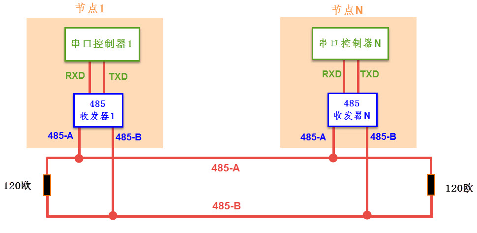
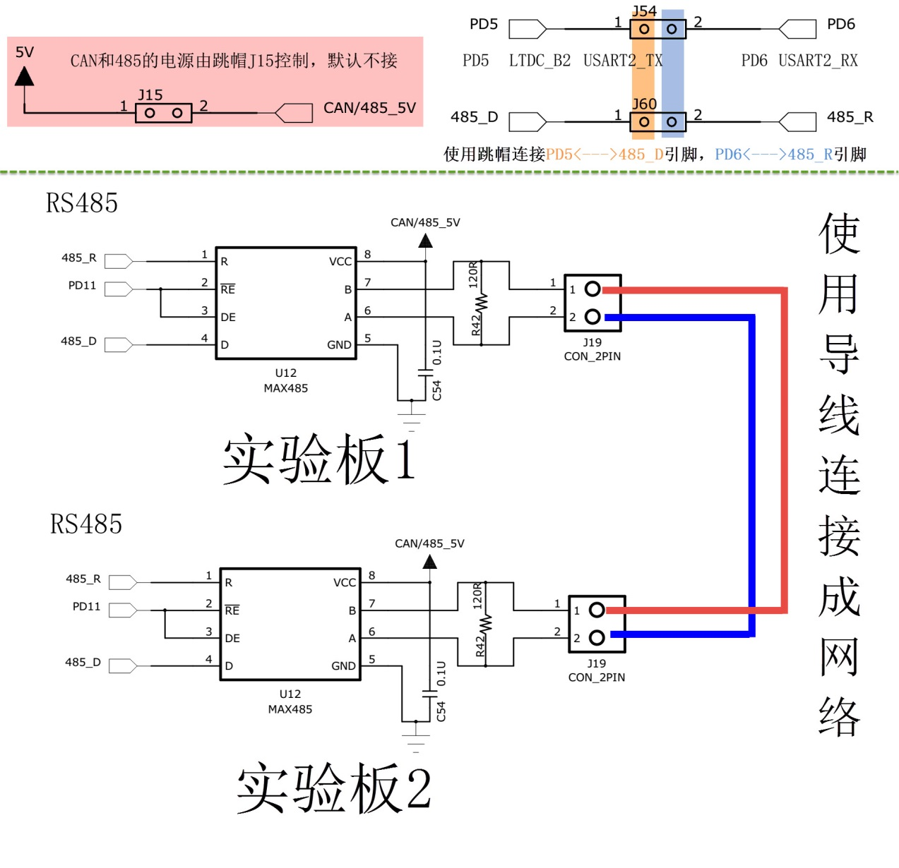

RS-485通讯实验
--------------

本章参考资料：《STM32H743xx中文参考手册》USART章节。

学习本章时，配合本书前面的《USART—串口通讯》及《CAN—通讯实验》章节进行对比学习，效果更佳。

关于实验板中使用的MAX485收发器资料可查阅《MAX485》规格书了解。

RS-485通讯协议简介
~~~~~~~~~~~~~~~~~~

与CAN类似，RS-485是一种工业控制环境中常用的通讯协议，它具有抗干扰能力强、传输距离远的特点。RS-485通讯协议由RS-232协议改进而来，协议层不变，只是改进了物理层，因而保留了串口通讯协议应用简单的特点。

RS-485的物理层
~~~~~~~~~~~~~~

从《CAN—通讯实验》章节中了解到，差分信号线具有很强的干扰能力，特别适合应用于电磁环境复杂的工业控制环境中，
RS-485协议主要是把RS-232的信号改进成差分信号，从而大大提高了抗干扰特性，它的通讯网络示意图见 图40_0_1_。

图 40‑1 RS-485通讯网络示意图

对比CAN通讯网络，可发现它们的网络结构组成是类似的，每个节点都是由一个通讯控制器和一个收发器组成，在RS-485通讯网络中，节点中的串口控制器使用RX与TX信号线连接到收发器上，而收发器通过差分线连接到网络总线，串口控制器与收发器之间一般使用TTL信号传输，收发器与总线则使用差分信号来传输。发送数据时，串口控制器的TX信号经过收发器转换成差分信号传输到总线上，而接收数据时，收发器把总线上的差分信号转化成TTL信号通过RX引脚传输到串口控制器中。

RS-485通讯网络的最大传输距离可达1200米，总线上可挂载128个通讯节点，而由于RS-485网络只有一对差分信号线，它使用差分信号来表达逻辑，当AB两线间的电压差为-6V~-2V时表示逻辑1，当电压差为+2V~+6V表示逻辑0，在同一时刻只能表达一个信号，所以它的通讯是半双工形式的，它与RS-232通讯协议的特性对比见图
40‑1。

   表 40‑1 RS-232/422/485 标准对比

======== ================= ======== ================ ========= ==================================================
通讯标准 信号线            通讯方向 电平标准(发送端) 通讯距离  通讯节点数
RS232    单端TXD、RXD、GND 全双工   逻辑1：-15V~-3V  100米以内 只有两个节点

                                    逻辑0：+3V~+15V
RS485    差分线AB          半双工   逻辑1：+2V~+6V   1200米    支持多个节点。支持多个主设备，任意节点间可互相通讯

                                    逻辑0：-6V~-2V
======== ================= ======== ================ ========= ==================================================

RS-485与RS-232的差异只体现在物理层上，它们的协议层是相同的，也是使用串口数据包的形式传输数据。而由于RS-485具有强大的组网功能，人们在基础协议之上还制定了MODBUS协议，被广泛应用在工业控制网络中。此处说的基础协议是指前面串口章节中讲解的，仅封装了基本数据包格式的协议(基于数据位)，而MODBUS协议是使用基本数据包组合成通讯帧格式的高层应用协议(基于数据包或字节)。感兴趣的读者可查找MODBUS协议的相关资料了解。

由于RS-485与RS-232的协议层没有区别，进行通讯时，我们同样是使用STM32的USART外设作为通讯节点中的串口控制器，再外接一个RS-485收发器芯片把USART外设的TTL电平信号转化成RS-485的差分信号即可。

RS-485—双机通讯实验
~~~~~~~~~~~~~~~~~~~

本小节演示如何使用STM32的USART控制器与MAX485收发器，在两个设备之间使用RS-485协议进行通讯，本实验中使用了两个实验板，无法像CAN实验那样使用回环测试(把STM32
USART外设的TXD引脚使用杜邦线连接到RXD引脚可进行自收发测试，不过这样的通讯不经过RS-485收发器，跟普通TTL串口实验没有区别)，本教程主要以“USART—485通讯”工程进行讲解。

硬件设计
^^^^^^^^

图 40‑2 双CAN通讯实验硬件连接图

图40_0_2_ 中的是两个实验板的硬件连接。在单个实验板中，
作为串口控制器的STM32从USART外设引出TX和RX两个引脚与RS-485收发器MAX485相连，
收发器使用它的A和B引脚连接到RS-485总线网络中。为了方便使用，
我们每个实验板引出的A和B之间都连接了1个120欧的电阻作为RS-485总线的端电阻，
所以要注意如果您要把实验板作为一个普通节点连接到现有的RS-485总线时，是不应添加该电阻的！

由于485只能以半双工的形式工作，所以需要切换状态，MAX485芯片中有“RE”和“DE”两个引脚，用于控制485芯片的收发工作状态的，当RE引脚为低电平时，485芯片处于接收状态，当DE引脚为高电平时芯片处于发送状态。实验板中使用了STM32的PC0直接连接到这两个引脚上，所以通过控制PC0的输出电平即可控制485的收发状态，在本开发板中，PC0引脚与摄像头使用的引脚共用了，所以使用485时不要同时驱动摄像头。

还要注意的是，为防止干扰，平时我们默认是不给485收发器供电的，使用485的时候一定要把485接线端子旁边的“C/4-5V”排针使用跳线帽与“5V”排针连接起来进行供电；而又由于实验板的RS-232与RS-485通讯实验都使用STM32的同一个USART外设及收发引脚，实验时注意必须要把STM32的“PA2引脚”与MAX485的“485_D”及“PA3”与“485_R”使用跳线帽连接起来(这些信号都在485接线端子旁边的排针上)。

要实现通讯，我们还要使用导线把实验板引出的A和B两条总线连接起来，才能构成完整的网络。实验板之间A与A连接，B与B连接即可。

软件设计
^^^^^^^^

为了使工程更加有条理，我们把RS485控制相关的代码独立分开存储，方便以后移植。在“串口实验”之上新建“bsp_485.c”及“bsp_485.h”文件，这些文件也可根据您的喜好命名，它们不属于STM32HAL库的内容，是由我们自己根据应用需要编写的。这个实验的底层STM32驱动与串口控制区别不大，上层实验功能上与CAN实验类似。

编程要点
''''''''

(1) 初始化485通讯使用的USART外设及相关引脚；

(2) 编写控制MAX485芯片进行收发数据的函数；

(3) 编写测试程序，收发数据。

代码分析
''''''''

485硬件相关宏定义
...................

我们把485硬件相关的配置都以宏的形式定义到 “bsp_485.h”文件中，见 代码清单40_0_1_。

代码清单 40‑1 485硬件配置相关的宏(bsp_485.h文件)

.. code-block:: c
   :name: 代码清单40_0_1

    #define _485_USART                             USART2
    #define _485_USART_CLK_ENABLE()                __USART2_CLK_ENABLE();
    #define _485_USART_BAUDRATE                    115200

    #define RCC_PERIPHCLK_485_USART                RCC_PERIPHCLK_USART2
    #define RCC_485_USARTCLKSOURCE_SYSCLK          RCC_USART2CLKSOURCE_SYSCLK

    #define _485_USART_RX_GPIO_PORT                GPIOD
    #define _485_USART_RX_GPIO_CLK_ENABLE()        __GPIOD_CLK_ENABLE()
    #define _485_USART_RX_PIN                      GPIO_PIN_6
    #define _485_USART_RX_AF                       GPIO_AF7_USART2

    #define _485_USART_TX_GPIO_PORT                GPIOD
    #define _485_USART_TX_GPIO_CLK_ENABLE()        __GPIOD_CLK_ENABLE()
    #define _485_USART_TX_PIN                      GPIO_PIN_5
    #define _485_USART_TX_AF                       GPIO_AF7_USART2

    #define _485_RE_GPIO_PORT            		GPIOD
    #define _485_RE_GPIO_CLK_ENABLE()          __GPIOD_CLK_ENABLE()
    #define _485_RE_PIN                        GPIO_PIN_11

    #define _485_INT_IRQ                       USART2_IRQn
    #define bsp_485_IRQHandler                 USART2_IRQHandler

以上代码根据硬件连接，把与485通讯使用的USART外设号
、引脚号、引脚源以及复用功能映射都以宏封装起来，并且定义了接收中断的中断向量和中断服务函数，我们通过中断来获知接收数据。

初始化485的USART配置
.........................

利用上面的宏，编写485的USART初始化函数，见 代码清单40_0_2_。

代码清单 40‑2 RS485的初始化函数(bsp_485.c文件)

.. code-block:: c
   :name: 代码清单40_0_2

    /*
    * 函数名：_485_Config
    * 描述  ：USART GPIO 配置,工作模式配置
    * 输入  ：无
    * 输出  : 无
    * 调用  ：外部调用
    */
    void _485_Config(void)
    {
        GPIO_InitTypeDef GPIO_InitStruct;

        RCC_PeriphCLKInitTypeDef RCC_PeriphClkInit;

        _485_USART_RX_GPIO_CLK_ENABLE();
        _485_USART_TX_GPIO_CLK_ENABLE();
        _485_RE_GPIO_CLK_ENABLE();

        /* 配置485串口时钟源*/
        RCC_PeriphClkInit.PeriphClockSelection = RCC_PERIPHCLK_485_USART;
        RCC_PeriphClkInit.Usart2ClockSelection = RCC_485_USARTCLKSOURCE_SYSCLK;
        HAL_RCCEx_PeriphCLKConfig(&RCC_PeriphClkInit);

        /* 使能 UART 时钟 */
        _485_USART_CLK_ENABLE();

        /**USART2 GPIO Configuration
        PD5    ------> USART2_TX
        PD6    ------> USART2_RX
        */
        /* 配置Tx引脚为复用功能  */
        GPIO_InitStruct.Pin = _485_USART_TX_PIN;
        GPIO_InitStruct.Mode = GPIO_MODE_AF_PP;
        GPIO_InitStruct.Pull = GPIO_PULLUP;
        GPIO_InitStruct.Speed = GPIO_SPEED_HIGH;
        GPIO_InitStruct.Alternate = _485_USART_TX_AF;
        HAL_GPIO_Init(_485_USART_TX_GPIO_PORT, &GPIO_InitStruct);

        /* 配置Rx引脚为复用功能 */
        GPIO_InitStruct.Pin = _485_USART_RX_PIN;
        GPIO_InitStruct.Alternate = _485_USART_RX_AF;
        HAL_GPIO_Init(_485_USART_RX_GPIO_PORT, &GPIO_InitStruct);

        /* 485收发控制管脚 */
        GPIO_InitStruct.Pin = _485_RE_PIN;
        GPIO_InitStruct.Mode = GPIO_MODE_OUTPUT_PP;
        GPIO_InitStruct.Pull = GPIO_PULLUP;
        GPIO_InitStruct.Speed = GPIO_SPEED_HIGH;
        HAL_GPIO_Init(_485_RE_GPIO_PORT, &GPIO_InitStruct);

        /* 配置串485_USART 模式 */
        Uart2_Handle.Instance = _485_USART;
        Uart2_Handle.Init.BaudRate = _485_USART_BAUDRATE;
        Uart2_Handle.Init.WordLength = UART_WORDLENGTH_8B;
        Uart2_Handle.Init.StopBits = UART_STOPBITS_1;
        Uart2_Handle.Init.Parity = UART_PARITY_NONE;
        Uart2_Handle.Init.Mode = UART_MODE_TX_RX;
        Uart2_Handle.Init.HwFlowCtl = UART_HWCONTROL_NONE;
        Uart2_Handle.Init.OverSampling = UART_OVERSAMPLING_16;
        Uart2_Handle.Init.OneBitSampling = UART_ONEBIT_SAMPLING_DISABLED;
        Uart2_Handle.AdvancedInit.AdvFeatureInit = UART_ADVFEATURE_NO_INIT;
        HAL_UART_Init(&Uart2_Handle);

        /*串口1中断初始化 */
        NVIC_Configuration();
        /*配置串口接收中断 */
        __HAL_UART_ENABLE_IT(&Uart2_Handle,UART_IT_RXNE);
        //默认进入接收模式
        HAL_GPIO_WritePin(_485_RE_GPIO_PORT,_485_RE_PIN,GPIO_PIN_RESET);
    }

与所有使用到GPIO的外设一样，都要先把使用到的GPIO引脚模式初始化，配置好复用功能，其中用于控制MAX485芯片的收发状态的引脚被初始化成普通推挽输出模式，以便手动控制它的电平输出，切换状态。485使用到的USART也需要配置好波特率、有效字长、停止位及校验位等基本参数，在通讯中，两个485节点的串口参数应一致，否则会导致通讯解包错误。在实验中还使能了串口的接收中断功能，当检测到新的数据时，进入中断服务函数中获取数据。

使用中断接收数据
...................

接下来我们编写在USART中断服务函数中接收数据的相关过程，见 代码清单40_0_3_
，其中的bsp_RS485_IRQHandler函数直接被bsp_stm32f4xx_it.c文件的USART中断服务函数调用，不在此列出。

代码清单 40‑3 中断接收数据的过程(bsp_485.c文件)

.. code-block:: c
   :name: 代码清单40_0_3

    //中断缓存串口数据
    #define UART_BUFF_SIZE      1024
    volatile    uint16_t uart_p = 1;
    uint8_t     uart_buff[UART_BUFF_SIZE];

    void bsp_485_IRQHandler(void)
    {
        if (uart_p<UART_BUFF_SIZE) {
            if (__HAL_UART_GET_IT( &Uart2_Handle, UART_IT_RXNE ) != RESET) {
                HAL_UART_Receive(&Uart2_Handle, (uint8_t *)(&uart_buff[uart_p]),1 , 1000)
                uart_p++;
            }
        } else {
            clean_rebuff();
        }
        HAL_UART_IRQHandler(&Uart2_Handle);
    }

    //获取接收到的数据和长度
    char *get_rebuff(uint16_t *len)
    {
        *len = uart_p;
        return (char *)&uart_buff;
    }

    //清空缓冲区
    void clean_rebuff(void)
    {

        uint16_t i=UART_BUFF_SIZE+1;
        uart_p = 0;
        while (i)
            uart_buff[--i]=0;
    }

这个数据接收过程主要思路是使用了接收缓冲区，当USART有新的数据引起中断时，调用库函数USART_ReceiveData把新数据读取到缓冲区数组uart_buff中，其中get_rebuff函数可以用于获缓冲区中有效数据的长度，而clean_rebuff函数可以用于对缓冲区整体清0，这些函数配合使用，实现了简单的串口接收缓冲机制。这部分串口数据接收的过程跟485收发器无关，是串口协议通用的。

切换收发状态
...............

在前面我们了解到RS-485是半双工通讯协议，发送数据和接收数据需要分时进行，所以需要经常切换收发状态。
而MAX485收发器根据其“RE”和“DE”引脚的外部电平信号切换收发状态，所以控制与其相连的STM32普通IO电平即可控制收尾，
为简便起见，我们把收发状态切换定义成了宏，见 代码清单40_0_4_。

代码清单 40‑4 切换收发状态(bsp_485.h文件)

.. code-block:: c
   :name: 代码清单40_0_4

    // 不精确的延时
    static void _485_delay(__IO uint32_t nCount)
    {
        for (; nCount != 0; nCount--);
    }
    /*控制收发引脚*/
    //进入接收模式,必须要有延时等待485处理完数据
    #define _485_RX_EN()      _485_delay(1000);\
    HAL_GPIO_WritePin(_485_RE_GPIO_PORT,_485_RE_PIN,GPIO_PIN_RESET);
    _485_delay(1000);
    //进入发送模式,必须要有延时等待485处理完数据
    #define _485_TX_EN()      _485_delay(1000);\
    HAL_GPIO_WritePin(_485_RE_GPIO_PORT,_485_RE_PIN,GPIO_PIN_SET);
    _485_delay(1000);

这两个宏中，主要是在控制电平输出前后加了一小段时间延时，这是为了给MAX485芯片预留响应时间，因为STM32的引脚状态电平变换后，MAX485芯片可能存在响应延时。例如，当STM32控制自己的引脚电平输出高电平(控制成发送状态)，然后立即通过TX信号线发送数据给MAX485芯片，而MAX485芯片由于状态不能马上切换，会导致丢失了部分STM32传送过来的数据，造成错误。

发送数据
.............

STM32使用485发送数据的过程也与普通的USART发送数据过程差不多，我们定义了一个RS485_SendByte
函数来发送一个字节的数据内容，见 代码清单40_0_5_。

代码清单 40‑5 发送数据(bsp_485.c文件)

.. code-block:: c
   :name: 代码清单40_0_5

    /***************** 发送一个字符  **********************/
    //使用单字节数据发送前要使能发送引脚，发送后要使能接收引脚。
    void _485_SendByte(  uint8_t ch )
    {
        /* 发送一个字节数据到USART1 */
        HAL_UART_Transmit(&Uart2_Handle, (uint8_t *)&ch, 1, 0xFFFF);
    }

上述代码中就是直接调用了STM32库函数HAL_UART_Transmit把要发送的数据写入到USART的数据寄存器，然后检查标志位等待发送完成。

在调用_485_SendByte
函数前，需要先使用前面提到的切换收发状态宏，把MAX485切换到发送模式，STM32发出的数据才能正常传输到485网络总线上，当发送完数据的时候，应重新把MAX485切换回接收模式，以便获取网络总线上的数据。

main函数
^^^^^^^^^^^

最后我们来阅读main函数，了解整个通讯过程，见 代码清单40_0_6_。
这个main函数的整体设计思路是，
实验板检测自身的按键状态，若按键被按下，则通过485发送256个测试数据到网络总线上，
若自身接收到总线上的256个数据，则把这些数据作为调试信息打印到电脑端。所以，如果把这样的程序分别应用到485总线上的两个通讯节点时，
就可以通过按键控制互相发送数据了。

代码清单 40‑6 main函数

.. code-block:: c
   :name: 代码清单40_0_6

    int main(void)
    {
        char *pbuf;
        uint16_t len;

        /* 配置系统时钟为180 MHz */
        SystemClock_Config();

        /* 初始化RGB彩灯 */
        LED_GPIO_Config();

        /* 初始化USART1 配置模式为 115200 8-N-1 */
        UARTx_Config();
        /*初始化485使用的串口，使用中断模式接收*/
        _485_Config();

        Key_GPIO_Config();

        printf("\r\n 欢迎使用野火  STM32 H743 开发板。\r\n");
        printf("\r\n 野火H743 485通讯实验例程\r\n");

        printf("\r\n 实验步骤：\r\n");

        printf("\r\n 1.使用导线连接好两个485通讯设备\r\n");
        printf("\r\n 2.使用跳线帽连接好:5v --- C/4-5V,485-D --- PD5,485-R ---PD6 \r\n");
        printf("\r\n 3.若使用两个野火开发板进行实验，给两个开发板都下载本程序即可。\r\n");
        printf("\r\n 4.准备好后，按下其中一个开发板的KEY1键，会使用485向外发送0-255的数字 \r\n");
        printf("\r\n 5.若开发板的485接收到256个字节数据，会把数据以16进制形式打印出来。 \r\n");

        while (1) {
            /*按一次按键发送一次数据*/
            if (  Key_Scan(KEY1_GPIO_PORT,KEY1_PIN) == KEY_ON) {
                uint16_t i;

                LED_BLUE;

                _485_TX_EN();

                for (i=0; i<=0xff; i++) {
                    _485_SendByte(i);  //发送数据
                }

                /*加短暂延时，保证485发送数据完毕*/
                Delay(0xFFF);
                _485_RX_EN();

                LED_GREEN;

                printf("\r\n发送数据成功！\r\n"); //使用调试串口打印调试信息到终端

            } else {
                LED_BLUE;
                pbuf = get_rebuff(&len);
                if (len>=256) {
                    LED_GREEN;
                    printf("\r\n接收到长度为%d的数据\r\n",len);
                    _485_DEBUG_ARRAY((uint8_t*)pbuf,len);
                    clean_rebuff();
                }
            }
        }
    }

在main函数中，首先初始化了LED、按键以及调试使用的串口，再调用前面分析的RS485_Config函数初始化了RS-485通讯使用的串口工作模式。

初始化后485就进入了接收模式，当接收到数据的时候会进入中断并把数据存储到接收缓冲数组中，我们在main函数的while循环中(else部分)调用get_rebuff来查看该缓冲区的状态，若接收到256个数据就把这些数据通过调试串口打印到电脑端，然后清空缓冲区。

在while循环中，还检测了按键的状态，若按键被按下，就把MAX485芯片切换到发送状态并调用RS485_SendByte函数发送测试数据0x00-0xFF，发送完毕后切换回接收状态以检测总线的数据。
