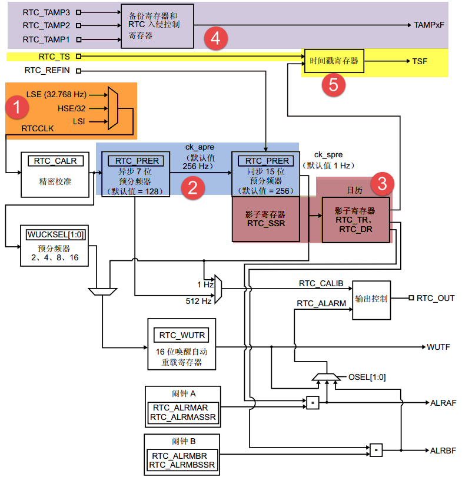
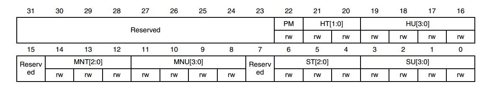
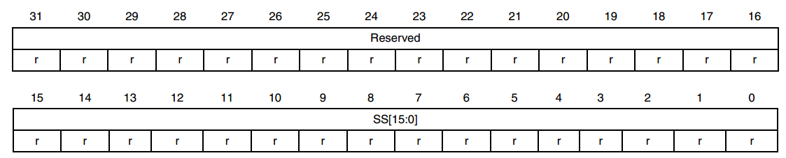
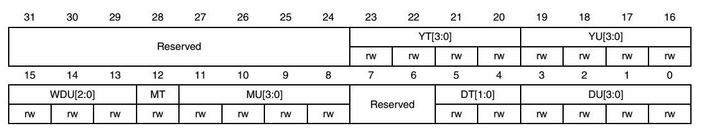
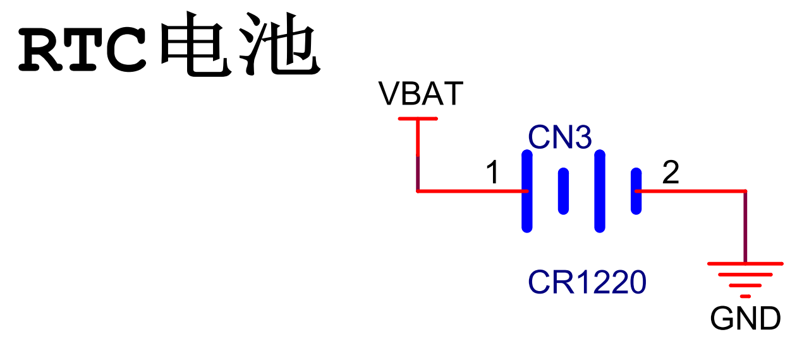
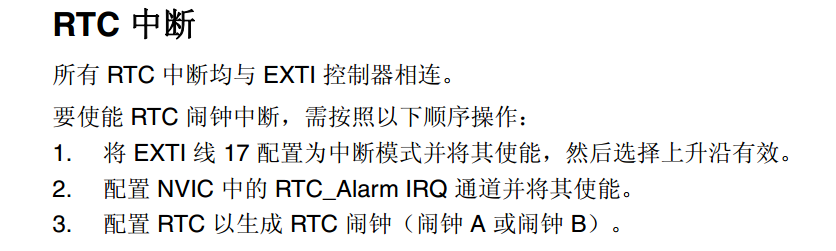
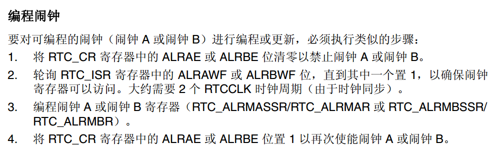

RTC—实时时钟
------------

RTC简介
~~~~~~~

RTC—real time
clock，实时时钟，主要包含日历、闹钟和自动唤醒这三部分的功能，其中的日历功能我们使用的最多。日历包含两个32bit的时间寄存器，可直接输出时分秒，星期、月、日、年。比起F103系列的RTC只能输出秒中断，剩下的其他时间需要软件来实现，H743的RTC可谓是脱胎换骨，让我们在软件编程时大大降低了难度。RTC功能框图分析

RTC功能框图解析
~~~~~~~~~~~~~~~

时钟源
''''''

RTC 时钟源 —RTCCLK
可以从LSE、LSI和HSE_RTC这三者中得到。其中使用最多的是LSE，LSE由一个外部的32.768KHZ（6PF负载）的晶振提供，精度高，稳定，RTC首选。LSI是芯片内部的30KHZ晶体，精度较低，会有温漂，一般不建议使用。HSE_RTC由HSE分频得到，最高是4M，使用的也较少。

预分频器
''''''''

预分频器PRER由7位的异步预分频器APRE和15位的同步预分频器SPRE组成。异步预分频器时钟CK_APRE用于为二进制
RTC_SSR
亚秒递减计数器提供时钟，同步预分频器时钟CK_SPRE用于更新日历。
异步预分频器时钟f\ :sub:`CK_APRE`\ =f\ :sub:`RTC_CLK`/(PREDIV_A+1)，
同步预分频器时钟f:sub:`CK_SPRE`\ =f\ :sub:`RTC_CLK`/(PREDIV_S+1)，)。
使用两个预分频器时，推荐将异步预分频器配置为较高的值，以最大程度降低功耗。
一般我们会使用LSE生成1HZ的同步预分频器时钟。通常的情况下，
我们会选择LSE作为RTC的时钟源，即f:sub:`RTCCLK`\ =f\ :sub:`LSE`\ =32.768KHZ。
然后经过预分频器PRER分频生成1HZ的时钟用于更新日历。使用两个预分频器分频的时候，
为了最大程度的降低功耗，我们一般把同步预分频器设置成较大的值，为了生成1HZ的同步预分频器时钟CK_SPRE，
最常用的配置是PREDIV_A=127，PREDIV_S=255。
计算公式为：f\ :sub:`CK_SPRE`\ =f\ :sub:`RTCCLK`/{（PREDIV_A+1）*（PREDIV_S+1）}=
32.768/{（127+1）*（255+1）}=1HZ。

实时时钟和日历
''''''''''''''

我们知道，实时时钟一般是这样表示的：时/分/秒/亚秒，其中时分秒可直接从RTC
时间寄存器 (RTC_TR)中读取，有关时间寄存器的说明具体见 图39_1_ 和表 39‑1
程序组件所属的区域。

图 39_1 RTC 时间寄存器（RTC_TR）

表 39‑1时间寄存器位功能说明

+----------+--------------------------------+
| 位名称   | 位说明                         |
+==========+================================+
| PM       | AM/PM符号，0:AM/24小时制，1:PM |
+----------+--------------------------------+
| HT[1:0]  | 小时的十位                     |
+----------+--------------------------------+
| HU[3:0]  | 小时的个位                     |
+----------+--------------------------------+
| MNT[2:0] | 分钟的十位                     |
+----------+--------------------------------+
| MNU[3:0] | 分钟的个位                     |
+----------+--------------------------------+
| ST[2:0]  | 秒的十位                       |
+----------+--------------------------------+
| SU[3:0]  | 秒的个位                       |
+----------+--------------------------------+

亚秒由RTC 亚秒寄存器 (RTC_SSR)的值计算得到，公式为：亚秒值 = ( PREDIV_S
– SS[15:0] ) / ( PREDIV_S + 1 )
，SS[15:0]是同步预分频器计数器的值，PREDIV_S是同步预分频器的值。

图 39_2 RTC亚秒寄存器（RTC_SSR）

日期包含的年月日可直接从RTC 日期寄存器 (RTC_DR)中读取。

图 39_3 RTC日期寄存器（RTC_DR）

表 39‑2 RTC日期寄存器位功能说明

+----------+------------------------------------------------------+
| 位名称   | 位说明                                               |
+==========+======================================================+
| YT[1:0]  | 年份的十位                                           |
+----------+------------------------------------------------------+
| YU[3:0]  | 年份的个位                                           |
+----------+------------------------------------------------------+
| WDU[2:0] | 星期几的个位，000：禁止，001：星期一，…，111：星期日 |
+----------+------------------------------------------------------+
| MT       | 月份的十位                                           |
+----------+------------------------------------------------------+
| MU       | 月份的个位                                           |
+----------+------------------------------------------------------+
| DT[1:0]  | 日期的十位                                           |
+----------+------------------------------------------------------+
| DU[3:0]  | 日期的个位                                           |
+----------+------------------------------------------------------+

当应用程序读取日历寄存器时，默认是读取影子寄存器的内容，每隔两个 RTCCLK
周期，便将当前日历值复制到影子寄存器。我们也可以通过将 RTC_CR
寄存器的BYPSHAD 控制位置 1
来直接访问日历寄存器，这样可避免等待同步的持续时间。

RTC_CLK经过预分频器后，有一个512HZ的CK_APRE和1个1HZ的CK_SPRE，这两个时钟可以成为校准的时钟输出RTC_CALIB，RTC_CALIB最终要输出则需映射到RTC_AF1引脚，即PC13输出，用来对外部提供时钟。

闹钟
''''

RTC有两个闹钟，闹钟A和闹钟B,，当RTC运行的时间跟预设的闹钟时间相同的时候，相应的标志位ALRAF（在RTC_ISR寄存器中）和ALRBF会置1。利用这个闹钟我们可以做一些备忘提醒功能。

如果使能了闹钟输出（由RTC_CR的OSEL[0:1]位控制），则ALRAF和ALRBF会连接到闹钟输出引脚RTC_ALARM，RTC_ALARM最终连接到RTC的外部引脚RTC_AF1（即PC13），输出的极性由RTC_CR
寄存器的 POL 位配置，可以是高电平或者低电平。

时间戳
''''''

时间戳即时间点的意思，就是某一个时刻的时间。时间戳复用功能 (RTC_TS)
可映射到 RTC_AF1 或
RTC_AF2，当发生外部的入侵事件时，即发生时间戳事件时， RTC_ISR
寄存器中的时间戳标志位 (TSF) 将置 1，日历会保存到时间戳寄存器（
RTC_TSSSR、 RTC_TSTR 和
RTC_TSDR）中。时间戳往往用来记录危及时刻的时间，以供事后排查问题时查询。

入侵检测
''''''''

RTC自带两个入侵检测引脚RTC_AF1（PC13）和RTC_AF2（PI8，PI8只有在176pin引脚的型号中才有），这两个输入既可配置为边沿检测，也可配置为带过滤的电平检测。当发生入侵检测时，备份寄存器将被复位。备份寄存器
(RTC_BKPxR) 包括20 个 32 位寄存器，用于存储 80
字节的用户应用数据。这些寄存器在备份域中实现，可在 VDD 电源关闭时通过
VBAT
保持上电状态。备份寄存器不会在系统复位或电源复位时复位，也不会在器件从待机模式唤醒时复位。

RTC初始化结构体讲解
~~~~~~~~~~~~~~~~~~~

HAL库函数对每个外设都建立了一个初始化结构体，比如RTC_InitTypeDef，结构体成员用于设置外设工作参数，并由外设初始化配置函数，比如RTC_Init()调用，这些配置好的参数将会设置外设相应的寄存器，达到配置外设工作环境的目的。

初始化结构体和初始化库函数配合使用是HAL库精髓所在，理解了初始化结构体每个成员意义基本上就可以对该外设运用自如。初始化结构体定义在stm32h7xx_hal_rtc.h头文件中，初始化库函数定义在stm32h7xx_hal_rtc.c文件中，编程时我们可以结合这两个文件内注释使用。

RTC初始化结构体用来设置RTC小时的格式和RTC_CLK的分频系数。

.. code-block:: c
   :name: RTC初始化结构体

   typedef struct {
      uint32_t HourFormat;      /* 配置RTC小时格式 */

      uint32_t AsynchPrediv;    /* 配置RTC_CLK的异步分频因子（0x00~0x7F ) */

      uint32_t SynchPrediv;     /* 配置RTC_CLK的同步分频因子（0x00~0x7FFF ) */

      uint32_t OutPut;          /* 指定哪一路信号作为RTC的输出 */

      uint32_t OutPutPolarity;  /* 配置RTC输出信号的极性 */

      uint32_t OutPutType;      /* 配置RTC输出引脚的模式，开漏或者推挽*/
   } RTC_InitTypeDef;

1) HourFormat：小时格式设置，有RTC_HOURFORMAT_24和RTC_HOURFORMAT_12两种格式，
   一般我们选择使用24小时制，具体由RTC_CR寄存器的FMT位配置。

2) AsynchPrediv：RTC_CLK异步分频因子设置，7位有效，具体由RTC
   预分频器寄存器RTC_PRER的PREDIV_A[6:0]位配置。

3) SynchPrediv：RTC_CLK同步分频因子设置，15位有效，具体由RTC
   预分频器寄存器RTC_PRER的PREDIV_S[14:0]位配置。

4) OutPut：RTCEx输出通道设置，可以是RTC_OUTPUT_DISABLE禁止输出、
   RTC_OUTPUT_ALARMA闹钟A输出、RTC_OUTPUT_ALARMB闹钟B输出、RTC_OUTPUT_WAKEUP唤醒输出。

5) OutPutPolarity：RTC输出信号极性设置，
   可以设置为RTC_OUTPUT_POLARITY_HIGH和RTC_OUTPUT_POLARITYLOW。

6) OutPutType：RTC输出引脚的模式设置，可以是开漏或者推挽。

RTC时间结构体讲解
~~~~~~~~~~~~~~~~~

RTC时间初始化结构体用来设置初始时间，配置的是RTC时间寄存器RTC_TR。

.. code-block:: c
   :name: RTC时间结构体

   typedef struct {
      uint8_t Hours;    /* 小时设置 */
      uint8_t Minutes;  /* 分钟设置 */
      uint8_t Seconds;  /* 秒设置 */
      uint32_t SubSeconds;  	/* 亚秒设置 */
      uint32_t  SecondFraction;   /* 亚秒同步预分频系数 */
      uint8_t   TimeFormat; 	/* AM/PM 符号设置 */
      uint32_t  DayLightSaving;  /* 夏令时日历时间设置 */
      uint32_t  StoreOperation;  /* AM/PM 符号设置 */
   } RTC_TimeTypeDef;

1) Hours：小时设置，12小时制式时，取值范围为0~11，24小时制式时，取值范围为0~23。

2) Minutes：分钟设置，取值范围为0~59。

3) Seconds：秒钟设置，取值范围为0~59。

4) SubSeconds：亚秒设置，取值范围0~1(s)，1 Sec /(SecondFraction +1)。

5) SecondFraction：亚秒预分频系数，用于获取更加精确的 RTC 时间。

6) TimeFormat:
   AM/PM设置，可取值RTC_HOURFORMAT12_AM和RTC_HOURFORMAT12_PM，RTC_HOURFORMAT12_AM时则是24小时制，RTC_HOURFORMAT12_PM则是12小时制。

7) DayLightSaving：夏令时日历时间设置，可以增加一个小时，或者减一个小时，或者保持不变。

8) StoreOperation：用户对RTC_CR寄存器的BKP位执行写操作以记录是否已对夏令时进行更改。

RTC日期结构体讲解
~~~~~~~~~~~~~~~~~

RTC日期初始化结构体用来设置初始日期，配置的是RTC日期寄存器RTC_DR。

.. code-block:: c
   :name: RTC 日期结构体

   typedef struct {
      uint8_t WeekDay; /* 星期几设置 */

      uint8_t Month;   /* 月份设置 */

      uint8_t Date;    /* 日期设置 */

      uint8_t Year;    /* 年份设置 */
   } RTC_DateTypeDef;

1) WeekDay：星期几设置，取值范围为1~7，对应星期一~星期日。

2) Month：月份设置，取值范围为1~12。

3) Date：日期设置，取值范围为1~31。

4) Year：年份设置，取值范围为0~99。

RTC闹钟结构体讲解
~~~~~~~~~~~~~~~~~

RTC闹钟结构体主要用来设置闹钟时间，设置的格式为[星期/日期]-[时]-[分]-[秒]，共四个字段，每个字段都可以设置为有效或者无效，即可MASK。如果MASK掉[星期/日期]字段，则每天闹钟都会响。

.. code-block:: c
   :name: RTC闹钟结构体

   typedef struct {
      RTC_TimeTypeDef AlarmTime;     /* 设定RTC时间寄存器的值：时/分/秒 */
      uint32_t AlarmMask;            /* RTC 闹钟 掩码字段选择 */
      uint32_t AlarmSubSecondMask;   /* RTC 闹钟 掩码字段选择 */

      uint32_t AlarmDateWeekDaySel;  /*闹钟的日期/星期选择 */

      uint8_t AlarmDateWeekDay;      /* 指定闹钟的日期/星期
                                          * 如果日期有效，则取值范围为1~31
                                          * 如果星期有效，则取值为1~7
                                          */
      uint32_t Alarm;                /* RTC 闹钟选择 */
   } RTC_AlarmTypeDef;

1. AlarmTime：闹钟时间设置，配置的是RTC时间初始化结构体，主要配置小时的制式，有12小时或者是24小时，配套具体的时、分、秒。

2. AlarmMask：闹钟掩码字段选择，即选择闹钟时间哪些字段无效，取值
   可为：RTC_ALARMMASK_NONE
   (全部有效)、RTC_ALARMMASK_DATEWEEKDAY（日期或者星期无效）、RTC_ALARMMASK_HOURS（小时无效）、RTC_ALARMMASK_MINUTES（分钟无效）、RTC_ALARMMASK_SECONDS（秒钟无效）、RTC_ALARMMASK_ALL（全部无效）。比如我们选择RTC_ALARMMASK_DATEWEEKDAY，那么就是当RTC的时间的小时等于闹钟时间小时字段时，每天的这个小时都会产生闹钟中断。

3. AlarmSubSecondMask：闹钟亚秒掩码字段选择，即选择闹钟亚秒寄存器RTC_TSSSR哪些字段无效，取值
   可为15段。

4. AlarmDateWeekDaySel：闹钟日期或者星期选择，
   可选择RTC_ALARMDATEWEEKDAYSEL_WEEKDAY或者RTC_ALARMDATEWEEKDAYSEL_DATE。
   要想这个配置有效，则AlarmMask不能配置为RTC_ALARMMASK_DATEWEEKDAY，否则会被MASK掉。

5. AlarmDateWeekDay：具体的日期或者星期几，
   当AlarmDateWeekDaySel设置成RTC_ALARMDATEWEEKDAYSEL_WEEKDAY时，
   取值为1~7，对应星期一~星期日，当设置成RTC_ALARMDATEWEEKDAYSEL_DATE时，取值为1~31。

6. Alarm：RTC闹钟选择，即选择闹钟A或者闹钟B。

RTC—日历实验
~~~~~~~~~~~~

利用RTC的日历功能制作一个日历，显示格式为：年-月-日-星期，时-分-秒。

硬件设计
''''''''''''

该实验用到了片内外设RTC，为了确保在VDD断电的情况下时间可以保存且继续运行，
VBAT引脚外接了一个CR1220电池座，用来放CR1220电池给RTC供电，电路图具体见 图39_4_。

图 39_4 RTC 外接CR1220电池座子

软件设计
''''''''''''

编程要点
==============

1) 选择RTC_CLK的时钟源；

2) 配置RTC_CLK的分频系数，包括异步和同步两个；

3) 设置初始时间，包括日期；

4) 获取时间和日期，并显示；

代码分析
==============

这里只讲解核心的部分代码，有些变量的设置，头文件的包含等并没有涉及到，完整的代码请参考本章配套的工程。我们创建了两个文件：bsp_rtc.c和bsp_rtc.h文件用来存RTC驱动程序及相关宏定义，中断服务函数则放在stm32h7xx_it.h文件中。

宏定义
.............

.. code-block:: c
   :name: 代码清单 39‑1 宏定义

   // 时钟源宏定义
   #define RTC_CLOCK_SOURCE_LSE
   //#define RTC_CLOCK_SOURCE_LSI

   // 异步分频因子
   #define ASYHCHPREDIV         0X7F
   // 同步分频因子
   #define SYHCHPREDIV          0XFF

   // 时间宏定义
   #define RTC_H12_AMorPM    	RTC_HOURFORMAT12_AM
   #define HOURS                1          // 0~23
   #define MINUTES              1          // 0~59
   #define SECONDS              1          // 0~59

   // 日期宏定义
   #define WEEKDAY              1         // 1~7
   #define DATE                 1         // 1~31
   #define MONTH                1         // 1~12
   #define YEAR                 1         // 0~99

   // 时间格式宏定义
   #define RTC_Format_BINorBCD  RTC_FORMAT_BIN

   // 备份域寄存器宏定义
   #define RTC_BKP_DRX          RTC_BKP_DR0
   // 写入到备份寄存器的数据宏定义
   #define RTC_BKP_DATA         0X32F2

为了方便程序移植，我们把移植时需要修改的代码部分都通过宏定义来实现。具体的配合注释看代码即可。

RTC时钟配置函数
................

.. code-block:: c
   :name: 代码清单 39‑2 RTC时钟配置函数

   /**
   * @brief  RTC配置：选择RTC时钟源，设置RTC_CLK的分频系数
   * @param  无
   * @retval 无
   */
   void RTC_CLK_Config(void)
   {
      RCC_OscInitTypeDef        RCC_OscInitStruct;
      RCC_PeriphCLKInitTypeDef  PeriphClkInitStruct;

      // 配置RTC外设
      Rtc_Handle.Instance = RTC;

      /*使能 PWR 时钟*/
      __HAL_RCC_PWR_CLK_ENABLE();
      /* PWR_CR:DBF置1，使能RTC、RTC备份寄存器和备份SRAM的访问 */
      HAL_PWR_EnableBkUpAccess();

   #if defined (RTC_CLOCK_SOURCE_LSI)
      /* 使用LSI作为RTC时钟源会有误差
      * 默认选择LSE作为RTC的时钟源
      */
      /* 初始化LSI */
      RCC_OscInitStruct.OscillatorType =  RCC_OSCILLATORTYPE_LSI | RCC_OSCILLATORTYPE_LSE;
      RCC_OscInitStruct.PLL.PLLState = RCC_PLL_NONE;
      RCC_OscInitStruct.LSIState = RCC_LSI_ON;
      RCC_OscInitStruct.LSEState = RCC_LSE_OFF;
      HAL_RCC_OscConfig(&RCC_OscInitStruct);
      /* 选择LSI做为RTC的时钟源 */
      PeriphClkInitStruct.PeriphClockSelection = RCC_PERIPHCLK_RTC;
      PeriphClkInitStruct.RTCClockSelection = RCC_RTCCLKSOURCE_LSI;
      HAL_RCCEx_PeriphCLKConfig(&PeriphClkInitStruct);

   #elif defined (RTC_CLOCK_SOURCE_LSE)
      /* 初始化LSE */
      RCC_OscInitStruct.OscillatorType =  RCC_OSCILLATORTYPE_LSI | RCC_OSCILLATORTYPE_LSE;
      RCC_OscInitStruct.PLL.PLLState = RCC_PLL_NONE;
      RCC_OscInitStruct.LSEState = RCC_LSE_ON;
      RCC_OscInitStruct.LSIState = RCC_LSI_OFF;
      HAL_RCC_OscConfig(&RCC_OscInitStruct);
      /* 选择LSE做为RTC的时钟源 */
      PeriphClkInitStruct.PeriphClockSelection = RCC_PERIPHCLK_RTC;
      PeriphClkInitStruct.RTCClockSelection = RCC_RTCCLKSOURCE_LSE;
      HAL_RCCEx_PeriphCLKConfig(&PeriphClkInitStruct);

   #endif /* RTC_CLOCK_SOURCE_LSI */

      /* 使能RTC时钟 */
      __HAL_RCC_RTC_ENABLE();

      /* 等待 RTC APB 寄存器同步 */
      HAL_RTC_WaitForSynchro(&Rtc_Handle);

      /*=====================初始化同步/异步预分频器的值======================*/
      /* 驱动日历的时钟ck_spare = LSE/[(255+1)*(127+1)] = 1HZ */

      /* 设置异步预分频器的值 */
      Rtc_Handle.Init.AsynchPrediv = ASYNCHPREDIV;
      /* 设置同步预分频器的值 */
      Rtc_Handle.Init.SynchPrediv  = SYNCHPREDIV;
      Rtc_Handle.Init.HourFormat   = RTC_HOURFORMAT_24;
      /* 用RTC_InitStructure的内容初始化RTC寄存器 */
      if (HAL_RTC_Init(&Rtc_Handle) != HAL_OK) {
         printf("\n\r RTC 时钟初始化失败 \r\n");
      }
   }

RTC时钟配置函数主要实现两个功能，一是选择RTC_CLK的时钟源，根据宏定义来决定使用LSE还是LSI作为RTC_CLK的时钟源，这里为了方便我们选择LSI；二是设置RTC_CLK的预分频系数，包括异步和同步两个，这里设置异步分频因子为ASYNCHPREDIV（127），同步分频因子为ASYNCHPREDIV（255），则产生的最终驱动日历的时钟CK_SPRE=32.768/(127+1)*(255+1)=1HZ，则每秒更新一次。

RTC时间初始化函数
....................

.. code-block:: c
   :name: RTC时间和日期设置函数

   /**
   * @brief  设置时间和日期
   * @param  无
   * @retval 无
   */
   void RTC_TimeAndDate_Set(void)
   {
      RTC_DateTypeDef  RTC_DateStructure;
      RTC_TimeTypeDef  RTC_TimeStructure;
      // 初始化时间
      RTC_TimeStructure.TimeFormat = RTC_H12_AMorPM;
      RTC_TimeStructure.Hours = HOURS;
      RTC_TimeStructure.Minutes = MINUTES;
      RTC_TimeStructure.Seconds = SECONDS;
      HAL_RTC_SetTime(&Rtc_Handle,&RTC_TimeStructure, RTC_FORMAT_BIN);
      // 初始化日期
      RTC_DateStructure.WeekDay = WEEKDAY;
      RTC_DateStructure.Date = DATE;
      RTC_DateStructure.Month = MONTH;
      RTC_DateStructure.Year = YEAR;
      HAL_RTC_SetDate(&Rtc_Handle,&RTC_DateStructure, RTC_FORMAT_BIN);

      HAL_RTCEx_BKUPWrite(&Rtc_Handle,RTC_BKP_DRX, RTC_BKP_DATA);
   }

RTC时间和日期设置函数主要是设置时间和日期这两个结构体，然后调相应的HAL_RTC_SetTime和HAL_RTC_SetDate函数把初始化好的时间写到相应的寄存器，每当写完之后都会在备份寄存器里面写入一个数，以作标记，为的是程序开始运行的时候检测RTC的时间是否已经配置过。

具体的时间、日期、备份寄存器和写入备份寄存器的值都在头文件的宏定义里面，要修改这些值只需修改头文件的宏定义即可。

RTC时间显示函数
.................

.. code-block:: c
   :name: RTC时间显示函数

   /**
   * @brief  显示时间和日期
   * @param  无
   * @retval 无
   */
   void RTC_TimeAndDate_Show(void)
   {
      uint8_t Rtctmp=0;
      char LCDTemp[100];
      RTC_TimeTypeDef RTC_TimeStructure;
      RTC_DateTypeDef RTC_DateStructure;

      while (1) {
         // 获取日历
         HAL_RTC_GetTime(&Rtc_Handle, &RTC_TimeStructure, RTC_FORMAT_BIN);
         HAL_RTC_GetDate(&Rtc_Handle, &RTC_DateStructure, RTC_FORMAT_BIN);

         // 每秒打印一次
         if (Rtctmp != RTC_TimeStructure.Seconds) {

               // 打印日期
         printf("The Date :  Y:20%0.2d - M:%0.2d - D:%0.2d - W:%0.2d\r\n",
                     RTC_DateStructure.Year,
                     RTC_DateStructure.Month,
                     RTC_DateStructure.Date,
                     RTC_DateStructure.WeekDay);

               //液晶显示日期
               //先把要显示的数据用sprintf函数转换为字符串，然后才能用液晶显示函数显示
      sprintf(LCDTemp,"The Date :  Y:20%0.2d - M:%0.2d - D:%0.2d - W:%0.2d",
                     RTC_DateStructure.Year,
                     RTC_DateStructure.Month,
                     RTC_DateStructure.Date,
                     RTC_DateStructure.WeekDay);

               LCD_SetColors(LCD_COLOR_RED,LCD_COLOR_BLACK);
               LCD_DisplayStringLine_EN_CH(8,(uint8_t *)LCDTemp);

               // 打印时间
               printf("The Time :  %0.2d:%0.2d:%0.2d \r\n\r\n",
                     RTC_TimeStructure.Hours,
                     RTC_TimeStructure.Minutes,
                     RTC_TimeStructure.Seconds);

               //液晶显示时间
               sprintf(LCDTemp,"The Time :  %0.2d:%0.2d:%0.2d",
                     RTC_TimeStructure.Hours,
                     RTC_TimeStructure.Minutes,
                     RTC_TimeStructure.Seconds);

               LCD_DisplayStringLine_EN_CH(10,(uint8_t *)LCDTemp);

               (void)RTC->DR;
         }
         Rtctmp = RTC_TimeStructure.Seconds;
      }
   }

RTC时间和日期显示函数中，通过调用HAL_RTC_GetTime()和HAL_RTC_GetDate()这两个库函数，把时间和日期都读取保存到时间和日期结构体中，然后以1s为频率，把时间显示出来。

在使用液晶显示时间的时候，需要先调用标准的C库函数sprintf()把数据转换成字符串，然后才能调用液晶显示函数来显示，因为液晶显示时处理的都是字符串。

主函数
...........

.. code-block:: c
   :name: 代码清单 39‑3 main函数

   /**
   * @brief  主函数
   * @param  无
   * @retval 无
   */
   int main(void)
   {
      /* 系统时钟初始化成400 MHz */
      SystemClock_Config();
      /* LED 端口初始化 */
      LED_GPIO_Config();
      /* 初始化调试串口，一般为串口1 */
      DEBUG_USART_Config();
      printf("\n\r这是一个RTC日历实验 \r\n");
      /* LCD 端口初始化 */
      LCD_Init();
      /* LCD 第一层初始化 */
      LCD_LayerInit(0, LCD_FB_START_ADDRESS,ARGB8888);
      /* LCD 第二层初始化 */
      LCD_LayerInit(1, LCD_FB_START_ADDRESS+(LCD_GetXSize()*LCD_GetYSize()*4),ARGB8888);
      /* 使能LCD，包括开背光 */
      LCD_DisplayOn();

      /* 选择LCD第一层 */
      LCD_SelectLayer(0);

      /* 第一层清屏，显示全黑 */
      LCD_Clear(LCD_COLOR_BLACK);

      /* 选择LCD第二层 */
      LCD_SelectLayer(1);

      /* 第二层清屏，显示全黑 */
      LCD_Clear(LCD_COLOR_TRANSPARENT);

      /* 配置第一和第二层的透明度,最小值为0，最大值为255*/
      LCD_SetTransparency(0, 255);
      LCD_SetTransparency(1, 0);

      /* 选择LCD第一层 */
      LCD_SelectLayer(0);
      /*=========================液晶初始化结束====================*/
      /*
      * 当我们配置过RTC时间之后就往备份寄存器0写入一个数据做标记
      * 所以每次程序重新运行的时候就通过检测备份寄存器0的值来判断
      * RTC 是否已经配置过，如果配置过那就继续运行，如果没有配置过
      * 就初始化RTC，配置RTC的时间。
      */

      /* RTC配置：选择时钟源，设置RTC_CLK的分频系数 */
      RTC_CLK_Config();

      if (HAL_RTCEx_BKUPRead(&Rtc_Handle,RTC_BKP_DRX) != 0X32F3) {
         /* 设置时间和日期 */
         RTC_TimeAndDate_Set();
      } else {
         /* 检查是否电源复位 */
         if (__HAL_RCC_GET_FLAG(RCC_FLAG_PORRST) != RESET) {
               printf("\r\n 发生电源复位....\r\n");
         }
         /* 检查是否外部复位 */
         else if (__HAL_RCC_GET_FLAG(RCC_FLAG_PINRST) != RESET) {
               printf("\r\n 发生外部复位....\r\n");
         }
         printf("\r\n 不需要重新配置RTC....\r\n");
         /* 使能 PWR 时钟 */
         __HAL_RCC_PWR_CLK_ENABLE();
         /* PWR_CR:DBF置1，使能RTC、RTC备份寄存器和备份SRAM的访问 */
         HAL_PWR_EnableBkUpAccess();
         /* 等待 RTC APB 寄存器同步 */
         HAL_RTC_WaitForSynchro(&Rtc_Handle);
      }
      /* 显示时间和日期 */
      RTC_TimeAndDate_Show();
   }

主函数中，我们调用HAL_RTCEx_BKUPRead
()库函数来读取备份寄存器的值是否等于我们预设的那个值，因为当我们初始化完RTC的时间之后就往备份寄存器写入一个数据做标记，所以每次程序重新运行的时候就通过检测备份寄存器的值来判断，RTC
是否已经配置过，如果配置过则判断是电源复位还是外部引脚复位且继续运行显示时间，如果没有配置过，就初始化RTC，配置RTC的时间，然后显示。

如果想每次程序运行时都重新配置RTC，则用一个异于写入的值来做判断即可。

下载验证
''''''''

把程序编译好下载到开发板，通过电脑端口的串口调试助手或者液晶可以看到时间正常运行。当VDD不断电的情况下，发生外部引脚复位，时间不会丢失。当VDD断电或者发生外部引脚复位，VBT有电池供电时，时间不会丢失。当VDD断电且VBAT也不供电的情况下，时间会丢失，然后根据程序预设的初始时间重新启动。

RTC—闹钟实验
~~~~~~~~~~~~

在日历实验的基础上，利用RTC的闹钟功能制作一个闹钟，在每天的[XX小时-XX分钟-XX秒钟]产生闹钟，然后蜂鸣器响。

硬件设计
'''''''''''''

硬件设计跟日历实验部分的硬件设计一样。

软件设计
'''''''''''''

闹钟实验是在日历实验的基础上添加，相同部分的代码不再讲解，这里只讲解闹钟相关的代码，更加具体的请参考闹钟实验的工程源码。

闹钟相关宏定义
================

.. code-block:: c
   :name: 闹钟相关宏定义

   // 闹钟相关宏定义
   #define ALARM_HOURS               1          // 0~23
   #define ALARM_MINUTES             1          // 0~59
   #define ALARM_SECONDS             10          // 0~59

   #define ALARM_MASK                RTC_ALARMMASK_DATEWEEKDAY
   #define ALARM_DATE_WEEKDAY_SEL    RTC_ALARMDATEWEEKDAYSEL_DATE
   #define ALARM_DATE_WEEKDAY        2
   #define RTC_Alarm_X               RTC_ALARM_A

为了方便程序移植，我们把需要频繁修改的代码用宏封装起来。如果需要设置闹钟时间和闹钟的掩码字段，只需要修改这些宏即可。这些宏对应的是RTC闹钟结构体的成员，想知道每个宏的具体含义可参考“RTC闹钟结构体讲解”小节。

闹钟时间字段掩码ALARM_MASK我们配置为MASK掉日期/星期，即忽略日期/星期，则闹钟时间只有时/分/秒有效，即每天到了这个时间闹钟都会响。掩码还有其他取值，用户可自行修改做实验。

编程要点
===========

1) 初始化RTC，设置RTC初始时间；

2) 编程闹钟，设置闹钟时间；

3) 编写闹钟中断服务函数；

代码分析
''''''''

闹钟设置函数
=============

.. code-block:: c
   :name: 闹钟编程代码

   /*
   *    要使能 RTC 闹钟中断，需按照以下顺序操作：
   * 1. 配置 NVIC 中的 RTC_Alarm IRQ 通道并将其使能。
   * 2. 配置 RTC 以生成 RTC 闹钟（闹钟 A 或闹钟 B）。
   *
   *
   */
   void RTC_AlarmSet(void)
   {
      RTC_AlarmTypeDef  RTC_AlarmStructure;

      /* RTC 闹钟中断配置 */
      /* EXTI 配置 */
      HAL_NVIC_SetPriority(RTC_Alarm_IRQn, 0, 0);
      /* 使能RTC闹钟中断 */
      HAL_NVIC_EnableIRQ(RTC_Alarm_IRQn);

      /* 设置闹钟时间 */
      RTC_AlarmStructure.Alarm = RTC_Alarm_X;
      RTC_AlarmStructure.AlarmTime.TimeFormat     = RTC_H12_AMorPM;
      RTC_AlarmStructure.AlarmTime.Hours   = ALARM_HOURS;
      RTC_AlarmStructure.AlarmTime.Minutes = ALARM_MINUTES;
      RTC_AlarmStructure.AlarmTime.Seconds = ALARM_SECONDS;
      RTC_AlarmStructure.AlarmMask = ALARM_MASK;
      RTC_AlarmStructure.AlarmDateWeekDaySel = ALARM_DATE_WEEKDAY_SEL;
      RTC_AlarmStructure.AlarmDateWeekDay = ALARM_DATE_WEEKDAY;

      HAL_RTC_SetAlarm_IT(&Rtc_Handle,&RTC_AlarmStructure, RTC_Format_BINorBCD);
   }

从参考手册知道，要使能RTC闹钟中断，必须按照三个步骤进行。RTC_AlarmSet()函数则根据这三个步骤和代码中的注释阅读即可。

图 39_5 RTC闹钟中断编程步骤（摘自STM32H74xxx参考手册RTC章节）

在第3步中，配置RTC以生成RTC闹钟中，在手册中也有详细的步骤说明，编程的时候必须按照这个步骤，具体见
图39_6_。

图 39_6 RTC闹钟编程步骤（摘自STM32H74xxx参考手册RTC章节）

编程闹钟的步骤1和2，由固件库函数RTC_AlarmCmd(RTC_Alarm_X,
DISABLE);实现，即在编程闹钟寄存器设置闹钟时间的时候必须先失能闹钟。剩下的两个步骤配套代码的注释阅读即可。

闹钟中断服务函数
==================

.. code-block:: c
   :name: 闹钟中断服务函数

   void RTC_Alarm_IRQHandler(void)
   {
      HAL_RTC_AlarmIRQHandler(&Rtc_Handle);
   }
   /**
   * @brief  Alarm callback
   * @param  hrtc : RTC handle
   * @retval None
   */
   void HAL_RTC_AlarmAEventCallback(RTC_HandleTypeDef *hrtc)
   {
      /* 闹钟时间到，蜂鸣器标志位置1 */
      Alarmflag = 1;
   }

如果日历时间到了闹钟设置好的时间，则产生闹钟中断，在中断函数中把相应的标志位清0。然后中断服务函数会调用闹钟回调函数，为了表示闹钟时间到，我们让蜂鸣器响。

main函数
============

.. code-block:: c
   :name: 代码清单 39‑4 main函数

   int main(void)
   {
      /* 系统时钟初始化成400 MHz */
      SystemClock_Config();
      /* LED 端口初始化 */
      LED_GPIO_Config();
      /* 蜂鸣器端口初始化 */
      BEEP_GPIO_Config();
      /* LCD 端口初始化 */
      LCD_Init();
      /* LCD 第一层初始化 */
      LCD_LayerInit(0, LCD_FB_START_ADDRESS,ARGB8888);
      /* LCD 第二层初始化 */
      LCD_LayerInit(1, LCD_FB_START_ADDRESS+(LCD_GetXSize()*LCD_GetYSize()*4),ARGB8888);
      /* 使能LCD，包括开背光 */
      LCD_DisplayOn();

      /* 选择LCD第一层 */
      LCD_SelectLayer(0);

      /* 第一层清屏，显示全黑 */
      LCD_Clear(LCD_COLOR_BLACK);
      /* 选择LCD第二层 */
      LCD_SelectLayer(1);

      /* 第二层清屏，显示全黑 */
      LCD_Clear(LCD_COLOR_TRANSPARENT);

      /* 配置第一和第二层的透明度,最小值为0，最大值为255*/
      LCD_SetTransparency(0, 255);
      LCD_SetTransparency(1, 0);

      /* 选择LCD第一层 */
      LCD_SelectLayer(0);
      /*=========================液晶初始化结束======================*/
      /*
      * 当我们配置过RTC时间之后就往备份寄存器0写入一个数据做标记
      * 所以每次程序重新运行的时候就通过检测备份寄存器0的值来判断
      * RTC 是否已经配置过，如果配置过那就继续运行，如果没有配置过
      * 就初始化RTC，配置RTC的时间。
      */

      /* RTC配置：选择时钟源，设置RTC_CLK的分频系数 */
      RTC_CLK_Config();

      if (HAL_RTCEx_BKUPRead(&Rtc_Handle,RTC_BKP_DRX) != 0X32F3) {
         /* 闹钟设置 */
         RTC_AlarmSet();

         /* 设置时间和日期 */
         RTC_TimeAndDate_Set();

      } else {
         /* 检查是否电源复位 */
         if (__HAL_RCC_GET_FLAG(RCC_FLAG_PORRST) != RESET) {
               printf("\r\n 发生电源复位....\r\n");
         }
         /* 检查是否外部复位 */
         else if (__HAL_RCC_GET_FLAG(RCC_FLAG_PINRST) != RESET) {
               printf("\r\n 发生外部复位....\r\n");
         }

         printf("\r\n 不需要重新配置RTC....\r\n");

         /* 使能 PWR 时钟 */
         __HAL_RCC_PWR_CLK_ENABLE();
         /* PWR_CR:DBF置1，使能RTC、RTC备份寄存器和备份SRAM的访问 */
         HAL_PWR_EnableBkUpAccess();
         /* 等待 RTC APB 寄存器同步 */
         HAL_RTC_WaitForSynchro(&Rtc_Handle);

      }

      /* 显示时间和日期 */
      RTC_TimeAndDate_Show();
   }

主函数中，我们通过读取备份寄存器的值来判断RTC是否初始化过，如果没有则初识话RTC，并设置闹钟时间，如果已经初始化过，则判断是电源还是外部引脚复位，并清除闹钟相关的中断标志位。

下载验证
''''''''

把编译好的程序下载到开发板，当日历时间到了闹钟时间时，蜂鸣器一直响，但日历会继续运行。
