在SRAM中调试代码
----------------

本章参考资料：《STM32H74xxx参考手册》、《STM32H743规格书》、《Cortex-M3权威指南》、《Cortex-M7
Technical Reference
Manual》(跟M3大部分是相同的，读英文不习惯可先参考《Cortex-M3权威指南》)。

学习本章时，配合《STM32H74xxx参考手册》“存储器和总线结构”及“嵌入式FLASH接口”章节一起阅读，效果会更佳，特别是涉及到寄存器说明的部分。

.. attention::
   本章内容以F7为例，与H7平台区别不太，可以参考。

在RAM中调试代码
~~~~~~~~~~~~~~~

一般情况下，我们在MDK中编写工程应用后，调试时都是把程序下载到芯片的内部FLASH运行测试的，代码的CODE及RW-data的内容被写入到内部FLASH中存储。但在某些应用场合下却不希望或不能修改内部FLASH的内容，这时就可以使用RAM调试功能了，它的本质是把原来存储在内部FLASH的代码(CODE及RW-data的内容)改为存储到SRAM中(内部SRAM或外部SDRAM均可)，芯片复位后从SRAM中加载代码并运行。

把代码下载到RAM中调试有如下优点：

-  下载程序非常快。RAM存储器的写入速度比在内部FLASH中要快得多，且没有擦除过程，因此在RAM上调试程序时程序几乎是秒下的，
   对于需要频繁改动代码的调试过程，能节约很多时间，省去了烦人的擦除与写入FLASH过程。另外，STM32的内部FLASH可擦除次数为1万次，
   虽然一般的调试过程都不会擦除这么多次导致FLASH失效，但这确实也是一个考虑使用RAM的因素。

-  不改写内部FLASH的原有程序。

-  对于内部FLASH被锁定的芯片，可以把解锁程序下载到RAM上，进行解锁。

相对地，把代码下载到RAM中调试有如下缺点：

-  存储在RAM上的程序掉电后会丢失，不能像FLASH那样保存。

-  若使用STM32的内部SRAM存储程序，程序的执行速度与在FLASH上执行速度无异，但SRAM空间较小。

-  若使用外部扩展的SDRAM存储程序，程序空间非常大，但STM32读取SDRAM的速度比读取内部FLASH慢，这会导致程序总执行时间增加，
   因此在SDRAM中调试的程序无法完美仿真在内部FLASH运行时的环境。另外，由于STM32无法直接从SDRAM中启动且应用程序复制到SDRAM的过程比较复杂(
   下载程序前需要使STM32能正常控制SDRAM)，所以在很少会在STM32的SDRAM中调试程序。

STM32的启动方式
~~~~~~~~~~~~~~~

在前面讲解的STM32启动代码章节了解到CM-7内核在离开复位状态后的工作过程如下，见
图50_1_：

(1) 从地址0x00000000处取出栈指针MSP的初始值，该值就是栈顶的地址。

(2) 从地址0x00000004处取出程序指针PC的初始值，该值指向复位后应执行的第一条指令。

.. image:: media/image1.png
   :align: center
   :alt: 图 50‑1 复位序列
   :name: 图50_1

图 50‑1 复位序列

上述过程由内核自动设置运行环境并执行主体程序，因此它被称为自举过程。

虽然内核是固定访问0x00000000和0x00000004地址的，但实际上这两个地址可以被重映射到其它地址空间。以STM32H743为例，根据芯片引出的BOOT引脚的电平情况，选择两种不同的自举空间,
BOOT_ADD0 和 BOOT_ADD1 选项字节中编程的自举基址见表 50‑1。

    表 50‑1 BOOT引脚的不同设置对0地址的映射

+--------------+------------------+---------------------------------+
| 自举模式选择 |     自举空间     |                                 |
+==============+==================+=================================+
| BOOT         | 自举地址选项字节 |                                 |
+--------------+------------------+---------------------------------+
| 0            | BOOT_ADD0[0：15] | 由用户选项字节BOOT_ADD0[15：    |
|              |                  | 0]ST出厂默认自举地址：位于0x002 |
|              |                  | 0                               |
|              |                  | 0000的ITCM上的Flash             |
+--------------+------------------+---------------------------------+
| 1            | BOOT_ADD1[0：15] | 由用户选项字节BOOT_ADD1[15：    |
|              |                  | 0]ST出厂默认自举地址：位于0x001 |
|              |                  | 0                               |
|              |                  | 0000的系统自举程序              |
+--------------+------------------+---------------------------------+

内核在离开复位状态后会从映射的地址中取值给栈指针MSP及程序指针PC，然后执行指令，与以前F1，F4系列我们一般以存储器的类型来区分自举过程不同，F7采用的是BOOT引脚跟用户选项字节组合的方式来决定自举地址。

BOOT_ADD0 和 BOOT_ADD1 地址选项字节允许将启动地址配置为从 0x0000 0000 到
0x3FFF FFFF 的任意存储器地址，包括：

-  映射到 ITCM 或 AXIM 接口上的所有 Flash 地址空间

-  所有 RAM 地址空间：映射到 AXIM 接口上的 ITCM、DTCM RAM 和 SRAM

-  系统存储器自举程序

BOOT_ADD0 和 BOOT_ADD1 地址的计算方法见 图50_2_ 和 图50_3_。
其实很简单，只需要记住实际跳转地址右移14位然后去掉高2位得出16位填入选项字节即可。
例如我们这里系统默认自举地址是0x08000000，我们右移14位得到0x2000,因此我们BOOT_ADD0的选项字节应该为0x2000。
特别注意的是，这个自举地址必须为16KB的整数倍。

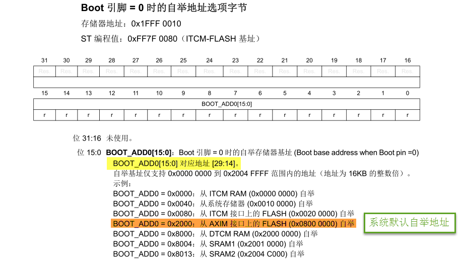

图 50‑2 BOOT=0自举地址选项字节

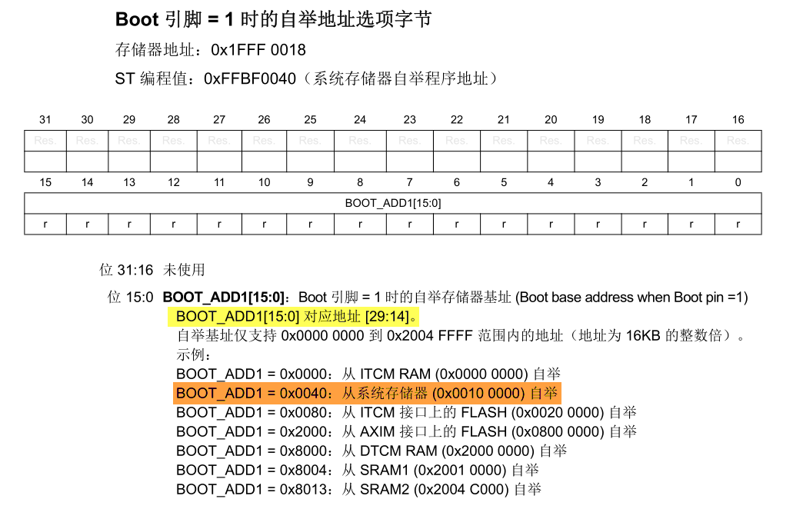

图 50‑3 BOOT=1自举地址选项字节

可在复位后修改 BOOT_ADD0/BOOT_ADD1
选项字节以在下次复位后从任何其它自举地址自举。如果编程的自举存储器地址位于存储器映射区域或保留区域之外，则按如下方式编程默认自举获取地址：自举地址
0：位于 0x0020 0000 的 ITCM-FLASH。自举地址 1：位于 0x0010 0000 的ITCM-RAM。

当 Flash 的保护级别被配置为级别 2 之后，只能从 Flash（位于 ITCM 或 AXIM
接口上）或系统自举程序自举。如果 BOOT_ADD0 和/或 BOOT_ADD1
选项字节中自举地址被配置为位于存储器范围或 RAM 地址（位于 ITCM 或 AXIM
上）之外，则系统只能从位于地址 0x00200000的 ITCM 接口上的 Flash
开始执行。

当芯片上电后采样到BOOT引脚为高电平，系统默认从内部存储器启动，内部自举程序代码位于系统存储器中，
在芯片生产期间由 ST
编程。因而使用系统存储器启动方式时，内核会执行该代码，该代码运行时，会为ISP提供支持(In
System
Program)，如检测USART1/3、CAN2及USB、I2C通讯接口传输过来的信息，并根据这些信息更新自己内部FLASH的内容，达到升级产品应用程序的目的，因此这种启动方式也称为ISP启动方式。

内部FLASH的启动过程
~~~~~~~~~~~~~~~~~~~

下面我们以最常规的内部FLASH启动方式来分析自举过程，主要理解MSP和PC内容是怎样被存储到0x08000000和0x08000004这两个地址的。

见 图50_4_，这是STM32f7默认的启动文件的代码，启动文件的开头定义了一个大小为0x400的栈空间，
且栈顶的地址使用标号“__initial_sp”来表示；在图下方定义了一个名为“Reset_Handler”的子程序，
它就是我们总是提到的在芯片启动后第一个执行的代码。在汇编语法中，程序的名字和标号都包含它所在的地址，
因此，我们的目标是把“__initial_sp”和“Reset_Handler”赋值到0x08000000和0x08000004地址空间存储，
这样内核自举的时候就可以获得栈顶地址以及第一条要执行的指令了。在启动代码的中间部分，使用了汇编关键字“DCD”
把“__initial_sp”和“Reset_Handler”定义到了最前面的地址空间。

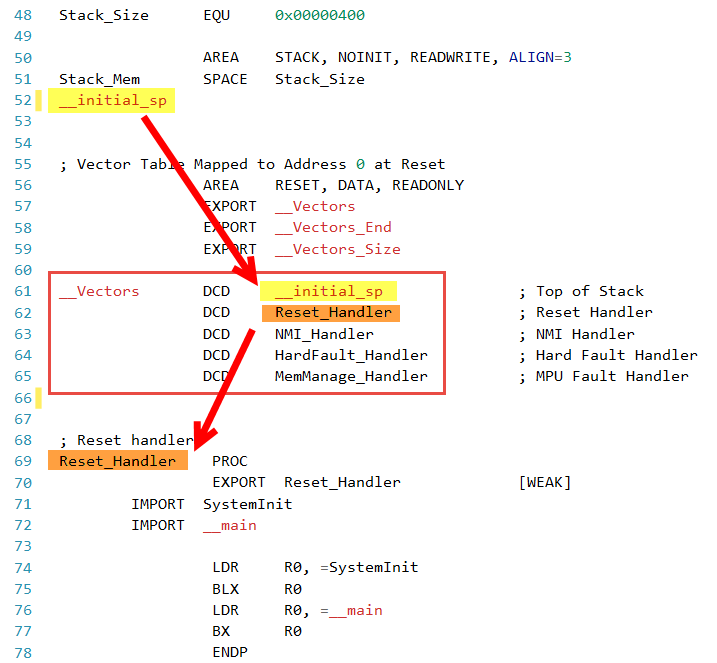

图 50‑4 启动代码中存储的MSP及PC指针内容

在启动文件中把设置栈顶及首条指令地址到了最前面的地址空间，但这并没有指定绝对地址，
各种内容的绝对地址是由链接器根据分散加载文件(\*.sct)分配的，STM32H743IIT6型号的默认分散加载文件配置见
代码清单50_1_。

代码清单 50‑1 默认分散加载文件的空间配置

.. code-block::
   :name: 代码清单50_1

   ; *************************************************************
   ; *** Scatter-Loading Description File generated by uVision ***
   ; *************************************************************
   LR_IROM1 0x08000000 0x00100000  {    ; load region size_region
   ER_IROM1 0x08000000 0x00100000  {  ; load address = execution address
      *.o (RESET, +First)
      *(InRoot$$Sections)
      .ANY (+RO)
   }
   RW_IRAM1 0x20020000 UNINIT 0x00060000  {  ; RW data
      .ANY (+RW +ZI)
   }
   }

分散加载文件把加载区和执行区的首地址都设置为0x08000000，正好是内部FLASH的首地址，因此汇编文件中定义的栈顶及首条指令地址会被存储到0x08000000和0x08000004的地址空间。

类似地，如果我们修改分散加载文件，把加载区和执行区的首地址设置为内部SRAM的首地址0x20020000，那么栈顶和首条指令地址将会被存储到0x20020000和0x20020004的地址空间了。

为了进一步消除疑虑，我们可以查看反汇编代码及map文件信息来了解各个地址空间存储的内容，见
图50_5_，这是多彩流水灯工程编译后的信息，它的启动文件及分散加载文件都按默认配置。其中反汇编代码是使用fromelf工具从axf文件生成的，具体过程可参考前面的章节了解。

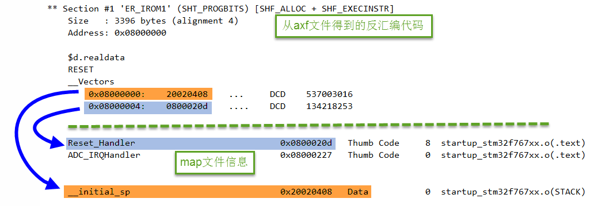

图 50‑5 从反汇编代码及map文件查看存储器的内容

从反汇编代码可了解到，这个工程的0x08000000地址存储的值为0x20000408，0x08000004地址存储的值为0x080002d0，查看map文件，这两个值正好是栈顶地址__initial_sp以及首条指令Reset_Handler的地址。下载器会根据axf文件(bin、hex类似)存储相应的内容到内部FLASH中。

由此可知，BOOT为低电平时，内核复位后，从0x08000000读取到栈顶地址为0x20000408，了解到子程序的栈空间范围，再从0x08000004读取到第一条指令的存储地址为0x080002d0，于是跳转到该地址执行代码，即从ResetHandler开始运行，运行SystemInit、__main(包含分散加载代码)，最后跳转到C语言的main函数。

对比在内部FLASH中运行代码的过程，可了解到若希望在内部SRAM中调试代码，需要设置启动方式为从内部SRAM启动，修改分散加载文件控制代码空间到内部SRAM地址以及把生成程序下载到芯片的内部SRAM中。

实验：在内部SRAM中调试代码
~~~~~~~~~~~~~~~~~~~~~~~~~~

本实验将演示如何设置工程选项实现在内部SRAM中调试代码，实验的示例代码名为“RAM调试—多彩流水灯”，学习以下内容时请打开该工程来理解，它是从普通的多彩流水灯例程改造而来的。

硬件设计
^^^^^^^^

本小节中使用到的流水灯硬件不再介绍，主要讲解与SRAM调试相关的硬件配置。在SRAM上调试程序，需要修改STM32芯片的启动方式，见
图50_6_。

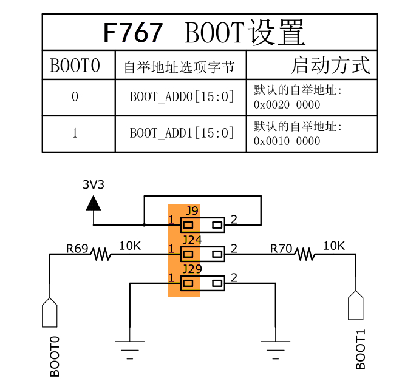

图 50‑6 实验板的boot引脚配置

在我们的实验板左侧有引出STM32芯片的BOOT0和BOOT1引脚，这个为了兼容STM32H743，而STM32H743只用到BOOT0，可使用跳线帽设置它的电平从而控制芯片的启动方式，它支持从内部FLASH启动、系统存储器启动以及内部SRAM启动方式。

本实验在SRAM中调试代码，使用默认配置即可。假如您使用的硬件平台中BOOT0和BOOT1引脚电平已被固定，设置为内部FLASH启动，不方便改成SRAM方式，这种SRAM调试方式也适用。

软件设计
^^^^^^^^

本实验的工程从普通的多彩流水灯工程改写而来，主要修改了分散加载文件及一些程序的下载选项。

主要步骤
''''''''

(1) 在原工程的基础上创建一个调试版本；

(2) 修改内部flash地址，使链接器把代码分配到内部SRAM空间；

(3) 添加宏修改STM32的向量表地址；

(4) 修改仿真器配置，使用仿真器命令脚本文件*.ini，通过脚本加载程序到内部SRAM；

(5) 配置仿真时不下载flash的选项，保证脚本顺利执行；

(6) 尝试给SRAM下载程序或仿真调试。

创建工程的调试版本
''''''''''''''''''

由于在SRAM中运行的代码一般只是用于调试，调试完毕后，在实际生产环境中仍然使用在内部FLASH中运行的代码，因此我们希望能够便捷地在调试版和发布版代码之间切换。MDK的“Manage
Project Items”可实现这样的功能，使用它可管理多个不同配置的工程，见
图50_7_，点击“Manage Project Items”按钮，在弹出对话框左侧的“Project
Target”一栏包含了原工程的名字，如图中的原工程名为“多彩流水灯”，右侧是该工程包含的文件。为了便于调试，我们在左侧的“Project
Target”一栏添加一个工程名，如图中输入“SRAM_调试”，输入后点击OK即可，这个“SRAM_调试”版本的工程会复制原“多彩流水灯”工程的配置，后面我们再进行修改。

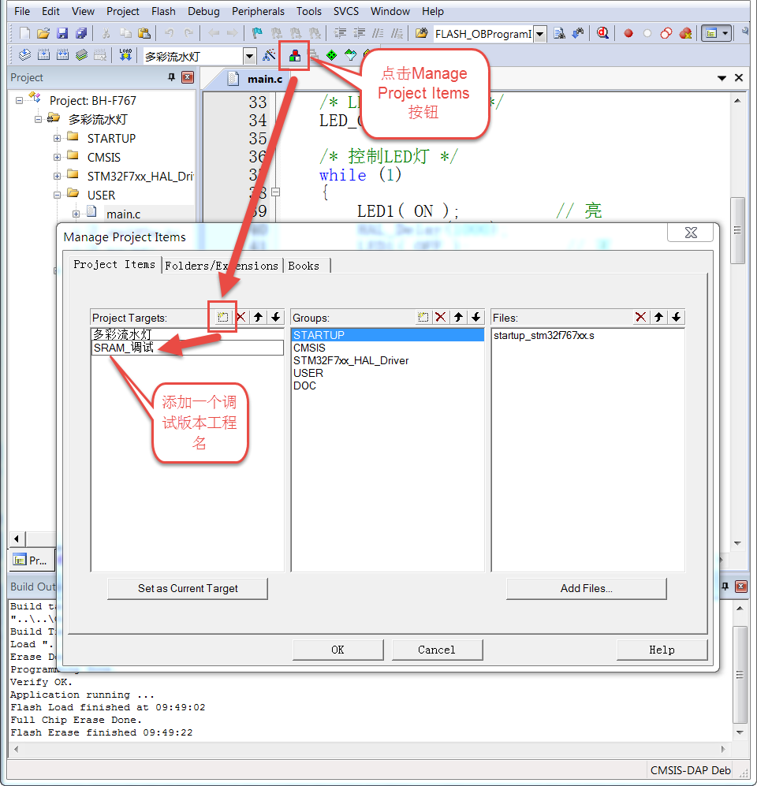

图 50‑7 使用Manage Project Items添加一个工程配置

当需要切换工程版本时，点击MDK工程名的下拉菜单可选择目标工程，在不同的工程中，所有配置都是独立的，例如芯片型号、下载配置等等，但如果两个工程共用了同一个文件，对该文件的修改会同时影响两个工程，例如这两个工程都使用同一个main文件，我们在main文件修改代码，两个工程都会被修改。

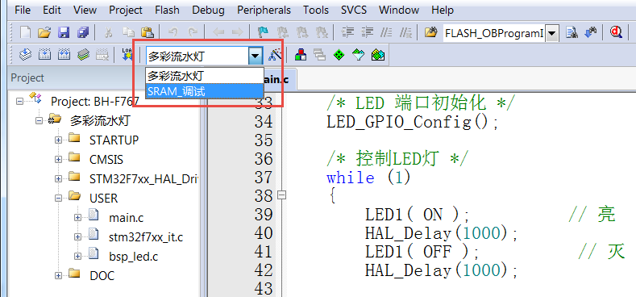

图 50‑8 切换工程

在下面的教程中我们将切换到“SRAM_调试”版本的工程，配置出一个代码会被存储到SRAM的多彩流水灯工程。

修改内部flash地址
'''''''''''''''''

使用MDK的对话框选项配置，在“Options for Target->Target”的选项见 图50_9_。

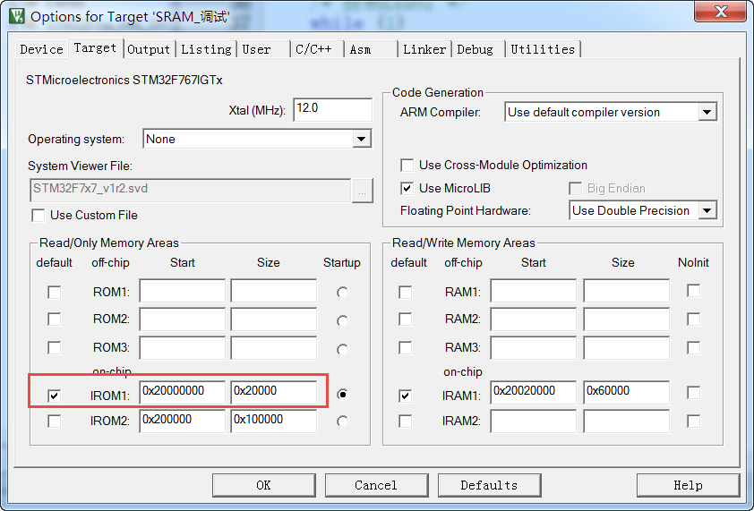

图 50‑9 系统RAM替换内部flash地址

在这个地址配置中，把原本分配到内部FLASH空间的加载域和执行域改到了以地址0x20000000开始的128KB(0x00020000)空间，而RW
data空间保持默认以地址0x20020000开始的384KB空间
(0x00060000)。也就是说，它把STM32的内部SRAM分成了虚拟ROM区域以及RW
data数据区域，链接器会根据它的配置给工程中的各种内容分配到SRAM地址。

在具体的应用中，虚拟ROM及RW区域的大小可根据自己的程序定制，配置完毕编译工程后可在map文件中查看具体的空间地址分配。

配置中断向量表
''''''''''''''

由于startup_STM32H743xx.s文件中的启动代码不是指定到绝对地址的，经过它由链接器决定应存储到内部FLASH还是SRAM，所以SRAM版本工程中的启动文件不需要作任何修改。

重点在于启动文件定义的中断向量表被存储到内部FLASH和内部SRAM时，这两种情况对内核的影响是不同的，
内核会根据它的“向量表偏移寄存器VTOR”配置来获取向量表，即中断服务函数的入口。
VTOR寄存器是由启动文件中Reset_Handle中调用的库函数SystemInit配置的，见 代码清单50_2_。

代码清单 50‑2 SystemInit函数(system_STM32f7xx.c文件)

.. code-block:: c
   :name: 代码清单50_2

   /**
   * @brief  Setup the microcontroller system
   *   Initialize the Embedded Flash Interface, the PLL and update the
   *         SystemFrequency variable.
   * @param  None
   * @retval None
   */
   void SystemInit(void)
   {
   /* ..其它代码部分省略 */

   /* Configure the Vector Table location add offset address ----*/
   #ifdef VECT_TAB_SRAM
   SCB->VTOR = RAMDTCM_BASE | VECT_TAB_OFFSET; /* 向量表存储在SRAM */
   #else
   SCB->VTOR = FLASH_BASE | VECT_TAB_OFFSET; /* 向量表存储在内部FLASH */
   #endif
   }

代码中根据是否存储宏定义VECT_TAB_SRAM来决定VTOR的配置，默认情况下代码中没有定义宏VECT_TAB_SRAM，所以VTOR默认情况下指示向量表是存储在内部FLASH空间的。

由于本工程的分散加载文件配置，在启动文件中定义的中断向量表会被分配到SRAM空间，所以我们要定义这个宏，使得SystemInit函数修改VTOR寄存器，向内核指示向量表被存储到内部SRAM空间了，见
图50_10_，在“Options for Target-> c/c++
->Define”框中输入宏VECT_TAB_SRAM，注意它与其它宏之间要使用英文逗号分隔开。

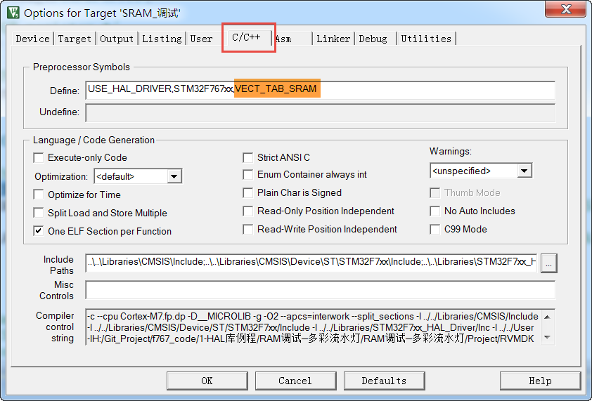

图 50‑10 在c/c++编译选项中加入宏VECT_TAB_SRAM

配置完成后重新编译工程，即可生成存储到SRAM空间地址的代码指令。

仿真配置
''''''''

假如您使用的硬件平台中BOOT0和BOOT1引脚电平已被固定，设置为内部FLASH启动，不方便改成SRAM方式，可以使用如下方法配置调试选项实现在SRAM调试：

(1) 见 图50_11_，在“Options for Target->Debug”对话框中取消勾选“Load
    Application at startup”选项。点击“Initialization
    File”文本框右侧的文件浏览按钮，在弹出的对话框中新建一个名为“Debug_RAM.ini”的文件；

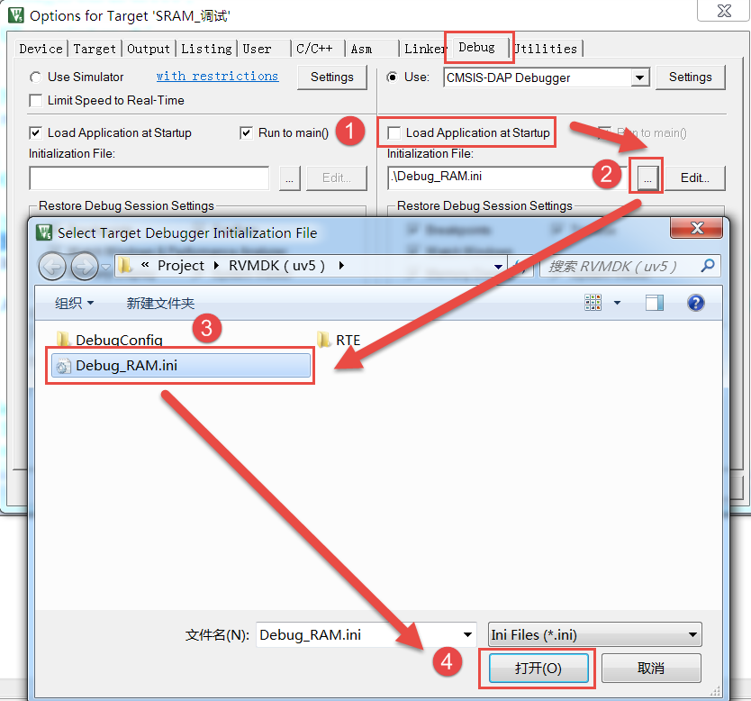

图 50‑11 新建一个ini文件

(1) 在Debug_RAM.ini文件中输入如 代码清单50_3_ 中的内容。

代码清单 50‑3 Debug_RAM.ini文件内容

.. code-block:: c
   :name: 代码清单50_3

   /***********************************************************/
   /* Debug_RAM.ini: Initialization File for Debugging from Internal RAM         */
   /******************************************************/
   /* This file is part of the uVision/ARM development tools.                    */
   /* Copyright (c) 2005-2014 Keil Software. All rights reserved.                */
   /* This software may only be used under the terms of a valid, current,        */
   /* end user licence from KEIL for a compatible version of KEIL software       */
   /*development tools. Nothing else gives you the right to use this software  */
   /***************************************************/

   FUNC void Setup (void) {
      SP = _RDWORD(0x20000000); // 设置栈指针SP，把0x20000000地址中的内容赋值到SP。
      PC = _RDWORD(0x20000004); // 设置程序指针PC，把0x20000004地址中的内容赋值到PC。
      XPSR = 0x01000000;                    // 设置状态寄存器指针xPSR
      _WDWORD(0xE000ED08, 0x20000000);  // Setup Vector Table Offset Register
   }

   LOAD %L INCREMENTAL                    // 下载axf文件到RAM
   Setup();                           //调用上面定义的setup函数设置运行环境

   g, main   //跳转到main函数

上述配置过程是控制MDK执行仿真器的脚本文件Debug_RAM.ini，而该脚本文件在下载了程序到SRAM后，初始化了SP指针(即MSP)和PC指针分别指向了0x20000000和0x20000004，这样的操作等效于从SRAM复位。

配置仿真时不下载flash固件
'''''''''''''''''''''''''

由于SRAM调试是基于虚拟ROM即内部SRAM，所以芯片不需要下载固件更新目标的flash，这个选项一定要取消，否则脚本无法正常运行，固件是通过脚本文件直接加载到内存的。

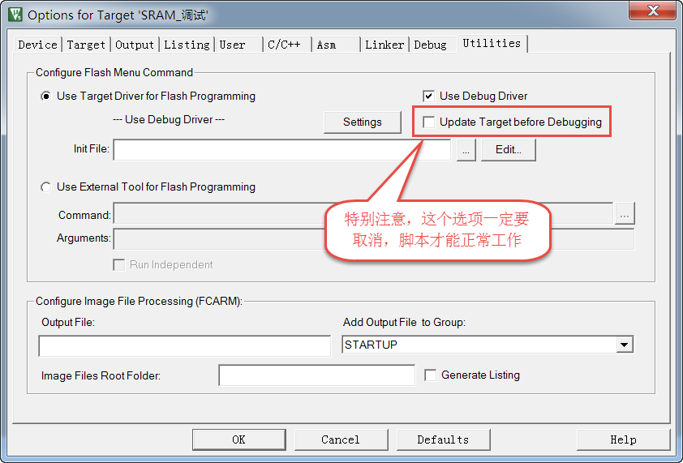

图 50‑12 取消在仿真时更新设备选项

有了这样的配置，即使BOOT0和BOOT1引脚不设置为SRAM启动也能正常仿真了，仿真前记住要先编译。特别注意的是，点击仿真按钮把程序下载到SRAM然后按复位是不能全速运行的(这种运行方式脱离了仿真器的控制，SP和PC指针无法被初始化指向SRAM)。

上述Debug_RAM.ini文件是从STM32f7的MDK芯片包里复制过来的，若您感兴趣可到MDK安装目录搜索该文件名，该文件的语法可以从MDK的帮助手册的“µVision
User's Guide->Debug Commands”章节学习。
