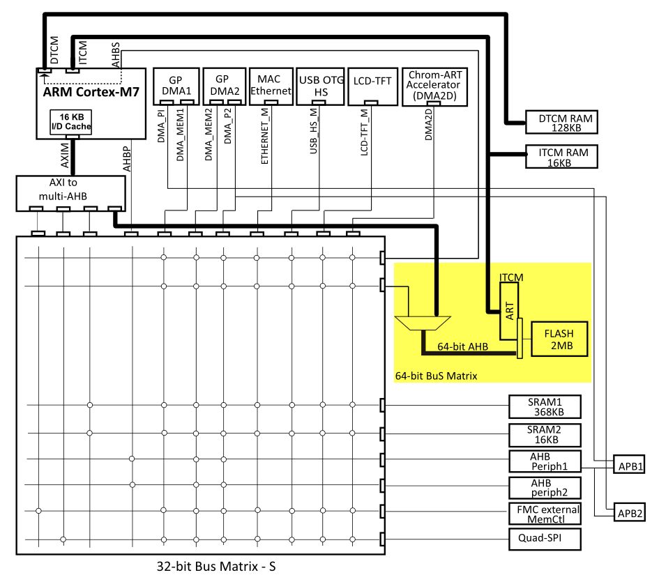
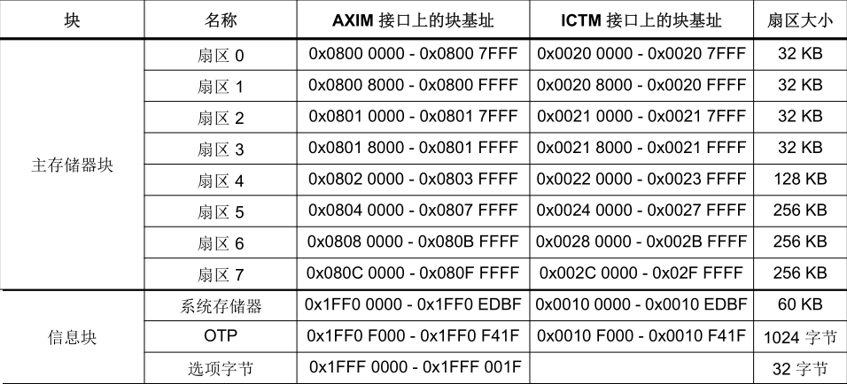
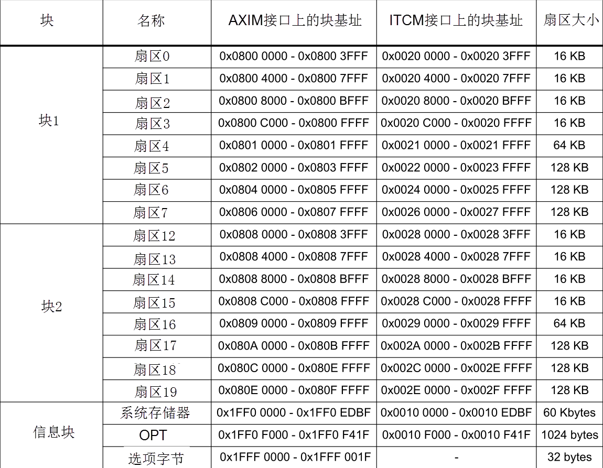
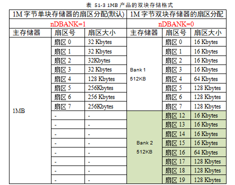
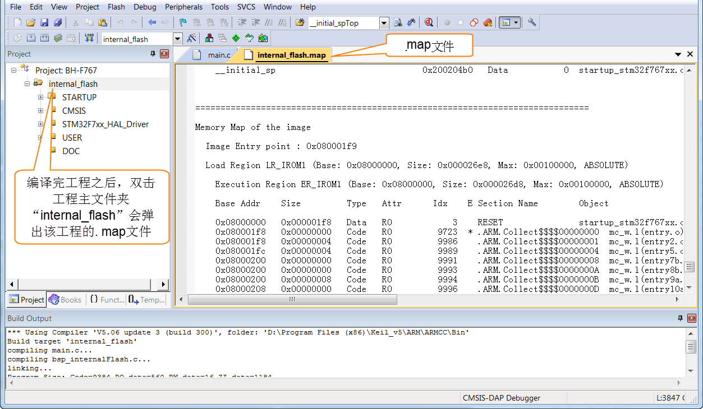
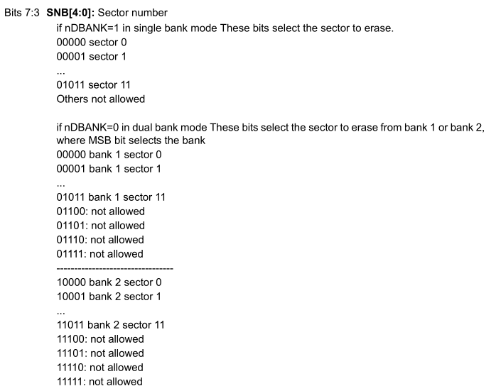

读写内部FLASH
--------------

本章参考资料：《STM32H74xxx参考手册》、《STM32F7xx规格书》、库说明文档《STM32F779xx_User_Manual.chm》。

.. attention::
   本章内容以F7为例，与H7平台区别不太，可以参考。

STM32的内部FLASH简介
~~~~~~~~~~~~~~~~~~~~~

在STM32芯片内部有一个FLASH存储器，它主要用于存储代码，我们在电脑上编写好应用程序后，使用下载器把编译后的代码文件烧录到该内部FLASH中，
由于FLASH存储器的内容在掉电后不会丢失，芯片重新上电复位后，内核可从内部FLASH中加载代码并运行，见 图51_1_。

图 51‑1 STM32的内部框架图

除了使用外部的工具（如下载器）读写内部FLASH外，STM32芯片在运行的时候，也能对自身的内部FLASH进行读写，因此，若内部FLASH存储了应用程序后还有剩余的空间，我们可以把它像外部SPI-FLASH那样利用起来，存储一些程序运行时产生的需要掉电保存的数据。

由于访问内部FLASH的速度要比外部的SPI-FLASH快得多，所以在紧急状态下常常会使用内部FLASH存储关键记录；为了防止应用程序被抄袭，有的应用会禁止读写内部FLASH中的内容，或者在第一次运行时计算加密信息并记录到某些区域，然后删除自身的部分加密代码，这些应用都涉及到内部FLASH的操作。

内部FLASH的构成
'''''''''''''''

STM32的内部FLASH包含主存储器、系统存储器、OTP区域以及选项字节区域，它们的地址分布及大小见表
51‑1和表 51‑2。

表 51‑1 STM32内部1M 字节FLASH单扇区的构成（256位宽读写）

表 51‑2 STM32内部1M 字节FLASH双扇区的构成（128位宽读写）

各个存储区域的说明如下：

-  主存储器

    一般我们说STM32内部FLASH的时候，都是指这个主存储器区域，它是存储用户应用程序的空间，芯片型号说明中的1M
    FLASH、2M
    FLASH都是指这个区域的大小。如我们实验板中使用的STM32H743IIT6型号芯片，主存储器分为一块，共1MB，每块内分8个扇区，其中包含4个32KB扇区、1个128KB扇区和3个256KB的扇区。它的主存储区域大小为1MB，所以它只包含有表中的扇区0-扇区7。

    与其它FLASH一样，在写入数据前，要先按扇区擦除，而有的时候我们希望能以小规格操纵存储单元，所以STM32针对1MB
    FLASH的产品还提供了一种双块的存储格式，见表 51‑3。

表 51‑3 1MB产品的双块存储格式

通过配置FLASH选项控制寄存器FLASH_OPTCR的nDBANK位，可以切换这两种格式，切换成双块模式后，扇区8-11的空间被转移到扇区12-19中，扇区细分了，总容量不变。
双块模式位宽会比单块减半，但是双块模式的好处是可以支持边读边写（RWW）。

注意如果您使用的是STM32F746系列的芯片，它没有双块存储格式，也不存在扇区12-19，仅STM32H74x/77x系列产品才支持扇区12-19。

-  系统存储区

    系统存储区是用户不能访问的区域，它在芯片出厂时已经固化了启动代码，它负责实现串口、USB、I2C以及CAN等ISP烧录功能。

-  OTP区域

    OTP(One Time
    Program)，指的是只能写入一次的存储区域，容量为1024字节，写入后数据就无法再更改，OTP常用于存储应用程序的加密密钥。

-  选项字节

    选项字节用于配置FLASH的读写保护、电源管理中的BOR级别、软件/硬件看门狗等功能，这部分共32字节。可以通过修改FLASH的选项控制寄存器修改。

对内部FLASH的写入过程
~~~~~~~~~~~~~~~~~~~~~

解锁
''''

由于内部FLASH空间主要存储的是应用程序，是非常关键的数据，为了防止误操作修改了这些内容，芯片复位后默认会给FLASH上锁，这个时候不允许设置FLASH的控制寄存器，并且不能对修改FLASH中的内容。

所以对FLASH写入数据前，需要先给它解锁。解锁的操作步骤如下：

(1) 往Flash 密钥寄存器 FLASH_KEYR中写入 KEY1 = 0x45670123

(2) 再往Flash 密钥寄存器 FLASH_KEYR中写入 KEY2 = 0xCDEF89AB

数据操作位数
''''''''''''

在内部FLASH进行擦除及写入操作时，电源电压会影响数据的最大操作位数，该电源电压可通过配置FLASH_CR
寄存器中的 PSIZE位改变，见表 51‑4。

    表 51‑4 数据操作位数

+----------------+---------------+-------------+-------------+-------------+
| 电压范围       | 2.7 - 3.6 V   | 2.7 - 3.6 V | 2.1 – 2.7 V | 1.8 – 2.1 V |
|                |               |             |             |             |
|                | (使用外部Vpp) |             |             |             |
+================+===============+=============+=============+=============+
| 位数           | 64            | 32          | 16          | 8           |
+----------------+---------------+-------------+-------------+-------------+
| PSIZE(1:0)配置 | 11b           | 10b         | 01b         | 00b         |
+----------------+---------------+-------------+-------------+-------------+

最大操作位数会影响擦除和写入的速度，其中64位宽度的操作除了配置寄存器位外，还需要在Vpp引脚外加一个8-9V的电压源，且其供电时间不得超过一小时，否则FLASH可能损坏，所以64位宽度的操作一般是在量产时对FLASH写入应用程序时才使用，大部分应用场合都是用32位的宽度。

擦除扇区
''''''''

在写入新的数据前，需要先擦除存储区域，STM32提供了扇区擦除指令和整个FLASH擦除(批量擦除)的指令，批量擦除指令仅针对主存储区。

扇区擦除的过程如下：

(1) 检查 FLASH_SR 寄存器中的“忙碌寄存器位 BSY”，以确认当前未执行任何
    Flash 操作；

(2) 在 FLASH_CR 寄存器中，将“激活扇区擦除寄存器位SER ”置
    1，并设置“扇区编号寄存器位SNB”，所选扇区应为主存储器块中的8个扇区之一；

(3) 将 FLASH_CR 寄存器中的“开始擦除寄存器位 STRT ”置 1，开始擦除；

(4) 等待 BSY 位被清零时，表示擦除完成。

写入数据
''''''''

擦除完毕后即可写入数据，写入数据的过程并不是仅仅使用指针向地址赋值，赋值前还还需要配置一系列的寄存器，步骤如下：

(1) 检查 FLASH_SR 中的 BSY 位，以确认当前未执行任何其它的内部 Flash
    操作；

(2) 将 FLASH_CR 寄存器中的 “激活编程寄存器位PG” 置 1；

(3) 针对所需存储器地址（主存储器块或 OTP 区域内）执行数据写入操作；

(4) 等待 BSY 位被清零时，表示写入完成。

查看工程的空间分布
~~~~~~~~~~~~~~~~~~

由于内部FLASH本身存储有程序数据，若不是有意删除某段程序代码，一般不应修改程序空间的内容，所以在使用内部FLASH存储其它数据前需要了解哪一些空间已经写入了程序代码，
存储了程序代码的扇区都不应作任何修改。通过查询应用程序编译时产生的“\*.map”后缀文件，可以了解程序存储到了哪些区域，它在工程中的打开方式见
图51_4_，也可以到工程目录中的“Listing”文件夹中找到。

图 51‑4 打开工程的.map文件

打开map文件后，查看文件最后部分的区域，可以看到一段以“Memory Map of the
image”开头的记录(若找不到可用查找功能定位)，见 代码清单51_1_。

代码清单 51‑1 map文件中的存储映像分布说明

.. code-block::
   :name: 代码清单51_1

   =======================================================================
   Memory Map of the image     //存储分布映像

   Image Entry point : 0x080001f9

   /*程序ROM加载空间*/
   Load Region LR_IROM1 (Base: 0x08000000, Size: 0x000026e8, Max: 0x00100000, ABSOLUTE)

   /*程序ROM执行空间*/
   Execution Region ER_IROM1 (Base: 0x08000000, Size: 0x000026d8, Max: 0x00100000, ABSOLUTE)

   /*地址分布列表*/
   Base Addr    Size         Type   Attr      Idx    E Section Name        Object

   0x08000000   0x000001f8   Data   RO           3    RESET               startup_STM32H743xx.o
   0x080001f8   0x00000000   Code   RO        9723  * .ARM.Collect$$$$00000000  mc_w.l(entry.o)
   0x080001f8   0x00000004   Code   RO        9986    .ARM.Collect$$$$00000001  mc_w.l(entry2.o)
   0x080001fc   0x00000004   Code   RO        9989    .ARM.Collect$$$$00000004  mc_w.l(entry5.o)
   0x08000200   0x00000000   Code   RO        9991    .ARM.Collect$$$$00000008  mc_w.l(entry7b.o)
   0x08000200   0x00000000   Code   RO        9993    .ARM.Collect$$$$0000000A  mc_w.l(entry8b.o)
   0x08000200   0x00000008   Code   RO        9994    .ARM.Collect$$$$0000000B  mc_w.l(entry9a.o)
   0x08000208   0x00000000   Code   RO        9996    .ARM.Collect$$$$0000000D  mc_w.l(entry10a.o)
   0x08000208   0x00000000   Code   RO        9998    .ARM.Collect$$$$0000000F  mc_w.l(entry11a.o)
   0x08000208   0x00000004   Code    RO        9987    .ARM.Collect$$$$00002712  mc_w.l(entry2.o)
            /*此处省略大部分内容*/

   0x080025b8   0x0000001c   Code   RO         9626    i.fputc             bsp_debug_usart.o
   0x080025d4   0x000000cc   Code   RO         9496    i.main              main.o
   0x080026a0   0x00000010   Data   RO           15    .constdata          system_STM32F4xx.o
   0x080026b0   0x00000008   Data   RO           16    .constdata          system_STM32F4xx.o
   0x080026b8   0x00000020   Data   RO        10026    Region$$Table       anon$$obj.o

这一段是某工程的ROM存储器分布映像，在STM32芯片中，ROM区域的内容就是指存储到内部FLASH的代码。

程序ROM的加载与执行空间
'''''''''''''''''''''''

上述说明中有两段分别以“Load Region LR_ROM1”及“Execution Region
ER_IROM1”开头的内容，它们分别描述程序的加载及执行空间。在芯片刚上电运行时，会加载程序及数据，例如它会从程序的存储区域加载到程序的执行区域，还把一些已初始化的全局变量从ROM复制到RAM空间，以便程序运行时可以修改变量的内容。加载完成后，程序开始从执行区域开始执行。

在上面map文件的描述中，我们了解到加载及执行空间的基地址(Base)都是0x08000000，它正好是STM32内部FLASH的首地址，即STM32的程序存储空间就直接是执行空间；它们的大小(Size)分别为0x000026e8及0x000026d8，执行空间的ROM比较小的原因就是因为部分RW-data类型的变量被拷贝到RAM空间了；它们的最大空间(Max)均为0x00100000，即1M字节，它指的是内部FLASH的最大空间。

计算程序占用的空间时，需要使用加载区域的大小进行计算，本例子中应用程序使用的内部FLASH是从0x08000000至(0x08000000+0x000026e8)地址的空间区域。

ROM空间分布表
'''''''''''''

在加载及执行空间总体描述之后，紧接着一个ROM详细地址分布表，它列出了工程中的各个段(如函数、常量数据)所在的地址Base
Addr及占用的空间Size，列表中的Type说明了该段的类型，CODE表示代码，DATA表示数据，而PAD表示段之间的填充区域，它是无效的内容，PAD区域往往是为了解决地址对齐的问题。

观察表中的最后一项，它的基地址是0x080026b8，大小为0x00000020，可知它占用的最高的地址空间为0x080026d8，跟执行区域的最高地址0x080026d8一样，但它们比加载区域说明中的最高地址0x80026e8要小，所以我们以加载区域的大小为准。对比表
51‑1的内部FLASH扇区地址分布表，可知仅使用扇区0就可以完全存储本应用程序，所以从扇区1(地址0x08004000)后的存储空间都可以作其它用途，使用这些存储空间时不会篡改应用程序空间的数据。

操作内部FLASH的库函数
~~~~~~~~~~~~~~~~~~~~~

为简化编程，STM32
HAL库提供了一些库函数，它们封装了对内部FLASH写入数据操作寄存器的过程。

FLASH解锁、上锁函数
'''''''''''''''''''

对内部FLASH解锁、上锁的函数见 代码清单51_2_。

代码清单 51‑2 FLASH解锁、上锁

.. code-block:: c
   :name: 代码清单51_2

   /** @defgroup FLASH_Keys FLASH Keys
   * @{
   */
   #define FLASH_KEY1               ((uint32_t)0x45670123U)
   #define FLASH_KEY2               ((uint32_t)0xCDEF89ABU)
   /**
   * @brief  Unlock the FLASH control register access
   * @retval HAL Status
   */
   HAL_StatusTypeDef HAL_FLASH_Unlock(void)
   {
      if ((FLASH->CR & FLASH_CR_LOCK) != RESET) {
         /* Authorize the FLASH Registers access */
         FLASH->KEYR = FLASH_KEY1;
         FLASH->KEYR = FLASH_KEY2;
      } else {
         return HAL_ERROR;
      }

      return HAL_OK;
   }

   /**
   * @brief  Locks the FLASH control register access
   * @retval HAL Status
   */
   HAL_StatusTypeDef HAL_FLASH_Lock(void)
   {
      /* Set the LOCK Bit to lock the FLASH Registers access */
      FLASH->CR |= FLASH_CR_LOCK;

      return HAL_OK;
   }

解锁的时候，它对FLASH_KEYR寄存器写入两个解锁参数，上锁的时候，对FLASH_CR寄存器的FLASH_CR_LOCK位置1。

设置操作位数及擦除扇区
''''''''''''''''''''''

解锁后擦除扇区时可调用FLASH_EraseSector完成，见 代码清单51_3_。

代码清单 51‑3 擦除扇区

.. code-block:: c
   :name: 代码清单51_3

   /**
   * @brief  Perform a mass erase or erase the specified FLASH memory sectors
      * @param[in]  pEraseInit: pointer to an FLASH_EraseInitTypeDef structure that
      *         contains the configuration information for the erasing.
      *
      * @param[out]  SectorError: pointer to variable  that
      *contains the configuration information on faulty sector in case of error
      *         (0xFFFFFFFF means that all the sectors have been correctly erased)
      *
      * @retval HAL Status
      */
   HAL_StatusTypeDef HAL_FLASHEx_Erase(FLASH_EraseInitTypeDef *pEraseInit, uint32_t *SectorError)
   {
      HAL_StatusTypeDef status = HAL_ERROR;
      uint32_t index = 0;

      /* Process Locked */
      __HAL_LOCK(&pFlash);

      /* Check the parameters */
      assert_param(IS_FLASH_TYPEERASE(pEraseInit->TypeErase));

      /* Wait for last operation to be completed */
      status = FLASH_WaitForLastOperation((uint32_t)FLASH_TIMEOUT_VALUE);

      if (status == HAL_OK) {
            /*Initialization of SectorError variable*/
            *SectorError = 0xFFFFFFFFU;

            if (pEraseInit->TypeErase == FLASH_TYPEERASE_MASSERASE) {
               /*Mass erase to be done*/
   #if defined (FLASH_OPTCR_nDBANK)
   FLASH_MassErase((uint8_t) pEraseInit->VoltageRange, pEraseInit->Banks);
   #else
               FLASH_MassErase((uint8_t) pEraseInit->VoltageRange);
   #endif /* FLASH_OPTCR_nDBANK */

               /* Wait for last operation to be completed */
   status = FLASH_WaitForLastOperation((uint32_t)FLASH_TIMEOUT_VALUE);

               /* if the erase operation is completed, disable the MER Bit */
               FLASH->CR &= (~FLASH_MER_BIT);
            } else {
               /* Check the parameters */
            assert_param(IS_FLASH_NBSECTORS(pEraseInit->NbSectors + pEraseInit->Sector));

               /* Erase by sector by sector to be done*/
   for (index = pEraseInit->Sector; index < (pEraseInit->NbSectors + pEraseInit->Sector); index++) {
            FLASH_Erase_Sector(index, (uint8_t) pEraseInit->VoltageRange);

                  /* Wait for last operation to be completed */
   status = FLASH_WaitForLastOperation((uint32_t)FLASH_TIMEOUT_VALUE);

   /* If the erase operation is completed, disable the SER Bit and SNB Bits */
                  CLEAR_BIT(FLASH->CR, (FLASH_CR_SER | FLASH_CR_SNB));

                  if (status != HAL_OK) {
   /* In case of error, stop erase procedure and return the faulty sector*/
                        *SectorError = index;
                        break;
                  }
               }
            }
      }

      /* Process Unlocked */
      __HAL_UNLOCK(&pFlash);

      return status;
   }

本函数包含两个输入参数，分别是擦除flash初始化结构体和返回擦除出错编码，FLASH_EraseInitTypeDef擦除flash初始化结构体主要包含擦除的方式，是扇区擦除还是批量擦除，选择不同电压时实质是选择不同的数据操作位数，并且确定擦除首地址即擦除的扇区个数。函数根据输入参数配置PSIZE位，然后擦除扇区，擦除扇区的时候需要等待一段时间，它使用FLASH_WaitForLastOperation等待，擦除完成的时候才会退出HAL_FLASHEx_Erase函数。

写入数据
''''''''

对内部FLASH写入数据不像对SDRAM操作那样直接指针操作就完成了，还要设置一系列的寄存器，
利用FLASH_TYPEPROGRAM_DOUBLEWORD、FLASH_TYPEPROGRAM_WORD、FLASH_TYPEPROGRAM_HALFWORD和FLASH_TYPEPROGRAM_BYTE函数可按双字、字、半字及字节单位写入数据，见 代码清单51_4_。

代码清单 51‑4 写入数据

.. code-block:: c
   :name: 代码清单51_4

   /**
      * @brief  Program byte, halfword, word or double word at a specified address
      * @param  TypeProgram:  Indicate the way to program at a specified address.
      *This parameter can be a value of @ref FLASH_Type_Program
      * @param  Address:  specifies the address to be programmed.
      * @param  Data: specifies the data to be programmed
      *
      * @retval HAL_StatusTypeDef HAL Status
      */
   HAL_StatusTypeDef HAL_FLASH_Program(uint32_t TypeProgram, uint32_t Address, uint64_t Data)
   {
      HAL_StatusTypeDef status = HAL_ERROR;

      /* Process Locked */
      __HAL_LOCK(&pFlash);

      /* Check the parameters */
      assert_param(IS_FLASH_TYPEPROGRAM(TypeProgram));

      /* Wait for last operation to be completed */
      status = FLASH_WaitForLastOperation((uint32_t)FLASH_TIMEOUT_VALUE);

      if (status == HAL_OK) {
            switch (TypeProgram) {
            case FLASH_TYPEPROGRAM_BYTE : {
               /*Program byte (8-bit) at a specified address.*/
               FLASH_Program_Byte(Address, (uint8_t) Data);
               break;
            }

            case FLASH_TYPEPROGRAM_HALFWORD : {
               /*Program halfword (16-bit) at a specified address.*/
               FLASH_Program_HalfWord(Address, (uint16_t) Data);
               break;
            }

            case FLASH_TYPEPROGRAM_WORD : {
               /*Program word (32-bit) at a specified address.*/
               FLASH_Program_Word(Address, (uint32_t) Data);
               break;
            }

            case FLASH_TYPEPROGRAM_DOUBLEWORD : {
               /*Program double word (64-bit) at a specified address.*/
               FLASH_Program_DoubleWord(Address, Data);
               break;
            }
            default :
               break;
            }
            /* Wait for last operation to be completed */
         status = FLASH_WaitForLastOperation((uint32_t)FLASH_TIMEOUT_VALUE);

            /* If the program operation is completed, disable the PG Bit */
            FLASH->CR &= (~FLASH_CR_PG);
      }

      /* Process Unlocked */
      __HAL_UNLOCK(&pFlash);

      return status;
   }

看函数代码可了解到，形参依次设置了数据操作宽度，写入数据地址，写入的数据。在赋值操作后，调用了FLASH_WaitForLastOperation函数等待写操作完毕。

实验：读写内部FLASH
~~~~~~~~~~~~~~~~~~~~

在本小节中我们以实例讲解如何使用内部FLASH存储数据。

硬件设计
'''''''''''''

本实验仅操作了STM32芯片内部的FLASH空间，无需额外的硬件。

软件设计
''''''''''''

本小节讲解的是“内部FLASH编程”实验，请打开配套的代码工程阅读理解。为了方便展示及移植，我们把操作内部FLASH相关的代码都编写到“bsp_internalFlash.c”及“bsp_internalFlash.h”文件中，这些文件是我们自己编写的，不属于HAL库的内容，可根据您的喜好命名文件。

程序设计要点
^^^^^^^^^^^^^^

(1) 对内部FLASH解锁；

(2) 找出空闲扇区，擦除目标扇区；

(3) 进行读写测试。

代码分析
===========

硬件定义
===========

读写内部FLASH不需要用到任何外部硬件，不过在擦写时常常需要知道各个扇区的基地址，我们把这些基地址定义到bsp_internalFlash.h文件中，见
代码清单51_5_。

代码清单 51‑5 各个扇区的基地址(bsp_internalFlash.h文件)

.. code-block:: c
   :name: 代码清单51_5

   /* Base address of the Flash sectors */
   #define ADDR_FLASH_SECTOR_0     ((uint32_t)0x08000000) /* 32 Kbytes */
   #define ADDR_FLASH_SECTOR_1     ((uint32_t)0x08008000) /* 32 Kbytes */
   #define ADDR_FLASH_SECTOR_2     ((uint32_t)0x08010000) /* 32 Kbytes */
   #define ADDR_FLASH_SECTOR_3     ((uint32_t)0x08018000) /* 32 Kbytes */
   #define ADDR_FLASH_SECTOR_4     ((uint32_t)0x08020000) /* 128 Kbytes */
   #define ADDR_FLASH_SECTOR_5     ((uint32_t)0x08040000) /* 256 Kbytes */
   #define ADDR_FLASH_SECTOR_6     ((uint32_t)0x08080000) /* 256 Kbytes */
   #define ADDR_FLASH_SECTOR_7     ((uint32_t)0x080C0000) /* 256 Kbytes */

这些宏跟表 51‑1中的地址说明一致。

根据扇区地址计算SNB寄存器的值
=================================

在擦除操作时，需要向FLASH控制寄存器FLASH_CR的SNB位写入要擦除的扇区号，固件库把各个扇区对应的寄存器值使用宏定义到了stm32f4xx_flash.h文件。
为了便于使用，我们自定义了一个GetSector函数，根据输入的内部FLASH地址，找出其所在的扇区，并返回该扇区对应的SNB位寄存器值，见 代码清单51_6_。

代码清单 51‑6 写入到SNB寄存器位的值（stm32f4xx_flash.h及bsp_internalFlash.c文件）

.. code-block:: c
   :name: 代码清单51_6

   /** 固件库定义的用于扇区写入到SNB寄存器位的宏(STM32F4xx_hal_flash.h文件)
      * @{
      */
   #define FLASH_SECTOR_0           ((uint32_t)0U) /*!< Sector Number 0   */
   #define FLASH_SECTOR_1           ((uint32_t)1U) /*!< Sector Number 1   */
   #define FLASH_SECTOR_2           ((uint32_t)2U) /*!< Sector Number 2   */
   #define FLASH_SECTOR_3           ((uint32_t)3U) /*!< Sector Number 3   */
   #define FLASH_SECTOR_4           ((uint32_t)4U) /*!< Sector Number 4   */
   #define FLASH_SECTOR_5           ((uint32_t)5U) /*!< Sector Number 5   */
   #define FLASH_SECTOR_6           ((uint32_t)6U) /*!< Sector Number 6   */
   #define FLASH_SECTOR_7           ((uint32_t)7U) /*!< Sector Number 7   */
   /**
      * @brief  根据输入的地址给出它所在的sector
      *         例如：
               uwStartSector = GetSector(FLASH_USER_START_ADDR);
               uwEndSector = GetSector(FLASH_USER_END_ADDR);
      * @param  Address：地址
      * @retval 地址所在的sector
      */
   static uint32_t GetSector(uint32_t Address)
   {
      uint32_t sector = 0;

   if ((Address < ADDR_FLASH_SECTOR_1) && (Address >= ADDR_FLASH_SECTOR_0)) {
            sector = FLASH_SECTOR_0;
   } else if((Address < ADDR_FLASH_SECTOR_2) && (Address >= ADDR_FLASH_SECTOR_1)) {
            sector = FLASH_SECTOR_1;
      } else if ((Address < ADDR_FLASH_SECTOR_3) && (Address >= ADDR_FLASH_SECTOR_2)) {
            sector = FLASH_SECTOR_2;
      } else if ((Address < ADDR_FLASH_SECTOR_4) && (Address >= ADDR_FLASH_SECTOR_3)) {
            sector = FLASH_SECTOR_3;
      } else if ((Address < ADDR_FLASH_SECTOR_5) && (Address >= ADDR_FLASH_SECTOR_4)) {
         sector = FLASH_SECTOR_4;
      } else if ((Address < ADDR_FLASH_SECTOR_6) && (Address >= ADDR_FLASH_SECTOR_5)) {
         sector = FLASH_SECTOR_5;
      } else if ((Address < ADDR_FLASH_SECTOR_7) && (Address >= ADDR_FLASH_SECTOR_6)) {
         sector = FLASH_SECTOR_6;
      } else { /*(Address < FLASH_END_ADDR) && (Address >= ADDR_FLASH_SECTOR_23))*/
         sector = FLASH_SECTOR_7;
      }
      return sector;
   }

代码中固件库定义的宏FLASH_Sector_0-7对应的值是跟寄存器说明一致的，见 图51_3_。

图 51‑5 FLASH_CR寄存器的SNB位的值

GetSector函数根据输入的地址与各个扇区的基地址进行比较，找出它所在的扇区，并使用FLASH_EraseInitTypeDef擦除flash初始化结构体，最终计算出NbSectors（扇区个数）。

读写内部FLASH
================

一切准备就绪，可以开始对内部FLASH进行擦写，这个过程不需要初始化任何外设，只要按解锁、擦除及写入的流程走就可以了，见
代码清单51_7_。

代码清单 51‑7 对内部地FLASH进行读写测试(bsp_internalFlash.c文件)

.. code-block:: c
   :name: 代码清单51_7

   /*准备写入的测试数据*/
   #define DATA_32                 ((uint32_t)0x87645321)

   /* Exported types -----------------------------------------------------*/
   /* Exported constants -------------------------------------------------*/
   /* 要擦除内部FLASH的起始地址 */
   #define FLASH_USER_START_ADDR   ADDR_FLASH_SECTOR_5
   /* 要擦除内部FLASH的结束地址 */
   #define FLASH_USER_END_ADDR     ADDR_FLASH_SECTOR_7

   static uint32_t GetSector(uint32_t Address);

   /**
   * @brief  InternalFlash_Test,对内部FLASH进行读写测试
   * @param  None
   * @retval None
   */
   int InternalFlash_Test(void)
   {
      /*要擦除的起始扇区(包含)及结束扇区(不包含)，如8-12，表示擦除8、9、10、11扇区*/
      uint32_t FirstSector = 0;
      uint32_t NbOfSectors = 0;

      uint32_t SECTORError = 0;

      uint32_t Address = 0;

      __IO uint32_t Data32 = 0;
      __IO uint32_t MemoryProgramStatus = 0;
      static FLASH_EraseInitTypeDef EraseInitStruct;

      /* FLASH 解锁 ********************************/
      /* 使能访问FLASH控制寄存器 */
      HAL_FLASH_Unlock();

      FirstSector = GetSector(FLASH_USER_START_ADDR);
      NbOfSectors = GetSector(FLASH_USER_END_ADDR)- FirstSector + 1;

      /* 擦除用户区域 (用户区域指程序本身没有使用的空间，可以自定义)**/
      /* Fill EraseInit structure*/
      EraseInitStruct.TypeErase     = FLASH_TYPEERASE_SECTORS;
      EraseInitStruct.VoltageRange  = FLASH_VOLTAGE_RANGE_3;/* 以“字”的大小进行操作 */
      EraseInitStruct.Sector        = FirstSector;
      EraseInitStruct.NbSectors     = NbOfSectors;
      /* 开始擦除操作 */
      if (HAL_FLASHEx_Erase(&EraseInitStruct, &SECTORError) != HAL_OK) {
         /*擦除出错，返回，实际应用中可加入处理 */
         return -1;
      }

      /* 以“字”的大小为单位写入数据 ********************************/
      Address = FLASH_USER_START_ADDR;

      while (Address < FLASH_USER_END_ADDR) {
         if (HAL_FLASH_Program(FLASH_TYPEPROGRAM_WORD, Address, DATA_32) == HAL_OK) {
               Address = Address + 4;
         } else {
               /*写入出错，返回，实际应用中可加入处理 */
               return -1;
         }
      }

      /* 给FLASH上锁，防止内容被篡改*/
      HAL_FLASH_Lock();

      /* 从FLASH中读取出数据进行校验***************************************/
      /*  MemoryProgramStatus = 0: 写入的数据正确
         MemoryProgramStatus != 0: 写入的数据错误，其值为错误的个数 */
      Address = FLASH_USER_START_ADDR;
      MemoryProgramStatus = 0;

      while (Address < FLASH_USER_END_ADDR) {
         Data32 = *(__IO uint32_t*)Address;

         if (Data32 != DATA_32) {
               MemoryProgramStatus++;
         }
            Address = Address + 4;
      }
      /* 数据校验不正确 */
      if (MemoryProgramStatus) {
            return -1;
      } else { /*数据校验正确*/
            return 0;
      }
   }

该函数的执行过程如下：

(1) 调用HAL_FLASH_Unlock解锁；

(2) 调用GetSector根据起始地址及结束地址计算要擦除的扇区；

(3) 配置FLASH_EraseInitTypeDef擦除flash初始化结构体；

(4) 调用HAL_FLASHEx_Erase擦除扇区，擦除时按字为单位进行操作；

(5) 调用HAL_FLASH_Program函数向起始地址至结束地址的存储区域都写入数值“DATA_32”；

(6) 调用HAL_FLASH_Lock上锁；

(7) 使用指针读取数据内容并校验。

main函数
===============

最后我们来看看main函数的执行流程，见 代码清单51_8_。

代码清单 51‑8 main函数(main.c文件)

.. code-block:: c
   :name: 代码清单51_8

   /**
   * @brief  主函数
   * @param  无
   * @retval 无
   */
   int main(void)
   {
      /* 配置系统时钟为216 MHz */
      SystemClock_Config();

      /*初始化USART 配置模式为 115200 8-N-1 */
      DEBUG_USART_Config();
      /*初始化LED*/
      LED_GPIO_Config();

      printf("\r\n 欢迎使用野火  STM32 H743 开发板。\r\n");
      printf("正在进行读写内部FLASH实验，请耐心等待\r\n");

      if (InternalFlash_Test()==0) {
         LED_GREEN;
         printf("读写内部FLASH测试成功\r\n");

      } else {
         printf("读写内部FLASH测试失败\r\n");
         LED_RED;
      }

      while (1) {

      }
   }

main函数中初始化了用于指示调试信息的LED及串口后，直接调用了InternalFlash_Test函数，进行读写测试并根据测试结果输出调试信息。

下载验证
^^^^^^^^

用USB线连接开发板“USB TO
UART”接口跟电脑，在电脑端打开串口调试助手，把编译好的程序下载到开发板。在串口调试助手可看到擦写内部FLASH的调试信息。
