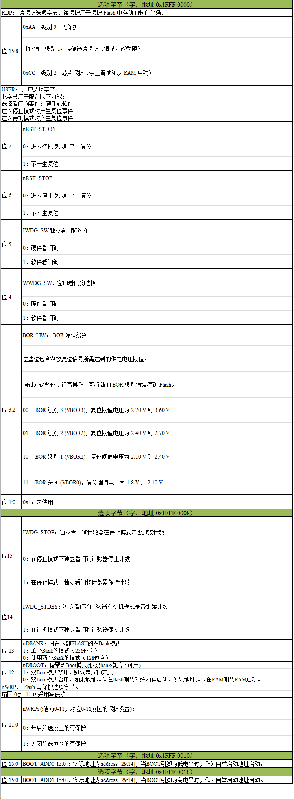
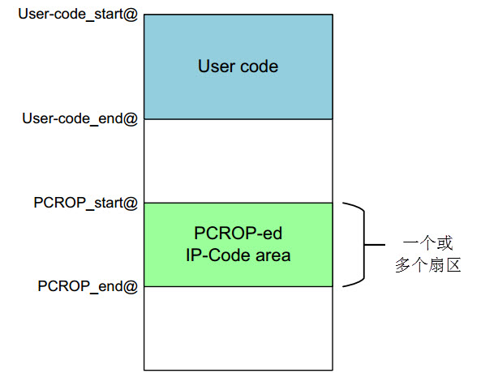
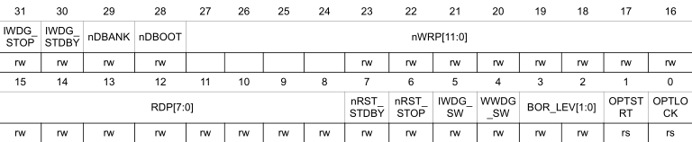
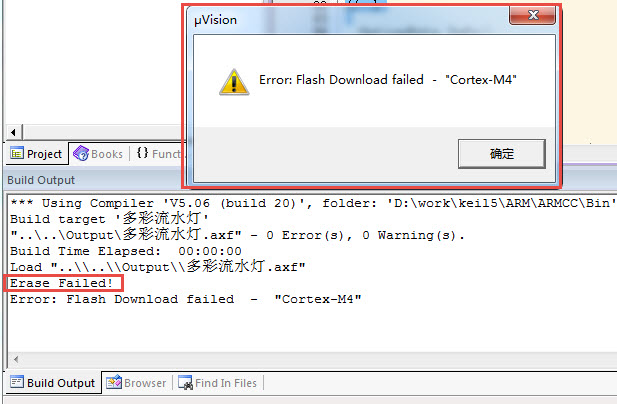

设置FLASH的读写保护及解除
--------------------------

本章参考资料：《STM32H74xxx参考手册》、《STM32F7xx规格书》、库说明文档《STM32F779xx_User_Manual.chm》
以及《Proprietary code read-out protection on microcontrollers》。

.. attention::
   本章内容以F7为例，与H7平台区别不太，可以参考。

选项字节与读写保护
~~~~~~~~~~~~~~~~~~

在实际发布的产品中，在STM32芯片的内部FLASH存储了控制程序，如果不作任何保护措施的话，可以使用下载器直接把内部FLASH的内容读取回来，得到bin或hex文件格式的代码拷贝，别有用心的厂商即可利用该代码文件山寨产品。为此，STM32芯片提供了多种方式保护内部FLASH的程序不被非法读取，但在默认情况下该保护功能是不开启的，若要开启该功能，需要改写内部FLASH选项字节(Option
Bytes)中的配置。

选项字节的内容
^^^^^^^^^^^^^^

选项字节是一段特殊的FLASH空间，STM32芯片会根据它的内容进行读写保护配置，选项字节的构成见表
52‑1。

   表 52‑1 选项字节的构成

+-------------+---------+--------------------------------------+
| 地址        | [63:16] | [15:0]                               |
+=============+=========+======================================+
| 0x1FFF 0000 | 保留    | ROP 和用户选项字节 (RDP & USER)      |
+-------------+---------+--------------------------------------+
| 0x1FFF 0008 | 保留    | IWDG_STOP、IWDG_STBY、nDBANK, nDBOOT |
|             |         |                                      |
|             |         | 扇区 0 到 11 的写保护 nWRP 位        |
+-------------+---------+--------------------------------------+
| 0x1FFE 0010 | 保留    | BOOT_ADD0                            |
+-------------+---------+--------------------------------------+
| 0x1FFE 0018 | 保留    | BOOT_ADD0                            |
+-------------+---------+--------------------------------------+

选项字节具体的数据位配置说明见表 52‑2。

我们主要讲解选项字节配置中的RDP位和PCROP位，它们分别用于配置读保护级别及代码读出保护。

RDP读保护级别
^^^^^^^^^^^^^^^^^^

修改选项字节的RDP位的值可设置内部FLASH为以下保护级别：

-	0xAA：级别0，无保护

..

   这是STM32的默认保护级别，它没有任何读保护，读取内部FLASH及“备份SRAM”的内容都没有任何限制。(注意这里说的“备份SRAM”是指STM32备份域的SRAM空间，不是指主SRAM，下同)

-	其它值：级别1，使能读保护

..

   把RDP配置成除0xAA或0xCC外的任意数值， 都会使能级别1的读保护。在这种保护下，
   若使用调试功能(使用下载器、仿真器)或者从内部SRAM自举时都不能对内部FLASH及备份SRAM作任何访问(读写、擦除都被禁止)；而如果STM32是从内部FLASH自举时，它允许对内部FLASH及备份SRAM的任意访问。

   也就是说，在级别1模式下，任何尝试从外部访问内部FLASH内容的操作都被禁止，例如无法通过下载器读取它的内容，或编写一个从内部SRAM启动的程序，若该程序读取内部FLASH，会被禁止。而如果是芯片自己访问内部FLASH，是完全没有问题的，例如前面的“读写内部FLASH”实验中的代码自己擦写内部FLASH空间的内容，即使处于级别1的读保护，也能正常擦写。

   当芯片处于级别1的时候，可以把选项字节的RDP位重新设置为0xAA，恢复级别0。在恢复到级别0前，芯片会自动擦除内部FLASH及备份SRAM的内容，即降级后原内部FLASH的代码会丢失。在级别1时使用SRAM自举的程序也可以访问选项字节进行修改，所以如果原内部FLASH的代码没有解除读保护的操作时，可以给它加载一个SRAM自举的程序进行保护降级，后面我们将会进行这样的实验。

-	0xCC：级别2，禁止调试

..

   把RDP配置成0xCC值时，会进入最高级别的读保护，且设置后无法再降级，它会永久禁止用于调试的JTAG接口(相当于熔断)。在该级别中，除了具有级别1的所有保护功能外，进一步禁止了从SRAM或系统存储器的自举(即平时使用的串口ISP下载功能也失效)，JTAG调试相关的功能被禁止，选项字节也不能被修改。它仅支持从内部FLASH自举时对内部FLASH及SRAM的访问(读写、擦除)。

   由于设置了级别2后无法降级，也无法通过JTAG、串口ISP等方式更新程序，
   所以使用这个级别的保护时一般会在程序中预留“后门”以更新应用程序，若程序中没有预留后门，
   芯片就无法再更新应用程序了。所谓的“后门”是一种IAP程序(In Application Program)，
   它通过某个通讯接口获取将要更新的程序内容，然后利用内部FLASH擦写操作把这些内容烧录到自己的内部FLASH中，实现应用程序的更新。

   不同级别下的访问限制见 图52_1_。

   .. image:: media/image1.png
      :align: center
      :alt: 图 52‑1 不同级别下的访问限制
      :name: 图52_1

   不同保护级别之间的状态转换见 图52_2_

   .. image:: media/image2.png
      :align: center
      :alt: 图 52‑2  不同级别间的状态转换
      :name: 图52_2

PCROP代码读出保护
^^^^^^^^^^^^^^^^^^^^^

在STM32H743xx及STM32F777xx系列的芯片中，除了可使用RDP对整片FLASH进行读保护外，
还有一个专用的代码读出保护功能（Proprietary code readout protection，下面简称PCROP），
它可以为内部FLASH的某几个指定扇区提供保护功能，所以它可以用于保护一些IP代码，
方便提供给另一方进行二次开发，见 图52_3_

当SPMOD位设置为0时(默认值)，nWRPi位用于指定要进行写保护的扇区，这可以防止错误的指针操作导致FLASH
内容的改变，若扇区被写保护，通过调试器也无法擦除该扇区的内容；当SPMOD位设置为1时，nWRPi位用于指定要进行PCROP保护的扇区。其中PCROP功能可以防止指定扇区的FLASH内容被读出，而写保护仅可以防止误写操作，不能被防止读出。

当要关闭PCROP功能时，必须要使芯片从读保护级别1降为级别0，同时对SPMOD位置0，才能正常关闭；若芯片原来的读保护为级别0，且使能了PCROP保护，要关闭PCROP时也要先把读保护级别设置为级别1，再在降级的同时设置SPMOD为0。

修改选项字节的过程
~~~~~~~~~~~~~~~~~~~~

修改选项字节的内容可修改各种配置，但是，当应用程序运行时，无法直接通过选项字节的地址改写它们的内容，例如，接使用指针操作地址0x1FFF
0000的修改是无效的。要改写其内容时必须设置寄存器FLASH_OPTCR及FLASH_OPTCR1中的对应数据位，寄存器的与选项字节对应位置见
图52_4_ 及 图52_5_，详细说明请查阅《STM32参考手册》。

图 52‑4 FLASH_OPTCR寄存器说明

图 52‑5 FLASH_OPTCR1寄存器说明

默认情况下，FLASH_OPTCR寄存器中的第0位OPTLOCK值为1，它表示选项字节被上锁，需要解锁后才能进行修改，当寄存器的值设置完成后，对FLASH_OPTCR寄存器中的第1位OPTSTRT值设置为1，硬件就会擦除选项字节扇区的内容，并把FLASH_OPTCR/1寄存器中包含的值写入到选项字节。

所以，修改选项字节的配置步骤如下：

(1) 解锁，在 Flash 选项密钥寄存器 (FLASH_OPTKEYR) 中写入 OPTKEY1 =
    0x0819 2A3B；接着在 Flash 选项密钥寄存器 (FLASH_OPTKEYR) 中写入
    OPTKEY2 = 0x4C5D 6E7F。

(2) 检查 FLASH_SR 寄存器中的 BSY 位，以确认当前未执行其它Flash 操作。

(3) 在 FLASH_OPTCR或 FLASH_OPTCR1 寄存器中写入选项字节值。

(4) 将 FLASH_OPTCR 寄存器中的选项启动位 (OPTSTRT) 置 1。

(5) 等待 BSY 位清零，即写入完成。

操作选项字节的库函数
~~~~~~~~~~~~~~~~~~~~~~~

为简化编程，STM32
HAL库提供了一些库函数，它们封装了修改选项字节时操作寄存器的过程。
代码清单52_1_。

选项字节解锁、上锁函数
^^^^^^^^^^^^^^^^^^^^^^^

对选项字节解锁、上锁的函数见 代码清单52_1_

代码清单 52‑1选项字节解锁、上锁

.. code-block:: c
   :name: 代码清单52_1

   #define FLASH_OPT_KEY1           ((uint32_t)0x08192A3BU)
   #define FLASH_OPT_KEY2           ((uint32_t)0x4C5D6E7FU)
   /**
   * @brief  Unlock the FLASH Option Control Registers access.
   * @retval HAL Status
   */
   HAL_StatusTypeDef HAL_FLASH_OB_Unlock(void)
   {
      if ((FLASH->OPTCR & FLASH_OPTCR_OPTLOCK) != RESET) {
         /* Authorizes the Option Byte register programming */
         FLASH->OPTKEYR = FLASH_OPT_KEY1;
         FLASH->OPTKEYR = FLASH_OPT_KEY2;
      } else {
         return HAL_ERROR;
      }

      return HAL_OK;
   }

   /**
   * @brief  Lock the FLASH Option Control Registers access.
   * @retval HAL Status
   */
   HAL_StatusTypeDef HAL_FLASH_OB_Lock(void)
   {
   /* Set the OPTLOCK Bit to lock the FLASH Option Byte Registers access */
      FLASH->OPTCR |= FLASH_OPTCR_OPTLOCK;

      return HAL_OK;
   }

解锁的时候，它对FLASH_OPTCR寄存器写入两个解锁参数，上锁的时候，对FLASH_OPTCR寄存器的FLASH_OPTCR_OPTLOCK位置1。

设置选项字节函数
^^^^^^^^^^^^^^^^^^

解锁后设置选项字节寄存器可以先初始化FLASH_OBProgramInitTypeDef结构体，然后调用HAL_FLASHEx_OBProgram完成。

代码清单 52‑2 设置选项字节函数

.. code-block:: c
   :name: 代码清单52_2

   /**
   * @brief  Program option bytes
   * @param  pOBInit: pointer to an FLASH_OBInitStruct structure that
   *         contains the configuration information for the programming.
   *
   * @retval HAL Status
   */
   HAL_StatusTypeDef HAL_FLASHEx_OBProgram(
   FLASH_OBProgramInitTypeDef *pOBInit)
   {
      HAL_StatusTypeDef status = HAL_ERROR;

      /* Process Locked */
      __HAL_LOCK(&pFlash);

      /* Check the parameters */
      assert_param(IS_OPTIONBYTE(pOBInit->OptionType));

      /* Write protection configuration */
      if ((pOBInit->OptionType & OPTIONBYTE_WRP) == OPTIONBYTE_WRP) {
         assert_param(IS_WRPSTATE(pOBInit->WRPState));
         if (pOBInit->WRPState == OB_WRPSTATE_ENABLE) {
               /*Enable of Write protection on the selected Sector*/
               status = FLASH_OB_EnableWRP(pOBInit->WRPSector);
         } else {
               /*Disable of Write protection on the selected Sector*/
               status = FLASH_OB_DisableWRP(pOBInit->WRPSector);
         }
      }

      /* Read protection configuration */
      if ((pOBInit->OptionType & OPTIONBYTE_RDP) == OPTIONBYTE_RDP) {
         status = FLASH_OB_RDP_LevelConfig(pOBInit->RDPLevel);
      }

      /* USER  configuration */
      if ((pOBInit->OptionType & OPTIONBYTE_USER) == OPTIONBYTE_USER) {
   #if defined (FLASH_OPTCR_nDBANK)
         status = FLASH_OB_UserConfig(pOBInit->USERConfig & OB_WWDG_SW,
                           pOBInit->USERConfig & OB_IWDG_SW,
                           pOBInit->USERConfig & OB_STOP_NO_RST,
                           pOBInit->USERConfig & OB_STDBY_NO_RST,
                           pOBInit->USERConfig & OB_IWDG_STOP_ACTIVE,
                           pOBInit->USERConfig & OB_IWDG_STDBY_ACTIVE,
                           pOBInit->USERConfig & OB_NDBANK_SINGLE_BANK,
                           pOBInit->USERConfig & OB_DUAL_BOOT_DISABLE);
   #else
         status = FLASH_OB_UserConfig(pOBInit->USERConfig & OB_WWDG_SW,
                                       pOBInit->USERConfig & OB_IWDG_SW,
                                       pOBInit->USERConfig & OB_STOP_NO_RST,
                           pOBInit->USERConfig & OB_STDBY_NO_RST,
                           pOBInit->USERConfig & OB_IWDG_STOP_ACTIVE,
                           pOBInit->USERConfig & OB_IWDG_STDBY_ACTIVE);
   #endif /* FLASH_OPTCR_nDBANK */
      }

      /* BOR Level  configuration */
      if ((pOBInit->OptionType & OPTIONBYTE_BOR) == OPTIONBYTE_BOR) {
         status = FLASH_OB_BOR_LevelConfig(pOBInit->BORLevel);
      }

      /* Boot 0 Address configuration */
      if ((pOBInit->OptionType & OPTIONBYTE_BOOTADDR_0) ==
   OPTIONBYTE_BOOTADDR_0) {
         status = FLASH_OB_BootAddressConfig(OPTIONBYTE_BOOTADDR_0,
   pOBInit->BootAddr0);
      }

      /* Boot 1 Address configuration */
      if ((pOBInit->OptionType & OPTIONBYTE_BOOTADDR_1) ==
   OPTIONBYTE_BOOTADDR_1) {
         status = FLASH_OB_BootAddressConfig(OPTIONBYTE_BOOTADDR_1,
   pOBInit->BootAddr1);
      }

      /* Process Unlocked */
      __HAL_UNLOCK(&pFlash);

      return status;
   }

该函数根据输入选项字节结构体FLASH_OBProgramInitTypeDef参数设置寄存器响应的位，特别注意，其注释警告了若RDPLevel位配置成OB_RDP_LEVEL_2会无法恢复。

写入选项字节
^^^^^^^^^^^^^^^^

调用上一步骤中的函数配置寄存器后，还要调用
代码清单52_3_ 中的HAL_FLASH_OB_Launch函数把寄存器的内容写入到选项字节中。

代码清单 52‑3 写入选项字节

.. code-block:: c
   :name: 代码清单52_3

   /**
   * @brief  Launch the option byte loading.
   * @retval HAL Status
   */
   HAL_StatusTypeDef HAL_FLASH_OB_Launch(void)
   {
      /* Set the OPTSTRT bit in OPTCR register */
      FLASH->OPTCR |= FLASH_OPTCR_OPTSTRT;
      /* Wait for last operation to be completed */
      return (FLASH_WaitForLastOperation((uint32_t)FLASH_TIMEOUT_VALUE));
   }

该函数设置FLASH_OPTCR_OPTSTRT位后调用了FLASH_WaitForLastOperation函数等待写入完成，并返回写入状态，若操作正常，它会返回FLASH_COMPLETE。

实验：设置读写保护及解除
~~~~~~~~~~~~~~~~~~~~~~~~

在本实验中我们将以实例讲解如何修改选项字节的配置，更改读保护级别、设置PCROP或写保护，最后把选项字节恢复默认值。

本实验要进行的操作比较特殊，在开发和调试的过程中都是在SRAM上进行的（使用SRAM启动方式）。例如，直接使用FLASH版本的程序进行调试时，如果该程序在运行后对扇区进行了写保护而没有解除的操作或者该解除操作不正常，此时将无法再给芯片的内部FLASH下载新程序，最终还是要使用SRAM自举的方式进行解除操作。所以在本实验中为便于修改选项字节的参数，我们统一使用SRAM版本的程序进行开发和学习，当SRAM版本调试正常后再改为FLASH版本。

关于在SRAM中调试代码的相关配置，请参考前面的章节。

**注意：**

**若您在学习的过程中想亲自修改代码进行测试，请注意备份原工程代码。当芯片的FLASH被保护导致无法下载程序到FLASH时，可以下载本工程到芯片，并使用SRAM启动运行，即可恢复芯片至默认配置。但如果修改了读保护为级别2，采用任何方法都无法恢复！(除了这个配置，其它选项都可以大胆地修改测试。)**

硬件设计
^^^^^^^^

本实验在SRAM中调试代码，硬件不需要做任何改动。

软件设计
^^^^^^^^

本实验的工程名称为“设置读写保护与解除”，学习时请打开该工程配合阅读，它是从“RAM调试—多彩流水灯”工程改写而来的。为了方便展示及移植，我们把操作内部FLASH相关的代码都编写到“internalFlash_reset.c”及“internalFlash_reset.h”文件中，这些文件是我们自己编写的，不属于HAL库的内容，可根据您的喜好命名文件。

主要实验
''''''''

(1) 学习配置扇区写保护；

(2) 学习配置读保护级别；

(3) 学习如何恢复选项字节到默认配置；

代码分析
''''''''

配置扇区写保护
=================

我们先以 代码清单52_4_ 中的设置与解除写保护过程来学习如何配置选项字节。

代码清单 52‑4 配置扇区写保护

.. code-block:: c
   :name: 代码清单52_4

   #define FLASH_WRP_SECTORS   (OB_WRP_SECTOR_0|OB_WRP_SECTOR_1)
   __IO uint32_t SectorsWRPStatus = 0xFFF;

   /**
   * @brief  WriteProtect_Test,普通的写保护配置
   * @param  运行本函数后会给扇区FLASH_WRP_SECTORS进行写保护，再重复一次会进行解写保护
   * @retval None
   */
   void WriteProtect_Test(void)
   {
      /* 获取扇区的写保护状态 */
      HAL_FLASHEx_OBGetConfig(&OBInit);
      SectorsWRPStatus = OBInit.WRPSector & FLASH_WRP_SECTORS;

      if (SectorsWRPStatus == 0x00) {
         /* 扇区已被写保护，执行解保护过程*/

         /* 使能访问OPTCR寄存器 */
         HAL_FLASH_OB_Unlock();

         HAL_FLASH_Unlock();
         /* 设置对应的nWRP位，解除写保护 */
         OBInit.OptionType = OPTIONBYTE_WRP;
         OBInit.WRPState   = OB_WRPSTATE_DISABLE;
         OBInit.WRPSector  = FLASH_WRP_SECTORS;
         HAL_FLASHEx_OBProgram(&OBInit);
         /* 开始对选项字节进行编程 */
         if (HAL_FLASH_OB_Launch() != HAL_OK) {
               FLASH_ERROR("对选项字节编程出错，解除写保护失败");
               while (1) {
               }
         }
         /* 禁止访问OPTCR寄存器 */
         HAL_FLASH_OB_Lock();
         HAL_FLASH_Lock();
         /* 获取扇区的写保护状态 */
         HAL_FLASHEx_OBGetConfig(&OBInit);
         SectorsWRPStatus = OBInit.WRPSector & FLASH_WRP_SECTORS;

         /* 检查是否配置成功 */
         if (SectorsWRPStatus == FLASH_WRP_SECTORS) {
               FLASH_INFO("解除写保护成功！");
         } else {
               FLASH_ERROR("未解除写保护！");
         }
      } else {
         /* 若扇区未被写保护，开启写保护配置 */

         /* 使能访问OPTCR寄存器 */
         HAL_FLASH_OB_Unlock();

         HAL_FLASH_Unlock();
         /*使能 FLASH_WRP_SECTORS 扇区写保护 */
         OBInit.OptionType = OPTIONBYTE_WRP;
         OBInit.WRPState   = OB_WRPSTATE_ENABLE;
            OBInit.WRPSector  = FLASH_WRP_SECTORS;
            HAL_FLASHEx_OBProgram(&OBInit);

            /* 开始对选项字节进行编程 */
            if (HAL_FLASH_OB_Launch() != HAL_OK) {
               FLASH_ERROR("对选项字节编程出错，解除写保护失败");
               while (1) {
               }
            }

            /* 禁止访问OPTCR寄存器 */
            HAL_FLASH_OB_Lock();

            HAL_FLASH_Lock();

            /* 获取扇区的写保护状态 */
            HAL_FLASHEx_OBGetConfig(&OBInit);
            SectorsWRPStatus = OBInit.WRPSector & FLASH_WRP_SECTORS;

            /* 检查是否配置成功 */
            if (SectorsWRPStatus == 0x00) {
               FLASH_INFO("设置写保护成功！");
            } else {
               FLASH_ERROR("设置写保护失败！");
            }
      }
   }

本函数分成了两个部分，它根据目标扇区的状态进行操作，若原来扇区为非保护状态时就进行写保护，若为保护状态就解除保护。其主要操作过程如下：

1、调用HAL_FLASHEx_OBGetConfig函数获取目标扇区的保护状态若扇区被写保护，则开始解除保护过程，否则开始设置写保护过程；

2、调用HAL_FLASH_OB_Unlock解锁选项字节的编程；

3、调用HAL_FLASHEx_OBProgram函数配置目标扇区关闭或打开写保护；

4、调用HAL_FLASH_OB_Launch函数把寄存器的配置写入到选项字节；

5、调用HAL_FLASHEx_OBGetConfig函数检查是否配置成功；

6、调用HAL_FLASH_OB_Lock禁止修改选项字节。

恢复选项字节为默认值
==========================

当芯片被设置为读写保护或PCROP保护时，这时给芯片的内部FLASH下载程序时，可能会出现 图52_6_ 的擦除FLASH失败的错误提示。

只要不是把读保护配置成了级别2保护，都可以使用SRAM启动运行 代码清单52_5_ 中的函数恢复选项字节为默认状态，使得FLASH下载能正常进行。

代码清单 52‑5 恢复选项字节为默认值

.. code-block:: c
   :name: 代码清单52_5

   /**
   * @brief  InternalFlash_Reset,恢复内部FLASH的默认配置
   * @param  None
   * @retval None
   */
   HAL_StatusTypeDef InternalFlash_Reset(void)
   {

      /* 使能访问选项字节寄存器 */
      HAL_FLASH_OB_Unlock();

      FLASH_INFO("\r\n");
      FLASH_INFO("正在准备恢复的条件，请耐心等待...");
      //选项字节全部恢复默认值
      OBInit.OptionType = OPTIONBYTE_WRP|OPTIONBYTE_RDP|OPTIONBYTE_USER|OPTIONBYTE_BOR|\
                           OPTIONBYTE_BOOTADDR_0|OPTIONBYTE_BOOTADDR_1;
      OBInit.WRPSector  = OB_WRP_SECTOR_All;
      OBInit.RDPLevel  = OB_RDP_LEVEL_0;
      OBInit.USERConfig  = OB_WWDG_SW|OB_IWDG_SW|OB_STOP_NO_RST|OB_STDBY_NO_RST|\
                        OB_IWDG_STOP_ACTIVE|OB_IWDG_STDBY_ACTIVE|OB_DUAL_BOOT_DISABLE|\
                           OB_NDBANK_SINGLE_BANK;
      OBInit.BORLevel = OB_BOR_OFF;
      OBInit.BootAddr0 = OB_BOOTADDR_ITCM_FLASH;
      OBInit.BootAddr1 = OB_BOOTADDR_SYSTEM;
      HAL_FLASHEx_OBProgram(&OBInit);

      if (HAL_FLASH_OB_Launch() != HAL_OK) {
         FLASH_ERROR("对选项字节编程出错，恢复失败");
         return HAL_ERROR;
      }
      FLASH_INFO("恢复选项字节默认值成功！");
      //禁止访问
      HAL_FLASH_OB_Lock();

      return HAL_OK;
   }

这个函数进行了如下操作：

1、调用HAL_FLASH_OB_Unlock解锁选项字节的编程；

2、初始化FLASH_OBProgramInitTypeDef结构体，并使用HAL_FLASHEx_OBProgram函数将选项字节相关的位都恢复默认值；

3、调用HAL_FLASH_OB_Launch定稿选项字节并等待设置完毕，由于这个过程需要擦除内部FLASH的内容，等待的时间会比较长；

4、恢复选项字节为默认值操作完毕。

main函数
=============

最后来看看本实验的main函数，见 代码清单52_6_。

代码清单 52‑6 main函数

.. code-block:: c
   :name: 代码清单52_6

   int main(void)
   {
      /* 系统时钟初始化成400 MHz */
      SystemClock_Config();

      /* LED 端口初始化 */
      LED_GPIO_Config();
      /* 串口初始化 */
      DEBUG_USART_Config();
      LED_BLUE;

      FLASH_INFO("本程序将会被下载到STM32的内部SRAM运行。");

      FLASH_INFO("\r\n");
      FLASH_INFO("----这是一个STM32芯片内部FLASH解锁程序----");
      FLASH_INFO("程序会把芯片的内部FLASH选项字节恢复为默认值");

   #if 0  //工程调试、演示时使用，正常解除时不需要运行此函数
      WriteProtect_Test(); //修改写保护位，仿真芯片扇区被设置成写保护的的环境
   #endif

      OptionByte_Info();

      /*恢复选项字节到默认值，解除保护*/
      if (InternalFlash_Reset()==HAL_OK) {
         FLASH_INFO("选项字节恢复成功");
         FLASH_INFO("然后随便找一个普通的程序，下载程序到芯片的内部FLASH进行测试");
         LED_GREEN;
      } else {
         FLASH_INFO("选项字节恢复成功失败，请复位重试");
         LED_RED;
      }

      OptionByte_Info();

      while (1) {

      }
   }

在main函数中，主要是调用了InternalFlash_Reset函数把选项字节恢复成默认值，程序默认时没有调用WriteProtect_Test函数设置写保护，若您想观察实验现象，可修改条件编译的宏，使它加入到编译中。

下载测试
^^^^^^^^^^^

把开发板的BOOT0和BOOT1引脚都使用跳线帽连接到3.3V电源处，使它以SRAM方式启动，
然后用USB线连接开发板“USB TO UART”接口跟电脑，在电脑端打开串口调试助手，
把编译好的程序下载到开发板并复位运行，在串口调试助手可看到调试信息。程序运行后，
请耐心等待至开发板亮绿灯或串口调试信息提示恢复完毕再给开发板断电，
否则由于恢复过程被中断，芯片内部FLASH会处于保护状态。

芯片内部FLASH处于保护状态时，可重新下载本程序到开发板以SRAM运行恢复默认配置。
