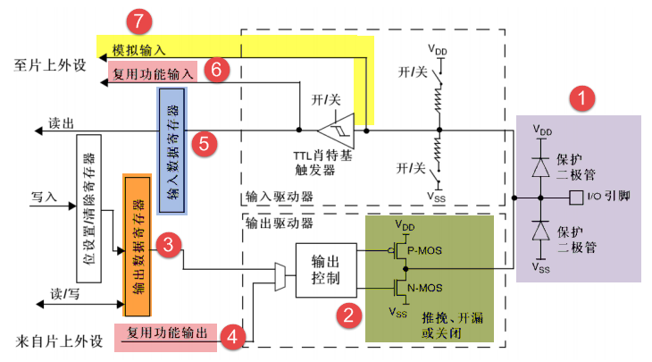
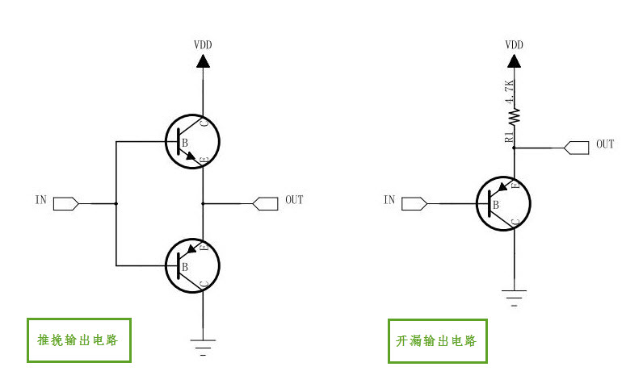
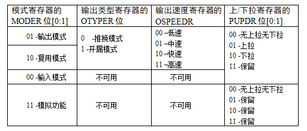
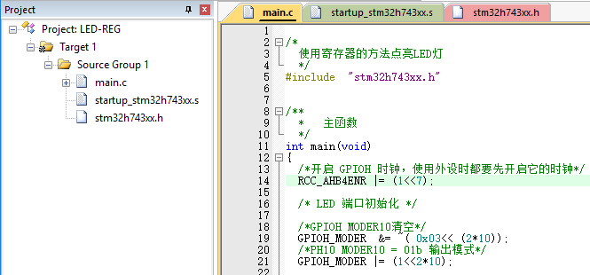
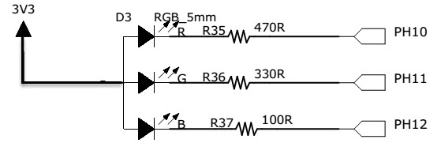
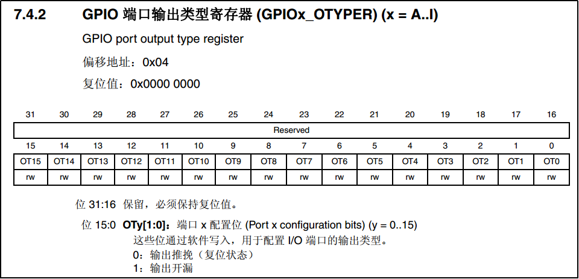

.. vim: syntax=rst

使用寄存器点亮LED灯
-------------------

本章参考资料：《STM32H74xxx参考手册》、《STM32H743规格书》。

学习本章时，配合《STM32H74xxx参考手册》
“通用I/O(GPIO)”章节一起阅读，效果会更佳，特别是涉及到寄存器说明的部分。关于建立工程时使用KEIL5的基本操作，请参考前面的章节。

GPIO简介
~~~~~~~~

GPIO是通用输入输出端口的简称，简单来说就是STM32可控制的引脚，STM32芯片的GPIO引脚与外部设备连接起来，从而实现与外部通讯、控制以及数据采集的功能。STM32芯片的GPIO被分成很多组，每组有16个引脚，如型号为STM32H743IIT6型号的芯片有GPIOA、GPIOB、GPIOC至GPIOK共11组GPIO，芯片一共176个引脚，其中GPIO就占了一大部分，所有的GPIO引脚都有基本的输入输出功能。

最基本的输出功能是由STM32控制引脚输出高、低电平，实现开关控制，如把GPIO引脚接入到LED灯，那就可以控制LED灯的亮灭，引脚接入到继电器或三极管，那就可以通过继电器或三极管控制外部大功率电路的通断。

最基本的输入功能是检测外部输入电平，如把GPIO引脚连接到按键，通过电平高低区分按键是否被按下。

GPIO框图剖析
~~~~~~~~~~~~

通过GPIO硬件结构框图，就可以从整体上深入了解GPIO外设及它的各种应用模式。该图从最右端看起，最右端就是代表STM32芯片引出的GPIO引脚，其余部件都位于芯片内部。

基本结构分析
^^^^^^^^^^^^

下面我们按图中的编号对GPIO端口的结构部件进行说明。

保护二极管及上、下拉电阻
''''''''''''''''''''''''

引脚的两个保护二级管可以防止引脚外部过高或过低的电压输入，当引脚电压高于V\ :sub:`DD`\ 时，
上方的二极管导通，当引脚电压低于V\ :sub:`SS`\ 时，下方的二极管导通，防止不正常电压引入芯片导致芯片烧毁。
尽管有这样的保护，并不意味着STM32的引脚能直接外接大功率驱动器件，如直接驱动电机，
强制驱动要么电机不转，要么导致芯片烧坏，必须要加大功率及隔离电路驱动。具体电压、电流范围可查阅《STM32H74xxx数据手册》。

上拉、下拉电阻，从它的结构我们可以看出，通过上、下拉对应的开关配置，我们可以控制引脚默认状态的电压，开启上拉的时候引脚电压为高电平，
开启下拉的时候引脚电压为低电平，这样可以消除引脚不定状态的影响。如引脚外部没有外接器件，或者外部的器件不干扰该引脚电压时，STM32的引脚都会有这个默认状态。

也可以设置“既不上拉也不下拉模式”，我们也把这种状态称为浮空模式，配置成这个模式时，直接用电压表测量其引脚电压为1点几伏，
这是个不确定值。所以一般来说我们都会选择给引脚设置“上拉模式”或“下拉模式”使它有默认状态。

STM32的内部上拉是“弱上拉”，即通过此上拉输出的电流是很弱的，如要求大电流还是需要外部上拉。
通过“上拉/下拉寄存器GPIOx_PUPDR”控制引脚的上、下拉以及浮空模式。

P-MOS管和N-MOS管
''''''''''''''''

GPIO引脚线路经过两个保护二极管后，向上流向“输入模式”结构，向下流向“输出模式”结构。先看输出模式部分，线路经过一个由P-MOS和N-MOS管组成的单元电路。这个结构使GPIO具有了“推挽输出”和“开漏输出”两种模式。

所谓的推挽输出模式，是根据这两个MOS管的工作方式来命名的。在该结构中输入高电平时，经过反向后，上方的P-MOS导通，下方的N-MOS关闭，
对外输出高电平；而在该结构中输入低电平时，经过反向后，N-MOS管导通，P-MOS关闭，对外输出低电平。当引脚高低电平切换时，
两个管子轮流导通，P管负责灌电流，N管负责拉电流，使其负载能力和开关速度都比普通的方式有很大的提高。推挽输出的低电平为0伏，
高电平为3.3伏，具体参考 图7_2_，它是推挽输出模式时的等效电路。

而在开漏输出模式时，上方的P-MOS管完全不工作。如果我们控制输出为0，低电平，则P-MOS管关闭，N-MOS管导通，使输出接地，
若控制输出为1 (它无法直接输出高电平)时，则P-MOS管和N-MOS管都关闭，所以引脚既不输出高电平，也不输出低电平，为高阻态。
为正常使用时必须接上拉电阻(可用STM32的内部上拉，但建议在STM32外部再接一个上拉电阻)，参考 图7_2_ 中的右侧等效电路。
它具“线与”特性，也就是说，若有很多个开漏模式引脚连接到一起时，只有当所有引脚都输出高阻态，才由上拉电阻提供高电平，
此高电平的电压为外部上拉电阻所接的电源的电压。若其中一个引脚为低电平，那线路就相当于短路接地，使得整条线路都为低电平，0伏。

推挽输出模式一般应用在输出电平为0和3.3伏而且需要高速切换开关状态的场合。在STM32的应用中，除了必须用开漏模式的场合，我们都习惯使用推挽输出模式。

开漏输出一般应用在I2C、SMBUS通讯等需要“线与”功能的总线电路中。除此之外，还用在电平不匹配的场合，如需要输出5伏的高电平，就可以在外部接一个上拉电阻，上拉电源为5伏，并且把GPIO设置为开漏模式，当输出高阻态时，由上拉电阻和电源向外输出5伏的电平。

通过 “输出类型寄存器GPIOx_OTYPER”可以控制GPIO端口是推挽模式还是开漏模式。

输出数据寄存器
''''''''''''''

前面提到的双MOS管结构电路的输入信号，是由GPIO“输出数据寄存器GPIOx_ODR”提供的，因此我们通过修改输出数据寄存器的值就可以修改GPIO引脚的输出电平。而“置位/复位寄存器GPIOx_BSRR”可以通过修改输出数据寄存器的值从而影响电路的输出。

复用功能输出
''''''''''''

“复用功能输出”中的“复用”是指STM32的其它片上外设对GPIO引脚进行控制，此时GPIO引脚用作该外设功能的一部分，算是第二用途。从其它外设引出来的“复用功能输出信号”与GPIO本身的数据据寄存器都连接到双MOS管结构的输入中，通过图中的梯形结构作为开关切换选择。

例如我们使用USART串口通讯时，需要用到某个GPIO引脚作为通讯发送引脚，这个时候就可以把该GPIO引脚配置成USART串口复用功能，由串口外设控制该引脚，发送数据。

输入数据寄存器
''''''''''''''

看GPIO结构框图的上半部分，它是GPIO引脚经过上、下拉电阻后引入的，它连接到施密特触发器，信号经过触发器后，
模拟信号转化为0、1的数字信号，然后存储在“输入数据寄存器GPIOx_IDR”中，通过读取该寄存器就可以了解GPIO引脚的电平状态。

复用功能输入
''''''''''''

与“复用功能输出”模式类似，在“复用功能输入模式”时，GPIO引脚的信号传输到STM32其它片上外设，由该外设读取引脚状态。

同样，如我们使用USART串口通讯时，需要用到某个GPIO引脚作为通讯接收引脚，这个时候就可以把该GPIO引脚配置成USART串口复用功能，使USART可以通过该通讯引脚的接收远端数据。

模拟输入输出
''''''''''''

当GPIO引脚用于ADC采集电压的输入通道时，用作“模拟输入”功能，此时信号是不经过施密特触发器的，因为经过施密特触发器后信号只有0、1两种状态，所以ADC外设要采集到原始的模拟信号，信号源输入必须在施密特触发器之前。类似地，当GPIO引脚用于DAC作为模拟电压输出通道时，此时作为“模拟输出”功能，DAC的模拟信号输出就不经过双MOS管结构了，在GPIO结构框图的右下角处，模拟信号直接输出到引脚。同时，当GPIO用于模拟功能时(包括输入输出)，引脚的上、下拉电阻是不起作用的，这个时候即使在寄存器配置了上拉或下拉模式，也不会影响到模拟信号的输入输出。

GPIO工作模式
^^^^^^^^^^^^

总结一下，由GPIO的结构决定了GPIO可以配置成以下模式：

输入模式(上拉/下拉/浮空)
'''''''''''''''''''''''''''''

在输入模式时，施密特触发器打开，输出被禁止。数据寄存器每隔1个AHB1时钟周期更新一次，可通过输入数据寄存器GPIOx_IDR读取I/O状态。其中AHB1的时钟如按默认配置一般为216MHz。

用于输入模式时，可设置为上拉、下拉或浮空模式。

输出模式(推挽/开漏，上拉/下拉)
''''''''''''''''''''''''''''''''''''''

在输出模式中，输出使能，推挽模式时双MOS管以方式工作，输出数据寄存器GPIOx_ODR可控制I/O输出高低电平。开漏模式时，只有N-MOS管工作，输出数据寄存器可控制I/O输出高阻态或低电平。输出速度可配置，有低速、中速、快速、高速的选项。此处的输出速度即I/O支持的高低电平状态最高切换频率，支持的频率越高，功耗越大，如果功耗要求不严格，把速度设置成最大即可。

此时施密特触发器是打开的，即输入可用，通过输入数据寄存器GPIOx_IDR可读取I/O的实际状态。

用于输出模式时，可使用上拉、下拉模式或浮空模式。但此时由于输出模式时引脚电平会受到ODR寄存器影响，而ODR寄存器对应引脚的位为0，即引脚初始化后默认输出低电平，所以在这种情况下，上拉只起到小幅提高输出电流能力，但不会影响引脚的默认状态。。

复用功能(推挽/开漏，上拉/下拉)
''''''''''''''''''''''''''''''''''''''

复用功能模式中，输出使能，输出速度可配置，可工作在开漏及推挽模式，但是输出信号源于其它外设，输出数据寄存器GPIOx_ODR无效；输入可用，通过输入数据寄存器可获取I/O实际状态，但一般直接用外设的寄存器来获取该数据信号。

用于复用功能时，可使用上拉、下拉模式或浮空模式。同输出模式，在这种情况下，初始化后引脚默认输出低电平，上拉只起到小幅提高输出电流能力，但不会影响引脚的默认状态。

模拟输入输出
''''''''''''''''''''''''''''''''''''''
模拟输入输出模式中，双MOS管结构被关闭，施密特触发器停用，上/下拉也被禁止。其它外设通过模拟通道进行输入输出。

通过对GPIO寄存器写入不同的参数，就可以改变GPIO的应用模式，再强调一下，要了解具体寄存器时一定要查阅《STM32H743xx参考手册》中对应外设的寄存器说明。
在GPIO外设中，通过设置“模式寄存器GPIOx_MODER”可配置GPIO的输入/输出/复用/模拟模式，“输出类型寄存器GPIOx_OTYPER”配置推挽/开漏模式，
配置“输出速度寄存器GPIOx_OSPEEDR”可选低速、中速、快速、高速输出速度，“上/下拉寄存器GPIOx_PUPDR”可配置上拉/下拉/浮空模式，
各寄存器的具体参数值见 表 7-1 GPIO寄存器的参数配置。

表 7-1 GPIO寄存器的参数配置。

实验：使用寄存器点亮LED灯
~~~~~~~~~~~~~~~~~~~~~~~~~

本小节中，我们以实例讲解如何通过控制寄存器来点亮LED灯。此处侧重于讲解原理，请您直接用KEIL5软件打开我们提供的实验例程配合阅读，先了解原理，学习完本小节后，再尝试自己建立一个同样的工程。本节配套例程名称为“使用寄存器点亮LED灯”，在工程目录下找到后缀为“.uvprojx”的文件，用KEIL5打开即可。

自己尝试新建工程时，请对照查阅《新建工程—寄存器版》章节。若没有安装KEIL5软件，请参考《如何安装KEIL5》章节。

打开该工程，见 图7_7_，可看到一共有三个文件，分别startup_STM32H743xx.s 、STM32H743xx.h 以及main.c
接下来我们讲会对这三个工程文件进行讲解。

硬件连接
^^^^^^^^

在本教程中STM32芯片与LED灯的连接见 图7_8_.

图中从3个LED灯的阳极引出连接到3.3V电源，阴极各经过1个电阻引入至STM32的3个GPIO引脚PH10、PH11、PH12中，所以我们只要控制这三个引脚输出高低电平，即可控制其所连接LED灯的亮灭。如果您的实验板STM32连接到LED灯的引脚或极性不一样，只需要修改程序到对应的GPIO引脚即可，工作原理都是一样的。

我们的目标是把GPIO的引脚设置成推挽输出模式并且默认下拉，输出低电平，这样就能让LED灯亮起来了。

启动文件
^^^^^^^^

名为“startup_STM32H743xx.s”的文件，它里边使用汇编语言写好了基本程序，当STM32芯片上电启动的时候，
首先会执行这里的汇编程序，从而建立起C语言的运行环境，所以我们把这个文件称为启动文件。
该文件使用的汇编指令是Cortex-M7内核支持的指令，可从《Cortex®-M7内核编程手册》查到，
也可参考《Cortex-M3权威指南中文》，M7跟M3大部分汇编指令相同。

startup_STM32H743xx.s文件是由官方提供的，一般有需要也是在官方的基础上修改，不会自己完全重写。
该文件可以从 KEIL5 安装目录找到，也可以从 ST 库里面找到，找到该文件后把启动文件添加到工程里面即可。
不同型号的芯片以及不同编译环境下使用的汇编文件是不一样的，但功能相同。

对于启动文件这部分我们主要总结它的功能，不详解讲解里面的代码，其功能如下：

-  初始化堆栈指针SP;

-  初始化程序计数器指针PC;

-  设置堆、栈的大小;

-  初始化中断向量表的入口地址;

-  配置外部SRAM作为数据存储器（这个由用户配置，一般的开发板可没有外部SRAM）;

-  调用SystemIni() 函数配置STM32的系统时钟。

-  设置C库的分支入口“__main”（最终用来调用main函数）;

先去除繁枝细节，挑重点的讲，主要理解最后两点，在启动文件中有一段复位后立即执行的程序，代码见
代码清单7_1_。在实际工程中阅读时，可使用编辑器的搜索(Ctrl+F)功能查找这段代码在文件中的位置，搜索Reset_Handler即可找到。

代码清单 7‑1复位后执行的程序

.. code-block:: c
   :name: 代码清单7_1

    ;Reset handler
    Reset_Handler    PROC
    EXPORT  Reset_Handler             [WEAK]
        IMPORT  SystemInit
        IMPORT  __main

            LDR     R0, =SystemInit
            BLX     R0
            LDR     R0, =__main
            BX      R0
            ENDP

开头的是程序注释，在汇编里面注释用的是“;”，相当于 C 语言的“//”注释符

第二行是定义了一个子程序：Reset_Handler。PROC 是子程序定义伪指令。这里就相当于C语言里定义了一个函数，函数名为Reset_Handler。

第三行 EXPORT 表示 Reset_Handler 这个子程序可供其他模块调用。相当于C语言的函数声明。
关键字[WEAK] 表示弱定义，如果编译器发现在别处定义了同名的函数，则在链接时用别处的地址进行链接，
如果其它地方没有定义，编译器也不报错，以此处地址进行链接，如果不理解WEAK，那就忽略它好了。

第四行和第五行 IMPORT 说明 SystemInit 和__main 这两个标号在其他文件，
在链接的时候需要到其他文件去寻找。相当于C语言中，从其它文件引入函数声明。
以便下面对外部函数进行调用。

SystemInit 需要由我们自己实现，即我们要编写一个具有该名称的函数，
用来初始化 STM32 芯片的时钟，一般包括初始化AHB、APB等各总线的时钟，
需要经过一系列的配置STM32才能达到稳定运行的状态。

__main 其实不是我们定义的(不要与C语言中的main函数混淆)，当编译器编译时，
只要遇到这个标号就会定义这个函数，该函数的主要功能是：负责初始化栈、堆，配置系统环境，
准备好C语言并在最后跳转到用户自定义的 main 函数，从此来到 C 的世界。

第六行把 SystemInit 的地址加载到寄存器 R0。

第七行程序跳转到 R0 中的地址执行程序，即执行SystemInit函数的内容。

第八行把__main 的地址加载到寄存器 R0。

第九行程序跳转到 R0 中的地址执行程序，即执行__main函数，执行完毕之后就去到我们熟知的 C 世界，进入main函数。

第十行表示子程序的结束。

总之，看完这段代码后，了解到如下内容即可：我们需要在外部定义一个SystemInit函数设置STM32的时钟；STM32上电后，会执行SystemInit函数，最后执行我们C语言中的main函数。

STM32H743xx.h文件
^^^^^^^^^^^^^^^^^^^^

看完启动文件，那我们立即写SystemInit和main函数吧？别着急，定义好了SystemInit函数和main我们又能写什么内容？
连接LED灯的GPIO引脚，是要通过读写寄存器来控制的，就这样空着手，如何控制寄存器呢。
在上一章，我们知道寄存器就是特殊的内存空间，可以通过指针操作访问寄存器。
所以此处我们根据STM32的存储分配先定义好各个寄存器的地址，把这些地址定义都统一写在stm32h743xx.h文件中，
见 代码清单7_2_。

代码清单 7‑2 外设地址定义

.. code-block:: c
   :name: 代码清单7_2

   /*片上外设基地址  */
   #define PERIPH_BASE           ((unsigned int)0x40000000)
   /*总线基地址 */
   #define D3_AHB1PERIPH_BASE    (PERIPH_BASE + 0x18020000)
   /*GPIO外设基地址*/
   #define GPIOH_BASE            (D3_AHB1PERIPH_BASE + 0x1C00)

   /* GPIOH寄存器地址,强制转换成指针 */
   #define GPIOH_MODER       *(unsigned int*)(GPIOH_BASE+0x00)
   #define GPIOH_OTYPER      *(unsigned int*)(GPIOH_BASE+0x04)
   #define GPIOH_OSPEEDR     *(unsigned int*)(GPIOH_BASE+0x08)
   #define GPIOH_PUPDR       *(unsigned int*)(GPIOH_BASE+0x0C)
   #define GPIOH_IDR         *(unsigned int*)(GPIOH_BASE+0x10)
   #define GPIOH_ODR         *(unsigned int*)(GPIOH_BASE+0x14)
   #define GPIOH_BSRRL       *(unsigned int*)(GPIOH_BASE+0x18)
   #define GPIOH_BSRRH       *(unsigned int*)(GPIOH_BASE+0x1A)
   #define GPIOH_LCKR        *(unsigned int*)(GPIOH_BASE+0x1C)
   #define GPIOH_AFRL        *(unsigned int*)(GPIOH_BASE+0x20)
   #define GPIOH_AFRH        *(unsigned int*)(GPIOH_BASE+0x24)

   /*RCC外设基地址*/
   #define RCC_BASE          (D3_AHB1PERIPH_BASE + 0x4400)

   /*RCC的AHB1时钟使能寄存器地址,强制转换成指针*/
   #define RCC_AHB4ENR       *(unsigned int*)(RCC_BASE+0xE0)

GPIO外设的地址跟上一章讲解的相同，不过此处把寄存器的地址值都直接强制转换成了指针，方便使用。
代码的最后两段是RCC外设寄存器的地址定义，RCC外设是用来设置时钟的，以后我们会详细分析，本实验中只要了解到使用GPIO外设必须开启它的时钟即可。

main文件
^^^^^^^^

现在就可以开始编写程序，在main文件中先编写一个 main
函数，里面什么都没有，暂时为空。

.. code-block:: c

    int main (void)

    {

    }

此时直接编译的话，会出现如下错误：

“Error: L6218E: Undefined symbol SystemInit (referred from
startup_STM32H743xx.o)”

错误提示SystemInit 没有定义。从分析启动文件时我们知道，Reset_Handler 调用了该函数用来初始化SMT32系统时钟，
为了简单起见，我们在 main 文件里面定义一个 SystemInit 空函数，什么也不做，为的是骗过编译器，
把这个错误去掉。关于配置系统时钟我们在后面再写。当我们不配置系统时钟时，STM32芯片会自动按系统内部的默认时钟运行，
程序还是能跑的。我们在main中添加如下函数：

.. code-block:: c

    // 函数为空，目的是为了骗过编译器不报错

    void SystemInit(void)

    {

    }

这时再编译就没有错了，完美解决。还有一个方法就是在启动文件中把有关SystemInit 的代码注释掉也可以，见 另一种方法_。

.. code-block:: c
    :name: 另一种方法

    ; Reset handler
        Reset_Handler    PROC
                EXPORT  Reset_Handler             [WEAK]
                ;IMPORT  SystemInit
                IMPORT  __main

                ;LDR     R0, =SystemInit
                ;BLX     R0
                LDR     R0, =__main
                BX      R0
                ENDP

接下来在main函数中添加代码，对寄存器进行控制，有关GPIO寄存器的详细描述请参考
《STM32H74xxx参考手册》 “通用I/O(GPIO)”章节的寄存器描述部分。

GPIO模式
''''''''

首先我们把连接到LED灯的PH10引脚配置成输出模式，即配置GPIO的MODER寄存器，见 图7_9_。
MODER中包含0-15号引脚，每个引脚占用2个寄存器位。这两个寄存器位设置成“01”时即为GPIO的输出模式，见 代码清单7_4_。

代码清单 7‑4 配置输出模式

.. code-block:: c
   :name: 代码清单7_4

    /*GPIOH MODER10清空*/
    GPIOH_MODER  &= ~( 0x03<< (2*10));
    /*PH10 MODER10 = 01b 输出模式*/
    GPIOH_MODER |= (1<<2*10);

.. image:: media/image9.png
   :align: center
   :alt: 图 7‑9 GPIO端口控制低寄存器CRL
   :name: 图7_9

图 7-7 MODER寄存器说明(摘自《STM32H74xxx参考手册》)

在代码中，我们先把GPIOH MODER寄存器的MODER10对应位清0，然后再向它赋值“01”，从而使GPIOH10引脚设置成输出模式。

代码中使用了“&=~”、“\|=”这种位操作方法是为了避免影响到寄存器中的其它位，
因为寄存器不能按位读写，假如我们直接给MODER寄存器赋值：

.. code-block:: c

   GPIOF_MODER = 0x0010 0000;

这时MODER10的两个位被设置成“01”输出模式，但其它GPIO引脚就有意见了，因为其它引脚的MODER位都已被设置成00的输入模式。
所以为了不影响寄存器的其它位，必须使用“&=~”（清0）、“\|=”（置位）这种位操作方法来实现对寄存器的写操作。

如果对此处“&=”“\|=”这样的位操作方法还不理解，请阅读前面的《规范的位操作方法》小节。
熟悉这种方法之后，会发现这样按位操作其实比直接赋值还要直观。

输出类型
''''''''

GPIO输出有推挽和开漏两种类型，我们了解到开漏类型不能直接输出高电平，要输出高电平还要在芯片外部接上拉电阻，
不符合我们的硬件设计，所以我们直接使用推挽模式。配置OTYPER寄存中的OTYPER10寄存器位，具体见 图7_12_。
该位设置为0时PH10引脚即为推挽模式，具体见 代码清单7_8_。

代码清单 7-8 设置为推挽模式

.. code-block:: c
   :name: 代码清单7_8

    /*GPIOH OTYPER10清空*/
    GPIOH_OTYPER &= ~(1<<1*10);
    /*PH10 OTYPER10 = 0b 推挽模式*/
    GPIOH_OTYPER |= (0<<1*10);

输出速度
''''''''

GPIO引脚的输出速度是引脚支持高低电平切换的最高频率，本实验可以随便设置。
此处我们配置OSPEEDR寄存器中的寄存器位OSPEEDR10即可控制PH10的输出速度，
寄存器描述见 图7_13_，具体代码见 代码清单7_9_。

.. image:: media/image13.png
   :align: center
   :alt: 图 7-13 OSPEEDR寄存器说明(摘自《STM32H74xxx参考手册》)
   :name: 图7_13

代码清单 7-9 设置为推挽模式

.. code-block:: c
   :name: 代码清单7_9

    /*GPIOH OSPEEDR10清空*/
    GPIOH_OSPEEDR &= ~(0x03<<2*10);
    /*PH10 OSPEEDR10 = 0b 速率为低速*/
    GPIOH_OSPEEDR |= (0<<2*10);

上/下拉模式
''''''''''''''''

当GPIO引脚用于输入时，引脚的上/下拉模式可以控制引脚的默认状态。但现在我们的GPIO引脚用于输出，
引脚受ODR寄存器影响，ODR寄存器对应引脚位初始初始化后默认值为0，引脚输出低电平，
所以这时我们配置上/下拉模式都不会影响引脚电平状态。但因此处上拉能小幅提高电流输出能力，
我们配置它为上拉模式，即配置PUPDR寄存器的PUPDR10位，设置为二进制值“01”，
见 代码清单7_10_。

代码清单 7-9 设置为下拉模式

.. code-block:: c
   :name: 代码清单7_10

    /*GPIOH PUPDR10清空*/
    GPIOH_PUPDR &= ~(0x03<<2*10);
    /*PH10 PUPDR10 = 01b 下拉模式*/
    GPIOH_PUPDR |= (1<<2*10);

控制引脚输出电平
''''''''''''''''

在输出模式时，对BSRR寄存器和ODR寄存器写入参数即可控制引脚的电平状态。
简单起见，此处我们使用BSRR寄存器控制，对相应的BR10位设置为1时PH10即为低电平，
点亮LED灯，对它的BS10位设置为1时PH10即为高电平，关闭LED灯，见 代码清单7_5_。

代码清单 7‑5 控制引脚输出电平

.. code-block:: c
   :name: 代码清单7_5

    /*PH10 BSRR寄存器的 BR10置1，使引脚输出低电平*/
    GPIOH_BSRR |= (1<<16<<10);

    /*PH10 BSRR寄存器的 BS10置1，使引脚输出高电平*/
    GPIOH_BSRR |= (1<<10);

开启外设时钟
''''''''''''

设置完GPIO的引脚，控制电平输出，以为现在总算可以点亮 LED 了吧，其实还差最后一步。

在《STM32芯片架构》的外设章节中提到STM32 外设很多，为了降低功耗，每个外设都对应着一个时钟，
在芯片刚上电的时候这些时钟都是被关闭的，如果想要外设工作，必须把相应的时钟打开。

STM32 的所有外设的时钟由一个专门的外设来管理，叫 RCC（reset and clockcontrol），
RCC 在《 STM32H743XX参考手册》的第五章。

所有的 GPIO都挂载到 AHB4 总线上，所以它们的时钟由AHB4外设时钟使能寄存器(RCC_AHB4ENR)来控制，
其中 GPIOH 端口的时钟由该寄存器的位 7 写 1 使能，开启GPIOH端口时钟。
以后我们还会详细解释STM32的时钟系统，此处我们了解到在访问GPIO的寄存器之前，
要先使能它的时钟即可，使用 代码清单7_6_ 中的代码可以开启GPIOH时钟。

代码清单 7‑6 开启端口时钟

.. code-block:: c
   :name: 代码清单7_6

   /*开启 GPIOH 时钟，使用外设时都要先开启它的时钟*/
   RCC_AHB4ENR |= (1<<7);

水到渠成
''''''''

开启时钟，配置引脚模式，控制电平，经过这三步，我们总算可以控制一个
LED了。现在我们完整组织下用 STM32 控制一个 LED 的代码，见 代码清单7_7_。

代码清单 7‑7 main文件中控制LED灯的代码

.. code-block:: c
   :name: 代码清单7_7

   /*
   使用寄存器的方法点亮LED灯
   */
   #include  "stm32h743xx.h"

   /**
   *   主函数
   */
   int main(void)
   {
      /*开启 GPIOH 时钟，使用外设时都要先开启它的时钟*/
      RCC_AHB4ENR |= (1<<7);

      /* LED 端口初始化 */

      /*GPIOH MODER10清空*/
      GPIOH_MODER  &= ~( 0x03<< (2*10));
      /*PH10 MODER10 = 01b 输出模式*/
      GPIOH_MODER |= (1<<2*10);

      /*GPIOH OTYPER10清空*/
      GPIOH_OTYPER &= ~(1<<1*10);
      /*PH10 OTYPER10 = 0b 推挽模式*/
      GPIOH_OTYPER |= (0<<1*10);

      /*GPIOH OSPEEDR10清空*/
      GPIOH_OSPEEDR &= ~(0x03<<2*10);
      /*PH10 OSPEEDR10 = 0b 速率2MHz*/
      GPIOH_OSPEEDR |= (0<<2*10);

      /*GPIOH PUPDR10清空*/
      GPIOH_PUPDR &= ~(0x03<<2*10);
      /*PH10 PUPDR10 = 01b 上拉模式*/
      GPIOH_PUPDR |= (1<<2*10);

      /*PH10 BSRR寄存器的 BR10置1，使引脚输出低电平*/
      GPIOH_BSRRH |= (1<<10);

      /*PH10 BSRR寄存器的 BS10置1，使引脚输出高电平*/
      //GPIOH_BSRRL |= (1<<10);

      while (1);

   }

   // 函数为空，目的是为了骗过编译器不报错
   void SystemInit(void)
   {
   }

在本章节中，STM32H743xx.h文件及main文件的内容(RCC相关的除外)。

下载验证
^^^^^^^^

把编译好的程序下载到开发板并复位，可看到板子上的LED灯被点亮。
