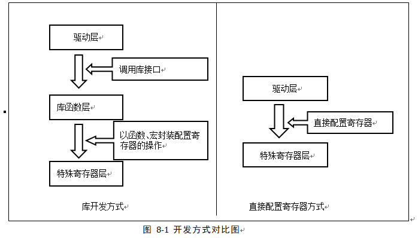

.. vim: syntax=rst

自己写库—构建库函数雏形
-----------------------

本章参考资料：《STM32H74xxx参考手册》、《STM32H743xx数据手册》。

虽然我们上面用寄存器点亮了
LED，乍看一下好像代码也很简单，但是我们别侥幸以后就可以一直用寄存器开发。在用寄存器点亮
LED 的时候，我们会发现 STM32 的寄存器都是 32
位的，每次配置的时候都要对照着《STM32H74xxx参考手册》中寄存器的说明，然后根据说明对每个控制的寄存器位写入特定参数，因此在配置的时候非常容易出错，而且代码还很不好理解，不便于维护。所以学习
STM32
最好的方法是用软件库，然后在软件库的基础上了解底层，学习遍所有寄存器。

什么是STM32函数库
~~~~~~~~~~~~~~~~~

在STM32F7之后ST官方不再支持标准的函数库，它是由ST公司针对STM32提供的函数接口，
即API (Application Program Interface)，
开发者可调用这些函数接口来配置STM32的寄存器，
使开发人员得以脱离最底层的寄存器操作，有开发快速，易于阅读，维护成本低等优点。

当我们调用库API的时候不需要挖空心思去了解库底层的寄存器操作，就像当年我们刚开始学习C语言的时候，
用prinft()函数时只是学习它的使用格式，并没有去研究它的源码实现，但需要深入研究的时候，经过千锤百炼的库API源码就是最佳学习范例。

实际上，库是架设在寄存器与用户驱动层之间的代码，向下处理与寄存器直接相关的配置，向上为用户提供配置寄存器的接口。
库开发方式与直接配置寄存器方式的区别见 图8_1_。

为什么采用库来开发及学习？
~~~~~~~~~~~~~~~~~~~~~~~~~~~~~~

在以前8位机时代的程序开发中，一般直接配置芯片的寄存器，控制芯片的工作方式，如中断，定时器等。
配置的时候，常常要查阅寄存器表，看用到哪些配置位，为了配置某功能，该置1还是置0。这些都是很琐碎的、机械的工作，
因为8位机的软件相对来说较简单，而且资源很有限，所以可以直接配置寄存器的方式来开发。

对于STM32，因为外设资源丰富，带来的必然是寄存器的数量和复杂度的增加，这时直接配置寄存器方式的缺陷就突显出来了：

(1) **开发速度慢**

(2) **程序可读性差**

(3) **维护复杂**

这些缺陷直接影响了开发效率，程序维护成本，交流成本。库开发方式则正好弥补了这些缺陷。

而坚持采用直接配置寄存器的方式开发的程序员，会列举以下原因：

(1) **具体参数更直观**

(2) **程序运行占用资源少**

相对于库开发的方式，直接配置寄存器方式生成的代码量的确会少一点，但因为STM32有充足的资源，权衡库的优势与不足，绝大部分时候，我们愿意牺牲一点CPU资源，选择库开发。一般只有在对代码运行时间要求极苛刻的地方，才用直接配置寄存器的方式代替，如频繁调用的中断服务函数。

对于库开发与直接配置寄存器的方式，就好比编程是用汇编好还是用 C
好一样。在STM32F1系列刚推出函数库时引起程序员的激烈争论，但是，随着ST库的完善与大家对库的了解，更多的程序员选择了库开发。现在全新的HAL库几乎全平台兼容，上层API是通用的，STM32F4系列和STM32F7系列函数库相互移植改动非常小。而如果要移植用寄存器写的程序，那简直跟脱胎换骨差不多。

用库来进行开发，市场已有定论，用户群说明了一切，但对于STM32的学习仍然有人认为用寄存器好，而且汇编不是还没退出大学教材么？认为这种方法直观，能够了解到是配置了哪些寄存器，怎样配置寄存器。事实上，库函数的底层实现恰恰是直接配置寄存器方式的最佳例子，它代替我们完成了寄存器配置的工作，而想深入了解芯片是如何工作的话，只要直接查看库函数的最底层实现就能理解，相信你会为它严谨、优美的实现方式而陶醉，要想修炼C语言，就从ST的库开始吧。所以在以后的章节中，使用软件库是我们的重点，而且我们通过讲解库API去高效地学习STM32的寄存器，并不至于因为用库学习，就不会用寄存器控制STM32芯片。

实验：构建库函数雏形
~~~~~~~~~~~~~~~~~~~~

虽然库的优点多多，但很多人对库还是很忌惮，因为一开始用库的时候有很多代码，很多文件，不知道如何入手。不知道您是否认同这么一句话：一切的恐惧都来源于无知。我们对库忌惮那是因为我们不知道什么是库，不知道库是怎么实现的。

接下来，我们在寄存器点亮 LED
的代码上继续完善，把代码一层层封装，实现库的最初的雏形，相信经过这一步的学习后，您对库的运用会游刃有余。这里我们只讲如何实现GPIO函数库，其他外设的我们直接参考STM32HAL库学习即可，不必自己写。

下面请打开本章配套例程“自己写库—构建库函数雏形”来阅读理解，该例程是在上一章的基础上修改得来的。

修改寄存器地址封装
^^^^^^^^^^^^^^^^^^^^

上一章中我们在操作寄存器的时候，操作的都是寄存器的绝对地址，如果每个外设寄存器都这样操作，那将非常麻烦。
我们考虑到外设寄存器的地址都是基于外设基地址的偏移地址，都是在外设基地址上逐个连续递增的，
每个寄存器占 32 个字节或者 16 个字节，这种方式跟结构体里面的成员类似。所以我们可以定义一种外设结构体，
结构体的地址等于外设的基地址，结构体的成员等于寄存器，
成员的排列顺序跟寄存器的顺序一样。这样我们操作寄存器的时候就不用每次都找到绝对地址，
只要知道外设的基地址就可以操作外设的全部寄存器，即操作结构体的成员即可。

在工程中的“STM32H743xx.h”文件中，我们使用结构体封装GPIO及RCC外设的的寄存器，具体见 代码清单8_1_。
结构体成员的顺序按照寄存器的偏移地址从低到高排列，成员类型跟寄存器类型一样。如不理解C语言对寄存器的封的语法原理，请参考《C语言对寄存器的封装》小节。

代码清单 8‑1 封装寄存器列表

.. code-block:: c
   :name: 代码清单8_1

    //volatile表示易变的变量，防止编译器优化

    #define     __IO    volatile

    typedef unsigned int uint32_t;

    typedef unsigned short uint16_t;

    typedef unsigned char  uint8_t;

    /* GPIO寄存器列表 */
    typedef struct

    {
        __IO  uint32_t MODER;    /*GPIO模式寄存器          地址偏移: 0x00      */

        __IO  uint32_t OTYPER;   /*GPIO输出类型寄存器        地址偏移: 0x04      */

        __IO  uint32_t OSPEEDR;  /*GPIO输出速度寄存器        地址偏移: 0x08      */

        __IO  uint32_t PUPDR;    /*GPIO上拉/下拉寄存器       地址偏移: 0x0C          */

        __IO  uint32_t IDR;      /*GPIO输入数据寄存器        地址偏移: 0x10          */

        __IO  uint32_t ODR;      /*GPIO输出数据寄存器        地址偏移: 0x14          */

        __IO  uint16_t BSRRL;    /*GPIO置位/复位寄存器（低16位）         地址偏移: 0x18  */

        __IO  uint16_t BSRRH;    /*GPIO置位/复位寄存器（高16位）         地址偏移: 0x1A  */

        __IO  uint32_t LCKR;     /*GPIO配置锁定寄存器        地址偏移: 0x1C      */

        __IO  uint32_t AFR[2];   /*GPIO复用功能配置寄存器      地址偏移: 0x20-0x24     */

    } GPIO_TypeDef;
    /* RCC寄存器列表*/

    typedef struct
    {
        __IO uint32_t CR;             /* !< RCC时钟控制寄存器，地址偏移量：0x00  */
        __IO uint32_t ICSCR;          /* !< RCC内部时钟源校准寄存器，地址偏移量：0x04  */
        __IO uint32_t CRRCR;          /* !< 时钟恢复RC寄存器，地址偏移量：0x08  */
        uint32_t     RESERVED0;       /* !< 保留，地址偏移：0x0C  */
        __IO uint32_t CFGR;           /* !< RCC时钟配置寄存器，地址偏移量：0x10  */
        uint32_t     RESERVED1;       /* !< 保留，地址偏移量：0x14  */
        __IO uint32_t D1CFGR;         /* !< RCC域1配置寄存器，地址偏移量：0x18 */
        __IO uint32_t D2CFGR;         /* !< RCC域2配置寄存器，地址偏移量：0x1C */
        __IO uint32_t D3CFGR;         /* !< RCC域3配置寄存器，地址偏移量：0x20  */
        uint32_t     RESERVED2;       /* !< 保留，地址偏移量：0x24  */
        __IO uint32_t PLLCKSELR;      /* !< RCC PLL时钟源选择寄存器，地址偏移量：0x28  */
        __IO uint32_t PLLCFGR;        /* !< RCC PLL配置寄存器，地址偏移量：0x2C  */
        __IO uint32_t PLL1DIVR;       /* !< RCC PLL1分频器配置寄存器，地址偏移：0x30  */
        __IO uint32_t PLL1FRACR;      /* !< RCC PLL1小数分频器配置寄存器，地址偏移量：0x34  */
        __IO uint32_t PLL2DIVR;       /* !< RCC PLL2分频器配置寄存器，地址偏移：0x38  */
        __IO uint32_t PLL2FRACR;      /* !< RCC PLL2小数分频器配置寄存器，地址偏移量：0x3C  */
        __IO uint32_t PLL3DIVR;       /* !< RCC PLL3分频器配置寄存器，地址偏移量：0x40  */
        __IO uint32_t PLL3FRACR;      /* !< RCC PLL3小数分频器配置寄存器，地址偏移量：0x44  */
        uint32_t      RESERVED3;      /* !< 保留，地址偏移量：0x48  */
        __IO uint32_t  D1CCIPR;       /* !< RCC域1内核时钟配置寄存器地址偏移量：0x4C  */
        __IO uint32_t  D2CCIP1R;      /* !< RCC域2内核时钟配置寄存器地址偏移量：0x50  */
        __IO uint32_t  D2CCIP2R;      /* !< RCC域2内核时钟配置寄存器地址偏移量：0x54  */
        __IO uint32_t  D3CCIPR;       /* !< RCC域3内核时钟配置寄存器地址偏移量：0x58  */
        uint32_t      RESERVED4;      /* !< 保留，地址偏移：0x5C  */
        __IO uint32_t  CIER;          /* !< RCC时钟源中断使能寄存器地址偏移量：0x60  */
        __IO uint32_t  CIFR;          /* !< RCC时钟源中断标志寄存器地址偏移量：0x64  */
        __IO uint32_t  CICR;          /* !< RCC时钟源中断清除寄存器地址偏移量：0x68  */
        uint32_t     RESERVED5;       /* !< 保留，地址偏移：0x6C  */
        __IO uint32_t  BDCR;          /* !< RCC Vswitch备份域控制寄存器，地址偏移量：0x70  */
        __IO uint32_t  CSR;           /* !< RCC时钟控制和状态寄存器，地址偏移：0x74  */
        uint32_t     RESERVED6;       /* !< 保留，地址偏移量：0x78  */
        __IO uint32_t AHB3RSTR;       /* !< RCC AHB3外设复位寄存器，地址偏移：0x7C  */
        __IO uint32_t AHB1RSTR;       /* !< RCC AHB1外设复位寄存器，地址偏移量：0x80  */
        __IO uint32_t AHB2RSTR;       /* !< RCC AHB2外设复位寄存器，地址偏移量：0x84  */
        __IO uint32_t AHB4RSTR;       /* !< RCC AHB4外设复位寄存器，地址偏移量：0x88  */
        __IO uint32_t APB3RSTR;       /* !< RCC APB3外设复位寄存器，地址偏移量：0x8C  */
        __IO uint32_t APB1LRSTR;      /* !< RCC APB1外设复位寄存器低位，地址偏移：0x90  */
        __IO uint32_t APB1HRSTR;      /* !< RCC APB1外设复位寄存器高位，地址偏移：0x94  */
        __IO uint32_t APB2RSTR;       /* !< RCC APB2外设复位寄存器，地址偏移量：0x98  */
        __IO uint32_t APB4RSTR;       /* !< RCC APB4外设复位寄存器，地址偏移：0x9C  */
        __IO uint32_t GCR;            /* !< RCC RCC全局控制寄存器，地址偏移量：0xA0  */
        uint32_t     RESERVED7;       /* !< 保留，地址偏移量：0xA4  */
        __IO uint32_t D3AMR;          /* !< RCC域3自主模式寄存器，地址偏移量：0xA8  */
        uint32_t     RESERVED8[9];    /* !< 保留，0xAC-0xCC 地址偏移量：0xAC  */
        __IO uint32_t RSR;            /* !< RCC复位状态寄存器，地址偏移：0xD0  */
        __IO uint32_t AHB3ENR;        /* !< RCC AHB3外设时钟寄存器，地址偏移量：0xD4  */
        __IO uint32_t AHB1ENR;        /* !< RCC AHB1外设时钟寄存器，地址偏移量：0xD8  */
        __IO uint32_t AHB2ENR;        /* !< RCC AHB2外设时钟寄存器，地址偏移量：0xDC  */
        __IO uint32_t AHB4ENR;        /* !< RCC AHB4外设时钟寄存器，地址偏移量：0xE0  */
        __IO uint32_t APB3ENR;        /* !< RCC APB3外设时钟寄存器，地址偏移量：0xE4  */
        __IO uint32_t APB1LENR;       /* !< RCC APB1外设时钟低字寄存器，地址偏移：0xE8  */
        __IO uint32_t APB1HENR;       /* !< RCC APB1外设时钟高字寄存器，地址偏移：0xEC  */
        __IO uint32_t APB2ENR;        /* !< RCC APB2外设时钟寄存器，地址偏移量：0xF0 */
        __IO uint32_t APB4ENR;        /* !< RCC APB4外设时钟寄存器，地址偏移量：0xF4  */
        uint32_t      RESERVED9;      /* !< 保留，地址偏移量：0xF8  */
        __IO uint32_t AHB3LPENR;      /* !< RCC AHB3外设睡眠时钟寄存器，地址偏移量：0xFC  */
        __IO uint32_t AHB1LPENR;      /* !< RCC AHB1外设睡眠时钟寄存器，地址偏移量：0x100 */
        __IO uint32_t AHB2LPENR;      /* !< RCC AHB2外设睡眠时钟寄存器，地址偏移量：0x104 */
        __IO uint32_t AHB4LPENR;      /* !< RCC AHB4外设睡眠时钟寄存器，地址偏移量：0x108 */
        __IO uint32_t APB3LPENR;      /* !< RCC APB3外设睡眠时钟寄存器，地址偏移量：0x10C */
        __IO uint32_t APB1LLPENR;    /* !< RCC APB1外设睡眠时钟低位字寄存器，地址偏移量：0x110 */
        __IO uint32_t APB1HLPENR;     /* !< RCC APB1外设休眠时钟高字寄存器，地址偏移量：0x114 */
        __IO uint32_t APB2LPENR;      /* !< RCC APB2外设睡眠时钟寄存器，地址偏移量：0x118 */
        __IO uint32_t APB4LPENR;      /* !< RCC APB4外设睡眠时钟寄存器，地址偏移量：0x11C */
        uint32_t     RESERVED10[4];   /* !< 保留，0x120-0x12C地址偏移量：0x120 */
    } RCC_TypeDef;

这段代码在每个结构体成员前增加了一个“__IO”前缀，它的原型在这段代码的开头，代表了C语言中的关键字“volatile”，在C语言中该关键字用于修饰易变的变量，要求编译器不要优化。这些结构体内的成员，都代表着寄存器，而寄存器很多时候是由外设或STM32芯片状态修改的，也就是说即使CPU不执行代码修改这些变量，变量的值也有可能被外设修改、更新，所以每次使用这些变量的时候，我们都要求CPU去该变量的地址重新访问。若没有这个关键字修饰，在某些情况下，编译器认为没有代码修改该变量，就直接从CPU的某个缓存获取该变量值，这时可以加快执行速度，但该缓存中的是陈旧数据，与我们要求的寄存器最新状态可能会有出入。

定义访问外设的结构体指针
^^^^^^^^^^^^^^^^^^^^^^^^^^^^

以结构体的形式定义好了外设寄存器后，使用结构体前还需要给结构体的首地址赋值，才能访问到需要的寄存器。
为方便操作，我们给每个外设都定义好指向它地址的结构体指针，具体见 代码清单寄存器结构体指针宏定义_

.. code-block:: c
   :name: 代码清单寄存器结构体指针宏定义

    /*定义GPIOA-K 寄存器结构体指针*/
    #define GPIOA               ((GPIO_TypeDef *) GPIOA_BASE)
    #define GPIOB               ((GPIO_TypeDef *) GPIOB_BASE)
    #define GPIOC               ((GPIO_TypeDef *) GPIOC_BASE)
    #define GPIOD               ((GPIO_TypeDef *) GPIOD_BASE)
    #define GPIOE               ((GPIO_TypeDef *) GPIOE_BASE)
    #define GPIOF               ((GPIO_TypeDef *) GPIOF_BASE)
    #define GPIOG               ((GPIO_TypeDef *) GPIOG_BASE)
    #define GPIOH               ((GPIO_TypeDef *) GPIOH_BASE)
    #define GPIOI               ((GPIO_TypeDef *) GPIOI_BASE)
    #define GPIOJ               ((GPIO_TypeDef *) GPIOJ_BASE)
    #define GPIOK               ((GPIO_TypeDef *) GPIOK_BASE)

    /*定义RCC外设 寄存器结构体指针*/
    #define RCC                 ((RCC_TypeDef *) RCC_BASE)

这些宏通过强制类型转换把外设的基地址转换成GPIO_TypeDef类型的指针，从而得到GPIOA、GPIOB等直接指向对应外设的指针，通过对结构体指针的操作，即可访问对应外设的寄存器。

利用这些指针访问寄存器，我们把main文件里对应的代码修改掉，具体见 代码清单主函数_

.. code-block:: c
   :name: 代码清单主函数

    /**
    *   主函数
    */
    int main(void)
    {
        /*开启 GPIOH 时钟，使用外设时都要先开启它的时钟*/
        RCC_AHB4ENR |= (1<<7);

        /* LED 端口初始化 */

        /*GPIOH MODER10清空*/
        GPIOH_MODER  &= ~( 0x03<< (2*10));
        /*PH10 MODER10 = 01b 输出模式*/
        GPIOH_MODER |= (1<<2*10);

        /*GPIOH OTYPER10清空*/
        GPIOH_OTYPER &= ~(1<<1*10);
        /*PH10 OTYPER10 = 0b 推挽模式*/
        GPIOH_OTYPER |= (0<<1*10);

        /*GPIOH OSPEEDR10清空*/
        GPIOH_OSPEEDR &= ~(0x03<<2*10);
        /*PH10 OSPEEDR10 = 0b 速率2MHz*/
        GPIOH_OSPEEDR |= (0<<2*10);

        /*GPIOH PUPDR10清空*/
        GPIOH_PUPDR &= ~(0x03<<2*10);
        /*PH10 PUPDR10 = 01b 上拉模式*/
        GPIOH_PUPDR |= (1<<2*10);

        /*PH10 BSRR寄存器的 BR10置1，使引脚输出低电平*/
        GPIOH_BSRRH |= (1<<10);

        /*PH10 BSRR寄存器的 BS10置1，使引脚输出高电平*/
        //GPIOH_BSRRL |= (1<<10);

        while (1);
    }

打好了地基，下面我们就来建高楼。接下来使用函数来封装GPIO的基本操作，方便以后应用的时候不需要再查询寄存器，而是直接通过调用这里定义的函数来实现。我们把针对GPIO外设操作的函数及其宏定义分别存放在“stm32h7xx_hal_gpio.c”和“stm32h7xx_hal_gpio.h”文件中。

定义位操作函数
^^^^^^^^^^^^^^

在“stm32h7xx_hal_gpio.c”文件定义两个位操作函数，分别用于控制引脚输出高电平和低电平，
见 代码清单8_3_。

代码清单 8‑3 GPIO置位函数与复位函数的定义

.. code-block:: c
   :name: 代码清单8_3

    /**
    * 函数功能：设置引脚电平
    * 参数说明：GPIOx: 该参数为GPIO_TypeDef类型的指针，指向GPIO端口的地址
    *       GPIO_Pin: 选择要设置的GPIO端口引脚，可输入宏GPIO_Pin_0-15，
    *             表示GPIOx端口的0-15号引脚
    *       PinState: 设置所选引脚的电平
    *            @arg GPIO_PIN_RESET:设置低电平
    *            @arg GPIO_PIN_SET: 设置高电平
    * 返回值： 无
    */
    void HAL_GPIO_WritePin( GPIO_TypeDef* GPIOx, uint16_t GPIO_Pin,
                            GPIO_PinState PinState)
    {
    /*设置GPIOx端口BSRR寄存器的低16位对应第GPIO_Pin位，使其输出高电平*/
    /*设置GPIOx端口BSRR寄存器的高16位对应第GPIO_Pin位，使其输出低电平*/
    /*因为BSRR寄存器写0不影响，GPIO_Pin只是对应位为1，其它位均为0，所以可以直接赋值*/

        if (PinState != GPIO_PIN_RESET) {
            GPIOx->BSRRL = GPIO_Pin;
        } else {
            GPIOx->BSRRH = GPIO_Pin ;
        }
    }

函数体内根据需要的电平，对GPIOx的BSRR寄存器低16位或者高16位赋值，从而设置引脚为高电平或低电平。
其中GPIOx是一个指针变量，通过函数的输入参数我们可以修改它的值，
如给它赋予GPIOA、GPIOB、GPIOH等结构体指针值，这个函数就可以控制相应的GPIOA、GPIOB、GPIOH等端口的输出。

对比我们前面对BSRR寄存器的赋值，都是用“\|=”操作来防止对其它数据位产生干扰的，
为何此函数里的操作却直接用“=”号赋值，这样不怕干扰其它数据位吗？见 代码清单8_4_。

代码清单 8‑4 赋值方式对比

.. code-block:: c
   :name: 代码清单8_4

    /*使用 “|=” 来赋值*/
    GPIOH->BSRR |= (1<<10);
    /*直接使用 "=" 号赋值*/
    GPIOx->BSRR = GPIO_Pin;

根据BSRR寄存器的特性，对它的数据位写“0”，是不会影响输出的，只有对它的数据位写“1”，才会控制引脚输出。
对低16位写“1”输出高电平，对高16位写“1”输出低电平。也就是说，假如我们对BSRR(高16位)直接用“=”
操作赋二进制值“0000 0000 0000 0001 b”，它会控制GPIO的引脚0输出低电平，赋二进制值“0000 0000 0001 0000 b”，
它会控制GPIO引脚4输出低电平，而其它数据位由于是0，所以不会受到干扰。同理，对BSRR (低16位)直接赋值也是如此，
数据位为1的位输出高电平。代码清单 8 6 中的两种方式赋值，功能相同。

代码清单 8‑5 BSRR寄存器赋值等效代码

.. code-block:: c
   :name: 代码清单8_5

    /*使用 “|=” 来赋值*/
    GPIOF->BSRR |= (uint16_t)(1<<10);
    /*直接使用“=” 来赋值，二进制数(0000 0000 1000 0000)*/
    GPIOF->BSRR =  (uint16_t)(1<<10);

这两行代码功能等效，都把BSRR的bit10设置为1，控制引脚10输出低电平，且其它引脚状态不变。但第二个语句操作效率是比较高的，
因为“\|=”号包含了读写操作，而“=”号只需要一个写操作。因此在定义位操作函数中我们使用后者。

利用这两个位操作函数，就可以方便地操作各种GPIO的引脚电平了，控制各种端口引脚的范例见 代码清单8_6_。

代码清单 8‑6 位操作函数使用范例

.. code-block:: c
   :name: 代码清单8_6

    /*控制GPIOH的引脚10输出高电平*/
    HAL_GPIO_WritePin(GPIOH,(uint16_t)(1<<10), GPIO_PIN_SET);
    /*控制GPIOH的引脚10输出低电平*/
    HAL_GPIO_WritePin(GPIOH,(uint16_t)(1<<10), GPIO_PIN_RESET);

    /*控制GPIOH的引脚10、引脚11输出高电平，使用“|”同时控制多个引脚*/
    HAL_GPIO_WritePin(GPIOH,(uint16_t)(1<<10)| (uint16_t)(1<<11), GPIO_PIN_SET);
    /*控制GPIOH的引脚10、引脚11输出低电平*/
    HAL_GPIO_WritePin(GPIOH,(uint16_t)(1<<10)| (uint16_t)(1<<11), GPIO_PIN_RESET);

    /*控制GPIOA的引脚8输出高电平*/
    HAL_GPIO_WritePin(GPIOA,(uint16_t)(1<<8), GPIO_PIN_SET);
    /*控制GPIOB的引脚9输出低电平*/
    HAL_GPIO_WritePin(GPIOB,(uint16_t)(1<<9), GPIO_PIN_RESET);

使用以上函数输入参数，设置引脚号时，还是很不方便，且可读性差，为此我们把表示16个引脚号的操作数都定义成宏，具体见 代码清单a_

.. _代码清单a:

.. code-block:: c

   /*GPIO引脚号定义*/
   #define GPIO_PIN_0              (uint16_t)0x0001)  /*!< 选择Pin0 (1<<0) */
   #define GPIO_PIN_1              ((uint16_t)0x0002)  /*!< 选择Pin1 (1<<1)*/
   #define GPIO_PIN_2              ((uint16_t)0x0004)  /*!< 选择Pin2 (1<<2)*/
   #define GPIO_PIN_3              ((uint16_t)0x0008)  /*!< 选择Pin3 (1<<3)*/
   #define GPIO_PIN_4              ((uint16_t)0x0010)  /*!< 选择Pin4 */
   #define GPIO_PIN_5              ((uint16_t)0x0020)  /*!< 选择Pin5 */
   #define GPIO_PIN_6              ((uint16_t)0x0040)  /*!< 选择Pin6 */
   #define GPIO_PIN_7              ((uint16_t)0x0080)  /*!< 选择Pin7 */
   #define GPIO_PIN_8              ((uint16_t)0x0100)  /*!< 选择Pin8 */
   #define GPIO_PIN_9              ((uint16_t)0x0200)  /*!< 选择Pin9 */
   #define GPIO_PIN_10             ((uint16_t)0x0400)  /*!< 选择Pin10 */
   #define GPIO_PIN_11             ((uint16_t)0x0800)  /*!< 选择Pin11 */
   #define GPIO_PIN_12             ((uint16_t)0x1000)  /*!< 选择Pin12 */
   #define GPIO_PIN_13             ((uint16_t)0x2000)  /*!< 选择Pin13 */
   #define GPIO_PIN_14             ((uint16_t)0x4000)  /*!< 选择Pin14 */
   #define GPIO_PIN_15             ((uint16_t)0x8000)  /*!< 选择Pin15 */
   #define GPIO_PIN_All            ((uint16_t)0xFFFF)  /*!< 选择全部引脚 */

这些宏代表的参数是某位置“1”其它位置“0”的数值，其中最后一个“GPIO_PIN_ALL”是所有数据位都为“1”，
所以用它可以一次控制设置整个端口的0-15所有引脚。利用这些宏， GPIO的控制代码可改为 库函数操作宏_

.. code-block:: c
    :name: 库函数操作宏

    /*控制GPIOH的引脚10输出高电平*/
    HAL_GPIO_WritePin(GPIOH, GPIO_PIN_10, GPIO_PIN_SET);
    /*控制GPIOH的引脚10输出低电平*/
    HAL_GPIO_WritePin(GPIOH, GPIO_PIN_10, GPIO_PIN_RESET);

    /*控制GPIOH的引脚10、引脚11输出高电平，使用“|”，同时控制多个引脚*/
    HAL_GPIO_WritePin(GPIOH, GPIO_PIN_10| GPIO_PIN_11, GPIO_PIN_SET);
    /*控制GPIOH的引脚10、引脚11输出低电平*/
    HAL_GPIO_WritePin(GPIOH, GPIO_PIN_10| GPIO_PIN_11, GPIO_PIN_RESET);
    /*控制GPIOH的所有输出低电平*/
    HAL_GPIO_WritePin(GPIOH, GPIO_PIN_All, GPIO_PIN_RESET);

    /*控制GPIOA的引脚8输出高电平*/
    HAL_GPIO_WritePin(GPIOA, GPIO_PIN_8, GPIO_PIN_SET);
    /*控制GPIOB的引脚9输出低电平*/
    HAL_GPIO_WritePin(GPIOB, GPIO_PIN_9, GPIO_PIN_RESET);

使用以上代码控制GPIO，我们就不需要再看寄存器了，直接从函数名和输入参数就可以直观看出这个语句要实现什么操作(英文中“Set”表示“置位”，即高电平，“Reset”表示“复位”，即低电平)。

定义初始化结构体GPIO_InitTypeDef
^^^^^^^^^^^^^^^^^^^^^^^^^^^^^^^^

定义位操作函数后，控制GPIO输出电平的代码得到了简化，但在控制GPIO输出电平前还需要初始化GPIO引脚的各种模式，
这部分代码涉及的寄存器有很多，我们希望初始化GPIO也能以如此简单的方法去实现。
为此，我们先根据GPIO初始化时涉及到的初始化参数以结构体的形式封装起来，声明一个名为GPIO_InitTypeDef的结构体类型，见 定义GPIO初始化结构体_

代码 8‑3 定义GPIO初始化结构体

.. code-block:: c
   :name: 定义GPIO初始化结构体

    /**
    * @brief GPIO初始化结构体类型定义
    */
    typedef struct {
        uint32_t Pin;       /*指定要配置的GPIO引脚 */

        uint32_t Mode;      /*指定所选引脚的工作模式*/

        uint32_t Pull;      /*指定所选引脚的上拉或下拉激活 */

        uint32_t Speed;     /*指定所选引脚的速度 */

        uint32_t Alternate;  /*要连接到所选引脚的外设*/
    } GPIO_InitTypeDef;

这个结构体中包含了初始化GPIO所需要的信息，包括引脚号、工作模式、输出速率、输出类型以及上/下拉模式。设计这个结构体的思路是：初始化GPIO前，先定义一个这样的结构体变量，根据需要配置GPIO的模式，对这个结构体的各个成员进行赋值，然后把这个变量作为“GPIO初始化函数”的输入参数，该函数能根据这个变量值中的内容去配置寄存器，从而实现GPIO的初始化。

定义引脚模式的枚举类型
^^^^^^^^^^^^^^^^^^^^^^

上面定义的结构体很直接，美中不足的是在对结构体中各个成员赋值时还需要看具体哪个模式对应哪个数值，
如GPIO_Mode成员的“输入/输出/复用/模拟”模式对应二进制值“00 、01、 10、 11”，
我们不希望每次用到都要去查找这些索引值，所以使用C语言中的枚举语法定义这些参数，具体见 GPIO配置参数的枚举定义_。

代码 8‑4 GPIO配置参数的枚举定义

.. code-block:: c
   :name: GPIO配置参数的枚举定义

    #define  GPIO_MODE_INPUT       ((uint32_t)0x00000000U)   /*!< 浮空输入*/
    #define  GPIO_MODE_OUTPUT_PP   ((uint32_t)0x00000001U)   /*!< 推挽输出 */
    #define  GPIO_MODE_OUTPUT_OD   ((uint32_t)0x00000011U)   /*!< 开漏输出 */
    #define  GPIO_MODE_AF_PP    ((uint32_t)0x00000002U)   /*!< 推挽复用输出*/
    #define  GPIO_MODE_AF_OD   ((uint32_t)0x00000012U)   /*!< 开漏复用输出*/

    #define  GPIO_MODE_ANALOG     ((uint32_t)0x00000003U)   /*!< 模拟模式*/

    #define  GPIO_SPEED_FREQ_LOW         ((uint32_t)0x00000000U)  /*!< 低速*/
    #define  GPIO_SPEED_FREQ_MEDIUM      ((uint32_t)0x00000001U)  /*!< 中速*/
    #define  GPIO_SPEED_FREQ_HIGH        ((uint32_t)0x00000002U)  /*!< 快速*/
    #define  GPIO_SPEED_FREQ_VERY_HIGH   ((uint32_t)0x00000003U)  /*!< 高速*/

    #define  GPIO_NOPULL        ((uint32_t)0x00000000U)   /*!< 无上下拉  */
    #define  GPIO_PULLUP        ((uint32_t)0x00000001U)   /*!< 上拉   */
    #define  GPIO_PULLDOWN      ((uint32_t)0x00000002U)   /*!< 下拉   */

有了这些枚举定义，我们的GPIO_InitTypeDef结构体也可以使用枚举类型来限定输入了，具体见代码

代码 8‑4 使用枚举类型定义的GPIO_InitTypeDef结构体成员

.. code-block:: c

   /**
   * @brief GPIO初始化结构体类型定义
   */
   typedef struct {
    uint32_t Pin;       /*指定要配置的GPIO引脚 */

    uint32_t Mode;      /*指定所选引脚的工作模式*/

    uint32_t Pull;      /*指定所选引脚的上拉或下拉激活 */

    uint32_t Speed;     /*指定所选引脚的速度 */

    uint32_t Alternate;  /*要连接到所选引脚的外设*/
   } GPIO_InitTypeDef;

如果不使用枚举类型，仍使用“uint8_t”类型来定义结构体成员，那么成员值的范围就是0-255了，而实际上这些成员都只能输入几个数值。所以使用枚举类型可以对结构体成员起到限定输入的作用，只能输入相应已定义的枚举值。

利用这些枚举定义，给GPIO_InitTypeDef结构体类型赋值配置就非常直观了，具体见代码

代码 8‑4 给GPIO_InitTypeDef初始化结构体赋值范例

.. code-block:: c
   :name: 代码 8‑4 给GPIO_InitTypeDef初始化结构体赋值范例

    GPIO_InitTypeDef InitStruct;

    /* LED 端口初始化 */

    /*初始化PH10引脚*/
    /*选择要控制的GPIO引脚*/
    InitStruct.Pin = GPIO_PIN_10;
    /*设置引脚的输出类型为推挽输出*/
    InitStruct.Mode = GPIO_MODE_OUTPUT_PP;
    /*设置引脚为上拉模式*/
    InitStruct.Pull = GPIO_PULLUP;
    /*设置引脚速率为低速模式 */
    InitStruct.Speed = GPIO_SPEED_FREQ_LOW;
    /*调用库函数，使用上面配置的GPIO_InitStructure初始化GPIO*/
    HAL_GPIO_Init(GPIOH, &InitStruct);

定义GPIO初始化函数
^^^^^^^^^^^^^^^^^^^^^^

接着前面的思路，对初始化结构体赋值后，把它输入到GPIO初始化函数，由它来实现寄存器配置。我们的GPIO初始化函数实现具体见 代码8_5_

代码 8‑5 GPIO初始化函数

.. code-block:: c
   :name: 代码8_5

    /**
    *函数功能：初始化引脚模式
    *参数说明：GPIOx，该参数为GPIO_TypeDef类型的指针，指向GPIO端口的地址
    *         GPIO_InitTypeDef:GPIO_InitTypeDef结构体指针，指向初始化变量
    */
    void HAL_GPIO_Init(GPIO_TypeDef  *GPIOx, GPIO_InitTypeDef *GPIO_Init)
    {
        uint32_t position = 0x00;
        uint32_t ioposition = 0x00;
        uint32_t iocurrent = 0x00;
        uint32_t temp = 0x00;

        /* Configure the port pins */
        for (position = 0; position < 16; position++) {
            /*以下运算是为了通过 GPIO_InitStruct->GPIO_Pin 算出引脚号0-15*/
            /*经过运算后pos的pinpos位为1，其余为0，与GPIO_Pin_x宏对应。pinpos变量每次循环加1，*/
            ioposition = ((uint32_t)0x01) << position;
            /* pos与GPIO_InitStruct->Pin做 & 运算，若运算结果currentpin == pos，
            则表示GPIO_InitStruct->Pin的pinpos位也为1，
            从而可知pinpos就是GPIO_InitStruct->Pin对应的引脚号：0-15*/
            iocurrent = (uint32_t)(GPIO_Init->Pin) & ioposition;

            if (iocurrent == ioposition) {
                /*------------- GPIO Mode Configuration -----------------*/
                /* 在复用功能模式选择的情况下 */
        if ((GPIO_Init->Mode == GPIO_MODE_AF_PP) || (GPIO_Init->Mode == GPIO_MODE_AF_OD)) {
                    /* 配置与当前IO映射的备用功能 */
                    temp = GPIOx->AFR[position >> 3];
    temp &= ~((uint32_t)0xF << ((uint32_t)(position & (uint32_t)0x07) * 4)) ;
    temp |= ((uint32_t)(GPIO_Init->Alternate) << (((uint32_t)position & (uint32_t)0x07) * 4));
                    GPIOx->AFR[position >> 3] = temp;
                }

                /* 配置IO方向模式（输入，输出，复用或模拟） */
                temp = GPIOx->MODER;
                temp &= ~(GPIO_MODER_MODER0 << (position * 2));
                temp |= ((GPIO_Init->Mode & GPIO_MODE) << (position * 2));
                GPIOx->MODER = temp;

                /* 在输出或复用功能模式选择的情况下 */
    if ((GPIO_Init->Mode == GPIO_MODE_OUTPUT_PP) || (GPIO_Init->Mode == GPIO_MODE_AF_PP) ||
    (GPIO_Init->Mode == GPIO_MODE_OUTPUT_OD) || (GPIO_Init->Mode == GPIO_MODE_AF_OD)) {

                    /* 配置速度参数 */
                    temp = GPIOx->OSPEEDR;
                    temp &= ~(GPIO_OSPEEDER_OSPEEDR0 << (position * 2));
                    temp |= (GPIO_Init->Speed << (position * 2));
                    GPIOx->OSPEEDR = temp;

                    /* 配置IO输出类型 */
                    temp = GPIOx->OTYPER;
                    temp &= ~(GPIO_OTYPER_OT_0 << position) ;
            temp |= (((GPIO_Init->Mode & GPIO_OUTPUT_TYPE) >> 4) << position);
                    GPIOx->OTYPER = temp;
                }

                /* 激活当前IO的上拉或下拉电阻 */
                temp = GPIOx->PUPDR;
                temp &= ~(GPIO_PUPDR_PUPDR0 << (position * 2));
                temp |= ((GPIO_Init->Pull) << (position * 2));
                GPIOx->PUPDR = temp;
            }
        }
    }

这个函数有GPIOx和GPIO_InitStruct两个输入参数，分别是GPIO外设指针和GPIO初始化结构体指针。分别用来指定要初始化的GPIO端口及引脚的工作模式。

函数实现主要分两个环节：

(1) 利用for循环，根据GPIO_InitStruct的结构体成员GPIO_PIN计算出要初始化的引脚号。这段看起来复杂的运算实际上可以这样理解：
    它要通过宏“GPIO_PIN_x”的参数计算出x值(宏的参数值是第x数据位为1，其余为0，参考 代码清单a_)，
    计算得的引脚号结果存储在pinpos变量中。

(2) 得到引脚号pinpos后，利用初始化结构体各个成员的值，对相应寄存器进行配置，这部分与我们前面直接配置寄存器的操作是类似的，
    先对引脚号pinpos相应的配置位清空，后根据结构体成员对配置位赋值(Mode成员对应MODER寄存器的配置，
    Speed成员对应OSPEEDR寄存器的配置等)。区别是这里的寄存器配置值及引脚号都是由变量存储的。

全新面貌，使用函数点亮LED灯
^^^^^^^^^^^^^^^^^^^^^^^^^^^

完成以上的准备后，我们就可以用自己定义的函数来点亮LED灯，见
代码8_7_ 使用函数点亮LED

代码8_7 使用函数点亮LED

.. code-block:: c
   :name: 代码8_7

    void Delay( uint32_t nCount);
    /**
    *   主函数
    */
    int main(void)
    {
        GPIO_InitTypeDef InitStruct;

        /*开启 GPIOH 时钟，使用外设时都要先开启它的时钟*/
        RCC->AHB4ENR |= (1<<7);

        /* LED 端口初始化 */

        /*初始化PH10引脚*/
        /*选择要控制的GPIO引脚*/
        InitStruct.Pin = GPIO_PIN_10;
        /*设置引脚的输出类型为推挽输出*/
        InitStruct.Mode = GPIO_MODE_OUTPUT_PP;
        /*设置引脚为上拉模式*/
        InitStruct.Pull = GPIO_PULLUP;
        /*设置引脚速率为低速模式 */
        InitStruct.Speed = GPIO_SPEED_FREQ_LOW;
        /*调用库函数，使用上面配置的GPIO_InitStructure初始化GPIO*/
        HAL_GPIO_Init(GPIOH, &InitStruct);

        /*使引脚输出低电平,点亮LED1*/
        HAL_GPIO_WritePin(GPIOH,GPIO_PIN_10,GPIO_PIN_RESET);

        /*延时一段时间*/
        Delay(0xFFFFFF);

        /*使引脚输出高电平，关闭LED1*/
        HAL_GPIO_WritePin(GPIOH,GPIO_PIN_10,GPIO_PIN_SET);

        /*初始化PH11引脚*/
        InitStruct.Pin = GPIO_PIN_11;
        HAL_GPIO_Init(GPIOH,&InitStruct);

        /*使引脚输出低电平，点亮LED2*/
        HAL_GPIO_WritePin(GPIOH,GPIO_PIN_11,GPIO_PIN_RESET);

        while (1);

    }

    //简单的延时函数，让cpu执行无意义指令，消耗时间
    //具体延时时间难以计算，以后我们可使用定时器精确延时
    void Delay( uint32_t nCount)
    {
        for (; nCount != 0; nCount--);
    }
    // 函数为空，目的是为了骗过编译器不报错
    void SystemInit(void)
    {
    }

现在看起来，使用函数来控制LED灯与之前直接控制寄存器已经有了很大的区别：main函数中先定义了一个初始化结构体变量InitStruct，然后对该变量的各个成员按点亮LED灯所需要的GPIO配置模式进行赋值，赋值后，调用HAL_GPIO_Init函数，让它根据结构体成员值对GPIO寄存器写入控制参数，完成GPIO引脚初始化。控制电平时，直接使用HAL_GPIO_WritePin函数控制输出。如若对其它引脚进行不同模式的初始化，只要修改初始化结构体InitStruct的成员值，把新的参数值输入到HAL_GPIO_Init函数再调用即可。

代码中新增的Delay函数，主要功能是延时，让我们可以看清楚实验现象(不延时的话指令执行太快，肉眼看不出来)，它的实现原理是让CPU执行无意义的指令，消耗时间，在此不要纠结它的延时时间，写一个大概输入参数值，下载到实验板实测，觉得太久了就把参数值改小，短了就改大即可。需要精确延时的时候我们会用STM32的定时器外设进行精确延时的。

下载验证
^^^^^^^^

把编译好的程序下载到开发板并复位，可看到板子上的灯先亮红色(LED1)，后亮绿色(LED2)。

总结
^^^^

什么是ST函数库？我们上面写的就是，相对于官方的完整版的函数库，我们写的只是一个雏形，写这个函数库的雏形目的是为了帮助我们从寄存器编程顺利地过度到到函数库编程的，让我们知道什么是函数库，为以后能够熟练的使用函数库编程打下基础。

我们从寄存器映射开始，把内存跟寄存器建立起一一对应的关系，然后操作寄存器点亮 LED，再把寄存器操作封装成一个个函数。
一步一步走来，我们实现了库最简单的雏形，如果我们不断地增加操作外设的函数，并且把所有的外设都写完，一个完整的库就实现了。

本章中的GPIO相关库函数及结构体定义，实际上都是从ST的HAL库搬过来的。这样分析它纯粹是为了满足自己的求知欲，学习其编程的方式、思想，这对提高我们的编程水平是很有好处的，顺便感受一下ST库设计的严谨性，我认为这样的代码不仅严谨且华丽优美，不知您是否也有这样的感受。

与直接配置寄存器相比，从执行效率上看会有额外的消耗：初始化变量赋值的过程、库函数在被调用的时候要耗费调用时间；在函数内部，对输入参数转换所需要的额外运算也消耗一些时间(如GPIO中运算求出引脚号时)。而其它的宏、枚举等解释操作是作编译过程完成的，这部分并不消耗内核的时间。那么函数库的优点呢？是我们可以快速上手STM32控制器；配置外设状态时，不需要再纠结要向寄存器写入什么数值；交流方便，查错简单。这就是我们选择库的原因。

现在的处理器的主频是越来越高，我们不需要担心CPU耗费那么多时间来干活会不会被累倒，库主要应用是在初始化过程，而初始化过程一般是芯片刚上电或在核心运算之前的执行的，这段时间的等待是0.02us还是0.01us在很多时候并没有什么区别。相对来说，我们还是担心一下如果都用寄存器操作，每行代码都要查《STM32H743规格书》中的说明，自己会不会被累倒吧。

在以后开发的工程中，一般不会去分析ST的库函数的实现了。因为外设的库函数是很类似的，库外设都包含初始化结构体，以及特定的宏或枚举标识符，这些封装被库函数这些转化成相应的值，写入到寄存器之中，函数内部的具体实现是十分枯燥和机械的工作。如果您有兴趣，在您掌握了如何使用外设的库函数之后，可以查看一下它的源码实现。

通常我们只需要通过了解每种外设的“初始化结构体”就能够通过它去了解STM32的外设功能及控制了。
