DCMI—OV5640摄像头
-----------------

本章参考资料：《STM32H74xxx参考手册》、《STM32F7xx规格书》、库帮助文档《STM32F779xx_User_Manual.chm》。

关于开发板配套的OV5640摄像头参数可查阅《ov5640datasheet》配套资料获知。

STM32F7芯片具有浮点运算单元，适合对图像信息使用DSP进行基本的图像处理，其处理速度比传统的8、16位机快得多，而且它还具有与摄像头通讯的专用DCMI接口，所以使用它驱动摄像头采集图像信息并进行基本的加工处理非常适合。本章讲解如何使用STM32驱动OV5640型号的摄像头。

摄像头简介
~~~~~~~~~~

在各类信息中，图像含有最丰富的信息，作为机器视觉领域的核心部件，摄像头被广泛地应用在安防、探险以及车牌检测等场合。摄像头按输出信号的类型来看可以分为数字摄像头和模拟摄像头，按照摄像头图像传感器材料构成来看可以分为CCD和CMOS。现在智能手机的摄像头绝大部分都是CMOS类型的数字摄像头。

数字摄像头跟模拟摄像头区别
^^^^^^^^^^^^^^^^^^^^^^^^^^

-  输出信号类型

    数字摄像头输出信号为数字信号，模拟摄像头输出信号为标准的模拟信号。

-  接口类型

    数字摄像头有USB接口(比如常见的PC端免驱摄像头)、IEE1394火线接口(由苹果公司领导的开发联盟开发的一种高速度传送接口，数据传输率高达800Mbps)、千兆网接口（网络摄像头）。模拟摄像头多采用AV视频端子（信号线+地线）或S-VIDEO（即莲花头--SUPER
    VIDEO，是一种五芯的接口，由两路视频亮度信号、两路视频色度信号和一路公共屏蔽地线共五条芯线组成）。

-  分辨率

    模拟摄像头的感光器件，其像素指标一般维持在752(H)*582(V)左右的水平，像素数一般情况下维持在41万左右。现在的数字摄像头分辨率一般从数十万到数千万。但这并不能说明数字摄像头的成像分辨率就比模拟摄像头的高，原因在于模拟摄像头输出的是模拟视频信号，一般直接输入至电视或监视器，其感光器件的分辨率与电视信号的扫描数呈一定的换算关系，图像的显示介质已经确定，因此模拟摄像头的感光器件分辨率不是不能做高，而是依据于实际情况没必要做这么高。

CCD与CMOS的区别
^^^^^^^^^^^^^^^

摄像头的图像传感器CCD与CMOS传感器主要区别如下：

-  成像材料

    CCD与CMOS的名称跟它们成像使用的材料有关，CCD是“电荷耦合器件”(Charge
    Coupled Device)的简称，而CMOS是“互补金属氧化物半导体”(Complementary
    Metal Oxide Semiconductor)的简称。

-  功耗

    由于CCD的像素由MOS电容构成，读取电荷信号时需使用电压相当大(至少12V)的二相或三相或四相时序脉冲信号，才能有效地传输电荷。因此CCD的取像系统除了要有多个电源外，其外设电路也会消耗相当大的功率。有的CCD取像系统需消耗2~5W的功率。而CMOS光电传感器件只需使用一个单电源5V或3V，耗电量非常小，仅为CCD的1/8~1/10，有的CMOS取像系统只消耗20~50mW的功率。

-  成像质量

    CCD传感器件制作技术起步早，技术成熟，采用PN结或二氧化硅(sio2)隔离层隔离噪声，所以噪声低，成像质量好。与CCD相比，CMOS的主要缺点是噪声高及灵敏度低，不过现在随着CMOS电路消噪技术的不断发展，为生产高密度优质的CMOS传感器件提供了良好的条件，现在的CMOS传感器已经占领了大部分的市场，主流的单反相机、智能手机都已普遍采用CMOS传感器。

OV5640摄像头
~~~~~~~~~~~~

本章主要讲解实验板配套的摄像头，它的实物见图
46‑0-1，该摄像头主要由镜头、图像传感器、板载电路及下方的信号引脚组成。

.. _实物图:

|image0|\ |image1|

图 46-0‑1 实验板配套的OV5640摄像头

镜头部件包含一个镜头座和一个可旋转调节距离的凸透镜，通过旋转可以调节焦距，正常使用时，镜头座覆盖在电路板上遮光，光线只能经过镜头传输到正中央的图像传感器，它采集光线信号，然后把采集得的数据通过下方的信号引脚输出数据到外部器件。

OV5640传感器简介
^^^^^^^^^^^^^^^^

图像传感器是摄像头的核心部件，上述摄像头中的图像传感器是一款型号为OV5640的CMOS类型数字图像传感器。该传感器支持输出最大为500万像素的图像
(2592x1944分辨率)，支持使用VGA时序输出图像数据，输出图像的数据格式支持YUV(422/420)、YCbCr422、RGB565以及JPEG格式，若直接输出JPEG格式的图像时可大大减少数据量，方便网络传输。它还可以对采集得的图像进行补偿，支持伽玛曲线、白平衡、饱和度、色度等基础处理。根据不同的分辨率配置，传感器输出图像数据的帧率从15-60帧可调，工作时功率在150mW-200mW之间。

OV5640引脚及功能框图
^^^^^^^^^^^^^^^^^^^^

OV5640模组带有自动对焦功能，引脚的定义见 图46_0_2_。

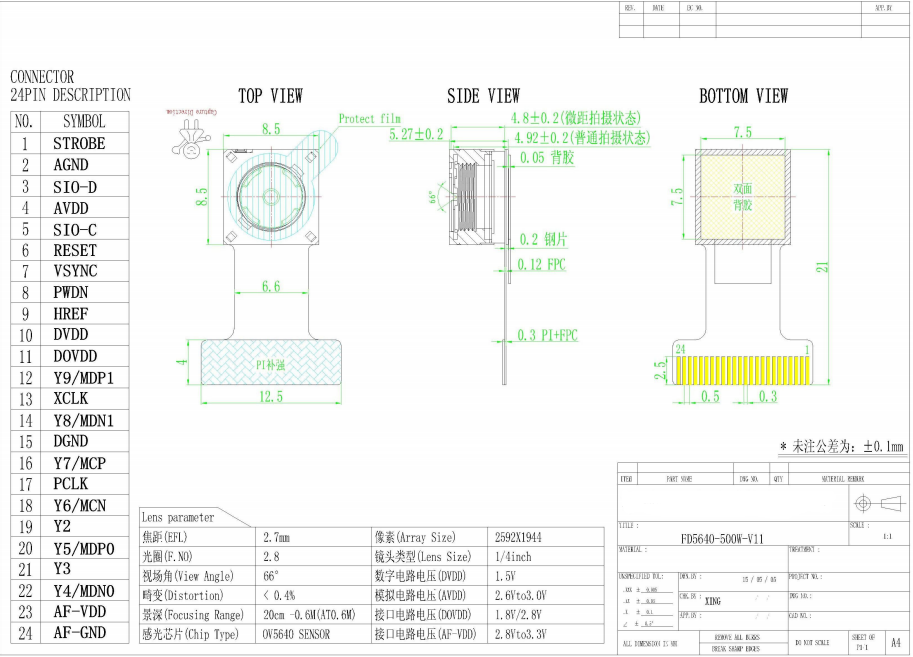

图 46‑0-2 OV5640传感器引脚分布图

信号引脚功能介绍如下，介绍如下表 46‑0-1。

表 46-0‑1 OV5640管脚

+----------+----------+----------------------------------+
| 管脚名称 | 管脚类型 | 管脚描述                         |
+==========+==========+==================================+
| SIO_C    | 输入     | SCCB总线的时钟线，可类比I2C的SCL |
+----------+----------+----------------------------------+
| SIO_D    | I/O      | SCCB总线的数据线，可类比I2C的SDA |
+----------+----------+----------------------------------+
| RESET    | 输入     | 系统复位管脚，低电平有效         |
+----------+----------+----------------------------------+
| PWDN     | 输入     | 掉电/省电模式，高电平有效        |
+----------+----------+----------------------------------+
| HREF     | 输出     | 行同步信号                       |
+----------+----------+----------------------------------+
| VSYNC    | 输出     | 帧同步信号                       |
+----------+----------+----------------------------------+
| PCLK     | 输出     | 像素同步时钟输出信号             |
+----------+----------+----------------------------------+
| XCLK     | 输入     | 外部时钟输入端口，可接外部晶振   |
+----------+----------+----------------------------------+
| Y2…Y9    | 输出     | 像素数据输出端口                 |
+----------+----------+----------------------------------+

下面我们配合 图46_0_3_ 中的OV5640功能框图讲解这些信号引脚。

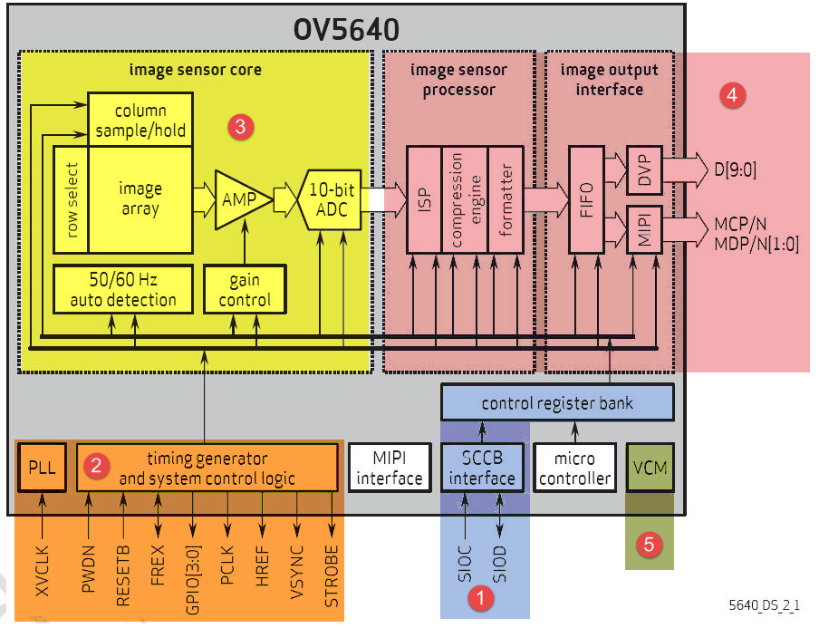

图 46‑0-3 OV5640功能框图

(1) 控制寄存器

    标号处的是OV5640的控制寄存器，它根据这些寄存器配置的参数来运行，而这些参数是由外部控制器通过SIO_C和SIO_D引脚写入的，SIO_C与SIO_D使用的通讯协议跟I2C十分类似，在STM32中我们完全可以直接用I2C硬件外设来控制。

(2) 通信、控制信号及时钟

    标号处包含了OV5640的通信、控制信号及外部时钟，其中PCLK、HREF及VSYNC分别是像素同步时钟、行同步信号以及帧同步信号，这与液晶屏控制中的信号是很类似的。RESETB引脚为低电平时，用于复位整个传感器芯片，PWDN用于控制芯片进入低功耗模式。注意最后的一个XCLK引脚，它跟PCLK是完全不同的，XCLK是用于驱动整个传感器芯片的时钟信号，是外部输入到OV5640的信号；而PCLK是OV5640输出数据时的同步信号，它是由OV5640输出的信号。XCLK可以外接晶振或由外部控制器提供，若要类比XCLK之于OV5640就相当于HSE时钟输入引脚与STM32芯片的关系，PCLK引脚可类比STM32的I2C外设的SCL引脚。

(3) 感光矩阵

    标号处的是感光矩阵，光信号在这里转化成电信号，经过各种处理，这些信号存储成由一个个像素点表示的数字图像。

(4) 数据输出信号

    标号处包含了DSP处理单元，它会根据控制寄存器的配置做一些基本的图像处理运算。这部分还包含了图像格式转换单元及压缩单元，转换出的数据最终通过Y0-Y9引脚输出，一般来说我们使用8根据数据线来传输，这时仅使用Y2-Y9引脚，OV5640与外部器件的连接方式见图
    图46_0_4_。

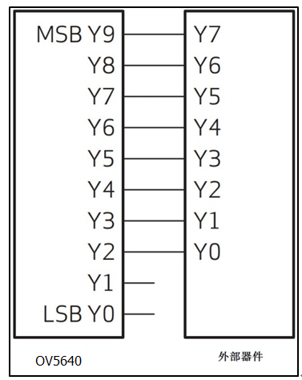

图 46‑0-4 8位数据线接法

(5) 数据输出信号

    标号⑤处为VCM处理单元，他会通过图像分析来实现图像的自动对焦功能。要实现自动对焦还需要下载自动对焦固件到模组，后面摄像头实验详细介绍这个功能。

SCCB时序
^^^^^^^^

外部控制器对OV5640寄存器的配置参数是通过SCCB总线传输过去的，而SCCB总线跟I2C十分类似，所以在STM32驱动中我们直接使用片上I2C外设与它通讯。SCCB与标准的I2C协议的区别是它每次传输只能写入或读取一个字节的数据，而I2C协议是支持突发读写的，即在一次传输中可以写入多个字节的数据(EEPROM中的页写入时序即突发写)。关于SCCB协议的完整内容可查看配套资料里的《SCCB协议》文档，下面我们简单介绍下。

SCCB的起始、停止信号及数据有效性
''''''''''''''''''''''''''''''''''''''

SCCB的起始信号、停止信号及数据有效性与I2C完全一样，见 图46_0_5_ 及 图46_0_6_。

-  起始信号：在SIO_C为高电平时，SIO_D出现一个下降沿，则SCCB开始传输。

-  停止信号：在SIO_C为高电平时，SIO_D出现一个上升沿，则SCCB停止传输。

-  数据有效性：除了开始和停止状态，在数据传输过程中，当SIO_C为高电平时，
   必须保证SIO_D上的数据稳定，也就是说，SIO_D上的电平变换只能发生在SIO_C为低电平的时候，SIO_D的信号在SIO_C为高电平时被采集。

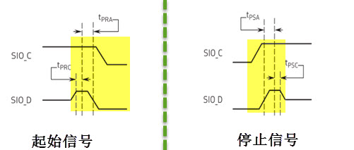

图 46‑0-5 SCCB停止信号

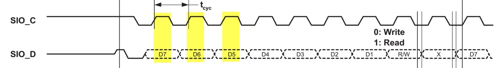

图 46‑0-6 SCCB的数据有效性

SCCB数据读写过程
'''''''''''''''''''

在SCCB协议中定义的读写操作与I2C也是一样的，只是换了一种说法。它定义了两种写操作，即三步写操作和两步写操作。三步写操作可向从设备的一个目的寄存器中写入数据，见
图46_0_7_。在三步写操作中，第一阶段发送从设备的ID地址+W标志(等于I2C的设备地址：7位设备地址+读写方向标志)，第二阶段发送从设备目标寄存器的16位地址，第三阶段发送要写入寄存器的8位数据。图中的“X”数据位可写入1或0，对通讯无影响。

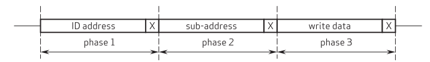

图 46‑0-7 SCCB的三步写操作

而两步写操作没有第三阶段，即只向从器件传输了设备ID+W标志和目的寄存器的地址，见
图46_0_8_。两步写操作是用来配合后面的读寄存器数据操作的，它与读操作一起使用，实现I2C的复合过程。

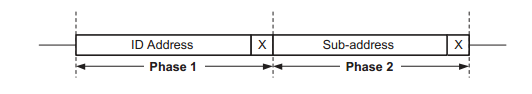

图 46‑0-8 SCCB的两步写操作

两步读操作，它用于读取从设备目的寄存器中的数据，见
图46_0_9_。在第一阶段中发送从设备的设备ID+R标志(设备地址+读方向标志)和自由位，在第二阶段中读取寄存器中的8位数据和写NA
位(非应答信号)。由于两步读操作没有确定目的寄存器的地址，所以在读操作前，必需有一个两步写操作，以提供读操作中的寄存器地址。

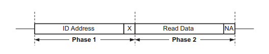

图 46‑0-9 SCCB的两步读操作

可以看到，以上介绍的SCCB特性都与I2C无区别，而I2C比SCCB还多出了突发读写的功能，所以SCCB可以看作是I2C的子集，我们完全可以使用STM32的I2C外设来与OV5640进行SCCB通讯。

OV5640的寄存器
^^^^^^^^^^^^^^

控制OV5640涉及到它很多的寄存器，可直接查询《ov5640datasheet》了解，通过这些寄存器的配置，可以控制它输出图像的分辨率大小、图像格式及图像方向等。要注意的是OV5640寄存器地址为16位。

官方还提供了一个《OV5640_自动对焦照相模组应用指南(DVP_接口)__R2.13C.pdf》的文档，它针对不同的配置需求，提供了配置范例，见
图46_0_10_。其中write_SCCB是一个利用SCCB向寄存器写入数据的函数，第一个参数为要写入的寄存器的地址，第二个参数为要写入的内容。

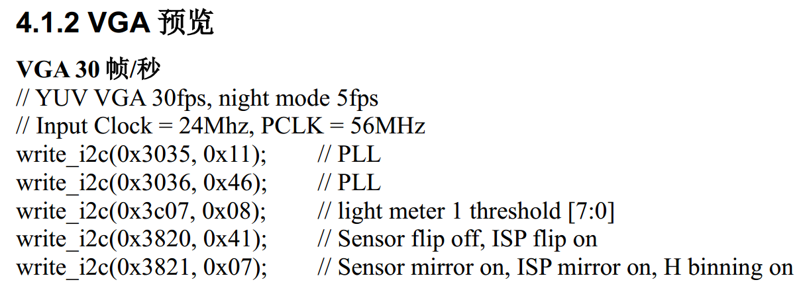

图 46‑0-10 调节帧率的寄存器配置范例

像素数据输出时序
^^^^^^^^^^^^^^^^

对OV5640采用SCCB协议进行控制，而它输出图像时则使用VGA时序(还可用SVGA、UXGA，这些时序都差不多)，这跟控制液晶屏输入图像时很类似。OV5640输出图像时，一帧帧地输出，在帧内的数据一般从左到右，从上到下，一个像素一个像素地输出(也可通过寄存器修改方向)，见
图46_0_11_。

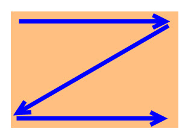

图 46‑0-11 摄像头数据输出

例如，
图46_0_12_，若我们使用Y2-Y9数据线，图像格式设置为RGB565，进行数据输出时，Y2-Y9数据线会在1个像素同步时钟PCLK的驱动下发送1字节的数据信号，所以2个PCLK时钟可发送1个RGB565格式的像素数据。像素数据依次传输，每传输完一行数据时，行同步信号HREF会输出一个电平跳变信号，每传输完一帧图像时，VSYNC会输出一个电平跳变信号。

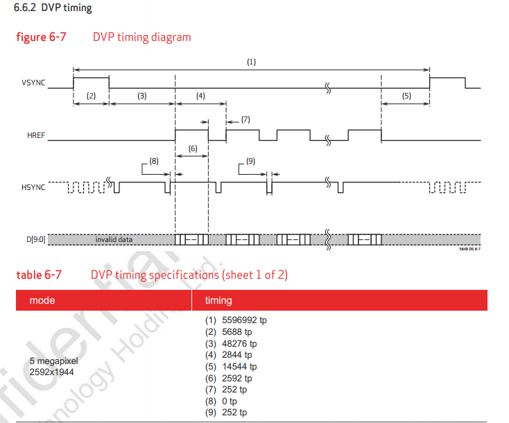

图 46‑0-12 DVP接口时序

STM32的DCMI接口简介
~~~~~~~~~~~~~~~~~~~

STM32f7系列的控制器包含了DCMI数字摄像头接口(Digital camera
Interface)，它支持使用上述类似VGA的时序获取图像数据流，支持原始的按行、帧格式来组织的图像数据，如YUV、RGB，也支持接收JPEG格式压缩的数据流。接收数据时，主要使用HSYNC及VSYNC信号来同步。

DCMI整体框图
^^^^^^^^^^^^

STM32的DCMI接口整体框图见 图46_0_13_。

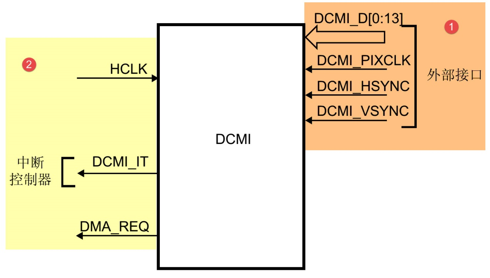

图 46‑0-13 DCMI接口整体框图

外部接口及时序
'''''''''''''''''''

上图标号处的是DCMI向外部引出的信号线。DCMI提供的外部接口的方向都是输入的，接口的各个信号线说明见表
46-0‑2。

表 46-0‑2 DCMI的信号线说明

+--------------+--------------------------+
| 引脚名称     | 说明                     |
+==============+==========================+
| DCMI_D[0:13] | 数据线                   |
+--------------+--------------------------+
| DCMI_PIXCLK  | 像素同步时钟             |
+--------------+--------------------------+
| DCMI_HSYNC   | 行同步信号(水平同步信号) |
+--------------+--------------------------+
| DCMI_VSYNC   | 帧同步信号(垂直同步信号) |
+--------------+--------------------------+

其中DCMI_D数据线的数量可选8、10、12或14位，各个同步信号的有效极性都可编程控制。
它使用的通讯时序与OV5640的图像数据输出接口时序一致，
见 图46_0_14_。

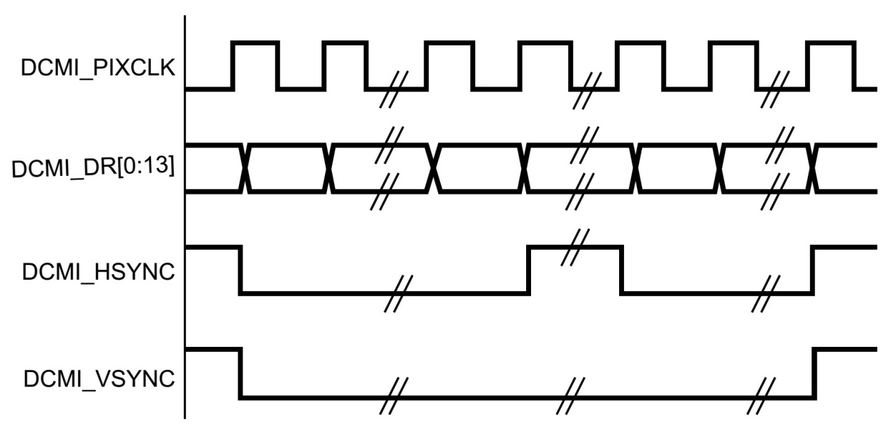

图 46‑0-14 DCMI时序图

内部信号及PIXCLK的时钟频率
''''''''''''''''''''''''''''''''''''''

图46_0_13_ 的标号1处表示DCMI与内部的信号线。在STM32的内部，
使用HCLK作为时钟源提供给DCMI外设。从DCMI引出有DCMI_IT信号至中断控制器，
并可通过DMA_REQ信号发送DMA请求。

DCMI从外部接收数据时，在HCLK的上升沿时对PIXCLK同步的信号进行采样，它限制了PIXCLK的最小时钟周期要大于2.5个HCLK时钟周期，即最高频率为HCLK的1/4。

DCMI接口内部结构
^^^^^^^^^^^^^^^^

DCMI接口的内部结构见 图46_0_15_。

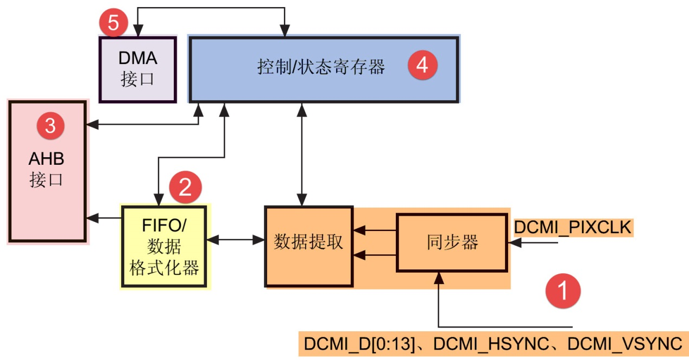

图 46‑0-15 DCMI接口内部结构

(1) 同步器

    同步器主要用于管理DCMI接收数据的时序，它根据外部的信号提取输入的数据。

(2) FIFO/数据格式化器

    为了对数据传输加以管理，STM32在DCMI接口上实现了 4 个字(32bit
    x4)深度的 FIFO，用以缓冲接收到的数据。

(3) AHB接口

    DCMI接口挂载在AHB总线上，在AHB总线中有一个DCMI接口的数据寄存器，当我们读取该寄存器时，它会从FIFO中获取数据，并且FIFO中的数据指针会自动进行偏移，使得我们每次读取该寄存器都可获得一个新的数据。

(4) 控制/状态寄存器

    DCMI的控制寄存器协调图中的各个结构运行，程序中可通过检测状态寄存器来获DCMI的当前运行状态。

(5) DMA接口

    由于DCMI采集的数据量很大，我们一般使用DMA来把采集得的数据搬运至内存。

同步方式
^^^^^^^^

DCMI接口支持硬件同步或内嵌码同步方式，硬件同步方式即使用HSYNC和VSYNC作为同步信号的方式，OV5640就是使用这种同步时序。

而内嵌码同步的方式是使用数据信号线传输中的特定编码来表示同步信息，由于需要用0x00和0xFF来表示编码，所以表示图像的数据中不能包含有这两个值。利用这两个值，它扩展到4个字节，定义出了2种模式的同步码，每种模式包含4个编码，编码格式为0xFF0000XY，其中XY的值可通过寄存器设置。当DCMI接收到这样的编码时，它不会把这些当成图像数据，而是按照表
46-0‑3中的编码来解释，作为同步信号。

表 46-0‑3两种模式的内嵌码

+---------------+-------------------------------------------------------+
| 模式2的内嵌码 | 模式1的内嵌码                                         |
+===============+=======================================================+
| 帧开始(FS)    | 有效行开始(SAV)                                       |
+---------------+-------------------------------------------------------+
| 帧结束(FE)    | 有效行结束(EAV)                                       |
+---------------+-------------------------------------------------------+
| 行开始(LS)    | 帧间消隐期内的行开始(SAV)，其中消隐期内的即为无效数据 |
+---------------+-------------------------------------------------------+
| 行结束(LS)    | 帧间消隐期内的行结束(EAV)，其中消隐期内的即为无效数据 |
+---------------+-------------------------------------------------------+

捕获模式及捕获率
^^^^^^^^^^^^^^^^

DCMI还支持两种数据捕获模式，分别为快照模式和连续采集模式。快照模式时只采集一帧的图像数据，连续采集模式会一直采集多个帧的数据，并且可以通过配置捕获率来控制采集多少数据，如可配置为采集所有数据或隔1帧采集一次数据或隔3帧采集一次数据。

DCMI初始化结构体
~~~~~~~~~~~~~~~~

与其它外设一样，STM32的DCMI外设也可以使用库函数来控制，其中最主要的配置项都封装到了DCMI_InitTypeDef结构体，来这些内容都定义在库文件“stm32f7xx_hal_dcmi.h”及“stm32f7xx_hal_dcmi.c”中，编程时我们可以结合这两个文件内的注释使用或参考库帮助文档。

DCMI_InitTypeDef初始化结构体的内容见代码清单 46-0‑1。

.. code-block:: c
   :name: 代码清单 46-0‑1 DCMI初始化结构体

   typedef struct {
      uint32_t SynchroMode; /*选择硬件同步模式还是内嵌码模式 */
      uint32_t PCKPolarity; /*设置像素时钟的有效边沿*/
      uint32_t VSPolarity;  /*设置VSYNC的有效电平*/
      uint32_t HSPolarity;  /*设置HSYNC的有效边沿*/
      uint32_t CaptureRate; /*设置图像的采集间隔 */
      uint32_t ExtendedDataMode; /*设置数据线的宽度 */
      DCMI_CodesInitTypeDef SyncroCode;/*分隔符设置*/
      uint32_t JPEGMode;    /*JPEG 模式选择*/
      uint32_t ByteSelectMode; /*配置字节选项模式*/
      uint32_t ByteSelectStart; /*字节选择开始*/
      uint32_t LineSelectMode;  /*行选择模式*/
      uint32_t LineSelectStart; /*行选择选择*/
   } DCMI_InitTypeDef;

这些结构体成员说明如下，其中括号内的文字是对应参数在STM32
HAL库中定义的宏：

(1) SynchroMode

    本成员设置DCMI数据的同步模式，可以选择为硬件同步方式(DCMI_SYNCHRO_HARDWARE)或内嵌码方式(DCMI_SYNCHRO_EMBEDDED)。

(2) PCKPolarity

    本成员用于配置DCMI接口像素时钟的有效边沿，即在该时钟边沿时，DCMI会对数据线上的信号进行采样，它可以被设置为上升沿有效(DCMI_PCKPOLARITY_RISING)或下降沿有效(DCMI_PCKPOLARITY_FALLING)。

(3) VSPolarity

    本成员用于设置VSYNC的有效电平，当VSYNC信号线表示为有效电平时，表示新的一帧数据传输完成，它可以被设置为高电平有效(DCMI_VSPolarity_High)或低电平有效(DCMI_VSPolarity_Low)。

(4) DCMI_HSPolarity

    类似地，本成员用于设置HSYNC的有效电平，当HSYNC信号线表示为有效电平时，表示新的一行数据传输完成，它可以被设置为高电平有效(DCMI_VSPOLARITY_HIGH)或低电平有效(DCMI_VSPOLARITY_LOW)。

(5) CaptureRate

    本成员可以用于设置DCMI捕获数据的频率，可以设置为全采集、半采集或1/4采集(DCMI_CR_ALL_FRAME/
    DCMI_CR_ALTERNATE_2_FRAME/
    DCMI_CR_ALTERNATE_4_FRAME)，在间隔采集的情况下，STM32的DCMI外设会直接按间隔丢弃数据。

(6) ExtendedDataMode

    本成员用于设置DCMI的数据线宽度，可配置为8/10/12及14位数据线宽(DCMI_EXTEND_DATA_8B/10B/12B/14B)。

(7) ExtendedDataMode

    本成员用于设置DCMI的数据线宽度，可配置为8/10/12及14位数据线宽(DCMI_EXTEND_DATA_8B/10B/12B/14B)。

(8) SyncroCode

    本成员用于设置DCMI的数据线指定行/帧开始分隔符和行/帧结束分隔符的代码。

(9) JPEGMode

    本成员用于设置DCMI的数据输入模式，可配置为使能或者禁止JPEG模式。

(10) ByteSelectMode

    本成员用于设置DCMI的数据字节的选择，可配置为全部接收（DCMI_BSM_ALL），每隔一个字节接收（DCMI_BSM_OTHER），每四个字节接收一个字节（DCMI_BSM_ALTERNATE_4），每四个字节接收两个字节（DCMI_BSM_ALTERNATE_2）。

(11) ByteSelectStart

    本成员用于设置DCMI的数据字节开始选择，可配置为奇数或者偶数。

(12) LineSelectMode

    本成员用于设置DCMI的行数据的采集，可配置全部采集或者隔行采集。

(13) LineSelectStart

    本成员用于设置DCMI的行数据字节开始选择，可配置为奇数或者偶数。

配置完这些结构体成员后，我们调用库函数HAL_DCMI_Init即可把这些参数写入到DCMI的控制寄存器中，实现DCMI的初始化。

DCMI—OV5640摄像头实验
~~~~~~~~~~~~~~~~~~~~~

本小节讲解如何使用DCMI接口从OV5640摄像头输出的RGB565格式的图像数据，并把这些数据实时显示到液晶屏上。

学习本小节内容时，请打开配套的“DCMI—OV5640摄像头”工程配合阅读。

硬件设计
^^^^^^^^

摄像头原理图
'''''''''''''''''''

本实验采用的OV5640摄像头实物见 实物图_，
其原理图见 图46_0_16_。

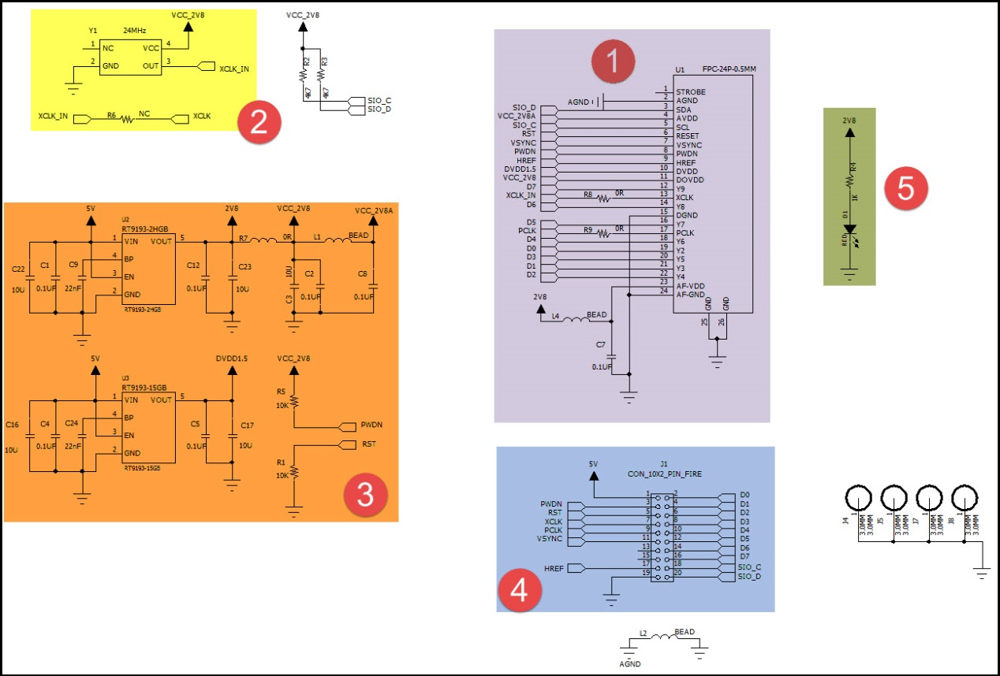

图 46‑0-16 OV5640摄像头原理图

图46_0_16_ 标号1处的是OV5640模组接口电路，
在这部分中已对SCCB使用的信号线接了上拉电阻，外部电路可以省略上拉；
标号处的是一个24MHz的有源晶振，它为OV5640提供系统时钟，
如果不想使用外部晶振提供时钟源，可以参考图中的R6处贴上0欧电阻，
XCLK引脚引出至外部，由外部控制器提供时钟；标号处的是电源转换模块，
可以从5V转2.8V和1.5V供给模组使用；标号④处的是摄像头引脚集中引出的排针接口，
使用它可以方便地与STM32实验板中的排母连接。标号⑤处的是电源指示灯。

摄像头与实验板的连接
''''''''''''''''''''''

通过排母，OV5640与STM32引脚的连接关系见 图46_0_17_。

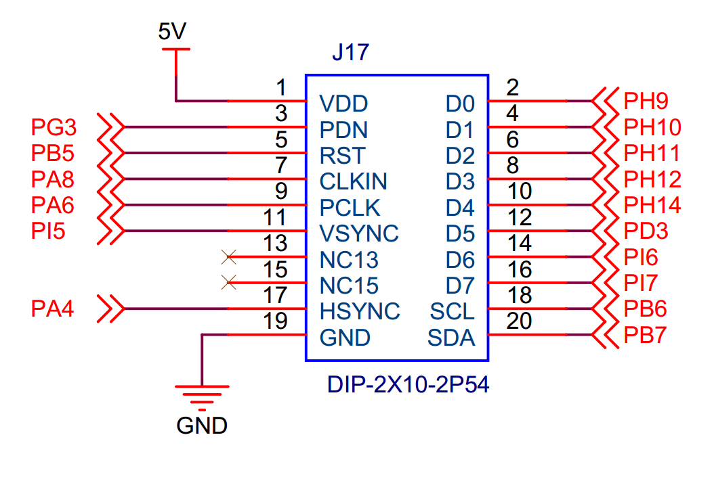

图 46‑0-17 STM32实验板引出的DCMI接口

以上原理图可查阅《ov5640—黑白原理图》及《野火H743开发板底板原理图》文档获知，若您使用的摄像头或实验板不一样，请根据实际连接的引脚修改程序。

软件设计
^^^^^^^^

为了使工程更加有条理，我们把摄像头控制相关的代码独立分开存储，方便以后移植。在“液晶显示”工程的基础上新建“bsp_ov5640.c”,“ov5640_AF.c”,“bsp_ov5640.h”,
“ov5640_AF.h”文件，这些文件也可根据您的喜好命名，它们不属于STM32HAL库的内容，是由我们自己根据应用需要编写的。

编程要点
''''''''

(1) 初始化DCMI时钟，I2C时钟；

(2) 使用I2C接口向OV5640写入寄存器配置；

(3) 初始化DCMI工作模式；

(4) 初始化DMA，用于搬运DCMI的数据到显存空间进行显示；

(5) 编写测试程序，控制采集图像数据并显示到液晶屏。

代码分析
''''''''''

摄像头硬件相关宏定义
=====================

我们把摄像头控制硬件相关的配置都以宏的形式定义到
“bsp_ov5640.h”文件中，其中包括I2C及DCMI接口的，见代码清单 46-0‑2。

.. code-block:: c
   :name: 代码清单 46-0‑2 摄像头硬件配置相关的宏(省略了部分数据线)

    /*摄像头接口 */
    //IIC SCCB
    #define CAMERA_I2C                          I2C1
    #define CAMERA_I2C_CLK_ENABLE()             __HAL_RCC_I2C1_CLK_ENABLE()

    #define CAMERA_I2C_SCL_PIN                  GPIO_PIN_6
    #define CAMERA_I2C_SCL_GPIO_PORT            GPIOB
    #define CAMERA_I2C_SCL_GPIO_CLK_ENABLE()    __HAL_RCC_GPIOB_CLK_ENABLE()

    #define CAMERA_I2C_SCL_AF                   GPIO_AF4_I2C1

    #define CAMERA_I2C_SDA_PIN                  GPIO_PIN_7
    #define CAMERA_I2C_SDA_GPIO_PORT            GPIOB
    #define CAMERA_I2C_SDA_GPIO_CLK_ENABLE()    __HAL_RCC_GPIOB_CLK_ENABLE()

    #define CAMERA_I2C_SDA_AF                   GPIO_AF4_I2C1

    //VSYNC
    #define DCMI_VSYNC_GPIO_PORT              GPIOI
    #define DCMI_VSYNC_GPIO_CLK_ENABLE()        __HAL_RCC_GPIOI_CLK_ENABLE()

    #define DCMI_VSYNC_GPIO_PIN               GPIO_PIN_5
    #define DCMI_VSYNC_AF                 GPIO_AF13_DCMI
    // HSYNC
    #define DCMI_HSYNC_GPIO_PORT              GPIOA
    #define DCMI_HSYNC_GPIO_CLK_ENABLE()        __HAL_RCC_GPIOA_CLK_ENABLE()

    #define DCMI_HSYNC_GPIO_PIN               GPIO_PIN_4
    #define DCMI_HSYNC_AF                 GPIO_AF13_DCMI
    //PIXCLK
    #define DCMI_PIXCLK_GPIO_PORT             GPIOA
    #define DCMI_PIXCLK_GPIO_CLK_ENABLE()       __HAL_RCC_GPIOA_CLK_ENABLE()

    #define DCMI_PIXCLK_GPIO_PIN              GPIO_PIN_6
    #define DCMI_PIXCLK_AF                  GPIO_AF13_DCMI
    //PWDN
    #define DCMI_PWDN_GPIO_PORT                 GPIOG
    #define DCMI_PWDN_GPIO_CLK_ENABLE()         __HAL_RCC_GPIOG_CLK_ENABLE()

    #define DCMI_PWDN_GPIO_PIN                  GPIO_PIN_3

    //RST
    #define DCMI_RST_GPIO_PORT                  GPIOB
    #define DCMI_RST_GPIO_CLK_ENABLE()          __HAL_RCC_GPIOB_CLK_ENABLE()

    #define DCMI_RST_GPIO_PIN                   GPIO_PIN_5

    //数据信号线
    #define DCMI_D0_GPIO_PORT                 GPIOH
    #define DCMI_D0_GPIO_CLK_ENABLE()           __HAL_RCC_GPIOH_CLK_ENABLE()

    #define DCMI_D0_GPIO_PIN                  GPIO_PIN_9
    #define DCMI_D0_AF                      GPIO_AF13_DCMI
    /*....省略部分数据线*/

以上代码根据硬件的连接，把与DCMI、I2C接口与摄像头通讯使用的引脚号、引脚源以及复用功能映射都以宏封装起来。

初始化DCMI的 GPIO及I2C
==========================

利用上面的宏，初始化DCMI的GPIO引脚及I2C，见代码清单 46-0‑3。

.. code-block:: c
   :name: 代码清单 46-0‑3 初始化DCMI的GPIO及I2C

   /**
   * @brief  初始化I2C总线，使用I2C前需要调用
   * @param  无
   * @retval 无
   */
   void I2CMaster_Init(void)
   {
      GPIO_InitTypeDef GPIO_InitStructure;

      /* 使能I2Cx时钟 */
      SENSORS_I2C_RCC_CLK_ENABLE();

      /* 使能I2C GPIO 时钟 */
      SENSORS_I2C_SCL_GPIO_CLK_ENABLE();
      SENSORS_I2C_SDA_GPIO_CLK_ENABLE();

      /* 配置I2Cx引脚: SCL ----------------------------------------*/
      GPIO_InitStructure.Pin =  SENSORS_I2C_SCL_GPIO_PIN;
      GPIO_InitStructure.Mode = GPIO_MODE_AF_OD;
      GPIO_InitStructure.Speed = GPIO_SPEED_HIGH;
      GPIO_InitStructure.Pull= GPIO_NOPULL;
      GPIO_InitStructure.Alternate=SENSORS_I2C_AF;
      HAL_GPIO_Init(SENSORS_I2C_SCL_GPIO_PORT, &GPIO_InitStructure);

      /* 配置I2Cx引脚: SDA ----------------------------------------*/
      GPIO_InitStructure.Pin = SENSORS_I2C_SDA_GPIO_PIN;
      HAL_GPIO_Init(SENSORS_I2C_SDA_GPIO_PORT, &GPIO_InitStructure);

      if (HAL_I2C_GetState(&I2C_Handle) == HAL_I2C_STATE_RESET) {
         /* 强制复位I2C外设时钟 */
         SENSORS_I2C_FORCE_RESET();

         /* 释放I2C外设时钟复位 */
         SENSORS_I2C_RELEASE_RESET();

         /* I2C 配置 */
         I2C_Handle.Instance = SENSORS_I2C;
         I2C_Handle.Init.Timing           = 0x60201E2B;//100KHz
         I2C_Handle.Init.OwnAddress1      = 0;
         I2C_Handle.Init.AddressingMode   = I2C_ADDRESSINGMODE_7BIT;
         I2C_Handle.Init.DualAddressMode  = I2C_DUALADDRESS_DISABLE;
         I2C_Handle.Init.OwnAddress2      = 0;
         I2C_Handle.Init.OwnAddress2Masks = I2C_OA2_NOMASK;
         I2C_Handle.Init.GeneralCallMode  = I2C_GENERALCALL_DISABLE;
         I2C_Handle.Init.NoStretchMode    = I2C_NOSTRETCH_DISABLE;

         /* 初始化I2C */
         HAL_I2C_Init(&I2C_Handle);
         /* 使能模拟滤波器 */
         HAL_I2CEx_AnalogFilter_Config(&I2C_Handle, I2C_ANALOGFILTER_ENABLE);
      }
   }
   /**
   * @brief  初始化控制摄像头使用的GPIO(I2C/DCMI)
   * @param  None
   * @retval None
   */
   void OV5640_HW_Init(void)
   {
      GPIO_InitTypeDef GPIO_InitStructure;

      /***DCMI引脚配置***/
      /* 使能DCMI时钟 */
      DCMI_PWDN_GPIO_CLK_ENABLE();
      DCMI_VSYNC_GPIO_CLK_ENABLE();
      DCMI_HSYNC_GPIO_CLK_ENABLE();
      DCMI_PIXCLK_GPIO_CLK_ENABLE();
      DCMI_D0_GPIO_CLK_ENABLE();
      DCMI_D1_GPIO_CLK_ENABLE();
      DCMI_D2_GPIO_CLK_ENABLE();
      DCMI_D3_GPIO_CLK_ENABLE();
      DCMI_D4_GPIO_CLK_ENABLE();
      DCMI_D5_GPIO_CLK_ENABLE();
      DCMI_D6_GPIO_CLK_ENABLE();
      DCMI_D7_GPIO_CLK_ENABLE();
      /*控制/同步信号线*/
      GPIO_InitStructure.Pin = DCMI_VSYNC_GPIO_PIN;
      GPIO_InitStructure.Mode = GPIO_MODE_AF_PP;
      GPIO_InitStructure.Speed = GPIO_SPEED_HIGH;
      GPIO_InitStructure.Pull = GPIO_PULLUP ;
      GPIO_InitStructure.Alternate = DCMI_VSYNC_AF;
      HAL_GPIO_Init(DCMI_VSYNC_GPIO_PORT, &GPIO_InitStructure);

      GPIO_InitStructure.Pin = DCMI_HSYNC_GPIO_PIN;
      GPIO_InitStructure.Alternate = DCMI_VSYNC_AF;
      HAL_GPIO_Init(DCMI_HSYNC_GPIO_PORT, &GPIO_InitStructure);

      GPIO_InitStructure.Pin = DCMI_PIXCLK_GPIO_PIN;
      GPIO_InitStructure.Alternate = DCMI_PIXCLK_AF;
      HAL_GPIO_Init(DCMI_PIXCLK_GPIO_PORT, &GPIO_InitStructure);

      /*数据信号*/
      GPIO_InitStructure.Pin = DCMI_D0_GPIO_PIN;
      GPIO_InitStructure.Alternate = DCMI_D0_AF;
      HAL_GPIO_Init(DCMI_D0_GPIO_PORT, &GPIO_InitStructure);

      GPIO_InitStructure.Pin = DCMI_D1_GPIO_PIN;
      GPIO_InitStructure.Alternate = DCMI_D1_AF;
      HAL_GPIO_Init(DCMI_D1_GPIO_PORT, &GPIO_InitStructure);

      GPIO_InitStructure.Pin = DCMI_D2_GPIO_PIN;
      GPIO_InitStructure.Alternate = DCMI_D2_AF;
      HAL_GPIO_Init(DCMI_D2_GPIO_PORT, &GPIO_InitStructure);

      GPIO_InitStructure.Pin = DCMI_D3_GPIO_PIN;
      GPIO_InitStructure.Alternate = DCMI_D3_AF;
      HAL_GPIO_Init(DCMI_D3_GPIO_PORT, &GPIO_InitStructure);

      GPIO_InitStructure.Pin = DCMI_D4_GPIO_PIN;
      GPIO_InitStructure.Alternate = DCMI_D4_AF;
      HAL_GPIO_Init(DCMI_D4_GPIO_PORT, &GPIO_InitStructure);

      GPIO_InitStructure.Pin = DCMI_D5_GPIO_PIN;
      GPIO_InitStructure.Alternate = DCMI_D5_AF;
      HAL_GPIO_Init(DCMI_D5_GPIO_PORT, &GPIO_InitStructure);

      GPIO_InitStructure.Pin = DCMI_D6_GPIO_PIN;
      GPIO_InitStructure.Alternate = DCMI_D6_AF;
      HAL_GPIO_Init(DCMI_D6_GPIO_PORT, &GPIO_InitStructure);

      GPIO_InitStructure.Pin = DCMI_D7_GPIO_PIN;
      GPIO_InitStructure.Alternate = DCMI_D7_AF;
      HAL_GPIO_Init(DCMI_D7_GPIO_PORT, &GPIO_InitStructure);

      GPIO_InitStructure.Pin = DCMI_PWDN_GPIO_PIN;
      GPIO_InitStructure.Mode = GPIO_MODE_OUTPUT_PP;
      HAL_GPIO_Init(DCMI_PWDN_GPIO_PORT, &GPIO_InitStructure);
      /*PWDN引脚，高电平关闭电源，低电平供电*/
      HAL_GPIO_WritePin(DCMI_PWDN_GPIO_PORT,DCMI_PWDN_GPIO_PIN,GPIO_PIN_RESET);

   }

函数中I2C的初始化配置，使用I2C与OV2640的SCCB接口通讯，这里的I2C模式配置与标准的I2C无异。

与所有使用到GPIO的外设一样，都要先把使用到的GPIO引脚模式初始化，以上代码把DCMI接口的信号线全都初始化为DCMI复用功能，这里需要特别注意的地方是：OV5640的上电时序比较特殊，我们初始化PWDN和RST应该特别小心，先初始化成普通的推挽输出模式，并且在初始化完毕后直接控制RST为低电平，PWDN为高电平，使摄像头处于待机模式，延时10ms后控制PWDN为低电平，再延时10ms后控制RST为高电平，OV5640模组启动。特别注意：IO初始化完必须延时50ms，再进行对OV5640寄存器的读写操作。

配置DCMI的模式
=====================

接下来需要配置DCMI的工作模式，我们通过编写OV2640_Init函数完成该功能，见代码清单 46-0‑4。

.. code-block:: c
   :name: 代码清单 46-0‑4 配置DCMI的模式(bsp_ov2640.c文件)

   /**
   * @brief  配置 DCMI/DMA 以捕获摄像头数据
   * @param  None
   * @retval None
   */
   void OV5640_Init(void)
   {
      /*** 配置DCMI接口 ***/
      /* 使能DCMI时钟 */
      __HAL_RCC_DCMI_CLK_ENABLE();

      /* DCMI 配置*/
      DCMI_Handle.Instance              = DCMI;
      DCMI_Handle.Init.SynchroMode      = DCMI_MODE_CONTINUOUS;
      DCMI_Handle.Init.SynchroMode      = DCMI_SYNCHRO_HARDWARE;
      DCMI_Handle.Init.PCKPolarity      = DCMI_PCKPOLARITY_RISING;
      DCMI_Handle.Init.VSPolarity       = DCMI_VSPOLARITY_LOW;
      DCMI_Handle.Init.HSPolarity       = DCMI_HSPOLARITY_LOW;
      DCMI_Handle.Init.CaptureRate      = DCMI_CR_ALL_FRAME;
      DCMI_Handle.Init.ExtendedDataMode = DCMI_EXTEND_DATA_8B;
      HAL_DCMI_Init(&DCMI_Handle);

      /* 配置中断 */
      HAL_NVIC_SetPriority(DCMI_IRQn, 5, 0);
      HAL_NVIC_EnableIRQ(DCMI_IRQn);

      //开始传输，数据大小以32位数据为单位(即像素个数/4，LCD_GetXSize()*LCD_GetYSize()*2/4)
      OV5640_DMA_Config(LCD_FB_START_ADDRESS,LCD_GetXSize()*LCD_GetYSize()/2);
   }

该函数的执行流程如下：

(1) 使能DCMI外设的时钟，它是挂载在AHB2总线上的；

(2) 根据摄像头的时序和硬件连接的要求，配置DCMI工作模式为：使用硬件同步，
    连续采集所有帧数据，采集时使用8根数据线，PIXCLK被设置为上升沿有效，VSYNC和HSYNC都被设置成低电平有效；

(3) 调用OV2640_DMA_Config函数开始DMA数据传输，每传输完一帧数据需要调用一次，
    它包含本次传输的目的首地址及传输的数据量，后面我们再详细解释；

(4) 配置DMA中断，DMA每次传输完毕会引起中断，以便我们在中断服务函数配置DMA传输下一帧数据；

(5) 配置DCMI的帧传输中断，为了防止有时DMA出现传输错误或传输速度跟不上导致数据错位、
    偏移等问题，每次DCMI接收到摄像头的一帧数据，得到新的帧同步信号后(VSYNC)，就进入中断，复位DMA，使它重新开始一帧的数据传输。

配置DMA数据传输
=====================

上面的DCMI配置函数中调用了OV5640_DMA_Config函数开始了DMA传输，该函数的定义见代码清单 46-0‑5。

.. code-block:: c
   :name: 代码清单 46-0‑5 配置DMA数据传输(bsp_ov5640.c文件)

    /**
    * @brief  配置 DCMI/DMA 以捕获摄像头数据
    * @param  DMA_Memory0BaseAddr:本次传输的目的首地址
    * @param DMA_BufferSize：本次传输的数据量(单位为字,即4字节)
    */
    void OV5640_DMA_Config(uint32_t DMA_Memory0BaseAddr,uint32_t DMA_BufferSize)
    {
        /* 配置DMA从DCMI中获取数据*/
        /* 使能DMA*/
        __HAL_RCC_DMA2_CLK_ENABLE();
        DMA_Handle_dcmi.Instance = DMA2_Stream1;
        DMA_Handle_dcmi.Init.Channel = DMA_CHANNEL_1;
        DMA_Handle_dcmi.Init.Direction = DMA_PERIPH_TO_MEMORY;
        DMA_Handle_dcmi.Init.PeriphInc = DMA_PINC_DISABLE;
        DMA_Handle_dcmi.Init.MemInc = DMA_MINC_ENABLE;      //寄存器地址自增
        DMA_Handle_dcmi.Init.PeriphDataAlignment = DMA_PDATAALIGN_WORD;
        DMA_Handle_dcmi.Init.MemDataAlignment = DMA_MDATAALIGN_HALFWORD;
        DMA_Handle_dcmi.Init.Mode = DMA_CIRCULAR;               //循环模式
        DMA_Handle_dcmi.Init.Priority = DMA_PRIORITY_HIGH;
        DMA_Handle_dcmi.Init.FIFOMode = DMA_FIFOMODE_DISABLE;
        DMA_Handle_dcmi.Init.FIFOThreshold = DMA_FIFO_THRESHOLD_FULL;
        DMA_Handle_dcmi.Init.MemBurst = DMA_MBURST_SINGLE;
        DMA_Handle_dcmi.Init.PeriphBurst = DMA_PBURST_SINGLE;

        /*DMA中断配置 */
        __HAL_LINKDMA(&DCMI_Handle, DMA_Handle, DMA_Handle_dcmi);

        HAL_NVIC_SetPriority(DMA2_Stream1_IRQn, 5, 0);
        HAL_NVIC_EnableIRQ(DMA2_Stream1_IRQn);

        HAL_DMA_Init(&DMA_Handle_dcmi);
        //使能DCMI采集数据
        HAL_DCMI_Start_DMA(&DCMI_Handle, DCMI_MODE_CONTINUOUS,
        (uint32_t)DMA_Memory0BaseAddr,DMA_BufferSize);
    }

该函数跟普通的DMA配置无异，它把DCMI接收到的数据从它的数据寄存器搬运到SDRAM显存中，从而直接使用液晶屏显示摄像头采集得的图像。它包含2个输入参数DMA_Memory0BaseAddr和DMA_BufferSize，其中DMA_Memory0BaseAddr用于设置本次DMA传输的目的首地址，
DMA_BufferSize则用于指示本次DMA传输的数据量，要注意它的单位是一个字，即4字节，如我们要传输60字节的数据时，它应配置为15。这两参数会被传递到库函数HAL_DCMI_Start_DMA
中作为形参。在前面的OV5640_Init函数中，对这个函数有如下调用：

.. code-block:: c

    /*摄像头采集图像的大小，改变这两个值可以改变数据量，
    但不会加快采集速度，要加快采集速度需要改成SVGA械*/
    #define img_width  LCD_GetXSize()
    #define img_height LCD_GetYSize()

    //开始传输，数据大小以32位数据为单位(即像素个数/4，
    //LCD_GetXSize()*LCD_GetYSize()*2/4)
    OV5640_DMA_Config(LCD_FB_START_ADDRESS,LCD_GetXSize()*LCD_GetYSize()/2);

其中的LCD_GetXSize和LCD_GetYSize获取液晶屏的分辨率，img_width和img_heigh表示摄像头输出的图像的分辨率，LCD_FB_START_ADDRESS是液晶层的首个显存地址。另外，本工程中显示摄像头数据的这个液晶层采用RGB565的像素格式，每个像素点占据2个字节。把摄像头输出的每一帧数据显示到液晶屏上，不需要额外的处理这样最简单直接。

DMA传输完成中断及帧中断
============================

OV5640_Init函数初始化了DCMI，使能了帧中断、DMA传输完成中断，并使能了第一次DMA传输，当这一行数据传输完成时，会进入DMA中断服务函数，见代码清单
46‑6中的DMA2_Stream1_IRQHandler。

.. code-block:: c
   :name: 代码清单 46-0‑6 DMA传输完成中断与帧中断(stm32f7xx_it.c和bsp_ov5640.c文件)

    /**
    * @brief  DMA中断服务函数
    * @param  None
    * @retval None
    */
    void DMA2_Stream1_IRQHandler(void)
    {
        HAL_DMA_IRQHandler(&DMA_Handle_dcmi);
    }

    /**
    * @brief  DCMI中断服务函数
    * @param  None
    * @retval None
    */
    void DCMI_IRQHandler(void)
    {
        HAL_DCMI_IRQHandler(&DCMI_Handle);
    }
    /**
    * @brief  帧同步回调函数.
    * @param  None
    * @retval None
    */
    void HAL_DCMI_VsyncEventCallback(DCMI_HandleTypeDef *hdcmi)
    {
        fps++; //帧率计数
        OV5640_DMA_Config(LCD_FB_START_ADDRESS,
    LCD_GetXSize()*LCD_GetYSize()/2);
    }

DMA中断服务函数中直接调用库函数进行处理。当DCMI接口检测到摄像头传输的帧同步信号时，会进入DCMI_IRQHandler中断服务函数，DCMI中断服务函数中直接调用库函数进行处理。每次帧同步来临是重新设置一次DMA传输数据，液晶的显存就会收到摄像头采集的数据然后显示在液晶上。

读取OV5640芯片ID
============================

配置完了STM32的DCMI，还需要控制摄像头，它有很多寄存器用于配置工作模式。
利用STM32的I2C接口，可向OV5640的寄存器写入控制参数，
我们先写个读取芯片ID的函数测试一下，见代码清单 46-0‑7。

.. code-block:: c
   :name: 代码清单 46-0‑7 读取OV5640的芯片ID(bsp_ov5640.c文件)

    //存储摄像头ID的结构体
    typedef struct {
        uint8_t PIDH;
        uint8_t PIDL;
    } OV5640_IDTypeDef;
    #define OV5640_SENSOR_PIDH       0x300A
    #define OV5640_SENSOR_PIDL       0x300B
    /**
    * @brief  读取摄像头的ID.
    * @param  OV5640ID: 存储ID的结构体
    * @retval None
    */
    void OV5640_ReadID(OV5640_IDTypeDef *OV5640ID)
    {

        /*读取寄存芯片ID*/
        OV5640ID->PIDH = OV5640_ReadReg(OV5640_SENSOR_PIDH);
        OV5640ID->PIDL = OV5640_ReadReg(OV5640_SENSOR_PIDL);
    }
    /**
    * @brief  从OV5640寄存器中读取一个字节的数据
    * @param  Addr: 寄存器地址
    * @retval 返回读取得的数据
    */
    uint8_t OV5640_ReadReg(uint16_t Addr)
    {
        uint8_t Data = 0;

        HAL_StatusTypeDef status = HAL_OK;

        status = HAL_I2C_Mem_Read(&I2C_Handle, OV5640_DEVICE_ADDRESS,
            (uint16_t)Addr, I2C_MEMADD_SIZE_16BIT, (uint8_t*)&Data,1, 1000);

        /* 检查通信状态 */
        if (status != HAL_OK) {
            /* 发生错误重新初始化I2C */
            I2Cx_Error();
        }
        /* 返回读到的数据 */
        return Data;
    }

在OV5640的PIDH及PIDL寄存器存储了产品ID，PIDH的默认值为0x56，PIDL的默认值为0x40。在代码中我们定义了一个结构体OV5640_IDTypeDef专门存储这些读取得的ID信息。

OV5640_ReadID函数中使用的OV5640_ReadReg函数是使用STM32的I2C外设向某寄存器读写单个字节数据的底层函数，它与我们前面章节中用到的I2C函数差异是OV5640的寄存器地址是16位的所以要先设置为I2C_MEMADD_SIZE_16BIT然后再读取寄存器的值。

向OV5640写入寄存器配置
============================

检测到OV5640的存在后，向它写入配置参数，见代码清单 46-0‑8。

.. code-block:: c
   :name: 代码清单 46-0‑8 向OV5640写入寄存器配置

    /**
    * @brief  Configures the OV5640 camera in BMP mode.
    * @param  BMP ImageSize: BMP image size
    * @retval None
    */
    void OV5640_RGB565Config(void)
    {
        uint32_t i;

        /*摄像头复位*/
        OV5640_Reset();
        /* 写入寄存器配置 */
        /* Initialize OV5640   Set to output RGB565 */
        for (i=0; i<(sizeof(RGB565_Init)/4); i++) {
            OV5640_WriteReg(RGB565_Init[i][0], RGB565_Init[i][1]);
                Delay(5);
        }

        if (img_width == 320)

            ImageFormat=BMP_320x240;

        else if (img_width == 640)

            ImageFormat=BMP_640x480;

        else if (img_width == 800)

            ImageFormat=BMP_800x480;

        switch (ImageFormat) {
        case BMP_320x240: {
            for (i=0; i<(sizeof(RGB565_QVGA)/4); i++) {
                OV5640_WriteReg(RGB565_QVGA[i][0], RGB565_QVGA[i][1]);
            }
            break;
        }
        case BMP_640x480: {
            for (i=0; i<(sizeof(RGB565_VGA)/4); i++) {
                OV5640_WriteReg(RGB565_VGA[i][0], RGB565_VGA[i][1]);
            }
            break;
        }
        case BMP_800x480: {
            for (i=0; i<(sizeof(RGB565_WVGA)/4); i++) {
                OV5640_WriteReg(RGB565_WVGA[i][0], RGB565_WVGA[i][1]);
            }
            break;
        }
        default: {
            for (i=0; i<(sizeof(RGB565_WVGA)/4); i++) {
                OV5640_WriteReg(RGB565_WVGA[i][0], RGB565_WVGA[i][1]);
            }
            break;
        }
        }
    }
    /**
    * @brief  写一字节数据到OV5640寄存器
    * @param  Addr: OV5640 的寄存器地址
    * @param  Data: 要写入的数据
    * @retval 返回0表示写入正常，0xFF表示错误
    */
    uint8_t OV5640_WriteReg(uint16_t Addr, uint8_t Data)
    {
        HAL_StatusTypeDef status = HAL_OK;

        status = HAL_I2C_Mem_Write(&I2C_Handle, OV5640_DEVICE_ADDRESS,
    (uint16_t)Addr, I2C_MEMADD_SIZE_16BIT, (uint8_t*) &Data, 1, 1000);

        /* Check the communication status */
        if (status != HAL_OK) {
            /* Re-Initiaize the I2C Bus */
            I2Cx_Error();
        }
        return status;
    }

这个OV5640_RGB565Config函数直接把一个初始化的二维数组RGB565_Init和一个分辨率设置的二维数组RGB565_WVGA(分辨率决定)使用I2C传输到OV5640中，二维数组的第一维存储的是寄存器地址，第二维存储的是对应寄存器要写入的控制参数。OV5640_WriteReg
函数中，因为OV5640的寄存器地址为16位，所以要先设置为I2C_MEMADD_SIZE_16BIT然后再写入寄存器的值，这个是有别于普通的I2C设备的写入方式，需要特别注意。

如果您对这些寄存器配置感兴趣，可以一个个对着OV5640的寄存器说明来阅读，
这些配置主要是把OV5640配置成了WVGA时序模式，
并使用8根数据线输出格式为RGB565的图像数据。
我们参考《OV5640_自动对焦照相模组应用指南(DVP_接口)__R2.13C.pdf》
文档中第20页4.1.3节的800x480预览的寄存器参数进行配置。使摄像头输出为WVGA模式。

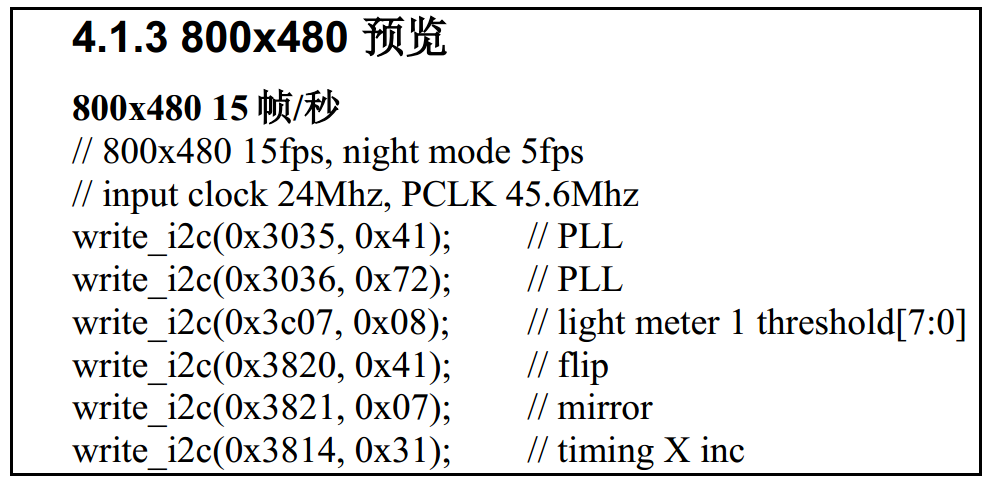

初始化OV5640自动对焦功能
============================

写入OV5640的配置参数后，需要向它写入自动对焦固件，初始化自动对焦功能，才能使用自动对焦功能，见代码清单 46-0‑9。

.. code-block:: c
   :name: 代码清单 46-0‑9 初始化OV5640自动对焦功能

    void OV5640_AUTO_FOCUS(void)
    {
        OV5640_FOCUS_AD5820_Init();
        OV5640_FOCUS_AD5820_Constant_Focus();
    }
    static void OV5640_FOCUS_AD5820_Init(void)
    {
        u8  state=0x8F;
        u32 iteration = 100;
        u16 totalCnt = 0;

        CAMERA_DEBUG("OV5640_FOCUS_AD5820_Init\n");

        OV5640_WriteReg(0x3000, 0x20);
        totalCnt = sizeof(OV5640_AF_FW);
        CAMERA_DEBUG("Total Count = %d\n", totalCnt);

    //  写入自动对焦固件 Brust mode
        OV5640_WriteFW(OV5640_AF_FW,totalCnt);

        OV5640_WriteReg(0x3022, 0x00);
        OV5640_WriteReg(0x3023, 0x00);
        OV5640_WriteReg(0x3024, 0x00);
        OV5640_WriteReg(0x3025, 0x00);
        OV5640_WriteReg(0x3026, 0x00);
        OV5640_WriteReg(0x3027, 0x00);
        OV5640_WriteReg(0x3028, 0x00);
        OV5640_WriteReg(0x3029, 0xFF);
        OV5640_WriteReg(0x3000, 0x00);
        OV5640_WriteReg(0x3004, 0xFF);
        OV5640_WriteReg(0x0000, 0x00);
        OV5640_WriteReg(0x0000, 0x00);
        OV5640_WriteReg(0x0000, 0x00);
        OV5640_WriteReg(0x0000, 0x00);

        do {
            state = (u8)OV5640_ReadReg(0x3029);
            CAMERA_DEBUG("when init af, state=0x%x\n",state);

            Delay(10);
            if (iteration-- == 0) {
                CAMERA_DEBUG("[OV5640]STA_FOCUS state check ERROR!!,state=0x%x\n",state);
                break;
            }
        } while (state!=0x70);

        OV5640_FOCUS_AD5820_Check_MCU();
        return;
    }   /*  OV5640_FOCUS_AD5820_Init  */

    //set constant focus
    void OV5640_FOCUS_AD5820_Constant_Focus(void)
    {
        u8 state = 0x8F;
        u32 iteration = 300;
        //send constant focus mode command to firmware
        OV5640_WriteReg(0x3023,0x01);
        OV5640_WriteReg(0x3022,0x04);

        iteration = 5000;
        do {
            state = (u8)OV5640_ReadReg(0x3023);
            if (iteration-- == 0) {
                CAMERA_DEBUG("[OV5640]AD5820_Single_Focus time out !!%x\n",state);
                return ;
            }
            Delay(10);
        } while (state!=0x00); //0x0 : focused 0x01: is focusing
        return;
    }

OV5640_AUTO_FOCUS函数调用了OV5640_FOCUS_AD5820_Init函数和OV5640_FOCUS\_

AD5820_Constant_Focus函数，我们先来介绍OV5640_FOCUS_AD5820_Init函数，首先复位OV5640内部的MCU，然后通过I2C的突发模式写入自动对焦固件，突发模式就是只需要写入首地址，接着就一直写数据，这个过程地址会自增，直接写完数据位置，对于连续地址写入相当方便。写入固件之后OV5640内部MCU开始初始化，最后检查初始化完成的状态是否为0x70，如果是就代表固件已经写入成功，并初始化成功。接着，我们需要OV5640_FOCUS_AD5820_Constant_Focus函数来调用自动对焦固件中的持续对焦指令，完成以上步骤后，摄像头就已经初始化完毕。

main函数
===========

最后我们来编写main函数，利用前面讲解的函数，控制采集图像。

.. code-block:: c
   :name: 代码清单 46-0‑10 main函数

    /**
    * @brief  主函数
    * @param  无
    * @retval 无
    */
    int main(void)
    {
        OV5640_IDTypeDef OV5640_Camera_ID;
        /* 系统时钟初始化成216 MHz */
        SystemClock_Config();
        /* LED 端口初始化 */
        LED_GPIO_Config();
        /*初始化USART1*/
        DEBUG_USART_Config();
        /* LCD 端口初始化 */
        LCD_Init();
        /* LCD 第一层初始化 */
        LCD_LayerInit(0, LCD_FB_START_ADDRESS,RGB565);
        /* LCD 第二层初始化 */
        LCD_LayerInit(1, LCD_FB_START_ADDRESS+(LCD_GetXSize()*LCD_GetYSize()*4),ARGB8888);
        /* 使能LCD，包括开背光 */
        LCD_DisplayOn();

        /* 选择LCD第一层 */
        LCD_SelectLayer(0);

        /* 第一层清屏，显示蓝色 */
        LCD_Clear(LCD_COLOR_BLUE);

        /* 选择LCD第二层 */
        LCD_SelectLayer(1);
        /* 第二层清屏，显示全黑 */
        LCD_Clear(TRANSPARENCY);
        /* 配置第一和第二层的透明度,最小值为0，最大值为255*/
        LCD_SetTransparency(0, 255);
        LCD_SetTransparency(1, 255);

        LCD_SetColors(LCD_COLOR_WHITE,TRANSPARENCY);
        LCD_DisplayStringLine_EN_CH(1,(uint8_t* )" 模式:UXGA 800x480");
        CAMERA_DEBUG("STM32H743 DCMI 驱动OV5640例程");

        OV5640_HW_Init();
        //初始化 I2C
        I2CMaster_Init();

        /* 读取摄像头芯片ID，确定摄像头正常连接 */
        OV5640_ReadID(&OV5640_Camera_ID);

        if (OV5640_Camera_ID.PIDH  == 0x56) {
            CAMERA_DEBUG("%x%x",OV5640_Camera_ID.PIDH ,OV5640_Camera_ID.PIDL);
        } else {
            LCD_SetColors(LCD_COLOR_WHITE,TRANSPARENCY);
        LCD_DisplayStringLine_EN_CH(8,(uint8_t*) "         没有检测到OV5640，请重新检查连接。");
            CAMERA_DEBUG("没有检测到OV5640摄像头，请重新检查连接。");
            while (1);
        }
        /* 配置摄像头输出像素格式 */
        OV5640_RGB565Config();
        /* 初始化摄像头，捕获并显示图像 */
        OV5640_Init();
        OV5640_AUTO_FOCUS();
        //重置
        fps =0;
        Task_Delay[0]=1000;

        while (1) {
            if (Task_Delay[0]==0) {
                LCD_SelectLayer(1);
                LCD_SetColors(LCD_COLOR_WHITE,TRANSPARENCY);
                sprintf((char*)dispBuf, " 帧率:%d FPS", fps/1);
                LCD_ClearLine(2);
                /*输出帧率*/
                LCD_DisplayStringLine_EN_CH(2,dispBuf);
                //重置
                fps =0;

                Task_Delay[0]=1000; //此值每1ms会减1，减到0才可以重新进来这里

            }
        }
    }

在main函数中，首先初始化了液晶屏，注意它是把摄像头使用的液晶层初始化成RGB565格式了，可直接在工程的液晶底层驱动解这方面的内容。

摄像头控制部分，首先调用了OV5640_HW_Init函数初始化DCMI及I2C，然后调用OV5640_ReadID函数检测摄像头与实验板是否正常连接，
若连接正常则调用OV5640_Init函数初始化DCMI的工作模式及DMA，再调用OV5640_RGB565Config函数向OV5640写入寄存器配置，
再调用OV5640_AUTO_FOCUS函数初始化OV5640自动对焦功能。最后摄像头采集到的图像会传送到液晶上显示出来。

下载验证
^^^^^^^^^^

把OV5640接到实验板的摄像头接口中，用USB线连接开发板，编译程序下载到实验板，并上电复位，液晶屏会显示摄像头采集得的图像，
由于这个OV5640是自动对焦摄像头所以不需要通过手动旋转镜头调焦，只需要调用对焦命令即可。

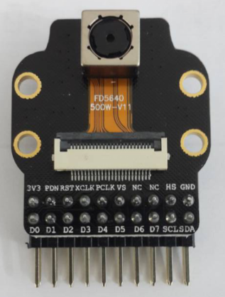
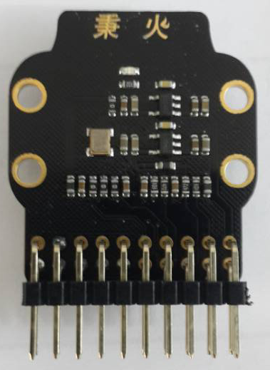
