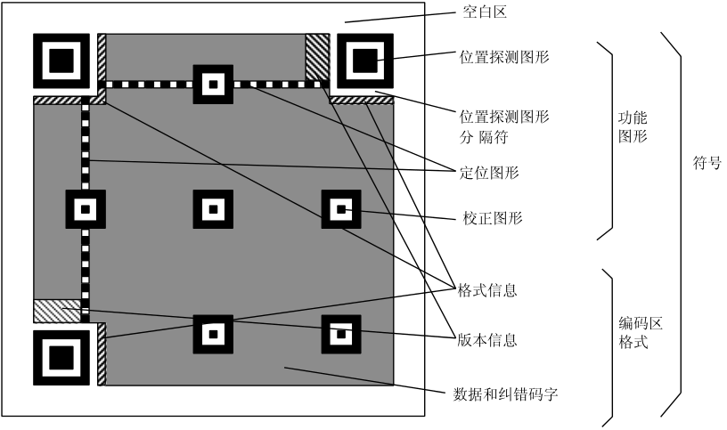

QR-Decoder-OV5640二维码识别
---------------------------

本章参考资料：《STM32H74xxx参考手册》、《STM32F7xx规格书》、库帮助文档《STM32F779xx_User_Manual.chm》。

关于开发板配套的OV5640摄像头参数可查阅《ov5640datasheet》配套资料获知。

STM32F7芯片具有浮点运算单元，适合对图像信息使用DSP进行基本的图像处理，其处理速度比传统的8、16位机快得多，而且它还具有与摄像头通讯的专用DCMI接口，所以使用它驱动摄像头采集图像信息并进行基本的加工处理非常适合。本章讲解如何使用二维码识别库进行二维码的识别。

二维码简介
~~~~~~~~~~

二维码，又称二维条码或二维条形码，二维条码是用某种特定的几何图形按一定规律在平面（二维方向上）分布的黑白相间的图形记录数据符号信息的；在代码编制上巧妙地利用构成计算机内部逻辑基础的“0”、“1”比特流的概念，使用若干个与二进制相对应的几何形体来表示文字数值信息，通过图象输入设备或光电扫描设备自动识读以实现信息自动处理：它具有条码技术的一些共性：每种码制有其特定的字符集；每个字符占有一定的宽度；具有一定的校验功能等。同时还具有对不同行的信息自动识别功能、及处理图形旋转变化等特点。
二维条码/二维码能够在横向和纵向两个方位同时表达信息，因此能在很小的面积内表达大量的信息。

二维条形码类型
~~~~~~~~~~~~~~

矩阵式二维条码
^^^^^^^^^^^^^^

矩阵式二维条码（2D MATRIX BAR CODE）
又称：棋盘式二维条码。有代表性的矩阵式二维条码有：QR Code 、Data
Matrix、Maxi Code、Code one 等，目前最流行的是QR CODE。见图 矩阵式二维码_。

矩阵式二维码

行排列式二维条码
^^^^^^^^^^^^^^^^

行排列式二维条码（2D STACKED BAR
CODE）又称：堆积式二维条码或层排式二维条码，其编码原理是建立在一维条码基础之上，按需要堆积成二行或多行。有代表性的行排式二维条码有：PDF417、CODE49、CODE
16K等。见 行排列式二维条码_。

行排列式二维条码

二维条形码的优点
~~~~~~~~~~~~~~~~

1.  **可靠性强**\ ，条形码的读取准确率远远超过人工记录，平均每15000个字符才会出现一个错误。

2.  **效率高**\ ，条形码的读取速度很快，相当于每秒40个字符。

3.  **成本低**\ ，与其它自动化识别技术相比较，条形码技术仅仅需要一小张贴纸和相对构造简单的光学扫描仪，成本相当低廉。

4.  **易于制作**\ ，条形码制作：条形码的编写很简单，制作也仅仅需要印刷，被称作为“可印刷的计算机语言”。

5.  **构造简单，**\ 条形码识别设备的构造简单，使用方便。

6.  **灵活实用，**\ 条形码符号可以手工键盘输入，也可以和有关设备组成识别系统实现自动化识别，还可和其他控制设备联系起来实现整个系统的自动化管理。

7.  **高密度，**\ 二维条码通过利用垂直方向的堆积来提高条码的信息密度，
    而且采用高密度图形表示，因此不需事先建立数据库，真正实现了用条码对信息的直接描述。

8.  **纠错功能，**\ 二维条形码不仅能防止错误，而且能纠正错误，即使条形码部分损坏，也能将正确的信息还原出来。

9.  **多语言形式、可表示图像，**\ 二维条码具有字节表示模式，即提供了一种表示字节流的机制。
    不论何种语言文字它们在计算机中存储时以机内码的形式表现，而内部码都是字节码，可识别多种语言文字的条码。

10. **具有加密机制，**\ 可以先用一定的加密算法将信息加密，再用二维条码表示。在识别二维条码时，再加以一定的解密算法，便可以恢复所表示的信息。

QR二维码的编码及识别
~~~~~~~~~~~~~~~~~~~~

QR码基本结构
^^^^^^^^^^^^

QR码基本结构，见图 QR码基本结构_。

1. 位置探测图形、位置探测图形分隔符、定位图形：用于对二维码的定位，对每个QR码来说，位置都是固定存在的，只是大小规格会有所差异。

2. 校正图形：规格确定，校正图形的数量和位置也就确定了。

3. 格式信息：表示改二维码的纠错级别，分为L、M、Q、H。

4. 版本信息：即二维码的规格，QR码符号共有40种规格的矩阵（一般为黑白色），从21x21（版本1），到177x177（版本40），每一版本符号比前一版本
   每边增加4个模块。

5. 数据和纠错码字：实际保存的二维码信息，和纠错码字（用于修正二维码损坏带来的错误）。

QR码基本结构

QR码编码过程
^^^^^^^^^^^^

1. **数据分析**\ ：确定编码的字符类型，按相应的字符集转换成符号字符；
   选择纠错等级，在规格一定的条件下，纠错等级越高其真实数据的容量越小。

2. **数据编码：**\ 将数据字符转换为位流，每8位一个码字，整体构成一个数据的码字序列。其实知道这个数据码字序列就知道了二维码的数据内容。见表
   48‑1和表 48‑2。

表 48‑1 QR码数据容量

+-----------------------+------------------------------+
|   **QR码数据容量**    |                              |
+=======================+==============================+
| **数字**              | 最多7,089字符                |
+-----------------------+------------------------------+
| **字母**              | 最多4,296字符                |
+-----------------------+------------------------------+
| **二进制数（8 bit）** | 最多2,593字节                |
+-----------------------+------------------------------+
| **日本汉字/片假名**   | 最多1,817字符(采用Shift JIS) |
+-----------------------+------------------------------+
| **中文汉字**          | 最多984字符(采用UTF-8)       |
+-----------------------+------------------------------+
| **中文汉字**          | 最多1,800字符(采用BIG5)      |
+-----------------------+------------------------------+

表 48‑2 QR数据模式指示符

+--------------------+------------------+
| **模式**           | **指示符**       |
+====================+==================+
| ECI                | 0111             |
+--------------------+------------------+
| 数字               | 0001             |
+--------------------+------------------+
| 字母数字           | 0010             |
+--------------------+------------------+
| 8位字节            | 0100             |
+--------------------+------------------+
| 日本汉字           | 1000             |
+--------------------+------------------+
| 中国汉字           | 1101             |
+--------------------+------------------+
| 结构链接           | 0011             |
+--------------------+------------------+
| FNC1               | 0101（第一位置） |
|                    |                  |
|                    | 1001（第二位置） |
+--------------------+------------------+
| 终止符（信息结尾） | 0000             |
+--------------------+------------------+

3. **编码过程：**\ 数据可以按照一种模式进行编码，以便进行更高效的解码，例如：对数据：01234567编码（版本1-H）。

a) 分组：012 345 67

b) 转成二进制：

..

    012 → 0000001100

    345 → 0101011001

    67 → 1000011

c) 转成序列：0000001100 0101011001 1000011

d) 字符数转成二进制：8 → 0000001000

e) 加入模式指示符：

..

    0001：0001 0000001000 0000001100 0101011001 1000011

    对于字母、中文、日文等只是分组的方式、模式等内容有所区别。基本方法是一致的。

4. **纠错编码：**\ 按需要将上面的码字序列分块，并根据纠错等级和分块的码字，产生纠错码字，并把纠错码字加入到数据码字序列后面，成为一个新的序列。

错误修正容量， L水平有7%的字码可被修正；
M水平有15%的字码可被修正；Q水平有25%的字码可被修正；H水平有30%的字码可被修正。

二维码规格和纠错等级确定的情况下，其实它所能容纳的码字总数和纠错码字数也就确定了，比如：版本10，纠错等级时H时，总共能容纳346个码字，其中224个纠错码字。

就是说二维码区域中大约1/3的码字时冗余的。对于这224个纠错码字，它能够纠正112个替代错误（如黑白颠倒）或者224个据读错误（无法读到或者无法译码），这样纠错容量为：112/346=32.4%。

5. **构造最终数据信息：**\ 在规格确定的条件下，将上面产生的序列按次序放如分块中，按规定把数据分块，然后对每一块进行计算，
   得出相应的纠错码字区块，把纠错码字区块按顺序构成一个序列，添加到原先的数据码字序列后面。

            例如：D1, D12, D23, D35, D2, D13, D24, D36, ... D11, D22,
    D33, D45, D34, D46, E1, E23,E45, E67, E2, E24, E46, E68，...

6. **构造矩阵：**\ 将探测图形、分隔符、定位图形、校正图形和码字模块放入矩阵中。把上面的完整序列填充到相应规格的二维码矩阵的区域中，见图
   构造矩阵_。

构造矩阵

7. **掩摸：**\ 将掩摸图形用于符号的编码区域，使得二维码图形中的深色和浅色（黑色和白色）区域能够比率最优的分布。见图
   48‑4 构造矩阵。

8. **格式和版本信息：**\ 生成格式和版本信息放入相应区域内。版本7-40都包含了版本信息，没有版本信息的全为0。
   二维码上两个位置包含了版本信息，它们是冗余的。版本信息共18位，6X3的矩阵，其中6位是数据位，如版本号8，数据位的信息时
   001000，后面的12位是纠错位。

QR码识别过程
^^^^^^^^^^^^

通过图像的采集设备（激光扫描器、面阵CCD、数码相机等成像设备），我们得到含有条码的图像，
此后主要经过条码\ **定位（预处理，定位，角度纠正和特征值提取）**\ 、\ **分割**\ 和\ **解码**\ 三个步骤实现条码的识别。

1. **条码的定位**\ 就是找到条码符号的图像区域，对有明显条码特征的区域进行定位。然后根据不同条码的定位图形结构特征对不同的条码符号进行下一步的处理。

2. **实现条码的定位**,采用以下步骤：

a) 利用点运算的阈值理论将采集到的图象变为二值图像，
   即对图像进行二值化处理；

b) 得到二值化图像后，对其进行膨胀运算；

c) 对膨胀后的图象进行边缘检测得到条码区域的轮廓；

下图 图像处理_ 是经过上述处理后得到的一系列图像。

图像处理

3. **对图像进行二值化处理,**\ 按下式进行

    |image7|         \     |image6|

    其中，f(x,y)是点(x,y)处像素的灰度值，T为阈值（自适应门限）。找到条码区域后，我们还要进一步区分到底是哪种矩阵式条码。下面图形是几种常见的矩阵式条码：

a) 位于左上角、左下角、右上角的三个定位图形

b) 位于符号中央的三个等间距同心圆环（或称公牛眼定位图形）

c) 位于左边和下边的两条垂直的实线段

图像处理2

4. **条码的分割**

边缘检测后条码区域的边界不是很完整，所以需要进一步的修正边界，然后分割出一个完整的条码区域。首先采用区域增长的方法对符号进行分割，以此修正条码边界。其基本思想是从符号内的一个小区域（种子）开始，通过区域增长来修正条码边界，把符号内的所有点都包括在这个边界内。然后通过凸壳计算准确分割出整个符号。之后区域增长和凸壳计算交替进行，通常对那些密度比较大的条码重复两次就足够了，而对于那些模块组合比较稀疏的条码至少要重复四次。

5. **译码**

得到一幅标准的条码图像后，对该符号进行网格采样，对网格每一个交点上的图像像素取样，并根据阈值确定是深色块还是浅色块。构造一个位图，用二进制的“1”表示深色像素，
“0”表示浅色像素，从而得到条码的原始二进制序列值，然后对这些数据进行纠错和译码，最后根据条码的逻辑编码规则把这些原始的数据位流转换成数据码字，即将码字图像符号换成ASCII码字符串。

QR-Decoder-OV564摄像头实验
~~~~~~~~~~~~~~~~~~~~~~~~~~

本小节讲解如何使用QR-Code库在DCMI—OV5640摄像头实验基础上进行二维码解码的过程，建议学习之前先把DCMI—OV5640摄像头实验弄明白。

学习本小节内容时，请打开配套的“QR-Decoder-OV5640”工程配合阅读。由于硬件设计方面跟DCMI—OV5640摄像头实验的是一样的，这里不再重复。下面直接介绍如何使用QR-Code库进行二维码识别。OV5640识别二维码的过程包括以下几个重要部分：图像采集，液晶驱动，图像处理，数据解码，串口打印输出结果。见图
OV5640识别二维码过程_。

OV5640识别二维码过程

QR-Code解码库特点
^^^^^^^^^^^^^^^^^

QR-Code解码库是野火专门针对STM32H743移植的一个的条码解码库，因为其结构复杂，移植过程繁琐，所以打包为一个解码库，提供接口方便用户直接调用，提高开发的效率。其主要特点如下：

-  条码种类： 支持常用QR-Code、EAN、UPC

-  扫描速度： 400 毫秒

-  扫描英文： 250 个字符

-  扫描中文： 90中文字符，UTF-8编码格式(需上位机支持)

-  多码扫描： 支持多个二维码同时解码，同时输出结果

软件设计
^^^^^^^^

编程要点
''''''''

根据OV5640识别二维码的过程，软件设计可以根据以下几个模块分别进行：

(1) 图像采集，通过STM32H743的DCMI接口驱动OV5640，采集适合液晶屏分辨率的图像。
    OV5640支持自动对焦功能，因此很容易采集到高清度的图像。

(2) 液晶驱动，通过STM32H743的LTDC接口驱动液晶屏，使用外部SDRAM作为液晶屏的显存，通过DMA2D来刷屏；
    同时LTDC支持双层叠加显示，可以在液晶屏上实现半透明的扫描窗并且支持绘制扫描线的动画效果。

(3) 图像处理，使用外部SDRAM作为缓存为图像处理提供足够的空间，通过调用QR-Code解码库的get_image函数获取一帧图像。
    通过图像处理将图像的数据流转变为一个二进制的码流再进行数据解码。

(4) 数据解码，直接通过QR_decoder函数来解码。返回值为解码的条码个数。
    并将解码结果保存到decoded_buf的二维数组当中。

(5) 串口发送，根据解码结果的个数及decoded_buf二维数组的数据，通过串口发送到电脑上位机。

代码分析
''''''''

QR-Code解码库相关宏定义
==========================

我们把QR-Code解码库相关的配置都以宏的形式定义到
“qr_decoder_user.h”文件中，其中包括数据缓冲基地址、扫描窗大小、扫描框线条大小、解码结果二维数组、扫描二维码的函数，见代码清单
48‑1。

代码清单 48‑1 QR-Code解码库配置相关的宏

.. code-block:: c

    /*扫描窗口参数*/
    #define  Frame_width           ((uint16_t)320)//扫描窗口边长（正方形）

    /*扫描框线条参数*/
    #define  Frame_line_length     ((uint16_t)30) //扫描框线条长度
    #define  Frame_line_size       ((uint16_t)3)  //扫描框线条宽度

    #define  QR_SYMBOL_NUM  5    //识别二维码的最大个数
    #define  QR_SYMBOL_SIZE 512  //每组二维码的的最大容量

    //解码数据封装为二维数组decoded_buf，格式为：
    // （第一组：解码类型长度(8bit)+解码类型名称+解码数据长度(16bit,高位在前低位在后)+解码数据）
    // （第二组：解码类型长度(8bit)+解码类型名称+解码数据长度(16bit,高位在前低位在后)+解码数据）
    //  。。。
    //以此类推
    extern char decoded_buf[QR_SYMBOL_NUM][QR_SYMBOL_SIZE];

    //解码函数，返回值为识别条码的个数
    char QR_decoder(void);

    //获取一帧图像
    void get_image(uint32_t src_addr,uint16_t img_width,uint16_t img_height);

    void LCD_Open_QR_Window(void);
    void LCD_Line_Scan(void);
    #endif /* __QR_DECODER_USER_H */

以上代码首先扫描二维码的窗口及框体大小，范围由100~480（图像不能太小，否则图像很难识别）；定义decoded_buf[QR_SYMBOL_NUM][QR_SYMBOL_SIZE]二维数组存放解码的结果，存放解码的最大个数由QR_SYMBOL_NUM决定，存放解码的最大数据量由QR_SYMBOL_SIZE决定，没有特殊要求就不需要做变动；存放数据的格式介绍如下表
48‑3。

    表 48‑3 二维数组数据格式

+-----------------+----------+------+----------------------------+
|      数组       | 十六进制 | 字符 |            含义            |
+=================+==========+======+============================+
| decoded_buf[0][ | 0x07     |      | 第一组解码类型名字的长度   |
| 0]              |          |      |                            |
+-----------------+----------+------+----------------------------+
| decoded_buf[0][ | 0x51     | Q    | 第一组解码类型名字：QR-Co  |
| 1]              |          |      | de                         |
+-----------------+----------+------+----------------------------+
| decoded_buf[0][ | 0x52     | R    |                            |
| 2]              |          |      |                            |
+-----------------+----------+------+----------------------------+
| decoded_buf[0][ | 0x2d     | -    |                            |
| 3]              |          |      |                            |
+-----------------+----------+------+----------------------------+
| decoded_buf[0][ | 0x43     | C    |                            |
| 4]              |          |      |                            |
+-----------------+----------+------+----------------------------+
| decoded_buf[0][ | 0x6f     | o    |                            |
| 5]              |          |      |                            |
+-----------------+----------+------+----------------------------+
| decoded_buf[0][ | 0x64     | d    |                            |
| 6]              |          |      |                            |
+-----------------+----------+------+----------------------------+
| decoded_buf[0][ | 0x65     | e    |                            |
| 7]              |          |      |                            |
+-----------------+----------+------+----------------------------+
| decoded_buf[0][ | 0x00     |      | 第一组解码数据长度的高八位 |
| 8]              |          |      |                            |
+-----------------+----------+------+----------------------------+
| decoded_buf[0][ | 0x15     |      | 第一组解码数据长度的低八位 |
| 9]              |          |      |                            |
+-----------------+----------+------+----------------------------+
| decoded_buf[0][ | 0x68     | h    | 第一组解码数据：\ `http    |
| 10]             |          |      | ://www.firebbs.            |
|                 |          |      | cn <http://www.            |
|                 |          |      | firebbs.cn>`__             |
+-----------------+----------+------+----------------------------+
| decoded_buf[0][ | 0x74     | t    |                            |
| 11]             |          |      |                            |
+-----------------+----------+------+----------------------------+
| decoded_buf[0][ | 0x74     | t    |                            |
| 12]             |          |      |                            |
+-----------------+----------+------+----------------------------+
| decoded_buf[0][ | 0x70     | p    |                            |
| 13]             |          |      |                            |
+-----------------+----------+------+----------------------------+
| decoded_buf[0][ | 0x3a     | :    |                            |
| 14]             |          |      |                            |
+-----------------+----------+------+----------------------------+
| decoded_buf[0][ | 0x2f     | /    |                            |
| 15]             |          |      |                            |
+-----------------+----------+------+----------------------------+
| decoded_buf[0][ | 0x2f     | /    |                            |
| 16]             |          |      |                            |
+-----------------+----------+------+----------------------------+
| decoded_buf[0][ | 0x77     | w    |                            |
| 17]             |          |      |                            |
+-----------------+----------+------+----------------------------+
| decoded_buf[0][ | 0x77     | w    |                            |
| 18]             |          |      |                            |
+-----------------+----------+------+----------------------------+
| decoded_buf[0][ | 0x77     | w    |                            |
| 19]             |          |      |                            |
+-----------------+----------+------+----------------------------+
| decoded_buf[0][ | 0x2e     | .    |                            |
| 20]             |          |      |                            |
+-----------------+----------+------+----------------------------+
| decoded_buf[0][ | 0x66     | f    |                            |
| 21]             |          |      |                            |
+-----------------+----------+------+----------------------------+
| decoded_buf[0][ | 0x69     | i    |                            |
| 22]             |          |      |                            |
+-----------------+----------+------+----------------------------+
| decoded_buf[0][ | 0x72     | r    |                            |
| 23]             |          |      |                            |
+-----------------+----------+------+----------------------------+
| decoded_buf[0][ | 0x65     | e    |                            |
| 24]             |          |      |                            |
+-----------------+----------+------+----------------------------+
| decoded_buf[0][ | 0x62     | b    |                            |
| 25]             |          |      |                            |
+-----------------+----------+------+----------------------------+
| decoded_buf[0][ | 0x62     | b    |                            |
| 26]             |          |      |                            |
+-----------------+----------+------+----------------------------+
| decoded_buf[0][ | 0x73     | s    |                            |
| 27]             |          |      |                            |
+-----------------+----------+------+----------------------------+
| decoded_buf[0][ | 0x2e     | .    |                            |
| 28]             |          |      |                            |
+-----------------+----------+------+----------------------------+
| decoded_buf[0][ | 0x63     | c    |                            |
| 29]             |          |      |                            |
+-----------------+----------+------+----------------------------+
| decoded_buf[0][ | 0x6e     | n    |                            |
| 30]             |          |      |                            |
+-----------------+----------+------+----------------------------+
| decoded_buf[1][ | 0x07     |      | 第二组解码类型名字的长度   |
| 0]              |          |      |                            |
+-----------------+----------+------+----------------------------+
| decoded_buf[1][ | 0x51     | Q    | 第二组解码类型名字：QR-Co  |
| 1]              |          |      | de                         |
+-----------------+----------+------+----------------------------+
| decoded_buf[1][ | 0x52     | R    |                            |
| 2]              |          |      |                            |
+-----------------+----------+------+----------------------------+
| decoded_buf[1][ | 0x2d     | -    |                            |
| 3]              |          |      |                            |
+-----------------+----------+------+----------------------------+
| decoded_buf[1][ | 0x43     | C    |                            |
| 4]              |          |      |                            |
+-----------------+----------+------+----------------------------+
| decoded_buf[1][ | 0x6f     | o    |                            |
| 5]              |          |      |                            |
+-----------------+----------+------+----------------------------+
| decoded_buf[1][ | 0x64     | d    |                            |
| 6]              |          |      |                            |
+-----------------+----------+------+----------------------------+
| decoded_buf[1][ | 0x65     | e    |                            |
| 7]              |          |      |                            |
+-----------------+----------+------+----------------------------+
| decoded_buf[1][ | 0x00     |      | 第二组解码数据长度的高八位 |
| 8]              |          |      |                            |
+-----------------+----------+------+----------------------------+
| decoded_buf[1][ | 0x03     |      | 第二组解码数据长度的低八位 |
| 9]              |          |      |                            |
+-----------------+----------+------+----------------------------+
| decoded_buf[1][ | 0x31     | 1    | 第二组解码数据：\ `123     |
| 10]             |          |      | <http://firebbs            |
|                 |          |      | .cn>`__                    |
+-----------------+----------+------+----------------------------+
| decoded_buf[1][ | 0x32     | 2    |                            |
| 11]             |          |      |                            |
+-----------------+----------+------+----------------------------+
| decoded_buf[1][ | 0x33     | 3    |                            |
| 12]             |          |      |                            |
+-----------------+----------+------+----------------------------+
| decoded_buf[2][ |          |      | 第三组解码类型名字的长度   |
| 0]              |          |      |                            |
+-----------------+----------+------+----------------------------+
| …               | …        | …    | …                          |
+-----------------+----------+------+----------------------------+

QR_decoder为解码函数，用户可以直接调用这个函数，返回值为解码成功的个数。get_image函数为获取图片的函数，通过指定存放图片的首地址，图片的分辨率来获取图片。

图像采集
============

我们需要通过OV5640摄像头采集的图像数据传递到解码库解码，在帧中断提取一帧图片用来解码，见代码清单
48‑2。

代码清单 48‑2 DCMI的场中断服务函数回调函数(bsp_ov5640.c)

.. code-block:: c

    /**
    * @brief  场中断服务函数回调函数
    * @param  None
    * @retval None
    */
    void HAL_DCMI_VsyncEventCallback(DCMI_HandleTypeDef *hdcmi)
    {
        fps++; //帧率计数
        HAL_DCMI_Suspend(&DCMI_Handle);
        __HAL_DCMI_DISABLE(hdcmi);
        /*获取一帧图片，FSMC_LCD_ADDRESS为存放图片的首地址*/
        /*LCD_PIXEL_WIDTH为图片宽度，LCD_PIXEL_HEIGHT为图片高度*/
        get_image(LCD_FB_START_ADDRESS,LCD_PIXEL_WIDTH,LCD_PIXEL_HEIGHT);
        /*绘制扫描窗口里边的扫描线，放在这里主要是避免屏幕闪烁*/
        LCD_Line_Scan();
        /*重新开始采集*/
        HAL_DCMI_Resume(&DCMI_Handle);
        OV5640_DMA_Config(LCD_FB_START_ADDRESS,cam_img_width*cam_img_height/2);
    }

在DCMI场中断服务函数的回调函数中增加获取图片函数，先暂停摄像头的采集，然后通过get_image
函数获取一帧图片，这个函数传递的第一个参数LCD_FB_START_ADDRESS是图片存放的首地址，第二个参数LCD_PIXEL_WIDTH为图片宽度，第三个参数是LCD_PIXEL_HEIGHT为图片高度，图片通过这个函数传递给解码函数进行解码，主函数将介绍如何调用解码函数。

通过LCD_Line_Scan函数来绘制扫描线，绘制完后再启动摄像头的采集。LCD_Line_Scan函数放在这个位置解决了当同时操作液晶的前景层和背景层时闪烁的问题。

液晶驱动
========

H743的LTDC支持双层叠加显示功能，具体可以参考我们LTDC部分章节的详细介绍。现在主要介绍如何绘制扫描窗口。我们定义背景层为显示摄像头图像层，前景层为扫描框显示层，代码清单
48‑3。

代码清单 48‑3 配置DMA数据传输(bsp_ov5640.c文件)

.. code-block:: c

    /*扫描窗口参数*/
    #define  Frame_width           ((uint16_t)320)//扫描窗口边长（正方形）

    /*扫描框线条参数*/
    #define  Frame_line_length     ((uint16_t)30) //扫描框线条长度
    #define  Frame_line_size       ((uint16_t)3)  //扫描框线条宽度
    /**
    * @brief  打开一个QR扫描窗口
    * @param  None
    * @retval None
    */
    void LCD_Open_QR_Window(void)
    {
        //选择第二层
        LCD_SelectLayer(1);
        //填充搞一个透明矩形，用于显示第一层的二维码
        LCD_SetTextColor (TRANSPARENCY);
        LCD_FillRect((LCD_GetXSize()-Frame_width)/2,
                    (LCD_GetYSize()-Frame_width)/2,Frame_width,Frame_width);
        //绘制一个红色矩形框
        LCD_SetColors(LCD_COLOR_RED,TRANSPARENCY);
        LCD_DrawRect((LCD_GetXSize()-Frame_width)/2,
                    (LCD_GetYSize()-Frame_width)/2,Frame_width,Frame_width);
        //设置四个直角符号的颜色
        LCD_SetColors(LCD_COLOR_GREEN,TRANSPARENCY);
        //绘制左上角直角符号
        //水平方向
        LCD_FillRect((LCD_GetXSize()-Frame_width)/2,
                        (LCD_GetYSize()-Frame_width)/2,Frame_line_length,Frame_line_size);
        //垂直方向
        LCD_FillRect((LCD_GetXSize()-Frame_width)/2,
                        (LCD_GetYSize()-Frame_width)/2,Frame_line_size,Frame_line_length);
        //绘制右上角直角符号
        //水平方向
        LCD_FillRect((LCD_GetXSize()+Frame_width)/2-Frame_line_length-(Frame_line_size-1),
                        (LCD_GetYSize()-Frame_width)/2,Frame_line_length,Frame_line_size);
        //垂直方向
        LCD_FillRect((LCD_GetXSize()+Frame_width)/2-(Frame_line_size-1),
                        (LCD_GetYSize()-Frame_width)/2,Frame_line_size,Frame_line_length);
        //绘制左下角直角符号
        //水平方向
        LCD_FillRect((LCD_GetXSize()-Frame_width)/2,(LCD_GetYSize()+Frame_width)/2-
                    (Frame_line_size-1),Frame_line_length,Frame_line_size);
        //垂直方向
        LCD_FillRect((LCD_GetXSize()-Frame_width)/2,(LCD_GetYSize()+Frame_width)/2-
                        Frame_line_length-(Frame_line_size-1),Frame_line_size,Frame_line_length);
        //绘制右下角直角符号
        //水平方向
        LCD_FillRect((LCD_GetXSize()+Frame_width)/2-Frame_line_length-(Frame_line_size-1),
                        (LCD_GetYSize()+Frame_width)/2-(Frame_line_size-1),Frame_line_length+Frame_line_size,Frame_line_size);
        //垂直方向
        LCD_FillRect((LCD_GetXSize()+Frame_width)/2-(Frame_line_size-1),
                        (LCD_GetYSize()+Frame_width)/2-Frame_line_length-(Frame_line_size-1),Frame_line_size,Frame_line_length)

    }
    /**
    * @brief  在扫描框里循环显示扫描线条.
    * @param  None
    * @retval None
    */
    void LCD_Line_Scan(void)
    {
        static uint16_t pos=100;
        /* 选择LCD第二层 */
        LCD_SelectLayer(1);
        //设置图形颜色为透明
        LCD_SetTextColor(TRANSPARENCY);
        //画一条透明颜色的矩形，即清除上一次绘制的矩形
        LCD_FillRect((LCD_PIXEL_WIDTH-Frame_width+20*Frame_line_size)/2,
                    pos,Frame_width-20*Frame_line_size,Frame_line_size);
        //改变线条位置
        pos=pos+Frame_line_size;
        //判断线条是否越界
        if (pos>=((LCD_PIXEL_HEIGHT+Frame_width)/2-5*Frame_line_size)) {
            pos = (LCD_PIXEL_HEIGHT-Frame_width)/2+5*Frame_line_size;
        }
        //设置图形颜色为红色
        LCD_SetTextColor(LCD_COLOR_RED);
        LCD_FillRect((LCD_PIXEL_WIDTH-Frame_width+20*Frame_line_size)/2,
                    pos,Frame_width-20*Frame_line_size,Frame_line_size);
    }

通过宏定义Frame_width为扫描窗口的宽度，定义Frame_line_length为扫描线的长度，

Frame_line_size的线条的宽度。

LCD_Open_QR_Window是绘制扫描框的函数，首先是绘制一个实心的透明的矩形，类似于第二层开窗的效果，然后在上下左右四个角落描绘一个直角符号。

LCD_Line_Scan为扫描线条函数，目的是为了在扫描窗口里边的从上往下画线形成扫描线的效果。需要注意的是每次画线之前先清掉上一次画的线条。

图像处理
============

图像处理部分已经封装到解码库里边，并预留了与之相关的接口，通过宏定义QR_FRAME_BUFFER确保图像处理的数据缓冲区有3M字节的空间。同时摄像头需要采集到图像并传递到解码库即可。其他图像数据的处理全部在解码库里边完成。

数据解码
===========

数据解码部分已经封装到解码库里边，并预留了与之相关的接口，通过调用QR_decoder解码函数对经过图像处理的数据进行解码，返回解码成功的条码个数。并将解码结果存进decoded_buf二维数组。

串口发送结果
============

接下来需要配置USART1的工作模式，我们通过编写Debug_USART_Config函数完成该功能，见代码清单
48‑4。

代码清单 48‑4 配置串口中断发送模式(bsp_debug_usart.c文件)

.. code-block:: c

    unsigned int  uart_data_len = 0;     //串口待发送数据长度
    unsigned int  uart_data_index = 0;   //串口已发送数据个数
    unsigned char uart_send_state= 0; //串口状态，1表示正在发送，0表示空闲
    unsigned char uart_tx_buf[UART_MAX_BUF_SIZE] = {0};//串口发送数据缓冲区

    UART_HandleTypeDef UartHandle;
    //extern uint8_t ucTemp;
    /**
    * @brief  DEBUG_USART GPIO 配置,工作模式配置。115200 8-N-1
    * @param  无
    * @retval 无
    */
    void DEBUG_USART_Config(void)
    {
        GPIO_InitTypeDef GPIO_InitStruct;

        RCC_PeriphCLKInitTypeDef RCC_PeriphClkInit;

        DEBUG_USART_RX_GPIO_CLK_ENABLE();
        DEBUG_USART_TX_GPIO_CLK_ENABLE();

        /* 配置串口1时钟源*/
        RCC_PeriphClkInit.PeriphClockSelection = RCC_PERIPHCLK_USART2;
        RCC_PeriphClkInit.Usart1ClockSelection = RCC_USART2CLKSOURCE_SYSCLK;
        HAL_RCCEx_PeriphCLKConfig(&RCC_PeriphClkInit);
        /* 使能 UART 时钟 */
        DEBUG_USART_CLK_ENABLE();

        /**USART1 GPIO Configuration
        PA9     ------> USART2_TX
        PA10    ------> USART2_RX
        */
        /* 配置Tx引脚为复用功能  */
        GPIO_InitStruct.Pin = DEBUG_USART_TX_PIN;
        GPIO_InitStruct.Mode = GPIO_MODE_AF_PP;
        GPIO_InitStruct.Pull = GPIO_PULLUP;
        GPIO_InitStruct.Speed = GPIO_SPEED_HIGH;
        GPIO_InitStruct.Alternate = DEBUG_USART_TX_AF;
        HAL_GPIO_Init(DEBUG_USART_TX_GPIO_PORT, &GPIO_InitStruct);

        /* 配置Rx引脚为复用功能 */
        GPIO_InitStruct.Pin = DEBUG_USART_RX_PIN;
        GPIO_InitStruct.Alternate = DEBUG_USART_RX_AF;
        HAL_GPIO_Init(DEBUG_USART_RX_GPIO_PORT, &GPIO_InitStruct);

        /* 配置串DEBUG_USART 模式 */
        UartHandle.Instance = DEBUG_USART;
        UartHandle.Init.BaudRate = 115200;
        UartHandle.Init.WordLength = UART_WORDLENGTH_8B;
        UartHandle.Init.StopBits = UART_STOPBITS_1;
        UartHandle.Init.Parity = UART_PARITY_NONE;
        UartHandle.Init.Mode = UART_MODE_TX_RX;
        UartHandle.Init.HwFlowCtl = UART_HWCONTROL_NONE;
        UartHandle.Init.OverSampling = UART_OVERSAMPLING_16;
        UartHandle.Init.OneBitSampling = UART_ONEBIT_SAMPLING_DISABLED;
        UartHandle.AdvancedInit.AdvFeatureInit = UART_ADVFEATURE_NO_INIT;
        HAL_UART_Init(&UartHandle);

        /*串口1中断初始化 */
        HAL_NVIC_SetPriority(DEBUG_USART_IRQ, 0, 0);
        HAL_NVIC_EnableIRQ(DEBUG_USART_IRQ);
        /*配置串口接收中断 */
        __HAL_UART_ENABLE_IT(&UartHandle,UART_IT_RXNE);
    }

    /**
    * @brief  获取串口发送状态
    * @param  无
    * @retval 1表示正在发送，0表示空闲
    */
    uint8_t get_send_sta()
    {
        if (uart_send_state)
            return 1;
        return 0;
    }
    /**
    * @brief  将数据写入USART1发送缓冲区
    * @param  dat数据指针，len数据长度
    * @retval 0表示写入成功，1表示写入失败
    */
    uint8_t uart_send_buf(unsigned char *dat, unsigned int len)
    {
        unsigned char addr = 0;

        if (uart_send_state)
            return 1;

        uart_data_len = len;
        uart_data_index = 0;
        uart_send_state = 1;

        for (; len > 0; len--)
            uart_tx_buf[addr++] = *(dat++);

        __HAL_UART_ENABLE_IT(&UartHandle,UART_IT_TXE);
        return 0;
    }
    /**
    * @brief  USART1发送中断响应函数
    * @param
    * @retval
    */
    void USART1_IRQHandler(void)
    {
        //发送中断
        if (__HAL_UART_GET_FLAG (&UartHandle, USART_FLAG_TXE) != RESET) {
            if (uart_data_index < uart_data_len) {
        HAL_UART_Transmit(&UartHandle, (uint8_t *)&uart_tx_buf[uart_data_index++], 1, 1000);
            } else {
                uart_send_state = 0;
                __HAL_UART_DISABLE_IT(&UartHandle,UART_IT_TXE);
            }

            __HAL_UART_CLEAR_FLAG (&UartHandle, USART_FLAG_TXE);
        }
    }

串口的IO的配置跟之前的串口实验是一样的，这里说一下串口中断优先级的配置，串口1的中断通道USART1_IRQn，串口1的中断抢占式优先级0，响应优先级0，并使能USART1中断通道，最后初始化这个结构体即可完串口中断优先级的配置。定义全局变量uart_send_state为串口发送状态的标志，通过get_send_sta函数获取当前的串口发送状态。uart_send_buf函数将待发送的数据写入待发送缓冲区，然后使能串口1发送中断，开始发送数据。USART1_IRQ函数是串口1的中断响应函数的回调函数，当发送数据的缓冲区非空就一直会进入中断发送数据，直到发送完毕，才将串口发送状态的标志清零，等待发送数据。

使用蜂鸣器指示识别状态
========================

扫描二维码的时候我们需要用到蜂鸣器作为提示，蜂鸣器是有源的，给电就响掉电就不响，我们通过系统定时器的计时来为蜂鸣器响的持续时间延时，可以选择响的次数，也可以设置长短音见代码清单
48‑5。

代码清单 48‑5 使用TIM2定时器延时

.. code-block:: c

    /**
    * @brief  控制蜂鸣器响次数
    * @param  times 响的次数，可以选择1，2,3次
    * @retval 无
    */
    void BEEP_Handler(uint8_t times)
    {
        static uint8_t beepstep=1;
        //接收到蜂鸣器响的标志才响
        if (beep_on_flag && (!Task_Delay[1])) {
            //根据蜂鸣器响的预设次数来判断操作蜂鸣器响的步骤
            if (beepstep>2*times)
                beepstep =0;
            switch (beepstep) {
            case 1:
                BEEP_ON;
                Task_Delay[1] = 50;
                beepstep = 2;
                break ;
            case 2:
                BEEP_OFF;
                Task_Delay[1] = 30;
                beepstep = 3;
                break ;
            case 3:
                BEEP_ON;
                Task_Delay[1] = 50;
                beepstep = 4;
                break ;
            case 4:
                BEEP_OFF;
                Task_Delay[1] = 30;
                beepstep = 5;
                break ;
            case 5:
                BEEP_ON;
                Task_Delay[1] = 50;
                beepstep = 6;
                break ;
            case 6:
                BEEP_OFF;
                beepstep = 7;
                break ;
            default :
                beepstep = 1;
                beep_on_flag = 0;
            }
        }
    }

如果解码成功，beep_on_flag被置为1，蜂鸣器通过宏BEEP_ON来触发响声，Task_Delay[1]开始倒计时，直到Task_Delay[1]为0，重新设定延时,复位蜂鸣器状态标志位，关闭蜂鸣器。这里唯一的形参可以设定蜂鸣器响的次数，根据自己喜好设定。蜂鸣器的使用可以参考蜂鸣器的相关章节介绍。

main函数
==========

最后我们来编写main函数，利用前面讲解的函数，扫描二维码并输出结果，见代码清单
48‑6。

代码清单 48‑6 main函数

.. code-block:: c

    int main(void)
    {
        char  qr_type_len=0;
        short qr_data_len=0;
        char qr_type_buf[10];
        char qr_data_buf[512];
        int addr=0;
        int i=0,j=0;
        char qr_num=0;
        uint32_t tickstart = 0;
        uint32_t tickstop = 0;

        OV5640_IDTypeDef OV5640_Camera_ID;

        /* 系统时钟初始化成400 MHz */
        SystemClock_Config();
        /* LED 端口初始化 */
        LED_GPIO_Config();
        /* 蜂鸣器端口初始化 */
        BEEP_GPIO_Config();
        /*初始化USART1*/
        DEBUG_USART_Config();
        /* LCD 端口初始化 */
        LCD_Init();
        /* LCD 第一层初始化 */
        LCD_LayerInit(0, LCD_FB_START_ADDRESS,RGB565);
        /* LCD 第二层初始化 */
        LCD_LayerInit(1, LCD_FB_START_ADDRESS+(LCD_GetXSize()*LCD_GetYSize()*4),ARGB8888);

        /* 选择LCD第一层 */
        LCD_SelectLayer(0);

        /* 第一层清屏，显示蓝色 */
        LCD_Clear(LCD_COLOR_BLACK);

        /* 选择LCD第二层 */
        LCD_SelectLayer(1);
        /* 第二层清屏，显示全黑 */
        LCD_Clear(LCD_COLOR_TRANSPARENT);
        /* 配置第一和第二层的透明度,最小值为0，最大值为255*/
        LCD_SetTransparency(0, 255);
        LCD_SetTransparency(1, 200);

        LCD_SetColors(LCD_COLOR_RED,LCD_COLOR_TRANSPARENT);
        LCD_DisplayStringLine_EN_CH(1,(uint8_t* )" 模式:UXGA 800x480");
        CAMERA_DEBUG("STM32H743 DCMI 驱动OV5640例程");

        OV5640_HW_Init();
        //初始化 I2C
        I2CMaster_Init();
        /* 使能LCD，包括开背光 */
        LCD_DisplayOn();
        /* 读取摄像头芯片ID，确定摄像头正常连接 */
        OV5640_ReadID(&OV5640_Camera_ID);

        if (OV5640_Camera_ID.PIDH  == 0x56) {
            CAMERA_DEBUG("%x%x",OV5640_Camera_ID.PIDH ,OV5640_Camera_ID.PIDL);
        } else {
            LCD_SetColors(LCD_COLOR_RED,LCD_COLOR_TRANSPARENT);
        LCD_DisplayStringLine_EN_CH(8,(uint8_t*) "         没有检测到OV5640，请重新检查连接。");
            CAMERA_DEBUG("没有检测到OV5640摄像头，请重新检查连接。");
            while (1);
        }
        LCD_Open_QR_Window();
        /* 配置摄像头输出像素格式 */
        OV5640_RGB565Config();
        /* 初始化摄像头，捕获并显示图像 */
        OV5640_Init();
        OV5640_AUTO_FOCUS();
        //重置
        fps =0;
        Task_Delay[0]=1000;

        while (1) {
            //二维码识别，返回识别条码的个数
            qr_num = QR_decoder();
            if (qr_num) {
                //识别成功，蜂鸣器响标志
                beep_on_flag =1;
                //解码的数据是按照识别条码的个数封装好的二维数组，这些数据需要
                //根据识别条码的个数，按组解包并通过串口发送到上位机串口终端
                for (i=0; i < qr_num; i++) {
                    qr_type_len = decoded_buf[i][addr++];//获取解码类型长度

                    for (j=0; j < qr_type_len; j++)
                        qr_type_buf[j]=decoded_buf[i][addr++];//获取解码类型名称

            qr_data_len  = decoded_buf[i][addr++]<<8; //获取解码数据长度高8位
            qr_data_len |= decoded_buf[i][addr++];    //获取解码数据长度低8位

                    for (j=0; j < qr_data_len; j++)
                        qr_data_buf[j]=decoded_buf[i][addr++];//获取解码数据

                uart_send_buf((unsigned char *)qr_type_buf, qr_type_len);//串口发送解码类型
                    while (get_send_sta()); //等待串口发送完毕
                    uart_send_buf((unsigned char *)":", 1);    //串口发送分隔符
                    while (get_send_sta()); //等待串口发送完毕
                uart_send_buf((unsigned char *)qr_data_buf, qr_data_len);//串口发送解码数据
                    while (get_send_sta()); //等待串口发送完毕
                    uart_send_buf((unsigned char *)"\r\n", 2); //串口发送分隔符
                    while (get_send_sta()); //等待串口发送完毕
                    addr =0;//清零
                }

            }
            if (Task_Delay[0]==0) {
                tickstop = HAL_GetTick() - tickstart;
                sprintf((char*)dispBuf, " 帧率:%d FPS", fps*1000/tickstop);
                /*输出帧率*/
                LCD_SelectLayer(1);
                LCD_SetColors(LCD_COLOR_RED,LCD_COLOR_TRANSPARENT);
                LCD_ClearLine(2);
                LCD_DisplayStringLine_EN_CH(2,dispBuf);
                //重置
                fps =0;

                Task_Delay[0]=1000; //此值每1ms会减1，减到0才可以重新进来这里
                tickstart = HAL_GetTick();
            }
        }
    }

在main函数中，首先初始化了系统时钟，串口，再初始化液晶屏，注意它是把摄像头使用的液晶层初始化成RGB565格式。第二层初始化成ARGB8888格式，设置两层的透明度，然后打开液晶显示。

摄像头控制部分，首先调用了OV5640_HW_Init函数初始化DCMI，调用I2CMaster_Init初始化I2C，然后调用OV5640_ReadID函数检测摄像头与实验板是否正常连接，若连接正常则通过LCD_Open_QR_Window函数显示一个扫描窗口，并二维码的扫描框画出来。扫描框的大小和颜色都是可以通过宏定义来定义。

接着调用OV5640_Init函数初始化DCMI的工作模式及配置DMA，再调用OV5640_RGB565Config函数向OV5640写入寄存器配置，再调用OV5640_AUTO_FOCUS函数初始化OV5640自动对焦功能，这样才能正常开始工作。

大循环里边直接调用QR_decoder函数来对二维码数据进行解码，返回值为解码成功的条码个数，通过二维数组保存解码结果。然后将解码结果拆包，发送解码类型和解码的数据。扫描中文二维码的时候特别注意上位机一定要支持UTF-8编码，否则输出结果会乱码。

最后特别注意，这个解码库消耗的堆栈比较大，我们需要调大堆栈的大小保证程序能正常稳定运行。

下载验证
^^^^^^^^^^

把OV5640接到实验板的摄像头接口中，用USB线连接开发板，编译程序下载到实验板，并上电复位，打开串口终端助手，液晶屏会显示摄像头扫描框，对准二维码扫描即可把扫描结果发送到串口终端。

